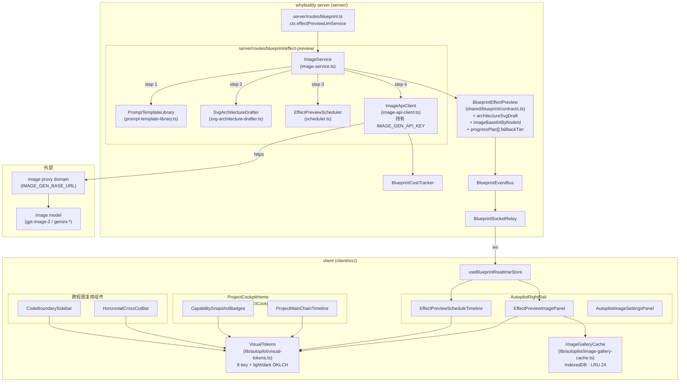
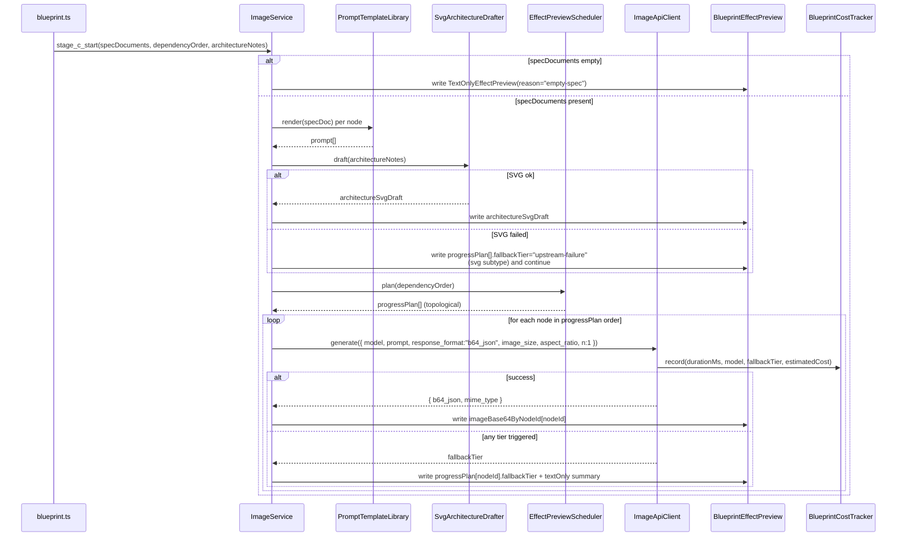

# Design Document

## Overview

`autopilot-image-rendering-and-visual-system` 在工程上由三个并行阶段组成，但在产品语义上只引入一条新的核心架构判断：把 effect preview 的真实图像生成定义为 `Project → Clarification → Spec → Route → Execution → Evidence` 主链中位于 spec 阶段之后的「第三段流水线（Stage C）」，并把它收敛到一条严格四步的 server-side pipeline：

```text
spec_documents → prompt template → SVG architecture draft → schedule plan → gpt-image-2 raster
```

这条决策的关键含义：

- 图像生成不再是与 `intake → clarification → route` 平级的独立能力，也不是 effect preview 内部的某个可选子模块，而是 spec 文档完整后才允许进入的、orchestrator 严格 gate 的下游阶段。
- Stage A `input → clarification → route` 与 Stage B `spec_tree → spec_documents` 是 Stage C 的 hard prerequisite。Stage C 的 orchestrator（`ImageService`）不接受空 spec 输入：`spec_documents` 缺失或为空时，整段 Stage C 直接降级为 `TextOnlyEffectPreview`，不发起任何网络调用。
- Stage C 内部四步是结构化制品流水线：每一步都把上一步的结构化输出作为输入，并把自己的中间制品写到 `BlueprintEffectPreview` 的不同字段，避免「prompt 模板字符串」「SVG 草图字符串」「raster base64」三类制品混入同一字段。
- raster 调用是 Stage C 的最末一步，也是唯一一处真正访问外部图像模型代理域的步骤。前三步都在 whybuddy server 内部完成，浏览器侧不持有任何 image API 凭证。
- 单节点串行：`n` 强制为 `1`，单次只为单个节点出图；批量出图、image edit 多部分上传 `/v1/image/edit`、retry-per-image UI chips 都不在本 spec 范围内。

Phase 2 视觉令牌系统与 Phase 3 主链时间线 / 调度时间线 / 能力角标在数据上不依赖 Phase 1 的图像数据，但在视觉上反过来要求 Phase 1 的客户端组件最终消费 Phase 2 的 `VisualTokens` 取色（见 §「Cross-phase Dependencies & Soft Coupling」）。

参考已验证的浏览器端 image API 协议来源：`docs/assets/imageTest(2).html`。Stage C 的 `ImageApiClient` 与该参考文件保持字段级一致（`model / prompt / response_format / image_size / aspect_ratio / n` 六字段、`Authorization: Bearer` 头、`response_format = "b64_json"`、`json.data[0].b64_json` + `json.data[0].mime_type` 解码、`/v1/images/generations` ↔ `/v1/image/created` 双路径兼容、`AGENT_DOMAIN_MISMATCH` / `OPENAI_IMAGE_EDIT_FAILED` 错误码透传、conic-gradient loading orb、最近 24 张 IndexedDB 历史）。

## Architecture

### High-level Architecture Diagram



### Network Path

```text
client (browser)
   │  REST + Socket.IO (no IMAGE_GEN_API_KEY on the wire)
   ▼
whybuddy server (server/)
   │  ImageApiClient holds IMAGE_GEN_API_KEY
   │  Authorization: Bearer ${IMAGE_GEN_API_KEY}
   ▼
image proxy domain (IMAGE_GEN_BASE_URL)
   ▼
image model (gpt-image-2 / gemini-*)
```

浏览器从不直连 `IMAGE_GEN_BASE_URL`。`AutopilotImageSettingsPanel` 仅展示由 server 下发的脱敏配置摘要（key 仅前 8 + 后 6 字符）。

### Stage C Pipeline Sequence



## Components and Interfaces

> 所有签名以 TypeScript interface 形式给出，命名遵循仓库既有约定（kebab-case 文件 + PascalCase 类型）。

### Server-side: `server/routes/blueprint/effect-preview/`

#### `ImageApiClient` — `image-api-client.ts`

```ts
export type ImageGenModel =
  | "gpt-image-2"
  | "gemini-2.5-flash-image"
  | "gemini-3.1-flash-image-preview"
  | "gemini-3-pro-image-preview";

export type ImageGenSize = "1K" | "2K" | "4K" | "512";
export type ImageGenAspect = "1:1" | "2:3" | "3:2" | "auto";
export type ImageGenPath = "/v1/images/generations" | "/v1/image/created";

export interface ImageApiRequest {
  readonly model: ImageGenModel;
  readonly prompt: string;
  readonly response_format: "b64_json"; // 强制
  readonly image_size: ImageGenSize;
  readonly aspect_ratio: ImageGenAspect;
  readonly n: 1; // 强制
}

export interface ImageApiSuccess {
  readonly kind: "ok";
  readonly b64Json: string;
  readonly mimeType: string;
  readonly durationMs: number;
  readonly model: ImageGenModel;
  readonly upstreamRequestId?: string;
}

export type ImageApiFailureReason =
  | "env-disabled"
  | "key-missing"
  | "timeout"
  | "quota"
  | "moderation"
  | "upstream-failure";

export interface ImageApiFailure {
  readonly kind: "error";
  readonly tier: ImageApiFailureReason;
  readonly upstreamCode?: "AGENT_DOMAIN_MISMATCH" | "OPENAI_IMAGE_EDIT_FAILED" | string;
  readonly errorSummary: string;
  readonly durationMs: number;
}

export type ImageApiResult = ImageApiSuccess | ImageApiFailure;

export interface ImageApiClient {
  /**
   * 发起一次单节点出图调用。永不抛错；任何异常都被翻译为 ImageApiFailure。
   */
  generate(request: ImageApiRequest): Promise<ImageApiResult>;
}
```

文件中 `process.env.IMAGE_GEN_API_KEY` 是唯一读取点；模块级 `getResolvedConfig()` 在初始化时一次性读取所有 `IMAGE_GEN_*` 环境变量并验证。

#### `ImageService` — `image-service.ts`

```ts
import type { BlueprintEffectPreview } from "../../../../shared/blueprint/contracts";

export interface ImageServiceInput {
  readonly missionId: string;
  readonly specDocuments: ReadonlyArray<SpecDocument>;
  readonly dependencyOrder: ReadonlyArray<string>; // nodeId[]
  readonly architectureNotes: ReadonlyArray<string>;
  readonly versionSync: BlueprintEffectPreview["versionSync"];
}

export interface ImageService {
  /**
   * Stage C 入口：依次执行 prompt template → SVG draft → schedule plan → raster。
   * 总是返回一个完整的 BlueprintEffectPreview 制品，即使全部步骤都降级为 textOnly。
   */
  runStageC(input: ImageServiceInput): Promise<BlueprintEffectPreview>;
}
```

`ctx.effectPreviewLlmService`（已在 `server/routes/blueprint.ts` ~L13442 注入）将被扩展为同时持有 `ImageService` 引用，对外暴露 `runStageC`。

#### `PromptTemplateLibrary` — `prompt-template-library.ts`

```ts
export type PromptStyleKey =
  | "system_architecture_diagram" // 默认
  | "ui_mockup"
  | "concept_sketch"
  | "product_hero";

export interface PromptTemplateInput {
  readonly nodeId: string;
  readonly title: string;
  readonly summary: string;
  readonly architectureNotes: ReadonlyArray<string>;
  readonly style?: PromptStyleKey;
}

export interface PromptTemplateLibrary {
  /**
   * 同输入必同输出（确定性）。所有 prompt 以统一 metaPrefix 开头。
   * style 缺失时回退到 "system_architecture_diagram"。
   */
  render(input: PromptTemplateInput): string;
  /** 暴露所有可用风格 key，供面板与测试枚举。 */
  styles(): ReadonlyArray<PromptStyleKey>;
}
```

#### `SvgArchitectureDrafter` — `svg-architecture-drafter.ts`

```ts
export interface SvgArchitectureDrafterInput {
  readonly architectureNotes: ReadonlyArray<string>;
  readonly missionId: string;
}

export type SvgArchitectureDrafterResult =
  | { readonly kind: "ok"; readonly svg: string } // 必含 <svg ...> ... </svg>
  | { readonly kind: "skipped"; readonly reason: string };

export interface SvgArchitectureDrafter {
  draft(input: SvgArchitectureDrafterInput): Promise<SvgArchitectureDrafterResult>;
}
```

#### `EffectPreviewScheduler` — `scheduler.ts`

```ts
export type FallbackTier =
  | "env-disabled"
  | "key-missing"
  | "timeout"
  | "quota"
  | "moderation"
  | "upstream-failure";

export type ProgressPlanState =
  | "pending"
  | "running"
  | "completed"
  | "failed"
  | "text-only";

export interface ProgressPlanEntry {
  readonly nodeId: string;
  readonly state: ProgressPlanState;
  readonly startedAt?: string; // ISO8601
  readonly endedAt?: string;
  readonly fallbackTier?: FallbackTier;
  readonly errorSummary?: string;
}

export interface SchedulerInput {
  readonly dependencyOrder: ReadonlyArray<string>;
}

export interface EffectPreviewScheduler {
  /** 把 dependencyOrder 转换为初始 progressPlan，状态全部为 "pending"，顺序保留 dependencyOrder。 */
  plan(input: SchedulerInput): ReadonlyArray<ProgressPlanEntry>;
  /** 单点失败标记，不影响后续节点。 */
  markFailed(plan: ReadonlyArray<ProgressPlanEntry>, nodeId: string, tier: FallbackTier, summary: string): ReadonlyArray<ProgressPlanEntry>;
  /** 标记成功完成。 */
  markCompleted(plan: ReadonlyArray<ProgressPlanEntry>, nodeId: string): ReadonlyArray<ProgressPlanEntry>;
}
```

### Client-side Components

#### `EffectPreviewImagePanel` — `client/src/components/autopilot/EffectPreviewImagePanel.tsx`

```ts
export interface EffectPreviewImagePanelProps {
  readonly missionId: string;
  readonly activeStageKey: string;
  readonly progressPlan: ReadonlyArray<ProgressPlanEntry>;
  readonly imageBase64ByNodeId: Record<string, NodeImageRecord>;
  readonly architectureSvgDraft?: string;
  readonly visualTokens: VisualTokenSet;
  readonly cache: ImageGalleryCacheHandle;
  readonly onDownload?: (nodeId: string, version: number) => void;
}
```

#### `EffectPreviewScheduleTimeline` — `client/src/components/autopilot/EffectPreviewScheduleTimeline.tsx`

```ts
export interface EffectPreviewScheduleTimelineProps {
  readonly progressPlan: ReadonlyArray<ProgressPlanEntry>;
  readonly dependencyOrder: ReadonlyArray<string>;
  readonly visualTokens: VisualTokenSet;
}
```

#### `AutopilotImageSettingsPanel` — `client/src/components/autopilot/AutopilotImageSettingsPanel.tsx`

```ts
export interface ImageSettingsViewModel {
  readonly baseUrl: string;
  readonly model: string;
  readonly path: string;
  readonly defaultSize: string;
  readonly defaultAspect: string;
  readonly timeoutMs: number;
  readonly maskedApiKey: string | null; // null 表示未配置
}

export interface AutopilotImageSettingsPanelProps {
  readonly settings: ImageSettingsViewModel;
}
```

#### `ProjectMainChainTimeline` — `client/src/components/autopilot/ProjectMainChainTimeline.tsx`

```ts
export type MainChainStepKey =
  | "Project"
  | "Clarification"
  | "Spec"
  | "Route"
  | "Execution"
  | "Evidence";

export type MainChainStepStatus =
  | "pending"
  | "running"
  | "completed"
  | "blocked"
  | "failed";

export interface MainChainStep {
  readonly key: MainChainStepKey;
  readonly status: MainChainStepStatus;
}

export interface ProjectMainChainTimelineProps {
  readonly steps: ReadonlyArray<MainChainStep>; // 长度恒为 6
  readonly activeKey?: MainChainStepKey;
  readonly visualTokens: VisualTokenSet;
}
```

#### `CapabilitySnapshotBadges` — `client/src/components/autopilot/CapabilitySnapshotBadges.tsx`

```ts
export interface CapabilitySnapshotBadge {
  readonly id: "shared-contracts" | "specs" | "capability-bridges" | "runtimes";
  readonly text: string; // 静态文本
}

export interface CapabilitySnapshotBadgesProps {
  readonly badges: ReadonlyArray<CapabilitySnapshotBadge>; // 长度恒为 4
  readonly visualTokens: VisualTokenSet;
}
```

#### `HorizontalCrossCutBar` — `client/src/components/autopilot/HorizontalCrossCutBar.tsx`

```ts
export interface CrossCutNode {
  readonly id: string;
  readonly label: string;
}

export interface HorizontalCrossCutBarProps {
  readonly nodes: ReadonlyArray<CrossCutNode>;
  readonly visualTokens: VisualTokenSet;
}
```

#### `CodeBoundarySidebar` — `client/src/components/autopilot/CodeBoundarySidebar.tsx`

```ts
export interface CodeBoundaryNode {
  readonly nodeId: string;
  readonly title: string;
  readonly codePaths?: ReadonlyArray<string>;
}

export interface CodeBoundarySidebarProps {
  readonly nodes: ReadonlyArray<CodeBoundaryNode>;
  readonly visualTokens: VisualTokenSet;
}
```

### Client-side Modules

#### `VisualTokens` — `client/src/lib/autopilot/visual-tokens.ts`

```ts
export type VisualTokenKey =
  | "entry"
  | "frontend"
  | "backend-core"
  | "ai-capability"
  | "governance"
  | "business-loop"
  | "data-state"
  | "external-integration";

export interface OklchPair {
  readonly light: string; // 必须以 "oklch(" 开头
  readonly dark: string;  // 必须以 "oklch(" 开头
}

export type VisualTokenSet = { readonly [K in VisualTokenKey]: OklchPair };

export const VISUAL_TOKEN_KEYS: ReadonlyArray<VisualTokenKey>; // 长度恒为 8
export const visualTokens: VisualTokenSet;

export function resolveToken(key: VisualTokenKey, theme: "light" | "dark"): string;
```

#### `ImageGalleryCache` — `client/src/lib/autopilot/image-gallery-cache.ts`

```ts
export interface ImageCacheKey {
  readonly nodeId: string;
  readonly version: number;
}

export interface ImageCacheEntry extends ImageCacheKey {
  readonly b64: string;
  readonly mimeType: string;
  readonly storedAt: number; // epoch ms, 用于 LRU
}

export interface ImageGalleryCacheHandle {
  /** 命中则返回 entry 并刷新 storedAt（LRU touch）；未命中返回 null。 */
  get(key: ImageCacheKey): Promise<ImageCacheEntry | null>;
  /** 容量超过 24 时按 storedAt 升序淘汰最早一条。 */
  put(entry: ImageCacheEntry): Promise<void>;
  /** 仅测试与诊断使用。 */
  size(): Promise<number>;
}

export const IMAGE_GALLERY_CACHE_CAP = 24;
```

## Data Models

### Extensions to `BlueprintEffectPreview`

新增字段（追加到 `shared/blueprint/contracts.ts`，保持向后兼容）：

```ts
export interface NodeImageRecord {
  readonly b64: string;
  readonly mimeType: string;
  readonly promptUsed: string;
  readonly generatedAt: string; // ISO8601
}

export interface BlueprintEffectPreview {
  // ...已有字段：progressPlan[], dependencyOrder[], architectureNotes[], versionSync...

  /** SVG 架构草图字符串，独立于 raster 图存储；缺失表示 SVG 阶段未产出有效草图。 */
  readonly architectureSvgDraft?: string;

  /** 节点 ID → 该节点最近一次成功生成的 base64 图像记录。 */
  readonly imageBase64ByNodeId?: Record<string, NodeImageRecord>;

  /** 任意 fallback 触发后写入；与 progressPlan[].fallbackTier 配合，构成最终 textOnly 兜底视图。 */
  readonly textOnlyEffectPreview?: {
    readonly active: boolean;
    readonly reason: FallbackTier | "empty-spec";
    readonly errorSummary?: string;
  };
}

// progressPlan 元素扩展 fallbackTier 字段（见 ProgressPlanEntry）。
```

### `ImageGenConfig` (env schema)

```ts
export interface ImageGenConfig {
  readonly apiKey: string | null; // process.env.IMAGE_GEN_API_KEY
  readonly baseUrl: string;       // process.env.IMAGE_GEN_BASE_URL
  readonly model: ImageGenModel;  // process.env.IMAGE_GEN_MODEL
  readonly path: ImageGenPath;    // process.env.IMAGE_GEN_PATH
  readonly defaultSize: ImageGenSize;     // process.env.IMAGE_GEN_DEFAULT_SIZE
  readonly defaultAspect: ImageGenAspect; // process.env.IMAGE_GEN_DEFAULT_ASPECT
  readonly timeoutMs: number;             // process.env.IMAGE_GEN_TIMEOUT_MS
}
```

| 变量 | 必填 | 默认 | 说明 |
| --- | --- | --- | --- |
| `IMAGE_GEN_API_KEY` | 否（缺失即触发 `key-missing` 降级） | — | 仅服务端读取，绝不返回到客户端响应。 |
| `IMAGE_GEN_BASE_URL` | 是 | — | 代理域，例如 `https://image-proxy.example.com`。 |
| `IMAGE_GEN_MODEL` | 否 | `gpt-image-2` | 必须在四元枚举内。 |
| `IMAGE_GEN_PATH` | 否 | `/v1/images/generations` | 仅 `"/v1/images/generations"` 与 `"/v1/image/created"` 两值。 |
| `IMAGE_GEN_DEFAULT_SIZE` | 否 | `1K` | 枚举 `"1K" \| "2K" \| "4K" \| "512"`。 |
| `IMAGE_GEN_DEFAULT_ASPECT` | 否 | `1:1` | 枚举 `"1:1" \| "2:3" \| "3:2" \| "auto"`。 |
| `IMAGE_GEN_TIMEOUT_MS` | 否 | `60000` | 整数毫秒，必须 > 0。 |

`AUTOPILOT_REAL_RUNTIME=false` 或 server 端检测到 `process.env.IMAGE_GEN_DISABLED === "true"` 时直接走 `env-disabled` 降级，作为最优先 tier。


## Correctness Properties

*A property is a characteristic or behavior that should hold true across all valid executions of a system — essentially, a formal statement about what the system should do. Properties serve as the bridge between human-readable specifications and machine-verifiable correctness guarantees.*

### Property 1: PromptTemplateLibrary determinism

*For any* `PromptTemplateInput`, calling `PromptTemplateLibrary.render(input)` twice in succession should return strictly equal strings; any input whose `style` is omitted should produce a string equal to the same input with `style="system_architecture_diagram"` explicitly set; and every produced string should start with the same `metaPrefix` constant.

**Validates: Requirements 2.2, 2.3, 2.4**

### Property 2: ImageApiClient request body schema validity

*For any* `ImageApiRequest` constructed by `ImageService` from any `ImageServiceInput`, the outgoing HTTP request body should contain exactly the six keys `model`, `prompt`, `response_format`, `image_size`, `aspect_ratio`, `n`; `model` should be in the four-model enum; `image_size` should be in `{"1K","2K","4K","512"}`; `aspect_ratio` should be in `{"1:1","2:3","3:2","auto"}`; `response_format` should equal `"b64_json"`; `n` should equal `1`; the `Authorization` header should match `^Bearer .+$`; and the request URL should end with `/v1/images/generations` when `IMAGE_GEN_PATH` is unset or default and end with `/v1/image/created` when `IMAGE_GEN_PATH="/v1/image/created"`.

**Validates: Requirements 1.4, 5.1, 5.2, 5.3, 5.4, 5.5**

### Property 3: ImageApiClient response round-trip

*For any* synthetic upstream response of the form `{ data: [{ b64_json, mime_type }] }` with arbitrary base64 string and arbitrary mime type, calling `ImageApiClient.generate` should return an `ImageApiSuccess` whose `b64Json` equals the input `b64_json` and whose `mimeType` equals the input `mime_type`; and the resulting `BlueprintEffectPreview.imageBase64ByNodeId[nodeId]` should carry the same `b64` and `mimeType` values.

**Validates: Requirements 5.6, 8.1**

### Property 4: 6-tier fallback ordering — no tier skipped, highest-priority match wins

*For any* failure scenario `S` (an arbitrary subset of `{env-disabled, key-missing, timeout, quota, moderation, upstream-failure}`), the `fallbackTier` written to `BlueprintEffectPreview.progressPlan[nodeId]` should equal the first element of the canonical sequence `["env-disabled", "key-missing", "timeout", "quota", "moderation", "upstream-failure"]` that is contained in `S`; when `S = ∅` no `fallbackTier` should be written; when `IMAGE_GEN_API_KEY` is absent the outgoing HTTP request count should be exactly `0`; when `S` contains `moderation` and the run completes, the outgoing HTTP request count for that node should be at most `1`; and when the upstream returns `AGENT_DOMAIN_MISMATCH` or `OPENAI_IMAGE_EDIT_FAILED`, the chosen tier should be `upstream-failure` and the original code should appear verbatim in `errorSummary`.

**Validates: Requirements 5.7, 6.1, 6.2, 6.3, 6.4, 6.5**

### Property 5: Scheduler topological ordering and per-node fault isolation

*For any* `dependencyOrder: string[]`, `EffectPreviewScheduler.plan({ dependencyOrder })` should return a `progressPlan` whose `nodeId` sequence equals `dependencyOrder`; for any subset `F ⊆ dependencyOrder` of nodes whose image generation fails, after running the full pipeline every node in `dependencyOrder \ F` should reach state `completed` or `text-only`, and every node in `F` should be marked `failed` with a non-empty `fallbackTier`; for any empty or undefined `specDocuments`, the resulting `BlueprintEffectPreview.textOnlyEffectPreview.active` should be `true` with `reason="empty-spec"` and zero outgoing HTTP requests; and for any successful run the `architectureSvgDraft` field and `imageBase64ByNodeId` field should be disjoint (the SVG string never appears as a value inside `imageBase64ByNodeId`, and vice versa).

**Validates: Requirements 1.1, 1.2, 1.3, 3.3, 4.1, 4.2, 4.3**

### Property 6: ImageGalleryCache LRU 24-cap

*For any* sequence of `put` operations applied to a fresh `ImageGalleryCache`, the resulting cache size should be at most `24`; whenever a put causes overflow, the entry evicted should be the entry with the smallest `storedAt`; and for any `(nodeId, version)` key, calling `get` immediately after a `put` of the same key should return a non-null entry whose fields equal the put entry's fields, while a `get` of a key never put or already evicted should return `null`.

**Validates: Requirements 9.3, 9.4**

### Property 7: Filename generation determinism

*For any* `nodeId: string`, `version: number`, and `timestamp: string` produced by the download handler, the generated filename should equal `` `effect-preview-${nodeId}-v${version}-${timestamp}.png` `` exactly; and for any `BlueprintEffectPreview.imageBase64ByNodeId` containing `N` distinct `nodeId` keys, the gallery DOM rendered by `EffectPreviewImagePanel` should contain exactly `N` group elements, each with a `data-node-id` attribute equal to one of those keys, with no group element shared between two different `nodeId` values.

**Validates: Requirements 8.2, 8.3**

### Property 8: VisualTokens light/dark variant completeness and OKLCH format

*For any* `VisualTokenKey` in `VISUAL_TOKEN_KEYS` (which has length exactly `8`), `visualTokens[key].light` and `visualTokens[key].dark` should both be defined non-empty strings starting with the literal prefix `"oklch("` and ending with `")"`; for any `theme ∈ {"light","dark"}`, `resolveToken(key, theme)` should equal `visualTokens[key][theme]`; and for any consumer component among `EffectPreviewImagePanel`, `EffectPreviewScheduleTimeline`, `ProjectMainChainTimeline`, `CapabilitySnapshotBadges`, `HorizontalCrossCutBar`, `CodeBoundarySidebar`, switching the active theme between `"light"` and `"dark"` without remount should result in computed inline style colors that equal `resolveToken(...)` of the new theme.

**Validates: Requirements 11.1, 11.2, 11.3, 11.4, 12.2, 13.3, 15.4, 16.3, 17.1**

### Property 9: Masked API key display correctness

*For any* string `apiKey` with `apiKey.length >= 14`, `AutopilotImageSettingsPanel` should render a masked text whose first `8` characters equal `apiKey.slice(0, 8)`, whose last `6` characters equal `apiKey.slice(-6)`, and whose middle characters (positions `8 .. length-6`) are all equal to a single mask character (e.g. `"•"`) and whose count equals `apiKey.length - 14`; for any `apiKey.length < 14` the panel should render the literal `"未配置"` and disable the manual retry button.

**Validates: Requirements 10.2, 10.3**

### Property 10: ProjectMainChainTimeline state-to-class mapping & step ordering

*For any* `steps: MainChainStep[]` of length `6`, the rendered DOM should contain step labels in the exact sequence `["Project","Clarification","Spec","Route","Execution","Evidence"]`; for any step status `s ∈ {"pending","running","completed","blocked","failed"}`, the rendered class for that step should equal a deterministic mapping `statusClass[s]` (no two statuses share a class); and at most one step should carry the `is-active` class at any time.

**Validates: Requirements 14.1, 14.2, 14.3**

## Error Handling

### Fallback Tier Mapping

| Tier | 触发条件 | 用户面文案 (`AutopilotImageSettingsPanel` / `EffectPreviewImagePanel`) | 审计日志条目 (`BlueprintCostTracker.record`) |
| --- | --- | --- | --- |
| `env-disabled` | `AUTOPILOT_REAL_RUNTIME=false` 或 `IMAGE_GEN_DISABLED=true` | 「图像生成已在环境中关闭，effect preview 仅展示文本摘要」 | `{ tier:"env-disabled", durationMs:0, model:null, estimatedCost:0 }` |
| `key-missing` | `IMAGE_GEN_API_KEY` 未配置 | 「未检测到 API key，请联系运维补齐 IMAGE_GEN_API_KEY」 | `{ tier:"key-missing", durationMs:0, model:cfg.model, estimatedCost:0 }` |
| `timeout` | 请求耗时 > `IMAGE_GEN_TIMEOUT_MS` 被 abort | 「图像生成超时，已退回文本预览」 | `{ tier:"timeout", durationMs:cfg.timeoutMs, model:cfg.model }` |
| `quota` | 上游返回 `429` / `quota_exceeded` 等额度类错误 | 「当前账号额度已用尽，effect preview 暂用文本展示」 | `{ tier:"quota", durationMs, model, upstreamCode }` |
| `moderation` | 上游返回内容审核拒绝 | 「内容被审核拒绝，已跳过该节点出图（不重试）」 | `{ tier:"moderation", durationMs, model, upstreamCode }` |
| `upstream-failure` | 任何其它非预期失败，包括 `AGENT_DOMAIN_MISMATCH` 与 `OPENAI_IMAGE_EDIT_FAILED` | 「上游图像服务异常，effect preview 已退回文本」 | `{ tier:"upstream-failure", durationMs, model, upstreamCode }` |

`AGENT_DOMAIN_MISMATCH` 与 `OPENAI_IMAGE_EDIT_FAILED` 都会被分类为 `upstream-failure`，但 `errorSummary` 字段会保留原 upstream code 字面量；`AutopilotImageSettingsPanel` 在检测到 `AGENT_DOMAIN_MISMATCH` 时额外提示「请确认 IMAGE_GEN_BASE_URL 与当前 key 绑定的代理域一致」。

### Tier 优先级

`ImageService` 在每个节点处理前按 `["env-disabled", "key-missing", "timeout", "quota", "moderation", "upstream-failure"]` 顺序逐项尝试匹配；高优先级 tier 一旦命中立即写入并跳过后续 tier 判断。`moderation` 命中后该节点的 `progressPlan[nodeId]` 终态为 `failed`，且当次 mission 内不重试。

## Testing Strategy

复用项目既有 Vitest + fast-check 模式（见 `server/tests/`、`client/src/lib/**/*.test.ts`、`shared/**/*.property.test.ts`）。所有 PBT 至少跑 `100` 次迭代（`fc.assert(prop, { numRuns: 100 })`），每个 property test 必须以 `Feature: autopilot-image-rendering-and-visual-system, Property <n>: <text>` 形式打 tag。

### Test Files

#### Server-side

- `server/routes/blueprint/effect-preview/__tests__/image-api-client.property.test.ts`
  - Property 2 — request body schema validity（fast-check 任意 `ImageApiRequest`，断言 6 字段、enum、Bearer 头、URL 后缀）。
  - Property 3 — response round-trip（fast-check 合成 `{data:[{b64_json, mime_type}]}`，断言解码字段一致）。
  - Property 4 (subset) — `key-missing` 时 0 outgoing 请求；`AGENT_DOMAIN_MISMATCH` / `OPENAI_IMAGE_EDIT_FAILED` 透传到 `errorSummary` 且 `tier="upstream-failure"`；`moderation` 命中后请求次数 ≤ 1。
- `server/routes/blueprint/effect-preview/__tests__/image-service.test.ts`
  - 例子级集成测试：empty `specDocuments` 跳过 Stage C；四步顺序固定；`architectureSvgDraft` 与 `imageBase64ByNodeId` 字段不互相污染；BlueprintCostTracker 调用次数等于 outgoing 请求次数。
- `server/routes/blueprint/effect-preview/__tests__/prompt-template-library.property.test.ts`
  - Property 1 — 确定性、默认风格回退、统一 metaPrefix 前缀。
- `server/routes/blueprint/effect-preview/__tests__/scheduler.property.test.ts`
  - Property 5 — `progressPlan.nodeId[]` 等于 `dependencyOrder`；任意失败子集 `F` 下，非 `F` 节点状态 ∈ `{completed, text-only}`；`F` 节点 `fallbackTier` 非空。

#### Client-side

- `client/src/lib/autopilot/__tests__/visual-tokens.test.ts`
  - Property 8 — 8-key 完整性、`oklch(` 前缀、`resolveToken(key, theme)` 一致性。
- `client/src/components/autopilot/__tests__/EffectPreviewImagePanel.test.tsx`
  - 例子 — `activeStageKey="effect_preview"` 下渲染、loading orb 存在性、download 文件名命名（Property 7）。
  - Property 7 — 任意 `imageBase64ByNodeId` 输入下 group 唯一映射。
- `client/src/components/autopilot/__tests__/ProjectMainChainTimeline.test.tsx`
  - Property 10 — 6 步顺序、状态映射、单一 active。
- `client/src/components/autopilot/__tests__/image-gallery-cache.property.test.ts`
  - Property 6 — 任意 put 序列下 size ≤ 24、LRU 淘汰最早 entry、get 一致性。

### Property tagging convention

```ts
import fc from "fast-check";

it(
  "Feature: autopilot-image-rendering-and-visual-system, Property 2: request body schema validity",
  () => {
    fc.assert(
      fc.property(arbitraryImageApiRequest(), (req) => { /* ... */ }),
      { numRuns: 100 },
    );
  },
);
```

### What is intentionally NOT property-tested

| 非 PBT 项 | 测试方式 | 原因 |
| --- | --- | --- |
| ProjectCockpitHome 挂载位置（R14.4） | 静态 grep 测试 | 单次结构性断言，与输入无关。 |
| 客户端不持有 `IMAGE_GEN_API_KEY`（R7.2、R7.4） | 静态 grep + 网络 contract 测试 | 静态约束，PBT 无增量价值。 |
| 4 个 PromptStyleKey 暴露（R2.1）、4 个角标（R16.1）、4 个 model 枚举存在性 | 单元 example 测试 | 存在性断言，固定枚举。 |
| FLIP 动画（R15.3） | 例子级 framer-motion mock | 视觉/交互行为，难以属性化。 |
| 文件命名约定（R18.x） | 仓库级 lint / CI grep | 静态目录与命名约束。 |

## Cross-phase Dependencies & Soft Coupling

Phase 1 和 Phase 3 的可视化组件 *最终* 必须消费 Phase 2 的 `VisualTokens`，但 Phase 2 在 DAG 中可与 Phase 1/3 并行实现。为避免阻塞，引入「单一替换点占位常量」策略：

```ts
// client/src/lib/autopilot/visual-tokens-placeholder.ts
// Phase 2 上线前由 Phase 1/3 组件临时引用；Phase 2 上线后整体重导出 visualTokens 即可切换。
export { visualTokens, resolveToken, VISUAL_TOKEN_KEYS, type VisualTokenKey, type VisualTokenSet } from "./visual-tokens";
// 在 Phase 2 之前，visual-tokens.ts 内部用 8-key × light/dark 的占位 OKLCH 常量实现，结构与最终一致；
// Phase 2 替换的是 visual-tokens.ts 的内部数值，不动外部 import 路径。
```

约束：

- Phase 1/3 组件 `import { visualTokens, resolveToken } from "@/lib/autopilot/visual-tokens-placeholder"`，不直接 import `./visual-tokens`。
- 占位常量与最终 `VisualTokens` 共享同一组 `VISUAL_TOKEN_KEYS`、同一组 `OklchPair` 结构；Phase 2 仅替换数值。
- 单一替换点：当 Phase 2 完成后，删除 `visual-tokens-placeholder.ts` 并把其 7 处 import 改为 `from "@/lib/autopilot/visual-tokens"` 即可一次性收敛。
- 静态约束：Phase 1/3 组件源码不得出现 `#`、`rgb(`、`hsl(`、`oklch(` 字面量（属性 P8 的相关静态扫描在 CI 中执行）。

数据流上的硬依赖关系：

| 来源 | 消费者 | 字段 |
| --- | --- | --- |
| `BlueprintEffectPreview.progressPlan[]`（Phase 1 写入） | `EffectPreviewScheduleTimeline`（Phase 3） | `state`, `fallbackTier`, `startedAt/endedAt` |
| `BlueprintEffectPreview.dependencyOrder[]`（Phase 1 写入） | `EffectPreviewScheduleTimeline`（Phase 3） | 整个数组 |
| `BlueprintEffectPreview.imageBase64ByNodeId`（Phase 1 写入） | `EffectPreviewImagePanel`（Phase 1） | `b64`, `mimeType` |
| `VisualTokens`（Phase 2 写入） | Phase 1 / Phase 3 全部组件 | 全部 8 keys × {light, dark} |

## Non-Goals

以下显式 *不在* 本 spec 范围内：

1. **`/v1/image/edit` 多部分上传 / 参考图编辑链路** — 留给后续独立 spec；本 spec 仅实现文生图 `/v1/images/generations` 与兼容 `/v1/image/created`。
2. **`MermaidBlock` 重写或主题升级** — 该组件归属现有 `autopilot-mermaid-diagram-rendering` spec，本 spec 不修改 `client/src/pages/autopilot/right-rail/streaming-doc/MermaidBlock.tsx`。
3. **逐张图像的 retry-per-image UI chips** — 单点失败按制品级降级 + textOnly 兜底，不暴露用户层 retry 按钮；如需要再开 spec。
4. **批量出图（`n > 1`）** — `n` 在 Stage C 内永远固定为 `1`，批量场景留给 EffectPreviewScheduler 的串行编排。
5. **客户端直连图像模型代理域** — 浏览器侧禁止持有 `IMAGE_GEN_API_KEY`，禁止任何 client → image proxy 直连。
6. **VisualTokens 之外的设计系统重写** — 主题切换与既有 `--font-display` / `--font-mono` / glass-panel 工具类保持原状。
7. **`ProjectMainChainTimeline` 接入真实 Project 状态源的数据写入** — 本 spec 只负责组件渲染契约；状态源由 `project-domain-model` / `project-cockpit-home` spec 提供。
8. **历史图像 IndexedDB 之外的持久化** — `ImageGalleryCache` 仅做客户端最近 24 张缓存，不做服务端图像归档；服务端持久化由 `BlueprintEffectPreview` 制品壳承担。
