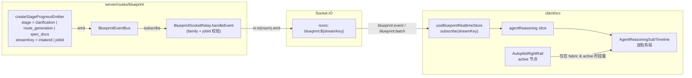
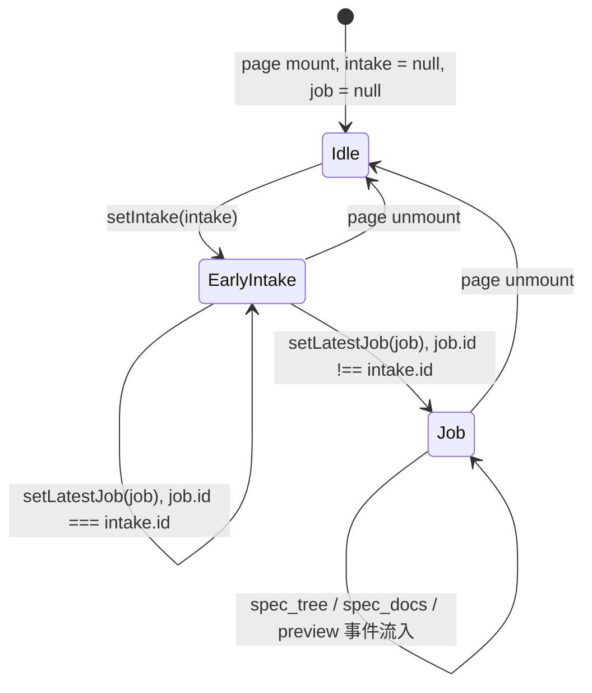

# 设计文档：Autopilot 流式体验补完

## 概述

本设计在不改动事件源（`agent-reasoning-bridge.ts`、`callback-receiver.ts`、`lite-agent-runtime.ts`、`llm-call.ts`）的前提下，把已经存在的脚手架按下面四条主线接通：

1. **订阅时机修复**：在 `AutopilotRoutePage` 内引入“intakeId 早订阅 → jobId 晚切换”的两段式订阅生命周期，覆盖 clarification / route_generation 阶段；
2. **子时间线挂载**：把现有 `AgentReasoningSubTimeline` 真正渲染进 `AutopilotRightRail` 的 active 节点；
3. **Relay 不丢事件**：移除 `BlueprintSocketRelay.handleEvent` 中“房间为空就 return”的早返回，让事件依靠 socket.io 的 `to(room).emit` 自动路由；
4. **死锁兜底契约**：把 `forceAdvance` 5 分钟超时与 spec_tree“禁止自动推进”这两条已经存在的实现以测试形式锁定，并在文档里说明契约。

整套改动只触达：

- `server/routes/blueprint/socket-relay.ts`（一行 if 判断 + 注释；不改公开类型）
- `client/src/pages/autopilot/AutopilotRoutePage.tsx`（两段式订阅 useEffect + 调用顺序）
- `client/src/pages/autopilot/right-rail/AutopilotRightRail.tsx`（确认 active 节点已经渲染 `AgentReasoningSubTimeline`，必要时补条件渲染说明）
- `client/src/pages/autopilot/right-rail/hooks/use-auto-advance.ts`（仅作为契约对象，不改实现，写测试覆盖）
- 新增最少量的 example-based vitest 用例（不扩张 PBT，不扩张 5140+ 既有测试）。

## 架构

### 端到端事件流



关键事实：

- 服务端发射器在 clarification / route_generation 阶段以 `intake.id` 作为 `event.jobId`（即“stream key”），spec_docs 阶段以 `BlueprintGenerationJob.id` 作为 stream key。
- 前端 socket join 的 room 名只取决于 `subscribe(streamKey)` 传入的字符串，与“它是 intakeId 还是 jobId”无关。
- 所以**修复点是前端的订阅生命周期，不是服务端的事件键**。

### 订阅生命周期状态机



切换 `EarlyIntake → Job` 时：

1. 先 `unsubscribe()` 当前 intake room；
2. 把 `agentReasoning` 切片重置为初始空态（`subscribe(jobId)` 内部已经实现这一步，见 `blueprint-realtime-store.ts` 的 `subscribe` 分支）；
3. 再 `subscribe(jobId)`。

> 注：现有 `useBlueprintRealtimeStore.subscribe` 已经在 `state.subscribedJobId !== jobId` 时先 `unsubscribe` 再切换，并清空 `agentReasoning` 切片。所以前端只需要保证“先用 intakeId、后用 jobId”这一条调用顺序，不需要新加 store action。

## 组件与接口

### 1. `AutopilotRoutePage`：两段式订阅 useEffect

替换当前唯一的“仅订阅 latestJob.id”的 useEffect，改为：

```tsx
// 中文 JSDoc：autopilot-streaming-experience 流式订阅生命周期
const subscribeToJob = useBlueprintRealtimeStore(s => s.subscribe);
const unsubscribeFromJob = useBlueprintRealtimeStore(s => s.unsubscribe);

useEffect(() => {
  // 优先使用 jobId，没有 jobId 时退回到 intakeId
  const streamKey = latestJob?.id ?? intake?.id ?? null;
  if (!streamKey) return;
  subscribeToJob(streamKey);
  return () => {
    // 当 streamKey 改变（intake → job 切换）或组件卸载时退订
    unsubscribeFromJob();
  };
}, [latestJob?.id, intake?.id, subscribeToJob, unsubscribeFromJob]);
```

要点：

- 用 `latestJob?.id ?? intake?.id` 派生唯一 streamKey，让 React 在依赖变化时自然走 cleanup → 重新订阅；
- `subscribe` 内部已经按 jobId 比较做幂等，因此 `intake.id === latestJob.id` 这种极少见的退化也不会双订阅；
- 不在 `setLatestJob` 处显式调用 `subscribe`，让派生关系单向。

### 2. `AutopilotRightRail`：active 节点渲染 `AgentReasoningSubTimeline`

当前 `AutopilotRightRail.tsx` 已经在 active 子阶段卡片内调用 `<AgentReasoningSubTimeline locale={locale} />`，但 `AgentReasoningSubTimeline` 在 `entries.length === 0` 时返回 `null`，加上之前订阅时机错位，导致用户**看到的还是空 active 节点**。本规格不重写双轨渲染，只保证：

- `AgentReasoningSubTimeline` 在 `currentStage !== "fabric"` 时不被挂载（已有逻辑，需在测试中覆盖）；
- `AgentReasoningSubTimeline` 在 `entries.length === 0 && status === "idle"` 时返回 `null`，避免占位空容器；
- 在 `entries.length > 0` 时渲染左轨 thinking、右轨 acting+observing、跨双轨横幅 error+completed（已有实现）。

测试需要覆盖的渲染语义见 `tasks.md` 任务 2.x。

### 3. `BlueprintSocketRelay`：移除“房间为空就丢”的早返回

`socket-relay.ts` 当前在 `handleEvent` 内部、批量推送的 `flushBatch` 内部各有一处早返回：

- `flushBatch` 内的早返回是合理的：批量缓冲只在已有过订阅但 socket 离开后才会有数据，丢弃缓冲不会造成订阅前事件丢失。保留。
- `handleEvent` 内单条事件路径上的早返回（约第 200 行附近）是**bug**：它在订阅前一瞬间到达的事件会被静默丢掉。修复方案：

```ts
// 修改前
const room = `blueprint:${event.jobId}`;
const roomSockets = io.sockets.adapter.rooms.get(room);
if (!roomSockets || roomSockets.size === 0) return;

// 修改后（中文注释 + 直接 emit，让 socket.io 自行处理空房间）
const room = `blueprint:${event.jobId}`;
// autopilot-streaming-experience：不再因为房间当前为空就丢弃事件。
// 单条事件直接 io.to(room).emit，Socket.IO 在 room 没有订阅者时会自然忽略，
// 不会阻塞后到达的 socket。批量缓冲路径仍保留 flushBatch 中的空房间裁剪。
```

要点：

- 不动家族过滤（`role / capability / crew / job / evidence / sandbox`）与 `isValidJobId` 校验；
- 不动 capability 家族走批量聚合的分支；
- 该改动让需求 1 的“intake 早订阅”窗口期事件可以稳定到达。

### 4. `useAutoAdvance`：契约对象，不改实现

当前实现已经满足需求 4（5 分钟前端超时）与需求 5（spec_tree 不自动推进）。本设计仅：

- 在 `tasks.md` 中以 example-based 测试锁定行为；
- 在 `use-auto-advance.ts` 内部对应代码块上方补一行中文注释，引用本规格名称，方便后续维护者识别契约来源（不改可观测行为）。

## 数据模型

本规格不引入新的持久化模型与共享 contracts。涉及的数据均为内存中的 store slice 与短期事件：

| 数据 | 来源 | 生命周期 |
| --- | --- | --- |
| `agentReasoning.entries` | `blueprint-realtime-store.ts` | 订阅期间 FIFO 截断到 ≤500 条 |
| `agentReasoning.status` | 同上 | 由 `iteration_started / completed / error` 推导 |
| `agentReasoning.currentIteration` | 同上 | 由 `iteration_started` 推动 |
| `subscribedJobId` | 同上 | 与当前 streamKey 绑定 |
| `BatchBuffer` | `socket-relay.ts` | 100ms 窗口 / 10 条上限 |

## Error Handling

- **订阅切换失败**：`subscribe` 已经包含 connect / disconnect 监听，断网时把 `connectionState` 切成 `disconnected`，重连时自动 emit `blueprint:subscribe`；本规格不增加新的错误处理路径。
- **Relay 推送失败**：`io.to(room).emit` 在房间为空时是 no-op，不抛错。修复后无需 try/catch。
- **forceAdvance 5 分钟超时**：已在 `use-auto-advance.ts` 内通过 `setTimeout + timedOut` 标志保护；超时后即使后端最终返回也会被 `timedOut` 拦截，不会触发 `onAdvanced`。
- **spec_tree 状态错位**：由 `useAutoAdvance` 的 effect 早返回兜底；测试需要覆盖 `stage === "spec_tree"` 与 `status ∈ {running, reviewing, completed}` 三种取值。
- **组件卸载**：`use-auto-advance.ts` 已经维护 `mountedRef`；测试需要在 `act(() => unmount())` 之后断言不再调用 `set*`。

## 测试策略

### 测试形态

- 仅采用 example-based vitest 用例。
- 服务端测试用 `BlueprintEventBus` mock + 内存 socket.io 端到端 emit 验证。
- 前端测试用 `@testing-library/react` 渲染 `AutopilotRightRail` 与 `AutopilotRoutePage` 的最小子树，store 通过 `__setSocket` 注入 mock。

### 必要回归用例

1. **Relay 不丢事件**：构造 `BlueprintSocketRelay`，不让任何 socket join 房间，直接 emit 一条 role.agent.thinking → 期望 `io.to(room).emit` 被调用一次（用 mock io）；再 join 后 emit 第二条 → 期望该 socket 收到第二条。
2. **订阅生命周期**：渲染 `AutopilotRoutePage` 的最小壳，先 `setIntake({id: "I1"})` → `subscribe("I1")` 被调用；再 `setLatestJob({id: "J1"})` → 先 `unsubscribe()` 再 `subscribe("J1")`，且 `agentReasoning.entries` 被清空。
3. **子时间线挂载条件**：`currentStage = "fabric"` 且 active 节点存在时，`AgentReasoningSubTimeline` 被挂载；`currentStage = "input"` 时不被挂载。
4. **forceAdvance 超时**：用 `vi.useFakeTimers` 把 `advance` 阻塞 5 分零 1 秒，断言 `advancing` 重置为 `false`、`error.status === 408`、未调用 `onAdvanced`。
5. **spec_tree 不自动推进**：`stage === "spec_tree"`、`status` 取 `running | reviewing | completed` 时 effect 都不调用 `generateBlueprintSpecDocuments`；`forceAdvance` 触发后才调用。

### 手动验证清单

| 阶段 | 期望看到 |
| --- | --- |
| clarification | 输入仓库 URL → 在子时间线左轨看到“正在分析仓库目录结构”等 thinking 条目 |
| route_generation | 提交澄清答案 → 在子时间线右轨看到 acting / observing 条目 |
| spec_tree | active 节点展示节点列表 + 子时间线，5 分钟内不自动推进到 spec_docs |
| spec_docs | 点击“确认 SPEC 树并生成规格文档”→ 子时间线持续接收事件，最终 completed 横幅 |

### 测试集与基线守门

- 新增用例总数控制在 ≤8 个，避免触发 5140+ 测试集的整体抖动；
- 不修改 `agent-reasoning-bridge.test.ts`、`callback-receiver.test.ts`、`lite-agent-runtime.test.ts`、`llm-call.test.ts`；
- `node --run check` 在改动后错误数维持 ≤113。

## 关键决策与取舍

| 决策 | 选择 | 理由 |
| --- | --- | --- |
| 订阅时机方案 | A：intakeId 早订阅 → jobId 切换 | 最小代价复用现有 emitter 的 stream key；B 需要新增 SSE/轮询通道与归并；C 直接放弃 clarification 可见性 |
| Relay 改动范围 | 只改 `handleEvent` 单条路径 | 批量路径的早返回是合理裁剪，不影响订阅前事件 |
| `useAutoAdvance` | 不动实现，仅以测试锁定 | 现实现已经满足需求；任何改写都会扩大 PR 风险面 |
| 子时间线渲染位置 | 仅在 fabric+active 节点内 | 避免与右栏其它阶段争抢空间，不需要单独路由 |
| PBT | 不采用 | 用户明确要求 example-based；本规格涉及面均为 wiring 与时序，PBT 价值低 |

## 不做的事

- 不为 clarification / route_generation 引入第二条 SSE / 轮询通道。
- 不在 `BlueprintSocketRelay` 内引入“订阅前事件缓存”机制（成本高、收益低，依赖 `intakeId` 早订阅就足够）。
- 不修改 `agentReasoning` slice 的现有派生规则与 cap=500。
- 不改 `BLUEPRINT_AGENT_REASONING_STREAM_ENABLED` 默认值；保留 `BUILD_TARGET=test` 时强制为 false 的既有约束。
- 不重做 `AgentReasoningSubTimeline` 的视觉与动画。

## 后续增强：观察行携带真实事实（reasoning-detail 2026-05-31）

> 配合 `whybuddy-3d-real-role-driven-scene-2026-05-29` reasoning-detail：前端
> `ReasoningCard` 已从「fallback 选一个字段」升级为「每个存在字段各自成行」。为了
> 让推理流不只是更会排版、而是真的更有信息量，本规格的 stage-progress-emitter
> 调用点同步把**已经算出来的真实事实**塞进观察行（不造任何假步骤、假数据）：

- `route_generation`：`observing(true, ...)` 文案从「生成了 N 条候选路线」升级为
  附带真实路线标题列表「生成了 N 条候选路线：主路线 / 保守路线 / ...」；`completed`
  文案也带上条数。事实来源：`result.routeSet.routes[].title`。
- `spec_tree`：`thinking` 文案带上真实被选中的路线标题
  （`input.selectedRoute.title`）；`observing(true, ...)` 从「N 个节点」升级为附带
  真实节点类型分布「N 个节点（route_step×4 · spec_document×26；model=...）」，由
  `derivationResult.tree.nodes[].type` 现场聚合得到。

约束与不变量：
- 仍然只发既有的 `role.agent.thinking | acting | observing | completed` 事件，
  不新增事件类型、不新增 stage、不改 stream key，因此本规格需求 1–5 的订阅时机 /
  relay / 子时间线挂载 / spec_tree 不自动推进契约全部不受影响。
- 前端去重键是 `${jobId}:${iteration}:${phase}:${timestamp}`，phase 不同的四条
  事件天然不冲突；本次只丰富每条事件的真实文案，不靠同 phase 重复发事件刷条数。
- 「条数更多」（把单阶段拆成更细的多轮 thinking/acting/observing）属于更大的
  emitter 改造，本节为 reasoning-detail Wave 1（仅做「每条更有料」）的历史记录；
  Wave 2 在下一节里补「每阶段拆出第二轮 ReAct」的实现，请把两节串起来读，本节
  最后一行不再代表当前最新边界。


## 进一步增强：每阶段拆出第二轮 ReAct（reasoning-detail Wave 2 / 2026-05-31）

在「每条事件更有料」之上，再让 `route_generation` 和 `spec_tree` 各自显式拆出**第二轮**
真实 ReAct（thinking → acting → observing），让用户看到的不只是"做了一件事"，而是
"做完之后又做了对应的形态分析"。这一轮**完全基于已经算出来的真实数据**，不造步骤：

- `route_generation` 第二轮（仅在路线集非空时进入）：
  - `nextIteration()` 推进迭代号（前端显示成 `#2`）。
  - `thinking`：「正在评估候选路线的复杂度与成本分布，标记主路线和备选路线...」。
  - `acting`：`blueprint.route_set.analyze`（虚拟工具 id，标识"对路线集的分析"，
    不发起任何外部调用，只读 `generatedRoutes`）。
  - `observing(true, ...)`：把 `routes[].kind` / `complexity` / `costLevel` 现场聚合
    成「主路线「X」（balanced · cost=medium）；2 条备选；复杂度分布 balanced×2 · light×1」。
- `spec_tree` 第二轮（仅在派生出非空 root branches 时进入）：
  - `nextIteration()` 推进迭代号。
  - `thinking`：「正在分析派生出的 SPEC 树结构（共 N 个节点），统计根节点分支与最大深度...」。
  - `acting`：`blueprint.spec_tree.analyze`（虚拟工具 id，仅读 `derivedNodes`）。
  - `observing(true, ...)`：通过 `parentId` 链算出 `rootChildren` 与最大深度，输出
    「根节点下 N 条主分支：A / B / C；最大深度 K 层」（≤6 条节选 + 溢出折叠）。

不变量：
- 仍只用既有 `role.agent.thinking | acting | observing | completed | iteration_started`
  五类事件（`iteration_started` 由 `nextIteration()` 自动发），不新增类型；
- `nextIteration()` 是 `StageProgressEmitter` 已有 API，前端去重键里的 `iteration`
  不同自然分隔两轮，不会互相覆盖；
- **每阶段实际触达 eventBus 的事件序列固定为**（以 route_generation 为例，
  spec_tree 同形）：

  ```text
  #1 thinking → #1 acting → #1 observing       (4 → 实为 3 条；第一轮不发 completed)
  #2 iteration_started                         (由 nextIteration() 自动发)
  #2 thinking → #2 acting → #2 observing
  #2 completed                                 (整个阶段结束才发，且只发一次)
  ```

  共 **8 条 role.agent.\* 事件**；但前端 `MiroFishCardStream` 在
  `derive-mirofish-stream-entries.ts` 里会过滤 `iteration_started`，所以**用户
  实际可见 7 条 reasoning 卡**。第一轮**不**单独发 `role.agent.completed`：发
  `completed` 会让 `rolePhases[roleId]` 被映射到终态 `completed` 这个 faded
  Phase_Tier，导致 3D 场景里该角色中途变灰再 re-activate；终态 completed 留给
  整个阶段真正结束（即第二轮之后）只发一次。
- 「真实数据为空就不发第二轮」是硬约束：路线集为 0 / SPEC 树根分支为 0 时不进第二轮，
  避免出现「空形态分析」假事件；
- 不调用任何真实工具（`blueprint.route_set.analyze` / `blueprint.spec_tree.analyze`
  仅是事件文案里的 toolId 标签），保证零副作用、零延迟新增。


## 测试守门：Wave 2 摘要函数 + 事件链

为了让 Wave 2 的"第二轮 ReAct"不被后续重构悄悄删掉，把两条 observation 文案
所依赖的事实聚合抽成 `server/routes/blueprint.ts` 中的纯函数 / 窄 helper export：

- `summarizeRouteSetShape(routes)`：空数组返回 `null`（→ 不发 analyze 事件），
  非空时返回包含 `主路线「X」（complexity · cost=…）`、`N 条备选`、`复杂度分布
  level×count` 的可读字符串。
- `summarizeSpecTreeShape(rootNodeId, nodes)`：根分支为 0 时返回 `null`（→ 不发
  analyze 事件），非空时返回包含 `根节点下 N 条主分支：A / B / C`、最大深度、
  >6 分支时的溢出折叠的可读字符串。
- `emitSpecTreeShapeAnalysis(emitter, rootNodeId, nodes)`：只在
  `summarizeSpecTreeShape(...) !== null` 且 emitter 存在时发
  `nextIteration → thinking → acting("blueprint.spec_tree.analyze") → observing`，
  并返回 `true`；否则返回 `false`，不发任何 analyze 事件。

回归覆盖（`server/tests/blueprint-routes.test.ts` 内的 spec-tree LLM e2e
describe 末尾追加）：

1. **5 条纯函数单测**（不依赖 `BUILD_TARGET` / `LLM_*` env 与生成器 fallback 链路）：
   - `summarizeRouteSetShape([])` 返回 `null`；
   - `summarizeRouteSetShape(routes)` 聚合 `kind / complexity / costLevel`；
   - `summarizeSpecTreeShape(root, [root only])` 与 `summarizeSpecTreeShape(root, [])`
     均返回 `null`；
   - `summarizeSpecTreeShape(...)` 真实算出根分支数 + 标题 + 最大深度；
   - `summarizeSpecTreeShape(...)` 在根分支 > 6 时折叠为 `（共 N 条分支）` + 仅
     显示前 6 个标题。
2. **1 条 e2e happy-path**：`route_generation Wave 2 emits ... to the real event
   bus`，订阅 ctx 真实 eventBus，断言：
   - 第二轮（`iteration === 2`）的 `role.agent.thinking | acting | observing` 都
     真的被 emit；
   - `acting.actionToolId === "blueprint.route_set.analyze"`；
   - `observing.payload.observationSummary` 含「路线集形态」+ `cost=` + 复杂度词
     （balanced / light / deep 任一）；
   - 整个阶段 `role.agent.completed` 只在 `iteration === 2` 发了一次（验证第一
     轮**不**发 completed，避免把 `rolePhases[roleId]` 闪到终态 faded tier）。
3. **2 条 spec_tree 事件链 helper 测试**：不走 HTTP e2e，但用 fake emitter
   锁住真实调用顺序：
   - 非空根分支会按顺序调用
     `nextIteration → thinking → acting("blueprint.spec_tree.analyze") → observing`，
     且 observing 的 summary 等于 `summarizeSpecTreeShape(...)`；
   - 根分支为空时返回 `false`，`nextIteration / thinking / acting / observing`
     均不调用。

不写 `spec_tree` 第二轮的 e2e（避免与 `vitest.setup.ts` 的 `BUILD_TARGET=test`
全局短路打架），但 `spec_tree` 的事件语义不再只靠纯函数：由
`emitSpecTreeShapeAnalysis` 的 fake-emitter 测试守护。空路线集也只用纯函数测试
守护，因为 e2e 链路里 `createGenerationJob` 有模板兜底，无法在路由层造出
`routes.length === 0` 的真实状态。

## 2026-05-31 Step 06 effect_preview 修复

`autopilot-step-06-effect-preview-fix-2026-05-31` 锁定了 Step 06 的右栏渲染
边界：

- `effect_preview → prompt_packaging` 不再由 `useAutoAdvance` 的 useEffect 自动推进；
  用户必须通过 StageViewport footer CTA 触发 `forceAdvance()`，才会调用
  `generateBlueprintPromptPackages({ includeDrafts: true, includePreviewDrafts: true })`。
- `spec_tree` 的手动推进契约保持不变：仍必须通过用户手动 `forceAdvance` /
  StageViewport CTA 推进，不能恢复自动跳过；该契约不再绑定到 legacy
  `timeline-confirm-advance` testId。
- fabric 5-in-1 视觉折叠保留：`effect_preview / prompt_package /
  runtime_capability / engineering_handoff / artifact_memory` 仍映射到视觉上的
  STEP 06 · 效果预览；但右栏主内容改为按 `activeSubStage` 分流到对应 canonical
  panel，而不是统一走 `ActiveNodeContent` 的 `POST /api/...` 占位摘要。
- `ActiveNodeContent` 内嵌 `timeline-confirm-advance` 按钮已删除，唯一阶段前进
  入口是 StageViewport 的 `autopilot-stage-continue-button`。
- `EffectPreviewPanel` 的来源文档池从 accepted-only 改为 `status !== "rejected"`，
  并且生成请求同步使用 `includeDrafts: true`，与“进入效果预演”的 draft 口径一致。
