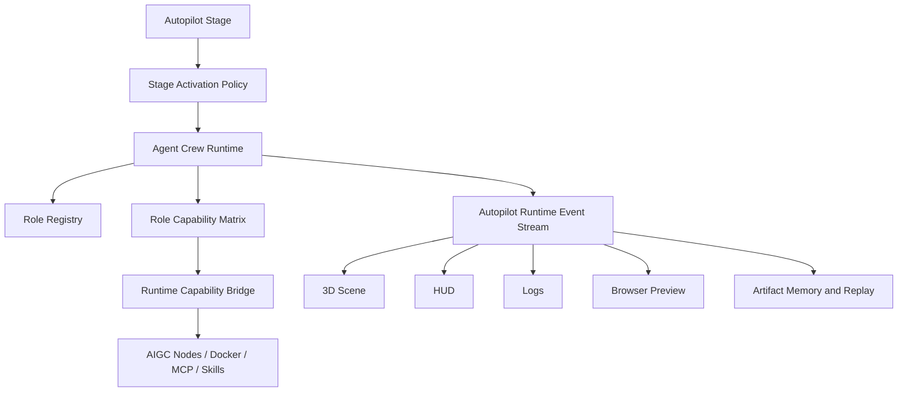

# 设计文档：伴随式 Agent Crew

## 概览

伴随式 Agent Crew 是 `/autopilot` 的组织层，位于“阶段流程”和“能力调用”之间。

它负责回答四个问题：

- 谁在当前阶段负责决策、规划、执行、审计、表现和记忆。
- 每个角色可以调用哪些能力。
- 每个阶段哪些角色 active、watching、reviewing 或 sleeping。
- 这些角色状态如何驱动 3D、HUD、日志、浏览器和资产回放。

## 架构



## 核心组件

### Role Registry

保存稳定角色目录。角色不是临时 prompt 名称，而是跨阶段存在的项目团队成员。

基础角色组包括：

- 决策层：目标决策者、产品决策者、技术决策者、成本决策者、风险决策者。
- 规划层：澄清规划者、RouteSet 规划者、SPEC 树规划者、任务拆解者、里程碑规划者。
- 执行层：GitHub 分析执行者、Docker 任务执行者、MCP 工具调用者、文档生成执行者、图表生成执行者。
- 审计层：需求审计者、架构审计者、安全审计者、成本审计者、一致性审计者、验收审计者。
- 表现层：3D 状态导演、HUD 信息导演、日志摘要员、效果预演导演、UI 原型设计师。
- 记忆层：项目记忆管理员、Artifact 归档员、SPEC 版本管理员、执行证据记录员、复盘建议员。

### Role Capability Matrix

将能力绑定到角色。能力可以来自 60+ AIGC 编排节点，也可以来自 Docker、MCP、Skills 或已有本地服务。

每条绑定记录需要包含：

- roleId
- capabilityId
- nodeId
- applicableStages
- inputSchema
- outputSchema
- tools
- requiresSandbox
- producesArtifacts
- auditRules

### Stage Activation Policy

每个阶段定义角色激活策略。

示例：

```text
澄清阶段
  active: 产品决策者、澄清规划者、需求审计者
  watching: 架构师、执行者、UI 预演师
  reviewing: 风险审计者
  sleeping: 工程落地执行者

效果预演阶段
  active: UI 原型设计师、效果预演导演、架构图生成者
  watching: 产品决策者、提示词工程师
  reviewing: 一致性审计者、成本审计者
  sleeping: GitHub 分析执行者
```

### Agent Crew Runtime

负责在每个阶段根据 policy 激活角色，分配 capability invocation，并将输出归并为统一事件。

它不直接替代 Runtime Capability Bridge，而是作为上游组织层：

```text
AgentRole 发起能力意图
  ↓
Role Capability Matrix 校验
  ↓
Runtime Capability Bridge 执行具体能力
  ↓
Capability Evidence 回写角色时间线
```

### Event Projection

所有角色动作都投影为事件：

- role.activated
- role.watching
- role.capability_invoked
- role.review_started
- role.review_completed
- role.completed
- role.blocked

同时需要区分两类更高/更低层级事件：

- `crew.*`：团队级事件，例如团队启动、角色组合变化、进入评审、交接完成。
- `capability.*`：能力级事件，例如某个角色调用 Docker、MCP、Skills、AIGC 节点、SVG 生成或文档生成。

这些事件驱动：

- 3D 场景角色状态。
- HUD 当前角色和阶段摘要。
- 日志流中的角色动作。
- 浏览器预览中的证据和结果。
- 资产记忆中的 RoleTimeline。

## 数据模型

```ts
type AgentRole = {
  id: string
  name: string
  group: "decision" | "planning" | "execution" | "audit" | "presentation" | "memory"
  responsibility: string
  defaultStages: AutopilotStage[]
  displayName: string
  permissions: string[]
}

type RoleCapability = {
  id: string
  roleId: string
  capabilityId: string
  nodeId?: string
  applicableStages: AutopilotStage[]
  inputSchema: unknown
  outputSchema: unknown
  tools: string[]
  requiresSandbox: boolean
  producesArtifacts: boolean
  auditRules: string[]
}

type RolePresence = {
  roleId: string
  stage: AutopilotStage
  state: "active" | "watching" | "reviewing" | "sleeping"
  currentAction?: string
  capabilityIds: string[]
  artifactIds: string[]
  evidenceIds: string[]
}
```

## 正确性属性

- 底层 AIGC 节点不得绕过角色直接暴露给用户。
- 每次能力调用都必须记录 roleId 和 capabilityId。
- 每个阶段都必须有至少一个 active 角色和一个 memory 角色。
- 审计关口必须有 reviewing 角色参与。
- 角色事件必须可回放。

## 测试策略

- 角色目录加载测试。
- 角色能力绑定测试。
- 阶段激活策略测试。
- role.* 事件生成测试。
- 角色时间线回放测试。
- 前端角色状态展示测试。
