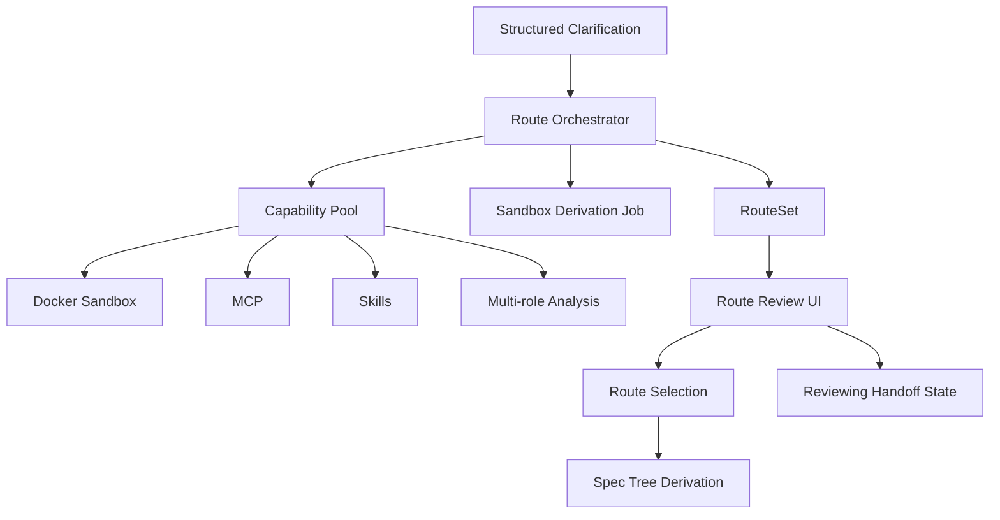

# 设计文档：自动驾驶路线编排

## 概述

本设计负责把澄清完成的项目上下文变成路线集。它是 `/autopilot` 的核心差异化能力，负责先规划主路和次路，再把这份路线资产交给 SPEC 树推导。

在本轮改造中，Route Orchestrator 不再只是一个路线生成器，而是一个承接结构化澄清、沙盒推导、路线选择和交接态管理的中枢。

## 架构

## 核心组件

### Route Orchestrator

负责协调分析过程，生成主路径和备选路径，并输出统一的 RouteSet。  
它不直接进入代码执行，而是先完成路线推演和风险比较。  
它还负责接住结构化澄清结果，决定是否进入沙盒推导作业，以及如何把 reviewing 状态明确呈现给用户。

### Clarification Strategy Selector

负责承接结构化澄清阶段的完成结果，读取目标优先、仓库优先、风险优先、文档优先、预演优先和快速执行等策略，并将其作为路线生成的前置输入。

### Capability Pool

负责承载 Docker 沙盒、MCP、Skills、多角色分析和其他 AIGC 节点能力。  
不同能力产出的结果需要回收为同一条路线的证据和摘要。

### Sandbox Derivation Job

负责把路线分析过程封装为一条可回放、可审计的推导作业。它会记录 routeId、jobId、nodeId、projectId、输入约束、执行模式和产物目标，并为 RouteSet 产出阶段大纲、主次路径和评估数据。

### Route Review UI

负责展示主路径、备选路径、风险、成本和步骤大纲。  
用户可以在这里选择、合并或回退路线。

### Reviewing Handoff State

负责把 `reviewing` 明确表达为“已生成草稿、待确认、可微调、可继续推进”的交接态，而不是卡死态。  
该状态需要持续显示下一步动作，例如确认主路、切换备选路、合并路径或进入下游 SPEC 树菜单。

### RouteSet Asset

负责保存每次自动驾驶的结果，包括路径、证据、选择状态和来源上下文。  
它是后续 SPEC 树推导的直接输入，并且要保留 selectedPathId、routeId 与 provenance。

## 数据流

1. 澄清后的 Project Context 进入 Route Orchestrator。  
2. Clarification Strategy Selector 读取结构化澄清策略和完成度。  
3. Orchestrator 决定是否将当前任务封装为 Sandbox Derivation Job。  
4. Orchestrator 将分析任务分发给 Capability Pool。  
5. 多角色分析结果回收并归并为 RouteCandidates。  
6. Orchestrator 生成 RouteSet 并记录风险、成本和复杂度。  
7. 用户在 Review UI 中确认主路径或次选路径。  
8. Reviewing Handoff State 持续展示下一步动作。  
9. 选定结果进入 SPEC Tree Derivation。

## 正确性属性

- 每次路线生成都应至少包含一条主路径。  
- 任意备选路径都必须可追溯到输入上下文和分析证据。  
- 用户选择后的路线应被持久化为项目资产。  
- `reviewing` 必须作为显式交接态对外呈现。  
- RouteSet 必须保留 routeId、selectedPathId 和 provenance 的完整链路。

## 测试策略

- 路线生成测试  
- 结构化澄清策略接入测试
- 路线选择与合并测试  
- 能力池回收测试  
- 沙盒推导作业测试
- reviewing 交接态测试
- 路线资产持久化测试
