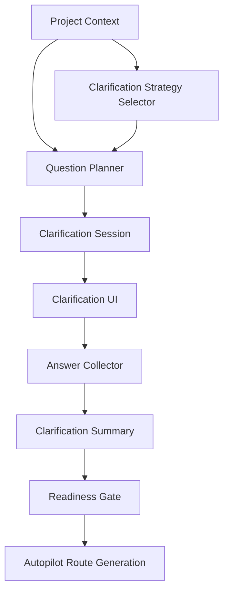

# 设计文档：澄清工作流

## 概述

本设计负责把输入入口推进到可推演状态。澄清工作流连接输入摄取与自动驾驶路线生成，是将“模糊意图”收敛成“明确上下文”的关键闸门。

在本轮改造中，澄清不再是纯自由追问，而是先选澄清策略模板，再生成问题集并计算准备度信号。

## 架构

## 核心组件

### Question Planner

根据项目类型、缺失字段和已有上下文生成问题。  
可按“目标、范围、约束、优先级、交付形态、验收标准”几个维度分类。

### Clarification Strategy Selector

负责先选择澄清模板，再进入问题生成。  
它支持目标优先、仓库优先、风险优先、文档优先、预演优先和快速执行等模式，并将模板与问题维度绑定。

### Clarification Session

保存问题列表、答案列表、默认假设、轮次和完成状态。  
建议使用项目作用域的会话模型，避免多个项目的澄清互相污染。

### Answer Collector

负责将用户回答写回会话，并同步更新项目资产。  
对于跳过项，记录默认假设或待确认状态。

### Readiness Gate

根据完成度、缺失字段和答案质量判断是否可以进入路线生成。  
这一步要非常保守，宁可继续澄清，也不要过早进入路线阶段。

## 数据流

1. Project Context 进入 Clarification Strategy Selector。  
2. Selector 选定模板并传入 Question Planner。  
3. Planner 生成 ClarificationQuestion 列表。  
4. UI 呈现问题并收集答案。  
5. Answer Collector 写入 ClarificationSession。  
6. Summary 生成澄清摘要和准备度信号。  
7. Readiness Gate 决定是否放行到路线生成。  
8. 澄清结果和模板信息写回项目资产，供 Route Orchestrator 复用。

## 正确性属性

- 已明确的问题不应再次重复出现。  
- 跳过的问题必须保留默认假设或待确认状态。  
- 未达到准备度阈值时，不应直接进入路线生成。  
- 澄清模板和问题维度必须可追溯。  
- 澄清摘要必须可复用到后续路线生成。

## 测试策略

- 问题生成覆盖测试  
- 多轮回答测试  
- 跳过与默认假设测试  
- 准备度门禁测试  
- 澄清策略模板测试
- 澄清资产复用测试
- 澄清摘要回放测试
