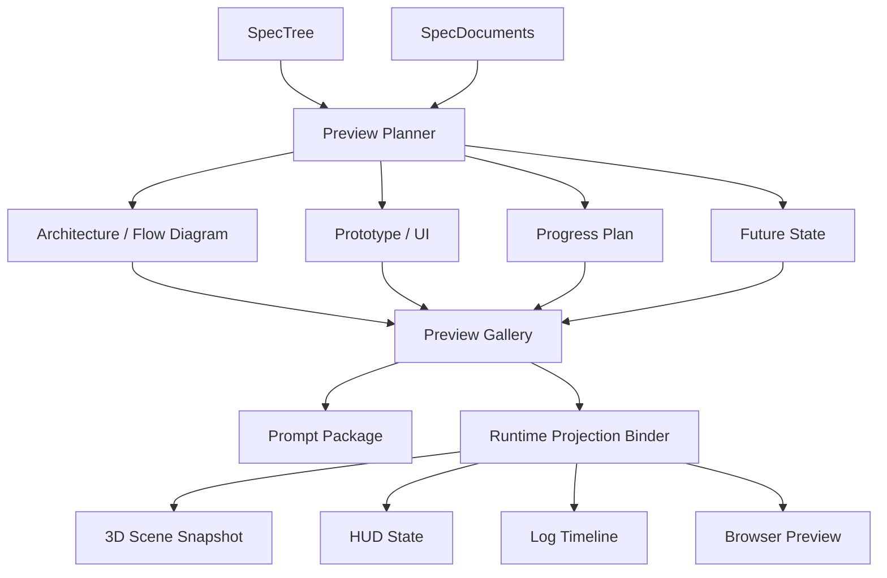

# 设计文档：效果预演生成

## 概述

本设计负责把 SPEC 树和规格文档转换为未来效果预演。  
它不执行真实开发任务，而是用结构化推演、图表、原型和进度计划帮助用户提前理解结果。

在本轮改造中，效果预演不只产出静态图和原型，还要把预演结果绑定到 3D、HUD、日志和浏览器预览。

## 架构

## 核心组件

### Preview Planner

负责选择预演范围、识别关键节点、确定产物类型和生成顺序。  
它读取 SPEC 树和 accepted 文档版本。

### Artifact Renderer

负责生成架构图、流程图、UI 原型和其他可视化产物。  
产物可以是 SVG、Markdown、结构化 JSON 或前端可渲染模型。

### Future State Simulator

负责描述节点完成后的系统状态、页面变化、数据关系和用户流程变化。

### Preview Gallery

负责展示预演版本、产物、进度计划和审阅入口。  
它是效果预演菜单的主界面。

### Runtime Projection Binder

负责把预演版本绑定到运行台投影层。  
它会记录 sceneSnapshotId、hudState、logTimeline 和 browserPreviewId，并允许按 SpecNode、RouteSet 或 Job 回看预演状态。

## 数据流

1. 用户选择树、子树或节点。  
2. Preview Planner 构建预演计划。  
3. Renderer 生成图、原型和规划。  
4. Runtime Projection Binder 将结果绑定到 3D、HUD、日志和浏览器。  
5. 用户审阅并保存 EffectPreview。  
6. accepted 预演进入 Prompt Package。  
7. 预演版本随 SPEC Tree 或阶段进度变化更新。

## 正确性属性

- 任意预演产物必须绑定到来源节点或来源文档。  
- 未接受的预演不能默认进入实现提示词生成。  
- 重新生成预演不应删除旧版本。  
- 预演状态必须能映射到运行台可见状态。  
- 预演版本必须随 SPEC Tree 和阶段进度联动更新。

## 测试策略

- 预演范围选择测试  
- 产物绑定测试  
- 预演版本测试  
- 运行台投影绑定测试
- 节点状态联动测试
- accepted 预演下游消费测试
