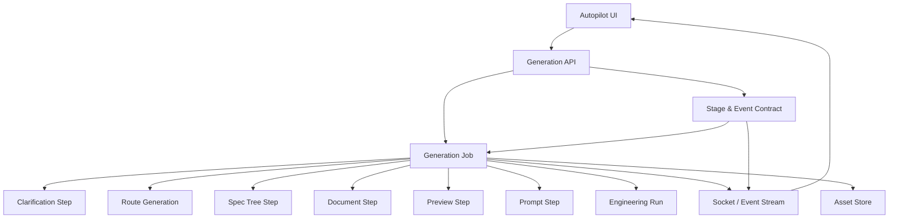

# 设计文档：生成 API 与作业契约

## 概述

本设计负责把 SPEC 自动驾驶工作流包装成统一的生成 API 和作业契约。  
它让前端、资产层和后台生成器通过同一套请求、响应和事件模型协作。

在本轮改造中，契约层需要显式覆盖澄清、路线、SPEC、文档、预演、提示词、工程交接和 reviewing 交接态，并把 crew / capability / preview / prompt / mission 事件纳入统一模型。

## 架构

## 核心组件

### Generation API

负责接收请求、返回作业 ID、查询状态和控制步骤流转。  
它是前端进入 SPEC 工作流的统一入口。

### Generation Job

负责承载一次完整或部分的生成过程。  
它包含当前步骤、输入资产、输出资产和错误状态。

### Stage & Event Contract

负责定义 clarification、route_generation、spec_tree、spec_docs、preview、prompt_packaging、engineering_handoff 等阶段，以及 `crew.*`、`capability.*`、`preview.*`、`prompt.*`、`mission.*` 等事件族。

### Event Stream

负责把状态变化实时推送到前端。  
前端可以据此显示当前处于澄清、路线、推导、预演还是执行阶段。

### Reviewing Handoff Semantics

负责把 `reviewing` 明确表达为已生成草稿、待人工确认的交接态。  
前端和后台都应根据该语义展示下一步动作，而不是把它当成失败或卡死。

### Compatibility Layer

负责让旧的 launch / mission 风格调用继续能用。  
新工作流可以在不破坏旧接口的情况下逐步接管。

## 数据流

1. 前端发送统一生成请求。  
2. API 创建 Generation Job。  
3. Contract 选择阶段和事件族。  
4. Job 分阶段执行并持续回写资产。  
5. 事件流同步推送状态。  
6. 前端根据事件更新 UI、角色面板和工作台菜单。  
7. reviewing 阶段向前端暴露 nextAction 与可继续推进的交接语义。

## 正确性属性

- 任意作业都必须有清晰的 projectId 和阶段状态。  
- 任意失败都必须保留已完成资产。  
- 兼容层不应改变旧接口的成功语义。  
- 阶段模型必须覆盖 reviewing 交接态。  
- 事件模型必须同时覆盖 team、capability、preview、prompt 和 mission 事件。

## 测试策略

- 请求响应契约测试  
- 状态事件测试  
- 兼容性测试  
- 阶段语义测试
- crew / capability / preview / prompt / mission 事件测试
- 部分成功测试
