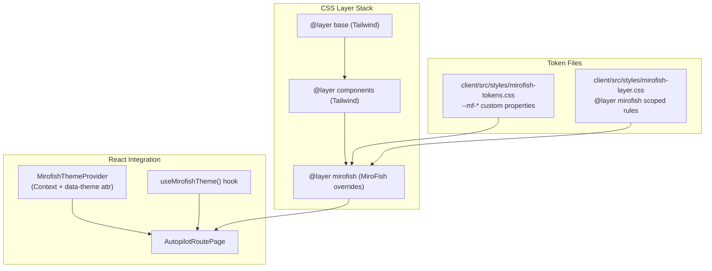

# Design Document: MiroFish Visual Alignment

## Overview

本设计文档定义了将 MiroFish 极简视觉风格对齐到 whybuddy 项目的技术方案。核心策略是通过 CSS 自定义属性令牌集 + CSS cascade layer + `data-theme` 属性作用域，实现渐进式视觉迁移，首个目标为 AutopilotRoutePage。

设计原则：
- **渐进采用**：通过 CSS 变量层叠和作用域选择器，允许页面逐步迁移
- **零侵入**：不修改未迁移组件的样式，不触碰 3D 场景
- **单一真相源**：所有 MiroFish 视觉参数集中在 `--mf-*` 令牌集中
- **可回退**：移除 `data-theme="mirofish"` 属性即可恢复原始样式

### 设计决策

| 决策 | 选择 | 理由 |
|------|------|------|
| 令牌前缀 | `--mf-*` | 避免与现有 OKLCH 令牌和 Tailwind CSS 变量冲突 |
| 作用域机制 | `@layer mirofish` + `[data-theme="mirofish"]` | CSS 原生层叠控制，无 JS 运行时开销 |
| 动画策略 | CSS 覆盖 + React 条件渲染 | framer-motion 动画需要在组件层面条件禁用 |
| 字体策略 | 别名到现有项目 CSS 变量 | 项目已有 `--font-display`、`--font-mono`、`--font-body`，无需管理 woff2 文件 |
| 迁移边界 | React Context + CSS 选择器双重保障 | `useMirofishTheme()` hook 提供 JS 层面的主题感知 |

## Architecture



### 文件结构

```
client/src/
├── styles/
│   ├── mirofish-tokens.css          # --mf-* 令牌定义（:root 级别）
│   └── mirofish-layer.css           # @layer mirofish 作用域覆盖规则
├── hooks/
│   └── useMirofishTheme.ts          # 主题感知 hook
├── contexts/
│   └── MirofishThemeContext.tsx      # 主题 Context Provider
└── pages/autopilot/
    └── AutopilotRoutePage.tsx        # 首个迁移目标（仅 2D cockpit 内容区域启用 data-theme="mirofish"）
```

### CSS Layer Order Declaration

`index.css`（或等效入口文件）必须在文件顶部显式声明 layer 顺序：

```css
/* client/src/index.css — 文件顶部 */
@layer base, components, utilities, mirofish;
```

`main.tsx` 按以下顺序导入样式文件：

```typescript
// client/src/main.tsx
import "./index.css";                    // layer order declaration + Tailwind base
import "./styles/mirofish-tokens.css";   // --mf-* custom properties (:root)
import "./styles/mirofish-layer.css";    // @layer mirofish { ... } scoped rules
```

`mirofish-layer.css` 内部使用 `@layer mirofish { ... }` 包裹所有规则。

### CSS 层叠优先级

```
1. Tailwind @layer base          — 最低优先级
2. Tailwind @layer components    — 中等优先级
3. Tailwind @layer utilities     — 高优先级
4. @layer mirofish               — 最高优先级（仅在 [data-theme="mirofish"] 内生效）
5. Inline styles / !important    — 不使用
```

## Components and Interfaces

### 1. MiroFish Token Set (`mirofish-tokens.css`)

```css
/* client/src/styles/mirofish-tokens.css */
:root {
  /* Colors */
  --mf-color-bg: #FFFFFF;
  --mf-color-fg: #000000;
  --mf-color-accent: #FF4500;
  --mf-color-border: #E5E5E5;

  /* Typography — alias to existing project CSS variables */
  --mf-font-title: var(--font-display);
  --mf-font-mono: var(--font-mono);
  --mf-font-body: "Noto Sans SC", var(--font-body);
  --mf-title-size: 4.5rem;
  --mf-title-weight: 500;
  --mf-title-spacing: 0;
  --mf-mono-weight: 700;

  /* Spacing */
  --mf-gap-section: 60px;
  --mf-gap-element: 16px;
  --mf-max-width: 1400px;

  /* Border */
  --mf-border: 1px solid #E5E5E5;
  --mf-radius: 2px;
  --mf-shadow: none;
}
```

### 2. MiroFish Theme Layer (`mirofish-layer.css`)

```css
/* client/src/styles/mirofish-layer.css */
@layer mirofish {
  [data-theme="mirofish"] {
    font-family: var(--mf-font-body);
    color: var(--mf-color-fg);
    background-color: var(--mf-color-bg);
  }

  [data-theme="mirofish"] h1,
  [data-theme="mirofish"] h2,
  [data-theme="mirofish"] h3,
  [data-theme="mirofish"] h4 {
    font-family: var(--mf-font-title);
    font-weight: var(--mf-title-weight);
    letter-spacing: var(--mf-title-spacing);
  }

  /* Named surface classes — safe, scoped targets */
  [data-theme="mirofish"] .glass-panel,
  [data-theme="mirofish"] .glass-panel-strong,
  [data-theme="mirofish"] .studio-surface,
  [data-theme="mirofish"] .workspace-panel {
    background: var(--mf-color-bg);
    border: var(--mf-border);
    border-radius: var(--mf-radius);
    box-shadow: var(--mf-shadow);
    backdrop-filter: none;
  }

  /* Explicit data-mf-* attribute targets (components opt-in via JSX) */
  [data-theme="mirofish"] [data-mf-surface] {
    background: var(--mf-color-bg);
    border: var(--mf-border);
    border-radius: var(--mf-radius);
    box-shadow: var(--mf-shadow);
    backdrop-filter: none;
  }

  [data-theme="mirofish"] [data-mf-card] {
    border: var(--mf-border);
    border-radius: var(--mf-radius);
    box-shadow: var(--mf-shadow);
  }

  [data-theme="mirofish"] [data-mf-button="primary"] {
    background: var(--mf-color-fg);
    color: var(--mf-color-bg);
    border-radius: 0;
    box-shadow: none;
    font-family: var(--mf-font-mono);
    width: 100%;
  }
}
```

### 3. `useMirofishTheme()` Hook

```typescript
// client/src/hooks/useMirofishTheme.ts
import { useContext, createContext } from "react";

export const MirofishThemeContext = createContext<boolean>(false);

/**
 * Returns whether the current component is within a MiroFish theme scope.
 * Must be used inside a MirofishThemeProvider; returns false by default.
 */
export function useMirofishTheme(): boolean {
  return useContext(MirofishThemeContext);
}
```

### 4. `MirofishThemeProvider`

```typescript
// client/src/contexts/MirofishThemeContext.tsx
import { type ReactNode } from "react";
import { MirofishThemeContext } from "@/hooks/useMirofishTheme";

interface MirofishThemeProviderProps {
  children: ReactNode;
  enabled?: boolean;
}

/**
 * Defaults to enabled=false. AutopilotRoutePage explicitly passes enabled
 * to opt in. This prevents accidental theme activation in shared component
 * tests and future page reuse.
 *
 * When disabled, renders children directly without any wrapper element,
 * ensuring zero DOM changes in non-MiroFish contexts.
 */
export function MirofishThemeProvider({
  children,
  enabled = false,
}: MirofishThemeProviderProps) {
  if (!enabled) {
    return (
      <MirofishThemeContext.Provider value={false}>
        {children}
      </MirofishThemeContext.Provider>
    );
  }

  return (
    <MirofishThemeContext.Provider value={true}>
      <div data-theme="mirofish">
        {children}
      </div>
    </MirofishThemeContext.Provider>
  );
}
```

### 4.1 Scope Boundary: Wraps Only 2D Content

The provider MUST NOT wrap the entire `AutopilotRoutePage` return. `Scene3D`, `HoloDrawer` outer shell, and mobile drawer shell are rendered INSIDE `AutopilotRoutePage.tsx` but stay OUTSIDE the provider. The provider wraps only the 2D cockpit content area (main content grid, right rail, left content).

```tsx
// client/src/pages/autopilot/AutopilotRoutePage.tsx (simplified)
export function AutopilotRoutePage() {
  return (
    <>
      {/* 3D scene — OUTSIDE provider, never receives MiroFish styles */}
      <div className="scene-container">
        <Scene3D />
      </div>

      {/* 2D cockpit content — INSIDE provider */}
      <MirofishThemeProvider enabled>
        <main className="cockpit-grid" data-mf-surface>
          {/* Left content, main content grid, right rail */}
          <LeftPanel />
          <CenterContent />
          <RightRail />
        </main>
      </MirofishThemeProvider>

      {/* HoloDrawer shell — OUTSIDE provider */}
      <HoloDrawer>
        {/* If drawer children need MiroFish, wrap the children, not the shell */}
        <MirofishThemeProvider enabled>
          <DrawerMirofishContent />
        </MirofishThemeProvider>
      </HoloDrawer>
    </>
  );
}
```

### 5. Component Override Patterns

#### MetricBox (within MiroFish scope)

```typescript
// Conditional styling based on theme
export function MetricBox({ label, value, tone, dark }: MetricBoxProps) {
  const isMirofish = useMirofishTheme();

  if (isMirofish) {
    return (
      <div className="border border-[--mf-color-border] bg-[--mf-color-bg] p-3">
        <div className="font-[--mf-font-mono] text-[10px] font-bold uppercase tracking-widest opacity-70">
          {label}
        </div>
        <div className="mt-1 font-[--mf-font-mono] text-sm font-bold">
          {value}
        </div>
      </div>
    );
  }

  // Original rendering...
}
```

#### FlowStep Indicators (within MiroFish scope)

```typescript
function FlowStepIndicator({ status }: { status: FlowStatus }) {
  const isMirofish = useMirofishTheme();

  if (isMirofish) {
    const symbol = status === "done" || status === "active" ? "■" : "□";
    const opacity = status === "active" ? "opacity-100" : "opacity-60";
    return <span className={`font-mono text-sm ${opacity}`}>{symbol}</span>;
  }

  // Original icon rendering...
}
```

### 6. Animation Reduction Strategy

For framer-motion animations within the MiroFish scope:

```typescript
// Utility to conditionally disable framer-motion
function useMirofishMotionProps() {
  const isMirofish = useMirofishTheme();

  if (isMirofish) {
    return {
      initial: false,
      animate: false,
      exit: undefined,
      transition: { duration: 0 },
    };
  }

  return {}; // Use default framer-motion behavior
}
```

## Data Models

### Token Schema

| Token | Type | Value | Usage |
|-------|------|-------|-------|
| `--mf-color-bg` | color | `#FFFFFF` | All backgrounds |
| `--mf-color-fg` | color | `#000000` | All primary text |
| `--mf-color-accent` | color | `#FF4500` | Interactive highlights |
| `--mf-color-border` | color | `#E5E5E5` | All borders |
| `--mf-font-title` | font-family | `var(--font-display)` | Headings |
| `--mf-font-mono` | font-family | `var(--font-mono)` | Labels, code, values |
| `--mf-font-body` | font-family | `"Noto Sans SC", var(--font-body)` | Chinese body text |
| `--mf-title-size` | length | `4.5rem` | Main title size |
| `--mf-title-weight` | number | `500` | Title font weight |
| `--mf-title-spacing` | length | `0` | Title letter spacing |
| `--mf-mono-weight` | number | `700` | Mono font weight |
| `--mf-gap-section` | length | `60px` | Section gaps |
| `--mf-gap-element` | length | `16px` | Element gaps |
| `--mf-max-width` | length | `1400px` | Content max width |
| `--mf-border` | shorthand | `1px solid #E5E5E5` | Uniform border |
| `--mf-radius` | length | `2px` | Max border radius |
| `--mf-shadow` | shadow | `none` | No shadows |

### Theme State Model

```typescript
interface MirofishThemeState {
  /** Whether the MiroFish theme is active for the current component tree */
  active: boolean;
}
```

## Correctness Properties

*A property is a characteristic or behavior that should hold true across all valid executions of a system — essentially, a formal statement about what the system should do. Properties serve as the bridge between human-readable specifications and machine-verifiable correctness guarantees.*

### Property 1: Token Namespace Isolation

*For any* CSS custom property defined in `mirofish-tokens.css`, the property name SHALL start with the `--mf-` prefix, ensuring zero collision with existing OKLCH design tokens.

**Validates: Requirements 1.6**

### Property 2: Theme Layer Selector Scoping

*For any* CSS rule selector within `@layer mirofish` in `mirofish-layer.css`, the selector SHALL include `[data-theme="mirofish"]` as a qualifying ancestor or self-selector. No bare selectors (e.g., `.glass-panel` without the `[data-theme]` qualifier) are permitted, ensuring styles cannot leak outside the theme scope.

**Validates: Requirements 2.2, 2.5, 10.2**

### Property 3: Provider Markup Contract

*For any* boolean value of `enabled` passed to `MirofishThemeProvider`, the rendered DOM SHALL contain `data-theme="mirofish"` if and only if `enabled` is `true`. When `enabled` is `false` (the default), no `data-theme` attribute SHALL be present and no wrapper `<div>` SHALL be added to the DOM — children are rendered directly.

**Validates: Requirements 2.2, 10.1, 10.6, 10.7**

### Property 4: Component Attribute Contract

*For any* MiroFish-aware component (MetricBox, ApiErrorNotice, etc.) rendered within a `MirofishThemeProvider` with `enabled=true`, the component SHALL output the appropriate `data-mf-*` attribute or MiroFish-specific class. When rendered outside the provider or with `enabled=false`, these attributes SHALL be absent.

**Validates: Requirements 4.1, 4.3, 8.1, 8.2, 8.3**

### Property 5: FlowStep Indicator Mapping

*For any* FlowStep indicator rendered within a `[data-theme="mirofish"]` scope, completed or active states SHALL render the `■` (filled square U+25A0) character, and waiting or blocked states SHALL render the `□` (empty square U+25A1) character.

**Validates: Requirements 8.4**

### Property 6: Shared Component Scope Detection

*For any* component that calls `useMirofishTheme()`, the hook SHALL return `true` when the component is rendered inside a `MirofishThemeProvider` with `enabled=true`, and `false` when rendered outside or when `enabled=false`. The component's styling SHALL correspond to the hook's return value.

**Validates: Requirements 10.4, 10.5**

## Error Handling

### Font Fallback

| Scenario | Behavior |
|----------|----------|
| `--font-display` unavailable | Falls back to `system-ui, sans-serif` via CSS variable chain |
| `--font-mono` unavailable | Falls back to `monospace` via CSS variable chain |
| Noto Sans SC not installed | Falls back to `var(--font-body)` → system sans-serif |
| All CSS variables unset | Page renders with system fonts, no layout breakage |

> Font file management (woff2 hosting, `@font-face` declarations, deferred loading) is a separate concern outside this spec's scope. MVP aliases to existing project CSS variables only.

### Theme Context Missing

| Scenario | Behavior |
|----------|----------|
| `useMirofishTheme()` called outside Provider | Returns `false` (default context value) |
| `data-theme` attribute removed at runtime | CSS overrides stop applying immediately; React components re-render via Context |
| Nested `data-theme` attributes | Nearest ancestor wins (CSS specificity + Context propagation) |

### CSS Layer Conflicts

| Scenario | Behavior |
|----------|----------|
| Third-party CSS overrides MiroFish tokens | `@layer mirofish` has lower priority than unlayered CSS; use `[data-theme="mirofish"]` specificity boost |
| Tailwind utility conflicts | MiroFish layer wins over `@layer base` and `@layer components` |
| Inline styles on components | Inline styles always win; avoid inline styles in migrated components |

## Migration Batch Scope

迁移采用 3-batch 渐进方式：

### Batch 1: Token + Scope Infrastructure (无视觉变化)

- 创建 `mirofish-tokens.css` 定义所有 `--mf-*` 变量
- 创建 `mirofish-layer.css` 定义 `@layer mirofish` 规则
- 在 `index.css` 顶部声明 `@layer base, components, utilities, mirofish;`
- 在 `main.tsx` 中按顺序导入三个样式文件
- 实现 `MirofishThemeProvider`（默认 `enabled=false`）和 `useMirofishTheme()` hook
- 此阶段不产生任何视觉变化

### Batch 2: AutopilotRoutePage 2D Cockpit Scope

- 在 `AutopilotRoutePage.tsx` 中用 `MirofishThemeProvider enabled` 包裹 2D cockpit 区域
- `Scene3D`、`HoloDrawer` 外壳、mobile drawer shell 保持在 provider 外部
- 为关键容器添加 `data-mf-surface`、`data-mf-card` 属性
- CSS layer 规则通过 `[data-theme="mirofish"] [data-mf-*]` 选择器生效
- 命名 surface 类（`.glass-panel`、`.studio-surface` 等）自动获得 MiroFish 覆盖

### Batch 3: Component-Level MiroFish Variants

迁移以下组件的 MiroFish 变体：
- `MetricBox` — 扁平边框 + 等宽字体值
- `ApiErrorNotice` — 黑色左边框替代 rose 配色
- `AutopilotLanguageSwitch` — 黑底白字 active 态
- `FlowStep` indicators — ■/□ 符号替代彩色圆形图标
- Primary CTA (`StageCTA`) — 全宽黑底白字按钮

**不在 Batch 3 范围内：**
- 右侧 rail 面板（后续按面板逐个迁移）
- 已有的右侧 rail 基础组件（`metrics-row.tsx`、`status-capsule.tsx`、`sub-stage-card.tsx`）已部分对齐 MiroFish 风格，应作为参考标准而非从头覆盖

## Testing Strategy

### Unit Tests (Example-Based)

Unit tests cover specific component rendering scenarios:

- MetricBox renders with correct `data-mf-card` attribute and MiroFish classes when inside theme scope
- ApiErrorNotice renders with black left border in MiroFish scope
- AutopilotLanguageSwitch active state uses black background + white mono text
- Primary buttons render with `data-mf-button="primary"` attribute in MiroFish scope
- `useMirofishTheme()` returns `true` inside provider, `false` outside
- `MirofishThemeProvider` defaults to `enabled=false` (no `data-theme` attribute rendered)
- `prefers-reduced-motion` disables all animations

### Property-Based Tests (fast-check) — Source-Level Contract Tests

> **Design decision**: jsdom does NOT resolve CSS cascade layers, Tailwind utilities, or compute real `font-weight` / `border-radius` / `box-shadow` / `backdrop-filter` values. Property tests that rely on `getComputedStyle()` in jsdom are unreliable and removed. Instead, we use source-level contract tests that parse CSS files and verify structural invariants, plus lightweight React render tests for markup contracts.

**Library**: `fast-check` (already in devDependencies)
**Minimum iterations**: 100 per property

Each property test references its design document property:

```typescript
// Tag format example:
// Feature: mirofish-visual-alignment, Property 1: Token Namespace Isolation
```

Property tests to implement:

1. **CSS token source test (Property 1)** — Parse `mirofish-tokens.css` as text, extract all custom property declarations, verify every property name starts with `--mf-`. Generate random subsets of extracted tokens to validate namespace isolation.

2. **CSS layer source test (Property 2)** — Parse `mirofish-layer.css` as text, extract all CSS rule selectors within `@layer mirofish { ... }`. Verify every selector includes `[data-theme="mirofish"]` — no bare selectors that could leak outside scope.

3. **Provider markup test (Property 3)** — Render `MirofishThemeProvider` with `enabled=true` and `enabled=false`. Verify `data-theme="mirofish"` is present when enabled, absent when disabled. Verify no wrapper `<div>` is rendered when disabled. Generate random boolean `enabled` values.

4. **Component attribute test (Property 4)** — Render components (MetricBox, ApiErrorNotice, etc.) inside and outside `MirofishThemeProvider`. Verify components output correct `data-mf-*` attributes or MiroFish-specific classes when in themed context, and do NOT output them when outside.

5. **FlowStep mapping test (Property 5)** — Generate random `FlowStatus` values from the valid set (`done`, `active`, `waiting`, `blocked`, etc.). Verify `■` (U+25A0) is rendered for completed/active states and `□` (U+25A1) for waiting/blocked states. This IS reliable in jsdom since it tests React render output, not CSS computed styles.

6. **Hook return value test (Property 6)** — Generate random nesting configurations (with/without `MirofishThemeProvider` ancestor). Verify `useMirofishTheme()` returns the correct boolean. Reliable in jsdom since it tests React Context propagation.

**Explicitly NOT tested via PBT in jsdom** (unreliable):
- Computed `font-weight` values (jsdom doesn't resolve CSS layers)
- Computed `border-radius` values (jsdom doesn't apply Tailwind utilities)
- Computed `box-shadow` / `backdrop-filter` values (jsdom doesn't cascade layers)
- Any test relying on `getComputedStyle()` for CSS layer resolution

**Optional (not in MVP)**: Playwright visual regression tests for real computed style verification in a real browser engine.

### Integration Tests

- Full AutopilotRoutePage renders without errors when 2D cockpit area is wrapped in MirofishThemeProvider
- CSS file imports correctly without Tailwind configuration changes
- Theme toggle (add/remove `data-theme`) correctly switches visual styles
- Shared components (MetricBox, ApiErrorNotice) work correctly in both themed and unthemed contexts
- 3D Scene remains unaffected — it is outside the provider boundary
- `HoloDrawer` outer shell remains unaffected — only drawer children wrapped in provider receive MiroFish styles
- `MirofishThemeProvider` with default `enabled=false` does not apply any theme attributes
