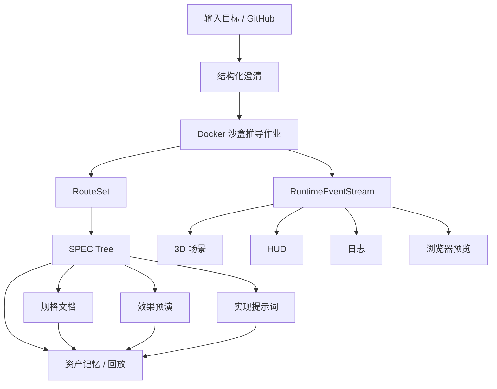

# 设计文档：Autopilot 蓝图总规范

## 概览

这份设计把 `/autopilot` 拆成两层：

1. **蓝图推导层**，负责输入、澄清、沙盒推导、RouteSet、SPEC Tree、规格文档、效果预演和提示词。
2. **运行台联动层**，负责把推导结果投到 3D 场景、HUD、日志、浏览器和资产记忆中。

总原则是：前半段负责“把未来推出来”，后半段负责“让用户看见它正在发生”。

## 架构



## 分层职责

### 澄清层

负责把模糊目标变成可执行上下文。澄清不是聊天，而是模板化策略选择、问题集生成和准备度判断。

### 推导层

负责把上下文送入 Docker 沙盒与能力池，由多角色共同生成路线、风险评估和资产种子。

### 资产层

负责将路线沉淀为 RouteSet 和 SPEC Tree，并向后续菜单输出规格文档、预演、提示词和工程计划。

### 运行台层

负责把同一条事件流广播给 3D、HUD、日志和浏览器，形成可以观察、可追踪、可接管的驾驶舱体验。

## 关键状态

- `input`
- `clarifying`
- `route_generation`
- `spec_tree`
- `spec_docs`
- `preview`
- `prompt_packaging`
- `engineering_handoff`
- `reviewing`

其中 `reviewing` 是明确的人工交接态，不表示系统卡死。

## 设计原则

- 结构化澄清优先于自由追问。
- RouteSet 优先于单一答案。
- SPEC Tree 是资产，不是临时 JSON。
- 统一事件流优先于孤立面板。
- 运行台联动优先于单点结果页。
## 新增横向层：伴随式 Agent Crew

在蓝图推导层和运行台联动层之间，系统新增 **伴随式 Agent Crew**。

这一层不直接生成 RouteSet，也不直接执行 Docker 任务；它负责组织“谁来调用这些能力”。也就是说：

```text
Autopilot Stage
  ↓
Agent Crew Fabric
  ↓
Role-bound Capabilities
  ↓
Runtime Capability Bridge
  ↓
AIGC Nodes / Docker / MCP / Skills
```

Agent Crew Fabric 的设计目标是让用户感知到“一个 AI 项目团队在陪跑”，而不是“系统在后台执行 60 个节点”。

它需要输出：

- 当前 active 角色。
- 当前 watching 角色。
- 当前 reviewing 角色。
- 每个角色的当前动作。
- 每个角色调用过的能力和产生的证据。
- 可回放的 RoleTimeline。

这些内容会进入统一事件流，并同时驱动 3D、HUD、日志、浏览器和资产记忆。
## 新增体验边界：核心资产层与体验投影层

为了避免把 `/autopilot` 误做成“只是一个 3D 面板”，系统需要明确分层。

**核心资产层**

- RouteSet
- SPEC Tree
- SpecDocument
- PromptPackage
- Autopilot Runtime Event Stream
- Artifact Memory / Replay

**体验投影层**

- 3D 场景
- HUD
- 日志
- 浏览器预览

**横向组织层**

- Agent Crew Fabric
- Role Capability Matrix
- Stage Activation Policy

这意味着 3D / HUD / Logs / Browser 只消费事件与资产，不是业务真相的唯一来源。即使体验投影层暂时不可用，核心链路也必须能继续运行，并且所有状态都必须能通过事件和资产回放恢复。
