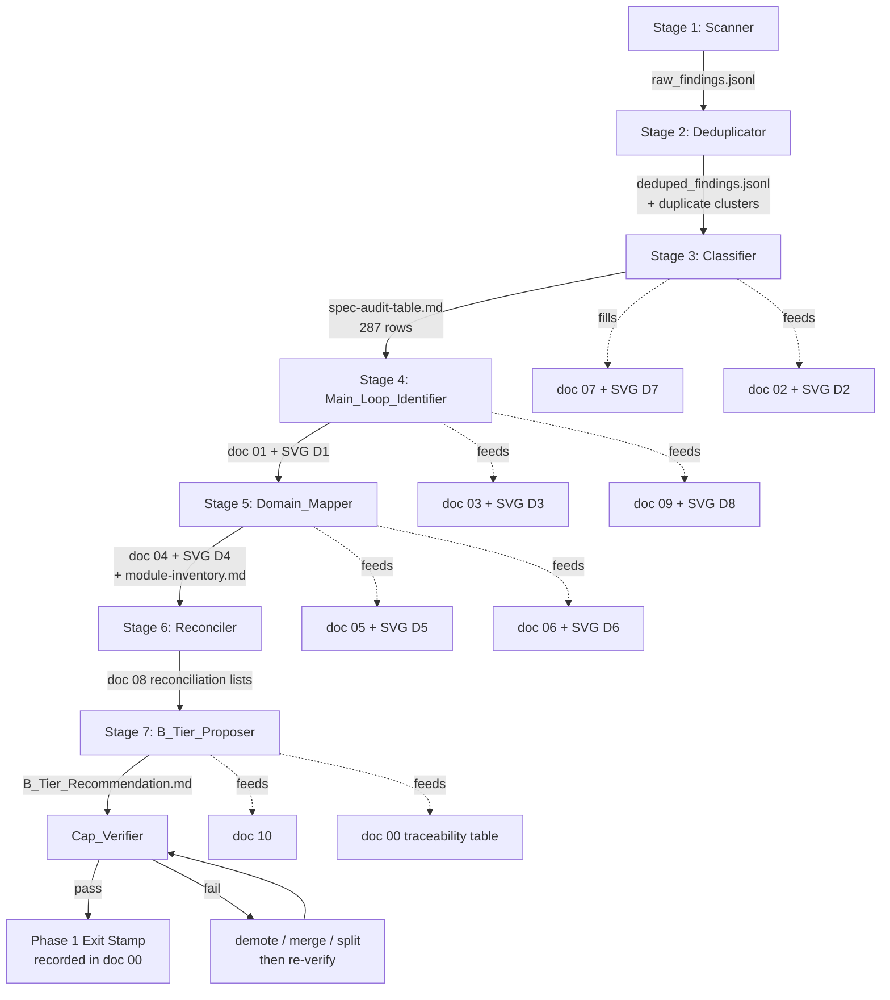

# Design Document

## Overview

This design mechanizes the 14 requirements of `repo-system-reconnaissance-2026-05-28` into a **runnable 7-stage pipeline** the Author executes against the `2026-05-28` snapshot of `whybuddy`. It is a procedure manual, not a runtime architecture. The Author will run it once, against a clock, with a 3–5 working-day budget (Req 13). When the pipeline halts, every artifact in the Reconnaissance_Output_Set is bounded, every one of the 287 specs is bucketed, and every one of the Five_Control_Recovery_Questions points to a specific section + SVG.

The design is defensive by construction:

- Every stage's output is the input of the next; no stage may be skipped or reordered (Req 3.1).
- Every SVG cites a scan-output row or audit-table row produced earlier in the pipeline (Req 3.3).
- Every cap (≤11 docs, 8–15 SVGs, 287 audit rows) is verified mechanically by an exit-stage script (Req 8.2).
- Every out-of-scope category (Per_Domain_Document, Auto_Generated_Reference, spec rewrites) is detected and rejected at exit, not during authoring (Req 9).
- Every B-tier candidate is evidence-backed, citing at least one concrete row from the audit table, the inventory, or the reconciliation list (Req 10.4).

The design intentionally does not introduce a runtime, an API, a service, or a build step. It produces 14 markdown files and 8–15 SVGs under `.kiro/specs/repo-system-reconnaissance-2026-05-28/` plus optional throwaway scanner scripts under `.tmp/`.

## Architecture

A_Plus_Reconnaissance is a 7-stage pipeline matching Req 3.1's fixed order. Each stage has typed inputs, typed outputs, and a single exit condition. The pipeline is one-shot: stages run in the listed order; later stages may not retroactively alter earlier outputs without re-running the affected stage and re-validating its exit condition.

### Pipeline diagram



### Stage table

| # | Stage                  | Inputs                                                                                                                                  | Outputs                                                                                                                       | Exit condition                                                                                                                                                |
|---|------------------------|-----------------------------------------------------------------------------------------------------------------------------------------|-------------------------------------------------------------------------------------------------------------------------------|---------------------------------------------------------------------------------------------------------------------------------------------------------------|
| 1 | Scanner                | `client/src/`, `server/`, `shared/`, `services/`, `.kiro/specs/`, `.kiro/steering/`; Snapshot_2026_05_28 (read-only)                    | `.tmp/raw_findings.jsonl` (one finding per row)                                                                               | All 6 source roots enumerated; row count > 0 for each root; every row has `kind`, `path`, `evidence`, `snapshot_ref`                                          |
| 2 | Deduplicator           | `.tmp/raw_findings.jsonl`                                                                                                               | `.tmp/deduped_findings.jsonl` + `.tmp/duplicate_clusters.jsonl`                                                               | Every duplicate-cluster row points to ≥2 raw findings; deduped row count ≤ raw row count; cluster decisions are deterministic given input                     |
| 3 | Classifier             | `.tmp/deduped_findings.jsonl`; the 287 spec dirs from Snapshot_2026_05_28; the priority order from Req 5.2                              | `spec-audit-table.md` (287 rows) → fills doc `07`, doc `02`, SVG D2, SVG D7                                                   | Row count == 287; every row has a bucket ∈ 5-bucket enum; no DUPLICATE row points to a non-existing or self spec                                              |
| 4 | Main_Loop_Identifier   | `spec-audit-table.md`; `.kiro/steering/project-overview.md` § 系统架构 / 核心数据流; deduped findings                                   | doc `01` 主业务闭环 + SVG D1; feeds doc `03` 系统分层图 + SVG D3 and doc `09` 运行时主链路 + SVG D8                            | Single canonical loop chosen using "touches most TRUNK-labeled domains" rule; SVG D1 manifest cites ≥1 audit-table row and ≥1 scan-output row                 |
| 5 | Domain_Mapper          | `spec-audit-table.md`; deduped findings; steering source-tree summary                                                                   | `module-inventory.md` + doc `04` 主要域地图 + SVG D4; feeds doc `05` 前端导航地图 + SVG D5 and doc `06` 后端能力地图 + SVG D6  | Every scanned module has trunk_branch_legacy ∈ {trunk, branch, legacy}; every TRUNK module is on the Main_Business_Loop                                       |
| 6 | Reconciler             | `spec-audit-table.md`; scanner findings; doc `03` / `05` / `06`                                                                         | doc `08` 代码-文档对账 with two lists (doc_without_code, code_without_doc)                                                    | Every audit row's evidence_path resolves to a working-tree file or is recorded in doc_without_code; every TRUNK module is recorded in either list or in audit |
| 7 | B_Tier_Proposer        | All previous outputs                                                                                                                    | `B_Tier_Recommendation.md`; feeds doc `10` 演示主线 and doc `00` 项目总定义 traceability table                                | Every B/C/D candidate cites ≥1 audit-row, inventory-row, or reconciliation-row; out-of-scope items per Req 9 are routed (not authored)                        |
| — | Cap_Verifier           | `Reconnaissance_Output_Set` directory                                                                                                   | pass/fail per Req 8.2                                                                                                         | All 6 mechanical checks pass (see Testing Strategy); result written into doc `00` as Phase 1 completion stamp                                                 |

### Data flow contract

- Each stage writes to its declared output path and **only** to that path.
- Each stage reads only from the immediately preceding stage's outputs plus stable steering snapshots; it does not re-scan.
- `.tmp/` outputs are scratch; `.kiro/specs/repo-system-reconnaissance-2026-05-28/` outputs are the deliverable.
- The Cap_Verifier is the only stage that may inspect the deliverable directory as a whole.

## Components and Interfaces

Each component is a stage contract. Components are independently re-runnable: re-running a stage with the same inputs MUST produce the same outputs (modulo timestamp fields).

### 1. Scanner

**Purpose.** One-shot enumeration of the 6 source roots, producing line-oriented findings with snapshot references. No interpretation.

**Inputs.**

- Roots: `client/src/`, `server/`, `shared/`, `services/`, `.kiro/specs/`, `.kiro/steering/`.
- Read-only references: Snapshot_2026_05_28 numbers from `.kiro/steering/project-overview.md` § 项目规模 and `.kiro/steering/execution-plan.md` § 总览 / § 当前维护快照.

**Output schema.** `.tmp/raw_findings.jsonl`, one JSON object per line:

| field          | type   | required | example                                                                       |
|----------------|--------|----------|-------------------------------------------------------------------------------|
| `kind`         | enum   | yes      | `route` \| `core_module` \| `store` \| `page` \| `panel` \| `component` \| `lib` \| `contract` \| `executor` \| `spec_dir` \| `steering_doc` |
| `path`         | string | yes      | `server/routes/audit.ts`                                                       |
| `evidence`     | string | yes      | one-line excerpt or symbol name proving `kind` (e.g., `router.get("/api/audit/entries", …)`) |
| `snapshot_ref` | string | yes      | citation to Snapshot_2026_05_28 (e.g., `project-overview.md#项目规模:server.routes=391`) |
| `last_commit`  | string | yes      | short SHA from `git log -1 --format=%h -- <path>`                             |

**Tools permitted (Req 12).** `git`, `rg`, `find`, `grep_search`, `read_file`, `list_directory`, ad-hoc Node scripts under `.tmp/`. Tool choice is unconstrained; the schema is fixed.

**Re-runnability.** Identical roots + identical working tree + identical snapshot citations → identical output (modulo `last_commit` if commits advance during the run; the Author SHALL freeze HEAD before stage 1).

**Exit.** Non-empty rows under each of the 6 roots. No row missing any required field.

### 2. Deduplicator

**Purpose.** Collapse aliases and duplicates so downstream classification operates on distinct subjects.

**Input.** `.tmp/raw_findings.jsonl`.

**Outputs.**

- `.tmp/deduped_findings.jsonl` — same schema as raw, with two added fields: `cluster_id` (string, required) and `is_cluster_canonical` (boolean, required; exactly one canonical per cluster).
- `.tmp/duplicate_clusters.jsonl` — one row per cluster: `cluster_id`, `member_paths` (string array, length ≥ 2 only for true clusters; length 1 for singletons), `criterion_triggered` (enum, see below).

**Duplicate criteria (applied in this order; first hit wins).**

1. **Path equality.** Two findings with identical `path` strings.
2. **Normalized name equality** (only for `kind=spec_dir`). Strip versions and dates from spec dir basenames per the regex `-(v\d+|\d{4}-\d{2}-\d{2})$`. Example: `office-wall-display-redesign` and `office-wall-display-redesign-v2` are normalized to the same key.
3. **Content overlap above 60% by line.** For two findings with the same `kind`, compute Jaccard-similarity of non-blank, non-comment lines using `rg --no-heading -N`. ≥ 0.60 → duplicate. Restricted to `kind ∈ {spec_dir, contract, core_module}` to bound cost.

The first criterion to fire is recorded in `criterion_triggered`. Singletons get `criterion_triggered=none`.

**Exit.** Every row in `deduped_findings.jsonl` belongs to exactly one cluster; every cluster has exactly one canonical row.

### 3. Classifier

**Purpose.** Assign every one of the 287 spec dirs (Snapshot_2026_05_28) to exactly one Spec_Audit_Five_Buckets value, deterministically (Req 5).

**Inputs.** `.tmp/deduped_findings.jsonl`; the canonical list of 287 spec dirs from `.kiro/specs/`.

**Output.** `spec-audit-table.md` — a markdown table, one row per spec, schema in § Data Models. Also feeds doc `07` 现状审计 + SVG D7 (bucket distribution) and doc `02` 核心对象模型 + SVG D2 (object model derived from IMPLEMENTED_AND_VALID specs).

**Decision tree (priority order from Req 5.2: DUPLICATE > DRIFTED > PARTIALLY_IMPLEMENTED > IMPLEMENTED_AND_VALID > DESIGNED_NEVER_BUILT).**

```
for spec in 287_spec_dirs:
    # Step 1: DUPLICATE
    if spec is non-canonical member of a duplicate cluster (from Stage 2):
        bucket = DUPLICATE
        duplicate_of = canonical member's spec_dir
        evidence_path = "<spec_dir> + <canonical_dir>"
        evidence_note = "duplicate cluster <cluster_id>; criterion=<criterion_triggered>"
        continue

    # Step 2: DRIFTED
    # spec mentions ≥1 source path; that path exists; the spec's stated behavior
    # contradicts steering 2026-04-15 / 2026-05-28 truth (e.g., spec says
    # "Mission/Workflow renamed to Destination/Route" but project-overview.md
    # records compatibility-first non-rename)
    if spec.references_paths_that_exist AND spec.stated_behavior CONTRADICTS steering:
        bucket = DRIFTED
        evidence_path = first contradicted file path
        evidence_note = one-line contradiction
        continue

    # Step 3: PARTIALLY_IMPLEMENTED
    # tasks.md exists AND task_completion_pct ∈ [1, 99] AND
    # at least one referenced source file exists
    if tasks.md exists for spec AND 0 < task_completion_pct < 100 AND ≥1 referenced source file exists:
        bucket = PARTIALLY_IMPLEMENTED
        evidence_path = referenced source file
        evidence_note = "tasks.md X/Y checkboxes (Z%)"
        continue

    # Step 4: IMPLEMENTED_AND_VALID
    # tasks.md missing OR task_completion_pct == 100, AND
    # ≥1 referenced source file exists, AND
    # no contradiction with steering
    if (tasks.md missing OR task_completion_pct == 100) AND ≥1 referenced source file exists:
        bucket = IMPLEMENTED_AND_VALID
        evidence_path = referenced source file
        evidence_note = "tasks 100% or N/A; matches steering"
        continue

    # Step 5: DESIGNED_NEVER_BUILT
    bucket = DESIGNED_NEVER_BUILT
    evidence_path = spec.requirements.md
    evidence_note = "no source path mentioned in spec exists in working tree"
```

**Worked examples (one per bucket).**

- **DUPLICATE.** `office-wall-display-redesign` and `office-wall-display-redesign-v2` normalize to the same key (criterion 2). The newer one is canonical (later `last_commit`); the older is bucketed `DUPLICATE`, `duplicate_of=office-wall-display-redesign-v2`.
- **DRIFTED.** A hypothetical spec `task-autopilot-rename-mission-to-destination` whose requirements.md mandates renaming `MissionStore` to `DestinationStore` in `client/src/lib/`. Steering project-overview.md § 2026-04-26 records compatibility-first non-rename. `client/src/lib/tasks-store.ts` still exists and still exports `MissionStore`. → DRIFTED. Evidence: `client/src/lib/tasks-store.ts`. Note: "spec demands rename; steering forbids; symbol unchanged."
- **PARTIALLY_IMPLEMENTED.** `office-task-cockpit` per execution-plan.md — `OfficeTaskCockpit.tsx` exists, tasks.md shows roughly 7.4/N unchecked. Bucket: PARTIALLY_IMPLEMENTED. Evidence: `client/src/components/office/OfficeTaskCockpit.tsx`. Note: "tasks.md ~95% with 7.4 manual verification pending."
- **IMPLEMENTED_AND_VALID.** `audit-chain` (L27) — execution-plan marks it merged, `server/audit/audit-chain.ts` exists, tasks.md fully checked, no steering contradiction. Bucket: IMPLEMENTED_AND_VALID. Evidence: `server/audit/audit-chain.ts`.
- **DESIGNED_NEVER_BUILT.** `production-deployment` (L31) — requirements.md and design.md exist; no `Dockerfile.prod`, no `compose.production.yml`, no referenced source path resolvable in tree. Bucket: DESIGNED_NEVER_BUILT. Evidence: `.kiro/specs/production-deployment/requirements.md`. Note: "no Dockerfile.prod or compose.production.yml in tree."

**Exit.** Row count == 287; bucket sum == 287; every DUPLICATE row's `duplicate_of` resolves to an existing non-DUPLICATE spec; no spec appears in two rows.

### 4. Main_Loop_Identifier

**Purpose.** Choose the single canonical Main_Business_Loop and document it (Req 2.1, doc `01`, SVG D1).

**Inputs.** `spec-audit-table.md`; `.kiro/steering/project-overview.md` § 系统架构 / § 核心数据流 (predeclared candidate flows: Frontend Mode, Advanced Mode, Mission Execution, Memory & Evolution, Audit & Lineage, A2A Interop); deduped findings.

**Output.** doc `01 主业务闭环` + SVG D1; supplies inputs to doc `03` 系统分层图 + SVG D3 and doc `09` 运行时主链路 + SVG D8.

**Selection rule (deterministic).** When multiple loop candidates exist, pick the one that **touches the most TRUNK-labeled domains** in the still-pending Domain_Map. Stage 4 must therefore make a provisional pass over the Module_Inventory's domain assignments before Stage 5 finalizes them; ties are broken by the candidate citing the most IMPLEMENTED_AND_VALID specs. As of `2026-05-28`, the Mission Execution chain (POST /api/tasks → MissionOrchestrator → ExecutionPlanBuilder → ExecutorClient → /api/executor/events → MissionStore → Socket → frontend driving cockpit → FeishuProgressBridge) touches `mission`, `executor`, `audit`, `lineage`, `memory`, and `frontend-cockpit`, and is the expected winner. The selection rule is recorded in doc `01` regardless of result.

**Exit.** doc `01` exists; SVG D1 exists; SVG D1's manifest cites ≥1 audit-table row and ≥1 scan-output row; the chosen loop is named once.

### 5. Domain_Mapper

**Purpose.** Produce the Domain_Map (doc `04`, SVG D4) and the Module_Inventory; assign every scanned module exactly one Trunk_vs_Branch_vs_Legacy label (Req 2.4).

**Inputs.** `spec-audit-table.md`; deduped findings; steering source-tree summary.

**Outputs.**

- `module-inventory.md` (schema in § Data Models).
- doc `04 主要域地图` + SVG D4.
- Supplies doc `05 前端导航地图` + SVG D5 (filtered to `kind ∈ {page, panel, component, store}`) and doc `06 后端能力地图` + SVG D6 (filtered to `kind ∈ {route, core_module, executor}`).

**Labeling rule (mechanical).**

```
TRUNK    iff (module is on Main_Business_Loop computed by Stage 4)
         AND (≥1 spec referencing this module is bucketed IMPLEMENTED_AND_VALID)
BRANCH   iff (module is active in code per Stage 1 finding)
         AND NOT on Main_Business_Loop
LEGACY   iff (NOT referenced by any IMPLEMENTED_AND_VALID spec)
         AND (last-modified-commit > 90 days as of 2026-05-28)
```

A module satisfying both BRANCH and LEGACY conditions is labeled LEGACY (more specific). A module on Main_Business_Loop but with no IMPLEMENTED_AND_VALID referencing spec is labeled BRANCH and recorded in doc `08` as a code-without-doc gap.

**Exit.** Every module-inventory row has a label ∈ {trunk, branch, legacy}; every TRUNK module is on the Main_Business_Loop; SVG D4 cites scan source.

### 6. Reconciler

**Purpose.** Produce doc `08 代码-文档对账` with two lists (Req 14.3).

**Inputs.** `spec-audit-table.md`; scanner findings; doc `03` / `05` / `06`.

**Output.** doc `08` containing two markdown sections, schema per § Data Models.

**"Matching code" definition (mechanical).** A spec has matching code iff at least one source file path mentioned in the spec's `requirements.md`, `design.md`, or `tasks.md` exists in the working tree as of `2026-05-28`. Mention is detected by `rg -o '[a-zA-Z0-9._/-]+\.(ts|tsx|js|jsx|md)'` against spec markdown.

- **doc_without_code.** Every IMPLEMENTED_AND_VALID or PARTIALLY_IMPLEMENTED spec that fails this check; severity = `broken-promise`. Every DESIGNED_NEVER_BUILT spec; severity = `informational`.
- **code_without_doc.** Every Module_Inventory row labeled TRUNK or BRANCH with `referenced_specs` empty; severity = `needs-attention` (TRUNK) or `informational` (BRANCH). LEGACY modules are not listed (they are by definition unreferenced).

**Exit.** Every row in `spec-audit-table.md` is either resolved (matching code exists) or appears in `doc_without_code`; every TRUNK module appears either with a referenced_specs entry in `module-inventory.md` or in `code_without_doc`.

### 7. B_Tier_Proposer

**Purpose.** Produce `B_Tier_Recommendation.md` as the final A+ output (Req 10.2). Route Phase-1-rejected work to its proper tier.

**Inputs.** `spec-audit-table.md`, `module-inventory.md`, doc `08`, all other completed docs.

**Output.** `B_Tier_Recommendation.md` listing candidates with tier assignment and evidence pointer.

**Tier assignment rule.**

| candidate origin                                                                                                          | tier        | rationale                                                                  |
|---------------------------------------------------------------------------------------------------------------------------|-------------|----------------------------------------------------------------------------|
| Per-domain documentation work justified by ≥1 audit-table row in {DRIFTED, PARTIALLY_IMPLEMENTED} or doc `08` row         | **B-tier**  | needs human prose against a specific domain                                |
| Cross-domain reorganization spanning ≥2 domains and citing ≥1 reconciliation gap                                          | **C-tier**  | structural; can be deferred until B-tier reveals cross-cutting needs       |
| Auto-generated reference work (TypeDoc, madge, dependency-cruiser, file-level reference) per Req 9.2 / 9.3                | **D-tier**  | mechanical generation; defer until B/C are stable                          |
| Item with no audit-row, inventory-row, or reconciliation-row evidence                                                     | **deferred**| record but do not promote; revisit when evidence appears                   |
| Items rejected during Phase 1 per Req 4.4 / 9.6 (Per_Domain_Document, spec rewrite, new feature, auto-ref)                | route       | append to the appropriate tier with the rejection note attached            |

**Exit.** Every candidate has tier ∈ {B, C, D, deferred} and ≥1 evidence pointer; no candidate exists without evidence.

### 8. Cap_Verifier

**Purpose.** Mechanical Phase-1-exit gate (Req 8).

**Input.** `.kiro/specs/repo-system-reconnaissance-2026-05-28/` directory tree.

**Output.** pass/fail per Req 8.2; result written into doc `00` as Phase 1 completion stamp.

**Mechanical checks (all six must pass).** See Testing Strategy § audit script — Cap_Verifier is exactly that script. Cap_Verifier does not author content; it inspects.

## Data Models

### 1. Spec_Audit_Table

One row per spec, all 287 covered.

**Storage.** `.kiro/specs/repo-system-reconnaissance-2026-05-28/spec-audit-table.md` — markdown table with the schema below and 287 data rows (excluding header).

| column                  | type     | required | constraints                                                                          |
|-------------------------|----------|----------|--------------------------------------------------------------------------------------|
| `spec_dir`              | string   | yes      | basename under `.kiro/specs/`; unique across all 287 rows                            |
| `bucket`                | enum     | yes      | one of `IMPLEMENTED_AND_VALID`, `PARTIALLY_IMPLEMENTED`, `DESIGNED_NEVER_BUILT`, `DRIFTED`, `DUPLICATE` |
| `evidence_path`         | string   | yes      | one file path or commit hash that supports the bucket assignment                     |
| `evidence_note`         | string   | yes      | ≤ 1 line; explains evidence_path                                                     |
| `duplicate_of`          | string   | optional | required iff `bucket=DUPLICATE`; must point to an existing non-DUPLICATE row's `spec_dir` |
| `task_completion_pct`   | number   | yes      | 0–100; integer; computed from spec's `tasks.md`; `null`-equivalent value `0` if no tasks.md |
| `last_modified_commit`  | string   | yes      | short SHA from `git log -1 --format=%h -- .kiro/specs/<spec_dir>/`                   |

### 2. Module_Inventory

One row per scanned module. **Excludes test files** (paths matching `.test.ts`, `.spec.ts`, or under `*/tests/` directories).

**Storage.** `.kiro/specs/repo-system-reconnaissance-2026-05-28/module-inventory.md` — markdown table.

| column                  | type     | required | constraints                                                                          |
|-------------------------|----------|----------|--------------------------------------------------------------------------------------|
| `module_path`           | string   | yes      | repo-relative; unique across rows                                                    |
| `kind`                  | enum     | yes      | one of `route`, `core_module`, `store`, `page`, `panel`, `component`, `lib`, `contract`, `executor` |
| `domain`                | string   | yes      | one of the principal domains enumerated in doc `04` (e.g., `workflow`, `mission`, `executor`, `audit`, `lineage`, `memory`, `frontend-cockpit`, `frontend-3d`, `feishu`, `interop`) |
| `trunk_branch_legacy`   | enum     | yes      | one of `trunk`, `branch`, `legacy`                                                   |
| `referenced_specs`      | string   | optional | semicolon-separated `spec_dir` values; empty allowed                                 |

### 3. Reconciliation_List

Used inside doc `08`. Two markdown sections.

**Section `doc_without_code`** — entries:

| field         | type   | required | constraints                                                          |
|---------------|--------|----------|----------------------------------------------------------------------|
| `subject`     | string | yes      | a `spec_dir`                                                          |
| `evidence`    | string | yes      | the absent file path(s) the spec mentions                             |
| `severity`    | enum   | yes      | `informational` \| `needs-attention` \| `broken-promise`              |

**Section `code_without_doc`** — entries:

| field         | type   | required | constraints                                                          |
|---------------|--------|----------|----------------------------------------------------------------------|
| `subject`     | string | yes      | a `module_path`                                                       |
| `evidence`    | string | yes      | the module_path itself + its `kind` + its `domain`                    |
| `severity`    | enum   | yes      | `informational` \| `needs-attention` \| `broken-promise`              |

### 4. Question_to_Deliverable_Index

Lives in doc `00 项目总定义` (Req 2.6). Markdown table with exactly 5 data rows.

| column                  | type     | required | constraints                                                                          |
|-------------------------|----------|----------|--------------------------------------------------------------------------------------|
| `question`              | string   | yes      | one of the Five_Control_Recovery_Questions, verbatim                                 |
| `primary_document`      | string   | yes      | doc number (e.g., `01`); the document that holds the answer's main section          |
| `supporting_documents`  | string   | optional | comma-separated doc numbers; required for Q3 (must include `03`,`05`,`06`,`09`)     |
| `primary_svg`           | string   | yes      | the SVG identifier (D1–D8 or extension) cited by the primary section                 |

### Identifier conventions

- Document numbers: two-digit zero-padded, `00` through `10`.
- SVG identifiers: `D1`–`D8` for mandatory; `D9`–`Dn` for optional (n ≤ 15).
- Severity vocabulary is closed; Cap_Verifier rejects any other value.

## Error Handling

This is procedure, not runtime code. "Errors" here are scope-creep and integrity failure modes. Each entry pairs a detection mechanism with a remedy.

| # | Failure mode                                                                          | Detection                                                                  | Remedy                                                                                                              |
|---|---------------------------------------------------------------------------------------|----------------------------------------------------------------------------|---------------------------------------------------------------------------------------------------------------------|
| 1 | Per-domain doc accidentally created (violates Req 4 / Req 9.1)                        | Cap_Verifier check 5 (out-of-scope absence test) at exit                  | Move content to a B-tier candidate inside `B_Tier_Recommendation.md`; delete the offending file                      |
| 2 | Spec assigned two buckets (violates Req 5.5)                                          | Cap_Verifier check 1 (audit table integrity, uniqueness on `spec_dir`)    | Re-apply Req 5.2 priority order; record both the chosen and considered bucket in `evidence_note` (Req 5.6)          |
| 3 | SVG drawn before its scan output existed (violates Req 3.3)                           | Each SVG must declare a `manifest:` header citing scan/audit row IDs; Cap_Verifier check 3 rejects uncited diagrams | Discard the SVG; regenerate it from current scan output before re-running Cap_Verifier                              |
| 4 | Snapshot number re-measured (violates Req 11.2)                                       | Any deliverable producing a new file/line/markdown count without a steering citation; checked by `rg` for bare counts in deliverables | Replace the bare count with a citation to `project-overview.md § 项目规模` or `execution-plan.md § 总览`            |
| 5 | B-tier scope assumed before doc `10` (violates Req 10.1)                              | Cap_Verifier check 5 scans docs `00`–`10` for any mention of B-tier scope items not present in `B_Tier_Recommendation.md` | Record as a candidate inside `B_Tier_Recommendation.md`; remove from the violating doc                              |
| 6 | Time budget exceeded (violates Req 13.3)                                              | Author-tracked timer (manual)                                              | Stop adding new content; demote uncompleted optional SVGs (Req 13.2); mark unfinished items as carry-over candidates inside `B_Tier_Recommendation.md`; produce the recommendation against the partial state |
| 7 | Cap exceeded at exit (violates Req 8)                                                 | Cap_Verifier checks 2 (≤11 docs), 3 (8 ≤ SVGs ≤ 15)                       | Demote overflow content into B-tier candidates; merge or split files until counts pass; re-run Cap_Verifier         |
| 8 | DUPLICATE row points at a non-existing or DUPLICATE spec                              | Cap_Verifier check 1 sub-check: `duplicate_of` resolves to a non-DUPLICATE row | Re-run Stage 2 deduplication; correct canonical-member selection                                                    |
| 9 | A `.tmp/` script promoted into the source tree (violates Req 9 / Req 12.4)            | Cap_Verifier check 6 (tool-chain test): no source-tree file matches `.tmp/` script paths | Revert the promotion; keep the script under `.tmp/`; update the deliverable's citation if needed                    |

## Testing Strategy

There is no runtime code under test. "Testing" here is **mechanical inspection of the output set** by an audit script. The script is itself a `.tmp/` artifact (Req 12.4) and is cited by doc `00` rather than promoted into the source tree.

### The six mechanical checks

1. **Audit table integrity test.** Read `spec-audit-table.md`. Pass iff: row count == 287; every row has every required column populated; every `bucket` value ∈ the 5-bucket enum; every `DUPLICATE` row's `duplicate_of` resolves to an existing non-DUPLICATE row in the same table; no `spec_dir` appears twice.
2. **Document slot integrity test.** Enumerate all `*.md` files in the spec dir. Pass iff: ≤ 11 files match `^\d{2}-.*\.md$` (or are stored as `00.md`–`10.md` per local convention); each file maps to a slot in `00`–`10`; no slot has two files. The required deliverables (`spec-audit-table.md`, `module-inventory.md`, `B_Tier_Recommendation.md`, `requirements.md`, `design.md`, `tasks.md`, `.config.kiro`) are excluded from the slot count.
3. **SVG cap test.** Count SVGs. Pass iff: count ∈ [8, 15]; every SVG file declares a `manifest:` block citing ≥ 1 scan-output or audit-table row ID; all 8 mandatory IDs (D1–D8) per Req 7.2 are present.
4. **Question coverage test.** Read the Question_to_Deliverable_Index in doc `00`. Pass iff: 5 rows; each row's `primary_document` exists; each row's `primary_svg` exists; Q3's `supporting_documents` includes `03`,`05`,`06`,`09` (Req 2.3).
5. **Out-of-scope absence test.** Pass iff: no file in the spec dir has a name matching `domain-deep-dive-*.md`, `auto-reference-*.md`, or `typedoc-*.svg`; `git diff --name-only` for the Phase 1 commit range modifies no path under `.kiro/specs/<other-spec>/` (Req 9.4); no new file appears under `client/src/`, `server/`, `shared/`, `services/` introduced by the Phase 1 commits (Req 9.5).
6. **Tool-chain test.** Pass iff: every script that the deliverables cite resides under `.tmp/`; `git ls-files .tmp/` returns 0 promoted scripts; no `.tmp/` script path is referenced from `package.json`, `tsconfig.json`, or `vite.config.*`.

### Audit script interface

```
Name:    .tmp/cap-audit.{js|mjs|py}
Input:   --spec-dir <absolute path to .kiro/specs/repo-system-reconnaissance-2026-05-28/>
Output:  stdout — one line per check: "<n>. <name>: PASS|FAIL[: <reason>]"
         stderr — verbose details for any FAIL
Exit:    0 iff all 6 checks PASS; 1 otherwise
Length:  ~50–100 lines; no external deps beyond Node stdlib or Python stdlib
```

The script is read-only. It does not modify the spec dir. It is invoked once at Phase 1 exit; its stdout is pasted into doc `00`'s completion stamp section verbatim.

## Out of Scope

Re-stating Req 9 explicitly, plus design-level non-goals:

**From Req 9 (forbidden in Phase 1):**

- Per_Domain_Documents (e.g., `audit-deep-dive.md`, `executor-deep-dive.md`). Routed to **B-tier**.
- Auto_Generated_References (file-level / function-level). Routed to **D-tier**.
- Diagrams requiring TypeDoc, madge, or dependency-cruiser. Routed to **D-tier**.
- Rewrites of any existing spec under `.kiro/specs/<other-spec>/`. If a rewrite is needed, it is recorded in `B_Tier_Recommendation.md` and routed to **B-tier**.
- New product features. Always rejected; not routed.

**Design-level non-goals added here:**

- No runtime code, no API additions, no new test infrastructure.
- No modification to any of the 287 specs (the spec corpus is read-only input).
- No promotion of any `.tmp/` script into `client/`, `server/`, `shared/`, `services/`, `scripts/`, or `package.json` scripts.
- No TypeDoc, madge, or dependency-cruiser configuration files added to the repo.
- No new steering files (`.kiro/steering/*.md` is read-only during Phase 1).
- No SVG re-render of existing `docs/*.svg`; this Phase produces SVGs only inside the spec dir.
- No restructuring of `.kiro/steering/` or `.kiro/specs/` directory layout.
- No introduction of a database, a queue, or a runtime service.

## Snapshot_2026_05_28 Inputs

The numbers below are consumed verbatim per Req 11. They are **not re-measured** by A_Plus_Reconnaissance; deliverables cite the steering source rather than re-derive (Req 11.3).

| metric                                | value                                          | source                                                            |
|---------------------------------------|------------------------------------------------|-------------------------------------------------------------------|
| Total file count                      | 2,130                                          | `.kiro/steering/project-overview.md` § 项目规模                   |
| TypeScript / TSX line count           | ~545,000                                       | `.kiro/steering/project-overview.md` § 项目规模                   |
| Markdown file count                   | 1,074                                          | `.kiro/steering/project-overview.md` § 项目规模                   |
| Test file count (`.test` + `.spec`)   | 866                                            | `.kiro/steering/project-overview.md` § 项目规模                   |
| `server/tests/` file count            | 362                                            | `.kiro/steering/project-overview.md` § 项目规模                   |
| `.kiro/specs/` directory count        | 287                                            | `.kiro/steering/project-overview.md` § 项目规模 + `.kiro/steering/execution-plan.md` § 总览 |
| Specs with `requirements.md`          | 285                                            | same                                                              |
| Specs with `design.md`                | 286                                            | same                                                              |
| Specs with `tasks.md`                 | 286                                            | same                                                              |
| Specs with `bugfix.md`                | 3                                              | same                                                              |
| Tasks checkbox total                  | 8,806                                          | `.kiro/steering/execution-plan.md` § 当前维护快照                 |
| Tasks checkbox checked                | 7,887                                          | `.kiro/steering/execution-plan.md` § 当前维护快照                 |
| Tasks checkbox completion             | 89.6%                                          | derived: 7,887 / 8,806                                            |
| Tasks checkbox unchecked              | 919                                            | derived: 8,806 − 7,887                                            |
| Git tracked files                     | 5,152                                          | `.kiro/steering/project-overview.md` § 项目规模                   |
| Git commits                           | 748                                            | `.kiro/steering/project-overview.md` § 项目规模                   |

Discrepancy policy (Req 11.4): if the working tree shows a different count during Phase 1 (e.g., a new spec dir appears), the discrepancy is recorded as a footnote inside `spec-audit-table.md`'s preamble and the snapshot baseline is **not** reopened.


## Correctness Properties

*A property is a characteristic or behavior that should hold true across all valid executions of a system — essentially, a formal statement about what the system should do. Properties serve as the bridge between human-readable specifications and machine-verifiable correctness guarantees.*

A_Plus_Reconnaissance is a procedure manual, not runtime code. The properties below quantify universally over the **outputs of any valid execution**: every Reconnaissance_Output_Set, regardless of which tools were chosen or which order optional content was authored in, must satisfy each property. The audit script in § Verification Strategy mechanically checks each property against the spec dir; manual reviewer steps cover the residual claims that require judgment.

### Property 1: Audit Table Completeness

*For any* valid execution that reaches Phase 1 exit, the `spec-audit-table.md` contains exactly 287 data rows; every row has all required columns populated; every `bucket` value is one of the five Spec_Audit_Five_Buckets enum values; no `spec_dir` appears in two rows; every row whose `bucket=DUPLICATE` has a `duplicate_of` value pointing to an existing non-DUPLICATE row in the same table.

**Validates: Requirements 5.1, 5.4, 5.5, 8.2**

### Property 2: Order-of-Work Invariant

*For any* SVG diagram in the Reconnaissance_Output_Set, the SVG file declares a `manifest:` block that cites at least one row from a scan-output file (`.tmp/raw_findings.jsonl` or `.tmp/deduped_findings.jsonl`) or one row from `spec-audit-table.md` — a row that, by Stage 3.1's fixed pipeline order, was necessarily produced before the SVG was authored.

**Validates: Requirements 3.1, 3.2, 3.3, 3.4**

### Property 3: Cap Invariants

*For any* valid execution at Phase 1 exit, the spec dir satisfies all of the following simultaneously: numbered core-document count ≤ 11; SVG count ∈ [8, 15]; all 8 mandatory SVGs D1–D8 are present; exactly one `spec-audit-table.md` exists; exactly one `module-inventory.md` exists; exactly one `B_Tier_Recommendation.md` exists; Per_Domain_Document file count == 0; Auto_Generated_Reference file count == 0; no Phase 1 commit modifies any path under `.kiro/specs/<other-spec>/`; no Phase 1 commit introduces a new file under `client/src/`, `server/`, `shared/`, or `services/`; no `.tmp/` script path appears under the source tree or in `package.json` scripts.

**Validates: Requirements 6.2, 7.1, 7.2, 8.1, 8.2, 9.1, 9.2, 9.3, 9.4, 9.5, 10.1, 12.4, 13.2, 14.1**

### Property 4: Bucket Priority Determinism

*For any* spec in `spec-audit-table.md` whose evidence satisfies the criteria of two or more of the five buckets, the assigned `bucket` is the highest one in Req 5.2's priority order (DUPLICATE > DRIFTED > PARTIALLY_IMPLEMENTED > IMPLEMENTED_AND_VALID > DESIGNED_NEVER_BUILT), and the row's `evidence_note` records both the chosen bucket's trigger and any considered alternative.

**Validates: Requirements 5.2, 5.3, 5.6**

### Property 5: B-Tier Output Invariant

*For any* candidate item listed in `B_Tier_Recommendation.md`, the candidate cites at least one concrete evidence pointer drawn from `spec-audit-table.md` (a `spec_dir` row), `module-inventory.md` (a `module_path` row), or doc `08`'s reconciliation lists (a `subject` entry); candidates with no such citation do not appear, and any task rejected during Phase 1 (per Req 4.4 / 9.6) or carried over due to time-budget exhaustion (per Req 13.3) is recorded with its rejection or carry-over note attached.

**Validates: Requirements 9.6, 10.4, 13.3, 14.4**

### Property 6: Snapshot Consumption

*For any* deliverable inside the Reconnaissance_Output_Set that references a volumetric figure (file count, line count, markdown count, test count, spec count, tasks-checkbox count, git-tracked-file count, or git-commit count), the deliverable cites Snapshot_2026_05_28 by referencing either `.kiro/steering/project-overview.md § 项目规模` or `.kiro/steering/execution-plan.md § 总览` / § 当前维护快照 rather than re-deriving the number from the working tree.

**Validates: Requirements 11.1, 11.2, 11.3**

### Property 7: Five-Question Coverage

*For any* valid execution at Phase 1 exit, doc `00 项目总定义` contains a Question_to_Deliverable_Index with exactly 5 rows — one per Five_Control_Recovery_Question — and for each row the `primary_document` resolves to a file in slot 00–10 that exists on disk, the `primary_svg` resolves to an existing SVG in the spec dir, and (for Q3 specifically) the `supporting_documents` field includes `03`, `05`, `06`, and `09`.

**Validates: Requirements 1.1, 2.1, 2.2, 2.3, 2.4, 2.5, 2.6, 8.4**

## Verification Strategy

Phase 1 exit is gated by two complementary checks. Both must pass before A_Plus_Reconnaissance is marked complete.

### 1. Mechanical audit script

A short Node or Python script of approximately 50–100 lines, stored at `.tmp/cap-audit.{js|mjs|py}`, with the interface defined in § Testing Strategy. It reads only the spec dir; it does not modify it. It runs the six mechanical checks (audit-table integrity, document-slot integrity, SVG cap, question coverage, out-of-scope absence, tool-chain) and writes one PASS/FAIL line per check to stdout. Exit code 0 iff all six pass. Its full stdout is pasted into doc `00`'s Phase 1 completion stamp section verbatim.

The script is the runtime form of Property 1, Property 3, Property 6 (re-derivation detection via grep for bare counts not adjacent to a citation), and Property 7. It is itself a `.tmp/` artifact (Req 12.4) and is not promoted into the source tree.

### 2. Manual reviewer checklist

The audit script cannot judge two of the seven properties: Property 2 (every SVG manifest cites a real upstream row, where "real upstream" is partially semantic) and Property 4 (priority-order determinism, which requires re-reading evidence_notes). The Author performs these manually using the checklist below, mapping each property to a one-line verification step.

| Property | Verification step                                                                                                                                                                          | Owner             |
|----------|--------------------------------------------------------------------------------------------------------------------------------------------------------------------------------------------|-------------------|
| 1        | Run `cap-audit` check 1; confirm row count == 287 and all DUPLICATE rows resolve.                                                                                                           | audit script      |
| 2        | For each SVG file in the spec dir, open it and confirm the `manifest:` block names a row ID that appears in `.tmp/raw_findings.jsonl`, `.tmp/deduped_findings.jsonl`, or `spec-audit-table.md`. | manual reviewer   |
| 3        | Run `cap-audit` checks 2, 3, 5, 6; confirm all PASS.                                                                                                                                       | audit script      |
| 4        | Read `spec-audit-table.md` end-to-end; for any row whose `evidence_note` mentions an "alternative considered" tag, confirm the chosen bucket is higher in Req 5.2's priority order.       | manual reviewer   |
| 5        | Open `B_Tier_Recommendation.md`; for each candidate, confirm the cited row exists in the audit table, inventory, or reconciliation list referenced.                                       | manual reviewer (sample of 100% if candidates ≤ 30; sample of 30 random rows otherwise) |
| 6        | Run `rg -n '\b(2,?130|545,?000|1,?074|866|287|7,?887|8,?806|5,?152|748)\b' .kiro/specs/repo-system-reconnaissance-2026-05-28/`; confirm every match line also contains a citation to `project-overview.md` or `execution-plan.md`. | audit script (or one-line shell check) |
| 7        | Run `cap-audit` check 4; confirm the index exists and all `primary_document` / `primary_svg` references resolve on disk.                                                                  | audit script      |

Phase 1 exit is approved only when **all seven properties pass**. If any property fails, the Author applies the corresponding remedy in § Error Handling and re-runs both checks.
