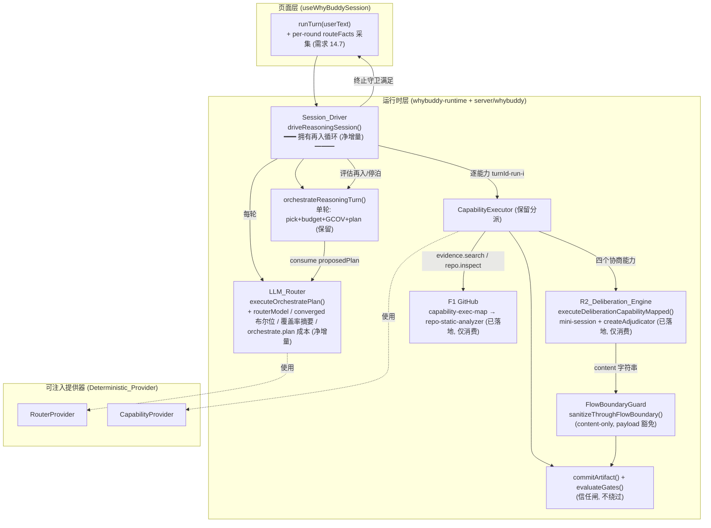

# Design Document

> **修订记录(评审对账,2026-06-11)**
> A. 新增「前置依赖(Blocking)」节与执行纪律
> B. 收敛信号机械化:路由 JSON 契约新增 `converged` 布尔字段,判定谓词 `selected.length === 0 && converged === true`;Property 13 重写
> C. FLOWB 范围钉死:仅处理 content 字符串,`artifact.payload` 豁免(S10 数据源);新增 Property 39
> D. 第 7 节补采集端(`useWhyBuddySession` per-round facts)与渲染端(`TurnRouteTimeline` 多轮)设计
> E(二次修正). 决策 4:loop 与 maxTurns 语义;**复用既有** `maxRepeatPerCapability`(缺省 6)/ `maxCapabilityRunsPerSession`(缺省 120),新增 Driver 选项 `maxLoopsPerMessage`(缺省 3);maxTurns 缺省 30 不变
> H. 二次代码对账:BudgetPolicy 真实位于 `client/src/lib/whybuddy-runtime.ts:69`,无 maxTokens;需求 11 已落地(useWhyBuddySession.ts:361 + B9 测试),降为防回归

## Overview

本设计与 `main` 上已落地代码对账,只交付 `requirements.md` 定义的**净增量**,并以「保持 / 不回退」的方式消费既有基线(R1 路由校验/降级/DLEDGER、R2 多 Agent 协商引擎、D1 差异化提示词 + 九段式报告、F1 GitHub 真实外联)。本设计**不**重新实现、**不**引入第二条并行实现。

净增量共四块:

1. **Session_Driver 多步再入循环(需求 1、2)** —— 引入运行时拥有的外层驱动函数,反复调用既有 `orchestrateReasoningTurn()`(保持其「单轮选取 + 执行 + 提交」单一职责),在覆盖率充分 / BUDGET 上限 / No_Progress / maxRepeat 守卫处停泊。这是本 spec 的**核心增量**。
2. **LLM_Router 小增量(需求 3、11)** —— 仅在既有 `executeOrchestratePlan()` 接缝上补:`config.routerModel`(低成本路由模型,缺省回退 `config.model`)、把 Coverage_Contract 的 required/conditional 摘要注入路由 prompt、以 `converged` 布尔位机械区分 `convergence_signal` 与 `invalid_proposal`。(`orchestrate.plan` 成本归因经二次对账确认**已落地**——`useWhyBuddySession.ts:361` + B9 测试——降为防回归,见需求 11。)R1 的校验/降级/DLEDGER 作为**保留基线**消费,不重新设计。
3. **evidence.search 范围边界(需求 5)** —— 保持差异化研究员提示词与「无任意网页浏览 / RAG」边界,**唯一例外**是已落地的 F1 GitHub 路径,无 GitHub 线索或取数失败时优雅降级为会话内综合。
4. **S9 多轮 turn 时间线投影升级(需求 14)** —— 扩展 `deriveTurnRoute` 多轮投影,并认领**采集端**(`useWhyBuddySession` per-round facts)与**渲染端**(`TurnRouteTimeline` 多轮序列)。

此外保留并防回归的不变量(本 spec 消费而非新建):R2 协商引擎承载四个 Deliberation_Capabilities、统一 `provenance: "llm"` 与依赖图、信任闸不绕过、DLEDGER 审计完整、确定性可测试性。

## 前置依赖(Blocking)【修订 A】

| 前置 | 阻断范围 | 验证标准 |
| --- | --- | --- |
| F0.1 invalid_proposal 修复(独立修复,不在本 spec) | **硬阻断**任务 4.3 与 7.2(产品页接线);4.1/4.2/7.1 及全部确定性测试不受阻 | 产品页非关键词输入一轮,「规划」站亮 llm 来源,DLEDGER `source: "llm"` |
| F0.2 叙述改写硬化(独立修复) | 强烈建议先于产品页接线 | 0 动作/降级回合呈现诚实模板,无不可溯源正文 |

**执行纪律**:开始 4.3 / 7.2 前必须确认 F0.1 验证标准满足;未满足则跳过并在 checkpoint 报告阻断,不得「先接上以后再修」。

### 与上一版设计的对账(删除项)

上一版设计针对过期快照编写,包含一条**复刻 R2 的第二头脑风暴路径**。本版按需求 8 显式删除:

- **删除** `decideBrainstormPath`、`BRAINSTORM_WHITELIST` / D_GATE 能力白名单,以及 D_BO / D_SYN / D_DEG 这套**重新实现 deliberation** 的设计。
- **改为**:四个 Deliberation_Capabilities `{counter.argue, critique.generate, rebuttal.resolve, synthesis.merge}` 继续运行在既有 R2 引擎 `server/whybuddy/deliberation-exec-map.ts`(mini-session + `createAdjudicator` 真实裁决 + `BrainstormSynthesizer` 综合)。本设计只**消费并防回归**该路径,不新增第二条 brainstorm 路径。
- 对应地,删除上一版 Correctness Properties 16–20(旧 D_GATE/brainstorm-path 属性),其余属性已重新编号并重映射到对账后的需求号。

### 设计原则(与项目 steering 对齐)

- **Compatibility-first**:不新建第二套推演状态源,不改 `V5SessionState` 既有字段语义,不大规模重命名 `Mission / Workflow / Runtime`。所有新行为挂在既有接缝上:`orchestrateReasoningTurn`、`CapabilityExecutor`、`validateProposedPlan`、`commitArtifact`、`evaluateGates`、`sanitizeThroughFlowBoundary`、`executeOrchestratePlan`、`deriveTurnRoute`。
- **保留 Mission/Workflow/Runtime 主干**:Session_Driver 属于运行时层(`client/src/lib/whybuddy-runtime.ts` 与 `server/whybuddy/*`),是 `orchestrateReasoningTurn` 之外的外层驱动,不触碰 Mission 编排器或十阶段工作流引擎。
- **对齐共享契约**:调度单元仍是 `(capability, role)` 对,能力池仍是 `V5_CAPABILITY_POOL`;新增类型字段以**可选字段**追加,保持 durable 旧状态兼容。

### 范围边界(来自需求文档,设计阶段确认)

不在本 spec 范围:stale-set 单调修复、GCOV/BUDGET/DLEDGER 机制本身(已落地,本 spec 仅消费/扩展)、UI/Surface 大改(需求 14.7 的多轮采集/渲染除外)、artifact-health-predicate 修复、`evidence.search` 的任意网页浏览 / RAG(F1 GitHub 路径除外)、`risk.analyze` 的多角色协商升级(推迟到独立 S10+)、P0 诊断项的修复实现(但 F0.1 为部分任务的硬前置,见上节)。

## Architecture

### 现状(as-built)调用链

页面 `useWhyBuddySession.runTurn()` 当前执行**单轮**:

```
runTurn(userText)
  → loadOrCreateSessionState(sessionId)
  → intakeMessage(state, {turnId, userText, intervention})   // 单门 INTAKE + invalidate
  → fetchOrchestratePlan(...)        // → server executeOrchestratePlan() = R1 LLM 路由(已落地)
  → orchestrateReasoningTurn(state, {proposedPlan})          // 单轮 pick + budget/GCOV gate
  → commitSelectedArtifacts(plan.selected)                   // 逐能力 ${turnId}-run-${idx} 提交
  → markAwaiting                                             // 停泊
```

能力执行侧已落地的分派(本 spec 消费):

- 四个 Deliberation_Capabilities → `executeDeliberationCapabilityMapped()`(R2 mini-session + adjudicator)。
- `evidence.search` / `repo.inspect` → `executeEvidenceSearchMapped()` / `executeRepoInspectMapped()`(F1 GitHub 取数,无线索/失败优雅降级)。
- `report.write` → `buildStructuredReport()` 九段式骨架(D1)。

问题:**没有任何一方拥有多步再入循环**。页面跑完一轮 `plan.selected` 就停。需求 1 要求「单条消息 → 自主多步推演」,需求 2 要求这个循环由运行时拥有。

### 目标架构



### 核心架构决策

**决策 1(需求 2.4,二者择一):保留 Page_Commit_Path 作为单轮提交原语,Session_Driver 成为多步推进的唯一所有者。**

页面 `runTurn` 不再自己拼「intake → orchestrate → commit 一轮」,而是调用 Session_Driver;Session_Driver 内部复用现有的单能力提交语义(`${turnId}-run-${i}`)作为每轮的 inner commit。从而:

- 既有「单次选取后逐能力提交」的 capabilityRun 标识形态 `${turnId}-run-${i}` 完全保持(需求 2.3)。
- 两条路径写入**同一** `V5SessionState`(按 `sessionId` 隔离的单一真相源),不产生第二套推演状态(需求 2.5)。
- 旧的「直接调用 orchestrateReasoningTurn」测试入口保持兼容(运行时仍导出该函数)。
- **产品页接线(任务 4.3)受 F0.1 硬阻断**;在阻断解除前,Session_Driver 仅经确定性测试与(可选)dev 页验证。

**决策 2(需求 3):LLM_Router 复用既有 `executeOrchestratePlan()`,仅补四件净增量**——`routerModel` 选择、Coverage_Contract 摘要注入、`converged` 布尔位收敛信号、`orchestrate.plan` 成本独立归因。R1 的校验(`validateProposedPlan` MAX_ITEMS 钳制)、失败降级(`heuristicFallback`)、DLEDGER `source` 标注作为**保留基线**消费,不重新设计。

**收敛信号机械契约【修订 B】**:

```jsonc
// 路由 JSON 契约(在既有 {selected, rationale} 上追加可选布尔位)
{ "selected": [], "rationale": "覆盖已充分,无需更多步骤", "converged": true }
```

- system prompt 追加一行指示:「当你确认无需更多推演步骤时,返回空 selected 并设置 "converged": true」。
- 机械判定谓词:`Array.isArray(selected) && selected.length === 0 && converged === true` → `convergence_signal`。
- `selected: []` 但 `converged !== true`(含缺省)→ 维持既有 `invalid_proposal` 降级。
- **禁止**对 rationale 文本做任何语义匹配(`includes("收敛")` 之类)——判定必须纯结构化。

**决策 3(需求 8):协商类能力继续走 R2,不新建第二条 brainstorm 路径。** 本 spec 不引入 `decideBrainstormPath` / D_GATE 白名单。`synthesis.merge` 等四个能力的执行真相源是 `deliberation-exec-map.ts`。FLOWB 只在 R2 产出进入 `commitArtifact` 形成正式 artifact 前剥离 **content** 中的 debate 协议元数据,3D 辩论墙仍可访问辩论原文。

**决策 4(需求 1.9):loop 与 maxTurns 语义【修订 E/H】。**既有预算闸语义为「每进入一个新 turnId 计 +1 toward maxTurns」。Session_Driver 每轮派生新 `loopTurnId`,因此**每个 loop 消耗一个 turn 配额**。本设计**保留**该语义(不动闸计数代码,避开 N2 邻近改动),并将其升格为显式特性:`maxTurns` 成为**会话级总循环安全阀**。**缺省值 30 不变**——`fullpath-budget` 等不变量测试硬编码 30,改默认即违背本 spec 的不回退承诺;每消息循环消耗由 `DriveReasoningOptions.maxLoopsPerMessage`(缺省 3)约束,30 配额 ≈ 10 条满循环消息,现阶段够用。后续扩容须在同一提交显式更新不变量测试并记录决策。Orchestrator 因 maxTurns 停泊时,Session_Driver 将其映射为 `stopReason: "budget_exhausted"`。

### 端到端流(多步推演示例)

```mermaid
sequenceDiagram
    participant U as 用户
    participant SD as Session_Driver
    participant R as LLM_Router
    participant O as orchestrateReasoningTurn
    participant E as CapabilityExecutor
    participant G as commit+evaluateGates

    U->>SD: 单条消息 (goal)
    loop 再入循环 (终止守卫: 覆盖率/BUDGET/No_Progress/maxRepeat)
        SD->>R: 状态摘要 (压缩, 含 Coverage_Contract 摘要)
        R-->>SD: proposedPlan {selected, rationale, converged?} + usage (orchestrate.plan 成本)
        SD->>O: orchestrateReasoningTurn(state, {proposedPlan})
        O-->>SD: {newState, plan}
        alt selected 为空且 converged === true
            SD->>SD: convergence_signal → 覆盖率闸评估 → 停泊
        else 有 selected
            loop 每个 (capability, role)
                SD->>E: executeCapability(turnId-run-i)
                note over E: 协商能力→R2; evidence.search→F1; report→九段式
                E->>G: commitArtifact (provenance=llm, evaluateGates)
            end
            SD->>SD: 重评 BUDGET(maxLoopsPerMessage/会话闸/maxTurns) + Coverage_Contract + No_Progress + maxRepeatPerCapability
        end
    end
    SD-->>U: 停泊于 AWAIT (clear / partial / No_Progress)
```

## Components and Interfaces

### 1. Session_Driver(需求 1、2 — 核心净增量)

新增运行时函数,承载再入循环。建议位置:`client/src/lib/whybuddy-runtime.ts`(与 `orchestrateReasoningTurn` 同模块,复用其内部 helper),并在 `server/whybuddy/` 暴露等价驱动以支持服务端测试。

```typescript
export interface DriveReasoningOptions {
  turnSeedId: string;                 // 基准 turn id,每轮派生 `${turnSeedId}-loop-${n}`
  userText: string;
  intervention?: UserIntervention;
  /** 注入的路由器(Deterministic_Provider 可替身)。默认走 fetchOrchestratePlan/executeOrchestratePlan。*/
  router?: ReasoningRouter;
  /** 注入的能力执行器。默认 module-level CapabilityExecutor(含 R2 / F1 分派)。*/
  executor?: CapabilityExecutor;
  /** 终止守卫上限(默认取 getDefaultBudgetPolicy)。*/
  budgetPolicy?: BudgetPolicy;
  /** 每用户消息最大循环轮数(Driver 级守卫,不进 BudgetPolicy schema)。缺省 3。*/
  maxLoopsPerMessage?: number;
}

export interface DriveReasoningResult {
  finalState: V5SessionState;
  loops: Array<{
    loopTurnId: string;
    plan: TurnPlan;
    committedArtifactIds: string[];
    stopSignal?: ReentryStopReason;
  }>;
  stopReason: ReentryStopReason;
}

export type ReentryStopReason =
  | "coverage_sufficient"   // 需求 1.4
  | "budget_exhausted"      // 需求 1.5 / 1.9 (maxLoopsPerMessage / maxCapabilityRunsPerSession / maxTurns)
  | "no_progress"           // 需求 1.7
  | "max_repeat_guard"      // 需求 1.8
  | "convergence_signal";   // 需求 3.3 (selected 空 && converged === true)

export async function driveReasoningSession(
  state: V5SessionState,
  options: DriveReasoningOptions
): Promise<DriveReasoningResult>;
```

**循环算法(每轮)**:

1. 调用 `router.proposePlan(state, ...)` 获取 `proposedPlan`(失败 → R1 既有降级到启发式,DLEDGER 记录 `local_heuristic`,本 spec 不改)。
2. 调用 `orchestrateReasoningTurn(state, {proposedPlan})` 得到 `{newState, plan}`(BUDGET/GCOV/契约充分性已在其中评估并可能直接停泊,保留行为;含 maxTurns +1/轮语义,见决策 4)。
3. **selected 空 && converged === true** → `convergence_signal` 终止(需求 3.3)。
4. 否则按 `plan.selected` 逐能力执行并提交(复用 `${loopTurnId}-run-${i}` 提交原语),新 artifact 立即进入 `newState`,下一轮作为上游可见(需求 1.6,依赖图即时更新由 `findInputsForCapability` + `commitArtifact` 保证)。
5. **重评终止守卫**(需求 1.2):
   - Coverage_Contract 所有 required 有成功 run 且 blocking gap resolved/waived → `coverage_sufficient`(需求 1.4,复用 `evaluateContractSufficiencyForBudget` / `evaluateCoverageGate`)。
   - 本消息循环轮数命中 `maxLoopsPerMessage`(缺省 3),或既有会话级闸 `maxCapabilityRunsPerSession` 触发 → `budget_exhausted` + `partial`(需求 1.5)。
   - 连续两轮无新 artifact 且未推进任何 coverage gap → `no_progress` + `partial`(需求 1.7)。
   - 某能力跨轮执行次数达既有 `maxRepeatPerCapability`(缺省 6)→ 将该能力从后续 selected 排除;若排除后无可选 → `max_repeat_guard`(需求 1.8)。
6. 每轮独立记录一条 DLEDGER(需求 1.3,由 `orchestrateReasoningTurn` 已实现,Session_Driver 不重复写)。

**No_Progress 检测**需要跨轮状态。采用**循环局部累加器**(不污染 `V5SessionState` schema):记录上一轮 artifact 数量与 `coverageGaps` 已解决集合的快照,比较本轮是否有增量。

**所有权与单一职责(需求 2.1/2.2)**:`orchestrateReasoningTurn` 保持单轮职责不变;再入循环只在 Session_Driver 内。页面提交循环不再驱动多步推进。

### 2. LLM_Router 净增量(需求 3、11)

复用 `server/whybuddy/orchestrate-plan.ts` 的 `executeOrchestratePlan()`,仅补净增量。R1 已落地能力作为保留基线**不在本节重新设计**。

```typescript
// 抽象供 Session_Driver 注入
export interface ReasoningRouter {
  proposePlan(req: OrchestratePlanRequest): Promise<OrchestratePlanResponse>;
}
```

| 需求 | 现状(R1 保留基线) | 本 spec 净增量动作 |
| --- | --- | --- |
| 3.1 routerModel | 用 `config.model` | 增加 `config.routerModel`(低成本/更快模型),缺省回退 `config.model`;模型解析 = `routerModel ?? model` |
| 3.2 覆盖率摘要注入 | `buildOrchestrateUserPrompt` 已含 goal/gaps/healthy kinds/budget/recentChose | 在 prompt 中补 Coverage_Contract 的 required 与 conditional 能力摘要 |
| 3.3 收敛信号 | 当前空 selected → `invalid_proposal` 降级 | JSON 契约加 `converged` 布尔位;`selected.length===0 && converged===true` → 透传 `convergence_signal`,不降级;**禁止 rationale 语义匹配** |
| 3.4 区分逻辑保边界 | `heuristicFallback`(no_api_key/llm_error/timeout/empty/invalid) | 保持失败降级路径**不变**:仅「空 + converged===true」走收敛分支,其余失败/非法(含空但无 converged)仍回退启发式 |
| 11.1 路由成本归因 | **已落地**:`useWhyBuddySession.ts:361` 经 `recordCapabilityRunCost` 以 `"orchestrate.plan"` 归因,B9 测试断言 | 防回归断言,不重新实现 |
| 11.2 成本可分离 | 已落地(同上) | 防回归:桶不重叠断言若缺则补**测试** |
| 11.3 摘要压缩 | 已只传 id/kind/summary | 保留:显式断言 prompt 仅含 id/kind/summary,从不含完整 content(防回归) |

**R1 保留基线(消费,不重新设计,防回归)**:状态摘要入参、`validateProposedPlan` 校验与 `maxCapabilityRunsPerTurn` 钳制、无 key/超时/抛错/空响应的 `heuristicFallback`、DLEDGER `source` 标注(需求 12)。

### 3. evidence.search 范围边界(需求 5)

保持既有 `executeEvidenceSearchMapped()`(`capability-exec-map.ts`)行为,本节只确认范围边界与降级语义,不重写差异化提示词(D1 已落地)。

```
evidence.search
  → findGithubUrlInTexts(goal, conversation, recentTexts, artifactTexts)
  ├─ 命中 github.com/owner/repo  → executeGithubMcpCapability("evidence.github.collect")
  │                                 → F1: raw.githubusercontent.com / api.github.com 真实取数 (需求 5.5)
  │                                 → 取数失败 → 优雅降级会话内综合, 不抛错, 本轮无新外部证据 (需求 5.6)
  └─ 无线索                       → ruleEvidenceFallback: 会话内材料综合, 不发起任何外联 (需求 5.4 / 5.6)
```

- **差异化研究员提示词**(需求 5.1):保持「研究员」角色专属提示词,基于 goal + 已有 artifacts 综合约束/先例/限制。
- **来源标注**(需求 5.2):结果标注证据来源 ∈ {会话内综合, F1_Github_Source 取数, 模型知识推理}。
- **provenance / 信任闸**(需求 5.3):产物 `provenance` 为 `"llm"`,经 `evaluateGates()`(与统一 provenance/gate 属性同源)。
- **无任意联网 / RAG**(需求 5.4):除 F1 GitHub 路径外,不执行任意网页浏览或向量库 RAG 检索。这是一个**负向不变量**:无 GitHub 线索时网络/RAG 接缝零调用。
- **F1 显式开口**(需求 5.5):会话上下文出现可识别 `github.com/owner/repo` 时,允许经 F1 路径对 `raw.githubusercontent.com` / `api.github.com` 真实取数。
- **优雅降级**(需求 5.6):F1 取数失败或无线索时,降级为会话内综合,不抛错,本轮不引入新外部证据。

### 4. R2_Deliberation_Engine 消费(需求 6、8 — 保留基线,仅防回归)

四个 Deliberation_Capabilities `{counter.argue, critique.generate, rebuttal.resolve, synthesis.merge}` 继续运行在已落地的 `server/whybuddy/deliberation-exec-map.ts`:

- 分派判定:`isDeliberationCapability(id)` → `executeDeliberationCapabilityMapped(args)`。
- 执行机制:`buildMiniSession` + `executeDeliberation`(critique/rebuttal 协议)+ `createAdjudicator(primaryCaller)` 真实裁决 + `BrainstormSynthesizer` 综合 + `auditSynthesis`。
- `synthesis.merge`(需求 6):经 mini-session + synthesizer 合并多方论点(`runSynthesisMerge`),`inputArtifactIds` 纳入相关上游,产出标注共识/分歧,`provenance: "llm"`。
- 降级(需求 8.5 / 6 路径):`runCritiqueSession` / `ruleRebuttalMissingUpstream` 等在无结构化质疑、超时或失败时返回 `degraded: true` + `degradedReason`,**永不抛错**(`provenance` 可为 `llm_fallback`)。

本 spec **约束**(删除项):

- **不引入** `decideBrainstormPath` / `BRAINSTORM_WHITELIST` / D_GATE 能力白名单(需求 8.3)。
- **不引入**第二条基于 `wrapStageWithBrainstorm` 的 brainstorm 路径承载上述能力(需求 8.2、6.5)。
- **不引入**独立于 R2 的第二条综合路径(需求 6.5)。
- `risk.analyze` 多角色协商升级**排除出本 spec**(需求 8.4,推迟到 S10+)。

### 5. FlowBoundaryGuard — FLOWB(需求 9)

升级 `sanitizeThroughFlowBoundary()`(现已存在 v1 行/正则剥离)为正式守卫,处理 R2 协商产出进入正式 artifact 前的剥离:

- 处理来自 `brainstorm` 与 `discussion` 来源的内容(需求 9.5)。
- 剥离所有辩论协议节点:`critique:`、`rebuttal:`、`debate:`、`challengeEdges`、`role vote`、`brainstorm console`、`brainstorm:` 标记行(需求 9.1)。
- 剥离后协议节点数量为零(需求 9.2)——剥离结果再次扫描断言无残留(幂等)。
- 每次处理生成 `FlowBoundaryCheck` 并写入 `flowBoundaryLedger`(T_LEDGER,需求 9.3)。
- 3D 辩论墙仍可访问完整 debate 内容(守卫只管正式路径,辩论原文经 `BrainstormReasoningGraph` 持久化 → 3D 墙,需求 9.4)。
- **payload 豁免(需求 9.6)【修订 C】**:FLOWB 的输入与输出**仅为 content 字符串**;`artifact.payload`(R2 结构化 Critique/Rebuttal/Adjudication,S10 折叠讨论块的数据源)在提交链路上**原样透传**,FLOWB 不读取、不修改、不置空。实现接缝上,守卫函数签名保持 `(content: string, meta) => string`,任何把 payload 传入守卫的调用形态都视为缺陷。

接入点:R2 产出在进入 `commitArtifact` 形成正式 artifact 前,其 **content** 必须先过 `sanitizeThroughFlowBoundary(content, {turnId, source})`;payload 走原有 additive 透传路径(R2c)。

### 6. 差异化 CapabilityExecutor 与统一不变量(需求 7、10 — 保留基线)

D1 已落地的差异化提示词与统一不变量,本 spec 消费并防回归:

- `provenance` 一律设为 `"llm"`(需求 10.1,含 evidence/synthesis/report 路径)。
- 通过 `findInputsForCapability(state, capabilityId)` 解析 `inputArtifactIds` 并传入执行上下文(需求 10.2);synthesis.merge 含相关上游 id(需求 6.2);report.write 含全部上游(risk/counter/evidence/synthesis)id(需求 7.2)。
- 产物经 `commitArtifact` → `evaluateGates`(需求 10.3 / 5.3 / 6.3 / 7.3),LLM 真实内容**不绕过**信任闸。
- 上游 stale 时在执行上下文标注(需求 10.4)。
- report.write 以 `buildStructuredReport()` 九段式骨架为权威基底(需求 7.1),引用全部上游并标注来源(需求 7.2)。

执行契约严格不变:executor 只返回原始 `{ title, summary, content, provenance?, payload?, usage? }`,Trust Gate / producedBy / capabilityRunId 绑定 / evidenceRefs 仍 100% 由 `commitArtifact` 拥有。

### 7. S9 多轮 turn 时间线投影升级(需求 14 — 净增量)

扩展 `shared/blueprint/whybuddy-turn-route.ts` 的 `deriveTurnRoute`,把 Session_Driver 让单个 turn 跑 N 轮的事实如实投影,并认领采集端与渲染端【修订 D】。

```typescript
// 扩展 facts:携带每轮(planning + reasoning)的派生事实数组
export type TurnRoundFacts = {
  roundIndex: number;                 // 1-based
  planSelectedCount?: number;
  planSource?: PlanSourceValue;
  planReason?: string;                // 含 BUDGET_EXCEEDED 等停泊原因
  dledgerDecisionId?: string | null;
  parkReason?: ReentryStopReason;     // 该轮终止再入时的停泊原因 (需求 14.6)
  // ...复用既有 trust/verdict 字段
};

export type TurnRouteFacts = {
  turnId: string;
  // ...既有单轮字段保持兼容(rounds 缺省时退化为单轮投影)
  rounds?: TurnRoundFacts[];          // 多轮序列 (需求 14.1)
};
```

**投影规则**:

- 为每一轮派生一对站点:planning 站点(`kind: "plan"`)+ reasoning/execution 站点(`kind: "execution"`),按 `planning₁ → reasoning₁ → planning₂ → reasoning₂ … → planningN → reasoningN` 顺序排列(需求 14.1)。
- 站点 id 形如 `${turnId}-r{roundIndex}-plan` / `${turnId}-r{roundIndex}-exec`,跨轮稳定且不重复(需求 14.5,与 `${turnId}-run-${i}` 兼容)。
- 保持既有投影不变量:**零 LLM、零 V5SessionState 写入**(纯派生函数,需求 14.2)。
- 所有站点文案继续通过 `assertRouteCopySanitized`(不含 `FORBIDDEN_TERMS`,需求 14.3)。
- 折叠态摘要 `buildRouteSummary` 的 token 序列与展开态站点 token 一致(需求 14.4)——多轮序列下投影一致性不变量仍成立。
- 某一轮因预算拦截(`planReason` 以 `BUDGET_EXCEEDED` 开头)或 `convergence_signal` 终止再入时,在该轮位置反映停泊原因(`budget_block` 站点或收敛裁决),**不再追加后续轮次站点**(需求 14.6)。

**采集端(需求 14.7)【修订 D】**:`useWhyBuddySession` 在 Session_Driver 的每轮回调(或消费 `DriveReasoningResult.loops`)中按轮采集 `TurnRoundFacts`,与既有单轮 routeFacts 采集并存;`rounds` 仅在多轮发生时填充,单轮路径零变化。

**渲染端(需求 14.7)【修订 D】**:`TurnRouteTimeline` 支持 `rounds` 序列渲染——「规划ₙ」「推演ₙ」站点对依次排列,停泊轮按既有色彩语义(预算红 / 收敛绿)收尾;折叠摘要随 `buildRouteSummary` 自动覆盖多轮。**产品页渲染接线与任务 4.3 共用 F0.1 硬前置;dev 页可先行验证。**

## Data Models

本设计**不修改** `V5SessionState` 既有字段语义。新增均为可选字段或循环局部结构,保持 durable 旧状态兼容。

### 复用的既有契约(`shared/blueprint/v5-reasoning-state.ts`)

- `Artifact`(含 `provenance`、`trustLevel`、`producedBy`、`evidenceRefs`)
- `CapabilityRun`(`${turnId}-run-${i}` 形态 id)
- `SchedulingDecision`(DLEDGER,含 `source: "llm" | "heuristic_fallback" | "local_heuristic"`)
- `CoverageContract` / `CoverageGateResult` / `CoverageGap`(GCOV)
- `FlowBoundaryCheck` / `flowBoundaryLedger`(FLOWB)
- `CapabilityCostRecord` / `costLedger`(成本台账)
- `DeliberationExecutorResult`(R2 产出,含 `degraded` / `degradedReason`)

### 新增 / 扩展【修订 E】

```typescript
// BudgetPolicy:**不新增字段、不改缺省值**。as-built 定义于 client/src/lib/whybuddy-runtime.ts:69:
//   { maxTurns: 30, maxCapabilityRunsPerTurn, maxCapabilityRunsPerSession: 120, maxRepeatPerCapability: 6 }
// (无 maxTokens;fullpath 不变量测试硬编码 maxTurns=30 等缺省值)
// Session_Driver 守卫直接消费 maxRepeatPerCapability / maxCapabilityRunsPerSession;
// 每消息循环上限走 DriveReasoningOptions.maxLoopsPerMessage(缺省 3,Driver 选项,不进 schema)。

// config 增加可选 routerModel(需求 3.1)。缺省回退 config.model。
export interface AIConfigExtension {
  routerModel?: string;
}

// 路由 JSON 契约追加可选布尔位(需求 3.3)
// OrchestratePlanResponse / LLM 原始响应: { selected, rationale, converged?: boolean }

// costLedger 归因:路由成本用独立 capabilityId 标识(值约定,非新字段)
//   - "orchestrate.plan"  → 路由成本(需求 11.1/11.2)
//   - 其余 V5CapabilityId  → 能力执行成本

// 循环局部累加器(不进 V5SessionState schema)
interface ReentryAccumulator {
  prevArtifactCount: number;
  prevResolvedGapIds: Set<string>;
  perCapabilityRunCount: Map<V5CapabilityId, number>;   // maxRepeatPerCapability 守卫(既有字段,缺省 6)
  loopCount: number;                                    // maxLoopsPerMessage 守卫(缺省 3)
  noProgressStreak: number;                             // 连续无进展轮数 (需求 1.7: ≥2 停)
}

// S9 多轮投影事实(需求 14.1)——运行时记录,零 Session_State 写入
// 见 Components 第 7 节 TurnRoundFacts / TurnRouteFacts.rounds
```

### 数据流:依赖图即时更新(需求 1.6 / 10.2)

每轮提交后,新 artifact 立即写入 `state.artifacts` 与 `dependencyGraph`;下一轮 `findInputsForCapability(state, cap)` 重新解析最新 `inputArtifactIds`,因此上游对下游即时可见。该机制已由现有 `commitArtifact` + `findInputsForCapability` 保证,Session_Driver 只需在每轮间传递累积后的 `state`(不快照陈旧状态)。

<!-- PBT 适用性评估:本特性核心是纯调度/路由/边界/投影逻辑(再入终止守卫、路由模型解析与摘要注入、收敛信号区分、evidence 范围边界、flow boundary 剥离、依赖图解析、provenance 标注、turn-route 投影)。输入空间大且存在明确的「for all」性质(钳制、幂等、剥离后零残留、投影一致性、成本桶分离)。可用 Deterministic_Provider 低成本运行 100+ 次。结论:PBT 适用。R2 协商/LLM 真实输出的语义质量本身不可判定,不写成属性。-->

## Correctness Properties

*A property is a characteristic or behavior that should hold true across all valid executions of a system—essentially, a formal statement about what the system should do.*

下列属性均在注入 Deterministic_Provider(确定性 router/executor)下可执行,无需真实 LLM 调用(需求 13.1/13.2)。LLM / R2 协商输出的语义质量本身不可判定,因此不写成属性;属性只覆盖净增量行为与本 spec 所拥有的保留/防回归不变量。每条属性映射到对账后的需求号。

### Property 1: 有 gap 且预算充足则自动再入
*For any* 存在未解决 gap 且 BUDGET 余量充足的初始状态,在注入持续产出能力的确定性 router/executor 下,Session_Driver 至少再入一轮(产生多于一个 loop),直至某终止守卫触发。
**Validates: Requirements 1.1**

### Property 2: 每次再入前重评 BUDGET 与覆盖率
*For any* N 轮再入会话,每一轮在再入前都重新评估 BUDGET 闸与 Coverage_Contract 充分性;即任一终止守卫一旦满足,Session_Driver 不再发起下一轮。
**Validates: Requirements 1.2**

### Property 3: 每轮独立记录 DLEDGER
*For any* N 轮再入会话,`decisionLedger` 中每个实际执行的 `loopTurnId` 至少对应一条调度决策记录(每轮一条)。
**Validates: Requirements 1.3**

### Property 4: 覆盖率充分则停泊
*For any* 满足「所有 required 能力都有成功 run 且所有 blocking gap 已 resolved/waived」的状态,Session_Driver 停止再入,`stopReason` 为 `coverage_sufficient` 且 `runtimePhase` 为 `awaiting`。
**Validates: Requirements 1.4**

### Property 5: 每消息循环上限则停泊 partial【修订 E/H】
*For any* 会持续产出的会话与任意 `maxLoopsPerMessage` 上限,循环轮数达到该上限时 Session_Driver 停止,`stopReason` 为 `budget_exhausted` 并标记 `partial`;既有会话级闸 `maxCapabilityRunsPerSession` 触发时同样停泊。
**Validates: Requirements 1.5**

### Property 6: 新产物下一轮即为上游可见
*For any* 产出 artifact 的轮次,下一轮针对依赖该产物的能力调用 `findInputsForCapability` 解析出的 `inputArtifactIds` 包含上一轮新产出的相关 artifact id(依赖图即时更新)。
**Validates: Requirements 1.6**

### Property 7: 连续两轮无进展则停泊
*For any* 连续两轮既无新 artifact 又未推进任何 coverage gap 的会话,Session_Driver 停止,`stopReason` 为 `no_progress` 并标记 `partial`。
**Validates: Requirements 1.7**

### Property 8: maxRepeatPerCapability 守卫
*For any* 会话与任意 `maxRepeatPerCapability` 上限,任一能力跨轮的执行次数不超过 `maxRepeatPerCapability`;达到上限后该能力被排除出后续 selected(若排除后无可选能力则 `stopReason` 为 `max_repeat_guard`)。
**Validates: Requirements 1.8**

### Property 9: capabilityRun 标识形态兼容
*For any* 多轮再入会话的任意轮次任意能力,提交的 capabilityRun id 形如 `${loopTurnId}-run-${i}`(与既有单能力提交语义兼容)。
**Validates: Requirements 2.3**

### Property 10: 单一推演状态真相源
*For any* 会话,无论经页面单轮提交路径还是 Session_Driver 多步路径推进,按 `sessionId` 解析得到同一推演状态;不产生第二套并行状态(无重复的 capabilityRun id 或 artifact id)。
**Validates: Requirements 2.5**

### Property 11: 路由模型解析与回退
*For any* AI 配置,LLM_Router 实际使用的路由模型等于 `config.routerModel ?? config.model`(配置了 routerModel 用之,否则回退主模型)。
**Validates: Requirements 3.1**

### Property 12: 覆盖率摘要注入路由 prompt
*For any* 含 Coverage_Contract 的会话状态,LLM_Router 组装的路由 prompt 中包含该合约的 required 与 conditional 能力摘要。
**Validates: Requirements 3.2**

### Property 13: 收敛信号机械判定【修订 B】
*For any* 路由响应,`convergence_signal` 透传当且仅当 `selected` 为空数组**且** `converged === true`;*For any* 其他情形——失败/非法触发条件(无 API key、抛错、超时、空响应、非法 proposal),以及 `selected: []` 但 `converged !== true`(含字段缺省)——仍走既有降级,`source` 为 `heuristic_fallback`,不被误判为收敛;判定过程对 `rationale` 文本内容不敏感(任意 rationale 字符串下结果不变)。
**Validates: Requirements 3.3, 3.4**

### Property 14: evidence.search 来源标注
*For any* evidence.search 执行结果,产物标注的证据来源属于集合 {会话内综合, F1_Github_Source 取数, 模型知识推理}。
**Validates: Requirements 5.2**

### Property 15: evidence.search 无任意联网(F1 除外)
*For any* 不含可识别 GitHub 线索的会话上下文,evidence.search 执行期间不调用任何网络 / RAG 接缝(除 F1 GitHub 路径外零外联),且不抛错。
**Validates: Requirements 5.4**

### Property 16: 存在 GitHub 线索则可走 F1 取数
*For any* 会话上下文中存在可识别 `github.com/owner/repo` 线索的情形,evidence.search 经 F1_Github_Source 路径对 `raw.githubusercontent.com` / `api.github.com` 发起取数(该取数接缝被触达)。
**Validates: Requirements 5.5**

### Property 17: evidence.search 优雅降级
*For any* 无 GitHub 线索或 F1 取数失败的情形,evidence.search 优雅降级为会话内材料综合,不抛错,且本轮不引入新的外部证据。
**Validates: Requirements 5.6**

### Property 18: 协商能力经 R2 引擎执行
*For any* 能力 ∈ `{counter.argue, critique.generate, rebuttal.resolve, synthesis.merge}`,`isDeliberationCapability` 为真,且其分派路由进 `executeDeliberationCapabilityMapped`(R2 mini-session + adjudicator),不走任何第二条 brainstorm 路径。
**Validates: Requirements 6.1, 8.1**

### Property 19: 协商失败永不抛错并降级
*For any* R2 协商执行失败 / 超时 / 缺少上游结构化质疑的条件,`executeDeliberationCapabilityMapped` 永不抛出异常,且返回结果带 `degraded` 标记与 `degradedReason`。
**Validates: Requirements 8.5**

### Property 20: LLM 能力产物 provenance 为 llm
*For any* LLM 能力(risk.analyze、counter.argue、evidence.search、synthesis.merge、report.write 等)之一,经执行并提交后,产物的 `provenance` 为 `"llm"`(不为 `"template"`)。
**Validates: Requirements 5.3, 6.3, 7.3, 10.1**

### Property 21: 上游依赖正确解析并完整纳入
*For any* 会话状态与下游合并/引用能力(synthesis.merge 纳入所有相关上游;report.write 纳入全部 risk/counter/evidence/synthesis 上游),`findInputsForCapability` 解析出的每个 `inputArtifactId` 都对应 `state.artifacts` 中既存的 artifact,且该能力定义的全部相关上游 id 都被纳入并原样传入执行上下文。
**Validates: Requirements 6.2, 7.2, 10.2**

### Property 22: LLM 产物不绕过信任闸
*For any* LLM 能力产物,提交路径必经 `evaluateGates`,产物 `trustLevel` 严格由闸结果决定;当闸失败时产物 `trustLevel` 不为 `gated_pass` 或 `audited`。
**Validates: Requirements 5.3, 6.3, 7.3, 10.3**

### Property 23: stale 上游被标注
*For any* 含 stale 上游的会话状态,能力执行上下文标注过期风险信息;不含 stale 上游时不产生该标注。
**Validates: Requirements 10.4**

### Property 24: 报告九段式结构完整
*For any* 会话状态,report.write 产物的内容包含 `buildStructuredReport` 九段式的全部段落标签(结构与既有九段式格式兼容)。
**Validates: Requirements 7.1**

### Property 25: 流边界剥离零残留且幂等
*For any* 文本与任意来源 `source ∈ {brainstorm, discussion}`(其中混入任意辩论协议标记行:critique:、rebuttal:、debate:、challengeEdges、role vote、brainstorm console、brainstorm:),`sanitizeThroughFlowBoundary` 的输出不包含任何协议标记行(剥离后协议节点数量为零),且对输出再次剥离结果不变(幂等)。
**Validates: Requirements 9.1, 9.2, 9.5**

### Property 26: 流边界处理生成一致的台账记录
*For any* 一次流边界处理,`flowBoundaryLedger` 恰好增加一条 `FlowBoundaryCheck`,且其 `strippedProtocolNodes` 数量等于该次实际剥离的协议行数,`source` 等于处理来源。
**Validates: Requirements 9.3**

### Property 27: 路由成本被记入 orchestrate.plan 桶(已落地,防回归)
*For any* 带 usage 的路由调用,`costLedger` 增加一条 `capabilityId` 为 `"orchestrate.plan"` 的成本记录。
**Validates: Requirements 11.1**

### Property 28: 路由与执行成本可分离归因(已落地,防回归)
*For any* 混合成本台账,按 `capabilityId` 分桶后路由桶(`orchestrate.plan`)与能力执行桶互不重叠,且两者各自的 token 总额之和等于全量总额(可分别回答「路由花了多少」与「执行花了多少」)。
**Validates: Requirements 11.2**

### Property 29: 路由摘要不含完整 content
*For any* 含任意长 content 的 artifacts 的会话状态,LLM_Router 组装的 prompt 不包含任何 artifact 的完整 `content`(仅含 id / kind / summary)。
**Validates: Requirements 11.3**

### Property 30: LLM 路由 DLEDGER 记录完整
*For any* LLM 路由产出 proposedPlan 的轮次,DLEDGER 记录包含 `saw`、`chose`、带原因的 `skipped`、`addresses`、`rationale`、`alternativesRejected`,且 `source` 标识为 LLM 路由来源。
**Validates: Requirements 12.1**

### Property 31: 降级时 DLEDGER 记录来源与原因
*For any* 触发回退启发式的条件,DLEDGER 记录的 `source` 为 `local_heuristic`,且 `rationale` 包含回退原因。
**Validates: Requirements 12.2**

### Property 32: 路由决策可被 challenge 重排程
*For any* 指向某条 DLEDGER 路由记录的 `UserIntervention{intent: "challenge", targetDecisionId}`,该决策被标记为 `challenged` 并触发 gap 重开与重排程(stale 级联 / coverageGap 重开)。
**Validates: Requirements 12.3**

### Property 33: 多轮投影序列正确
*For any* N 轮(N ≥ 1)round-facts 输入,`deriveTurnRoute` 为每一轮派生一对站点(planning + reasoning/execution),并按 planning₁ → reasoning₁ → … → planningN → reasoningN 顺序排列。
**Validates: Requirements 14.1**

### Property 34: 投影零 LLM 零状态写入
*For any* 输入 facts,`deriveTurnRoute` 不调用任何 LLM 接缝,也不写入 / 修改 `V5SessionState`(纯派生函数,对入参 facts 与外部状态无副作用)。
**Validates: Requirements 14.2**

### Property 35: 投影文案无禁用术语
*For any* 输入 facts,`deriveTurnRoute` 生成的所有站点文案均通过 `assertRouteCopySanitized`(不含 `FORBIDDEN_TERMS`)。
**Validates: Requirements 14.3**

### Property 36: 折叠态与展开态 token 一致(多轮)
*For any* N 轮投影,`buildRouteSummary` 折叠态摘要的 token 序列与展开态站点 token 序列保持一致(投影一致性不变量在多轮下仍成立)。
**Validates: Requirements 14.4**

### Property 37: 多轮站点 id 稳定且唯一
*For any* N 轮投影,每个派生站点 id 形如 `${turnId}-…` 前缀,且跨轮全局唯一不重复。
**Validates: Requirements 14.5**

### Property 38: 停泊轮反映停泊原因且不追加后续轮
*For any* 因预算拦截(`planReason` 以 `BUDGET_EXCEEDED` 开头)或 `convergence_signal` 终止再入的轮次,`deriveTurnRoute` 在该轮位置反映停泊原因(budget_block 站点或收敛裁决),且不再追加后续轮次的 planning/reasoning 站点。
**Validates: Requirements 14.6**

### Property 39: FLOWB payload 豁免【修订 C】
*For any* 带任意 payload 的产物提交流程,经 FLOWB 处理后,`artifact.payload` 与处理前**引用同一结构且内容逐字段相等**(FLOWB 不读取、不修改、不置空 payload);仅 content 字符串被剥离。
**Validates: Requirements 9.6**

## Error Handling

| 场景 | 处理 | 依据 |
| --- | --- | --- |
| LLM_Router 无 API key / 抛错 / 超时 / 空响应 / 非法 proposal | R1 `heuristicFallback` 返回 `source=heuristic_fallback`,Session_Driver 透明消费启发式 selected(本 spec 不改) | 需求 3.4、12.2 |
| LLM_Router 返回 `selected: []` 且 `converged === true` | 透传 `convergence_signal`,Session_Driver 停止再入并停泊 | 需求 3.3 |
| LLM_Router 返回 `selected: []` 但 `converged !== true` | 维持既有 `invalid_proposal` 降级 | 需求 3.4 |
| R2 协商超时 / 失败 / 缺上游质疑 | `executeDeliberationCapabilityMapped` never-throw,返回 `degraded` + `degradedReason`(`provenance` 可为 `llm_fallback`) | 需求 8.5 |
| evidence.search 无 GitHub 线索 | `ruleEvidenceFallback` 会话内综合,不外联,不抛错 | 需求 5.4、5.6 |
| evidence.search F1 取数失败 | 降级为会话内综合,本轮无新外部证据,不抛错 | 需求 5.6 |
| 预算超限(单轮闸 / maxLoopsPerMessage / maxCapabilityRunsPerSession / maxTurns) | 单轮与会话闸:`orchestrateReasoningTurn` 内既有处理;循环上限与 maxTurns 映射:Session_Driver 停于 `budget_exhausted` + partial | 需求 1.5、1.9 |
| No_Progress(连续两轮零增量) | Session_Driver 停止于 `no_progress` + partial | 需求 1.7 |
| 能力 maxRepeat 超限 | 从后续 selected 排除该能力;无可选则停于 `max_repeat_guard` | 需求 1.8 |
| FLOWB 输入为空 / 无协议噪音 | 原样通过,生成 `passed=true` 的 FlowBoundaryCheck | 需求 9.3 |
| 带 payload 的产物过 FLOWB | payload 原样透传,仅 content 被处理 | 需求 9.6 |
| S9 某轮停泊(预算/收敛) | 投影反映停泊原因,不追加后续轮站点 | 需求 14.6 |
| 旧 durable 状态缺少新可选字段(routerModel/maxLoopsPerMessage/rounds 等) | 全部按可选字段处理,缺省值兜底(routerModel 回退 model,rounds 缺省退化为单轮投影),不抛错 | Compatibility-first |

所有错误路径遵循既有「never-throw + 优雅降级 + 可审计台账记录」模式;外部内容(LLM 输出、R2 协商、F1 取数)视为不可信数据,仍经 `evaluateGates` 与 FLOWB(content)。

## Testing Strategy

### 双轨测试

- **单元测试(example / smoke)**:覆盖配置项与具体场景——evidence.search 差异化研究员提示词存在(需求 5.1)、synthesis.merge 经 R2 而非单提示词(需求 6.1)、共识/分歧标注(需求 6.4)、3D 辩论墙原文可读(需求 9.4)、`routerModel` 配置选择(需求 3.1 example 侧)、Session_Driver 归属与单轮职责(需求 2.1/2.2)、Page_Commit_Path 决策记录与冒烟(需求 2.4)、`BUILD_TARGET=test` 默认装配确定性替身(需求 13.3)、真实 LLM 仅显式启用(需求 13.5)、确定性套件可验证调度/依赖/provenance/闸(需求 13.2)。
- **范围负向 smoke(删除项防回归)**:断言**源码路径(client/src、server、shared,排除 docs 与 spec 文档自身)**不存在 `decideBrainstormPath` / `BRAINSTORM_WHITELIST` / 第二条 `wrapStageWithBrainstorm` 承载 Deliberation_Capabilities 的路径(需求 8.2/8.3);`risk.analyze` 未引入多角色协商(需求 8.4)。
- **属性测试(property)**:覆盖上文 39 条 Correctness Properties。

### 框架与配置

- 复用项目既有 **Vitest + fast-check**(`shared/blueprint/__tests__/whybuddy-plan-validation.test.ts`、`whybuddy-turn-route` 测试已是同模式),不从零实现 PBT。
- 每个属性测试 **最少运行 100 次迭代**(`fc.assert(..., { numRuns: 100 })` 或默认)。
- 每个属性测试以注释标注其设计属性:标签格式 **Feature: whybuddy-llm-autonomous-reasoning, Property {number}: {property_text}**
- 每条 Correctness Property 用**单个**属性测试实现。

### 确定性提供器(需求 13)

- 所有属性测试在注入 `createDeterministicRouter` / `createDeterministicCapabilityExecutor` 下运行,零真实 LLM 调用(需求 13.1/13.2)。
- 默认确定性装配下既有 vitest + fast-check 基线必须保持全绿(需求 13.4)——引入真实 LLM 路由/执行不得改变默认装配。
- 用 spy / mock 验证负向行为:evidence.search 无 GitHub 线索时网络/RAG 接缝零调用(需求 5.4)、真实 LLM 接缝在注入替身时零调用(需求 13.1)。

### 生成器要点

- **会话状态生成器**:随机 artifacts(不同 kind / trustLevel / stale 标记)、随机 coverageContract(required/conditional)、随机 gaps(open/resolved/waived)、随机 costLedger 分布(Property 1-10, 21-23, 27-29)。
- **路由响应生成器**:合法 proposal / 空+converged true / 空+converged 缺省或 false / 非法 proposal / 失败触发,且 rationale 为任意字符串(Property 11-13, 30-31)。
- **evidence 上下文生成器**:含 / 不含 `github.com/owner/repo` 线索、F1 取数成功 / 失败(Property 14-17)。
- **FLOWB 文本生成器**:随机混入七类协议标记行与正常行,覆盖非 ASCII / 空行 / 大小写、来源 ∈ {brainstorm, discussion};带随机 payload 的产物形态(Property 25/26/39)。
- **S9 round-facts 生成器**:随机 N 轮序列、含 / 不含预算拦截或收敛停泊轮(Property 33-38)。

### 既有基线回归

- 运行 `verify:whybuddy-v5` 闭环套件与相关 `node --run check`,确保新增改动不扩大 TypeScript 历史类型债基线、不破坏既有 5140+ 测试与 whybuddy fullpath 不变量(N1 直接 goal.status 写入守卫、N2 budget-before-pick 顺序、N4 legacy id 守卫),并保持 R2 / D1 / F1 既有测试全绿(防回归)。