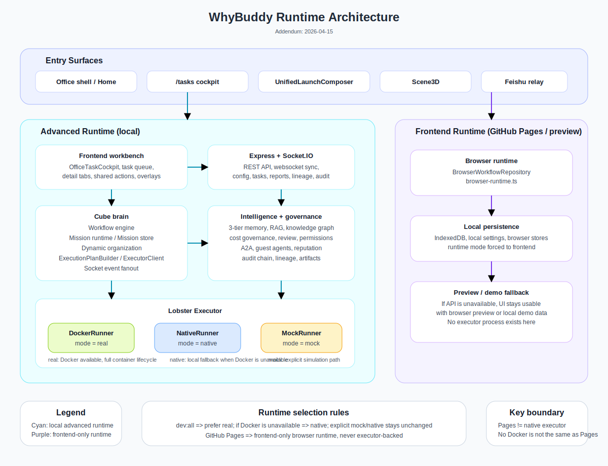

<p align="center">
  <a href="./README.md">简体中文</a> ·
  <a href="./README.en.md"><strong>English</strong></a>
</p>

<p align="center">
  
</p>

<h1 align="center">Cube Pets Office</h1>

<p align="center">
  <strong>Type one sentence. Watch an AI team self-organize in a 3D office.</strong><br />
  <sub>输入一句话，看 AI 团队在 3D 办公室里自己开工。</sub>
</p>

<p align="center">
  <a href="https://opencroc.github.io/cube-pets-office/"><strong>Live Demo (No API Key Required)</strong></a> ·
  <a href="#-quick-start">Quick Start</a> ·
  <a href="#-a-complete-execution-flow">Workflow</a> ·
  <a href="#-system-architecture">Architecture</a>
</p>

<p align="center">
  
  
  
  
  
  
  
  
</p>

<p align="center">
  <i>If this project gives you a new idea, a Star would mean a lot.</i>
</p>

---

## One-line Pitch

> **This is not just another Agent framework. It is a 3D office where you can actually see AI collaboration happen.**

Type `Plan this quarter's user growth strategy`, and the system auto-assembles an AI team: the CEO breaks down goals, managers assign work, workers execute in parallel, reviewers score the outputs, auditors inspect quality, and the whole team evolves from the feedback loop.

This is not just document generation. Tasks are turned into structured execution plans and can be dispatched into real Docker containers. What you see on screen is execution state, logs, artifacts, and final outputs, not just a Markdown report.

- No API key required for the full visual and interaction experience
- Plug in your own LLM + executor to run real task loops end to end

## Project Overview

Cube Pets Office is an open-source multi-agent visualization platform built from scratch.

Recently, `/tasks` has evolved from an "execution observer" into an "execution cockpit": cancellation, operator actions, blockers, owners, next steps, and UI feedback loops are now all in place.

At the same time, desktop `/` is being upgraded into the default execution shell: the left task queue, center `Scene3D`, right-side task/context tabs, unified launch surface, and shared bottom action area now live on one screen. `/tasks` remains the fullscreen workbench and deep-link destination. The first convergence step for launch + task operations has also landed, with `UnifiedLaunchComposer` now carrying the task-operation rail directly.

## Eight Core Strengths

### Dynamic Organization Generation

**Roles are not fixed. The system generates a CEO / manager / worker structure based on the task itself.**
Programming work and marketing strategy work produce very different organizations.

### Self-Evolving Agents

**After each workflow, agents analyze weak dimensions and patch their own persona definitions.**
Short-term, mid-term, and long-term memory make agents improve over time.

### 20-Point Review System

**Every deliverable is scored across accuracy, completeness, actionability, and format.**
Anything below 16 points is sent back automatically, and an independent auditor performs meta-review.

### Real Execution Loop

**This goes beyond planning. Structured execution plans can run inside real Docker containers.**
The UI surfaces container status, logs, and artifacts in real time.

### Dual Runtime Architecture

**The same workflow engine can run in-browser (IndexedDB + Web Worker) or on the server (Express + JSON).**
It is not locked to one side.

### End-to-End Cost Governance

**The system goes from passive observability to active control.**
Multi-level budgets, four-tier alerts, model downgrade strategies, concurrency limits, approval pauses, forecasting, and optimization suggestions are all part of the loop.

### Cross-Framework Interoperability

**Through A2A, agents can communicate directly with CrewAI, LangGraph, AutoGen, and more.**
Guest Agent mode lets external agents join the team temporarily in a sandbox.

### Tamper-Proof Audit + Data Lineage

**Hash-chained audit logs make actions tamper-evident.**
Data lineage tracking makes every source and transformation path traceable.

## A Complete Execution Flow

Instead of a passive dashboard, everything in Cube Pets Office starts with one prompt:

```text
You type: "Plan this quarter's user growth strategy"
```

| Step | Phase             | What Happens                                                                | Components                  |
| :--: | ----------------- | --------------------------------------------------------------------------- | --------------------------- |
|  1   | Dynamic Formation | Generate a CEO, managers, and workers based on task content                 | Dynamic org generator + LLM |
|  2   | CEO Breakdown     | The CEO decomposes the request into department-level directions             | Workflow engine + LLM       |
|  3   | Manager Planning  | Each manager assigns concrete tasks to workers                              | Workflow engine + LLM       |
|  4   | Worker Execution  | Workers produce deliverables in parallel                                    | Workflow engine + LLM       |
|  5   | Manager Review    | Outputs are scored across four dimensions; anything below 16/20 is returned | Review system               |
|  6   | Meta Audit        | An independent auditor checks quality and compliance                        | Audit engine                |
|  7   | Revision          | Workers revise based on returned feedback                                   | Workflow engine + LLM       |
|  8   | Verification      | Managers verify whether feedback was actually addressed                     | Review system               |
|  9   | Consolidation     | Department reports are merged into a CEO-level report                       | Workflow engine             |
|  10  | Evolution         | Agents learn from scores and update themselves                              | Evolution engine            |

> The 3D office shows every agent's live state: thinking, executing, reviewing, or idle.

## Quick Start

### Option 1: Experience Mode (No API Key Needed)

Open the [live demo](https://opencroc.github.io/cube-pets-office/) or run locally:

```bash
corepack enable
pnpm install
pnpm dev:frontend
```

You get the full 3D scene, office cockpit, dynamic organization visualization, and interaction flow directly in the browser.

### Option 2: Full Dev Mode with an LLM

```bash
cp .env.example .env
# Edit .env and at minimum set LLM_API_KEY
corepack enable
pnpm install
pnpm dev:all
```

Minimal `.env` example:

```dotenv
LLM_API_KEY=your_api_key_here
LLM_BASE_URL=https://api.openai.com/v1
LLM_MODEL=gpt-5.4
LLM_WIRE_API=responses

# Executor mode: mock / native / real
LOBSTER_EXECUTION_MODE=native
```

`pnpm dev:all` starts the frontend, server, and Lobster executor together.

### Option 3: Run the Executor Separately (Debug / Real Docker)

```bash
# Terminal 1: server
pnpm dev:server

# Terminal 2: frontend
pnpm dev:frontend

# Terminal 3: executor in mock mode
LOBSTER_EXECUTION_MODE=mock pnpm exec tsx services/lobster-executor/src/index.ts

# Or native mode (local process execution)
LOBSTER_EXECUTION_MODE=native pnpm exec tsx services/lobster-executor/src/index.ts

# Or real Docker mode
LOBSTER_EXECUTION_MODE=real pnpm exec tsx services/lobster-executor/src/index.ts
```

> Windows / PowerShell users can first run `$env:LOBSTER_EXECUTION_MODE='mock'` (or `native` / `real`) and then start the command.

### FAQ

**Q: `dev:all` or `real` mode says "Docker not found" or cannot connect to Docker. What now?**  
A: If Docker is unavailable, the system will automatically fall back to `LOBSTER_EXECUTION_MODE=native`, so the development loop still works with real execution semantics. If you only want simulation, you can still force `mock`.

## System Architecture

The diagram below reflects the 2026-04-15 project snapshot. The core stack is still Frontend / Cube Brain / Intelligence / Trust / Execution / Interop, but the primary frontend path has evolved into an office shell with an embedded task cockpit. Desktop `/` now gathers the task queue, `Scene3D`, right-side task/context tabs, unified launch entry, and shared bottom actions on one screen, while `/tasks` remains the fullscreen workbench and deep-link page.

<p align="center">
  
</p>

### 2026-04-15 Runtime Update

Runtime selection has been simplified:

- Local + Docker reachable -> `real`
- Local without Docker -> `native`
- GitHub Pages -> browser-only frontend runtime (not `native`)

Further reading:

- [Runtime current state](./.kiro/steering/2026-04-15-runtime-current-state.md)
- [Updated runtime architecture diagram](./docs/architecture-runtime-2026-04-15.svg)

<p align="center">
  
</p>

## Project Structure

```text
cube-pets-office/
├── client/                          # frontend app
│   └── src/
│       ├── components/              # Scene3D, office, tasks, nl-command, lineage, replay UI
│       ├── lib/                     # Zustand stores, API clients, utilities
│       ├── pages/                   # page-level entries
│       ├── runtime/                 # browser runtime
│       ├── workers/                 # snapshot-worker and other Web Workers
│       └── i18n/                    # Chinese / English localization
├── server/                          # backend
│   ├── core/                        # workflow-engine, dynamic-organization, A2A, swarm, governance logic
│   ├── tasks/                       # Mission runtime / store / decision
│   ├── routes/                      # REST APIs
│   ├── audit/ replay/ lineage/      # audit, replay, lineage
│   ├── knowledge/ rag/ permission/  # knowledge, retrieval, permissions
│   └── tests/                       # Vitest + fast-check
├── shared/                          # shared contracts
│   ├── mission/ executor/ nl-command/
│   ├── knowledge/ lineage/ replay/
│   ├── audit/ permission/ rag/ skill/
│   └── telemetry/ llm/ demo/ export/
├── services/lobster-executor/       # executor
│   ├── src/index.ts                 # executor entry
│   ├── src/app.ts                   # HTTP API + /health
│   ├── src/docker-runner.ts         # real Docker lifecycle
│   ├── src/mock-runner.ts           # mock mode with no Docker dependency
│   └── src/security-*.ts            # sandbox, audit, credential injection
├── .kiro/                           # specs and steering
│   ├── specs/                       # requirements / design / tasks
│   └── steering/                    # current project overview and execution guidance
├── data/                            # local JSON, replays, test data
├── scripts/                         # dev-all, smoke, worktree helpers
└── docs/                            # docs and contracts
```

## Feature Status

### Core Engine

| Capability                      | Status | Notes                                                                                              |
| ------------------------------- | :----: | -------------------------------------------------------------------------------------------------- |
| 3D office + live agent state    |   ✅   | Three.js scene with thinking / executing / reviewing / idle states                                 |
| Dynamic organization generation |   ✅   | CEO / manager / worker structure generated from task content                                       |
| Ten-stage workflow pipeline     |   ✅   | Assemble -> decompose -> plan -> execute -> review -> audit -> revise -> verify -> merge -> evolve |
| 20-point review + meta-audit    |   ✅   | Four-dimensional scoring with an independent auditor                                               |
| Three-layer memory              |   ✅   | Short-term / mid-term / long-term memory                                                           |
| Self-evolution + heartbeat      |   ✅   | Score analysis -> persona patching -> capability registration                                      |
| Mission state machine           |   ✅   | `receive -> understand -> plan -> provision -> execute -> finalize`                                |
| Dual runtime                    |   ✅   | Browser IndexedDB + server Express, same engine                                                    |

### Agent Capabilities

| Capability                              | Status | Notes                                                         |
| --------------------------------------- | :----: | ------------------------------------------------------------- |
| Hot-swappable skills                    |   ✅   | Register / unload skills at runtime without restart           |
| Dynamic role switching                  |   ✅   | Agents switch roles at runtime to adapt to the task           |
| Self-evaluation + competitive execution |   ✅   | Agents can evaluate and compete for better execution          |
| Reputation system                       |   ✅   | Reputation accumulation and decay from historical performance |
| Multimodal orchestration                |   ✅   | Unified voice + vision orchestration                          |
| Human approval flow                     |   ✅   | Generic approval + decision chains with wait states           |

### Knowledge and Retrieval

| Capability                 | Status | Notes                                               |
| -------------------------- | :----: | --------------------------------------------------- |
| Vector DB + RAG pipeline   |   ✅   | Seven-step pipeline from loading to generation      |
| Structured knowledge graph |   ✅   | Entities / relations / reasoning with visualization |
| Attachment ingestion       |   ✅   | PDF, Word, Excel, image OCR                         |

### Observability and Governance

| Capability               | Status | Notes                                                      |
| ------------------------ | :----: | ---------------------------------------------------------- |
| Live telemetry dashboard |   ✅   | Event bus + Recharts visualization                         |
| Cost observability       |   ✅   | Token tracking, model pricing, per-agent cost distribution |
| Active cost governance   |   ✅   | Budgets, alerts, downgrade strategies, audit trails        |
| Long-task recovery       |   ✅   | IndexedDB persistence with resume capability               |
| Execution replay         |   ✅   | Mission recording and timeline playback                    |

### Interaction and Integration

| Capability                      | Status | Notes                                          |
| ------------------------------- | :----: | ---------------------------------------------- |
| Natural-language command center |   ✅   | Natural language -> structured command routing |
| 3D mission fusion               |   ✅   | Mission state mapped to live 3D agents         |
| Cross-framework export          |   ✅   | Export to CrewAI / LangGraph / AutoGen         |
| Demo engine + guided flow       |   ✅   | Pre-recorded bundles + guided experience       |
| Feishu integration              |   ✅   | ACK / progress / decision callbacks            |
| Chinese + English + mobile      |   ✅   | i18n and responsive layout                     |

### Executor and Security

| Capability                              | Status | Notes                                                       |
| --------------------------------------- | :----: | ----------------------------------------------------------- |
| Real Docker lifecycle                   |   ✅   | dockerode lifecycle, logs, timeout, cleanup, HMAC callbacks |
| AI capability injection into containers |   ✅   | Secure API key injection and template presets               |
| Secure sandbox                          |   ✅   | seccomp / AppArmor, capability trimming, audit logs         |
| Live terminal + screenshot preview      |   ✅   | WebSocket terminal flow, screenshots, 3D sandbox monitor    |
| Agent permission matrix                 |   ✅   | Fine-grained tool / resource / network RBAC                 |

### Collaboration and Interop

| Capability                         | Status | Notes                                             |
| ---------------------------------- | :----: | ------------------------------------------------- |
| Cross-pod autonomous collaboration |   ✅   | Multi-node agent discovery, delegation, consensus |
| A2A interoperability               |   ✅   | Cross-framework agent communication standard      |
| Guest Agent marketplace            |   ✅   | Sandbox onboarding with TTL lifecycle             |
| Tamper-proof audit chain           |   ✅   | Hash-chained audit logs and anomaly detection     |
| Data lineage tracking              |   ✅   | DAG visualization, change detection, export       |

### UI and Experience

| Capability               | Status | Notes                                           |
| ------------------------ | :----: | ----------------------------------------------- |
| Holographic cockpit UI   |   ✅   | Glassmorphism + sci-fi control surfaces         |
| 3D agent-state fusion    |   ✅   | Status-driven halos, labels, and scene feedback |
| Tech-oriented typography |   ✅   | Space Grotesk + JetBrains Mono                  |

### Recently Completed / Nearing Completion

| Capability                             | Status | Notes                                                                                                                                                            |
| -------------------------------------- | :----: | ---------------------------------------------------------------------------------------------------------------------------------------------------------------- |
| Workflow artifact display and download |   🧪   | Implemented, only final acceptance remains                                                                                                                       |
| End-to-end task cancellation           |   ✅   | Full loop landed across UI, executor, persistence, and feedback                                                                                                  |
| Task operator action bar               |   ✅   | Pause / resume / retry / blocker / terminate unified                                                                                                             |
| First-screen task-detail redesign      |   ✅   | Primary action, owner, blocker, and next step moved to the first screen                                                                                          |
| Execution-copy refresh                 |   ✅   | UI copy converged around execution / delivery / current action                                                                                                   |
| Task-console polish                    |   ✅   | Timing, button hierarchy, visibility, empty/error states refined                                                                                                 |
| Shared launch / task-ops zone          |   🧪   | `UnifiedLaunchComposer` wired into the bottom action rail; desktop / narrow-width manual checks remain                                                           |
| Office task cockpit V1                 |   🚧   | Desktop office shell, three-column cockpit, right context tabs, unified launch surface, and bottom action area are in place; regression and manual checks remain |
| i18n cleanup                           |   📋   | Copy convergence and internationalization cleanup                                                                                                                |

### Planned Platform Capabilities

| Capability                           | Status | Notes                                         |
| ------------------------------------ | :----: | --------------------------------------------- |
| Docker Compose production deployment |   📋   | One-command full-system deployment            |
| Multi-user real-time collaboration   |   📋   | Multiple users operating the same Office      |
| Multi-tenant isolation               |   📋   | Tenant-level data and resource isolation      |
| Agent marketplace platform           |   📋   | Reputation-driven agent discovery and trading |
| K8s Agent Operator                   |   📋   | Kubernetes-native orchestration for agents    |
| Edge deployment                      |   📋   | Agent runtime on edge nodes                   |
| VR immersive extension               |   📋   | A 3D office inside VR headsets                |

## Project Scale

| Dimension           | Data                                                                                                                                                                                                                                     |
| ------------------- | ---------------------------------------------------------------------------------------------------------------------------------------------------------------------------------------------------------------------------------------- |
| TypeScript source   | **989 `.ts` / `.tsx` files, about 238,309 lines**                                                                                                                                                                                        |
| `.kiro/specs`       | **76 directories**, with the first three main layers largely landed and office-shell convergence still tightening                                                                                                                        |
| Shared contracts    | **14 `shared/**/contracts.ts` modules\*\*                                                                                                                                                                                                |
| Test coverage       | **379 test files** with Vitest + fast-check                                                                                                                                                                                              |
| Current active work | `office-task-cockpit` desktop regression and manual verification · `launch-operator-surface-convergence` final desktop checks · `workflow-artifacts-display` acceptance · `i18n-cleanup` convergence · engineering-baseline debt cleanup |
| Commits             | **397**                                                                                                                                                                                                                                  |

## Tech Stack

| Layer               | Technologies                                                               |
| ------------------- | -------------------------------------------------------------------------- |
| 3D scene            | Three.js · React Three Fiber · Drei                                        |
| Frontend            | React 19 · Vite · TypeScript · Zustand · Recharts · shadcn/ui · Ant Design |
| Backend             | Express · Socket.IO · TypeScript                                           |
| AI access           | OpenAI-compatible APIs                                                     |
| Knowledge retrieval | Vector database · RAG pipeline · knowledge graph                           |
| Testing             | Vitest · fast-check                                                        |
| Storage             | Browser: IndexedDB / Server: local JSON                                    |
| Deployment          | GitHub Pages (frontend) / Docker (executor)                                |

## Who Is This For?

| Audience          | Why it fits                                                             |
| ----------------- | ----------------------------------------------------------------------- |
| AI researchers    | Explore multi-agent coordination, delegation, and review mechanisms     |
| Students          | Learn agent architecture, task decomposition, evaluation, and evolution |
| Developers        | Use it as a visual reference for building your own agent systems        |
| Technical writers | A highly visual demo worth writing about                                |
| Curious tinkerers | See what happens when AI agents run an office                           |

## Useful Commands

```bash
pnpm dev:frontend   # frontend only
pnpm dev:server     # server only
pnpm dev:all        # frontend + server + executor
pnpm dev:stop       # stop local dev processes
pnpm exec tsx services/lobster-executor/src/index.ts  # executor only
pnpm build          # build frontend + server
pnpm build:pages    # build GitHub Pages bundle
pnpm preview        # preview frontend build
pnpm check          # TypeScript check
pnpm lint           # Prettier check
pnpm test           # client + server + executor tests
```

## Contributing

PRs are welcome. Before submitting, we recommend running `pnpm check`, `pnpm lint`, and `pnpm test`. If the branch already contains ongoing baseline issues, at minimum make sure your changes do not introduce new ones and explain the delta clearly in the PR description.

A good place to start reading core logic:

- Workflow engine -> [`server/core/workflow-engine.ts`](./server/core/workflow-engine.ts)
- Browser runtime -> [`client/src/runtime/browser-runtime.ts`](./client/src/runtime/browser-runtime.ts)

## Documentation

| Document                               | Contents                                                           |
| -------------------------------------- | ------------------------------------------------------------------ |
| [`.kiro/steering/`](./.kiro/steering/) | Current project overview, execution guidance, implementation notes |
| [`.kiro/specs/`](./.kiro/specs/)       | Requirements / design / tasks for every spec                       |
| [`ROADMAP.md`](./ROADMAP.md)           | Delivery stages and completion status                              |
| [`CHANGELOG.md`](./CHANGELOG.md)       | Recent change history                                              |
| [`docs/`](./docs/)                     | Contracts, diagrams, and architecture references                   |

## License

[MIT](./LICENSE) © Cube Pets Office Contributors

## Star History

<p align="center">
  <a href="https://star-history.com/#opencroc/cube-pets-office&Date">
    
  </a>
</p>

<p align="center">
  <strong>If this project sparks something for you, consider giving it a Star, a Fork, or a share.</strong><br />
  <sub>Made for the multi-agent community.</sub>
</p>
