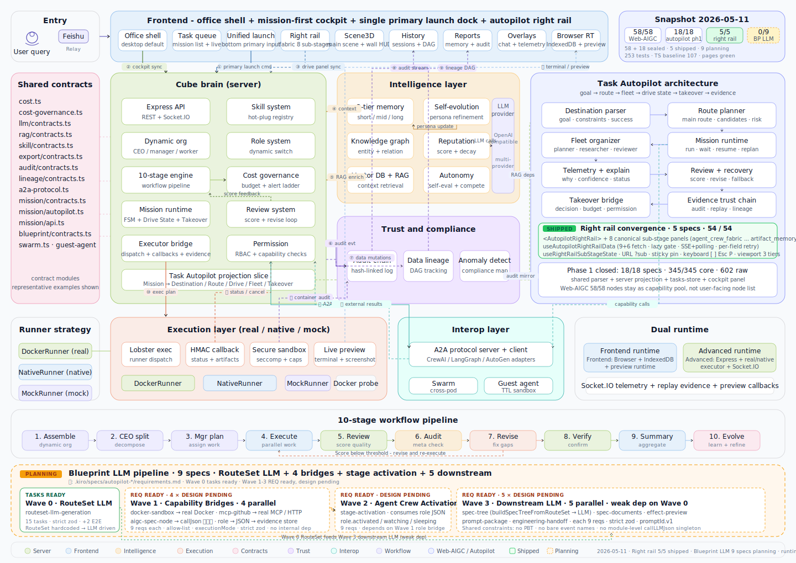

<p align="center">
  
</p>

<h1 align="center">Cube Pets Office</h1>

<p align="center">
  <a href="./README.md"><strong>English</strong></a> |
  <a href="./README.zh-CN.md"><strong>简体中文</strong></a>
</p>

<p align="center">
  <strong>Turn AI agents from chat results into an observable, controllable, executable task operating system</strong><br/>
  A task operating system for AI agents with visible workflow, real execution, and a 3D office shell.
</p>

<p align="center">
  <a href="https://opencroc.github.io/cube-pets-office/"><strong>Live Demo</strong></a>
</p>

<p align="center">
  
  
  
  
  
  
</p>

---

## What It Is

Cube Pets Office is not a chat playground. It is a task operating system that turns an AI request into a visible execution loop:

- launch a mission from natural language
- plan and break work down into stages
- run work in a real execution environment
- surface logs, artifacts, runtime evidence, and replay
- pause for clarification or human decisions when needed

The goal is to make the full task lifecycle inspectable instead of only showing the final answer.

---

## Core Surfaces

- `/` is the default office cockpit. It brings the task queue, 3D office scene, unified launch surface, and right-side context into one desktop shell.
- `/tasks` is the full-screen task workbench for focused execution and monitoring.
- `/tasks/:taskId` keeps deep-linked task detail pages available.
- `/replay/:missionId` is the replay surface for completed runs and evidence review.
- `/debug` remains a lower-frequency internal surface for diagnostics and supporting tools.

The current product direction is mission-first: the office shell and `/tasks` are the main high-frequency execution surfaces, while replay and debug stay available without competing with the primary workflow.

---

## Architecture

<p align="center">
  
</p>

<p align="center">
  
</p>

At a high level, the repository is organized around four layers:

- `client/`: React 19 + Vite frontend, including the office shell, task workbench, replay views, and 3D scene.
- `server/`: Node.js + Express + Socket.IO backend for missions, workflow state, events, replay, and APIs.
- `services/lobster-executor/`: the execution service for mock, native, and real task execution.
- `shared/`: contracts and shared types used across frontend, backend, and executor.

The runtime architecture SVG is available here:

- [docs/architecture.svg](./docs/architecture.svg)
- [docs/architecture-runtime-2026-04-21.svg](./docs/architecture-runtime-2026-04-21.svg)

---

## Web-AIGC Mainline

The Web-AIGC spec delivery baseline is closed at `58 / 58` completed specs and `238 / 238` checked top-level tasks, spanning `52` node specs and `6` platform specs. At this point, the project has moved from spec-count tracking into mainline integration, runtime hardening, and governance closure.

- The runtime mainline already includes built-in adapters, installed extra adapters, wait/resume control flow, and replay/audit observability.
- The main server entry already mounts multiple Web-AIGC route families, including MCP, Office/content nodes, search and QA, `transaction_flow`, `orchestration_recognition_jump`, and vector update/delete endpoints.
- Mainline runtime coverage already includes search/QA adapters, Office/content production nodes such as `ai_ppt`, `excel_read`, `dynamic_chart`, `file_slicing`, `file_generation`, and `file_translation`, plus governed execution paths such as `transaction_flow` and `orchestration_recognition_jump`.

For dated status snapshots and integration planning, see the steering docs linked in the documentation section below.

---

## Runtime Modes

The repo currently has three practical runtime targets:

| Environment                 | Frontend | Server | Executor behavior               |
| --------------------------- | -------- | ------ | ------------------------------- |
| GitHub Pages preview        | Yes      | No     | Browser-only preview runtime    |
| Local with Docker available | Yes      | Yes    | `real` executor mode            |
| Local without Docker        | Yes      | Yes    | `native` executor mode fallback |

Important boundaries:

- GitHub Pages is a static preview target. It does not include the Node server or Lobster Executor.
- `pnpm run dev:all` prefers `real` execution and automatically falls back to `native` when Docker is unavailable.
- If you explicitly set `LOBSTER_EXECUTION_MODE=mock` or `LOBSTER_EXECUTION_MODE=native`, that choice is preserved.

For executor details, see [docs/executor/lobster-executor.md](./docs/executor/lobster-executor.md).

---

## Quick Start

This repository uses `pnpm`. If `pnpm` is not installed globally, you can replace commands below with `corepack pnpm`.

### 1. Preview the frontend only

No API key is required for the browser-only preview flow.

```bash
pnpm install --frozen-lockfile
pnpm run dev:frontend
```

Use this when you want to explore the office shell, the 3D scene, and the demo experience quickly.

### 2. Start the full local stack

Create a local environment file first:

```bash
cp .env.example .env
```

PowerShell alternative:

```powershell
Copy-Item .env.example .env
```

Then fill the values you need in `.env` and start the stack:

```bash
pnpm run dev:all
```

Common AI-related variables:

```dotenv
LLM_API_KEY=your_api_key_here
LLM_BASE_URL=https://api.openai.com/v1
LLM_MODEL=gpt-5.4
LLM_WIRE_API=responses
```

### 3. Run services separately

This is useful when you want to debug the frontend, server, and executor independently.

```bash
pnpm run dev:server
pnpm run dev:frontend
```

Start the executor with an explicit mode:

```bash
LOBSTER_EXECUTION_MODE=real pnpm exec tsx services/lobster-executor/src/index.ts
```

PowerShell example:

```powershell
$env:LOBSTER_EXECUTION_MODE='native'
pnpm exec tsx services/lobster-executor/src/index.ts
```

---

## Release Guardrails

Useful commands:

- `pnpm run lint`: check the guarded formatting targets used by release docs and workflows.
- `pnpm run typecheck`: run the TypeScript no-emit check.
- `pnpm run test`: run client, server, and executor test entrypoints.
- `pnpm run build`: build the frontend and server bundle.
- `pnpm run test:guardrails`: run the lighter decision and socket reconnect regression path.
- `pnpm run test:release`: run the pre-release aggregate check.
- `pnpm run build:pages`: build the GitHub Pages artifact.

For release-sensitive changes, the practical minimum is:

```bash
pnpm run lint
pnpm run typecheck
pnpm run test
pnpm run build
```

---

## Repository Layout

```text
cube-pets-office/
|-- client/                    # frontend app: office shell, tasks, replay, 3D scene
|-- server/                    # backend APIs, workflow state, events, replay
|-- shared/                    # shared contracts and types
|-- services/lobster-executor/ # executor service: mock / native / real
|-- docs/                      # architecture, executor notes, reference docs
|-- scripts/                   # local dev, build, smoke, and utility scripts
|-- data/                      # local data and persisted runtime files
`-- .kiro/                     # specs, steering, and execution planning artifacts
```

If you want to start from key entrypoints, read these first:

- [client/src/App.tsx](./client/src/App.tsx)
- [client/src/pages/Home.tsx](./client/src/pages/Home.tsx)
- [client/src/pages/tasks/TasksPage.tsx](./client/src/pages/tasks/TasksPage.tsx)
- [client/src/components/office/OfficeTaskCockpit.tsx](./client/src/components/office/OfficeTaskCockpit.tsx)
- [server/index.ts](./server/index.ts)
- [server/core/workflow-engine.ts](./server/core/workflow-engine.ts)
- [services/lobster-executor/src/index.ts](./services/lobster-executor/src/index.ts)

---

## Documentation

- [ROADMAP.md](./ROADMAP.md)
- [CHANGELOG.md](./CHANGELOG.md)
- [docs/architecture.svg](./docs/architecture.svg)
- [docs/architecture-runtime-2026-04-21.svg](./docs/architecture-runtime-2026-04-21.svg)
- [docs/executor/lobster-executor.md](./docs/executor/lobster-executor.md)
- [.kiro/steering/execution-plan.md](./.kiro/steering/execution-plan.md)
- [.kiro/steering/spec-execution-roadmap.md](./.kiro/steering/spec-execution-roadmap.md)
- [.kiro/steering/web-aigc-58-plan-progress-summary-2026-04-22.md](./.kiro/steering/web-aigc-58-plan-progress-summary-2026-04-22.md)
- [.kiro/steering/web-aigc-runtime-mainline-checkpoints-2026-04-23.md](./.kiro/steering/web-aigc-runtime-mainline-checkpoints-2026-04-23.md)
- [.kiro/steering/web-aigc-phase-2-integration-plan.md](./.kiro/steering/web-aigc-phase-2-integration-plan.md)
- [.kiro/steering/web-aigc-next-phase-mainline-plan-2026-04-22.md](./.kiro/steering/web-aigc-next-phase-mainline-plan-2026-04-22.md)
- [.kiro/specs/](./.kiro/specs/)

`README.md` is kept as stable product documentation for GitHub. Rolling progress, active implementation details, and dated execution notes belong in `ROADMAP.md`, `.kiro/steering/`, and the spec archives.

---

## FAQ

### I do not have `pnpm` installed

Use `corepack pnpm` in place of `pnpm`, for example:

```bash
corepack pnpm install --frozen-lockfile
corepack pnpm run test:release
```

### Why is GitHub Pages not the same as `native` mode?

Because GitHub Pages is a static deployment target. It has no local backend process and no local executor. The Pages demo is browser-only preview runtime, not host-process execution.

### What should I run before opening a PR?

At minimum:

```bash
pnpm run lint
pnpm run typecheck
pnpm run test
```

If your change affects packaging, deployment, or end-to-end runtime behavior, also run:

```bash
pnpm run build
pnpm run test:release
```

---

## License

MIT

---

## Star History

[](https://star-history.com/#opencroc/cube-pets-office&Date)
