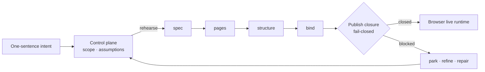

<div align="center">


**SlideRule** · product rehearsal engine

_Clarify ideas, ship a runnable product._

把想法问清楚，把产品跑起来

[](https://github.com/2686521696/WhyBuddy/stargazers)
[](https://github.com/2686521696/WhyBuddy/network)
[](https://github.com/2686521696/WhyBuddy/issues)
[](./LICENSE)
[](https://github.com/2686521696/WhyBuddy)
[](https://github.com/2686521696/WhyBuddy)
[](https://github.com/2686521696/WhyBuddy)
[](./docker-compose.yml)

[](https://forum.trae.cn/t/topic/69450)

[English](./README.md) | [简体中文](./README.zh-CN.md)

[Live demo](https://2686521696.github.io/WhyBuddy/agent-loop/sliderule) · [sliderule.ai](https://sliderule.ai) · [Repo](https://github.com/2686521696/WhyBuddy)

</div>

> [!IMPORTANT]
> **North Star:** _An AI claiming something is done does not count. Only artifacts that pass deterministic gates count._
>
> The only product main line is **SlideRule** at `/agent-loop/sliderule`. `/autopilot` is the archived v4 demo. See [NORTH_STAR.md](./docs/NORTH_STAR.md).

## ⚡ Project Overview

**SlideRule** (Chinese product name 面团 AI) is a **product rehearsal engine**. You type one sentence. It rehearses a gated product plan — then lets you run it.

A **slide rule** is an engineer’s analog calculator: scales, a cursor, and alignment before you trust a number. SlideRule is the same idea for product decisions — not a magic one-click app factory, but a **rehearsal instrument**. Every step is visible. Every artifact must pass a deterministic gate. Only then does a runnable application appear.

Compared with “an LLM with a long prompt”, six things actually run:

1. **Factory hops, one WRITE each.** `spec` → `pages` → `structure` → `bind` → `closure`. A hop that did not change a deliverable must not report `ok`.
2. **A typed control plane.** Scope cards, assumption cards, and hop intent are answers — leftover `pages` must not hijack `rehearse` / `refine`.
3. **Fail-closed publish closure.** Missing evidence is missing. Never a fake green light.
4. **The model runs as an app in the browser.** Five-system JSON is the schema: pages, RBAC, workflow, data, AIGC — zero backend for the preview.
5. **Python is the authority.** `slide-rule-python` (FastAPI `:9700`) is the live engine. Node thin-proxies `/api/sliderule` and `/api/agent-loop`.
6. **Architecture compilers, not hand-drawn maps.** `arch_graph.py` and `arch-graph-ts.mjs` fail undeclared edges, new cycles, and a growing function-body import ratchet.

> Write a PRD for days, align for weeks, wait months to learn the direction was wrong — or spend one coffee on a visible rehearsal and decide.

🏆 TRAE「一切皆可 Skill · SOLO」**Pioneer Skill Award**. [Entry](https://forum.trae.cn/t/topic/17058) · [Announcement](https://forum.trae.cn/t/topic/69450)

## 🎮 Try it (zero install)

The static demo runs in the browser — no backend, no key:

- **Rehearsal surface (start here)** → https://2686521696.github.io/WhyBuddy/agent-loop/sliderule
- **Workbench** (execution observer, not a separate product) → https://2686521696.github.io/WhyBuddy/agent-loop/workbench

Watch a captured end-to-end rehearsal, open finished examples and **run the generated app**, or BYOK (OpenAI-compatible key stays in the browser) for a live topic.

<div align="center">

</div>

[](https://www.bilibili.com/video/BV1BbEA6RE8a/?spm_id_from=333.1007.top_right_bar_window_history.content.click&vd_source=f07b7d222ea8a4494ad17a2a3911b1ae)

## 🏗️ System architecture

### Live path


```mermaid
flowchart LR
  U["One-sentence intent"] --> CTRL["Control plane<br/>scope · assumptions"]
  CTRL -->|rehearse| SPEC["spec"]
  SPEC --> PAGES["pages"]
  PAGES --> STRUCT["structure"]
  STRUCT --> BIND["bind"]
  BIND --> CLOSE{"Publish closure<br/>fail-closed"}
  CLOSE -->|closed| APP["Browser live runtime"]
  CLOSE -->|blocked| AWAIT["park · refine · repair"]
  AWAIT --> CTRL
```

### One rehearsal

| Step | Stage        | What happens                                            | Who                          |
| :--- | :----------- | :------------------------------------------------------ | :--------------------------- |
| 1    | Intent       | One sentence in the composer                            | Client                       |
| 2    | Park         | Control plane parks a scope card                        | `rehearsal_control`          |
| 3    | Confirm      | “Start rehearsal” is `forcedTool=rehearse`              | Control plane                |
| 4    | First pass   | `spec` → `pages` → `structure` → `bind` in one go       | spec-first pipeline          |
| 5    | Assumptions  | Model’s silent forks become a card; confirm to continue | `spec.assumptions`           |
| 6    | Closure      | Evidence for the six skills, or park                    | publish closure              |
| 7    | Run / refine | Browser runtime, or `refine` / `repair` / next hop      | Live runtime + control plane |

### Repo tree

```
WhyBuddy/
├── client/                 # Vite + React rehearsal UI
├── server/                 # Express thin proxy
├── slide-rule-python/      # FastAPI authority engine
│   ├── services/           # util / core / flow
│   ├── architecture.toml   # architecture gate
│   └── arch_graph.py
├── shared/                 # cross-language contracts
├── skills/sliderule/       # TRAE Skill package
├── scripts/                # dev:all · TS architecture compiler
└── docs/                   # generated architecture graphs
```

Authoritative graphs are **generated from code** (do not hand-edit):

- [SlideRule V6.2 (Python)](<./docs/SlideRule V6.2 架构图（自动生成）.md>) — 286 modules, `util` 125 · `core` 59 · `flow` 30
- [WhyBuddy TS](<./docs/WhyBuddy TS 架构图（自动生成）.md>) — 1919 modules
- [Whole repo](<./docs/WhyBuddy 全仓架构图（自动生成）.md>) · [grok-build comparison](<./docs/grok-build 架构图（自动生成）.md>) · [gap review](<./docs/对照 grok-build 的架构差距.html>)

`docs/SlideRule V5.2`–`V6.0` are historical lab notes, not the live map.

### Browser live runtime

The rehearsed model is not diagrams — the browser renders an operable system. Preview runtime: zero backend, zero database.

<div align="center">


</div>

Run the app (desktop / tablet / phone), switch roles, drive approvals, edit data in place, try declared AIGC, export with evidence.

## 🚀 Quick start (Docker)

### 1. Clone and configure

```bash
git clone https://github.com/2686521696/WhyBuddy.git && cd WhyBuddy
cp .env.example .env
```

Fill at least `LLM_API_KEY` (any OpenAI-compatible provider) and `SESSION_SECRET`. Without an LLM key the stack still boots; rehearsals fall back to deterministic templates.

### 2. Start

```bash
docker compose up -d --build
```

Open http://localhost:3000/agent-loop/sliderule

| Service  | Port                      | Role                                                                              |
| :------- | :------------------------ | :-------------------------------------------------------------------------------- |
| `app`    | `3000` (host) → `3001`    | Node + bundled frontend; SlideRule API thin-proxies to Python                     |
| `python` | `9700` (network-internal) | Rehearsal engine: spec-first hops, control plane, evidence gates, publish closure |

Main line needs **no database** (JSON file store). `mysql` is an optional profile for legacy accounts: `docker compose --profile accounts up -d`.

```bash
docker compose logs -f app python
docker compose down          # keep data volumes
docker compose down -v       # wipe data
```

<details>
<summary>📌 Deployment notes</summary>

- **Required:** `LLM_API_KEY` / `LLM_BASE_URL` / `LLM_MODEL` / `SESSION_SECRET` (64-char random hex in production).
- **Optional, fail-closed:** `WEB_SEARCH_API_KEY`, `E2B_API_KEY`.
- **Production — pull, don’t build** (`.github/workflows/deploy-images.yml`):

  ```bash
  docker compose -f docker-compose.prod.yml pull && docker compose -f docker-compose.prod.yml up -d
  # SLIDERULE_REGISTRY=ghcr.io  SLIDERULE_IMAGE_OWNER=2686521696  SLIDERULE_IMAGE_TAG=latest
  ```

- TLS-intercepting proxies: drop a PEM `.crt` into `docker/certs/` before building.
- Not in compose: Lobster Executor (DinD, opt-in), Redis (off), Feishu (mock).
- `.env` is never baked into images.

</details>

## 🔧 From source

### Requirements

Node.js 22+ · pnpm · Python 3.11+ with `slide-rule-python/.venv` · Docker optional (executor isolation)

### 1. Install

```bash
git clone https://github.com/2686521696/WhyBuddy.git && cd WhyBuddy
pnpm install
```

### 2. Run

```bash
pnpm run dev:all          # Vite :3000 + Node :3001 + Lobster :3031 + Python :9700
# pnpm run dev:sliderule  # lean: Vite :3000 + Python :9700
# pnpm run dev:frontend   # UI only, no .env (degraded / BYOK)
```

Open http://localhost:3000/agent-loop/sliderule

Restart = `pnpm run dev:stop` then `dev:all`.

## 🧩 Skill package

Self-contained Skill for Trae, Claude, or any Agent Skills host. One sentence in → a reviewable spec package (requirements / design / tasks / traceability / UI previews). Gates are **actually run by scripts** — `checks_ledger.json` records each script, exit code, and output.

```bash
unzip skills/sliderule.zip
# drop sliderule/ into the host skills directory, then give it one sentence
```

See [`skills/README.md`](./skills/README.md).

## 📝 Examples

| Input                                             | Output                                                        |
| :------------------------------------------------ | :------------------------------------------------------------ |
| Community pet-clinic booking & triage             | Spec-first hops · fail-closed closure · runnable booking app  |
| Second-hand instrument consignment & appraisal    | Consignment ledger, appraisal workbench, listing calendar     |
| Script-murder venue scheduling & party matching   | Session board, store calendars, sign-up & carpool             |
| Procurement approval with field-level permissions | Five-system model · approval state machine · RBAC field locks |

## ⚔️ How to place SlideRule

These tools solve **different jobs**. Not “we replace them all”.

| Capability                                        | Agent frameworks<br/>(CrewAI / LangGraph) | Workflow builders<br/>(Dify / n8n) | **SlideRule** |
| :------------------------------------------------ | :---------------------------------------: | :--------------------------------: | :-----------: |
| Open source                                       |                    ✅                     |                 ✅                 |      ✅       |
| Multi-agent / long orchestration                  |                    ✅                     |                 ⚠️                 |      ✅       |
| One sentence → **product structure**              |                    ❌                     |                 ❌                 |      ✅       |
| Spec package (requirements · design · tasks)      |                    ❌                     |                 ❌                 |      ✅       |
| **Evidence-gated publish closure**                |                    ❌                     |                 ❌                 |      ✅       |
| Rehearsed model **runs as an app** in the browser |                    ❌                     |                 ❌                 |      ✅       |
| Replay, audit, human park / re-enter              |                    ⚠️                     |                 ⚠️                 |      ✅       |

People compare generation UX to **v0 / Lovable / Bolt**, long deliberation to **Manus-class agents**, enterprise structure to **Power Platform**. SlideRule’s bet is the intersection: _rehearse the business system under gates, then run the model_.

## 📊 Scale

Counted from `git ls-files` (not including `.venv` / `node_modules`).

| Metric               |   Count |
| :------------------- | ------: |
| Tracked files        |   9,313 |
| TypeScript/TSX files |   3,336 |
| TypeScript lines     | 944,843 |
| Python files         |     817 |
| Python lines         | 225,678 |
| Test files           |   2,018 |
| Live modules         |   2,205 |

## 🤝 Contributing

```bash
pnpm install
pnpm run dev:sliderule    # or pnpm run dev:all
pnpm run check && pnpm run test
slide-rule-python/.venv/bin/python -m pytest slide-rule-python/tests/ -q
```

`main` is production; `pre_main` is daily integration. Merges go through the release gate:

```bash
bash scripts/merge-gated.sh <your-branch> "<message>"            # → pre_main
bash scripts/merge-gated.sh pre_main "<release message>" main    # → main
```

See [CONTRIBUTING.md](./CONTRIBUTING.md).

## ⭐ Star History

[](https://star-history.com/#2686521696/WhyBuddy&Date)

## 📄 License

[MIT](./LICENSE) · [sliderule.ai](https://sliderule.ai) · [2686521696/WhyBuddy](https://github.com/2686521696/WhyBuddy)
