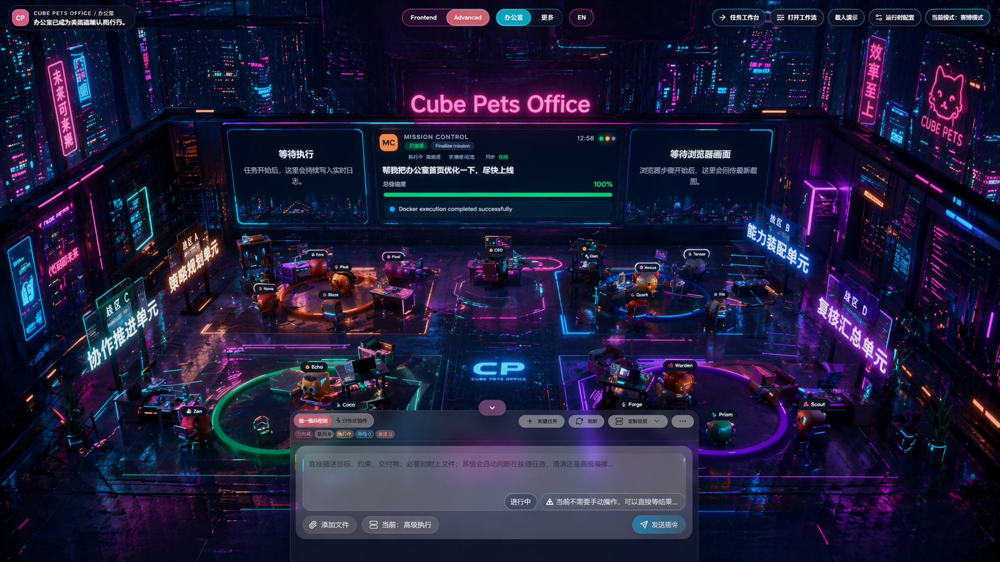

<p align="center">
  
</p>

<h1 align="center">🏢 WhyBuddy</h1>

<p align="center">
  <strong>WhyBuddy——一个由人工智能组成的团队，他们会对您的产品构想提出质疑，并在您着手开发之前对其进行演练。</strong>
</p>

<p align="center">
  <a href="./README.md"><strong>English</strong></a> ·
  <a href="./README.zh-CN.md"><strong>简体中文</strong></a>
</p>

<p align="center">
  <a href="https://github.com/xiaojilele-glitch/WhyBuddy"></a>
  <a href="./ROADMAP.md"></a>
  <a href="./CONTRIBUTING.md"></a>
</p>

<p align="center">
  
  
  
  
  
  
</p>

---

## ⚡ 30 秒了解

> **你输入一句话，系统为你推演出完整的产品方案。**
>
> 规格文档 · 系统架构 · 路线规划 · 提示词包 · 效果预览
>
> 全程可见。全部可导出。全部有证据留痕。

<br/>

<table>
<tr>
<td width="50%">

### 🎯 痛点

你花 **几天** 写 PRD，**几周** 对齐团队，**几个月** 才知道方向对不对。

</td>
<td width="50%">

### 💡 解法

输入想法 → **5 分钟** → 完整预演 → 判断值不值得做 → 不值得就换下一个。

</td>
</tr>
</table>

---

## 🧩 `whybuddy` 技能包(便携 · 可嵌入任意 Agent)

除了完整应用,WhyBuddy 还提供一个**自包含的技能包**,可以直接丢进 Trae、Claude 或任意支持 Agent Skills 的宿主。一句话进去 → 一套可评审、可交付的规格包,而且每道校验都是**脚本真跑出来的**,不是模型嘴上说一句"我检查过了"。

> **保下限,不保上限。** 确定性脚本保证*下限*——结构合法、成功标准被需求覆盖、EARS 验收、证据引用、闸结果留痕、每件产物都带来源标记;它不承诺*上限*(真深度要靠真实仓库 + 人)。它生成的每样东西,都明确标着"你能信几分"。

### 怎么用

仓库内已经提供可直接导入的技能包: [`skills/whybuddy.zip`](./skills/whybuddy.zip)。

```bash
# 1. 把技能包放进你 Agent 宿主的 skills 目录(Trae:技能 · Claude:skill)
# 2. 给它一句话想法 —— 它会产出下方整套规格包
# 3. 出图需要生图端点的 key:
export IMAGE_API_KEY=sk-...           # 或填进 image_config.json 的 api_key
# 默认:gpt-image-2 · 2K · 16:9 · 600 秒超时(均可配)

# 随时自己出图 / 重出(按模块,每个需求一张):
python scripts/finalize_previews.py           # 从 spec_tree 按模块出图
python scripts/batch_images.py prompts.txt    # 批量,直连你的端点

# 一行命令审计任何一次出图,揪出 假图 / 兜底占位 / 复制充数:
python scripts/check_previews_real.py
```

### 各种使用情况

| 类别 | 示例 |
|:-----|:-----|
| 🆕 从零做产品 | AI 会议纪要 · 收入看板 · OKR 管理 · 轻量 CRM · 简历优化 |
| 🤖 做 AI Agent | PRD 生成 · Issue 自动分诊 · 代码审查 · 投资研究 · 舆情分析 |
| 🧩 给现有项目加功能 | 给 React 加权限 · 给 Next.js 加多语言 · 给 Node API 加日志审计 · 给 FastAPI 加 OpenAPI 增强 |

### 产物包目录结构

```text
<项目名>/
├─ spec_tree.json            ← 结构源头;文档 / 矩阵 / 出图 全从它派生
├─ clarified_brief.json      目标 · 约束 · 带编号的成功标准
├─ route_options.json · selected_route.json · decision_mode.json
├─ traceability_matrix.json  可追溯矩阵:需求 ↔ 设计 ↔ 任务 ↔ 证据 ↔ 用例
├─ docs/
│  ├─ requirements.md · design.md · tasks.md
│  ├─ interface_contracts.md · test_cases.md · open_items.md
│  └─ prompt_pack.md · effect_preview.md · architecture.mmd
├─ checks_ledger.json        每道闸真跑的 脚本 + 退出码 + 输出(伪造不了)
├─ companion_log.json        伴随层留痕:挑刺者挑了啥 · 接地者引了哪些真实出处
├─ handoff_manifest.json     交付清单:每件产物带 来源 + 可信度 标
├─ previews/                 按模块的 UI 草样("预览·未验证")+ provenance.json
└─ scripts/                  确定性脚本——保下限的本体
   ├─ gate.py                     台账包装器:跑任意校验并把结果记进台账
   ├─ validate_spec_tree.py       规格树校验:结构 · 覆盖 · EARS · 证据来源
   ├─ check_content_quality.py    文档校验:必备章节 · 篇幅 · 验收是 EARS
   ├─ check_companion.py          伴随层留痕必须为真
   ├─ finalize_previews.py        出图 gate:按模块出真图,以"真成功张数"判定(不看文件是否存在)
   ├─ check_previews_real.py      审计:揪出 假图 / 兜底 / 复制充数
   ├─ batch_images.py             独立批量生图
   └─ fallback_tree.py            LLM 不可用时产出天然合法的最小树
```

### 怎么确认它没糊弄你

- **`checks_ledger.json`** — 跑了啥、退出码、输出。脚本自动写,伪造不了。
- **`companion_log.json`** — 挑刺者挑了啥、接地者引了哪些真实出处。
- **来源标记** — `previews/*.png` 标"预览·未验证";`interface_contracts.md` 标"草稿待核"。
- **`check_previews_real.py`** — 一行命令告诉你:这批图是真生成的,还是占位充数。

---

## 🔄 工作流程

```
    ╭──────────────────────────────────────────────────────────╮
    │                                                          │
    │   💬 "AI 漫剧平台"                                       │
    │       │                                                  │
    │       ▼                                                  │
    │   ① 🔍 智能澄清                                         │
    │       目标 · 约束 · 用户画像 · 成功标准                    │
    │       │                                                  │
    │       ▼                                                  │
    │   ② 🗺️ 路线规划                                         │
    │       主路线 + 备选路线 + 风险评估 + 成本预估              │
    │       │                                                  │
    │       ▼                                                  │
    │   ③ 🌳 SPEC 树                                          │
    │       拆解为模块化规格文档树                               │
    │       │                                                  │
    │       ▼                                                  │
    │   ④ 📄 规格文档（流式生成）                               │
    │       Requirements / Design / Tasks — 实时可见            │
    │       │                                                  │
    │       ▼                                                  │
    │   ⑤ 🎨 效果预览                                         │
    │       系统架构图 + 提示词包 + 可执行的下一步               │
    │       │                                                  │
    │       ▼                                                  │
    │   📦 导出 → Markdown / ZIP / 在线预览                    │
    │                                                          │
    ╰──────────────────────────────────────────────────────────╯
```

> 💡 全程 **实时可见**：3D 办公室场景展示 Agent 车队协作状态，右侧工作台展示流式生成过程与阶段进度指示器。

---

## 🤖 FSD 角色车队

七个专业化 AI 角色在每次预演中协作：

| 角色 | 职责 |
|:----:|:-----|
| 🧠 **规划师** | 把目标拆解为可执行路线 |
| ❓ **澄清师** | 填补空白、消除歧义 |
| 🔬 **研究员** | 收集上下文、验证假设 |
| ✍️ **生成器** | 产出规格文档与产物 |
| ⚙️ **执行者** | 在 Docker 沙箱中执行 |
| 👁️ **审阅者** | 检查质量、标记问题 |
| 📋 **审计员** | 维护证据链与合规性 |

每个角色可以访问 **50+ AIGC 能力节点**、Docker 沙箱、MCP 工具、Skills 与领域知识注入。

---

## ✨ 核心能力

<table>
<tr>
<td width="33%" valign="top">

### 👁️ 全流程可观测
看到每一步：活跃角色、调用能力、ReAct 循环阶段、已产出产物。**没有黑盒。**

</td>
<td width="33%" valign="top">

### 🗺️ 多路线规划
快速 / 标准 / 深度 / 保守路线，附带风险、成本和接管点。**运行前做选择。**

</td>
<td width="33%" valign="top">

### 🛑 边界处接管
澄清、审批、风险、预算、交付 — 都是明确暂停点。**永远不会静默失败。**

</td>
</tr>
<tr>
<td width="33%" valign="top">

### 🔁 证据与回放
可导出产物、审计日志、回放时间线。**任何时刻的任何决策都可追溯。**

</td>
<td width="33%" valign="top">

### 🐳 Docker 沙箱
真实代码在隔离容器中执行，HMAC 回调，实时终端流。

</td>
<td width="33%" valign="top">

### 📦 全部可导出
Markdown、ZIP 或在线预览。每次预演都是可分享的文档包。

</td>
</tr>
</table>

---

## 🚀 快速开始

```bash
git clone https://github.com/xiaojilele-glitch/WhyBuddy.git && cd WhyBuddy
pnpm install
pnpm run dev:all          # 全栈：前端 + 服务端 + 执行器
```

<details>
<summary>💻 <strong>纯浏览器模式</strong>（无需服务端，无需 .env）</summary>

```bash
pnpm run dev:frontend     # 打开 localhost:5173
```

或直接访问仓库：[xiaojilele-glitch/WhyBuddy](https://github.com/xiaojilele-glitch/WhyBuddy)。

</details>

<details>
<summary>📋 <strong>环境要求</strong></summary>

- Node.js 22+
- pnpm
- Docker（可选，完整执行器模式）

</details>

---

## 🖼️ 产品界面

<table>
  <tr>
    <td width="50%"></td>
    <td width="50%"></td>
  </tr>
  <tr>
    <td width="50%"></td>
    <td width="50%"></td>
  </tr>
  <tr>
    <td width="50%"></td>
    <td width="50%"></td>
  </tr>
</table>

---

## 📝 预演示例

> 每一个预演都是一篇可传播的内容。**50 个预演 = 50 次传播机会。**

| 💬 输入 | 📦 产出 |
|:--------|:--------|
| "AI 漫剧平台" | 6 个 SPEC 模块 · 内容流水线 · 变现模型 · 系统架构 |
| "权限管理 SaaS" | 8 个 SPEC 模块 · RBAC · 多租户 · API 契约 |
| "舆情分析工具" | 5 个 SPEC 模块 · 数据管道 · 模型选型 · 告警引擎 |
| "独立开发者记账 App" | 4 个 SPEC 模块 · 本地优先 · 同步方案 · 隐私合规 |
| "企业知识库" | 7 个 SPEC 模块 · RAG 管道 · 权限模型 · 增量索引 |
| "跨境电商选品工具" | 6 个 SPEC 模块 · 数据源集成 · 评分算法 · 竞品分析 |

---

## 🏗️ 系统架构

```
┌─────────────────────────────────────────────────────────────────┐
│  🌐 入口层        浏览器 · 飞书 Relay · 目的地输入               │
├─────────────────────────────────────────────────────────────────┤
│  🖥️ 前端层        3D 场景 · 任务驾驶舱 · 路线视图               │
│                   驾驶状态 · 接管面板 · 回放时间线                │
├─────────────────────────────────────────────────────────────────┤
│  🧠 Cube Brain    十阶段工作流 · Mission Runtime                 │
│                   动态角色 · 成本治理 · 评审                     │
├─────────────────────────────────────────────────────────────────┤
│  🔮 投影层        Mission→Destination · Workflow→Route           │
│                   State→DriveState · Decision→Takeover           │
├─────────────────────────────────────────────────────────────────┤
│  💡 智能层        三级记忆 · 知识图谱 · RAG                      │
│                   自进化 · LLM 多提供商                          │
├─────────────────────────────────────────────────────────────────┤
│  🛡️ 信任层        哈希链审计 · 血缘 DAG · 证据链                 │
├─────────────────────────────────────────────────────────────────┤
│  ⚙️ 执行层        Docker 容器 · HMAC · 沙箱 · 实时终端           │
├─────────────────────────────────────────────────────────────────┤
│  🔗 互操作层      A2A 协议 · Swarm · Guest Agent 市场            │
└─────────────────────────────────────────────────────────────────┘
```

---

## 🛠️ 技术栈

| 层 | 技术 |
|:---|:-----|
| 前端 | React 19 · Vite · TypeScript · Zustand · Three.js (R3F) · Framer Motion |
| 服务端 | Express · Socket.IO · TypeScript |
| AI | OpenAI 兼容接口（任意提供商） |
| 执行 | Docker (dockerode) · 浏览器运行时 · 原生运行时 |
| 测试 | Vitest · fast-check (PBT) |
| 存储 | IndexedDB（浏览器端）· JSON（服务端） |

---

## 📊 项目规模

| 指标 | 数量 |
|:-----|-----:|
| 项目文件 | 4,707 |
| TypeScript/TSX 文件 | 1,837 |
| TypeScript 行数 | 486,932 |
| 测试文件 | 723 |
| 测试用例 | 7,771 |
| 规格目录 | 273 |
| 规格 Markdown | 879 |
| 任务检查项 | 7,093 ✅ / 1,072 ⬜ |

---

## ⚔️ 与其他平台对比

| 特性 | Dify | n8n | CrewAI | LangGraph | **本项目** |
|:-----|:---:|:---:|:---:|:---:|:---:|
| 开源 | ✅ | ✅ | ✅ | ✅ | ✅ |
| 一句话到完整产品 | ❌ | ❌ | ❌ | ❌ | ✅ |
| 规格文档生成（需求+设计+任务） | ❌ | ❌ | ❌ | ❌ | ✅ |
| 多路线规划 | ❌ | ❌ | ❌ | ⚠️ | ✅ |
| 多角色 Agent 车队 | ❌ | ❌ | ✅ | ✅ | ✅ |
| 实时 3D 可观测 | ❌ | ❌ | ❌ | ❌ | ✅ |
| 人工接管治理 | ⚠️ | ⚠️ | ❌ | ❌ | ✅ |
| 回放与审计 | ❌ | ❌ | ❌ | ❌ | ✅ |
| Docker 沙箱 | ❌ | ⚠️ | ❌ | ❌ | ✅ |
| 导出 Markdown/ZIP | ❌ | ❌ | ❌ | ❌ | ✅ |
| 纯浏览器演示 | ❌ | ❌ | ❌ | ❌ | ✅ |

---

## 🤝 贡献

```
1. Fork & clone → pnpm install
2. pnpm run dev:frontend（UI）或 pnpm run dev:all（全栈）
3. 提交前：node --run check && pnpm run test
```

详见 [CONTRIBUTING.md](./CONTRIBUTING.md)。

---

## ⭐ Star History

> 引擎产出的每一份预演都是帮助他人发现可能性的内容。Star 这个仓库，帮助更多人找到它。

[](https://star-history.com/#xiaojilele-glitch/WhyBuddy&Date)

---

<p align="center">
  <a href="./LICENSE"><strong>MIT 协议</strong></a> · 托管于 <a href="https://github.com/xiaojilele-glitch/WhyBuddy">xiaojilele-glitch/WhyBuddy</a>
</p>
