<p align="center">
  
</p>

<p align="center">
  <strong>A Simple and Universal Product Rehearsal Engine, Speccing Anything.
简洁通用的产品推演引擎，推演万物。</strong>
</p>

<p align="center">
  <sub>TRAE Skill 挑战赛作品 / 社区展示项目 · 原名 <strong>WhyBuddy</strong>（2026-06 改名 SlideRule）</sub>
</p>

<blockquote>
<strong>进度说明：</strong>当前工程化项目进度暂时落后于 SlideRule Skill。如需完整产品预演体验，请优先使用 <a href="./skills/sliderule.zip">SlideRule Skill</a>；工程化项目仍在持续推进中。
</blockquote>

<p align="center">
  <a href="./README.md"><strong>English</strong></a> ·
  <a href="./README.zh-CN.md"><strong>简体中文</strong></a>
</p>

<p align="center">
  <a href="https://github.com/xiaojilele-glitch/SlideRule"></a>
  <a href="./ROADMAP.md"></a>
  <a href="./CONTRIBUTING.md"></a>
</p>

<p align="center">
  
  
  
  
  
  
</p>

---

## ⚡ 30 秒了解

> **你输入一句话，系统为你推演出完整的产品方案。**
>
> 规格文档 · 系统架构 · 路线规划 · 提示词包 · 效果预览
>
> 全程可见。全部可导出。全部有证据留痕。

<br/>

<table>
<tr>
<td width="50%">

### 🎯 痛点

你花 **几天** 写 PRD，**几周** 对齐团队，**几个月** 才知道方向对不对。

</td>
<td width="50%">

### 💡 解法

输入想法 → **5 分钟** → 完整预演 → 判断值不值得做 → 不值得就换下一个。

</td>
</tr>
</table>

---


## 🖼️ 产品界面

来自 SlideRule 示例预演的 16 张界面合成照片墙。


**观看完整产品预演演示**

基于 TRAE SOLO 的产品预演全流程自动化：从一句话想法到可执行规格。

[](https://www.bilibili.com/video/BV1BbEA6RE8a/?spm_id_from=333.1007.top_right_bar_window_history.content.click&vd_source=f07b7d222ea8a4494ad17a2a3911b1ae)

点击上方视频封面即可跳转到 B 站演示视频。

---

## 🧩 `sliderule` 技能包(便携 · 可嵌入任意 Agent)

除了完整应用,SlideRule 还提供一个**自包含的技能包**,可以直接丢进 Trae、Claude 或任意支持 Agent Skills 的宿主。一句话进去 → 一套可评审、可交付的规格包,而且每道校验都是**脚本真跑出来的**,不是模型嘴上说一句"我检查过了"。

> **保下限,不保上限。** 确定性脚本保证*下限*——结构合法、成功标准被需求覆盖、EARS 验收、证据引用、闸结果留痕、每件产物都带来源标记;它不承诺*上限*(真深度要靠真实仓库 + 人)。它生成的每样东西,都明确标着"你能信几分"。

### 怎么用

仓库内已经提供可直接导入的技能包: [`skills/sliderule.zip`](./skills/sliderule.zip)。

```bash
# 1. 把技能包放进你 Agent 宿主的 skills 目录(Trae:技能 · Claude:skill)
# 2. 给它一句话想法 —— 它会产出下方整套规格包
# 3. 出图需要生图端点的 key:
export IMAGE_API_KEY=sk-...           # 或填进 image_config.json 的 api_key
# 默认:gpt-image-2 · 2K · 16:9 · 600 秒超时(均可配)

# 随时自己出图 / 重出(按模块,每个需求一张):
python scripts/finalize_previews.py           # 从 spec_tree 按模块出图
python scripts/batch_images.py prompts.txt    # 批量,直连你的端点

# 一行命令审计任何一次出图,揪出 假图 / 兜底占位 / 复制充数:
python scripts/check_previews_real.py
```

### 生图配置说明

所有生图设置集中在项目根目录的 **`image_config.json`** 一个文件里。

```jsonc
{
  "enabled": true,
  "mode": "http",                    // "http" | "dry_run" | "mcp" | "command"
  "model": "gpt-image-2",           // ← 在这里改模型
  "api_key": "",                     // ← 在这里填 Key(或用下面的环境变量)
  "timeout": 600,                    // 每张图请求的超时秒数
  "out_dir": "previews",
  "http": {
    "url": "",                       // ← 在这里填生图端点地址
    "method": "POST",
    "headers": {
      "Content-Type": "application/json",
      "Authorization": "Bearer ${IMAGE_API_KEY}"   // 从环境变量解析
    },
    "body_template": {
      "model": "${MODEL}",           // 自动取顶层 "model" 值
      "prompt": "${PROMPT}",         // 按模块自动填入
      "response_format": "b64_json",
      "image_size": "2K",            // "512" | "1K" | "2K" | "4K"
      "aspect_ratio": "16:9",
      "n": 1
    }
  }
}
```

**只需配三样东西：**

| 配什么 | 改哪里 | 示例 |
|:-------|:------|:-----|
| **API Key** | 环境变量 `IMAGE_API_KEY`(推荐) 或 `image_config.json → api_key` | `export IMAGE_API_KEY=sk-abc123...` |
| **端点地址** | `image_config.json → http.url` | `https://api.openai.com/v1/images/generations` |
| **模型名** | `image_config.json → model` | `gpt-image-2` / `gemini-2.5-flash-image` / `gemini-3.1-flash-image-preview` |

> 优先级：环境变量 `IMAGE_API_KEY` > 配置文件 `api_key`。两者都空时,出图跳过,gate 记录 "no key"。

### 各种使用情况

| 类别 | 示例 |
|:-----|:-----|
| 🆕 从零做产品 | AI 会议纪要 · 收入看板 · OKR 管理 · 轻量 CRM · 简历优化 |
| 🤖 做 AI Agent | PRD 生成 · Issue 自动分诊 · 代码审查 · 投资研究 · 舆情分析 |
| 🧩 给现有项目加功能 | 给 React 加权限 · 给 Next.js 加多语言 · 给 Node API 加日志审计 · 给 FastAPI 加 OpenAPI 增强 |

### 产物包目录结构

```text
<项目名>/
├─ spec_tree.json            ← 结构源头;文档 / 矩阵 / 出图 全从它派生
├─ clarified_brief.json      目标 · 约束 · 带编号的成功标准
├─ route_options.json · selected_route.json · decision_mode.json
├─ traceability_matrix.json  可追溯矩阵:需求 ↔ 设计 ↔ 任务 ↔ 证据 ↔ 用例
├─ docs/
│  ├─ requirements.md · design.md · tasks.md
│  ├─ interface_contracts.md · test_cases.md · open_items.md
│  └─ prompt_pack.md · effect_preview.md · architecture.mmd
├─ checks_ledger.json        每道闸真跑的 脚本 + 退出码 + 输出(伪造不了)
├─ companion_log.json        伴随层留痕:挑刺者挑了啥 · 接地者引了哪些真实出处
├─ handoff_manifest.json     交付清单:每件产物带 来源 + 可信度 标
├─ previews/                 按模块的 UI 草样("预览·未验证")+ provenance.json
└─ scripts/                  确定性脚本——保下限的本体
   ├─ gate.py                     台账包装器:跑任意校验并把结果记进台账
   ├─ validate_spec_tree.py       规格树校验:结构 · 覆盖 · EARS · 证据来源
   ├─ check_content_quality.py    文档校验:必备章节 · 篇幅 · 验收是 EARS
   ├─ check_companion.py          伴随层留痕必须为真
   ├─ finalize_previews.py        出图 gate:按模块出真图,以"真成功张数"判定(不看文件是否存在)
   ├─ check_previews_real.py      审计:揪出 假图 / 兜底 / 复制充数
   ├─ batch_images.py             独立批量生图
   └─ fallback_tree.py            LLM 不可用时产出天然合法的最小树
```

### 怎么确认它没糊弄你

- **`checks_ledger.json`** — 跑了啥、退出码、输出。脚本自动写,伪造不了。
- **`companion_log.json`** — 挑刺者挑了啥、接地者引了哪些真实出处。
- **来源标记** — `previews/*.png` 标"预览·未验证";`interface_contracts.md` 标"草稿待核"。
- **`check_previews_real.py`** — 一行命令告诉你:这批图是真生成的,还是占位充数。

---

## 🔄 工作流程

闭环路线按 v4 架构图来走：实线是主交付链路，虚线是运行时支撑、反馈、失效与回炉。

```text
用户想法 / 仓库 / 文件 / 截图
        │
        ▼
01 输入层
   原始输入 → GitHub 链接判断 → 深度解析或降级 → 归一化项目上下文
        │
        ▼
02 澄清层
   缺失信息 → 澄清问题 → 就绪度判断 → 带目标、约束、成功标准的澄清简报
        │
        ▼
03 路线规划
   标准 / 深度 / 升级路线 → 风险与成本对比 → 路线选择 → 轻量确认闸
        │
        ▼
决策与协作
   简单任务走单 Agent；复杂任务进入头脑风暴、多角色、综合器与工具代理
        │
        ▼
04 规格树生成核心
   提示词构造 → 脱敏 → LLM JSON → Schema 校验 → 不变量守卫 → 来源追踪 → SPEC 树
        │
        ▼
05 规格文档
   requirements.md · design.md · tasks.md，并回链验收、证据与测试用例
        │
        ▼
06 效果预览与交付
   提示词包 · 效果预览 · UI 草样 · Mermaid 架构图 · 可追溯矩阵 · ZIP/MD 导出
        │
        ▼
评审与反馈闭环
   通过就交付；不通过就回到澄清、路线、依赖失效与重新生成
```

运行时层伴随主链路工作：任务仓/产物仓、事件总线、Socket 推送、实时状态仓、节点状态派生和回放。质量门负责闭环收口：测试、内容质量校验、合并门槛，以及记录真实脚本输出的校验台账。

---

## 🤖 FSD 角色车队

v4 总图不再把角色车队理解成固定开会的一排角色，而是通过 **决策门** 在“单 Agent 直达”和“多角色协作”之间切换。

| 角色层 | 什么时候出现 | 职责 |
|:------|:------------|:-----|
| **单 Agent** | 路线简单、风险低 | 从澄清简报直接推进到 SPEC 树与规格文档 |
| **头脑风暴板** | 路线复杂或存在歧义 | 进入讨论、投票、分工与审计模式 |
| **决策角色** | 昂贵生成前 | 选择标准 / 深度 / 升级路线，并记录信心分 |
| **规划角色** | 路线与依赖拆解时 | 拆目标、阶段、兜底路径和重规划预算 |
| **架构角色** | SPEC 树与交付设计时 | 对齐需求、设计、任务、证据与接口契约 |
| **执行角色** | 需要工具支撑时 | 通过工具代理调用 Docker、MCP、GitHub 与 Skills |
| **审计角色** | 出现质量或证据风险时 | 检查不变量、来源追踪、台账输出和评审缺口 |
| **UI 角色** | 需要预览或交付界面时 | 把规格转成 UI 草样和可见交付物 |
| **挑刺者** | 模糊度高、真仓库风险高、证据不足时触发 | 找漏洞、找缺证据处、压住过度自信 |
| **接地者** | 需要真实代码或真实出处时触发 | 读真仓库，把真实引用逼进结果里 |
| **综合器** | 多角色协作后 | 合并方案、信心分和分歧意见，收敛成一条路线 |

所有角色共用工具代理，但“挑刺者 / 接地者”是**按需伴随**的：它们横切输入、澄清、路线规划和规格生成，只在风险值得多绕一圈时触发。

---

## ✨ 核心能力

<table>
<tr>
<td width="33%" valign="top">

### 01 接地输入
原始输入可以是一句话、仓库、文件或截图。GitHub 链接触发深度解析；不可访问的来源会变成显式降级状态，而不是静默失败。

</td>
<td width="33%" valign="top">

### 02 路线决策
生成前先比较标准、深度、升级路线。确认闸会提前暴露成本、风险和接管点。

</td>
<td width="33%" valign="top">

### 03 SPEC 树守卫
SPEC 树不是单纯模型输出。Schema 校验、稳定 ID 归一化、不变量守卫、来源追踪和确定性兜底共同保护结构。

</td>
</tr>
<tr>
<td width="33%" valign="top">

### 04 交付追溯
需求、设计、任务、证据、测试、提示词包、预览、接口、未决项与导出物，通过可追溯矩阵和交付清单串起来。

</td>
<td width="33%" valign="top">

### 05 运行时真相
任务仓、产物仓、事件总线、Socket 推送、实时状态仓、节点状态派生和回放，让可见流程与持久化产物保持一致。

</td>
<td width="33%" valign="top">

### 06 反馈与失效
评审、用户修改、依赖失效、失效索引、自动重算、升级转人工和重规划预算，让迭代成为系统内建能力。

</td>
</tr>
<tr>
<td width="33%" valign="top">

### 07 伴随审查
挑刺者和接地者会在模糊度、真仓库风险、证据缺口出现时触发，逼流程引用真实来源并暴露薄弱假设。

</td>
<td width="33%" valign="top">

### 08 预览分流
UI 草样走生成式预览并标注“预览·未验证”；结构架构图从 SPEC 树确定性渲染，不交给生图模型猜。

</td>
<td width="33%" valign="top">

### 09 质量台账
测试、内容质量校验、合并门槛和台账条目，会记录每个质量声明背后的脚本、退出码与输出。

</td>
</tr>
</table>

---

## 🚀 快速开始

```bash
git clone https://github.com/xiaojilele-glitch/SlideRule.git && cd SlideRule
pnpm install
pnpm run dev:all          # 全栈：前端 + 服务端 + 执行器
```

<details>
<summary>💻 <strong>纯浏览器模式</strong>（无需服务端，无需 .env）</summary>

```bash
pnpm run dev:frontend     # 打开 localhost:5173
```

或直接访问仓库：[xiaojilele-glitch/SlideRule](https://github.com/xiaojilele-glitch/SlideRule)。

</details>

<details>
<summary>📋 <strong>环境要求</strong></summary>

- Node.js 22+
- pnpm
- Docker（可选，完整执行器模式）

</details>

---

## 📝 预演示例

> 每一个预演都是一篇可传播的内容。**50 个预演 = 50 次传播机会。**

| 💬 输入 | 📦 产出 |
|:--------|:--------|
| "AI 漫剧平台" | 6 个 SPEC 模块 · 内容流水线 · 变现模型 · 系统架构 |
| "权限管理 SaaS" | 8 个 SPEC 模块 · RBAC · 多租户 · API 契约 |
| "舆情分析工具" | 5 个 SPEC 模块 · 数据管道 · 模型选型 · 告警引擎 |
| "独立开发者记账 App" | 4 个 SPEC 模块 · 本地优先 · 同步方案 · 隐私合规 |
| "企业知识库" | 7 个 SPEC 模块 · RAG 管道 · 权限模型 · 增量索引 |
| "跨境电商选品工具" | 6 个 SPEC 模块 · 数据源集成 · 评分算法 · 竞品分析 |

---

## 🏗️ 系统架构

```
┌─────────────────────────────────────────────────────────────────┐
│  🌐 入口层        浏览器 · 飞书 Relay · 目的地输入               │
├─────────────────────────────────────────────────────────────────┤
│  🖥️ 前端层        3D 场景 · 任务驾驶舱 · 路线视图               │
│                   驾驶状态 · 接管面板 · 回放时间线                │
├─────────────────────────────────────────────────────────────────┤
│  🧠 Cube Brain    十阶段工作流 · Mission Runtime                 │
│                   动态角色 · 成本治理 · 评审                     │
├─────────────────────────────────────────────────────────────────┤
│  🔮 投影层        Mission→Destination · Workflow→Route           │
│                   State→DriveState · Decision→Takeover           │
├─────────────────────────────────────────────────────────────────┤
│  💡 智能层        三级记忆 · 知识图谱 · RAG                      │
│                   自进化 · LLM 多提供商                          │
├─────────────────────────────────────────────────────────────────┤
│  🛡️ 信任层        哈希链审计 · 血缘 DAG · 证据链                 │
├─────────────────────────────────────────────────────────────────┤
│  ⚙️ 执行层        Docker 容器 · HMAC · 沙箱 · 实时终端           │
├─────────────────────────────────────────────────────────────────┤
│  🔗 互操作层      A2A 协议 · Swarm · Guest Agent 市场            │
└─────────────────────────────────────────────────────────────────┘
```

<!-- BEGIN SLIDERULE_SKILL_ARCH -->

来源: [SlideRule Skill 闭环架构图 v4](./docs/assets/SlideRuleArc/SlideRuleSkill%E9%97%AD%E7%8E%AF%E6%80%BB%E5%9B%BE_%E6%94%B9%E8%BF%9B%E7%89%88v4.md)

```mermaid
flowchart TB

U["用户想法 / User Idea<br/>一句话目标 · 仓库 · 文件 · 截图"]:::entry

subgraph S1["01 输入层 / Input"]
  direction TB
  IN_RAW["原始输入 / Raw Input"]:::input
  IN_GH{"有 GitHub 链接? / Has repo URL?"}:::gate
  IN_INGEST["★ GitHub 深度解析 / Deep Ingestion<br/>文件 · 符号 · 接口契约"]:::input
  IN_FALL["降级状态 / Fallback<br/>权限失败 · 仓库不可访问"]:::fallback
  IN_NORM["归一化 / Normalize<br/>去重 · 证据 · 失败状态"]:::input
  IN_CTX["项目上下文 / Project Context<br/>目标 · 摘要 · 来源 · 证据"]:::input
end

subgraph S2["02 澄清层 / Clarification"]
  direction TB
  CL_GAP["缺失信息 / Missing Info<br/>阻塞 · 非阻塞"]:::clarify
  CL_Q["澄清问题 / Questions"]:::clarify
  CL_READY{"就绪度 / Readiness<br/>可规划? 还是继续补充?"}:::gate
  CL_BRIEF["澄清简报 / Clarified Brief<br/>目标 · 约束 · 成功标准"]:::clarify
end

subgraph S3["03 路线规划 / Route Planning"]
  direction TB
  RT_GEN["多路线生成 / Multi-Route<br/>标准 · 深度 · 升级"]:::route
  RT_CMP["对比 · 风险 / Compare · Risk"]:::route
  RT_SEL["路线选择 / Route Selection"]:::route
  RT_GATE{"轻量确认闸 / Confirm Gate"}:::gate
end

subgraph DG["决策与协作 / Decision and Collaboration"]
  direction TB
  D_GATE{"决策门 / Decision Gate<br/>简单 or 复杂?"}:::decision
  D_SA["单 Agent / Single-Agent"]:::decision
  D_BO["头脑风暴 / Brainstorm<br/>模式: 讨论 · 投票 · 分工 · 审计"]:::decision
  D_ROLES["多角色 / Roles<br/>决策 · 规划 · 架构 · 执行 · 审计 · UI"]:::decision
  D_SYN["综合器 / Synthesizer<br/>方案 · 信心分 · 分歧意见"]:::decision
  D_TOOLS["工具代理 / Tool Proxy<br/>Docker · MCP · GitHub · Skills"]:::tool
  D_DEG["降级兜底 / Degradation"]:::fallback
end

subgraph CO["★ 伴随式审查与接地 / Companion · 按需触发：模糊度·真仓库·风险"]
  direction TB
  CO_CRIT["★ 挑刺者 / Critic<br/>找漏洞 · 证据不足处"]:::companion
  CO_GROUND["★ 接地者 / Grounding<br/>读真代码 · 逼挂真实出处"]:::companion
end

subgraph S4["04 规格树生成核心 / SPEC Tree Generation Core"]
  direction TB
  SP_PROMPT["★ 提示词构造 / Prompt Builder<br/>成功标准→需求 · 验收用 EARS"]:::spec
  SP_REDACT["脱敏 / Redaction"]:::spec
  SP_LLM["LLM JSON 生成 / callJson<br/>retryAttempts = 1"]:::spec
  SP_SCHEMA{"Schema 校验 / Validator"}:::gate
  SP_NORM["归一化 / Normalizer<br/>稳定 ID 重映射"]:::spec
  SP_INV{"★ 不变量守卫 / Invariant Guard<br/>唯一根 · 父可达 · 深度 · 无环<br/>+ 需求覆盖成功标准 · 每节点挂证据"}:::gate
  SP_FALL["确定性兜底 / Deterministic Fallback<br/>已预先满足不变量"]:::fallback
  SP_PROV["来源追踪 / Provenance<br/>llm · llm_fallback · template"]:::spec
  SP_TREE["规格树 / SPEC Tree<br/>Requirements · Design · Tasks · Evidence(带真实出处)"]:::artifact
end

subgraph S5["05 规格文档 / SPEC Document"]
  direction TB
  SD_GEN["文档生成器 / Doc Generator"]:::doc
  SD_DOCS["文档 / Docs<br/>requirements.md · design.md · tasks.md"]:::doc
  SD_ACC["验收 · 证据 · 用例 / Acceptance · Evidence · Tests"]:::doc
end

subgraph S6["06 效果预览与交付 / Preview and Handoff"]
  direction TB
  EP_PACK["提示词包 / Prompt Pack"]:::preview
  EP_PREV["效果预览 / Effect Preview"]:::preview
  EP_VIS_GEN["◆ 视觉预览·生成 / Gen Preview<br/>按模块(每需求一页)→生图模型<br/>只认真成功张数·防复制·禁兜底·503重试<br/>UI 草样 · 标『预览·未验证』"]:::preview
  EP_VIS_REND["★ 结构图·渲染 / Rendered<br/>规格树→Mermaid 确定性出图<br/>架构总图 · 不交给生图模型"]:::preview
  EP_VIS_AUDIT["◆◆ 出图审计 / check_previews_real<br/>查 provenance：兜底·假成功(ok却带error)·复制充数<br/>用户自跑，agent 改不了这步"]:::companion
  EP_MATRIX["★ 可追溯矩阵 / Traceability<br/>需求↔设计↔任务↔证据↔用例"]:::preview
  EP_HAND["交付包 · 导出 / Handoff · Export<br/>md·zip · 接口契约(草稿·待核) · 验收用例<br/>未决项登记 · 校验台账 · 视觉预览(标来源)"]:::preview
end

subgraph S7["07 运行时与状态 / Runtime and State"]
  direction TB
  WF_JOB["任务仓 · 产物 / Job · Artifact Store"]:::runtime
  WF_EVT["事件总线 / Event Bus<br/>每阶段产出都落事件"]:::runtime
  WF_SOCK["实时推送 / Socket Relay"]:::runtime
  WF_STORE["实时状态仓 / Realtime Store<br/>按 sessionId 隔离"]:::runtime
  WF_DERIVE["状态派生器 / deriveNodeStatus<br/>实时进度 + 已存文档 → 单一真相"]:::runtime
  WF_ROW["节点行 / Node Row<br/>待生成 · 生成中 · 完成 · 失败 · 重试成功"]:::runtime
  WF_REPLAY["回放 / Replay"]:::runtime
end

subgraph S8["08 失效与依赖 / Invalidation and Dependency"]
  direction TB
  DEP["依赖图 / Dependency Graph<br/>上游变更 → 下游影响"]:::danger
  INV["失效引擎 / Invalidation Engine"]:::danger
  STALE["失效索引 / Stale Index<br/>staleSince · reason · fromStage"]:::danger
  RECOMP["自动重算 / Auto-Recompute<br/>沿依赖链重建下游"]:::danger
end

subgraph S9["评审与反馈闭环 / Review and Feedback"]
  direction TB
  RV{"评审 / Review<br/>交付 or 回炉?"}:::feedback
  FB["反馈 / Feedback"]:::feedback
  RP{"重规划 / Replan<br/>预算 · 收敛阈值"}:::feedback
  ESC["失败 · 中止 · 转人工 / Fail · Abort · Escalate"]:::fallback
  ITER["用户修改再推演 / User Iterate"]:::feedback
end

subgraph QA["质量门 / Quality Gate"]
  direction TB
  QA_TEST["测试 / Tests<br/>状态 · SSR · E2E · 截图"]:::qa
  QA_CONTENT["★ 内容质量校验 / Content Check<br/>规格成立 · 验收为 EARS 句式"]:::qa
  QA_MERGE{"合并门槛 / Merge Gate<br/>自动断言 + 人工目检"}:::gate
  QA_LEDGER["★ 校验台账 / Checks Ledger<br/>脚本 · 退出码 · 输出"]:::ledger
end

DONE["交付完成 / Shipped"]:::artifact

subgraph LEGEND["图例 / Legend （颜色与连线一致）"]
  direction TB
  LG_B["蓝 实线 / Blue<br/>主流程 Main flow"]:::pBlue
  LG_O["橙 实线 / Orange<br/>决策与协作 Decision"]:::pOrange
  LG_P["紫 实线 / Purple<br/>规格树生成核心 SPEC core"]:::pPurple
  LG_G["绿 实线 / Green<br/>产物 · 文档 · 交付 Artifacts"]:::pGreen
  LG_GR["灰 虚线 / Gray dashed<br/>运行时 · 工具 · 支撑 Runtime"]:::pGray
  LG_R["红 虚线 / Red dashed<br/>失效 · 回炉 · 反馈 Loops"]:::pRed
  LG_NEW["★ 青虚线 / Teal dashed<br/>新增：伴随角色·视觉·矩阵·台账"]:::pLedger
end

%% ===== 蓝色 主流程 (0-14) =====
U --> IN_RAW
IN_RAW --> IN_GH
IN_GH -->|有仓库 / yes| IN_INGEST
IN_GH -->|无仓库·直接跳过 / no| IN_NORM
IN_INGEST --> IN_NORM
IN_NORM --> IN_CTX
IN_CTX --> CL_GAP
CL_GAP --> CL_Q
CL_Q --> CL_READY
CL_READY -->|就绪 / ready| CL_BRIEF
CL_BRIEF --> RT_GEN
RT_GEN --> RT_CMP
RT_CMP --> RT_SEL
RT_SEL --> RT_GATE
RT_GATE -->|确认 / confirm| D_GATE

%% ===== 橙色 决策与协作 (15-20) =====
D_GATE -->|简单 / simple| D_SA
D_GATE -->|复杂 / complex| D_BO
D_BO --> D_ROLES
D_ROLES --> D_SYN
D_SA --> SP_PROMPT
D_SYN --> SP_PROMPT

%% ===== 紫色 规格树生成核心 (21-28) =====
SP_PROMPT --> SP_REDACT
SP_REDACT --> SP_LLM
SP_LLM --> SP_SCHEMA
SP_SCHEMA -->|结构通过| SP_NORM
SP_NORM --> SP_INV
SP_INV -->|不变量通过| SP_PROV
SP_FALL --> SP_PROV
SP_PROV --> SP_TREE

%% ===== 绿色 产物·文档·交付 (29-40) =====
SP_TREE --> SD_GEN
SD_GEN --> SD_DOCS
SD_DOCS --> SD_ACC
SD_ACC --> EP_PACK
SD_DOCS --> EP_PACK
SP_TREE --> EP_PREV
EP_PACK --> EP_HAND
EP_PREV --> EP_HAND
SP_TREE --> WF_JOB
SD_DOCS --> WF_JOB
EP_HAND --> RV
RV -->|通过·交付| DONE

%% ===== 灰色虚线 运行时·工具·支撑 (41-60) =====
D_SA -. 调用工具 .-> D_TOOLS
D_ROLES -. 调用工具 .-> D_TOOLS
D_TOOLS -. 证据返回 .-> D_ROLES
WF_JOB -. 事件 .-> WF_EVT
WF_EVT -.-> WF_SOCK
WF_SOCK -.-> WF_STORE
WF_STORE -.-> WF_DERIVE
WF_JOB -. 已存文档 .-> WF_DERIVE
WF_DERIVE -.-> WF_ROW
WF_JOB -.-> WF_REPLAY
WF_REPLAY -. 按会话隔离 .-> WF_STORE
WF_ROW -. 驱动预览 .-> EP_PREV
WF_ROW -. 失效提示 .-> RV
CL_BRIEF -. 成功标准派生验收 .-> SD_ACC
WF_ROW -.-> QA_TEST
WF_STORE -.-> QA_TEST
SP_TREE -. 内容质量校验 .-> QA_CONTENT
QA_TEST -.-> QA_MERGE
QA_CONTENT -.-> QA_MERGE
QA_MERGE -. 放行发布 .-> DONE

%% ===== 红色虚线 失效·回炉·反馈 (61-92) =====
IN_INGEST -. 权限失败 .-> IN_FALL
IN_FALL -.-> IN_NORM
CL_READY -. 未就绪·回去补充 .-> CL_GAP
RT_GATE -. 调整·退回 .-> RT_SEL
D_GATE -. 失败·超时 .-> D_DEG
D_BO -. 异常 .-> D_DEG
D_TOOLS -. 不可达 .-> D_DEG
D_DEG -. 兜底→单Agent .-> D_SA
D_BO -. 可回灌路线 .-> RT_GEN
D_BO -. 可回灌澄清 .-> CL_GAP
SP_LLM -. 超时·非JSON·先重试 .-> SP_LLM
SP_SCHEMA -. 结构失败 .-> SP_FALL
SP_INV -. 不变量失败 .-> SP_FALL
DEP -. 计算下游影响 .-> INV
INV -.-> STALE
STALE -. 同步前端 .-> WF_STORE
STALE -.-> RECOMP
RECOMP -. 重建规格树 .-> SP_PROMPT
RECOMP -. 重建文档 .-> SD_GEN
RECOMP -. 重建预览 .-> EP_PREV
RV -. 回炉 .-> FB
FB -.-> RP
FB -. 上游变更 .-> INV
RP -. 回到澄清 .-> CL_GAP
RP -. 回到路线 .-> RT_GEN
RP -. 回到规格树 .-> SP_PROMPT
RP -. 重判模式 .-> D_GATE
RP -. 使下游失效 .-> INV
RP -. 超预算·不收敛 .-> ESC
EP_PREV -. 用户不满 .-> ITER
ITER -. 再推演 .-> RP
QA_MERGE -. 不通过·回炉 .-> FB

%% ===== ★ v1 改动 青虚线 (93-100) =====
CL_BRIEF -. 成功标准派生需求 .-> SP_PROMPT
SP_SCHEMA -. 校验结果 .-> QA_LEDGER
SP_INV -. 校验结果 .-> QA_LEDGER
QA_TEST -. 结果 .-> QA_LEDGER
QA_CONTENT -. 结果 .-> QA_LEDGER
QA_MERGE -. 结果 .-> QA_LEDGER
QA_LEDGER -. 随交付导出 .-> EP_HAND
QA_LEDGER -. 落盘存档 .-> WF_JOB

%% ===== ★ v2 新增：伴随角色 + 视觉分流 + 追溯矩阵 (101-111) =====
CO_CRIT -. 伴随挑刺 .-> CL_GAP
CO_GROUND -. 伴随接地 .-> IN_INGEST
CO_GROUND -. 伴随接地 .-> CL_BRIEF
CO_CRIT -. 伴随挑刺 .-> RT_CMP
CO_CRIT -. 伴随挑刺 .-> SP_PROMPT
SD_DOCS -. 转生图提示词 .-> EP_VIS_GEN
EP_VIS_GEN -.-> EP_HAND
SP_TREE -. 确定性渲染 .-> EP_VIS_REND
EP_VIS_REND -.-> EP_HAND
SP_TREE -. 汇总追溯 .-> EP_MATRIX
EP_MATRIX -.-> EP_HAND

%% ===== ◆ v3 新增：伴随留痕进台账 + 按模块出图 gate 进台账 (112-115) =====
CO_CRIT -. 留痕进台账 .-> QA_LEDGER
CO_GROUND -. 留痕进台账 .-> QA_LEDGER
SP_TREE -. 按模块驱动出图 .-> EP_VIS_GEN
EP_VIS_GEN -. 出图核验·进台账 .-> QA_LEDGER

%% ===== ◆◆ v4 新增：出图可信层 (116-118) =====
EP_VIS_GEN -. 出图后必审计 .-> EP_VIS_AUDIT
EP_VIS_AUDIT -. 审计结果进台账 .-> QA_LEDGER
EP_VIS_AUDIT -. 揪出假图·回炉重出 .-> EP_VIS_GEN

%% ===== 节点样式（按层）=====
classDef entry fill:#eef6ff,stroke:#2563eb,color:#0f172a,stroke-width:2px;
classDef input fill:#eff6ff,stroke:#2563eb,color:#111827,stroke-width:1.5px;
classDef clarify fill:#fff7ed,stroke:#f97316,color:#111827,stroke-width:1.5px;
classDef route fill:#fff7ed,stroke:#ea580c,color:#111827,stroke-width:1.5px;
classDef decision fill:#ecfeff,stroke:#0891b2,color:#111827,stroke-width:1.5px;
classDef tool fill:#cffafe,stroke:#0e7490,color:#111827,stroke-width:1.5px;
classDef spec fill:#f5f3ff,stroke:#7c3aed,color:#111827,stroke-width:1.5px;
classDef doc fill:#ecfdf5,stroke:#10b981,color:#111827,stroke-width:1.5px;
classDef preview fill:#ecfdf5,stroke:#16a34a,color:#111827,stroke-width:1.5px;
classDef runtime fill:#f8fafc,stroke:#64748b,color:#111827,stroke-width:1.5px;
classDef danger fill:#fff1f2,stroke:#ef4444,color:#111827,stroke-width:1.5px;
classDef feedback fill:#fff1f2,stroke:#ef4444,color:#111827,stroke-width:1.5px;
classDef fallback fill:#fee2e2,stroke:#dc2626,color:#111827,stroke-width:1.5px;
classDef artifact fill:#dcfce7,stroke:#16a34a,color:#111827,stroke-width:2px;
classDef qa fill:#f8fafc,stroke:#475569,color:#111827,stroke-width:1.5px;
classDef gate fill:#fffbeb,stroke:#d97706,color:#111827,stroke-width:2px;
classDef ledger fill:#ccfbf1,stroke:#0f766e,color:#0f172a,stroke-width:2px;
classDef companion fill:#ccfbf1,stroke:#0f766e,color:#0f172a,stroke-width:1.5px;

%% ===== 图例样式（描边=对应线色）=====
classDef pBlue fill:#eff6ff,stroke:#2563eb,color:#0f172a,stroke-width:3px;
classDef pOrange fill:#fff7ed,stroke:#ea580c,color:#0f172a,stroke-width:3px;
classDef pPurple fill:#f5f3ff,stroke:#7c3aed,color:#0f172a,stroke-width:3px;
classDef pGreen fill:#ecfdf5,stroke:#16a34a,color:#0f172a,stroke-width:3px;
classDef pGray fill:#f8fafc,stroke:#64748b,color:#0f172a,stroke-width:3px;
classDef pRed fill:#fff1f2,stroke:#ef4444,color:#0f172a,stroke-width:3px;
classDef pLedger fill:#ccfbf1,stroke:#0f766e,color:#0f172a,stroke-width:3px;

%% ===== 连线着色（按声明顺序，分段对应路径）=====
linkStyle 0,1,2,3,4,5,6,7,8,9,10,11,12,13,14 stroke:#2563eb,stroke-width:2.5px;
linkStyle 15,16,17,18,19,20 stroke:#ea580c,stroke-width:2.5px;
linkStyle 21,22,23,24,25,26,27,28 stroke:#7c3aed,stroke-width:2.5px;
linkStyle 29,30,31,32,33,34,35,36,37,38,39,40 stroke:#16a34a,stroke-width:2.5px;
linkStyle 41,42,43,44,45,46,47,48,49,50,51,52,53,54,55,56,57,58,59,60 stroke:#64748b,stroke-width:1.8px,stroke-dasharray:5 4;
linkStyle 61,62,63,64,65,66,67,68,69,70,71,72,73,74,75,76,77,78,79,80,81,82,83,84,85,86,87,88,89,90,91,92 stroke:#ef4444,stroke-width:1.8px,stroke-dasharray:6 4;
linkStyle 93,94,95,96,97,98,99,100 stroke:#0f766e,stroke-width:2.5px,stroke-dasharray:4 3;
linkStyle 101,102,103,104,105,106,107,108,109,110,111 stroke:#0f766e,stroke-width:2px,stroke-dasharray:4 3;
linkStyle 112,113,114,115 stroke:#db2777,stroke-width:2px,stroke-dasharray:3 3;
linkStyle 116,117,118 stroke:#dc2626,stroke-width:2px,stroke-dasharray:3 3;
```



<!-- END SLIDERULE_SKILL_ARCH -->

---

## 🛠️ 技术栈

| 层 | 技术 |
|:---|:-----|
| 前端 | React 19 · Vite · TypeScript · Zustand · Three.js (R3F) · Framer Motion |
| 服务端 | Express · Socket.IO · TypeScript |
| AI | OpenAI 兼容接口（任意提供商） |
| 执行 | Docker (dockerode) · 浏览器运行时 · 原生运行时 |
| 测试 | Vitest · fast-check (PBT) |
| 存储 | IndexedDB（浏览器端）· JSON（服务端） |

---

## 📊 项目规模

| 指标 | 数量 |
|:-----|-----:|
| 项目文件 | 5,457 |
| TypeScript/TSX 文件 | 2,234 |
| TypeScript 行数 | 575,591 |
| 测试文件 | 921 |
| 规格目录 | 303 |

---

## ⚔️ 与其他平台对比

| 特性 | Dify | n8n | CrewAI | LangGraph | **本项目** |
|:-----|:---:|:---:|:---:|:---:|:---:|
| 开源 | ✅ | ✅ | ✅ | ✅ | ✅ |
| 一句话到完整产品 | ❌ | ❌ | ❌ | ❌ | ✅ |
| 规格文档生成（需求+设计+任务） | ❌ | ❌ | ❌ | ❌ | ✅ |
| 多路线规划 | ❌ | ❌ | ❌ | ⚠️ | ✅ |
| 多角色 Agent 车队 | ❌ | ❌ | ✅ | ✅ | ✅ |
| 实时 3D 可观测 | ❌ | ❌ | ❌ | ❌ | ✅ |
| 人工接管治理 | ⚠️ | ⚠️ | ❌ | ❌ | ✅ |
| 回放与审计 | ❌ | ❌ | ❌ | ❌ | ✅ |
| Docker 沙箱 | ❌ | ⚠️ | ❌ | ❌ | ✅ |
| 导出 Markdown/ZIP | ❌ | ❌ | ❌ | ❌ | ✅ |
| 纯浏览器演示 | ❌ | ❌ | ❌ | ❌ | ✅ |

---

## 🤝 贡献

```
1. Fork & clone → pnpm install
2. pnpm run dev:frontend（UI）或 pnpm run dev:all（全栈）
3. 提交前：node --run check && pnpm run test
```

详见 [CONTRIBUTING.md](./CONTRIBUTING.md)。

---

## ⭐ Star History

> 引擎产出的每一份预演都是帮助他人发现可能性的内容。Star 这个仓库，帮助更多人找到它。

[](https://star-history.com/#xiaojilele-glitch/SlideRule&Date)

---

<p align="center">
  <a href="./LICENSE"><strong>MIT 协议</strong></a> · 托管于 <a href="https://github.com/xiaojilele-glitch/SlideRule">xiaojilele-glitch/SlideRule</a>
</p>
