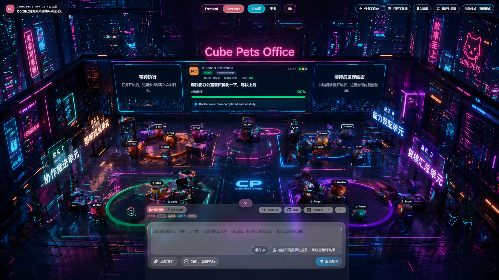
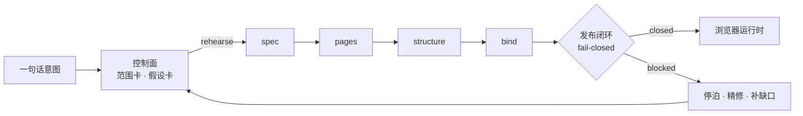

<div align="center">



**SlideRule** · 产品推演引擎

_把想法问清楚，把产品跑起来_

Clarify ideas, ship a runnable product.

[](https://github.com/2686521696/WhyBuddy/stargazers)
[](https://github.com/2686521696/WhyBuddy/network)
[](https://github.com/2686521696/WhyBuddy/issues)
[](./LICENSE)
[](https://github.com/2686521696/WhyBuddy)
[](https://github.com/2686521696/WhyBuddy)
[](https://github.com/2686521696/WhyBuddy)
[](./docker-compose.yml)

[](https://forum.trae.cn/t/topic/69450)

[English](./README.md) | [简体中文](./README.zh-CN.md)

[在线演示](https://2686521696.github.io/WhyBuddy/agent-loop/sliderule) · [sliderule.ai](https://sliderule.ai) · [仓库](https://github.com/2686521696/WhyBuddy)

</div>

> [!IMPORTANT]
> **北极星：** _AI 声称完成不算数，过了确定性门的产物才算数。_
>
> 唯一产品主线是 **SlideRule**，入口 `/agent-loop/sliderule`。`/autopilot` 是已归档的 v4 演示。详见 [NORTH_STAR.md](./docs/NORTH_STAR.md)。

## ⚡ 项目概述

**SlideRule**（产品中文名 **面团 AI**）是一台**产品推演引擎**。你输入一句话，它推演一份过了门的产品方案——并让你直接跑起来。

**计算尺（slide rule）** 是工程师的模拟计算工具：刻度、游标，先对齐再相信读数。SlideRule 把同一套思路用在产品决策上——不是魔法式的「一键 App 工厂」，而是一台**推演仪器**。每一步都可见，每件产物必须过确定性门，只有过门之后才长出可运行的应用。

相比「套着长 prompt 的 LLM」，真正在跑的是这六条：

1. **工厂 hop，一跳一件 WRITE。** `spec` → `pages` → `structure` → `bind` → `closure`。交付物一个字节没变，不许报 `ok`。
2. **typed 控制面。** 范围卡、假设卡、hop 意图是答案——残留的 `pages` 不许劫持 `rehearse` / `refine`。
3. **fail-closed 发布闭环。** 缺证据就是缺，不许伪造绿灯。
4. **模型在浏览器里跑成应用。** 五系统 JSON 即 schema：页面、RBAC、工作流、数据、AIGC——预览运行时零后端。
5. **Python 是权威。** 活路径在 `slide-rule-python`（FastAPI `:9700`）。Node 只薄代理 `/api/sliderule` 与 `/api/agent-loop`。
6. **架构靠编译器，不靠手画。** `arch_graph.py` 与 `arch-graph-ts.mjs` 卡住未声明的边、新增的环、以及函数体 import 棘轮（只许变少）。

> 写 PRD 要几天，对齐团队要几周，验证方向要几个月——或者一杯咖啡看完一场可见的推演，再决定值不值得做。

🏆 TRAE「一切皆可 Skill · SOLO」**先锋技能奖**。[参赛帖](https://forum.trae.cn/t/topic/17058) · [获奖公示](https://forum.trae.cn/t/topic/69450)

## 🎮 立即体验（零安装）

静态演示完全在浏览器里跑——无后端、无需 key：

- **推演界面（从这里开始）** → https://2686521696.github.io/WhyBuddy/agent-loop/sliderule
- **工作台**（执行观察面板，不是独立产品） → https://2686521696.github.io/WhyBuddy/agent-loop/workbench

看一场端到端捕获的完整推演，打开完成态示例并**运行生成的应用**，或 BYOK（OpenAI 兼容 key 只存在浏览器）对新话题真跑。

<div align="center">

</div>

[](https://www.bilibili.com/video/BV1BbEA6RE8a/?spm_id_from=333.1007.top_right_bar_window_history.content.click&vd_source=f07b7d222ea8a4494ad17a2a3911b1ae)

## 🏗️ 系统架构

### 活路径


```mermaid
flowchart LR
  U["一句话意图"] --> CTRL["控制面<br/>范围卡 · 假设卡"]
  CTRL -->|rehearse| SPEC["spec"]
  SPEC --> PAGES["pages"]
  PAGES --> STRUCT["structure"]
  STRUCT --> BIND["bind"]
  BIND --> CLOSE{"发布闭环<br/>fail-closed"}
  CLOSE -->|closed| APP["浏览器运行时"]
  CLOSE -->|blocked| AWAIT["停泊 · 精修 · 补缺口"]
  AWAIT --> CTRL
```

### 一次完整推演

| 步骤 | 阶段     | 主要操作                                           | 谁在跑              |
| :--- | :------- | :------------------------------------------------- | :------------------ |
| 1    | 意图     | 作曲家里输入一句话                                 | 前端                |
| 2    | 停泊     | 控制面弹出范围卡                                   | `rehearsal_control` |
| 3    | 确认     | 「开始推演」= `forcedTool=rehearse`                | 控制面              |
| 4    | 首轮产出 | `spec` → `pages` → `structure` → `bind` 一口气跑完 | spec-first 流水线   |
| 5    | 假设卡   | 模型替你定的分叉摊开，确认继续才往下               | `spec.assumptions`  |
| 6    | 闭环     | 六技能证据齐了才发布，否则停泊                     | 发布闭环            |
| 7    | 跑 / 改  | 浏览器运行时，或 `refine` / `repair` / 下一跳      | 运行时 + 控制面     |

### 仓库结构

```
WhyBuddy/
├── client/                 # Vite + React 推演 UI
├── server/                 # Express 薄代理
├── slide-rule-python/      # FastAPI 权威引擎
│   ├── services/           # util / core / flow
│   ├── architecture.toml   # 架构闸清单
│   └── arch_graph.py
├── shared/                 # 跨语言契约
├── skills/sliderule/       # TRAE Skill 包
├── scripts/                # dev:all · TS 架构编译器
└── docs/                   # 自动生成的架构图
```

权威图是**从代码生成的**（别手改）：

- [SlideRule V6.2（Python）](<./docs/SlideRule V6.2 架构图（自动生成）.md>) — 286 个模块，`util` 125 · `core` 59 · `flow` 30
- [WhyBuddy TS](<./docs/WhyBuddy TS 架构图（自动生成）.md>) — 1919 个模块
- [全仓](<./docs/WhyBuddy 全仓架构图（自动生成）.md>) · [grok-build 对照](<./docs/grok-build 架构图（自动生成）.md>) · [架构差距](<./docs/对照 grok-build 的架构差距.html>)

`docs/SlideRule V5.2`～`V6.0` 是历史实验室笔记，不是活着的图。

### 浏览器运行时

推演出来的模型不只是图——浏览器把它渲染成可操作的系统。预览运行时零后端、零数据库。

<div align="center">


</div>

运行应用（桌面 / 平板 / 手机）、切换角色、驱动审批、就地改数据、真跑声明的 AIGC、带证据导出。

## 🚀 快速开始（Docker）

### 1. 克隆并配置

```bash
git clone https://github.com/2686521696/WhyBuddy.git && cd WhyBuddy
cp .env.example .env
```

至少填 `LLM_API_KEY`（任意 OpenAI 兼容供应商）和 `SESSION_SECRET`。不填 LLM key 也能启动，推演走确定性模板。

### 2. 启动

```bash
docker compose up -d --build
```

打开 http://localhost:3000/agent-loop/sliderule

| 服务     | 端口                   | 职责                                               |
| :------- | :--------------------- | :------------------------------------------------- |
| `app`    | `3000`（宿主）→ `3001` | Node + 打包前端；SlideRule API 薄代理到 Python     |
| `python` | `9700`（仅容器网络内） | 推演引擎：spec-first hop、控制面、证据门、发布闭环 |

主线**不需要数据库**（JSON 文件库）。`mysql` 是可选 profile，仅遗留账号：`docker compose --profile accounts up -d`。

```bash
docker compose logs -f app python
docker compose down          # 保留数据卷
docker compose down -v       # 清空数据
```

<details>
<summary>📌 部署须知</summary>

- **必填：** `LLM_API_KEY` / `LLM_BASE_URL` / `LLM_MODEL` / `SESSION_SECRET`（生产用 64 位随机 hex）。
- **可选、fail-closed：** `WEB_SEARCH_API_KEY`、`E2B_API_KEY`。
- **生产服务器——只拉不建**（`.github/workflows/deploy-images.yml`）：

  ```bash
  docker compose -f docker-compose.prod.yml pull && docker compose -f docker-compose.prod.yml up -d
  # SLIDERULE_REGISTRY=ghcr.io  SLIDERULE_IMAGE_OWNER=2686521696  SLIDERULE_IMAGE_TAG=latest
  ```

- 企业 TLS 拦截代理：根证书 PEM `.crt` 放进 `docker/certs/` 再构建。
- 不在 compose 内：Lobster Executor（DinD，opt-in）、Redis（默认关）、飞书（默认 mock）。
- `.env` 不进镜像。

</details>

## 🔧 源码启动

### 环境要求

Node.js 22+ · pnpm · Python 3.11+ 且存在 `slide-rule-python/.venv` · Docker 可选（执行器隔离）

### 1. 安装

```bash
git clone https://github.com/2686521696/WhyBuddy.git && cd WhyBuddy
pnpm install
```

### 2. 运行

```bash
pnpm run dev:all          # Vite :3000 + Node :3001 + Lobster :3031 + Python :9700
# pnpm run dev:sliderule  # 精简：Vite :3000 + Python :9700
# pnpm run dev:frontend   # 只要 UI，无 .env（降级 / BYOK）
```

打开 http://localhost:3000/agent-loop/sliderule

重启 = `pnpm run dev:stop` 再 `dev:all`。

## 🧩 技能包

自包含 Skill，可装进 Trae、Claude 或任何支持 Agent Skills 的宿主。一句话进 → 可评审规格包出（需求 / 设计 / 任务 / 追溯 / UI 预览）。门由**脚本真实跑过**——`checks_ledger.json` 记录脚本、退出码与输出。

```bash
unzip skills/sliderule.zip
# 把 sliderule/ 放进宿主技能目录，然后给它一句话
```

见 [`skills/README.md`](./skills/README.md)。

## 📝 预演示例

| 输入                     | 输出                                               |
| :----------------------- | :------------------------------------------------- |
| 社区宠物医院预约问诊     | spec-first hop · fail-closed 闭环 · 可运行预约应用 |
| 二手乐器寄卖与鉴定       | 寄卖台账、鉴定工作台、上架排期                     |
| 剧本杀门店场次编排与拼车 | 场次看板、门店排期、报名与拼车                     |
| 采购审批 + 字段级权限    | 五系统模型 · 审批状态机 · RBAC 字段锁              |

## ⚔️ 怎么安放 SlideRule

这些工具解决的是**不同工作**。不是「我们全面替代它们」。

| 能力                         | Agent 框架<br/>（CrewAI / LangGraph） | 工作流搭建<br/>（Dify / n8n） | **SlideRule** |
| :--------------------------- | :-----------------------------------: | :---------------------------: | :-----------: |
| 开源                         |                  ✅                   |              ✅               |      ✅       |
| 多 Agent / 长编排            |                  ✅                   |              ⚠️               |      ✅       |
| 一句话 → **产品结构**        |                  ❌                   |              ❌               |      ✅       |
| 规格包（需求 · 设计 · 任务） |                  ❌                   |              ❌               |      ✅       |
| **证据过门的发布闭环**       |                  ❌                   |              ❌               |      ✅       |
| 推演模型在浏览器**跑成应用** |                  ❌                   |              ❌               |      ✅       |
| 回放、审计、人工停泊 / 再入  |                  ⚠️                   |              ⚠️               |      ✅       |

生成体验常比 **v0 / Lovable / Bolt**，长推演常比 **Manus 类 Agent**，企业结构常比 **Power Platform**。SlideRule 押注的是交汇点：_在门下推演业务系统，再跑模型_。

## 📊 项目规模

数字来自 `git ls-files`（不含 `.venv` / `node_modules`）。

| 指标                |    数量 |
| :------------------ | ------: |
| 跟踪文件            |   9,313 |
| TypeScript/TSX 文件 |   3,336 |
| TypeScript 行数     | 944,843 |
| Python 文件         |     817 |
| Python 行数         | 225,678 |
| 测试文件            |   2,018 |
| 活模块              |   2,205 |

## 🤝 贡献

```bash
pnpm install
pnpm run dev:sliderule    # 或 pnpm run dev:all
pnpm run check && pnpm run test
slide-rule-python/.venv/bin/python -m pytest slide-rule-python/tests/ -q
```

`main` 是生产分支；`pre_main` 是日常集成。合并一律走发布门：

```bash
bash scripts/merge-gated.sh <你的分支> "<说明>"            # → pre_main
bash scripts/merge-gated.sh pre_main "<发版说明>" main     # → main
```

详见 [CONTRIBUTING.md](./CONTRIBUTING.md)。

## ⭐ Star History

[](https://star-history.com/#2686521696/WhyBuddy&Date)

## 📄 开源协议

[MIT](./LICENSE) · [sliderule.ai](https://sliderule.ai) · [2686521696/WhyBuddy](https://github.com/2686521696/WhyBuddy)
