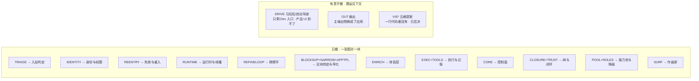

# SlideRule V6.1 · V6.0 未搬清单

一张一个事实：V6.0 有 19 个子图 183 个节点，V6.1 搬了 16 个、**有意不搬 3 个**。
这份清单存在的理由，就是 V6.0 头注那句话的另一半：

> 照着一个不存在的结构去理解系统，比不知道它存在更糟。
> ——反过来同样成立：**照着一个「没画」的空白，以为那块东西不存在，一样糟。**

2026-08-29 逐个子图对着代码核过一遍。搬了的见下表左栏，没搬的**在这里写清楚为什么**。

## 一眼看全：V6.0 的 19 个子图去了哪

## 已搬（V6.1 一张图对一块）

| V6.0 子图 | V6.1 图 |
|---|---|
| `TRIAGE` 入站判定 | `入站判定` |
| `IDENTITY` 身份与权限 | `身份与权限` |
| `REENTRY` 失效与重入 | `失效与重入` |
| `RUNTIME` 运行时 | `运行时与续播` |
| `REFINELOOP` 精修环 | `精修环` |
| `BLOCKSUP` + `NARROW` + `APPTPL` | `区块供给与窄化` |
| `ENRICH` 体验层 | `体验层` |
| `EXEC` + `TOOLS` 执行层 | `执行与记账` |
| `CORE` 控制平面 | `控制面` |
| `CLOSURE` + `TRUST` 闭环与信任 | `闸与闭环` |
| `POOL` + `ROLES` 能力池与角色 | `能力池与降级` |
| `SURF` 交互面 | `作曲家` |

## 没搬，以及为什么

**① `POOL` 能力池 + `ROLES` 角色协作 —— 改主意了，已补 `能力池与降级`**
上一版写「不搬散文墙」，那只对了一半。33 个孤点确实不该画，但同一块里的
**降级台账（`run_degradation`）此前哪张图都没有**，而它是防假绿的那道闸：
「降级过的一轮不许发合格证」。`runConditions` 一路进闭环 payload，
`v5_capability_executor` / `v5_full_driver` / `v5_publish_closure_response` 三处都在用。
把它跟「缺证据就 blocked」混成一句，等于少画了一道闸。

**② `SURF` 交互面 —— 改主意了，已补 `作曲家`**
上一版写「拆散进了别的图」，但**附件提取（E31 三条路）与中途排队一张图都没落**，
等于没画。而「发送在跑着的时候是排队、不是停止」正是真机上出过事的地方。

**③ `DRIVE` 驱动层 · 马拉松 / 自动驾驶 —— 不搬（2026-08-29 查实，不再是待确认）**
上一版这里写着「待确认」。查完了，结论是**产品 UI 到不了**：

    useSlideRuleSession.ts:630   driveMode 初值硬编码 "single"
                                 （注释：历史上选过 marathon 的用户回正，
                                   不会被无 UI 可退的旧偏好困在马拉松分支）
    setDriveMode                 注释写明「保留给 Dev 工程面运行时切换」
                                 全仓没有任何产品控件调它

链路本身是通的（`driveMarathon` → `/api/sliderule/drive-marathon` → `slide_rule_marathon.py`
都在，`useSlideRuleSession.ts:1151` 也真的调），但那一支要 `driveMode === "marathon"`
才进得去，而用户没有任何办法把它切过去。**通电但够不着**——所以不画进主图，
在这里记一笔就够；哪天重新开放入口，再把它提成一张图。

**④ `OUT` 输出（4 节点）—— 主输出物换了**
V5 时代主输出是「可行性/推演报告」，V6 主输出是**应用**。`report.write` 能力仍在，
但已改成范围卡勾选 `wantFeasibilityReport` 才注入短清单——从脊柱降成可选项。
应用墙 `AppsWorkbench` 画在 `活UI路由`。

**⑤ V6.0 里那批「一行代码都没有」的提案格 —— 不许搬**
`VISPROMPT` / `VISIMG` / `VISHTML` / `VISDERIVE` / `SEMLINE`：V6.0 自己的读图纪律
就写着这五格是红虚线提案。第 3、4 步「已定——不建」（2026-08-13 看完 12 张渲染截图
后的裁决：无图的生成效果更好）。**搬进 V6.1 就等于把一个被否决的方案画成现状。**
