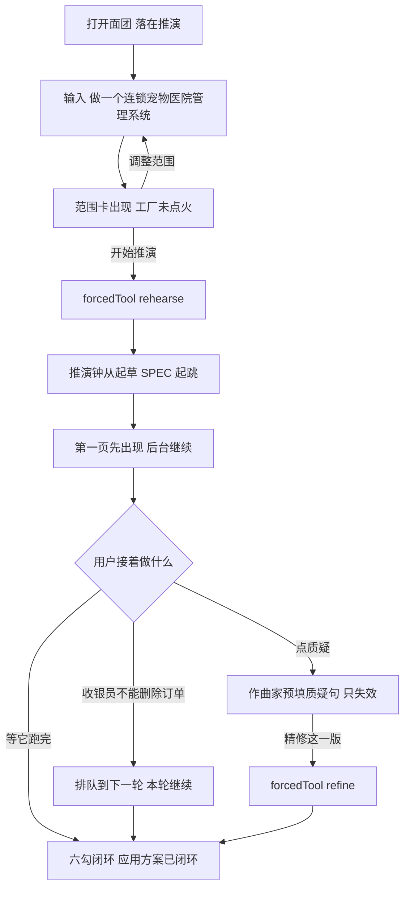
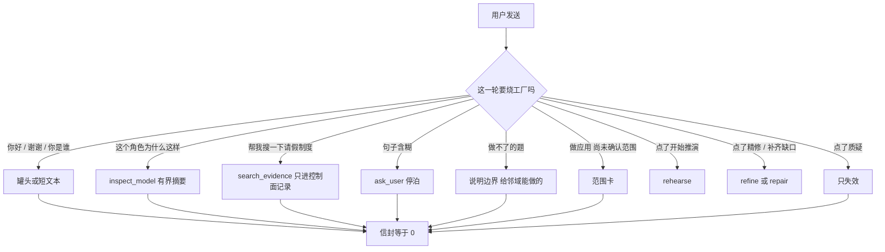
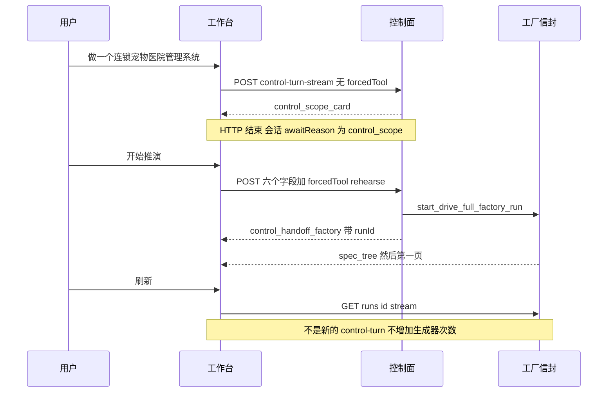

# SlideRule V6.1 交互流程

> 给实现看的主路径，不是再写一份架构清单。
> 契约来源：`docs/欠缺模块清单-对照Claude与Grok-build.md`。本文件只回答：用户看见什么、点了什么、发什么、什么时候绝对不许点火。
> 验收范围：PR-0～PR-4。PR-5 短清单之后默认钟从第 2 步起；本流程按那个终点画。

北极星不变：一句话意图 → 可预览、可导出、带证据链的应用方案。聊天不再等于点火工厂。

---

## 0. 打开产品长什么样

侧栏第一项是 **推演**（`NAV_GROUPS` 第一组第一项 `{ key: sliderule, label: 推演 }`）。不要左侧竖条，没有下级的项不要假折叠箭头。

```
┌ 推演          ← 主产品，默认落这里
│ 扩展中心
│ 应用市场
│ …
└ 设置 / 管理台
```

`/autopilot` `/projects` `/tasks` `/agent-loop/workbench/legacy` URL 可留，不进主导航。进去顶部写「Legacy / 实验功能」。

工作台三块：左会话、中预览、下作曲家。空态作曲家不是「随便聊」——placeholder 写「描述要做的应用，或按 / 选能力」。发送键在未确认范围前**不会**烧工厂。

---

## 1. 主路径：连锁宠物医院

用户要的不是协议，是这一条。



### 场景 ① 直接告诉 AI

作曲家输入：

> 做一个连锁宠物医院管理系统

点发送。此时：

- POST `control-turn-stream`，**不带** `forcedTool: rehearse`
- 控制面出 `scope_card`，SSE `control_scope_card`，persist `awaitReason=control_scope`
- 信封调用次数 = 0
- `conversation` 长度不变；这句话进 `controlTranscript`

### 场景 ② AI 不马上开工

DOM 必须有 `data-testid="sliderule-scope-card"`。卡上只许这些：

| 卡上有 | 卡上没有 |
|---|---|
| 一句话复述：连锁宠物医院管理系统 | 8–9 分钟 / 约 2 分钟 / 20 分钟 |
| 设备档：PC 管理后台 可改 | `risk.analyze` 原文 |
| 将包含：门店 / 宠物档案 / 客户 / 医生 / 预约 / 收费 / 库存 / 权限 / 工作流 | 作文型能力清单 |
| 将跑的步：起草 SPEC → 页面 → 结构 → 权限工作流 → 完整性检查 | 默认亮「澄清与取证」 |
| 「大约数分钟，第一页会先出现」 | 取证默认勾上 |
| 取证开关默认关 | 「仍然推演」直连旧 `runTurn` |
| 按钮：开始推演 / 调整范围 | Hint 条和范围卡同时出现 |

点 **调整范围**：卡还在，用户改句子，再发仍是便宜轮，仍不出信封。

空会话打 `/推演`：只出这张卡，信封 = 0。服务端若收到未确认的 `forcedTool: rehearse`，仍停泊出卡，不点火。

### 场景 ③ 用户点「开始推演」

这是确定性交火，不是又一轮聊天。

POST `/api/sliderule/control-turn-stream` 必须带齐：

```
sessionId
userText          ← 卡上确认过的 goal 句，不是按钮文案
installedSkills
activeConnectors
preferredDevice
designSystemId
forcedTool: "rehearse"
```

然后：

1. 控制面**禁止**再跑 tool-calling
2. 发 `control_handoff_factory` 带 `runId`
3. 调信封 `start_drive_full_factory_run` 恰好一次
4. 同一条 SSE 随后变成工厂事件；刷新续播走 `GET /runs/{id}/stream`

夹具：控制模型更想 `ask_user`，点这个按钮仍点火一次，零 `control_ask_user`。body 只有 `{forcedTool, goal}` 的夹具必须红。斜杠挂过的连接器 id 必须进 `set_active_connectors`。

### 场景 ④ 正在推演 2 / 6

默认 `profile=app`，第 1 步取证跳过。用户看见的钟：

```
正在推演  2 / 6
  ○ 澄清与取证          ← 未勾取证则整步不出现，不是空心永远亮着
  ● 起草 SPEC           ← 当前
  ○ 页面生成
  ○ 数据结构
  ○ 权限工作流
  ○ 完整性检查
大约数分钟，第一页会先出现
```

内部事件怎么投影到这六步：

| 用户看见 | 内部事件 |
|---|---|
| 1 澄清与取证 | `intent.clarify` / `gap.ask` / `evidence.search` 的 `skill_start`。默认跳过 |
| 2 起草 SPEC | `spec_tree` |
| 3 页面生成 | `spec_page_html` / `page_shell` |
| 4 数据结构 | `html_structure` |
| 5 权限工作流 | `spec_semantics` |
| 6 完整性检查 | `model_assembly` / `html_bindings` / `v5_model_gate` / `evaluate_coverage_gate` |

LLM 轨迹默认折叠。用户不打开轨迹也能回答「现在在哪一步」。

### 场景 ⑤ 第一页先出来

右边预览出现第一张页。钟切到「正在生成 n / N 页面」。后台继续跑结构 / 权限 / 闸。不要等全部页面齐了才给预览。

### 场景 ⑥ 推演中继续说话

输入框**能打字**。发送不再等于停止。

用户说：

> 收银员不能删除订单。

系统：

- 本轮工厂继续
- 这条进「下一轮待处理」
- 作曲家可见一条排队 chip：收银员不能删除订单
- 本轮闭环后自动走控制面，默认薄卡 + `refine`

真正想停：旁边单独的方块 **停止**。停止必须诚实——账面 cancelled 不得继续烧 LLM。

`sliderule:resend-prompt` / 「重新推演」走范围卡或文档化 skip，确认前不得 POST 工厂。

### 场景 ⑦ 质疑

预览上点一条结论，例如「店长可以查看所有门店数据」，点 **质疑**。

作曲家预填：

> 质疑「店长可以查看所有门店数据」：

用户补：

> 店长应该只能看自己门店。

发送 = POST `forcedTool: challenge` + 六个上下文字段。跳过 LLM。handler 调 `apply_user_intervention_invalidation` 恰好一次。信封 = 0。

然后控制面说人话：

> 已标记该权限结论失效。将调整门店数据权限。

按钮 **精修这一版** → `forcedTool: refine`。不要每质疑一句就重烧整场 `rehearse`。

产品面剥注释后不得再有 `window.prompt(`。persist 失败：展示错误，不点火。夹具里控制模型只愿 `inspect_model`，点质疑仍 invalidate 一次。

### 场景 ⑧ 闭环

六勾落在用户看见的地方，不是开发者日志：

```
页面 ✓   数据 ✓   权限 ✓   工作流 ✓   证据 ✓   结构 ✓
应用方案已闭环
```

缺证据就是缺，不许绿灯。便宜轮搜过的资料不计这六勾。

---

## 2. 便宜轮：这些话绝对不许点火



问候 + 搜索之后：

- `drive_full_*` = 0
- `evidencePresentCount` 不变
- `conversation.length` 不变
- 没有 `commit_artifact`
- 刷新后问题还在，因为 `controlTranscript` 是 schema 字段

控制面挂了：罐头「我是面团的推演引擎，说你要做什么应用」，不是开放问答，不是 `driveReasoningSession`，不是点火。

---

## 3. 每个按钮发什么

每个产品 POST 都带：`sessionId` `userText` `installedSkills` `activeConnectors` `preferredDevice` `designSystemId`。

| 用户动作 | forcedTool | 范围卡 | 信封 | 备注 |
|---|---|---|---|---|
| 首轮描述应用后发送 | 无 | 完整卡 | 0 | 等点开始推演 |
| 点开始推演 | `rehearse` | 已确认 | 1 | 跳过 LLM |
| 点调整范围 | 无 | 仍在 | 0 | 改句子再发 |
| 空会话 `/推演` | 无 | 出卡 | 0 | 禁止 yolo |
| `/范围` | 无 | 出卡 | 0 | |
| 迭代「把审批改成三级」 | 无，确认后 `refine` | 薄卡 | 确认后 1 | 一句话 + 开始推演 |
| `/精修` 或 精修这一版 | `refine` | skip | 1 | `userText` 不覆盖会话 goal |
| 补齐缺口 | `repair` | skip | 1 | 另 `repair=True` |
| 质疑按钮 / `/质疑` | `challenge` | skip | 0 | 只失效 |
| `/回退` | 无，走 restore | skip | 0 | 只移指针 |
| 运行中发送补充 | 无 | 排队 | 0 本轮 | 不 STOP |
| 点停止 | — | — | 取消本 run | 诚实退出 |
| 刷新续播 | — | — | 0 新烧 | `GET /runs/{id}/stream` |
| 重新推演 / 编辑重跑 | 确认后 `rehearse` | 要卡 | 确认前 0 | 不得旁路 |

`looksLikeNewAppIntent` 自动新开一场：关掉。要新应用还是变体，控制面必须问一句。

---

## 4. 迭代薄卡长什么样

同一会话，用户说：

> 收银员不能删除订单。

卡比首轮薄：

```
下一轮修改
收银员不能删除订单
[开始推演]  [先改这句话]
```

没有未标定的「>2 分钟才出卡」。repair / 质疑后续跑按上表 skip 卡。

---

## 5. 停泊怎么回来



`ask_user` 同理：`awaitReason=control_ask`，问题写在 `controlTranscript`，刷新仍能看见。禁止复用 `ready` / `user_input` / `confirm`。

前端消费者是 `consumeControlStreamResponse`：先吃 `control_*`，见到 handoff 后复用工厂那套 case。现有 `consumeDriveStreamResponse` 没有 default，`control_*` 会被丢掉。

---

## 6. 用户能感到好用的八条

落在看见的东西上，正反成对。

| # | 看见 | 反面 |
|---|---|---|
| A | 第一次发送后、点开始推演前，有范围卡 | 确认前信封 = 0；空会话 `/推演` 信封 = 0 |
| B | 问这个角色为什么，秒回 | 该轮无新的 `appbundle.runtimeclosure` |
| C | 质疑在作曲家里，不是浏览器弹窗 | 产品面无 `window.prompt`；模型想 inspect 仍失效一次 |
| D | 侧栏第一项「推演」 | logo 不是唯一入口；`toContain 推演` 不够 |
| E | 「你好」不烧钱 | 信封 = 0；证据条数不变 |
| F | 不打开轨迹也知道在第几步 | 无假分钟数；默认不展开 risk 原文 |
| G | 停止是停止 | cancelled 后不再烧 LLM |
| H | 新烧只有 control-turn-stream | 产品客户端无 POST `/drive-full-stream` 也无 `/drive-full`；续播仍 GET runs |

---

## 7. 明确不是这条流程的事

不要在实现这条主路径时顺手做：

- Bash / Edit / 仓库级 MCP 商店
- 空会话 `/推演` 直接点火
- 「开始推演」再问模型要不要烧
- 把 `risk.analyze` 画进默认钟
- 把问候写进工厂 `conversation`
- 刷新时把「续播上一轮推演」当新意图再烧一场
- 控制面故障改口成通用助手

那些是清单 §8。本文件只把方向盘接上。
