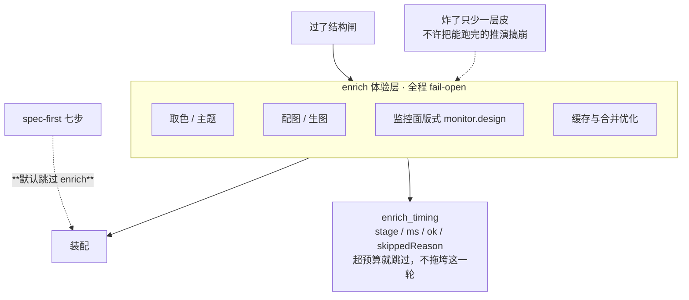

# SlideRule V6.1 体验层 enrich

一张一个事实：enrich 是**增强类**，全程 fail-open，而且 **spec-first 主轴跳过它**。
V6.0 的 `ENRICH` 子图搬过来，但按现状降级：它已经不在默认工厂的链上。

⚠ 别把这张图读成「enrich 还在主轴上」。`docs/SlideRule V6.1 闸与闭环.md` 里那根虚线
（`enrich 管线 -.->|spec-first 跳过| SF`）说的是同一件事，这里只是把它内部画开。

分类纪律（CLAUDE.md 第七条）：增强类自己炸了**不许**拖垮主链路 → fail-open；
证据/闭环类缺证据就是缺 → fail-closed。enrich 整条属于前者。

路径：`services/enrich_timing.py`（分阶段计时，`stage=… ms=… ok=…`）；
阶段事件在 `v5_full_driver._enrich_stage_event`。

