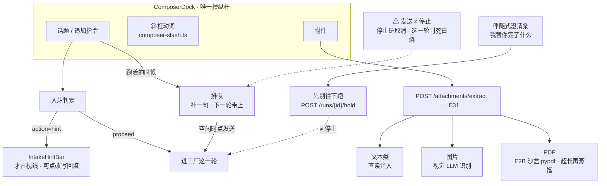

# SlideRule V6.1 作曲家（输入面）

一张一个事实：作曲家是**唯一的操纵杆**——话题、附件、斜杠、排队、暂停都从这里进。
V6.0 的 `SURF` 子图搬过来（上一版说「拆散进了别的图」，但附件提取与排队两条
一张图都没落，等于没画）。

路径：`client/src/pages/sliderule/ComposerDock.tsx`；附件 `POST /attachments/extract`；
提示条 `IntakeHintBar.tsx`；斜杠 `composer-slash.ts`。

⚠ 「发送」在跑着的时候**不是停止键**。停止是取消（这一轮判死白烧），发送在跑着时是
**排队**（补一句，下一轮带上）；队列空闲时点发送要能把它送出去——这条出路 2026-08-28
才补上，此前排队的话没有出口，卡在那儿谁也不知道。

