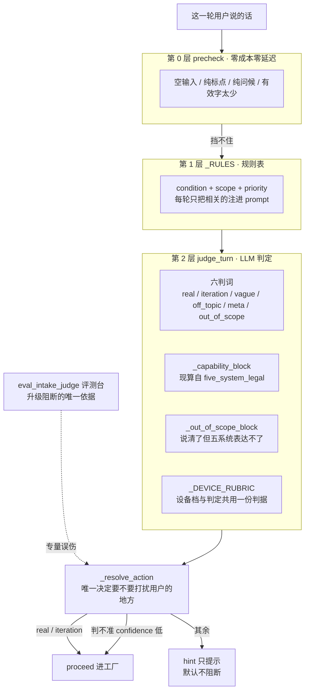

# SlideRule V6.1 入站判定

一张一个事实：推演之前先判「这一轮说的是不是真需求」，**fail-open，只提示不阻断**。
V6.0 的 `TRIAGE` 子图搬过来（V6.1 此前完全没画这一层）。

源：`slide-rule-python/services/intake_judge.py` 模块头（含 TriageSQL / QueryCarefully 两篇的取舍论证）。
成本背景写在那个模块头里：一轮推演约 20 分钟 + 一次完整 LLM + 最多 9 张生图——这一层挡的就是这笔钱。

三层递进、越往后越贵；`Action` 只有 `proceed` / `hint` 两个值——**没有第三个**。
拦不拦人另有一根开关 `SLIDERULE_INTAKE_JUDGE_BLOCKING`（默认关），别把 hint 读成拦截。

