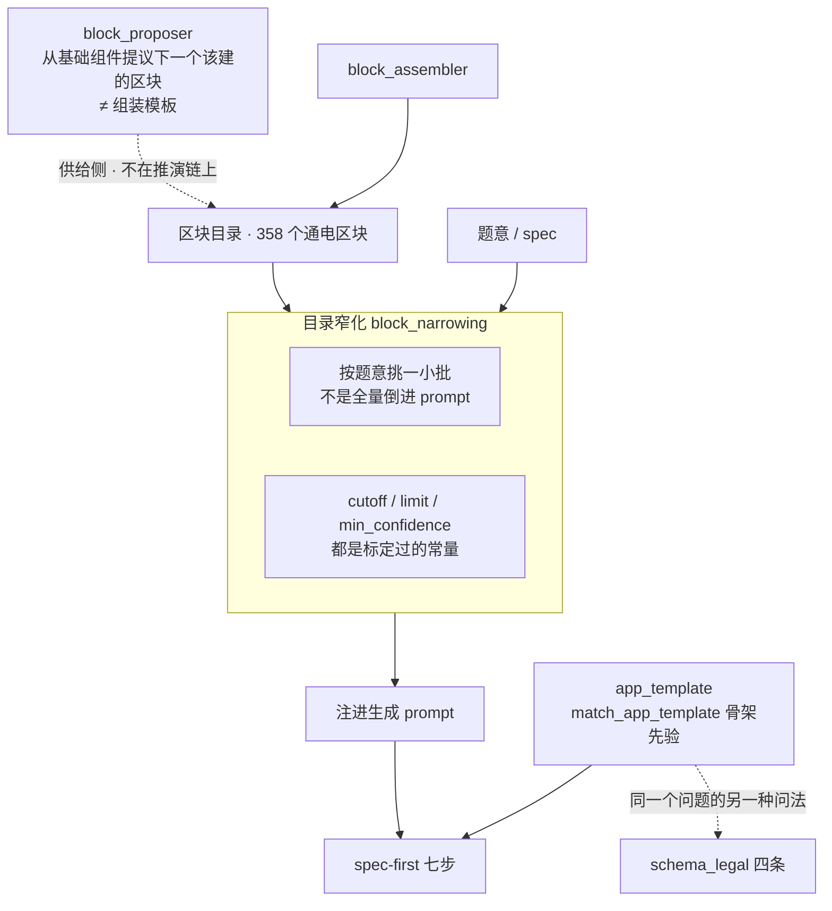

# SlideRule V6.1 区块供给与窄化

一张一个事实：区块目录不是全量倒进 prompt 的，**按题意窄化**之后才注进去。
V6.0 的 `BLOCKSUP` / `NARROW` / `APPTPL` 三个子图合成一张（V6.1 此前一个都没画）。

窄化的依据是实测不是猜：`scripts/block_selection_metrics.py` 量过——目录 358 个通电
区块，control 臂 10 趟共 136 次选中，其中来自原名次 >52 的只有 **2 次（1.5%）**。
详见 `services/block_narrowing.py` 模块头。

路径：`services/block_narrowing.py`、`services/block_proposer.py`、
`services/block_assembler.py`、`services/app_template.py`。

⚠ 「AI 组装区块」（从还没接进区块的基础组件里提议下一个该建的）与「组装模板」
**不是一回事**，别把两个动作画成一个框——理由写在 `block_proposer.py` 头上。

