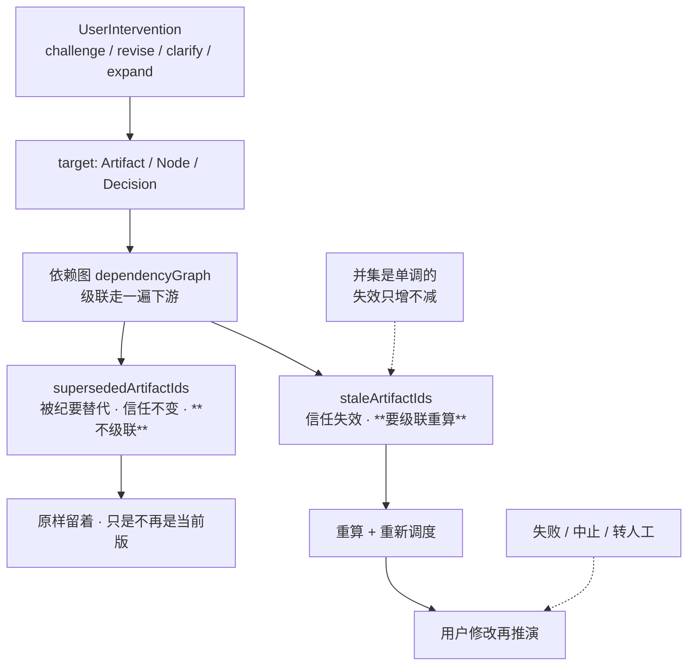

# SlideRule V6.1 失效与重入

一张一个事实：用户的控制信号沿**依赖图**级联失效，而 `stale` 与 `superseded` 是
两件不同的事——搞混就会把「被纪要替代」当成「信任失效」重算一遍。
V6.0 的 `REENTRY` 子图搬过来（V6.1 此前只在控制面画了一根 `challenge` 箭头）。

路径：`services/slide_rule_interactive_gates.py`（`invalidate_for_intervention` /
`apply_user_intervention_invalidation`）；索引字段 `staleArtifactIds` /
`supersededArtifactIds` 在 `models/v5_state.py`。

