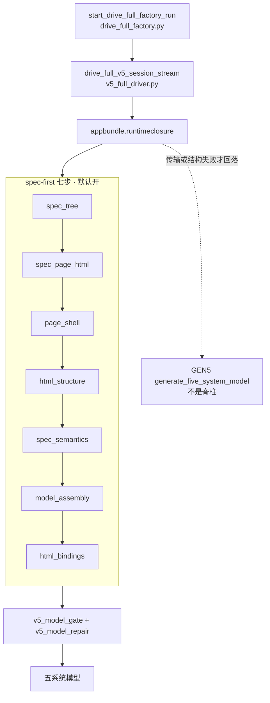

# SlideRule V6.1 工厂 spec-first

一张一个事实：默认工厂是 spec-first 七步实线。GEN5 只是回落，不是脊柱。
源：`slide-rule-python/services/spec_first_pipeline.py` 模块头。本图不把 `generate_five_system_model` 画成主轴。

数字只活在代码常量里。七步名字与 `spec_first_pipeline.py` 一致。

