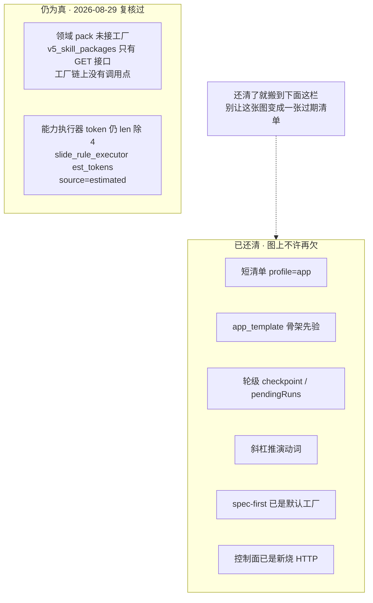

# SlideRule V6.1 已知缺口

一张一个事实：只画**此刻仍为真**的欠账。已落地的不要再标「尚未做」。
数字不写在图上。

> ⚠ **2026-08-29 复核：上一版这张图六条里有四条已经不为真。**
>
> 这张图自己写着「已落地的不要再标尚未做」，而它正是最容易过期的一张——
> 欠账被还掉的时候，没有人回来改图。逐条对着代码复核的结果：
>
> | 原欠账 | 复核 |
> |---|---|
> | 工厂点火前仍调度作文能力 · 短清单未合 | **已落地**：`profile="app"` 由 `rehearsal_control` 两个点火点传入，`should_run_agentic_pick(profile)` 直接跳过；作文能力改成范围卡勾选（`wantFeasibilityReport`）才注入 |
> | `app_template` 未进 `run_spec_first` | **已落地**：`match_app_template` 在 `spec_first_pipeline.py` 里已被调用（骨架先验），`spec_tree` 也吃它 |
> | `pendingRuns` / 轮级 checkpoint 未做 | **已落地**：`persistence._write_turn_checkpoint` + `_checkpoint_dir`，`pendingRuns` 在持久层/驱动器/状态模型三处都在 |
> | 斜杠推演动词未进控制面 | **已落地**：`composer-slash.ts` 里有 `rehearse`（「推演」）等动词 |
>
> 剩下两条**仍为真**，留在图上。复核方法与结论记在
> `docs/欠缺模块清单-对照Claude与Grok-build.md` §15。

已落地、图上不许再欠：spec-first 已接主轴；`POST /control-turn-stream` 是新烧插座；
侧栏「推演」；AppsWorkbench 可见性开关；续播 `GET /runs/{id}/stream`；
短清单（profile=app）；`app_template` 骨架先验；轮级 checkpoint；斜杠推演动词。

