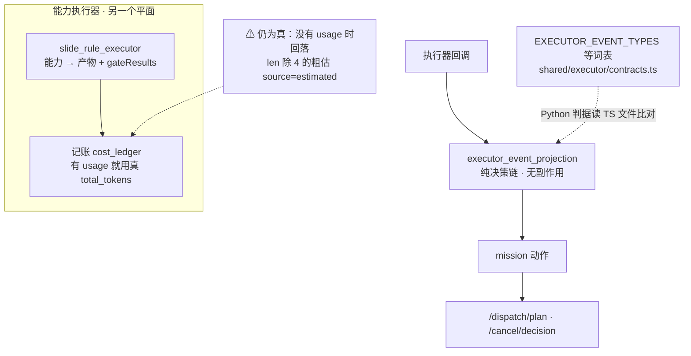

# SlideRule V6.1 执行与记账

一张一个事实：执行回调面（mission executor）与推演工厂是**两个平面**，别把它们
画成一条链。V6.0 的 `EXEC` 子图搬过来并按现状分开。

路径：`services/executor_event_projection.py`（回调事件 → mission 动作的纯决策链，
Node 侧真源在 `server/core/executor-event-mapper.ts`）、`routes/executor_events.py`、
`routes/executor_dispatch.py`；能力执行器是另一个东西：`services/slide_rule_executor.py`。

⚠ 事件词表是跨语言契约，Python 侧判据直接读 TS 文件比对
（`tests/test_executor_vocab_matches_ts.py`）——注释说了不算，得有闸。

