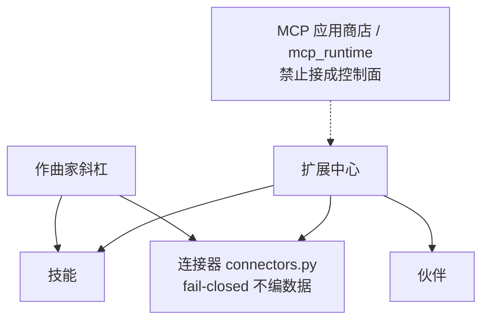

# SlideRule V6.1 扩展

一张一个事实：扩展面是连接器 / 技能 / 斜杠选择器，不是 MCP 应用商店。
控制面禁止接到 `mcp_runtime.py` 或 `skill_runtime.py`——那两个是可注入适配器，流式 driver 不调。

路径：`connectors.py`；扩展中心 `NAV_GROUPS` skills/connectors/partners；斜杠 `composer-slash.ts`。

