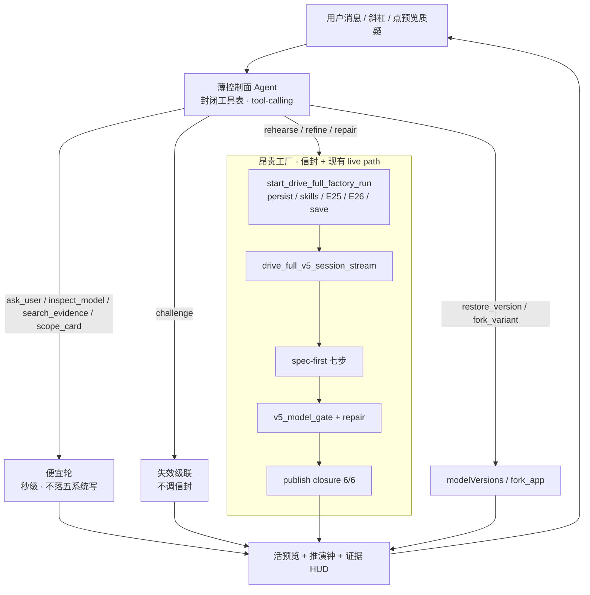

# SlideRule V6.1 控制面

V6.1 拆成一组短图，一张一个事实。V6.0 是历史实验室笔记，见 `docs/SlideRule V6.0 架构图.md` 头注。禁止再往 V6.0 打新 ⚑。

⚠ 2026-08-29：原来只有前六张，而 V6.0 的 19 个子图里有 12 个**一张也没画**——
读图的人会以为那些东西不存在（入站判定、身份、失效级联、续播、精修环……）。
逐个对着代码核过之后补齐了 10 张；有意不搬的 3 类写在最后一张里，不留空白。

⚠ 别拿「V6.0 有 19 个子图、V6.1 有 N 个文件」相减——两个数不同量纲：
一张 V6.1 图可以合并多个 V6.0 子图（如 `区块供给与窄化` 吃了三个），
而 `工厂` / `活UI路由` / `已知缺口` / `未搬清单` 在 V6.0 里根本没有对应子图。
准确的账在 `未搬清单` 那张的覆盖表里：**19 = 搬了 16 + 有意不搬 3**。

| 图 | 文件 |
|---|---|
| 1. 控制面 | 本文件 |
| 2. 工厂 spec-first | `docs/SlideRule V6.1 工厂.md` |
| 3. 闸与闭环 | `docs/SlideRule V6.1 闸与闭环.md` |
| 4. 活 UI 路由 | `docs/SlideRule V6.1 活UI路由.md` |
| 5. 扩展 | `docs/SlideRule V6.1 扩展.md` |
| 6. 已知缺口 | `docs/SlideRule V6.1 已知缺口.md` |
| 7. 入站判定 | `docs/SlideRule V6.1 入站判定.md` |
| 8. 身份与权限 | `docs/SlideRule V6.1 身份与权限.md` |
| 9. 失效与重入 | `docs/SlideRule V6.1 失效与重入.md` |
| 10. 运行时与续播 | `docs/SlideRule V6.1 运行时与续播.md` |
| 11. 精修环 | `docs/SlideRule V6.1 精修环.md` |
| 12. 区块供给与窄化 | `docs/SlideRule V6.1 区块供给与窄化.md` |
| 13. 体验层 | `docs/SlideRule V6.1 体验层.md` |
| 14. 执行与记账 | `docs/SlideRule V6.1 执行与记账.md` |
| 15. 能力池与降级 | `docs/SlideRule V6.1 能力池与降级.md` |
| 16. 作曲家（输入面） | `docs/SlideRule V6.1 作曲家.md` |
| 17. V6.0 未搬清单 | `docs/SlideRule V6.1 V6.0未搬清单.md` |

⚠ **模块之间的依赖关系不看这些图，看
`docs/SlideRule V6.2 架构图（自动生成）.md`** —— 那张是从真代码算出来的，
判据保证它与代码同步。这 17 张画的是「每块在做什么」（人写的意图），
V6.2 画的是「谁依赖谁」（机器算的事实）。两者分工，别混：
**凡是能由代码算出来的，就不该手画。**

一张一个事实：用户消息进入薄控制面；只有 `rehearse` / `refine` / `repair` 才进工厂信封。
源：`docs/欠缺模块清单-对照Claude与Grok-build.md` §7。本图不画能力池散文，不把 GEN5 画成脊柱。

