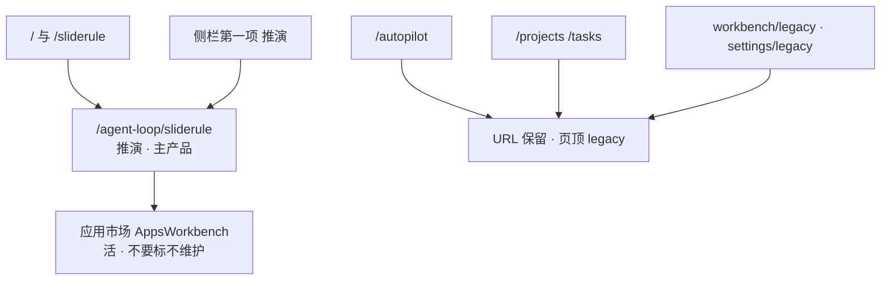

# SlideRule V6.1 活 UI 路由

一张一个事实：产品主入口是 `/agent-loop/sliderule`。Autopilot 不是主线。
`/` 与 `/sliderule` 都重定向到它。侧栏第一项是「推演」。应用市场仍是活面，不要盖 legacy。

路径：`client/src/App.tsx`；`NAV_GROUPS` 在 `DashboardApp.tsx`。

