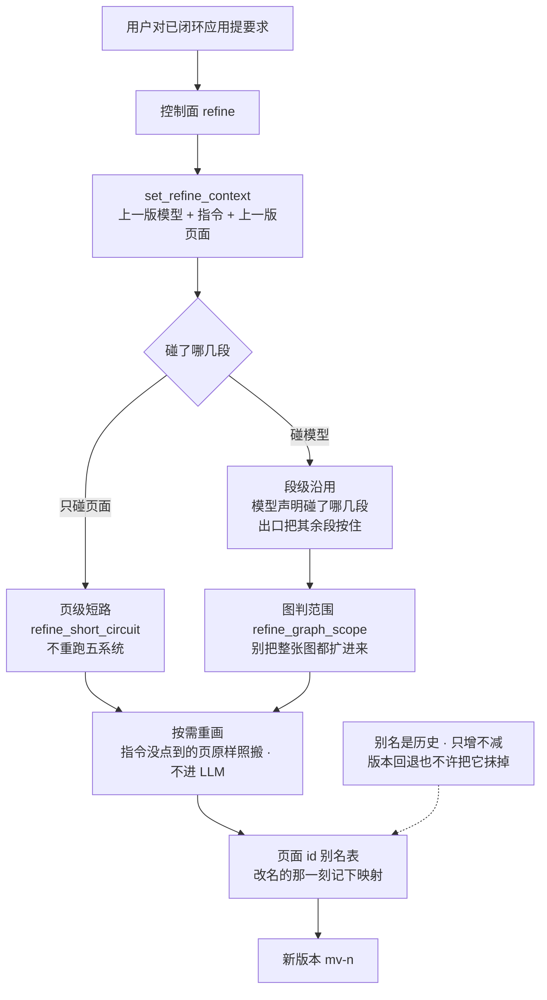

# SlideRule V6.1 精修环

一张一个事实：精修是**已闭环应用的第二条入口**，走的是「声明碰了哪几段、出口把其余
段按住」的**沿用语义**，不是补丁语义。V6.0 的 `REFINELOOP` 子图搬过来。

⚠ 补丁语义（模型吐增量、合并器往基线上打）与 spec-first **架构上不兼容**：
spec-first 天生「从 spec 树重新生成」，出口永远是完整模型，合并器看到六段齐全就判
「没按补丁交付」原样放行。这不是接线问题，是方案选错了——详见
`spec_first_pipeline.apply_refine_segment_reuse` 的文档串。

路径：`services/refine_short_circuit.py`（页级短路）、`services/refine_graph_scope.py`
（图判范围）、`services/page_id_freeze.py`（改名留对照表）。

