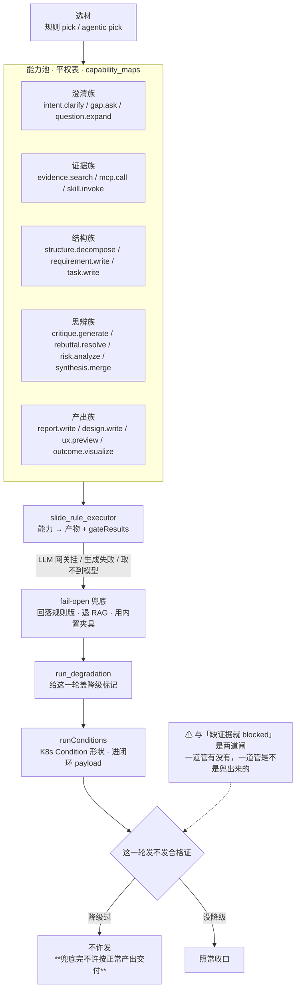

# SlideRule V6.1 能力池与降级

一张一个事实：能力池是**平权表**（不是流程），而**降级过的一轮不许发合格证**。
V6.0 的 `POOL` + `ROLES` 两个子图搬过来——上一版说「不搬散文墙」，那只对了一半：
33 个孤点确实不该画，但**降级这条闸此前哪张图都没有**，而它是防假绿的那道。

路径：`services/capability_maps.py`（21 个能力 id）、`services/run_degradation.py`
（结构照 Kubernetes `metav1.Condition`）、出口字段 `runConditions` 在闭环 payload 里。

⚠ 这条闸挡的病写在 `run_degradation.py` 头上，值得原样记住：

> 系统里到处是 fail-open 兜底……**兜底本身是对的**，错的是兜底完还把结果按正常
> 产出交付：2026-08-04 那轮 `agentic-pick` 连吃两次 HTTP 400 回落规则版，整轮跳过
> 建模链路，最后照样判 `closed 6/6`。用户看到绿色的 closed 就以为东西做好了。
> **这比直接报错要坏**——报错知道重跑，盖了章就信了。

所以「缺证据 → blocked」（见 `闸与闭环`）与「降级过 → 不发合格证」是**两道闸**，
不是一道。前者管有没有东西，后者管这东西是不是兜底兜出来的。

