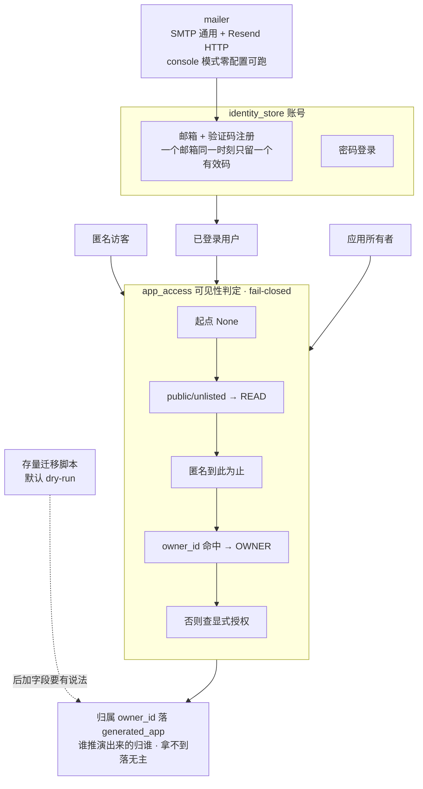

# SlideRule V6.1 身份与权限

一张一个事实：身份是**贯穿式**的，可见性判定 fail-closed，匿名只能看 `public`。
V6.0 的 `IDENTITY` 子图搬过来（V6.1 此前完全没画这一层）。

路径：`services/identity_store.py`（账号）、`services/app_access.py`（归属与可见性）、
`services/mailer.py`（验证码投递）、`client/src/pages/auth`（登录注册页）。

判定顺序写死在 `app_access.py` 模块头：**起点 None → 公开的给 Read → 匿名到此为止 →
所有者直接 Owner → 否则查显式授权**。`unlisted` 与 `public` 的唯一区别是**不进列表**。

