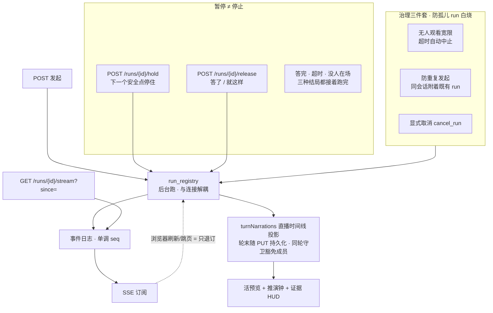

# SlideRule V6.1 运行时与续播

一张一个事实：run 的生命周期**不绑在一根网线上**——断连只是取消订阅，推演照跑，
按序号续播接回去。V6.0 的 `RUNTIME` 子图搬过来（V6.1 此前完全没画这一层）。

源：`services/run_registry.py` 模块头（契约抄 Vercel resumable-stream，生命周期对齐
LangGraph，序号语义遵循 SSE `Last-Event-ID`）。

⚠ **停止与暂停不是同一件事**：停止 = 取消，这一轮判死白烧；暂停 = 停住等人，
答完/超时/没人在场都会接着跑到最后一步，闭环照样绿。两者都靠**协作式**取消
（`threading.Event` + 安全点），因为引擎每步跑在 `asyncio.to_thread` 里，
`task.cancel()` 那一下**打不断线程**（2026-08-14 实测，模块头有记）。

