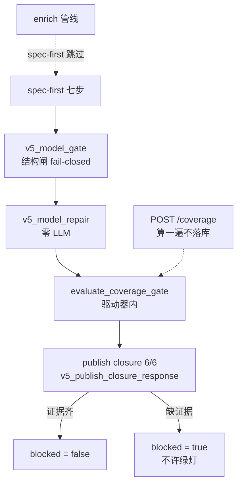

# SlideRule V6.1 闸与闭环

一张一个事实：coverage / 结构闸 / publish closure 6/6 在工厂出口，缺证据就是 blocked。
enrich 不在 spec-first 主轴上。`POST /coverage` 是调试口，不是产品插座。

路径：`evaluate_coverage_gate` 在 `v5_full_driver.py`；`v5_model_gate` 在 `v5_capability_executor.py`；闭环在 `v5_publish_closure_response.py`。

