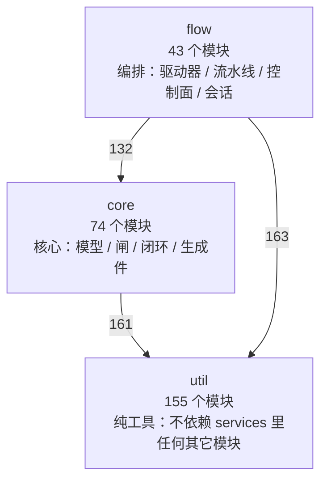
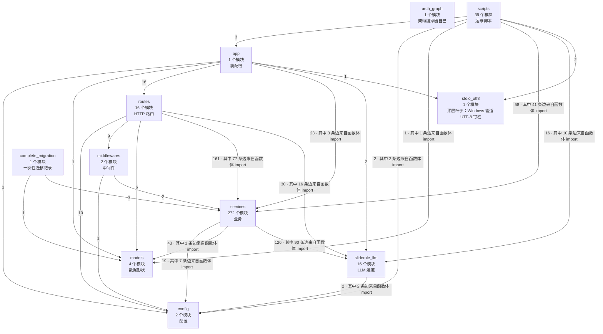
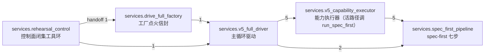
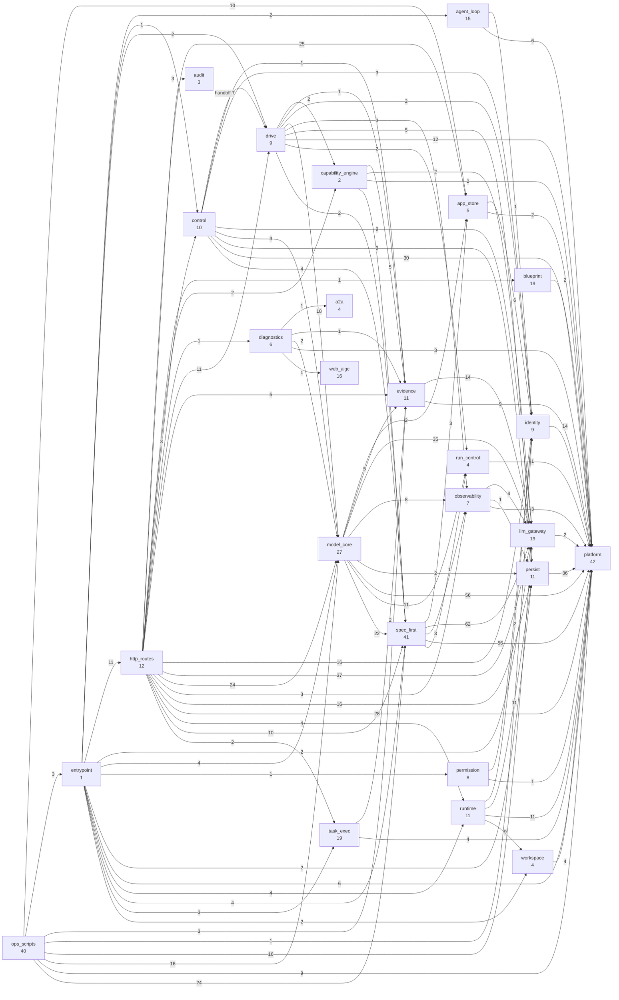

# SlideRule V6.2 架构图（自动生成）

> ⚠ **这个文件是生成的，不要手改。** 改了下次 `--emit` 会覆盖，而且
> `tests/test_architecture.py::Test图与代码同步` 会当场变红。
> 要改架构，改代码或改 `slide-rule-python/architecture.toml`，然后重新生成：
> 
> ```bash
> slide-rule-python/.venv/bin/python slide-rule-python/arch_graph.py --emit
> ```

抄的是 grok-build 的做法：他们**一张架构图都没有**，边写在各 crate 的
`Cargo.toml` 里由 cargo 强制。对照物的现算数字见
`docs/grok-build 架构图（自动生成）.md`（`scripts/arch-graph-grok.py --emit`）。
我们没有那个编译器，所以自己写一个——见 `slide-rule-python/arch_graph.py` 模块头。

## 此刻的事实（由代码算出，不是手写）

- 扫描文件 **355** 个，模块 **355** 个
- 内部依赖边 **1175** 条（包含普通包初始化依赖）
- 内部 import 语句 **1086** 条，其中函数体内 **474** 条语句（基线 474，只许变少）
- 未声明的跨包依赖 **0** 条（基线 0 条）
- 未豁免的模块级成环边 **0** 条（完整 SCC，基线 0 条）
- component 级成环边 **0** 条（完整 SCC，基线 0 条）
- services 内部越层依赖 **0** 条（基线 0 条）
- 没人 import 的模块 **54** 个（基线 54 个）—— ⚠ **不是待删清单**，其中 4 个是跨语言入口（见全仓图，不是没人用）

权威图只留自动生成的：本文件、`docs/WhyBuddy TS 架构图（自动生成）.md`、
`docs/WhyBuddy 全仓架构图（自动生成）.md`、`docs/grok-build 架构图（自动生成）.md`。
V5.x～V6.0 手画是历史实验室笔记，禁止再打新 ⚑。

目标形状是**两个大块 + 一批叶子**（util 叶子多于 flow 编排），
不是把 services 切成 90 个平均文件。
产品图**不搬**：`xai-grok-pager`、`xai-grok-mcp`、`xai-grok-subagent`、`xai-grok-sandbox`、`xai-grok-agent`
（pager / MCP / 子代理 / sandbox / grok-agent 提示词）。

### services 内部分层（抄 grok 的叶子 crate）

| 层 | 模块数 | 可以依赖 | 是什么 |
|---|---|---|---|
| `util` | 155 | （谁都不依赖） | 纯工具：不依赖 services 里任何其它模块 |
| `core` | 74 | util | 核心：模型 / 闸 / 闭环 / 生成件 |
| `flow` | 43 | util、core | 编排：驱动器 / 流水线 / 控制面 / 会话 |

叶子层 `util` 不依赖 services 里任何其它模块——这是它能被所有人安全 import 的全部理由，也是 `import` 不必躲进函数体的前提。

### services 三层（从 import 算出，不是表）

表只报数。这张 mermaid 才是层间真实边。虚线 = 越层（欠账，只许变少）。



虚线 = 未在 `architecture.toml` 里声明的边（欠账，只许变少）。



## 编排环（从活路径生成）

对照 grok-build 的 spine（shell → agent → tools，`xai-workflow` 是叶子）。
我们的活路径是 `rehearsal_control._handoff_factory` → `drive_full_factory` →
`v5_full_driver` → `v5_capability_executor` → `run_spec_first`。
⚠ `component.run_control` 是 pause/cancel 叶子，不是这张图。
handoff 标在边上，当且仅当 `_handoff_factory` 函数体里真的调用了
`start_drive_full_factory_run`（import 在不算数）。



## 循环依赖

下面列出完整 SCC 中每一条成环边，扣除清单明确允许的组件内部 SCC。**只许变少。** DFS 见证路径不作为基线。

（当前没有未豁免的成环边）

## 未声明的跨包依赖

（当前没有）

## crate 级：component 依赖图

抄 grok 的 Cargo.toml——边写在 crate 上，由编译器焊死。
现算数字见 `docs/grok-build 架构图（自动生成）.md`。
我们 26 个 component、100 条边，由 `architecture.toml` 声明、判据强制。
**红色虚线 = 参与组间成环的边**（模块级已清零，组级还欠着，见下）。




## services 内部越层依赖

叶子碰了上层，或 core 碰了 flow。**只许变少。**

（当前没有）

## 闸清单（谁在拦，谁看着它）

> 依赖图回答「谁 import 谁」，回答不了「这个系统有哪些判定、各自装在哪、
> 坏成一直响的时候谁会发现」。2026-09-05 补的就是后者——
> 「为什么几个月没审查出来」的答案里有一条是**没人知道这里到底有几道闸**：
> 15 个会话全被同一道闸按同一个理由拦下，而没有观察它的位置。

- 拦截理由（blocker code）共 **19** 条，其中 **8** 条进了体检（`services/gate_health.py`），**11** 条没进（欠账，只许变少）
- 新增一条 code 必须在 `architecture.toml` 的 `[gate_codes]` 里声明归属，否则 `--check` 变红

| 拦截理由 | 体检的闸 | 发它的模块 |
|---|---|---|
| `APPBUNDLE_RUNTIME_CLOSURE_BLOCKED` | `evidence` | `v5_capability_executor` |
| `CLOSURE_DEGRADED_RUN` | — | `run_degradation` |
| `CLOSURE_FACTORY_TODO_OPEN` | `factoryTodo` | `capability_plan` |
| `CLOSURE_GOAL_RELEVANCE_FAILED` | `relevance` | `v5_capability_executor` |
| `CLOSURE_NO_ENTRY_SURFACE` | `deliverableSurface` | `deliverable_surface` |
| `CLOSURE_ONE_PAGE_PER_ROLE` | `deliverableSurface` | `deliverable_surface` |
| `CLOSURE_PAGE_WITHOUT_CONTROLS` | `deliverableSurface` | `deliverable_surface` |
| `CLOSURE_REBUILD_FAILED` | — | `v5_capability_executor` |
| `CLOSURE_SUBMIT_INTENT_UNMAPPED` | `deliverableSurface` | `deliverable_surface` |
| `CLOSURE_SUBMIT_INTENT_UNSERVED` | `deliverableSurface` | `deliverable_surface` |
| `LLM_EMPTY_OUTPUT` | — | `sliderule_full` |
| `LLM_GENERATE_DISABLED` | — | `sliderule_full`、`v5_capability_executor` |
| `LLM_GENERATE_FAILED` | — | `sliderule_full`、`v5_capability_executor` |
| `LLM_TEST_ERROR` | — | `llm_channel` |
| `LLM_TEST_FAILED` | — | `llm_channel` |
| `MODEL_GATE_BLOCKED` | — | `v5_capability_executor` |
| `PACKAGE_NOT_FOUND` | — | `sliderule_full` |
| `REFINE_PAINT_FAILED` | — | `v5_capability_executor` |
| `TASK_LIFECYCLE_AUTH_DENIED` | — | `task_lifecycle_production_closure` |

「—」是明说不体检的：诊断类（只在真失败时出现，没有「一直说同一句话」的
退化形态），以及压根不是闭环闸的连通性自检。理由逐条写在 `[gate_codes]` 里。

### 体检在看的闸（按闸名，含只报不拦的）

> 上面那张表按 blocker code 排，**只报不拦的闸没有 code，会整个漏掉**。
> 这张按闸名排，`gate_health` 记了谁就有谁。

| 闸 | 记在哪 | 拦人吗 |
|---|---|---|
| `deliverableSurface` | `v5_capability_executor` | 拦，`CLOSURE_PAGE_WITHOUT_CONTROLS` |
| `evidence` | `v5_capability_executor` | 拦，`APPBUNDLE_RUNTIME_CLOSURE_BLOCKED` |
| `factoryTodo` | `v5_capability_executor` | 拦，`CLOSURE_FACTORY_TODO_OPEN` |
| `pageEdit` | `sliderule_full` | 只报不拦（§7 增强类） |
| `relevance` | `v5_capability_executor` | 拦，`CLOSURE_GOAL_RELEVANCE_FAILED` |
