# SlideRule V5 实际落地架构 · 模块关联分析（As-Built）

> **改名注记**：本产品原名 **WhyBuddy**，2026-06 全量改名为 **SlideRule**；本文档历史正文中的产品名已机械同步，git 历史保留旧名原貌。

> **性质**：本文档画的是**代码现实**，不是设计叙事。每个节点是 plan 链（117 个快照、两个会话、约 17 小时）里被 `verify:sliderule-v5` 验证过的真实模块，每条边是真实存在的调用或数据流。
>
> **状态标记**：✅ 已落地且全绿 · 🟡 plan-21 当前待执行 · ◆ V5.1 设计已定义但代码尚未实现
>
> **当前基线**：V5 原型整体 98-99% · 31 client + 5 server 测试 + tsc + 5 流程 smoke + durable 9 步全绿

---

## 一、模块清单（带精确锚点）

### 客户端 · client/src

| 模块 | 锚点 | 职责 | 状态 |
|---|---|---|---|
| `App.tsx` | isSlideRuleLocation 判定 | AuthBootstrap / Bridge 在 SlideRule 路由 early return；chrome-free 不发 `/api/auth/me`，401 噪音根除 | ✅ |
| `pages/SlideRule.tsx` | 页面壳 | 挂载时 opt-in 真实 executor；节点点击 → 按 runId / artifactId 精确重入 | ✅ |
| `lib/sliderule-runtime.ts` | 闭环核心 | 见下表，31 测试覆盖 | ✅ |
| `lib/sliderule-http-store.ts` | store 适配器 | 调 4 个公开端点；服务端 5xx 持久化失败可感知 | ✅ |

### runtime.ts 内部（闭环核心，行号为 plan 链记录值）

| 函数 / 接口 | 行号 | 职责 | 对应 V5.1 概念 |
|---|---|---|---|
| `orchestrateReasoningTurn` | 874 区域 | 预分配 `capabilityRunId`（格式 `turnId-run-N`），runId 单一真相的源头 | ORCH 推演调度核 |
| `executeCapability` | 767 | **唯一官方执行接缝**，一切能力执行必经 | BUS 调度总线的实现锚点 |
| `CapabilityExecutor` 接口 | 545 | 契约：executor 只返回 raw 四字段 `title / summary / content / provenance?` | 能力池的统一出口契约 |
| `DefaultCapabilityExecutor` | — | 模拟执行；感知全局 `state.staleArtifactIds`，重入场景真实 | 模拟器 |
| `PilotRealCapabilityExecutor` | 618 | 严格限定 `risk.analyze` + `report.write`；失败回退；报告骨架委托 builder | 真实执行试点 |
| `LlmCapabilityExecutor` + `createServerLlmCapabilityProvider` | — | provider seam；HTTP 调服务端；非 2xx 干净回退 PilotReal | 真实 LLM 执行 |
| `commitArtifact` + `enrichGraphNodesAfterCommit` | 840 区域 | runId **精确匹配**挂 `producedArtifactId`；`producedBy`、`evidenceRefs` 在此注入 | **T_GATE + T_PROV（commit-time 验真）** |
| `deriveNodeStatus` | 327 | 单一真相；runId 交叉引用 `artifactByRun` 映射判 stale | DERIVE 投影计算器 |
| `invalidate` + `staleArtifactIds` | — | 失效级联；精确 runId/artifactId 定向，不过度标记同 turn 重复 cap | DEP → INVAL → STALE 链 |

### 共享层 · shared/

| 模块 | 职责 | 状态 |
|---|---|---|
| `blueprint/sliderule-report-builder.ts` | `buildStructuredReport`，9 段中文 evidence-grade schema；会话 2 从 client 抽出，**消除了 server 反向 import client runtime 的架构异味** | ✅ |

### 服务端 · server/routes

| 模块 | 职责 | 状态 |
|---|---|---|
| `sliderule.ts` · `POST /execute-capability` | capabilityId 分发；与 /autopilot 同一 LLM 栈（`getAIConfig` + `callLLMJson`），API key 收归服务端；report schema 校验；opt-in；错误 → 4xx/5xx（行 269 catch） | ✅ |
| `sliderule.ts` · 4 个公开会话端点 | GET / PUT / LIST / DELETE，**契约 100% 冻结，全程未动** | ✅ |
| `sliderule.ts` · durable 层 | 内存 Map + 原子写 JSON；`flushToDisk(): boolean`；PUT 失败回滚 + 5xx（杜绝"看似已存实则丢失"）；测试专用 `POST __reload` | ✅ |
| GitHub MCP 适配分支 | `source.github.inspect` / `evidence.github.collect`；绕过 LLM 路径；返回**同一 raw 四字段**；失败非 2xx → 客户端回退 | 🟡 plan-21 |
| `blueprint/mcp-github-source/` | `url-parser` / `http-fetcher` / `summary-derivation` / `policy`（脱敏）；**只取纯函数层，不拉 Blueprint bridge 类型** | ✅（被 plan-21 复用） |

### 持久层与台账

| 模块 | 职责 | 状态 |
|---|---|---|
| `data/sliderule-sessions.json` | durable 落盘文件，已 gitignore；`__reload` 走 HTTP 验证真恢复（进程内假阳性已修） | ✅ |
| `docs/SlideRuleV5闭环总图_完整版_修复闭环.md` | verbatim Findings 台账 + 每阶段执行记录 ≈ T_LEDGER 问责中枢的文档形态 | ✅ |

### 五层护栏 · `verify:sliderule-v5`（package.json，一键串联）

| 层 | 内容 | 钉住的脊柱 |
|---|---|---|
| 1 | client runtime 测试 **31/31** | runId 契约 · stale 级联 · executor 注入（Fake 注入证明接缝可换、不变量不破） |
| 2 | server 路由测试 **5/5**（`server/routes/__tests__/`） | 分发 · unsupported · no-apiKey · schema（🟡 plan-21 将加 github 成败用例 + console.error spy） |
| 3 | tsc 全量类型检查 | 横跨全部 |
| 4 | browser smoke **5/5** 流程（`sliderule-browser-smoke.mjs`） | 页面闭环 + consoleErrors 无 401 |
| 5 | store smoke **9 步**含持久性（`sliderule-store-api-smoke.mjs`） | PUT/GET/LIST/DELETE/404 + HTTP `__reload` 真恢复 |

---

## 二、关联图（Mermaid）

> ✅ 绿边框 = 已落地全绿 · 🟡 黄色 = plan-21 待执行 · ◆ 灰色虚框 = V5.1 设计未实现

```mermaid
flowchart TB

subgraph CLIENT["客户端 · client/src"]
direction TB

  APP["App.tsx<br/>━━━━━━━━<br/>isSlideRuleLocation 判定<br/>AuthBootstrap / Bridge early return<br/>chrome-free: 不发 /api/auth/me<br/>· 401 噪音根除"]

  PAGE["pages/SlideRule.tsx<br/>━━━━━━━━<br/>页面壳 · 挂载时 opt-in 真实 executor<br/>节点点击 → 精确重入<br/>按 runId / artifactId 定向"]

  subgraph RUNTIME["lib/sliderule-runtime.ts · 闭环核心 · 31 测试覆盖"]
  direction TB

    ORCH_IMPL["orchestrateReasoningTurn<br/>━━━━━━━━<br/>预分配 capabilityRunId<br/>格式 turnId-run-N<br/>≈ V5.1 的 ORCH 推演调度"]

    EXEC_SEAM["executeCapability · 行767<br/>━━━━━━━━<br/>唯一官方执行接缝<br/>≈ V5.1 的 BUS 调度总线锚点"]

    IFACE["CapabilityExecutor 接口 · 行545<br/>━━━━━━━━<br/>契约: 只返回 raw 四字段<br/>title / summary / content / provenance"]

    DEFEXEC["DefaultCapabilityExecutor<br/>━━━━━━━━<br/>模拟执行 · 感知全局<br/>state.staleArtifactIds · 重入真实感"]

    PILOT["PilotRealCapabilityExecutor · 行618<br/>━━━━━━━━<br/>严格限定 risk.analyze + report.write<br/>失败回退 · 报告骨架委托 builder"]

    LLMEXEC["LlmCapabilityExecutor<br/>+ createServerLlmCapabilityProvider<br/>━━━━━━━━<br/>provider seam · HTTP 调服务端<br/>非 2xx → 干净回退 PilotReal"]

    COMMIT["commitArtifact<br/>+ enrichGraphNodesAfterCommit · 行840<br/>━━━━━━━━<br/>runId 精确匹配挂 producedArtifactId<br/>producedBy · evidenceRefs 在此注入<br/>≈ V5.1 的 T_GATE + T_PROV · commit-time 验真"]

    DERIVE_IMPL["deriveNodeStatus · 行327<br/>━━━━━━━━<br/>单一真相 · runId 交叉引用<br/>artifactByRun 映射判 stale<br/>≈ V5.1 的 DERIVE 投影计算器<br/>P3 不变式已天然满足: 只读不回写"]

    STALE_IMPL["invalidate + staleArtifactIds<br/>━━━━━━━━<br/>失效级联 · 按精确 runId/artifactId<br/>不过度标记同 turn 重复 cap<br/>≈ V5.1 的 DEP→INVAL→STALE 链"]
  end

  HTTPSTORE["lib/sliderule-http-store.ts<br/>━━━━━━━━<br/>store 适配器 · 调 4 个公开端点<br/>服务端 5xx 持久化失败可感知"]
end

subgraph SHARED["共享层 · shared/"]
  BUILDER["blueprint/sliderule-report-builder.ts<br/>━━━━━━━━<br/>buildStructuredReport · 9 段中文结构<br/>evidence-grade schema<br/>会话2从 client 抽出 · 消除反向 import<br/>≈ V5.1 的 REPORT 主输出物骨架"]
end

subgraph SERVER["服务端 · server/routes"]
direction TB

  ROUTE["sliderule.ts · POST /execute-capability<br/>━━━━━━━━<br/>capabilityId 分发 · 与 /autopilot 同栈<br/>getAIConfig + callLLMJson · key 收归服务端<br/>report schema 校验 · opt-in<br/>错误 → 4xx/5xx · 行269 catch"]

  ENDPOINTS["sliderule.ts · 4 个公开会话端点<br/>━━━━━━━━<br/>GET / PUT / LIST / DELETE<br/>契约 100% 冻结 · 全程未动"]

  DURABLE["sliderule.ts · durable 层<br/>━━━━━━━━<br/>内存 Map + 原子写 JSON<br/>flushToDisk 返回 boolean<br/>PUT 失败回滚 + 5xx · 杜绝假保存<br/>测试专用 POST __reload<br/>≈ V5.1 的 STATE 落盘 JOB"]

  GHADAPTER["🟡 plan-21 · GitHub MCP 适配分支<br/>━━━━━━━━<br/>source.github.inspect<br/>evidence.github.collect<br/>绕过 LLM 路径 · 返回同一 raw 四字段<br/>失败非 2xx → 客户端回退"]

  MCPSRC["blueprint/mcp-github-source/<br/>━━━━━━━━<br/>url-parser · http-fetcher<br/>summary-derivation · policy 脱敏<br/>只取纯函数层 · 不拉 Blueprint bridge 类型"]
end

JSONFILE[("data/sliderule-sessions.json<br/>━━━━━━━━<br/>durable 落盘文件 · 已 gitignore<br/>__reload 走 HTTP 验证真恢复<br/>· 假阳性已修")]

subgraph GUARD["五层护栏 · verify:sliderule-v5 一键 · package.json"]
direction TB
  G1["第1层 · client runtime 测试 31/31<br/>钉: runId 契约 · stale 级联 · executor 注入<br/>· Fake 注入证明接缝可换不变量不破"]
  G2["第2层 · server 路由测试 5/5<br/>server/routes/__tests__/<br/>钉: 分发 · unsupported · no-apiKey · schema<br/>🟡 plan-21 将加 github 成败用例 + console spy"]
  G3["第3层 · tsc 全量类型检查"]
  G4["第4层 · browser smoke 5/5 流程<br/>sliderule-browser-smoke.mjs<br/>钉: 页面闭环 + consoleErrors 无 401"]
  G5["第5层 · store smoke 9 步含持久性<br/>sliderule-store-api-smoke.mjs<br/>钉: PUT/GET/LIST/DELETE/404<br/>+ HTTP __reload 真恢复"]
end

subgraph V51GAP["◆ V5.1 设计已定义 · 代码尚未实现 · 真实差距"]
direction TB
  GAP1["BUDGET 预算闸<br/>maxTurns · maxRuns · maxTokens · maxRepeat<br/>当前: 无任何进 ORCH 的预算拦截"]
  GAP2["CONTRACT 覆盖率合约 + GCOV 覆盖率闸<br/>当前: 结论写入无机械闸 · ORCH 仍可直写 GOAL"]
  GAP3["DLEDGER 调度决策账<br/>当前: pickNextCapabilities 选/跳无落账<br/>challenge 不能指向 decision"]
  GAP4["FLOWB 流边界守卫<br/>当前: brainstorm 协议内容无剥离闸<br/>v4.3 代码可搬"]
  GAP5["P2 双重入归一 · P5 双速标注<br/>当前实现只有 runtime 一条失效链 ·<br/>天然接近目标 · 但 RV/ITER 归一未做"]
end

DOC["docs/SlideRuleV5闭环总图_完整版_修复闭环.md<br/>━━━━━━━━<br/>verbatim Findings 台账 · 每阶段执行记录<br/>≈ V5.1 的 T_LEDGER 问责中枢的文档形态"]

%% ═══════════ 客户端内部关联 ═══════════
APP -->|chrome-free 隔离| PAGE
PAGE -->|挂载 opt-in| PILOT
PAGE -->|一切执行走| EXEC_SEAM
PAGE -->|节点点击重入| STALE_IMPL
EXEC_SEAM -->|分发到当前| IFACE
IFACE --- DEFEXEC
IFACE --- PILOT
IFACE --- LLMEXEC
ORCH_IMPL -->|预分配 runId| COMMIT
EXEC_SEAM -->|raw 四字段 仅此| COMMIT
COMMIT -->|producedArtifactId 绑定| DERIVE_IMPL
STALE_IMPL -->|staleArtifactIds| DERIVE_IMPL
STALE_IMPL -.全局 stale 感知.-> DEFEXEC
DERIVE_IMPL -->|节点状态投影| PAGE

%% ═══════════ 跨层真实调用 ═══════════
LLMEXEC ==>|HTTP POST| ROUTE
ROUTE -.失败 4xx/5xx 回退.-> PILOT
ROUTE -->|report.write 骨架| BUILDER
PILOT -->|报告骨架委托| BUILDER
PAGE -->|会话读写| HTTPSTORE
HTTPSTORE ==>|HTTP| ENDPOINTS
ENDPOINTS --> DURABLE
DURABLE ==>|原子写| JSONFILE
JSONFILE -.__reload 恢复.-> DURABLE
GHADAPTER -->|复用纯函数| MCPSRC
ROUTE -.🟡 加分支.-> GHADAPTER
GHADAPTER -.同一 raw 契约回到.-> COMMIT

%% ═══════════ 护栏覆盖关系 ═══════════
G1 -.钉住.-> RUNTIME
G2 -.钉住.-> ROUTE
G4 -.钉住.-> PAGE
G4 -.验证.-> APP
G5 -.钉住.-> DURABLE
G5 -.验证.-> JSONFILE

%% ═══════════ 文档台账 ═══════════
GUARD -.每阶段输出 verbatim 记录.-> DOC

%% ═══════════ V5.1 差距挂接点 ═══════════
GAP1 -.将插在 进入 orchestrate 的所有入口.-> ORCH_IMPL
GAP2 -.将插在 结论写入路径.-> ORCH_IMPL
GAP3 -.将挂在 能力选择落账.-> ORCH_IMPL
GAP4 -.将插在 brainstorm 输出 → 正式路径.-> EXEC_SEAM
GAP5 -.归一目标: 重入只经一条链.-> STALE_IMPL

%% ═══════════ 样式 ═══════════
classDef done fill:#052e16,stroke:#22c55e,color:#dcfce7,stroke-width:2px
classDef core fill:#022c22,stroke:#10b981,color:#d1fae5,stroke-width:2.5px
classDef pending fill:#422006,stroke:#eab308,color:#fef9c3,stroke-width:2px
classDef gap fill:#1e293b,stroke:#94a3b8,color:#cbd5e1,stroke-dasharray:6 4,stroke-width:1.5px
classDef guard fill:#172554,stroke:#3b82f6,color:#dbeafe,stroke-width:2px
classDef storage fill:#2e1065,stroke:#a78bfa,color:#ede9fe,stroke-width:2px
classDef docnode fill:#134e4a,stroke:#2dd4bf,color:#ccfbf1,stroke-width:1.5px

class APP,PAGE,HTTPSTORE,BUILDER,ROUTE,ENDPOINTS,DURABLE,MCPSRC done
class ORCH_IMPL,EXEC_SEAM,IFACE,DEFEXEC,PILOT,LLMEXEC,COMMIT,DERIVE_IMPL,STALE_IMPL core
class GHADAPTER pending
class GAP1,GAP2,GAP3,GAP4,GAP5 gap
class G1,G2,G3,G4,G5 guard
class JSONFILE storage
class DOC docnode
```



---

## 三、实打实的结构性结论

### 3.1 系统真正的脊柱只有两条边

- **执行脊柱**：`executeCapability → CapabilityExecutor 接口 → commitArtifact`。所有执行器（Default / PilotReal / LlmExecutor，包括 plan-21 的 GitHub 适配器）最终汇回**同一个 raw 四字段契约**进 commit。
- **状态脊柱**：`http-store 适配器 → 4 公开端点 → durable Map → 原子写 JSON 文件`。

其余模块全是这两条脊柱上的挂件。GitHub 适配器虽在服务端实现，但其产物路径与 LLM 产物**字节级同构**——这是后续 Autopilot 能力（sources / evidence / bridges / memory / prompt package / checks / handoff）吸收可以同构复制的结构原因。

### 3.2 三级降级回退链

```
LlmCapabilityExecutor ──(非 2xx)──▶ PilotRealCapabilityExecutor ──(失败)──▶ DefaultCapabilityExecutor（模拟）
```

链上没有任何一环依赖对端可用：服务端整个挂掉，页面闭环也不死。这是 96-98% 护栏与 readiness 分数背后真正的结构原因，而不仅是测试数量。

### 3.3 五层护栏不是平铺的，是各钉一根脊柱

| 护栏层 | 钉住的对象 |
|---|---|
| 第 1 层（31 runtime 测试） | runtime 契约（runId · stale · 接缝可替换性） |
| 第 2 层（5 server 测试） | `/execute-capability` 路由 |
| 第 3 层（tsc） | 横跨全部 |
| 第 4 层（browser smoke 5 流程） | 页面闭环 + chrome-free（401） |
| 第 5 层（store smoke 9 步） | durable 真恢复 |

任何一根脊柱被改动，至少有一层护栏会变红——这是"一键可重复、可交付"的精确含义。

### 3.4 V5.1 与代码的真实差距全部收敛在一个点上

灰色虚框区的三个核心缺口（BUDGET / GCOV+CONTRACT / DLEDGER），挂接点**全部指向 `orchestrateReasoningTurn`**：

- BUDGET = 给它的**入口**加闸（进 orchestrate 的所有路必经预算）；
- GCOV + CONTRACT = 给它的**出口**加闸（写结论/停泊必过覆盖率，ORCH 对 GOAL 降为只读）；
- DLEDGER = 给它的**决策过程**落账（每次 pickNextCapabilities 记录 saw / chose / skipped+reason / addresses / rationale / alternativesRejected）。

FLOWB 挂在 `executeCapability` 接缝上。也就是说，P0-P6 + A/B 的实现爆炸半径很小，集中在 `runtime.ts` 的两个函数周围——这与 V5.1 文档"骨架不动，只补边补闸删冗余"的判断在代码层完全吻合，且 CONTRACT 一份合约喂 GCOV（别太早停）和 BUDGET（够了就停）两个闸的设计，意味着先写 CONTRACT，A、B 各省一半。

### 3.5 P3 已经免费完成

当前的 `deriveNodeStatus` 从会话 1 阶段 1 修复起就是**只读投影**（runId 交叉引用 `artifactByRun`，只产出节点状态，从未有回写 STATE 的边）。V5.1 清单中 P3"删除 DERIVE → STATE 回写边"在实现层是**空操作**，只需补一条静态断言测试（DERIVE 模块对 STATE 无写权限）钉死即可。**建议在 V5.1 清单中将 P3 降级为 5 分钟工作量**（写断言 + 文档标注），增量 derive（只重算 staleIndex 标脏节点）可与 P4/B 合并实施。

### 3.6 P2 的现状比清单假设的更好

当前实现的失效链只有一条：`invalidate → staleArtifactIds → deriveNodeStatus → 重入`。V5.1 担心的"两套重入并存"（INTERV 链 vs FB/RP 老回路）在已落地的 V5 runtime 中**只有新链存在**——FB/RP 属于旧 Autopilot 侧。P2 的实际工作量取决于旧回路在多大程度上已被引用，若 SlideRule 线确无 FB/RP 引用，则 P2 退化为"搜代码确认无残留 + 文档声明"。

### 3.7 不变量在代码层的成立位置（对照 V5.1 六条不变式）

| V5.1 不变式 | 当前代码状态 |
|---|---|
| 1. 不存在绕过 GCOV 写 GOAL 的路径 | ◆ GCOV 未实现，待 P1/A |
| 2. 不存在绕过 BUDGET 进 ORCH 的入口 | ◆ BUDGET 未实现，待 P4/B |
| 3. DERIVE 对 STATE 无写权限 | ✅ 事实成立，缺静态断言钉死（P3 → 5 分钟） |
| 4. 全系统仅一条回炉路径 | ✅ SlideRule 线事实成立，待 P2 确认无 FB/RP 残留 |
| 5. 辩论协议经 FLOWB 后为零 | ◆ FLOWB 未实现，v4.3 代码可搬（P6） |
| 6. 每次 pickNextCapabilities 有账可查可 challenge | ◆ DLEDGER 未实现，待 P1/A |

**一句话**：六条不变式中两条已被现有代码事实满足（只差断言钉死），四条全部悬挂在 `orchestrateReasoningTurn` 与 `executeCapability` 两个已有锚点上——V5.1 的落地不需要动骨架，与设计判断一致。

---

## 四、当前待办（plan-21，唯一未执行项）

1. **5 分钟卫生**：`GROK_PLANS_EXPORT_README.md` 保持 untracked，提交用显式 allow-list。
2. **P0 首个 Autopilot 能力吸收**：GitHub MCP 适配分支（`source.github.inspect` / `evidence.github.collect`），复用 `mcp-github-source` 纯函数层，失败走非 2xx 触发客户端回退。
3. **测试扩展**：server 测试加 github 成败用例 + report 引用用例；`vi.spyOn(console, 'error')` 消除 verify 输出 stderr 噪音。
4. **文档追加 + 提交**：`feat(sliderule): add MCP GitHub capability executor adapter`。

**待拍板的 4 个开放问题**：URL 提取策略（goal.text 扫描 / POST body 显式 githubUrl / inputArtifact 链接）· provenance 取值（mcp:github / github / mcp）· 适配器独立文件 vs 路由内联 · GithubRepoMetadata 哪些字段必须进 content。

---

*依据：两个 plan 会话（2026-06-09 18:58 → 2026-06-10 12:11）共 117 个快照；V5.1 修复清单文档（sliderule_v5_1.md）。所有行号与测试计数取自 plan 链中最后一次全绿验证记录。*
