# SlideRule V5 修复清单 + 架构图修复版(V5.1)

> **改名注记**：本产品原名 **WhyBuddy**，2026-06 全量改名为 **SlideRule**；本文档历史正文中的产品名已机械同步，git 历史保留旧名原貌。

> **V5 骨架不动,只补边、补闸、删冗余。** 问题全集中在「边」不在「块」。
> 共 8 项修复:6 处本轮通读新发现(P0–P5)+ A(调度决策账)+ B(成本闸)。
> 图中所有新增/改动节点标 ◆,新增边在注释段集中列出。

---

## 一、修复清单(按动手顺序排,每条含:问题 → 改动 → 验收断言)

### P0 · 交互闸接到 AWAIT(不补会卡死,是 bug 不是债)
- **问题**:`G_READY`(就绪度)、`G_CONFIRM`(轻量确认)语义上需要**人**回答,但只在能力内部打转,没有任何边通向 AWAIT/INTAKE。运行时要么 LLM 替用户「确认」(自主漏进裁决,红线),要么循环挂死。
- **改动**:加边 `G_READY -.等用户·停泊.-> AWAIT`、`G_CONFIRM -.等用户确认·停泊.-> AWAIT`。用户答复天然经 `CHAT → INTAKE` 续跑,无需新机制。
- **验收**:人造「就绪度不足」case,系统必须停泊 AWAIT 并在 STATUS 显示等待原因;**禁止**出现 LLM 自答确认的 capabilityRun;用户一条消息后从断点续跑,不重启会话。

### P1 / A · 覆盖率闸 + 调度决策账(结论失守,命门)
- **问题**:`ORCH -.读写.-> GOAL` 零闸直连——产物进 STATE 要过 T_GATE,而「这事算想清楚了」这个最重要的结论却是 ORCH 一句话的事。同时 `pickNextCapabilities` 选了谁/跳过谁/为什么,无账可查。
- **改动**(三件套,共用一份合约):
  1. **`CONTRACT` 覆盖率合约**:authored、版本化、冻结基线。声明 complex/simple 各自的 required/conditional 能力 + `minEvidencePerRequirement`。机械可判、二元。
  2. **`G_COVERAGE` 覆盖率闸**:插在 ORCH 与 GOAL/AWAIT 之间。ORCH 想写结论或停泊,必过:所有 blocking gap == resolved 或显式 waived(带原因);合约 required/conditional 能力至少一次成功 capabilityRun。不满足 → 拒绝收敛,缺的能力强制排回 ORCH(经预算闸)。**ORCH 对 GOAL 降为只读。**
  3. **`DLEDGER` 调度决策账**:每次 pickNextCapabilities 落一条 `{saw, chose, skipped+reason, addresses[gapId], rationale, alternativesRejected}`,汇入 T_LEDGER。`INTERV(challenge)` 的 target 扩展到可指向一条 decision——可挑战「路由」,不只挑战「产物」。
- **验收**:任何 `GOAL=clear` 的会话,回放能列出覆盖了合约哪几项、哪些 gap resolved/waived;人造「漏 evidence.search」case,G_COVERAGE 必须拒绝收敛;challenge 一条 decision 能重开对应 gap 并触发重排程;grep 代码确认不存在绕过 G_COVERAGE 写 GOAL 的路径。

### P2 · 合并两套重入(趁老回路还没长深)
- **问题**:新机制 `INTERV → DEP → 失效 → 重排程` 与 v4 老回路 `RV → FB → RP → ORCH` 并存,同一件事两个入口、两套判据,久了必然行为不一致。
- **改动**:**删除 FB、RP 两个节点。** RV 保留为交付评审,但「回炉」归一为控制信号:`RV -.回炉·归一为控制信号.-> INTERV`;`ITER → INTERV`(原 ITER→RP)。RP 的预算/收敛阈值职责移交 `BUDGET`(见 P4/B)。
- **验收**:全图只剩一条回炉路径(一切经 INTERV);从 RV 回炉与从 chat challenge 触发的失效/重排程行为逐字节一致;搜代码无 FB/RP 残留引用。

### P3 · 钉死单一真相(一行定义的事)
- **问题**:`STATE → JOB → DERIVE -.单一真相.-> STATE` 成环,STATE 和 DERIVE 都自称真相 = 没有真相。
- **改动**:**删除 `DERIVE → STATE` 回写边。** STATE 是唯一 authority;DERIVE 降级为「投影计算器」——只读 STATE/JOB,产出只进 ROW/BOARD,永不回写。顺带(B 的一部分):DERIVE 改增量,只重算 staleIndex 标脏节点。
- **验收**:静态断言 DERIVE 模块对 STATE 无写权限;同一会话任意时刻 STATE 与投影不一致时,以 STATE 为准且能定位投影滞后原因(脏节点未刷)。

### P4 / B · 成本闸 Cost Governor(运行期不夹住,优雅反噬卖点)
- **问题**:平权池 + orchestrator 循环 + 每次 intake 全量 derive,是理论上最贵的跑法;十亿 token 的教训从实现期挪到了每次会话的运行期。
- **改动**(五件):
  1. **`BUDGET` 预算闸**:所有进入 ORCH 的路(INTERV、RECOMP、G_COVERAGE 强制排程)一律先过。`maxTurns/session · maxCapabilityRuns/turn · maxTokens/session · maxRepeat/capability(同能力无状态变化不得重跑>N)`。超限 → 停泊 AWAIT 标 partial 或转 ESC。预算本身是 auditable artifact 进台账(弹性走 artifact、门保持二元)。
  2. **路由降级**:pickNextCapabilities 用便宜模型/纯规则(gap X 开 → 跑能力 Y),仅真歧义升级强模型。贵 token 留给思考,不喂指挥交通。
  3. **STATE prompt cache**:常驻态做稳定前缀缓存——再入循环里单笔最大的省。
  4. **增量 derive**(已并入 P3)。
  5. **成本遥测**:每个 capabilityRun/turn 落 token 成本进台账,可按能力归因。
- **验收**:开 cache 前后单会话 token 对比,降幅在 STATE 占比量级;死循环 case 被 maxRepeat 截断;超 maxTokens 停 AWAIT 且报告标 partial,不硬跑到底;台账能答「risk.analyze 吃了本会话百分之几」。

### P5 · 信任双速显式化(是设计就承认它)
- **问题**:commit-time 只过 `T_GATE + T_PROV`(验真),`T_CONTENT/T_TEST/T_MERGE` 只在交付口(验好)。分速合理但是隐式的,将来有人会误以为 STATE 里的都全验过。
- **改动**:TRUST 子图标题与节点文案显式标注「commit-time: 验真(gate+provenance)/ ship-time: 验好(content+test+merge)」。零代码改动,纯声明。
- **验收**:文档与图一致;新人读图能答出「STATE 里的产物验过什么、没验什么」。

### P6 · 辩论协议守卫(第三次提,这次落显式节点)
- **问题**:`D_BO → D_SYN` 之间无 strip critique/rebuttal 守卫,brainstorm 协议内容进 STATE/BOARD 的路上无人拦——v4.3 的 flow boundary 在 V5 重构中蒸发。
- **改动**:加 `FLOWB` 流边界守卫(二元闸):`D_SYN → FLOWB -.净化后视角.-> PAIR`;`D_BO -.回灌(经守卫).-> FLOWB`。剥离 critique·rebuttal·debate console 协议节点;边界断言进台账。
- **验收**:人造含 challengeEdges 的 brainstorm 产物,经 FLOWB 后协议节点为零;台账有 strip 记录;3D 辩论墙仍可见完整 debate(守卫只管正式路径,不管辩论自己的可视化)。

### 动手顺序
**P0 → P1/A → P2 → P3 → P4/B → P5 → P6**
(P0 是 bug;P1 是命门;P2 趁早;P3 一行;P4 上线前必须;P5 纯文档;P6 已有 v4.3 代码可搬。)
其中 **CONTRACT 一份合约喂两个闸**:对 G_COVERAGE 是「别太早停」,对 BUDGET 是「够了就停」——先写它,A、B 各省一半。

---

## Durable Store Pilot (已落地，本 commit)
- 按审查结论 3 处修复已提交：
  - smoke 改用 live `POST /sessions/__reload` (不再 false-positive 本地 reload)。
  - `flushToDisk(): boolean` + PUT rollback + DELETE/__clear 失败返回 500。
  - `.gitignore` 明确列出 `data/sliderule-sessions.json` + `.tmp`（并有注释）。
- 验证：`verify:sliderule-v5` 单元 28/28 + tsc 干净；store smoke 9 步全绿（含 8/9 live reload + durable delete 404）；`git status` 无 runtime json 噪音。
- 进度参考（保守）：session store + HTTP adapter ~95%；durable store pilot ~92-94%（live recovery + 失败可见 + hygiene 均就位）；整体 V5 闭环原型仍 ~98%，生产化 readiness ~87-88%。
- 下一阶段按计划进入/形式化 real executor pilot（PilotRealCapabilityExecutor + executeCapability seam 已就绪，仅 risk.analyze + report.write richer，返回 raw 形状，Trust 层仍由 runtime 统一）。

（本节为提交 durable pilot 后的状态记录；V5.1 主体修复清单保持不变。）

## 二、架构图修复版(V5.1 · 在 V5 上补边补闸删冗余)

> ◆ = 本次新增/改动。删除:FB、RP、`DERIVE→STATE` 回写、`ORCH 写 GOAL` 直连。

```mermaid
flowchart TB

subgraph SURF["00 交互面 / Surface（屏幕）"]
  direction TB
  CHAT["聊天框 = 操纵杆<br/>灌 goal · 提质疑 · 指定关注点"]:::surface
  STATUS["状态条（唯一常驻）<br/>目标 · 结论状态 · 可信度 · 轮次 · 已调用能力<br/>◆ + 等待原因(停泊时) · 预算余量"]:::surface
  BOARD["内联临时黑板<br/>讨论 · 图 · 报告段 · 方案 · 预览（可滚走 · 可 pin · 可点节点）"]:::surface
end

subgraph CORE["01 控制平面 / Control Plane（再入 · 歇脚 · ◆ 决策可审 · ◆ 预算受控）"]
  direction TB
  INTAKE["入站消息 / Message Intake（单门）<br/>load SessionState(sessionId) · derive 先行<br/>◆ STATE 稳定前缀 prompt cache<br/>分类为控制信号（续跑·不重启会话）"]:::core
  BUDGET{"◆ 预算闸 / Budget Gate<br/>maxTurns · maxRuns/turn · maxTokens · maxRepeat<br/>预算=auditable artifact"}:::gate
  ORCH["推演调度核 / Orchestrator<br/>pickNextCapabilities(goal, state, gaps, votes)<br/>◆ 路由用便宜模型/规则优先 · 歧义才升级"]:::core
  DLEDGER["◆ 调度决策账 / Decision Ledger<br/>saw · chose · skipped+reason<br/>addresses[gapId] · rationale · alternativesRejected"]:::ledger
  CONTRACT["◆ 覆盖率合约 / CoverageContract<br/>authored · 版本化 · 冻结基线<br/>required/conditional 能力 · minEvidence"]:::ledger
  GCOV{"◆ 覆盖率闸 / Coverage Gate<br/>blocking gap 全 resolved/waived<br/>合约能力全有成功 run · 二元机械"}:::gate
  STATE[("常驻推演状态 / Reasoning State（◆ 唯一 authority）<br/>graph · artifacts · evidence · risks · decisions<br/>capabilityRuns · gates · dependencyGraph")]:::state
  GOAL["目标 / 结论状态（◆ ORCH 只读 · 写入仅经覆盖率闸）<br/>clear · needs_refinement · not_recommended"]:::core
  AWAIT["待续 / Awaiting（环上歇脚点）<br/>收敛/等用户/超预算(partial) 皆停泊于此<br/>状态常驻 · 等下一条消息"]:::await
end

subgraph ROLES["02 角色与协作 / Roles（视角 · 单一调度）"]
  direction TB
  RL["多角色 / Roles<br/>产品·架构·安全·合规·工程·挑刺·接地·综合·UI"]:::role
  D_GATE{"决策门 / Decision Gate<br/>简单 or 复杂?"}:::gate
  D_SA["单 Agent / Single-Agent"]:::role
  D_BO["头脑风暴 / Brainstorm<br/>讨论·投票·分工·审计<br/>（实时辩论协议仅活在此处）"]:::role
  D_SYN["综合器 / Synthesizer<br/>方案·信心分·分歧意见"]:::role
  FLOWB{"◆ 流边界守卫 / Flow Boundary<br/>剥离 critique · rebuttal · debate console<br/>边界断言进台账"}:::gate
  D_DEG["降级兜底 / Degradation → 单 Agent"]:::fallback
  PAIR["调度单元 = (capability, role) 对<br/>例：risk.analyze × 安全 Agent"]:::role
end

subgraph POOL["03 能力池 / Capability Pool（平权 · 无固定顺序 · 可重复 · 可回溯）"]
  direction TB
  BUS{{"能力调度总线 / Dispatch Bus<br/>调用 ⇄ 回灌"}}:::bus

  C_PARSE["意图理解 / intent.parse<br/>context.collect · source.classify · normalize 去重"]:::cap

  C_EVID["证据检索 / evidence.search<br/>证据 · 约束 · 失败状态"]:::cap
  C_REPO["仓库深度解析 / repo.inspect<br/>文件·符号·接口契约（GitHub 仅其一）"]:::cap
  C_REPO_FALL["仓库降级 / Fallback<br/>权限失败·不可访问"]:::fallback

  C_GAP["澄清·缺失 / gap.ask<br/>阻塞 · 非阻塞"]:::cap
  C_QEXP["扩展·假设 / question.expand · assumption.validate"]:::cap
  G_READY{"就绪度闸 / Readiness<br/>可规划? 继续补充?<br/>◆ 需人答=停泊点"}:::gate

  C_RTGEN["路线生成 / route.generate<br/>标准·深度·升级"]:::cap
  C_RTCMP["路线对比 / route.compare<br/>对比·风险·tradeoff·选择"]:::cap
  G_CONFIRM{"轻量确认闸 / Confirm<br/>◆ 需人答=停泊点 · 禁止 LLM 代答"}:::gate

  C_PROMPT["提示词构造 / prompt.build<br/>成功标准→需求·验收 EARS"]:::cap
  C_REDACT["脱敏 / redaction"]:::cap
  C_LLM["LLM JSON 生成 / callJson<br/>retryAttempts = 1"]:::cap
  G_SCHEMA{"Schema 校验闸"}:::gate
  C_SNORM["归一化 / 稳定 ID 重映射"]:::cap
  G_INV{"不变量守卫闸<br/>唯一根·父可达·深度·无环<br/>需求覆盖·每节点挂证据"}:::gate
  C_SFALL["确定性兜底（已预满足不变量）"]:::fallback
  C_TREE["结构拆解 / structure.decompose → SPEC Tree<br/>Requirements·Design·Tasks·Evidence(带出处)"]:::cap

  C_DOC["文档生成 / document.draft<br/>requirements·design·tasks.md"]:::cap
  C_ACC["验收 / acceptance<br/>证据·用例（EARS）"]:::cap

  C_PREV["效果预演 / scenario.preview<br/>随时·可反向澄清"]:::cap
  C_VISGEN["视觉生成 / 按模块·每需求一页<br/>标『预览·未验证』·防复制·禁兜底·503重试"]:::cap
  C_VISREND["视觉渲染 / 规格树→Mermaid<br/>确定性·不交生图模型"]:::cap

  C_TOOL["工具 / mcp.call · skill.invoke<br/>Docker·MCP·GitHub·Skills"]:::cap
  C_RISK["反驳与风险 / risk.analyze · counter.argue · critique<br/>（旧伴随：挑刺者 / 接地者）"]:::cap
  C_SYN["综合收敛 / synthesis.merge"]:::cap
  C_REP["报告生成 / report.write"]:::cap

  C_PACK["指令包 / prompt.pack · execution.prepare"]:::cap
  C_MATRIX["可追溯矩阵 / traceability<br/>需求↔设计↔任务↔证据↔用例"]:::cap
  C_HAND["交付包 / handoff<br/>md·zip·接口契约草稿·验收用例·未决项·台账"]:::cap
end

subgraph TRUST["04 信任层 / Trust Layer（◆ 双速显式：commit-time 验真 · ship-time 验好）"]
  direction TB
  T_GATE{"提交闸 / Commit Gate（commit-time·验真）<br/>二元·机械可执行"}:::gate
  T_PROV["provenance（commit-time）<br/>三级：ai_generated→rendered_chart_mcp→rendered_screenshot<br/>源：llm·llm_fallback·template"]:::trust
  T_AUDIT["出图审计 / check_previews_real<br/>揪兜底·假成功·复制充数（用户自跑·agent 改不了）"]:::trust
  T_CONTENT["内容质量校验 / Content Check（ship-time·验好）<br/>规格成立·验收为 EARS"]:::trust
  T_TEST["测试 / Tests（ship-time·验好）<br/>状态·SSR·E2E·截图"]:::trust
  T_MERGE{"合并门 / Merge Gate（ship-time）<br/>自动断言 + 人工目检"}:::gate
  T_LEDGER["校验台账 / Checks Ledger（问责中枢）<br/>脚本·退出码·输出·真跑留痕<br/>◆ + 调度决策 · 边界断言 · 成本遥测"]:::ledger
end

subgraph REENTRY["05 失效与重入 / Invalidation & Re-entry（◆ 单一回炉路径：一切经 INTERV）"]
  direction TB
  INTERV["控制信号 / UserIntervention<br/>new_goal·refine·challenge·revise·clarify·expand·preview·sub_question·branch<br/>targetArtifact / Node / ReportSection / ◆ Decision"]:::reentry
  RV{"评审 / Review<br/>交付 or 回炉?"}:::gate
  ESC["失败·中止·转人工 / Escalate"]:::fallback
  ITER["用户修改再推演 / Iterate"]:::reentry
  DEP["依赖图 / Dependency Graph<br/>上游变更→下游影响"]:::reentry
  INVAL["失效引擎 / Invalidation"]:::reentry
  STALE["失效索引 / Stale Index<br/>staleSince·reason·fromCapabilityRun"]:::reentry
  RECOMP["重算 + 重新调度 / Recompute & Re-schedule"]:::reentry
end

subgraph RUNTIME["06 运行时 / Runtime（状态常驻 · 画面临时）"]
  direction TB
  JOB["任务仓·产物 / Job·Artifact Store"]:::runtime
  EVT["事件总线 / Event Bus<br/>每次 capabilityRun 落事件"]:::runtime
  SOCK["实时推送 / Socket Relay"]:::runtime
  STORE["实时状态仓 / Realtime Store<br/>按 sessionId 隔离"]:::runtime
  DERIVE["◆ 状态派生 / deriveNodeStatus（投影计算器）<br/>只读 STATE/JOB · 永不回写<br/>增量：只算 staleIndex 标脏节点"]:::runtime
  ROW["节点行 / Node Row<br/>待生成·生成中·完成·失败·重试成功"]:::runtime
  REPLAY["回放 / Replay"]:::runtime
end

subgraph OUT["07 输出 / Output"]
  direction TB
  REPORT["可行性 / 推演报告（主输出物）<br/>结论·支撑·反证·证据·风险·分歧·收敛·下一步"]:::report
  DONE["交付完成 / Shipped"]:::done
end

subgraph LEGEND["图例 / Legend"]
  direction TB
  LG1["蓝 = 交互面 / 控制平面"]:::surface
  LG2["紫 = 能力池（平权能力）"]:::cap
  LG3["黄 = 二元闸（◆ 新增：预算·覆盖率·流边界）"]:::gate
  LG4["青 = provenance · 审计 · 台账（◆ + 决策账·合约）"]:::trust
  LG5["红 = 失效重入 / 兜底降级（单一回炉路径）"]:::reentry
  LG6["绿 = 报告 / 交付"]:::report
  LG7["浅蓝虚框 = 歇脚点 AWAIT（收敛·等人·超预算）"]:::await
end

%% ===== 入站：单门再入 =====
CHAT -.新消息.-> INTAKE
BOARD -.针对节点 / 段落.-> INTAKE
STATE -.先 load(sessionId) + derive.-> INTAKE
INTAKE -->|分类: new_goal仅空状态 · refine · challenge · sub_question · branch · meta| INTERV
INTERV -.若 challenge / revise.-> DEP
ORCH -.刷新.-> STATUS
ORCH -.只读.-> GOAL
STATE -.渲染临时黑板.-> BOARD
ROW -.驱动黑板.-> BOARD

%% ===== ◆ P4/B 预算闸：进 ORCH 的所有路必经 =====
INTERV -->|续跑 · 先过预算| BUDGET
BUDGET -->|余量足 · 放行| ORCH
BUDGET -.超限·停泊 partial.-> AWAIT
BUDGET -.超限·不收敛·转人工.-> ESC
BUDGET -.成本遥测.-> T_LEDGER

%% ===== ◆ P1/A 决策账 + 覆盖率闸 =====
ORCH -.每次 pickNextCapabilities 落账.-> DLEDGER
DLEDGER -.汇入问责中枢.-> T_LEDGER
CONTRACT -.分母 / 判据.-> GCOV
ORCH -->|想写结论 / 想停泊| GCOV
GCOV -->|达标 · 准许写入| GOAL
GCOV -->|达标 · 准许停泊| AWAIT
GCOV -.缺能力·强制排程·经预算.-> BUDGET
CONTRACT -.早停判据·够了就停.-> BUDGET

%% ===== 外圈闭合：停泊于 AWAIT，新消息续 =====
STATE --- AWAIT
AWAIT -.任意新消息从此续.-> INTAKE

%% ===== 控制平面 ⇄ 能力池 =====
ORCH <-->|调用 / 回灌| BUS
BUS --- C_PARSE
BUS --- C_EVID
BUS --- C_GAP
BUS --- C_RTGEN
BUS --- C_PROMPT
BUS --- C_DOC
BUS --- C_PREV
BUS --- C_TOOL
BUS --- C_RISK
BUS --- C_SYN
BUS --- C_REP
BUS --- C_PACK

%% ===== 角色：单一调度 + ◆ P6 流边界守卫 =====
RL --> D_GATE
D_GATE -.简单.-> D_SA
D_GATE -.复杂.-> D_BO
D_BO --> D_SYN
D_GATE -.失败·超时.-> D_DEG
D_DEG -.兜底→单Agent.-> D_SA
ORCH -.选 capability × role.-> PAIR
D_SA -.视角.-> PAIR
D_SYN --> FLOWB
FLOWB -.净化后视角.-> PAIR
FLOWB -.边界断言进台账.-> T_LEDGER
PAIR -.接入.-> BUS
D_BO -.回灌路线 / 澄清·经守卫.-> FLOWB

%% ===== 能力内部：证据 / 仓库 =====
C_EVID --- C_REPO
C_REPO -.权限失败·降级.-> C_REPO_FALL

%% ===== 能力内部：澄清（◆ P0 接 AWAIT）=====
C_GAP --> C_QEXP
C_QEXP --> G_READY
G_READY -.未就绪·回补.-> C_GAP
G_READY -.◆ 等用户·停泊.-> AWAIT

%% ===== 能力内部：路线（◆ P0 接 AWAIT）=====
C_RTGEN --> C_RTCMP
C_RTCMP --> G_CONFIRM
G_CONFIRM -.退回·调整.-> C_RTCMP
G_CONFIRM -.◆ 等用户确认·停泊.-> AWAIT

%% ===== 能力内部：结构拆解 =====
C_PROMPT --> C_REDACT
C_REDACT --> C_LLM
C_LLM -.超时 / 非JSON · 先重试.-> C_LLM
C_LLM --> G_SCHEMA
G_SCHEMA -.结构通过.-> C_SNORM
G_SCHEMA -.结构失败.-> C_SFALL
C_SNORM --> G_INV
G_INV -.不变量通过.-> C_TREE
G_INV -.不变量失败.-> C_SFALL
C_SFALL --> C_TREE

%% ===== 能力内部：文档 / 预演 / 打包 =====
C_TREE --> C_DOC
C_DOC --> C_ACC
C_TREE -.确定性渲染.-> C_VISREND
C_DOC -.转生图提示词.-> C_VISGEN
C_ACC --> C_PACK
C_TREE -.汇总追溯.-> C_MATRIX

%% ===== 信任层：commit-time 验真 =====
BUS ==>|产物送审| T_GATE
T_GATE ==>|过| T_PROV
T_PROV ==> T_LEDGER
T_GATE -.未过·打回.-> BUS
C_VISGEN -.出图必审.-> T_AUDIT
T_AUDIT -.结果进台账.-> T_LEDGER
T_AUDIT -.假图·打回重出.-> C_VISGEN
C_TREE -.内容质量校验.-> T_CONTENT
ROW -.-> T_TEST
T_CONTENT -.-> T_MERGE
T_TEST -.-> T_MERGE
G_SCHEMA -.结果.-> T_LEDGER
G_INV -.结果.-> T_LEDGER
T_CONTENT -.结果.-> T_LEDGER
T_TEST -.结果.-> T_LEDGER
T_MERGE -.结果.-> T_LEDGER
T_LEDGER ==>|可信产物提交| STATE

%% ===== 状态 → 输出；下游工程化 =====
STATE ==> REPORT
REPORT -.落地才走 · 可选.-> C_PACK
C_PACK --> C_HAND
C_MATRIX --> C_HAND
C_VISREND -.随交付.-> C_HAND
C_VISGEN -.随交付（标来源）.-> C_HAND
T_LEDGER -.随交付导出.-> C_HAND
C_HAND -.-> T_MERGE
T_MERGE -.放行发布.-> DONE

%% ===== 失效与重入：◆ P2 单一回炉路径（FB/RP 已删）=====
STATE -.上游 artifact 变更.-> DEP
DEP --> INVAL
INVAL --> STALE
STALE --> RECOMP
RECOMP -->|重算 + 重选·经预算| BUDGET
STALE -.同步前端.-> STATE
REPORT --> RV
RV -.通过·交付.-> DONE
RV -.◆ 回炉·归一为控制信号.-> INTERV
C_PREV -.用户不满.-> ITER
ITER -.◆ 归一为控制信号.-> INTERV

%% ===== 运行时支撑（◆ P3 DERIVE 不回写）=====
STATE -.落盘.-> JOB
JOB -.事件.-> EVT
EVT -.-> SOCK
SOCK -.-> STORE
STORE -.-> DERIVE
JOB -.已存文档.-> DERIVE
DERIVE -.-> ROW
JOB -.-> REPLAY
REPLAY -.按 session 隔离.-> STORE

classDef surface fill:#eff6ff,stroke:#2563eb,color:#0f172a,stroke-width:1.5px;
classDef core fill:#dbeafe,stroke:#1d4ed8,color:#0f172a,stroke-width:2px;
classDef await fill:#f0f9ff,stroke:#0284c7,color:#0f172a,stroke-width:1.5px,stroke-dasharray:5 4;
classDef state fill:#e0e7ff,stroke:#4f46e5,color:#0f172a,stroke-width:2px;
classDef role fill:#cffafe,stroke:#0e7490,color:#0f172a,stroke-width:1.5px;
classDef bus fill:#ede9fe,stroke:#7c3aed,color:#0f172a,stroke-width:2px;
classDef cap fill:#f5f3ff,stroke:#7c3aed,color:#111827,stroke-width:1.5px;
classDef gate fill:#fffbeb,stroke:#d97706,color:#0f172a,stroke-width:2px;
classDef trust fill:#ccfbf1,stroke:#0f766e,color:#0f172a,stroke-width:1.5px;
classDef ledger fill:#ccfbf1,stroke:#0f766e,color:#0f172a,stroke-width:2px;
classDef reentry fill:#fff1f2,stroke:#ef4444,color:#0f172a,stroke-width:1.5px;
classDef fallback fill:#fee2e2,stroke:#dc2626,color:#0f172a,stroke-width:1.5px;
classDef runtime fill:#f8fafc,stroke:#64748b,color:#111827,stroke-width:1.5px;
classDef report fill:#dcfce7,stroke:#16a34a,color:#0f172a,stroke-width:2px;
classDef done fill:#dcfce7,stroke:#15803d,color:#0f172a,stroke-width:3px;
```

---

## 三、V5 → V5.1 增删对照(一眼版)

**新增节点(6)**:`BUDGET` 预算闸 · `DLEDGER` 调度决策账 · `CONTRACT` 覆盖率合约 · `GCOV` 覆盖率闸 · `FLOWB` 流边界守卫;`STATUS` 加等待原因/预算余量。
**删除节点(2)**:`FB` 反馈 · `RP` 重规划(职责归 INTERV + BUDGET)。
**删除边(2)**:`ORCH 写 GOAL` 直连(降为只读)· `DERIVE → STATE` 回写(STATE 唯一 authority)。
**关键新边**:
- `INTERV → BUDGET → ORCH`(进核必过预算)
- `ORCH → GCOV → GOAL / AWAIT`(写结论/停泊必过覆盖率)
- `ORCH → DLEDGER → T_LEDGER`(路由可审、可 challenge)
- `CONTRACT → GCOV`(别太早停)+ `CONTRACT → BUDGET`(够了就停)——一份合约两个方向
- `G_READY / G_CONFIRM → AWAIT`(交互闸=停泊点,禁止 LLM 代答)
- `D_SYN / D_BO → FLOWB → PAIR`(辩论协议出不了 brainstorm)
- `RV / ITER → INTERV`(单一回炉路径)
- `RECOMP → BUDGET`(重算也受预算管)

**不变式(实现后必须全为真)**:
1. 不存在绕过 GCOV 写 GOAL 的代码路径;
2. 不存在绕过 BUDGET 进 ORCH 的入口;
3. DERIVE 对 STATE 无写权限;
4. 全系统仅一条回炉路径(经 INTERV);
5. 任何含辩论协议的产物经 FLOWB 后协议节点为零;
6. 每次 pickNextCapabilities 在 DLEDGER 有记录,且可被 challenge 指向。