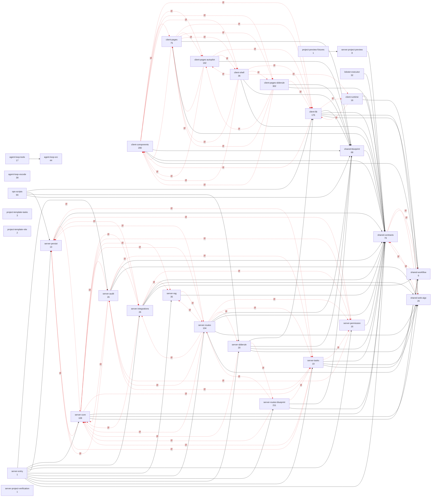

# WhyBuddy TS 架构图（自动生成）

> ⚠ **这份文件是 `scripts/arch-graph-ts.mjs --emit` 生成的，别手改。**
> 手改了 `scripts/arch-graph-ts.test.mjs` 会红。改代码然后重新生成。

对应 grok-build 的做法：边写在各 crate 的 `Cargo.toml` 里，由 cargo 强制。
对照物的现算数字见 `docs/grok-build 架构图（自动生成）.md`。

## 规模

| 包 | 模块数 |
|---|---:|
| agent-loop | 99 |
| client | 1077 |
| project-templates | 5 |
| scripts | 67 |
| server | 588 |
| services | 32 |
| shared | 179 |
| **合计** | **2047** |

边 6096 条，其中动态 import / require 318 条、
类型 import 2260 条。

## component 依赖图

**红色虚线 = 欠账看板：参与组间成环的边。基线只许变短。**

## 欠账看板（红虚线，基线只许变短）

还一笔就从 `architecture.ts.json` 的 `baseline.componentCyclicEdges` / `baseline.cyclicEdges` 删掉。
往基线里加东西 = 有意接受一笔新欠账，不该出现在日常流程里。
按强连通分量统计每条循环边，已有环内新增一条边也会触发检查。

2026-09-11 校正统计：旧算法遗漏了 83 条模块循环边、23 条组间循环边。基线迁移核对的是同一批源码依赖，未新增依赖放行。

组间循环边 **68**（基线 68）

- `client-components -> client-lib`
- `client-components -> client-pages`
- `client-components -> client-pages-autopilot`
- `client-components -> client-pages-sliderule`
- `client-components -> client-shell`
- `client-lib -> client-components`
- `client-lib -> client-runtime`
- `client-pages -> client-components`
- `client-pages -> client-lib`
- `client-pages -> client-pages-autopilot`
- `client-pages -> client-pages-sliderule`
- `client-pages -> client-shell`
- `client-pages-autopilot -> client-components`
- `client-pages-autopilot -> client-lib`
- `client-pages-autopilot -> client-pages`
- `client-pages-autopilot -> client-shell`
- `client-pages-sliderule -> client-components`
- `client-pages-sliderule -> client-lib`
- `client-pages-sliderule -> client-pages`
- `client-pages-sliderule -> client-pages-autopilot`
- `client-runtime -> client-lib`
- `client-shell -> client-components`
- `client-shell -> client-lib`
- `client-shell -> client-pages`
- `client-shell -> client-pages-autopilot`
- `client-shell -> client-pages-sliderule`
- `client-shell -> client-runtime`
- `server-audit -> server-core`
- `server-audit -> server-integrations`
- `server-audit -> server-persist`
- `server-audit -> server-tasks`
- `server-core -> server-audit`
- `server-core -> server-integrations`
- `server-core -> server-permission`
- `server-core -> server-persist`
- `server-core -> server-rag`
- `server-core -> server-routes`
- `server-core -> server-tasks`
- `server-integrations -> server-core`
- `server-integrations -> server-permission`
- `server-integrations -> server-persist`
- `server-integrations -> server-rag`
- `server-permission -> server-audit`
- `server-permission -> server-persist`
- `server-persist -> server-core`
- `server-persist -> server-tasks`
- `server-rag -> server-routes`
- `server-routes -> server-audit`
- `server-routes -> server-core`
- `server-routes -> server-integrations`
- `server-routes -> server-permission`
- `server-routes -> server-persist`
- `server-routes -> server-rag`
- `server-routes -> server-sliderule`
- `server-routes -> server-tasks`
- `server-routes-blueprint -> server-core`
- `server-routes-blueprint -> server-routes`
- `server-routes-blueprint -> server-tasks`
- `server-sliderule -> server-core`
- `server-sliderule -> server-routes-blueprint`
- `server-tasks -> server-audit`
- `server-tasks -> server-core`
- `server-tasks -> server-permission`
- `server-tasks -> server-persist`
- `shared-contracts -> shared-web-aigc`
- `shared-contracts -> shared-workflow`
- `shared-web-aigc -> shared-contracts`
- `shared-workflow -> shared-contracts`

模块级循环边 **265**（基线 265）—— 图上不逐条展开，棘轮在 `--check`。

## 组的职责

### agent-loop-src

薄控制面 Agent Loop 的实现（M1）。

路径：`agent-loop/src`

### agent-loop-tools

Agent Loop 的脚本与夹具。

路径：`agent-loop/scripts`、`agent-loop/fixtures`

### agent-loop-vscode

Agent Loop 的 VS Code 扩展。

路径：`agent-loop/vscode-extension`

### client-components

可复用组件：ui 原语、任务、three/UE 叠加、回放、血缘、nl-command。

路径：`client/src/components`

### client-lib

前端库层：推演运行时、项目存储、路由规划、浏览器侧 LLM。workers 是叶子（被 serializer 用），不进装配根。

路径：`client/src/lib`、`client/src/workers`

### client-pages

其余页面：agent-loop / specs / admin / tasks / nl-command / 落地页。

路径：`client/src/pages`

### client-pages-autopilot

Autopilot 路线页与右栏控制面。产品面收敛的对象（见 M17），改动前先确认它还在不在主路径上。

路径：`client/src/pages/autopilot`

### client-pages-sliderule

推演产品的主页面族：会话舞台、画布、区块运行时、点选编辑。前端最大的一块。

路径：`client/src/pages/sliderule`

### client-runtime

生成件在浏览器里跑起来的运行时（bind / DOMPurify 白名单那条线）。

路径：`client/src/runtime`

### client-shell

前端装配根与横切件：入口、全局上下文、hooks、i18n、开发夹具。worker 下沉到 client-lib。

路径：`client/src/App`、`client/src/main`、`client/src/const`、`client/src/contexts`、`client/src/hooks`、`client/src/i18n`、`client/src/dev-harness`、`client/src/vite-env.d`、`client/dev-harness`

### lobster-executor

沙箱执行器，独立进程（:3031），只依赖 shared 的契约。

路径：`services/lobster-executor`

### ops-scripts

Executable build/dev/architecture/smoke programs and their shared helpers. Exact CLI entrypoints are declared; imported helpers remain ordinary dependencies.

路径：`scripts`

### project-preview-fixtures

Cloud acceptance fixture launches the production preview relay against a controlled test authority. This is a smoke entrypoint, not a product authentication service.

路径：`scripts/fixtures`

### project-template-tasks

Fixed runnable task application: Node API and SQLite data, Vite development and production static output. Python publishes sources to E2B; application identities and data belong to this project.

路径：`project-templates/react-vite-tasks`

### project-template-vite

Versioned React/TS/Vite template. index.html loads src/main.tsx after Python publishes these files to E2B.

路径：`project-templates/react-vite`

### server-audit

审计 / 血缘 / 回放：证据类，fail-closed。

路径：`server/audit`、`server/lineage`、`server/replay`

### server-core

服务端核心：socket、注册表、治理、a2a 适配、nl-command。auth/runtime/config/startup 从组合根拆过来——grok 的 pager-bin 也不把库放进 binary crate。

路径：`server/core`、`server/auth`、`server/runtime`、`server/config`、`server/startup`

### server-entry

服务端装配根（对应 grok 的 xai-grok-pager-bin）：只负责把东西装起来。**被依赖数必须是 0**。auth/runtime/config 是库，不进这个 crate。

路径：`server/index`

### server-integrations

外部集成：飞书、知识库、web-aigc 提供方。增强类，fail-open。

路径：`server/feishu`、`server/knowledge`、`server/web-aigc`

### server-permission

权限：范围批准与发布批准（M12）。

路径：`server/permission`

### server-persist

持久层与工作区记忆。

路径：`server/db`、`server/persistence`、`server/memory`

### server-project-preview

Dedicated private-preview HTTP/WebSocket transport; Python owns access. The shared self-contained selection bridge only sends source locations, and the gateway binds it to current authorized runtime identity.

路径：`server/project-preview`

### server-project-verification

Trusted fixed-suite browser CLI uploaded by the Python provider to an independent E2B sandbox. Public Playwright calls collect actual evidence; SQL authority and delivery decisions remain in Python.

路径：`server/project-verification`

### server-rag

检索与向量。

路径：`server/rag`

### server-routes

其余 HTTP 路由与 node-adapters。

路径：`server/routes`

### server-routes-blueprint

蓝图 HTTP 面，211 个模块——server 里最大的一块，多数是 takeover / closure 类的切片。

路径：`server/routes/blueprint`

### server-sliderule

推演在 Node 侧的适配层：确定性 provider、代理启动诊断、session-driver（复用前端运行时的循环，见下方 layer 的例外声明）。

路径：`server/sliderule`

### server-tasks

任务调度、场景指令、工具面。

路径：`server/tasks`、`server/scene-command`、`server/tool`

### shared-blueprint

蓝图与五系统推演状态的共享契约。前后端同读一份，是这仓最要紧的契约面。

路径：`shared/blueprint`

### shared-contracts

其余共享契约：a2a、auth、cost、env、mission、permission、rag、replay、技能、UE、组织。**叶子性质**：被 client 与 server 同时依赖，不许反向依赖任何一边。

路径：`shared`、`shared/project-runtime.generated`

### shared-web-aigc

web-aigc 各能力的契约。一能力一文件，与 Python 侧 services/web_aigc_*_adapter 成对——⚠ 改一边不改另一边会静默失效（CLAUDE.md 第四条）。

路径：`shared/web-aigc-ai-ppt`、`shared/web-aigc-audio-recognition`、`shared/web-aigc-device-info`、`shared/web-aigc-dynamic-chart`、`shared/web-aigc-excel-read`、`shared/web-aigc-file-generation`、`shared/web-aigc-file-slicing`、`shared/web-aigc-file-translation`、`shared/web-aigc-governance`、`shared/web-aigc-graph-search`、`shared/web-aigc-image-search`、`shared/web-aigc-intent-recognition`、`shared/web-aigc-location-info`、`shared/web-aigc-long-text-extraction`、`shared/web-aigc-observability`、`shared/web-aigc-ocr-recognition`、`shared/web-aigc-orchestration-recognition-jump`、`shared/web-aigc-risk-actions`、`shared/web-aigc-similarity-match`、`shared/web-aigc-transaction-flow`、`shared/web-aigc-vector-delete`、`shared/web-aigc-vector-update`、`shared/web-qa`、`shared/web-search`、`shared/aigc-monitoring`、`shared/static-webpage-read`

### shared-workflow

工作流内核与运行时契约。

路径：`shared/workflow-domain`、`shared/workflow-graph`、`shared/workflow-input`、`shared/workflow-kernel`、`shared/workflow-runtime-engine`、`shared/workflow-runtime`

