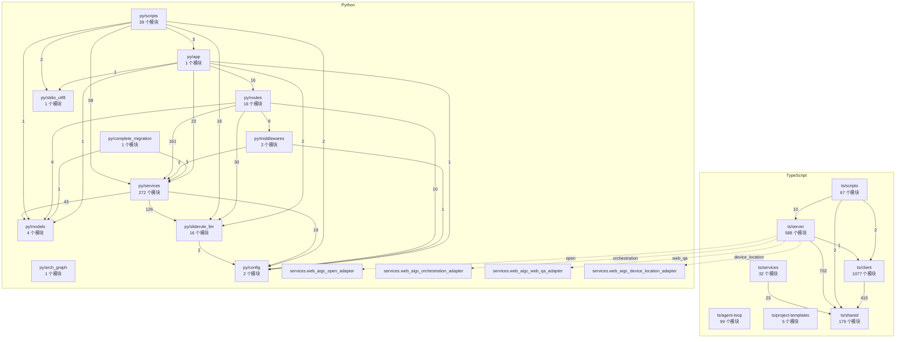

# WhyBuddy 全仓架构图（自动生成）

> ⚠ **这份文件是 `arch_graph.py --emit` 生成的，不要手改。**
> Python 包边来自 `arch_graph.py`，TS 包边来自 `arch-graph-ts.mjs --json-packages`，
> 跨语言边来自 `architecture.toml` 的 `[[cross_language_edge]]`（Nx implicitDependencies）。

- TS 包 **7**，包间边 **7**
- Python 包 **11**
- 跨语言边 **4**（server/index.ts 拼字符串加载 Python adapter）

四个 adapter 在 Python 依赖图里入度为 0，看起来像孤儿；
它们是产线代码，接线在另一门语言里。这张图把那四条边画出来。

## 跨语言边

| 从 | adapter | 到 | 为什么 |
|---|---|---|---|
| `server/index.ts` | `open` | `services.web_aigc_open_adapter` | createPythonWebAigcAdapter 拼字符串 __import__ |
| `server/index.ts` | `orchestration` | `services.web_aigc_orchestration_adapter` | createPythonWebAigcAdapter 拼字符串 __import__ |
| `server/index.ts` | `web_qa` | `services.web_aigc_web_qa_adapter` | createPythonWebAigcAdapter 拼字符串 __import__ |
| `server/index.ts` | `device_location` | `services.web_aigc_device_location_adapter` | createPythonWebAigcAdapter 拼字符串 __import__ |
