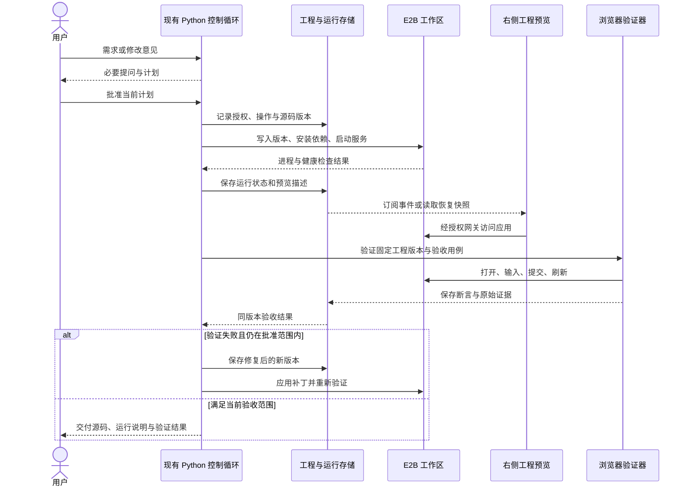

# WhyBuddy 工程运行与浏览器验证整体重构方案

日期：2026-09-11，更新：2026-09-13。状态：实施中，已进入 P4 独立浏览器检查的首批闭环，各阶段仍按真实验收判断。最新执行记录见第 25 节：完整工作台、Python/SQL、私有 E2B、网关和独立浏览器在同一次云样本中走通正常检查、故意改坏、失败存证、修复再通过；源码变化令旧证据失效，刷新恢复记录。固定模板检查不解锁业务交付。原模型循环的修复链另经测试模型验证；真实模型的完整 live-edit 仍因上游 content_filter 未通过。下一步固定构建验收产物，再推进 P5 的真实 API、数据库与应用权限；P6 编辑发布仍待完成。生产工程模式继续关闭。

代码基线：WhyBuddy `c9283935fed3da04c3671572ab546c469eda4d65`；grok-build `SOURCE_REV=c4ea71cfdbcdb21e32e41bc25a0043d7d4836714`。本方案依据当前函数体、调用点、存储与测试约束制定。后续执行前须重新确认入口，行号可能随提交变化。

## 1. 重构目标与总体决定

让 WhyBuddy 的一个会话能够持续开发一个真实项目：明确需求与计划，生成和修改源码，在 E2B 运行，由浏览器检查行为，依据同一工程版本的证据决定是否交付。失败可以定位、恢复和继续修改；关闭网页不丢项目，也不会让远端进程失去管理。

保留 Python 作为产品会话、工具授权、项目版本和验收判定的权威；保留 React 工作台；复用已有模型网关。E2B 提供工程运行环境，Playwright 提供浏览器操作。首期不增加第二套 Agent 主循环，不把 grok Rust 宿主整体引入产品。

原有需求访谈、五系统规格、问卷与计划批准、会话存档、应用版本和工作台继续发挥作用。HTML 推演模式保留明确的适用范围；新工程模式由工程自己的路由、状态、API 和业务权限负责运行。

**首个完整验收场景：** 用户提出一个小型任务管理应用，确认计划后生成工程；在预览里新增、编辑、筛选任务，刷新后数据仍在；只读用户不能修改；模型收到一次真实失败后修改源码并复测；关闭工作台后能恢复；沙盒销毁后能从持久化源码重建。

首期选择固定的 React + TypeScript + Vite 工程模板，并在完整业务验收阶段加入受管 Node API 与测试数据库。框架自由选择、多分支并行、第三方发布平台、多云沙盒和可视化源码编辑在后续阶段展开。五系统规格按任务需要增量更新，普通样式修复不必重新走完整需求访谈和规格起草。

## 2. 当前真实链路与需要解决的问题

### 2.1 当前事实

| 当前代码 | 已核实的职责 | 对重构的影响 |
|---|---|---|
| [control-turn-stream](../slide-rule-python/routes/sliderule_full.py#L1541) | 产品控制入口；登录、会话归属检查后开始 SSE | 新工程任务继续从这个入口进入 |
| [rehearsal_control](../slide-rule-python/services/rehearsal_control.py#L3463) | 模型与工具循环、问答、计划、工具结果回传 | 在现有循环注册工程工具，逐步抽出职责 |
| [drive_full_factory](../slide-rule-python/services/drive_full_factory.py#L59) | 工厂任务的权威状态读取、批准检查与后台启动边界 | 提炼共用授权和运行启动能力，保持旧工厂入口可用 |
| [spec_first_pipeline](../slide-rule-python/services/spec_first_pipeline.py) | 规格与页面等阶段的现有生成流水线 | 工程模式增加新的产物执行器，不能只改显示层 |
| [v5_full_driver](../slide-rule-python/services/v5_full_driver.py#L2515) | 向前端发出带 HTML 的 `spec_page` 事件 | 新增工程事件，旧 HTML 事件继续服务旧模式 |
| [SlideRuleStudio](../client/src/pages/sliderule/SlideRuleStudio.tsx#L1129) | 会话页选择页面、画布等舞台 | 增加按产物类型选择的工程预览入口 |
| [html-app-surface](../client/src/pages/sliderule/live-runtime/html-app-surface.tsx#L658) | 清洗生成脚本、写入 `iframe.srcdoc`，宿主填数据和接点击 | 不能把远端 URL 直接套入同源 DOM 绑定逻辑 |
| [AppsWorkbench](../client/src/pages/agent-loop/dashboard/AppsWorkbench.tsx) | 应用中心有 HTML 页面与旧模型运行时两种入口 | 必须同时覆盖应用中心、版本恢复和复刻 |
| [run_registry](../slide-rule-python/services/run_registry.py#L143) | 后台工厂运行、事件序号、取消和续订；注册表仍在进程内存 | 已有刷新续接基础，不等于服务重启后的持久恢复 |
| [app_store](../slide-rule-python/services/app_store.py) | 保存应用设计、模型、HTML 和版本血缘 | 工程源码和业务数据库不能继续塞进设计模型 |
| [mcp_tools](../slide-rule-python/services/mcp_tools.py#L392) | 一次性 E2B Python 执行，结束后销毁 | 未发现该 `code.run` 接到产品模型主循环；不能当作项目工作区 |
| [app_screenshot](../slide-rule-python/services/app_screenshot.py) | 打开已有 WhyBuddy 页面截图 | 不负责启动生成工程，也不构成完整应用验收 |

现有生成消费链为：控制面 → 工厂 → spec-first → HTML 页面事件 → 会话状态 → Studio / 应用中心 → HTML 舞台。只有整条链新增工程产物，迁移才生效。

### 2.2 必须前置处理的边界

1. **执行与订阅分离。** 当前控制 SSE 的生成器由 HTTP 响应持有，断线会关闭；工厂 run 才有独立后台生命周期。安装依赖、执行命令和浏览器操作不能无管理地挂在请求中。
2. **持久互斥与恢复。** 内存 `_runs`、`_active_by_session` 和控制回合互斥不能抵抗服务重启或多实例。会话状态的 CAS 保存也不能替代项目写锁。
3. **验收权威。** [会话 PUT](../slide-rule-python/routes/sliderule_full.py#L931) 目前允许客户端回传 `publishClosure`；[持久化合并](../slide-rule-python/services/persistence.py#L942) 也保留此投影。新工程的通过状态必须由服务端证据推导，客户端不能写入。
4. **预览权限。** 能打开 E2B 地址不代表继承 WhyBuddy 会话权限。项目文件、终端日志、截图、预览与停止操作都需要检查资源归属。
5. **运行状态归属。** 工程模式的表单、路由、业务数据由生成工程负责，不能再由宿主 `htmlRuntime` 同时维护第二份。
6. **现有部署是约束。** Render 配置存在免费实例与休眠；持久工程任务不能依赖实例一直在线或本地临时文件。上线前必须验证恢复能力和持久存储。

### 2.3 已有验证的准确范围

本会话已用 E2B 完成一次性 Python 执行、文件写入、Node HTTP 服务启动、本机 Chrome 打开与点击、跨域 iframe 点击、修改文件后 HTTP 返回更新内容以及沙盒清理。

这说明基础路线可行。尚未验证 Vite HMR、私有预览鉴权、WebSocket 代理、沙盒恢复、云端浏览器执行、生成应用业务链路或生产成本。后续每一项都要单独验收，不能沿用这次最小烟测的成功结论。

## 3. 保留、演进与退出清单

| 部分 | 处理方式 | 边界 |
|---|---|---|
| 访谈、问卷、计划批准 | 保留并完善恢复合同 | 只有确实缺少的信息才询问；批准与计划版本绑定 |
| 五系统规格、产品章程、角色权限描述 | 保留为生成输入与验收依据 | 区分产品规格和应用实际实现，规格齐全不能单独判成功 |
| 会话与应用版本 | 演进为引用工程版本、运行与证据 | 小型索引留会话；源码、日志、截图独立存储 |
| 模型网关、skills、证据检索 | 复用现有入口 | 工具清单只声明实际可用能力 |
| Studio 分栏、设备缩放、日志和批准面板 | 保留外壳，逐项接真实事件 | 不用虚构进度代替安装、运行、验收状态 |
| HtmlAppSurface 与 HTML 画布 | 保留为显式的 HTML 推演/历史查看模式 | 工程失败不得静默回落成 HTML 并显示成功 |
| 宿主 HTML 业务绑定 | 工程模式逐步退出 | 旧应用继续兼容；工程业务状态只有一个所有者 |
| 元素点选编辑、透视、布局测量 | 后期重做跨域 bridge 与源码映射 | 不直接访问 E2B iframe 的 `contentDocument` |
| 一次性 PDF、代码取证、截图工具 | 继续承担独立任务 | 与项目工作区生命周期分开 |
| Node / Lobster 历史执行路径 | 先盘点消费者，再按入口退役 | 新工程执行统一进入 Python 管理的 E2B provider；不回落到宿主 native 执行 |
| 架构图生成、依赖闸与测试资产 | 持续使用 | 新边显式声明；不扩循环基线来放过新依赖 |

## 4. grok-build 复用策略

复用以完整能力为单位：输入、状态归属、执行副作用、输出、取消和恢复测试一起迁移。Rust 代码按行为改写到 Python / TS，工具说明和提示词需要对齐实际工具名与能力。

| 模块 | 优先提取 | 改写或保留的边界 |
|---|---|---|
| [tools](<grok-build 模块/xai-grok-tools.md>) | registry、类型化 IO、read/search/patch/bash、结果截断、任务与人工决策合同 | 文件和命令执行端接 E2B；不使用本机执行器运行生成代码 |
| [workspace](<grok-build 模块/xai-grok-workspace.md>) | 资源持有者、WorkspaceOp、权限与清理 | E2B 创建、租约、重连、存储、私有预览需要实现 |
| [shell](<grok-build 模块/xai-grok-shell.md>) | session actor、stream ownership、取消、持久化、统一重建 Agent | 改善现有 Python 控制面，不另外建立对话循环 |
| [agent](<grok-build 模块/xai-grok-agent.md>) | 工具集和提示词装配、计划模式、压缩策略 | 首次创建与模式切换共用装配输入 |
| [pager](<grok-build 模块/xai-grok-pager.md>) | Action / Effect、问答/批准/权限/工具/任务状态 | React 负责展示；62 个 view 声明不等于 62 个独立可迁移产品面板 |
| [PTY harness](<grok-build 模块/xai-grok-pager-pty-harness.md>) | 启动真实程序、注入操作、采集实际输出、保留复现产物 | 场景思想迁移到浏览器；不把 PTY 测试算成 Web 验收 |
| [telemetry](<grok-build 模块/xai-grok-telemetry.md>) | 会话/操作关联、结构化事件、错误与成本诊断 | 复用字段设计，SDK 发送端按部署选择 |
| [fast-worktree](<grok-build 模块/xai-fast-worktree.md>) | 分支隔离、创建与回收合同 | CoW/BTRFS/NFS 性能优化等并发规模出现后再评估 |
| [login](<grok-build 模块/xai-grok-login.md>) | 凭证 provider、刷新与存储分离 | 不替换已有 WhyBuddy 账号模型，不复制 Grok 专属登录流程 |
| [pager-render](<grok-build 模块/xai-grok-pager-render.md>) | 展示原语与业务状态分离 | 终端 Buffer、转义序列和输入兼容层不移入 Web |

当前 grok 快照的 `finalize_session_setup` 未注入完整 BrowserService，`shutdown_browser_service` 为空，`browser_tab_chrome_e2e.rs` 只有注释。OS sandbox 是在已有环境施加限制，并非云沙盒供应系统；不能把这些占位或注释当成完成的执行能力。源码依据见 [workspace 详解](<grok-build 模块/xai-grok-workspace.md#关键链路与源码阅读路径>)。

## 5. 目标职责与操作流程

| 责任 | 权威所有者 | 接收与产出 |
|---|---|---|
| 用户意图、计划、工具调度 | Python 现有控制循环 | 用户输入与工具结果 → 计划/工具调用/对话事件 |
| 工程内容与版本 | 项目存储服务 | 文件补丁 → 不可变源码版本与父版本 |
| 会话任务与执行日志 | 持久运行服务 | 幂等操作 → 有序事件、终态、可恢复记录 |
| 项目文件与进程 | 工作区管理器 + E2B provider | 指定工程版本 → 受管环境、进程、日志、服务地址 |
| 应用实际业务 | 生成工程自己的前后端 | 路由、表单、业务 API、角色权限、数据 |
| 真实行为检查 | 受控浏览器验证 worker | 固定版本与用例 → 操作记录、断言、截图、网络/控制台结果 |
| 是否满足交付条件 | Python 验收判定器 | 规格要求 + 对应版本的证据 → passed/failed/blocked/stale |
| 工作台与预览 | React + 独立来源的预览网关 | 权威状态 → 面板与工程页面；用户操作 → 明确命令 |

下图是**拟实施的操作时序**，不表示当前 import 依赖，也不替代自动生成的权威架构图。



## 6. 工程、运行与证据的数据合同

以下名字和字段均为拟新增合同，实施时通过迁移提交建立。Python Pydantic 模型作为规范来源，导出 JSON Schema 并生成 TS wire 类型；生成物同步检查进入脚本测试。前端类型不能替代服务端参数验证。

| 实体 | 核心字段 | 不变量 |
|---|---|---|
| Project | projectId、sessionId、appRootId、ownerId、runtimeKind、currentRevision | 归属取服务端身份；一个项目可有多轮对话 |
| ProjectRevision | revision、parentRevision、treeHash、manifestRef、templateVersion、lockfileHash、specRevision、planRef | 发布后不可修改；只改源码也产生新版本 |
| Workspace | workspaceId、projectId、branch、provider | 逻辑工作区稳定；不等同于某一台 E2B 实例 |
| WorkspaceLease | workspaceId、sandboxId、generation、leaseOwner、expiresAt、mountedRevision、processRefs | sandboxId 和 provider 凭证由服务端拥有；写入要检查租约代次 |
| ControlRun / Operation | controlRunId、operationId、toolCallId、idempotencyKey、projectId、expectedRevision、approvalRef、status、remoteProcessId | 一个操作只由一个有效 worker 推进；重试先查执行状态 |
| RuntimeInstance | runtimeId、workspaceId、revision、status、port、health、lastHeartbeat | 健康与版本独立确认；HTML 200 不表示业务验证通过 |
| PreviewDescriptor | kind、projectId、runtimeId、revision、status、entryUrl、expiresAt、capabilities | URL 是临时入口；过期后重新授权和解析，不能当永久产物 |
| VerificationRecord | verificationId、revision、runtimeId、specRevision、suiteVersion、steps、assertions、result、artifactRefs | 可信 worker 写入；版本不符或缺必需用例不能通过 |
| RuntimeEvent | schemaVersion、sessionId、controlRunId、projectId、operationId、seq、type、timestamp、payload | 单 run 内序号单调；先持久化再对外宣布完成 |

`runtimeKind` 采用显式枚举 `html-prototype | project`。旧记录缺字段时只按历史 HTML 合同读取，不生成虚假的 projectId。会话和应用中心保存工程引用，不能把目录、长日志和截图 base64 全部嵌进 `V5SessionState`。

存储采用现有持久 SQL 配置与网关能力，增加独立的项目/版本/操作/事件表。第一版小型源码和证据文件可按 hash 去重存入独立内容表，设置单文件、单项目和保留量上限；超过限额如实报错。大截图、trace、上传素材扩大后接对象存储，manifest 合同不变。生产模式缺持久后端时禁止宣称“工程已保存”；本地开发可用 SQLite 与指定目录。

生成应用自己的业务数据库是另一类数据。源码快照不代表业务数据备份；开发测试可用沙盒内数据库和已声明的备份/恢复策略，真实用户数据进入独立的应用数据库或租户命名空间。生成应用账号与 WhyBuddy 工作台账号分别建模，不能借工作台登录冒充应用 RBAC 已实现。

## 7. 运行恢复、幂等与授权

### 7.1 状态不能混在一个“运行中”里

- 控制任务：`queued → running → waiting_user / completed / failed / cancelling → cancelled`；异常中断可进入 `interrupted`，等待对账。
- 运行实例：`provisioning → syncing → installing → starting → ready`；另有 `stopping / stopped / expired / failed / reconciling`。
- 验证：`not_run / running / passed / failed / blocked / stale`。

停止应用服务、停止本轮模型任务、销毁沙盒是三个动作。源码与证据在这些动作后仍保留。计划等待可以没有活跃沙盒；已有预览按空闲策略保留或停止，不让等待用户无限续费。

### 7.2 订阅、恢复与并发

将现有控制生产者从 HTTP 订阅生命周期中分离，复用现有模型循环及 run 序号/取消思想，增加持久运行记录。HTTP 负责提交命令、查询快照和订阅事件；关闭订阅不取消运行。显式“停止”才发取消请求，预算与孤儿策略在服务端执行。

前端保存最后消费序号，通过 `afterSeq` 续播；快照包含 `lastSeq`，先应用快照再补后续事件，重复事件按序号去重。旧客户端未理解工程事件时显示不支持，不能把工程事件误判为 HTML 完成。

第一版单 worker 也要保存租约。每个项目分支只允许一个写入者；接管时增加 generation，旧 worker 的写入和终态提交必须被拒绝。首期接管优先停止旧进程或重建沙盒，无法确认旧实例停止时保留 `reconciling`，不允许新旧实例共同写持久数据。

服务重启后按数据库记录查 E2B：实例仍在则连接并检查进程与源码版本；实例失效则从不可变版本重建。恢复文件和工作区不表示自动重放所有命令：不确定是否完成的提交、数据库迁移或外部请求进入待对账状态，禁止盲重试。

### 7.3 操作与文件边界

操作记录先写入数据库，再发往 provider；成功结果与证据保存后再发完成事件。安装/启动等长操作返回 operationId，模型和界面通过状态/日志工具跟踪，不阻塞 FastAPI 事件循环。

`apply_patch` 携带 expectedRevision 或文件 hash。冲突时返回差异，不覆盖其他操作成果。路径校验覆盖相对路径、绝对路径、符号链接以及归档解包；限制在项目目录内。终端输出分块持久化并限制模型上下文长度，完整日志通过授权引用查看。

权限分为资源访问、计划范围、具体操作三层。已批准范围内的正常改文件、运行测试和修复继续执行，不每一步重复询问。跨项目、扩大访问范围或产生额外外部副作用时重新判定。每次工具执行都复查服务端权限与当前批准版本，不能只靠工具菜单隐藏。

WhyBuddy 的模型凭证、E2B 管理凭证、主数据库凭证不进入生成项目环境。确有业务需求的凭证通过单独的项目 secret 引用注入，受授权范围约束，日志脱敏；浏览器和模型上下文不接收 provider 管理 token。

## 8. 预览、浏览器与证据闭环

### 8.1 实时预览

新增 `SandboxPreviewSurface`，只消费服务端确认的 PreviewDescriptor。HTML 模式继续使用 HtmlAppSurface；会话页与应用中心共用产物选择规则，并展示准备、启动、就绪、停止、过期、失败等真实状态。

私有预览采用与 WhyBuddy 主站分离的来源，生产使用专用预览域名；主站认证 cookie 必须限定主站，不让生成代码共享主站源。每个运行实例使用隔离的来源，避免不同项目共享 localStorage、cookie 和 service worker。

第一版通过预览网关代理 HTTP 与 WebSocket：工作台向 Python 申请项目范围的短时访问票据，网关兑换并消费票据，使用隔离来源的受限会话继续访问；清理 URL 票据并避免进入日志与 Referer。E2B 流量凭据由网关注入上游，前端不持有。网关仅接受服务端登记的实例/端口，不能成为任意 URL 代理。

当前已安装 SDK 的 `SandboxNetworkOpts.allow_public_traffic` 默认是 true；`secure=True` 的文档指的是 envd 访问认证，不能据此认为应用端口已经私有。实施时需要验证关闭公开访问、直连拒绝、授权代理、票据撤销、跨用户拒绝和 HMR WebSocket；这组验证完成前，远端 URL 只用于无敏感数据的内部烟测。

**2026-09-12 实测修正：** 关闭公开访问后，匿名及错误凭据的 HTTP/WS 请求确实被拒；但 E2B 会将 `E2B-Traffic-Access-Token` 原值继续传给应用，见第 21.3 节。因此上面“网关注入上游流量凭据”的直接实现不能作为生成应用的安全预览入口。下一批先验证出站反向隧道：生成沙盒主动连接受管网关，浏览器访问仍由网关独立验票；隧道凭据只允许对应 runtime/generation 连接与回包，不能访问其他项目或获得用户预览票据。隧道尚未实现，多路复用、撤销、重连、HTTP/WS 与 HMR 都须独立验收。同沙盒加一个剥头代理也未证明进程隔离，不能直接视为修复。

先实现直接预览、刷新、设备尺寸与打开独立页面。Vite host/origin/HMR 配置随运行描述下发并校验，代理不能随意改坏资源路径和 WebSocket；健康探针还要确认正在服务的工程 revision。

### 8.2 浏览器验证

首期浏览器验证器使用受控 Playwright worker，与生成应用分离。部署可使用独立的 E2B 验证沙盒和预烤浏览器模板；每次验证新建 context，按任务回收。生成项目不能读写验证脚本、结果记录或管理凭证。

浏览器工具覆盖打开页面、定位元素、点击、输入、选择、提交、等待、DOM 断言、截图、console/network 与 trace。所有工具都返回真实结果或明确失败，不能用页面源码长度、按钮数量或模型自述替代。

开发预览支持 HMR，正式验收固定源码 revision，并用锁文件安装/构建可复现产物。验证期间禁止并发修改同一实例；运行前后核对版本。后续可以用独立验证实例提高并行度。每次源码、依赖或关键配置改变，对应旧证据立即标为 stale。

应用源代码中的测试可作为一类证据；必须有独立于生成代码的受管验收用例，覆盖实际需求。生成应用不能通过自行输出 `passed` 使宿主通过。

### 8.3 检查与交付

| 检查层 | 必须记录的证据 | 不能据此单独推断的结论 |
|---|---|---|
| 工程构建 | 模板/锁文件、类型检查与构建退出码、日志 | 编译成功不代表业务可用 |
| 服务启动 | 进程、端口、版本响应、健康检查 | HTTP 200 不代表页面和 API 正确 |
| 页面渲染 | 实际 DOM、资源加载、截图、console | 一张截图不代表提交/刷新/权限可用 |
| 业务主链 | 输入、提交、API 响应、刷新后持久数据、断言 | 用例通过只代表声明覆盖范围 |
| 权限与失败路径 | 未授权拒绝、错误提示、网络失败、恢复行为 | 宿主账号权限不等于应用权限 |

新增权威工程验收结果，不复用可被客户端写入的 publishClosure 作为通过依据。旧 HTML 展示投影兼容读取，但不得解锁工程交付。新结果由服务端从 VerificationRecord 推导，再通过统一 serializer 投影给前端；同步修改路由、持久化、恢复、白名单与应用中心消费。

`passed` 必须同时满足当前规格要求、固定源码版本、必需测试与行为证据。未配置浏览器、缺证据或外部依赖不可用为 blocked，断言失败为 failed，源码变化为 stale。执行工具完成、预览就绪、产品验收通过、对外发布分别记录。

交付至少包含源码版本、锁文件、运行与配置说明、验证范围及未覆盖项、证据入口和当前预览状态。工程导出不含 secret。公开部署或推送生成项目到外部仓库是独立发布动作，按已授予权限执行，不能因为页面预览就绪就自动公开。

## 9. 拟新增模块与现有入口改动

以下路径是实施建议，不是当前已存在文件。表中的分层先按职责确定，具体依赖需在两个架构清单中声明。

| 拟新增或提炼的模块 | 层次 / 责任 |
|---|---|
| `models/project_runtime.py` | 数据叶子：项目、版本、运行、事件与证据模型 |
| `services/project_manifest.py` | util：路径、源码树 hash、manifest 与补丁前置校验 |
| `services/workspace_provider.py` | util：provider 协议；依赖数据模型，不依赖业务服务 |
| `services/e2b_workspace_provider.py` | core：通过 provider 协议调用 E2B，转换错误，不做会话授权 |
| `services/project_store.py` | core：持久项目/内容/版本/操作/事件，使用既有存储基础设施 |
| `services/project_policy.py` | core：资源与批准范围判定，不发 UI 事件 |
| `services/project_runtime.py` | core：租约、版本同步、进程、健康、取消、恢复与回收 |
| `services/control_run_service.py` | flow：提炼现有控制生产者的持久生命周期，不另写模型循环 |
| `services/project_tools.py` | flow：工程工具适配到现有工具分派与结果合同 |
| `services/browser_verification.py` | core：受管浏览器任务、固定版本与证据采集 |
| `services/project_delivery_gate.py` | core：根据结构化证据和需求判定，无浏览器 IO |
| `routes/project_runtime.py` | HTTP 边缘：项目命令/查询/订阅/预览票据，使用现有身份边界 |
| `shared/project-runtime.generated.ts` | 生成的 TS wire 合同，不依赖 client/server |
| `client/src/pages/sliderule/project-runtime/` | UI：状态选择、预览、文件差异、日志、验证结果 |
| `server/project-preview/` | 仅预览 HTTP/WS 传输与票据校验；Python 保持项目授权和状态权威 |

`project_tools` 不反向 import `rehearsal_control`。控制循环只负责注册、调度和回填结果；策略、数据与服务通过参数传入。core 不依赖 flow；provider 不导入路由；共享 TS 合同保持叶子。具体拆分必须接受架构检查，不因模块数量增加就认为设计完成。

现有改动点覆盖：`rehearsal_control`、`drive_full_factory`、`run_registry`、`v5_state`、`sliderule_full`、`persistence`、`app_store`、`scope_authority`、`v5_publish_closure_response`；客户端 `sliderule-marathon-driver`、`useSlideRuleSession`、`SlideRuleStudio`、`spec-live-pages`、`app-store-client`、`AppsWorkbench`。

同步 `/drive-full`、流式 `/drive-full-stream` 与产品 `/control-turn-stream` 对工程模式必须走同一权威运行服务；尚未支持的旧入口明确返回不支持，不偷偷执行旧 HTML 流水线。工程相关的新 Node 接口仅做传输，不复制 Python 的业务判断。

## 10. 分阶段实施与功能提交

阶段顺序按依赖排列。每个阶段都有用户可见结果、验收和回退方式；只完成文档、函数或模拟测试不能进入下一阶段的完成态。提交粒度按功能，阶段内可拆多个提交，按已有授权推送工作分支。

| 阶段 | 交付与主要工作 | 完成条件 | 回退条件与方式 |
|---|---|---|---|
| P0 基线与合同确认 | 固定真实入口、旧模式样本、缺口与验收用例；确认持久库与预览来源部署方式 | 记录一轮产品原样请求/事件；明确现有失败与新增失败；本方案可审查 | 没有开始业务迁移，无数据变更 |
| P1 持久基础与权威边界 | runtimeKind、工程版本、操作/事件、单写租约、服务端验收字段；控制生产者与订阅解耦 | 旧会话可读；伪造 owner/revision/closure 被拒；断线重订阅、服务重启对账、不重复派发 | 关闭工程创建；新增表和字段保留，旧 HTML 继续工作 |
| P2 固定工程运行与预览 | 持久模板 → E2B → 安装 → 服务 → 私有预览；Studio/应用中心接相同描述；先完成固定模板而非自由生成 | 真机按钮/API 烟测；HMR；未授权直连失败；刷新不重建；销毁后源码重建 | 工程显示停止/失败，保留源码；不自动变成 HTML |
| P3 模型操作工程 | read/list/search/patch/exec/logs/status 接入现有循环；计划范围、冲突、预算和真实取消 | 用户批准后模型修改源码、页面变化；一次失败能把真实错误送回同一循环；刷新与停止可控 | 禁止新写入工具；已保存工程可读、可导出和按策略停止 |
| P4 浏览器检查与修复 | 独立 Playwright、固定版本证据、权威 gate、失败反馈与有限重试 | 正反用例能使结果变绿/变红；改源码使旧证据 stale；无浏览器时 blocked | 暂停验证任务；工程仍可预览，但不能显示验收通过 |
| P5 规格到真实业务工程 | 五系统规格映射成工程任务与用例；路由、API、持久数据、应用权限；导出与版本恢复 | 本文首个完整业务场景通过；重启/重建后的源码和业务数据按合同恢复；无 mock API 冒充 | 已有工程回到指定源码版本并重验；保留旧类型应用与原始数据 |
| P6 编辑体验、灰度与旧路清理 | bridge/点选编辑、复刻、发布、资源治理；按项目灰度；清理无消费者的旧执行分支 | 两个产品入口一致；旧应用兼容；灰度指标达标；源码来源和证据可追溯 | 关闭新项目默认工程模式；已有工程保留可恢复记录和数据 |

建议功能提交边界：

1. `feat(project): add runtime contracts and revision storage`
2. `feat(control): persist operations and resumable control runs`
3. `fix(project): enforce ownership and server-owned verification`
4. `feat(workspace): manage E2B project lifecycle and recovery`
5. `feat(preview): authorize isolated HTTP and WebSocket preview`
6. `feat(studio): display project runtime in studio and app center`
7. `feat(tools): connect project tools to the control loop`
8. `feat(verify): collect browser evidence and enforce revision gates`
9. `feat(generator): produce and repair runnable business projects`
10. `feat(project): restore export and fork project revisions`
11. `feat(editor): bridge preview selection to source patches`
12. `refactor(runtime): retire superseded project execution paths`

P2 是第一个可见里程碑；P4 是模型操作与浏览器检查闭环；P5 才满足完整业务应用的首期交付目标。P6 的并行分支、可视化编辑和外部部署分别立功能验收，不阻塞前面已有里程碑。

## 11. 测试与验收清单

每个功能提交运行相关单测、合同测试及必须的架构检查；阶段验收运行真实服务。测试断言要执行实际入口或消费路径，禁止仅匹配注释里的工具名。

| 领域 | 正向验收 | 必须失败或拒绝的验收 |
|---|---|---|
| 会话和项目归属 | 所有者可读写与恢复 | 其他用户猜到 project/run/sandbox ID 也不能读日志、源码或停止 |
| 批准 | 当前批准范围内自动推进 | 过期计划、跨项目操作、伪造批准无法执行 |
| 持久运行 | 刷新续播；重启接管；序号去重 | 重复提交不启动两份操作；旧租约不能提交结果 |
| 源码 | 补丁产生新 revision；恢复内容一致 | 旧 hash 冲突、目录逃逸、符号链接逃逸、归档逃逸被拒 |
| 进程 | 启动、探针、日志、停止真实有效 | `task.cancel()` 后远端仍跑时不能宣称 cancelled |
| 私有预览 | 授权用户打开及 HMR | 无票据直连、过期/撤销票据、错误 origin、任意上游代理被拒 |
| 浏览器证据 | DOM/点击/API/刷新/角色断言真实执行 | 页面 200、假 passed 字符串、旧版本截图不能单独过闸 |
| 工程版本 | 源码改变使旧证据 stale | 仅恢复旧 gate 不重新核版本不能过闸 |
| 双入口 | Studio 和 AppsWorkbench 同一产物选择 | project 错误不能静默显示旧 HTML 或另一个项目 |
| 业务数据 | 写入后刷新与声明的重建方式保留 | 仅 localStorage 模拟写入不能冒充真实 API 持久化 |
| 无外部能力 | 缺 E2B/浏览器/存储时说明缺项 | 不回落到宿主执行，不伪造通过或已保存 |

变异验证至少覆盖：去掉项目归属检查、忽略 expectedRevision、允许客户端写验收状态、移除真实进程停止、把旧证据当新证据、断开 UI 工程事件消费。每次只变异一处，确认对应判据变红后恢复源码。

回归锚点包括 [会话归属](../slide-rule-python/tests/test_session_ownership_paths.py)、[驱动归属](../slide-rule-python/tests/test_drive_routes_ownership.py)、[run 归属](../slide-rule-python/tests/test_runs_ownership.py)、[控制生命周期](../slide-rule-python/tests/test_control_stream_lifecycle.py)、[计划批准](../slide-rule-python/tests/test_control_plan_approval.py)、[批准持久化](../slide-rule-python/tests/test_plan_approval_persistence_boundary.py)、[页面回退真实性](../slide-rule-python/tests/test_page_fallback_truth.py)；新增测试需同时覆盖项目入口与实际前端消费。

现有仓库命令：

```powershell
# 从仓库根目录运行，按改动选真实相关测试，不复制旧测试通过数量。
& slide-rule-python/.venv/Scripts/python.exe -m pytest slide-rule-python/tests/test_control_stream_lifecycle.py slide-rule-python/tests/test_control_plan_approval.py slide-rule-python/tests/test_session_ownership_paths.py -q
pnpm run test:client
pnpm run check
pnpm run test:scripts
pnpm run arch:emit
pnpm run arch:check
```

代码改动后重新生成 Python / TS / 全仓架构并过闸；仅文档方案不改权威依赖图。修改含 Mermaid 的文件须使用仓库真实浏览器渲染器。历史基线失败应在相同基线复现并注明，不能默认沿用旧记录，也不能顺手修无关代码。

已创建 `smoke:project-runtime` 与 `project:contracts:check` 命令；`smoke:project-browser` 尚未创建。当前 runtime 烟测只验证固定工程的执行原语，不代表浏览器或业务验收。烟测报告记录源码版本、模板/依赖、运行 ID、步骤、原始日志和证据文件，输出明确通过/失败/缺条件。

## 12. 部署、资源与回退

开发继续使用现有 Vite / Node / Python 启动方式；生成工程在 E2B 运行。新增 worker 初期可以与 Python 部署在同一服务，但生命周期必须由持久记录驱动，重启可对账；需要持续处理时配置不休眠的 worker。达到并发需求后再单独部署，不先增加无必要的调度平台。

预览网关作为独立来源的传输服务部署；可复用 Node 运行环境，但不能在主站同源下提供可执行生成内容。上线配置包含隔离域名、TLS、HTTP/WS 路由、主站 host-only cookie、票据签名、实例端口映射与撤销。浏览器 worker 使用固定浏览器/模板版本，并能在生产环境真实启动。

新配置按能力分组声明：工程功能开关、模板/锁文件版本、持久库、内容存储、预览来源和票据、工作区/命令/验证超时、每用户并发、日志与文件上限、空闲回收和任务总预算。具体变量名在实施提交中确定并写入 `.env.example` 与部署配置，不能仅修改本地 `.env` 就声称线上已具备能力。

成本分别记录 E2B 应用实例时长、验证实例时长、冷启动/依赖安装、LLM 调用、存储和流量。P2/P4 采集冷/热启动与失败恢复样本后确定阈值；设置有限可配置上限，不用未经测量的“秒开”或单次费用作承诺。已标定的旧参数不随本方案调整。

数据库采用先增字段/表、双类型读取、按项目启用的迁移。特性开关控制新项目默认类型，已创建项目类型持久化。回退代码必须仍能识别 project 记录并展示只读/停止状态；否则最低回退版本锁定在 P1，不回退到会把工程记录误读成 HTML 的版本。

回收任务根据持久租约与 provider 清单对账，处理崩溃遗留实例。销毁失败保留待重试记录并记录 provider 超时兜底；不能先删记录再假定沙盒已经停止。删除项目和删除业务数据另有明确操作，停预览不删数据。

## 13. 后续编辑、发布与旧路径退出标准

跨域 bridge 只传受控的选中、布局与定位消息，检查 origin、event.source、project/runtime/revision 和消息版本。不能把来自生成应用的任意 postMessage 当命令执行。元素选择映射到源码后由受权补丁修改工程，形成新版本与 HMR；刷新后修改仍在才算编辑成功。

旧 HTML 转工程采用显式转换操作：保留原始应用和来源引用，把 HTML/CSS/素材作为迁移输入，补工程路由与真实动作，建立新版本并重新验证；不直接改 runtimeKind 冒充已经转换。已有业务数据另写迁移与回滚程序。

工程复刻沿用应用中心已有所有权与血缘规则，复制不可变源码引用后创建新项目，不复用原工作区或秘密配置。切换版本需同步恢复源码、锁文件、运行描述和验证状态，不能只切模型版本。

旧路径只有在同步/流式/会话/应用中心/脚本消费者都明确迁移或标记兼容，回归通过、真实样本覆盖、依赖图证明无遗漏入口后才删除。生成应用对外发布另接版本固定、配置、数据库迁移、部署结果和回滚合同；E2B 开发预览不当成永久生产托管。

## 14. 当前执行清单与完成定义

- [x] 核对控制入口、HTML 生成/消费、E2B 一次性调用、应用中心和存储边界。
- [x] 验证最小 E2B Web 服务与本机浏览器操作，明确尚未验证的范围。
- [x] 形成保留/替换、grok 复用、数据合同、阶段验收和回退方案。
- [x] 在会话工作台显示真实 `runtimeKind` 与 rollout 状态；rollout 关闭时明确显示 `project_rollout_disabled`，不伪造工程入口。
- [x] 为已有批准计划的会话接通“进入工程工作台”入口；前端按钮和批准引用校验与服务端 `plan_execution_authorized` 保持一致，创建后重新读取权威 session state。
- [ ] P0 采集固定业务样本原始请求/事件并确定部署与资源基线。
- [ ] P1 持久工程合同、执行恢复、授权和权威证据。
- [ ] P2 固定模板工程、私有实时预览、刷新与重建。
- [ ] P3 同一模型循环内修改工程、处理失败和停止真实进程。
- [ ] P4 浏览器检查、证据过期与自动修复闭环。
- [ ] P5 首个真实业务应用、数据持久化、版本导出恢复。
- [ ] P6 编辑体验、灰度、发布扩展与旧执行路径清理。

整体完成以真实业务样本为准：从批准计划到源码、E2B 应用、浏览器证据、失败修复、刷新恢复和可复现交付完整走通；旧应用仍按原类型正常读取；未完成或不具备条件的能力明确显示状态。迁移进度按阶段和能力报告，不把文件数量、代码行数或参考覆盖率折算成完成百分比。

## 15. 2026-09-11 审查后第一批修复

本轮起点为 `5dae0cf6`。按“执行真实性 → 持久恢复基础 → 主链授权 → 私有预览”的顺序推进，当前完成以下修复：

| 功能 | 已落实的行为 | 当前边界 |
|---|---|---|
| E2B 执行合同 | 工程目录统一为 `/home/user/workspace`；显式传入 API key；前台命令保留真实退出码和有界输出；后台使用 SDK 实际 PID | 生成代码仍只在沙盒执行；工具输出不是验收结论 |
| 文件与进程 | 写文件拒绝目录/文件符号链接逃逸；停止覆盖 npm 子进程；新 provider 可按持久 ID 重连；销毁失败可重试；已过期实例可按 ID 确认消失 | 创建附带 workspace 元数据供后续对账；自动资源回收 worker 尚未接通 |
| 运行真实性 | 要求锁文件并执行 `npm ci --ignore-scripts`；传入实际端口和 `--strictPort`；确认进程存活、页面可读、版本标记一致后才返回 ready | 版本标记只用于运行健康；不作为独立业务证据 |
| 租约与资源 | 安装期间持续续租；创建后立即登记 sandbox；接管前确认旧实例已销毁；清理失败保留引用；启动期间再次核对源码版本 | ready 之后尚无常驻 worker 管理；沙盒受有限超时约束，不能据此宣称持续预览已完成 |
| 存储恢复 | `claim_operation` 以当前租约和行版本 CAS 接管旧操作；旧 worker 不能提交；确认销毁后才清空 runtime 引用 | 接管原语已完成，任务分派、进程重启扫描、取消与事件续播尚需接真实运行服务 |
| 工程版本权威 | 普通会话保存保留已存工程指针；明确更新版本使用 `expected_project_revision` CAS；失败上传/发布先占存储额度 | 配额保守计数，尚无自动 GC 返还；真实 PostgreSQL 网关验收另做 |
| 运行入口 | 检查真实会话归属、当前工程版本和批准计划内容哈希；拒绝客户端命令；不向客户端返回 sandbox、worker、进程明细或裸 E2B URL | 默认拒绝启动。仅开发环境、超级管理员、明确内部开关可做内部烟测；生产始终拒绝，直到持久分派与私有网关接好 |
| 架构合同 | 会话 TS 类型实际引用生成的 Project 合同；删除新加的孤儿豁免；新 workspace → platform 依赖明确声明 | 没有增加循环或违规基线 |

真实 E2B 烟测命令为 `pnpm run smoke:project-runtime`。固定 React/TS/Vite 工程通过了 8 项检查：符号链接拒绝且外部内容不变、写入与命令同目录、非零退出保留 stderr、指定端口与版本健康、新 provider 重连、未授权直连返回 403、修改源码后 HTTP 返回新内容、停止后父子服务与监听消失。烟测所建沙盒均已销毁。

本机原始报告在 `artifacts/project-runtime/1789128730-3cfd6c4d.json`，对应源码快照在同名 SQLite 文件；这些运行产物不进入仓库。第一轮锁文件超过 32 KiB 工具输出上限时明确失败，随后改为压缩传输完整锁文件，再运行通过。报告保留真实过程，不用第一轮失败记录冒充通过。

反向测试覆盖失败启动、健康不符、陈旧版本、无批准、跨用户、生产禁用、租约接管和清理失败。项目相关与控制/会话回归共 177 passed、3 skipped；两项跳过是 Windows 无法运行的 Linux helper 测试，其对应能力已在 E2B 实测，另一项是文件存储不适用的跨 worker SQL CAS 用例。脚本测试 56/56 通过，Python/TS/grok 架构检查通过，三份架构图与本方案的 Mermaid 已由真实 Chrome 渲染。

执行目录、API key、公开流量、销毁重试、存储 CAS/配额、启动退出码、就绪探针与批准检查均做了变异验证。全仓 TypeScript 检查仍有 18 条错误；与起点版本使用同一依赖和编译配置比较，诊断完全一致，本轮没有新增。

**本批结束时排定的后续顺序（第 1 项的执行结果见第 16 节）：**

1. 将操作表、接管、心跳和有序事件接入受管后台任务；HTTP 提交与订阅分离，补重启扫描、取消、重复请求和 `afterSeq` 恢复验收。
2. 从真实会话和当前批准计划创建工程，绑定服务端项目引用；将源码工具接入现有控制循环，确保修改与运行使用同一个工程版本。
3. 建立隔离来源的预览 HTTP/WS 网关和短时票据，验证授权访问、撤销和 Vite HMR 后，再接 Studio 与 AppsWorkbench。
4. 加独立浏览器 worker、固定版本证据与交付闸，再进入真实业务工程的失败修复闭环。

本批结束时尚未完成：工作台中的可用工程预览、HMR WebSocket 代理、浏览器点击/业务断言、应用数据恢复与完整服务重启恢复。当前进度以第 16 节为准，第 14 节的 P1/P2 勾选保持未完成。

## 16. 2026-09-11 持久后台运行与恢复

本批起点为 `1fa4135c`，完成第 15 节第 1 项的工程操作链路。对照 grok 的 `acp_session.rs::StreamOwnership` 和 workspace handle 的资源管理职责，将 HTTP 观察者与执行持有者分开；执行仍由 Python 管理，没有新增模型主循环。

| 已完成能力 | 当前真实行为 |
|---|---|
| 持久提交 | 启动接口返回 `202` 和 operationId。相同幂等键、相同输入只登记一次；相同键改变端口返回冲突。HTTP 响应中断不取消任务。 |
| 后台执行与续租 | 应用 lifespan 启动有并发上限的 supervisor；任务经历 provisioning、syncing、installing、starting、ready。ready 后继续维护租约、进程健康与运行预算。 |
| 重启接管 | 按数据库记录扫描可接管任务，增加租约 generation；重连原 sandbox/PID 并核对版本。安装、启动和就绪阶段均有恢复测试。未保存进程编号的派发窗口明确失败并清理，不盲目重放命令。 |
| 取消与清理 | 取消意图先落库；安装、启动、ready 都能停止。只有 provider 确认销毁后才记录 cancelled/stopped 并清空资源引用。销毁失败保留 interrupted/reconciling 和原清理目标，租约到期后重试。 |
| 创建窗口对账 | 通过 workspace metadata 遍历 E2B 全部分页，核对返回归属。创建后、保存 sandboxId 前崩溃的实例可被发现和清理；provider 查询失败不当成“没有实例”。 |
| 状态和事件 | Runtime 嵌入操作记录，与状态版本和待发事件一起 CAS 保存。outbox 可在重启后补发，包括终态事件。阶段和分块日志先持久化，再通过 afterSeq 分页读取。 |
| 真实退出结果 | E2B 已完成后台进程不能仅靠 SDK reconnect 取回结果；受管启动器现在原子保存真实退出码。日志最多 1 MiB，超过上限仍持续排空输出，不让子进程堵住。 |
| 活动与过期 | 显式 touch 保存最后活动时间；读取快照/日志不延长空闲时间。空闲和总运行预算分别受限，持续活动也不能绕过总预算。租约已过期的快照显示 reconciling，不能沿用旧 ready。 |
| HTTP 合同与权限 | 开发环境、内部开关、超管限制继续保留。归属检查覆盖读取、日志、取消和 touch。响应使用独立 Pydantic 公共模型，生成相应 TS 类型，屏蔽租约所有者、outbox、provider URL 和进程编号。 |

本批 `runtime.start` 表示**受管运行的完整生命周期**：预览准备好时 operation 仍为 running，runtime 为 ready；取消、过期或失败才结束 operation。当前每个项目使用单一工作区租约，后续排队请求不能替换仍在恢复的任务。

接口均位于 `/api/sliderule` 下：

- `POST /projects/{projectId}/runtime/start`：必填 expectedRevision、approvalRef、idempotencyKey。
- `GET /project-operations/{operationId}`：读取 operation、runtime 和 lastSeq。
- `GET /project-operations/{operationId}/events?afterSeq=0&limit=200`：有界 JSON 分页，返回 events、nextSeq、hasMore；本批没有新增 SSE 长连接。
- `POST /project-operations/{operationId}/cancel`：记录取消请求；worker 离线时仍可保存，等待恢复处理。
- `POST /project-operations/{operationId}/touch`：显式记录用户活动，不启动或恢复已终结任务。

消费端先应用快照，再补 lastSeq 之后的事件；事件按 seq 去重，状态事件只应用更大的 stateVersion，避免补发的旧状态回退快照。工作台消费在后续预览阶段接入。

验证结果：相关 Python 与控制/会话回归 251 passed、3 skipped；两项为 Windows 不支持的本地 Linux helper，另一项为文件存储不适用的跨 worker SQL 场景。Provider 真实 E2B 检查 8 项通过，最新报告为 `artifacts/project-runtime/process-1789132763-17f3cb48.json`。存储 CAS/outbox、provider 退出码/分页/日志、HTTP 门控/归属/生命周期，以及 worker 取消/执行授权/禁止重放/空闲活动/真实销毁均经过变异验证。

真实生命周期烟测使用固定 React/TS/Vite 源码、独立 SQLite 记录和内部烟测授权，六项通过：幂等启动、安装结果与日志持久化、新 store/worker 接回同一 sandbox/PID 与事件、取消后远端销毁且源码保留、销毁后从相同版本重建，以及确认 npm 安装进程存活后取消。最终报告为 `artifacts/project-lifecycle/1789133667-bbb5f35b.json`，所建测试资源均已清理。这不是模型生成或浏览器业务验收。

```powershell
pnpm run smoke:project-process
# 先执行既有固定模板烟测，得到该次报告旁边的源码数据库。
pnpm run smoke:project-runtime
pnpm run smoke:project-lifecycle -- --source-db artifacts/project-runtime/<该次报告名>.db
```

脚本测试 56/56、生成合同检查与 Python/TS/grok 架构检查通过；架构依赖按实际装配声明，没有扩大循环或违规基线。TypeScript 全量诊断与起点 `1fa4135c` 在相同依赖下比较，均为 18 条且内容一致。配置与上下界见 `.env.example`；本批没有部署不休眠的生产 worker。

边界仍然明确：目前只将工程操作从 HTTP 生命周期中分离，`run_control_turn` 的持久控制回合仍待实施。进程结果文件位于应用沙盒内，仅用于运行恢复，不是可信业务验收证据。进程异常退出的租约与派发窗口已用故障注入覆盖，真实云端验证覆盖受管 worker 停止、数据库重新打开与接管，尚未完成生产多实例崩溃和真实 PostgreSQL 网关验收。私有预览网关、浏览器验证、业务数据备份与应用交付继续待办，P1/P2 不标为整体完成。

**下一批顺序：**

1. 从真实会话的已批准计划创建固定工程并绑定服务端项目引用，覆盖重复创建、旧批准和版本冲突。
2. 在现有控制循环注册工程文件、补丁、执行和状态工具；控制任务另做持久运行与订阅分离，使同一模型回合能够接收真实失败后继续修复。
3. 建立隔离来源的 HTTP/WS 私有预览，完成票据、撤销与 HMR 验证，再接 Studio 和 AppsWorkbench 的同一产物入口。
4. 引入独立浏览器 worker、固定版本证据与权威交付闸，完成真实业务应用的失败修复闭环。

## 17. 2026-09-11 已批准会话接入工程工具

本批起点为 `5d5b635c`，完成第 16 节的工程创建与工具接线部分。现有 `control-turn-stream → rehearsal_control` 继续承担唯一模型循环；工程任务交给既有持久 supervisor。控制回合本身的持久恢复仍未完成，不将两种生命周期混为一谈。

| 能力 | 已实现的行为与约束 |
|---|---|
| 批准后创建 | `POST /sessions/{sessionId}/project` 与模型 `project_create` 共用服务。从持久会话读取当前批准及内容哈希；按会话唯一创建固定工程。普通客户端或普通会话保存不能首次绑定项目；已有 HTML 应用必须显式转换。 |
| 引用恢复 | 源码先保存，项目引用再写会话。绑定失败后重复创建可恢复；引用写入在文件锁或 SQL CAS 中再次检查批准，只更新工程引用，保留并发对话。补丁后同步最新源码 revision。 |
| 固定模板 | `project-templates/react-vite` 是独立源码包，包含 React 19.2.1、Vite 7.3.6、TypeScript 5.9.3、固定锁文件及 check/test/build。架构清单禁止它依赖宿主包；Python 镜像显式包含模板文件。模板是可编辑计数器起点，不代表业务应用已生成。 |
| 同一模型循环 | 注册 project_create/list/read/search/patch/start/exec/status/logs/cancel 共 10 个工具。服务端按开发环境、内部开关、超管身份注入能力；载荷不能自行启用。工具结果回到下一次模型调用，源码变更后更新提示词和会话版本。 |
| 源码修改 | Patch 要求 expectedRevision 和逐文件 SHA256，持有同一项目写租约。路径逃逸、旧版本、旧批准、跨会话操作及未清理的沙盒引用均拒绝。修改后建立新不可变版本。 |
| 命令执行 | `runtime.exec` 在 E2B 安装锁定依赖后，仅运行 npm run check/build/test。真实退出码及日志持久保存；安装失败与命令失败区分，缺结果不填零。安装结束后再次核对批准，再启动项目脚本。 |
| 恢复与取消 | executing 阶段按已保存 PID 恢复，派发身份不明时不重放。取消、预算过期和清理失败沿用持久状态；确定源码已过期的排队任务记录 failed 并释放租约，不无限重试。 |
| 找回任务 | 不带 operationId 的 project_status 返回当前源码和分页操作索引，以及已登记的活跃任务编号。新回合可找到旧任务、查日志或取消；有编号的 status 可有界等待，最多 5 秒。 |
| 旧链边界 | 工程会话不能调用旧 HTML 工厂、同步/流式旧驱动或旧 report_done。源码保存、命令通过和服务 ready 均不解锁业务交付；工程失败不静默回退成 HTML。 |

对照 grok 的 `get_terminal_command_output`、`kill_terminal_command` 和类型化工具注册，采用“提交取得任务编号 → 查询真实状态/退出码/分段日志 → 明确取消”的合同。Python 的 ToolScope.WRITE 仍专指五系统工厂写权限；工程写入另外检查批准，不能因为改源码而获得调用旧工厂的权限。现阶段取消拥有的工程任务不要求重新批准。

**验证证据分开记录：**

- 实际控制 HTTP + 真实 E2B：`pnpm run smoke:project-tools`，7 项通过。注入 TypeScript 错误后 check 退出码为 2，日志包含 TS2322 与 src/main.tsx；经工具修复产生新 revision，check/test/build 均退出 0，Node 模板测试为 2 passed。最新报告为 `artifacts/project-tools/1789137598-a96d3770/report.json`，同目录保留命令日志和隔离源码/会话数据库。4 个沙盒均已销毁并通过 provider 查询确认无遗留。
- 脚本模型 + 实际控制循环：覆盖计划写入、批准回执、工程创建，以及同一回合内读取失败、获取日志、读源码、提交修复和重新执行。这里只替换模型回复及远端 provider，证明消息回填与真实分派没有断开；不宣称真实 LLM 自主修复。
- 变异：首次绑定时批准检查、已有 HTML 拒绝、源码同步、并发对话保护、文件 SHA、跨会话访问、未清理租约、再次核对批准、真实退出结果、exec 扫描/接管、控制工具调用点和模型消息回填均做了反向验证。移除调用点、丢弃失败回填或放开旧工厂后，对应主路径测试变红。
- 全仓 TypeScript 检查仍有 18 条诊断。与起点源码在同一编译器/依赖下比较，18 条内容和位置完全一致；证据为 `artifacts/project-ts-baseline.json`。本批没有修改这些既有 UI 类型问题。

最终相关 Python 回归为 413 passed、2 skipped；跳过项均为文件存储不适用的 SQL 竞争场景，其 SQL 参数分支已执行。前端闭集工具解析 6/6、脚本检查 56/56、工程生成合同和 Python/TS/grok 架构检查通过。三份权威架构图与本方案均经真实 Chrome 的 Mermaid 渲染检查；没有增加循环、违规或孤儿基线。

工具中的命令执行仍是固定三项，不是完整 bash；源码修改和命令检查都与运行服务共用单项目租约。因此已有预览运行时需先取消并等待清理，再 patch 或执行检查，尚未实现实时 HMR 修改。工具的 JSON Schema 已做本地合同检查，但 `$defs/$ref` 在当前真实模型网关上的接收情况尚未单独实测。

**接下来按顺序推进：**

1. 将控制回合生产者与 HTTP 订阅解耦并持久化，保存模型消息、工具调用关联和等待中的 operationId。刷新或服务重启后继续同一回合；先验收不重复调用工具与外部副作用，再做真实模型端到端试跑。
2. 接隔离来源的 HTTP/WebSocket 私有预览：短时票据、归属、撤销、上游限制和 Vite HMR；通过后在 Studio 与 AppsWorkbench 接同一工程产物入口。
3. 接独立浏览器 worker 与固定版本证据闸，随后实现首个真实业务应用及失败修复、数据持久化与重建验收。

本批未开放生产工程能力，没有部署新服务，也未完成工作台工程预览、真实模型自主生成、浏览器业务验收或生成应用数据库。P1/P2/P3 保持部分完成，不能按工具数量将整阶段勾为完成。

## 18. 2026-09-12 控制回合持久运行与安全续接

本批起点为 `2da6f8b5`。新增 `ControlRunStore`、`ControlRunService` 和控制循环的 checkpoint port，把第 17 节的“工程命令后台运行”向前补到“模型控制回合后台运行”。仍调用原有 `run_control_turn / _control_llm_loop`，没有另建 Agent 循环。工程能力继续限定开发环境、内部开关与超管身份；没有开放生产，也没有部署到远端。

| 能力 | 本批实现与验收边界 |
|---|---|
| 提交与单会话互斥 | 内部工程用户的 `control-turn-stream` 全部进入持久宿主；缺少请求头也使用同一个 SQL 会话锁。`X-Control-Request-Id` 保证相同请求只接受一次；相同编号配不同载荷返回 409，存储或宿主不可用返回 503。普通用户的历史控制路径保持兼容。 |
| 生产者与订阅分开 | 应用 lifespan 持有控制生产者，关闭 HTTP/SSE 仅关闭订阅。`GET /control-runs/latest` 发现回合，`GET /control-runs/{id}/stream?afterSeq=N` 重放持久事件；读、订阅和取消都验证会话归属。 |
| 检查点 | 保存 schemaVersion、原始请求、模型 messages、统一后的 toolCallId、待执行工具、operationId 索引、当前轮数、token 使用量、重试累计与时间窗口、相同调用游标。恢复时重新读取当前项目状态与工具权限，不重新执行原始 POST。 |
| 可自动继续的边界 | 工具尚未派发，或工具结果已确认并保存时，可以从检查点进入同一个模型循环；已保存的工程工具回执可补齐尚未推进的消息游标。实际测试证明项目创建只执行一次，后续模型读到原 tool result 和相同调用编号。 |
| 必须中断的边界 | 采样请求仍在进行、入口回执是否完成不明、工具已派发但无可信收据、未知 checkpoint 版本，都进入 interrupted。采样过程中的未知计费与重试次数不能当作零重新采样；未知外部副作用不能盲重放。旧 HTML 工厂的跨进程恢复仍未完成。 |
| 取消与关停 | DELETE 保存取消意图。模型采样可取消；线程池里的源码写入必须先结束，随后才确认控制回合停止。旧 HTML 工厂子任务等待无事件时也会收到停止信号；等待子任务退出后才释放控制会话，若发生无法确认同步线程已停止的硬取消则记录 interrupted。关停时维持心跳并排空生产者；可恢复检查点留待下一宿主接管。停止控制回合与停止已有 E2B 工程运行仍是不同动作。 |
| 首包之前停止 | 前端发送稳定请求编号；用户在首个响应头到达前停止时，按该编号保存取消记录。原 POST 即使稍后才登记，也不会继续执行。恢复 GET 尚未返回、且本地没有书签时，显式停止仍按已知 controlRunId 发 DELETE。普通断线不发送取消。 |
| 完成与问答 | `complete` 事件和终态在同一次 SQL CAS 中提交，随后才允许下一回合占用会话。问卷重订阅沿用原 reqId 和题目；计划、问卷专用保存入口也检查当前控制执行权。 |
| 工作台续接 | 本地书签区分 control 与旧 factory。刷新优先发现控制回合，使用 GET 接回；工厂子任务编号不能覆盖控制回合编号。客户端在同一消费流中按 seq 去重；刷新时重放该回合事件以重建本轮展示，不重发用户 POST。失败或取消终态不把先前 factory_complete 的中间状态当成控制回合成功结果。 |
| 载荷与失败 | 小事件上限 64 KiB；携带完整页面、模型或会话的既有事件单独限定 2 MiB；单回合总记录最多 8 MiB、2,000 个事件。超限明确失败并保留已保存内容，不裁掉 HTML 后冒充完成。持久控制的保存失败不能落入普通对话兜底并输出成功终态。 |

对照 grok 的 `acp_session.rs`、`acp_session_impl/sampler_turn.rs`、`sampling_events.rs`、`tool_calls.rs` 与 `spawn.rs`，采用执行权、迟到结果拒绝、批准等待持久化以及对话重建的合同。grok 的 StreamOwnership 与部分 pending interaction 仍是内存结构；本批的 SQL 会话槽、租约、事件和检查点是 WhyBuddy 自己补齐的持久能力。

**本批验证：**

- 相关 Python 回归 320 passed，覆盖控制旧链、问卷、批准、归属、预算、源码工具及新持久宿主；存储测试同时执行 SQLite 和现有 HTTP SQL gateway 编码适配器。修正了一条按“前 1,200 字符”定位预算调用的旧测试，改为检查真实 AST 函数边界。
- 前端相关 9 个文件、142 条测试通过，覆盖稳定请求编号、GET 续接、事件去重、中断不能冒充完成、control 书签与首包之前取消，并运行既有控制、队列和状态栏回归。TypeScript 全量检查与起点使用同一编译器比较，均为 18 条既有诊断，内容一致，无新增诊断；报告为 `artifacts/control-ts-baseline.json`。
- `pnpm run smoke:control-runs`：真实 Uvicorn 子进程与 TCP/SSE，10 项通过。关闭首条 TCP 连接后原生产者继续；新 GET 读到原结果，afterSeq 只读增量，同请求不重复采样，显式 DELETE 取消模型协程。报告在 `artifacts/control-run-smoke/report.json`，子进程正常退出、端口无遗留。模型与身份为脚本夹具，不把它算成真实 LLM 验收。
- `pnpm run smoke:project-tools`：升级后的持久控制 HTTP 入口再次完成真实 E2B 的错误、修复及 check/test/build，7 项通过。报告为 `artifacts/project-tools/1789144282-4cdb3109/report.json`；4 个沙盒均已清理并查询确认。工具选择仍是 forcedTool 夹具，没有真实模型自主决策。
- 7 个控制链变异均使对应测试变红：移除派发检查点、丢弃模型工具回执、取消计划/问卷保存的执行权检查、允许旧入口绕锁、恢复时重置预算、忽略首包之前取消、断开工厂等待期间的取消传递。证据在 `artifacts/control-run-mutations.json`。前端移除失败终态拦截、移除恢复首包之前取消的两项变异也被测试捕获，证据为 `artifacts/control-client-mutations.json`。另有存储层的 SQL 租约、CAS、owner、单会话和事件序号变异验证。

脚本检查 56/56、工程生成合同检查与 Python/TS/grok 架构检查通过；三份权威架构图和本方案均通过真实 Chrome 的 Mermaid 渲染。没有扩大循环、违规、延迟 import 或孤儿基线。

**剩余限制与下一步顺序：**

1. 控制运行记录和事件已做数据库 generation fencing；会话正文写入仍是“执行权检查 + 既有会话 CAS”，跨存储之间不是同一原子事务。当前实测能拒绝检查时已经失租的问卷/计划写入，但不能据此宣称任意暂停的旧进程都无法在检查后的狭小窗口提交会话。生产和多实例开放前，须把会话写入与控制 generation 绑定到实际提交条件，并验收故障注入。
2. 继续补真实进程重启、真实模型网关合同与模型自主工程操作验收。当前已验证真实 TCP 断线、SQLite 重开，以及持久服务替换后的检查点续接；未验证真实 LLM 请求中途崩溃后自动继续，也没有将不确定窗口改成自动重试。
3. 之后接隔离来源的 HTTP/WebSocket 私有预览、Studio/AppsWorkbench 工程产物，再接浏览器 worker 与版本证据闸。工作台工程预览、浏览器业务验收、生成应用数据库仍未完成，P1/P2/P3 继续按能力记录部分完成。

新增持久控制不改变五系统规格和旧应用的职责，也不把源码保存、命令退出 0、模型回合完成当作业务验收通过。新的接口目前由 Python 声明和测试约束；统一导出的控制运行 wire schema、历史运行保留量与清理策略将在生产开放前补齐。

## 19. 2026-09-12 控制执行权进入会话实际写入

本批起点为 `58389760`，落实第 18 节第一项的代码保护与 SQLite 故障注入。此前控制循环在保存前检查执行权，但旧 worker 可能检查通过后暂停，在新 worker 接管后继续写入。现在会话正文的实际 SQL 提交同时检查控制任务的执行权。

对照 grok 的 [StreamOwnership](../../grok-build/crates/codegen/xai-grok-shell/src/session/acp_session.rs#L677) 与 [sampler_turn](../../grok-build/crates/codegen/xai-grok-shell/src/session/acp_session_impl/sampler_turn.rs#L1731)：grok 在 ownership 锁内完成结果归属检查和记账，使取消与迟到结果具有原子先后关系。WhyBuddy 移植这一行为合同，通过 SQL 实现跨 worker 的写入保护；数据库租约、HTTP SQL 和 E2B 配套属于 WhyBuddy 的实现。

| 路径 | 本批行为 |
|---|---|
| 控制保存 | checkpoint port 提供 runId、ownerId、workerId、generation；普通控制保存、问卷回执和计划回执将其传到会话 SQL。 |
| 实际 SQL | 同时校验 run/session/owner、当前 active run、generation、worker、running 状态、数据库时钟下的租约有效期、取消标记和首包前取消记录。保留会话 rev CAS 与原归属检查。 |
| 两种数据库 | SQLite 利用单 writer 串行化；PostgreSQL 在同条 SQL 的 MATERIALIZED CTE 内 `FOR UPDATE OF cr`，持有控制行锁直到会话写提交。SQLAlchemy、Neon HTTP、自定义 HTTP 共用 SQL 构造器，HTTP 只发一条语句。 |
| 相同内容与超限重试 | 控制写入不能靠 `unchanged` 快速返回成功；HTTP 413 后精简 payload 重试仍携带原执行权。失去执行权不更新会话正文或缓存。 |
| 工程引用 | 创建和 patch 后同步项目引用也传执行权。若源码已保存而引用写入被拒，保留源码；新 worker 可重试恢复同一项目与 revision，不重复创建。 |
| 存储装配 | 控制表、项目表和会话表必须位于同一数据库。缺表或存储错误明确失败；带控制执行权的会话保存不降级到 JSON 文件。单测与 TCP 烟测已统一隔离数据库，烟测启动时检查三类表均可见。 |

验证使用真实 SQL 和实际入口：旧 guard 通过后，在 `SqlSessionBlobStore.save` 调用前交接租约，再执行原 SQL。普通保存、计划、问卷分别覆盖内容改变和内容不变；项目首次绑定与源码更新后的引用同步也覆盖这一竞争。均验证旧写入被拒、数据库和缓存不变，以及新 worker 能正常提交。

本批证据：

- 会话、控制、工程、计划和持久化回归 832 passed、2 skipped，报告：`artifacts/control-fence-pytest.xml`。跳过项为文件存储不适用的 SQL 竞争场景，对应 SQL 分支已运行。同时修正计划存储测试的新参数合同，以及一条归属测试对控制路由旧位置参数的调用，保留原失败行为断言。
- 12 个控制链变异全部捕获，报告：`artifacts/control-run-mutations.json`。新增会话执行权传递、相同内容快路径、超限重试、SQL generation 和项目引用传递的反向验证。
- 真实 TCP/SSE：`pnpm run smoke:control-runs`，10 项通过；报告 `artifacts/control-run-smoke/report.json`，原始事件位于 `artifacts/control-run-smoke/1789150442-27d5777d`。子进程正常退出。模型与身份仍为脚本夹具。
- 真实 E2B：`pnpm run smoke:project-tools`，7 项通过；报告 `artifacts/project-tools/1789150442-a27a50ae/report.json`。真实类型错误后修复，新 revision 的 check/test/build 全部成功，4 个沙盒均销毁并经 provider 查询确认无遗留。工具选择仍是脚本夹具，不算真实模型自主决策或浏览器业务验收。

脚本测试 56/56、工程生成合同与 Python/TS/grok 架构检查通过；三份权威架构图和本方案通过真实 Chrome Mermaid 渲染。只新增项目引用保存对 checkpoint port 的实际依赖，没有扩大循环、违规或孤儿基线。本批没有修改前端实现，也未重新执行全量 TypeScript 类型检查。

**验收边界：** SQLite 的拒绝与恢复已实际执行；HTTP 测试经过真实网关的参数转换，检查一次请求中的锁定 SQL。当前机器没有 PostgreSQL 二进制，Docker 引擎也未运行，未完成真实 PostgreSQL 多连接竞争验收。不能将 SQL 形状测试写成生产并发证明。工程能力仍限定内部开发用户，本批没有开放生产。

**接下来按顺序：**

1. 在隔离 PostgreSQL 环境验证暂停旧 worker、并发接管、取消、HTTP 网关提交及服务重启；补真实模型网关工具合同与自主工程操作验收。
2. 实现隔离来源的 HTTP/WebSocket 私有预览，验证短时票据、撤销、归属、上游限制和 HMR，再接 Studio 与 AppsWorkbench 的共同工程入口。
3. 接独立浏览器 worker、固定源码版本的证据与交付闸，继续真实业务应用、持久数据和重建验收。

本批推进的是运行与恢复基础，不代表右侧工程预览、浏览器验收或完整业务生成已经完成。P1/P2/P3 继续按实际能力标记部分完成。

## 20. 2026-09-12 真实 PostgreSQL 竞争、进程崩溃与模型网关验证

本批起点为 `df8bd977`。第 19 节尚未验证的 PostgreSQL 竞争现在有真实数据库证据；控制恢复也从替换服务对象推进到杀掉实际进程。真实模型试跑暴露了工具 schema 兼容和连续操作预算两个问题，分别记录修复与未完成范围。

### 20.1 数据库等锁期间的执行权

临时启动本机 PostgreSQL 16.9，以独立测试库和每次唯一 schema 运行实际 `SqlSessionBlobStore / ControlRunStore`；第二条路径启动仓库 `deploy/postgres-https-api/app.py`，经过真实 TCP/HTTP 网关执行同一条生产 SQL。使用 `pg_stat_activity / pg_blocking_pids` 确认不同连接实际在等锁。

真实竞争发现两处此前 SQLite 和 SQL 形状测试无法证明的问题：

| 触发条件 | 修复后的行为 |
|---|---|
| 保存先通过租约过滤，再等待控制行锁；锁释放前租约过期，但行未修改 | 锁定 CTE 返回租约期限；拿到锁后用数据库当前时间重新检查，过期保存返回冲突。 |
| 保存已经持有控制行锁，又等待会话正文行锁；等待时租约过期 | PostgreSQL UPDATE 增加依赖控制锁的会话锁定 CTE，取得两把行锁后再检查期限；保留会话 rev 和 owner 条件。 |

`pnpm run smoke:control-postgres --database-url-env WHYBUDDY_PG_SMOKE_URL` 的 **24 项通过**，报告为 `artifacts/control-postgres-smoke-bb10314b5988459d/report.json`。覆盖双传输、INSERT/UPDATE、相同内容、取消、接管先发生/保存先发生、两个 claimant 只能一个获租，以及记录重开后的检查点和事件序号。命令必须显式指定专用测试连接环境变量，不默认读取业务数据库地址。

修复前的失败证据保留在 `artifacts/control-postgres-smoke-b80ddf1b6d834eac/report.json` 和 `artifacts/control-postgres-smoke-6cf5f5d95f21436c/report.json`。移除最终期限检查、绕过会话预锁两项内存变异，在两条传输路径分别被捕获，**4/4**；报告 `artifacts/control-postgres-mutations-report.json`。相关会话、控制、工程创建和批准存储回归 **184 passed、1 skipped**，跳过项为文件存储不适用的 SQL 场景，报告 `artifacts/control-postgres-regression.xml`。

所有测试 schema 均已删除并查询确认；临时 PostgreSQL 已停止，55439 无监听。这组测试不代表生产 TLS、PgBouncer、网络故障或生产部署已经验收。

### 20.2 真正杀掉控制生产者再恢复

新增 `pnpm run smoke:control-restart`。每个场景共用一份独立 SQLite，包含身份、会话、控制与项目表；通过实际 HTTP 入口启动原有控制循环，在明确的落库边界强杀 Uvicorn 进程，再启动另一个进程从同库接管。模型回复和登录身份是测试夹具，工具分派、项目创建、检查点与事件存储为实际代码。

- 工具副作用和回执已经保存：新进程收到原 assistant/toolCallId 和工具结果，继续原回合；项目创建只派发一次，源码与 revision 不重复。
- 工具已经提交但回执没有保存：保留项目并进入 interrupted，不盲目重跑。
- 模型正在采样时进程死亡：进入 interrupted，不把未知请求的消耗清零后重新采样。
- 三种情况均检查 generation 递增、原事件前缀保留、SSE 序号连续，以及重复 POST 只接回原 run。

最终 **21/21 通过**，报告 `artifacts/control-restart-smoke/1789222495-d6792c5c/report.json`，6 个子进程全部退出、端口全部关闭。禁用回执恢复、放行不确定采样的两项内存变异均使对应场景失败。Windows 子进程还检查实际配置精确指向隔离 SQLite，使用空白环境变量占位防止回读根目录的数据库配置；启动描述的短暂文件访问竞争在已有 deadline 内重试。

### 20.3 真实模型的工具定义与连续操作限制

新增 `pnpm run smoke:project-model`，经过实际 `control-turn-stream` HTTP 路由和持久控制服务，调用当前配置的真实模型。夹具仅提供隔离账号、已批准计划与固定起始工程；模型使用完整生产工具清单和自动选工具，未设置 forcedTool，也未提高轮数、时间或 token 上限。HTTP 使用 ASGI transport，不能将它当成另一项 TCP 断线验收。

第一次真实调用在选工具前返回 HTTP 400：当前 Gemini 网关拒绝 `project_patch.changes.items` 中 Pydantic 生成的 `$ref`。修复放在控制客户端的请求序列化边界：生成独立传输副本，展开本地 schema 引用；保留原 Pydantic schema 和服务端参数校验。未知、外部、递归引用明确拒绝，不能删除校验约束来换取网关接受。对照 grok 的 `xai-tool-types` 保留规范 schema 的做法；网关适配属于 WhyBuddy 的实现，不宣称逐字移植。

格式修复后，模型确实开始选择 `project_status → project_read → project_patch`；联合读改场景在第三次调用累计达到 **10,505 tokens**，触发既有 **8,000 token** 闸，补丁未执行。失败报告 `artifacts/project-model/1789222029-cf846d36/report.json` 保留。原联合读改场景继续作为默认 `--scenario combined-edit`，不以更细的用户指令替换这条验收。

另设 `--scenario guided-tools` 检查由用户逐步要求读取、修改、执行和查看结果的真实工具链，引用前一步实际读取的文件与 hash。这类验证只证明分步操作与结果回填，不代表模型可以在一次批准后自主完成整个工程任务；未验收场景不能由脚本通过数代替。

分步场景已实际通过：`pnpm run smoke:project-model --scenario guided-tools`，报告 `artifacts/project-model/1789222364-46df4f85/report.json`。5 个明确用户步骤、10 次真实模型调用；模型读取源码、精确修改标题并产生不可变新版本，在真实 E2B 执行 `npm run check`，退出码为 0，再通过工具读取状态与 `tsc --noEmit` 日志。每份结果与持久 assistant/toolCallId 匹配，并验证已传回后续成功的真实模型请求。1 个沙盒已清理，provider 查询确认无遗留。

独立复审还修正了引用展开器的约束合并：`additionalProperties:false` 与同层 `properties` 即使没有同名键，也不能摊平成同一对象；校验字段保留 `allOf`，仅注释字段允许合并。当前项目参数的传输结构不受这条补强影响。

相关 schema、客户端兼容、真实 HTTP 取消、工程控制工具和烟测证据测试 **57 passed**。移除请求边界展开、恢复错误约束合并两项变异均捕获（`artifacts/control-schema-mutations.py`）；工具结果关联、源码变化、模型收到回执及真实命令终态的四项证据判据变异也全部捕获（`artifacts/project-model-mutations.py`）。

本批运行了工程生成合同检查、脚本测试 **56/56**，重新生成并检查 Python/TS/grok 架构；生成图无内容差异，没有增加依赖或循环基线。前端实现未改，本批没有重跑全量 TypeScript 检查或前端测试。

### 20.4 接下来

1. 根据真实模型的输入、输出及工具调用轨迹，优化上下文和不必要的往返，并重新标定工程任务的预算需求；联合读改和失败修复必须保留正反验收，不能直接提高旧常数或忽略真实 usage。
2. 完成隔离来源的 HTTP/WebSocket 私有预览、票据、撤销、归属和 HMR，再将同一工程描述接到 Studio 与 AppsWorkbench。
3. 接独立浏览器 worker、固定源码版本证据闸和真实业务应用验收。

本批仍未开放生产工程能力。后台存储与恢复得到更强的实测证据；右侧工程预览、浏览器业务验收和生成应用数据库仍未接通，P1/P2/P3 按能力继续记录部分完成。

## 21. 2026-09-12 工程预算、模型终止回执与私有入口实测

本批起点为 `dedd1887`。继续使用现有 Python 控制循环，修复第 20 节默认联合读改被旧预算截断的问题；同时为私有预览建立服务端 provider 合同并实测传输。通过和失败分别保留原始证据，不将传输可达写成安全预览完成。

### 21.1 独立且随回合恢复的工程预算

旧 `8 轮 / 8,000 tokens / 45 秒` 来自 2026-08-27 的点火前轻量控制合同。第 20 节实际连续读改用了 10,505 tokens，其中重复输入也计入供应商用量，不能把它当成只有输出文本的额度。

新增叶子模块 `services/control_budget.py`，由实际控制循环选取并在每份检查点保存完整 `budgetPolicy`：

| 策略 | 适用入口 | 初始限额 |
|---|---|---|
| `control-v1` | 旧对话、未创建工程、未批准或没有服务端工程工具 adapter | 保留 8 轮、8,000 累计 provider tokens、45 秒 |
| `project-v1` | 服务端已绑定工程、当前计划已批准且已注入工程工具 | 16 轮、64,000 累计 provider tokens、180 秒 |

创建工程成功后可在同一新回合进入工程策略，但已用 token、轮次、原始开始时间和重试累计均不清零。恢复时使用已保存策略；旧检查点没有策略则保守保留旧上限，未知或被扩大的策略进入待对账状态。客户端伪造项目或预算字段不能选择策略。超限先保存实际用量，再发停止事件；工程文案明确任务未完成、源码保留、远端任务需查询或停止，不再引导旧 HTML 工厂。

`project-v1` 是供内部小型工程读改与检查使用的初始有限策略。本轮以真实样本和耗尽边界验证，没有宣称覆盖任意项目。墙钟在调用前后检查，进行中的请求及其重试可能越过数值，不是强制中断所有远端进程的 180 秒硬期限。后续上下文压缩、更多业务样本和硬 deadline 需分别实现和标定，不能靠恢复时清账扩大额度。

对照 grok 的 prompt 用量账本、context 压缩阈值与 goal 预算分离，本批迁移的是职责边界，未移植其整套压缩器。也核实了 grok 的 600 秒重试恢复窗口从首次瞬时失败开始、成功采样后结束；WhyBuddy 当前窗口从整回合开始，是本仓更严格的既有策略，本批未修改，不能称为完全相同实现。

### 21.2 真实模型联合读改已通过，单轮检查保留真实失败

`pnpm run smoke:project-model` 默认仍为 `combined-edit`，未缩小生产工具菜单、替换模型或增加脚本暗中发送的用户指令。报告 `artifacts/project-model/1789224904-e356f11f/report.json`：联合读改回合 3 次真实模型调用，输入 10,490、输出 577、累计 **11,067 tokens**，源码修改落为新不可变版本。随后独立用户步骤执行 E2B check、读取实际终态与日志，退出码 **0**。全场景共 4 个用户步骤、9 次模型调用、30,590 已报告 tokens，沙盒清理并确认无遗留。这证明默认联合读改及分步执行链，尚不能代表一句需求完成整个应用。

烟测新增实际 HTTP payload 的被动计量，原样返回请求对象；首发 12,372 UTF-8 JSON 字节，其中完整 16 个工具定义 10,148 字节、messages 2,098 字节。字节数不换算为 token。本批没有删除工具说明来获得通过。

新增显式 `--scenario single-turn-check`：只允许一个用户请求，模型必须在同一回合修改、执行并收到实际状态/日志，后台单独等到成功不能替代模型拿到证据。两次失败均保留：

| 报告目录 | 实际停止位置 |
|---|---|
| `artifacts/project-model/1789224994-21febccc` | status/read 后第三次模型调用空回复；没有远端操作 |
| `artifacts/project-model/1789225180-239c32e1` | 模型自行修正一次 patch 参数错误并保存新版本、启动 E2B check；第八次供应商返回 `content_filter` |

第二份失败检查点此前记录 30,866 tokens；被过滤的调用还报告 5,759 tokens，未到工程预算。原代码将其写成普通空回复，还漏记这次消耗。本批修复实际客户端与持久循环：`LlmError` 保留受限的数字 usage 和结束原因；过滤响应即使含部分正文或工具也不执行、不重试；空回复区分 `length` 等原因。控制循环先累加消耗、保存不可自动恢复的 `provider_failed` 回执，再向用户说明停止原因。缺失费用保持未知，不能补零。工程状态文案不再出现“没点火、开始推演”。

这些失败在烟测清理时停止了远端任务，未声称检查通过。新错误处理由实际 HTTP MockTransport 到持久控制循环验证；本批没有为了获得绿色结果更换模型或绕过过滤，修复后的单轮场景仍待新的真实通过证据。

### 21.3 E2B 私有传输可运行，但直接代理存在凭据暴露

新增服务端专用 `PrivatePreviewTarget` 和 `E2BWorkspaceProvider.private_preview_target`。读取时检查 workspace/sandbox 身份、metadata、实际 private 网络配置、运行状态、到期时间、端口、精确上游 host 和凭据格式。凭据不进入生成 TS、会话、SSE 或工具结果，repr 隐藏 token，SDK 异常链脱敏。当前只用于受控传输探针，尚未接产品网关或 UI；该合同不承担用户归属或预览票据授权。

独立复审发现 SDK `connect()` 会自动恢复暂停沙盒，并把 timeout 延长到至少指定时长；不能把它藏在“读取预览地址”中。已将 getter 限制为只读取运行权威通过显式 create/connect 持有的 SDK 对象。新 provider 没有已持有连接时直接拒绝，不调用 SDK；暂停、错误身份及已过期实例也不能由 getter 恢复。跨进程恢复仍由持久运行权威明确执行生命周期操作，随后才能读取 target，不能由浏览器轮询隐式延长计费。

新增 `pnpm run smoke:project-private-ingress`。修正隐式重连后的最终真实 E2B 报告 `artifacts/project-private-ingress-smoke/1789227240-65180423/report.json` 共 **19 项，17 通过、2 失败，总体 failed**：

| 真机行为 | 结果 |
|---|---|
| 匿名和错误 token 的 HTTP / WebSocket | 拒绝，403 |
| 授权 HTTP、真实 WS 握手与双向消息 | 通过 |
| 新 provider 显式执行生命周期 connect 后访问 HTTP / WS | 通过；getter 本身不负责 connect |
| 连续读取有效期、新 provider 缺连接拒绝、显式连接后只读、真实暂停后读取 | 通过；getter 不续租、不唤醒 |
| 停止受管进程及沙盒销毁 | 通过 |
| 生成应用不能读取 HTTP 请求中的流量 token | **失败，原值被传入应用** |
| 生成应用不能读取 WS 握手中的流量 token | **失败，原值被传入应用** |

探针只把凭据可见性布尔值和固定头名称写进报告，不保存原值或 hash；E2B 管理 API key 未传入应用。这个结果否定了“只在网关设置 token 就一定不会泄漏给生成代码”的假设。SDK 的网络 header rules 属于出站规则，不能用来证明入站剥头。匿名拒绝也不能抵消应用已得到访问能力的问题。

因此私有预览安全验收仍为失败。下一步先证明隔离的传输边界，再连接工作台；不能将安全断言改成允许可见后宣称通过。本批探针创建的沙盒均已销毁。

### 21.4 回归、当前边界与下一步

预算新增 16 项实际控制/存储测试和 7 项变异；客户端终止新增 20 项 HTTP 判据和 6 项变异；失败回执新增 4 项持久链路测试和 3 项变异；模型烟测 30 项测试和 6 项变异。变异只作用于独立测试进程内存，关键调用断开、清账、放大策略、漏记费用和丢失停因均被判据抓住。对应报告位于 `artifacts/control-project-budget-mutations-report.json`、`artifacts/control-provider-termination-mutations-report.json`、`artifacts/control-provider-receipt-mutations.json` 及 `artifacts/project-model-mutations.py`。

预览 getter 生命周期修正后，相关 provider / runtime 测试 **103 passed、2 skipped**；身份、private 网络、到期、token、host 和隐式重连的 **6 项变异**均捕获，报告 `artifacts/private-preview-mutations/report.json`。这些与下述扩展回归存在重叠，不能相加作为不同测试总数。

预算改动后重新执行真实杀进程恢复烟测，**21/21 通过**，报告 `artifacts/control-restart-smoke/1789225791-956784e0/report.json`；6 个子进程退出、端口关闭。工程 wire 合同检查、脚本测试 **56/56** 已通过。相关 Python 扩展回归 **595 passed、2 skipped**，报告保存在 `artifacts/project-budget-provider-regression.xml`，跳过项为 Windows 上不适用的 Linux 文件系统用例；本批未修改前端实现，没有重跑全量前端测试或全量 TypeScript 检查。

Python / TS / grok 自动架构生成与检查通过，新增预算叶子及实际依赖已进入权威图；三份架构图和本方案均通过真实 Chrome Mermaid 渲染检查，没有扩大依赖、循环或孤儿基线。

接下来按依赖顺序执行：

1. 验证出站反向隧道的最小真实 HTTP/WS 通路，确保生成应用拿不到 E2B 流量或管理凭据。隧道必须绑定 runtime/generation，网关独立验用户票据，错误项目、过期、撤销和旧连接均被拒。若采用其他传输，也必须通过同一安全验收。
2. 落地持久一次性票据、独立来源的预览网关，以及 Studio / AppsWorkbench 共同工程入口。随后补持租约 worker 的活跃源码同步，让模型修改与 HMR 共用一致版本，不能直接放开项目写锁。
3. 继续保留单轮真实模型验收；再接独立浏览器 worker、固定 revision 的行为证据与首个真实业务应用。模型空回复、过滤或缺验证能力时如实停止。

本批没有开放生产、部署新预览服务或改变旧应用的产物类型。P1/P2/P3 继续按能力标记部分完成；P2 的安全预览、P4 的浏览器验证与 P5 的业务持久化仍需各自的真实验收。

## 22. 2026-09-13 私有反向预览与工作台接入

本批起点为 `6fca79a8`。优先采用 [参考源码索引](<WhyBuddy 工程重构参考源码索引.md>) 中 frp、chisel、OpenSandbox 的具体连接和鉴权合同，并直接使用仓库已有的 `ws` 依赖。配置、入口与源码许可说明见 [私有工程预览运行说明](<WhyBuddy 私有工程预览运行说明.md>)。

功能提交：`2efc627a` 修复运行产物误入源码扫描；`6211daad` 完成私有预览的 Python 权威、隧道/网关、双工作台入口、真机烟测与架构同步。完整链路作为同一预览功能提交，避免一半协议或只有 UI 的中间状态被当成可用功能。

### 22.1 已完成的链路

应用继续运行在关闭公开访问的 E2B 沙盒，主动通过 WSS 连到独立可信网关。浏览器以自己的短时授权访问网关，网关只把已授权流量送入当前 runtime/generation 的隧道。E2B 管理和流量凭据不参与这条应用流量通路；沙盒仅持有本 runtime 的低权限 tunnel token，不能用它兑换用户权限。

| 功能 | 真实接入与结果 |
|---|---|
| 持久授权 | `project_preview_access` 使用独立 SQL 表保存凭据 hash。一次性票据用单条 CAS SQL 兑换；逐次校验资源归属、会话批准、源码版本、完整租约载荷、generation、期限和撤销。浏览器与隧道角色分开。 |
| 网关 | `server/project-preview` 是独立进程与来源，提供 HTTP/SSE/WS。原始字节通过仅本机可达的 Unix socket/Windows named pipe 接入 Node HTTP，避免额外开放可绕过鉴权的 TCP 端口。旧 ControlID 不得登记或删除新连接。 |
| 凭据与长连接 | 票据兑换后 303 到干净 URL；HttpOnly/Secure/SameSite=None/Partitioned Cookie 由网关持有。HTTP 与 WS 都过滤内部头、网关授权和宿主 Cookie。已有流周期复查，撤销或 authority 不可用时关闭。 |
| 真实运行所有者 | `ProjectRuntimeSupervisor` 的 `runtime.start` 在版本健康检查后安装 agent、登记 PID；轮换先停止旧 PID，取消/停机交给原 worker 收尾。未知派发或 PID 丢失进入 blocked，不盲目重发。读取预览不创建沙盒、不执行命令、不续租。 |
| Vite 域名 | 真实 worker 的启动命令只允许由服务端配置推导的本 runtime 专属 hostname；非法来源在任何远端创建/执行前拒绝。保留 Host、资源路径与 WebSocket，未开启通配 allowedHosts。 |
| 共同预览组件 | Studio 和 AppsWorkbench 的当前工程会话都使用 `SandboxPreviewSurface`。按 project/runtime/revision 拒绝迟到响应，显式打开/刷新才出票，不持久化票据。历史 HTML 走原模式；工程失败不回落到 HTML。 |
| 期限合同 | API 分开 `ticketExpiresAt` 与 `accessExpiresAt`：默认 60 秒内兑换，浏览器访问默认最多至出票后 300 秒，受 runtime 期限封顶。兑换不延长期限，UI 不在第 60 秒误关正在使用的预览。 |

复用范围具体为：frp 的控制连接替换与条件删除，chisel 的出站连接、退避和双向半关闭，OpenSandbox 的先授权后转发与内部头剥离。三者按合同改写到 TS；没有导入第二套服务端 Agent。`ws` 直接打包复用，构建产物旁保留原 MIT LICENSE。SQL 权限、E2B 进程管理与 React 产品接入属于 WhyBuddy 实现。

### 22.2 真机发现与修复

本轮复审补掉了多个只靠函数单测不易看见的问题：Python 浮点秒经 TS 毫秒转换后回传发生精度漂移；HTTP 200 但 `ok:false` 被错误接受；误带网关管理 Authorization 时可能转入应用；取消异常被预览失败捕获；runtime 最后 15 秒重复轮换；票据与浏览器期限混淆；烟测允许预览 Host，但产品 Vite 启动命令未注入。每项均在实际入口增加正反断言，相关变异确认会失败。

第一次云烟测的样式变化已发生，但判据只接受 Vite `css-update`，导致失败。读取实际协议后确认：本模板从 TS import CSS，收到的是 `/src/style.css` 的 `js-update`。修正判据仍要求真实 WS 更新、样式改变、同一 document marker 和计数器状态保留，未将完整 reload 算成 HMR。失败报告保留：`artifacts/project-preview-tunnel-smoke/1789233302-47b0ff8a/report.json`。

### 22.3 本批证据

最终真机命令为 `pnpm run smoke:project-preview-tunnel`，完整报告在 `artifacts/project-preview-tunnel-smoke/1789234088-b83cf194/report.json`：

- **22 项云传输/清理检查通过**：两个不同沙盒；直接匿名 E2B 入口 403；匿名网关 HTTP/WS 拒绝；票据只兑换一次；真实 HTTP、WS 首帧与双向消息；应用读不到管理、流量和网关凭据；撤销关闭既有 WS；旧 generation 的浏览器授权被拒；锁文件安装成功。
- **21 项 Chrome 检查通过**：React 点击、刷新、Vite HMR 保留状态；真实 `SandboxPreviewSurface` 的打开与刷新按钮；跨站 iframe；宿主 DOM/存储访问被浏览器拒绝；实际 CHIPS Cookie 隔离；同 context 切换顶层站点不能复用预览权限。截图为同目录 `actual-sandbox-preview-surface.png`。
- 两个沙盒均销毁，并通过 provider 清单查询确认无遗留；Chrome 关闭，含票据的临时配置和响应文件删除。报告不保存秘密、原始帧或票据 URL。

上述浏览器挂载的是产品共同组件；云 authority 和工作台两条 API 使用明确测试夹具。它没有启动完整 Studio/AppsWorkbench 宿主，也没有在公开网络调用真实 Python authority。Python 的持久授权由实际 SQL、会话批准及 FastAPI 路由测试另行覆盖，两个层次不混写成一次完整生产端到端验收。

| 本地验证 | 实际结果 |
|---|---|
| Python 预览、worker、provider、路由、生命周期最终联合回归 | **287 passed、2 skipped**；`artifacts/project-preview-final-python.xml`。跳过项为 Windows 不支持的 Linux helper 实际执行场景。 |
| Node 真实本机 HTTP/WS 回归 | **23 passed**；`pnpm run test:project-preview`。覆盖大请求、SSE、半关闭、首帧、单次消费、角色混淆、替换、撤销与 authority 失效。 |
| 前端最终共同组件与双入口测试 | **31 passed**。先前扩大回归 162 passed、1 排除；恢复正文的一条旧断言已在相同 HEAD 源码复现失败。 |
| TypeScript 全仓检查 | **18 条存量错误，0 新错误**；与本轮恢复 HEAD 得到的错误集合逐项比较，忽略改动导致的行号偏移。`artifacts/project-preview-final-tsc.json`，不能写成全仓 tsc 通过。 |
| 格式检查 | 本批修改的 `package.json` 和 `ci.yml` 通过；全仓 `pnpm run lint` 在 8 个未修改文件上报格式问题，已检查这些文件与 HEAD 无内容差异，本批未改动它们。 |
| 工程 JSON Schema/TS 合同、脚本测试 | 合同同步；**57/57** 脚本测试通过。 |
| 架构与真实渲染 | Python/TS/全仓/grok 生成和检查通过；两侧架构测试 75/34 条通过，三份权威图共 6 块 Mermaid 经 Chrome 真渲染。没有扩大违规、循环或孤儿基线，TS 孤儿基线减少 1 条。 |

定向变异覆盖传输、包装服务、SQL 授权、worker 接入、UI 消费、期限、Vite Host 和扫描器，结果分组汇总到 `artifacts/project-preview-all-mutations.json`。源码恢复后运行了上述最终回归。新增本地构建、测试和真机命令，并将无云依赖的预览构建/回归接入 CI；云烟测没有放入无凭据 CI。

架构生成额外发现根 `artifacts` 中下载的数据库工具 JS 模板被误认作产品源码。本批只排除这个运行产物根目录，`client/src/artifacts` 等真实产品目录仍被扫描。新的 TS fixture 使 `scripts` 中 64 个实际源码模块与 19 条依赖进入自动图，CLI 入口按具体路径声明，未放宽产品层边界。

### 22.4 后续顺序与阶段口径

1. **持租约 worker 的活跃源码同步。** 模型 patch 形成新 revision 后，由当前写入者完成同步、版本健康确认和预览切换；冲突、取消、旧证据失效与恢复要一起验收。本轮云 HMR 直接改测试源码，只证明传输和浏览器能热更新，尚不是模型改工程到预览的一致版本闭环。
2. **完整产品链与隔离入口部署验收。** 将真实 Python SQL authority、固定域名/TLS、运行 worker、Studio 和 AppsWorkbench 组合跑通；测试网关重启、运行重建、票据撤销及生产条件。当前仍只对内部管理员和非生产环境开放，未部署生产网关。
3. **P4 独立浏览器 worker 与固定版本证据闸。** 优先从 Playwright/Playwright MCP 的实际执行与断言入口迁移，保留浏览器缺失为 blocked、断言失败为 failed、源码变化使证据 stale。
4. **P5 首个真实业务样本。** 任务管理应用的 API、数据持久化、应用角色、错误修复与重建；再推进历史版本导出/恢复/复刻及 P6 编辑与发布。

本批推进了 P2 的安全传输与共同预览入口，并完善 P1 的授权边界；P1/P2/P3 仍按能力记录部分完成。P4 的浏览器验收服务和 P5 的业务持久化尚未完成，不将 Chrome 烟测、截图或源码行数换算成整个重构的完成百分比。

## 23. 2026-09-13 现有运行者接收源码补丁与预览版本切换

本批起点为 `10a19649`。按已确认的方向，**当前 WhyBuddy 是架构根基，grok-build 是主要参考，其他源码库补充具体能力**。继续使用原 Python 模型/工具循环、持久操作与单写租约、React 工作台以及自动生成的架构；本批没有新增另一套 Agent 主循环。grok 的会话资源持有、`search_replace` 前后内容和 `FileWritten` 结果归因是主要对照，源码位置与复用边界见 [参考源码索引](<WhyBuddy 工程重构参考源码索引.md#根基与复用顺序2026-09-13-确认>)。

### 23.1 修复的真实堵点与完整调用链

先前 `project_patch` 会申请自己的 `patch-*` 写租约，而正在运行的工程由 `runtime.start` 一直持有租约。因此“运行后修改源码”在真实路径上被锁拒绝。不能通过取消写锁解决这个问题。

现在的真实入口是 `rehearsal_control → ProjectTools.project_patch → ProjectRuntimeSupervisor.submit_patch → ProjectStore.enqueue_runtime_patch → 原 runtime.start worker → project_source_sync → E2B.sync_files`。`runtime.patch` 是当前运行的持久子请求，扫描器不会为它创建另一个 worker 或 sandbox。

| 已接入能力 | 当前实际行为 |
|---|---|
| 工具提交和结果 | 运行中返回补丁 operationId，模型沿原 `project_status` 查询；排队、源码已发布、同步完成明确区分。只有实际同步、版本探针和持久回执都满足时返回 `synchronized:true`，验证字段仍为 `not_run`。 |
| 来源与发布 | 比对 expectedRevision、文件 hash 和批准版本；由项目 ID 与补丁 ID 确定稳定目标 revision，保存不可变源码后同步。恢复已写入的版本行不重复创建源码版本；父 start 请求的 expectedRevision/requestHash 保持原值。 |
| 持租约执行 | 发布、领取、推进、完成同时检查父/子操作、项目 head、generation、租约载荷、sandbox 与 server PID 绑定。模型工具不能借走当前 worker 的租约。 |
| 受控文件同步 | 固定 helper 从有上限的 stdin 读取新旧完整清单，先验整棵旧树和新增目的路径，再逐文件替换或删除，最后写 revision marker；阻止目录/符号链接逃逸、硬链接与新增路径覆盖。依赖目录和未列入源码的运行数据保留。 |
| 同步范围 | 活跃运行支持 `src/`、`public/`、`tests/` 和 `index.html`；改变依赖、锁文件或启动配置明确要求停止运行后修改并重新安装/启动。补丁整条操作记录仍受 128 KiB 上限约束，入队预留 4 KiB 状态/结果空间。 |
| 运行与会话版本 | 同步后将 mountedRevision、runtime.revision 和服务实际版本对齐；会话仅更新工程引用，不覆盖正在进行的对话。原 runtimeId、sandbox、应用 server PID 继续使用。 |
| 预览切换 | 写文件前撤销旧浏览器/票据/隧道授权并停止旧隧道；新版本健康确认后由原 worker 重新登记隧道。旧票据不能打开新源码。 |
| 工作台消费 | Studio 当前会话与 Apps 会话卡显式跟随服务端当前运行；历史指定版本默认固定。会话投影落后不会锁死新预览；GET 快照与 POST 票据逐项核对 project/operation/runtime/revision，拒绝版本竞态。 |
| 原请求重试 | 工具入口和 HTTP 启动入口均允许同一历史幂等请求查询原 start；相同旧版本但不同请求仍被拒绝，不重复启动工程。 |

本批沿用按 revision 绑定授权的预览设计：源码版本切换时撤下旧 iframe，用户重新打开新版本。沙盒与应用进程持续运行，但这里**不承诺跨版本保留浏览器 document、表单或 React 内存状态**；将来若做无感授权交接，需要单独验收。真实 HMR 消息证明 Vite 能响应源码更新，不能单独替代浏览器状态或业务验收。

### 23.2 失败、取消和恢复

父操作持久保存 `sourceSync` 阶段：`publishing → dispatching → written → verified`。保存的 intent 包含补丁、父源码和目标源码标识。发布阶段恢复可复用稳定版本；已确认写入后的恢复只做全树只读校验与版本探针，不重复应用补丁。

如果在派发文件写入之后失去确认，不能判断远端是否部分成功，则如实失败并由既有生命周期清理实例，保留可重建的持久源码；不重放未知写入。多文件更新不是原子事务。provider 区分预检冲突、部分修改失败和传输结果未知，均不会自行重试。

本批复审抓到并修复两条容易被短单测掩盖的边界：

1. 源码提交之后、远端写入之前可能撤销计划。现在在实际 provider 写入和恢复检查前再次读取持久批准，拒绝继续执行。
2. 原状态机不允许正在运行的补丁直接写取消终态，导致等下一次租约接管才清理。现在仅对子补丁允许受当前租约约束的取消 CAS；取消赢过发布 CAS 时也回到原生命周期收尾。判据要求使用原 generation 完成，不能靠 1 秒测试租约兜底。

尚未执行的子补丁取消不会停止健康父 runtime；父任务取消、已开始同步的子补丁取消则保留真实源码结果并清理运行。竞争的旧基线补丁不能覆盖先完成的版本。已保存源码不等于运行成功，运行 ready 也不等于应用验收通过。

租约 heartbeat 可能让完整载荷 CAS 安全拒绝，本轮保留接管恢复而不是放松比较。若在稳定 revision 行落库前崩溃，既有保守上传配额预约仍可能多消耗一次；尚未新增独立配额回收台账。

### 23.3 实际证据和验证范围

新增可重跑命令 `pnpm run smoke:project-source-sync`；缺 key 时明确 `blocked`、退出码 2。使用独立 artifact SQLite 和已批准模板夹具，避免访问真实会话库。

| 真机/浏览器证据 | 实际结果与报告 |
|---|---|
| 真实工具 → SQL worker → 单 E2B → Vite | **17 项通过**；`artifacts/project-source-sync/1789236595-4ecf6dbd/report.json`。同 sandbox/runtime/PID 更新、增加、删除源码；真实 HTTP 新内容与 HMR WS 更新；旧请求幂等、历史不变、会话新版本、worker 重启恢复；远端未修改文件漂移导致预检失败并清理，持久源码保留。 |
| Linux 同步 helper | **13 项通过**；`artifacts/project-source-sync-helper/1789236033-b4e610af/report.json`。实际 E2B Linux 执行正式测试函数体，覆盖真实路径、文件、竞态、部分失败与 marker 顺序；管理 key 仅留宿主。 |
| 实际 React 组件 + Chrome | **8 项通过、0 pageerror**；`artifacts/preview-version-browser-1789236862277/report.json`。点击 r1、同步撤下 iframe、旧 props 下打开 r2、会话投影补齐仍保留新 iframe、固定历史 r1 拒绝 r2。使用受控 HTTP/应用页面，浏览器已关闭。 |

所有本轮 E2B 烟测实例均销毁并查询确认无遗留。前两轮工程烟测失败发生在 Node 20 的 HMR 观察器尚未连通；为观察器显式启用其内置 WebSocket 后通过，未修改产品 Vite 启动参数来绕过检查，失败报告与清理记录保留。

真实工程烟测的计划与工具选择由测试夹具提供，未调用真实模型，也没有组合私有网关、完整 Studio 和浏览器业务断言。Chrome 局部测试验证组件切换，Python SQL/HTTP 另验授权；这些结果不能合并宣称一次完整生产端到端通过。

| 最终本地验证 | 结果 |
|---|---|
| Python 工程/工作区/控制工具与预算联合回归 | **675 passed、17 skipped**；`artifacts/project-source-sync-final-python.xml`。包括实际 SQL scanner、授权、取消、恢复、预览轮换和新旧工具入口。15 项为 Windows 下跳过的 Linux 用例，2 项为只适用 SQL CAS 而不适用文件锁的分支；新增 13 项 Linux helper 另有上述 E2B 实证。 |
| 前端共同组件与两个工作台实际消费 | **42 passed**；当前会话跟随、历史固定、迟到快照和错版票据均有正反用例。 |
| 全仓 TypeScript | **基线 18 项、本轮 18 项、新增 0 项**。对起点 `10a19649` 用 TypeScript CompilerHost 读取 Git 版本内容，完整编译并逐项对比；没有回退共享源码。报告 `artifacts/project-source-sync-ts-baseline-comparison.json`，不能写成 tsc 全绿。 |
| JSON Schema/TS 合同、脚本 | 合同同步；**57/57** 脚本测试通过。 |
| 架构与文档 | Python/TS/全仓/grok 自动生成与检查通过；三份权威图和本方案共 7 块 Mermaid 经 Chrome 实际渲染。新增编排模块有明确归属，移除已不用的 control → runtime 直接依赖声明，未扩大循环或违规基线。 |

定向变异覆盖 store、运行接入、文件预检、计划复查、取消、预览轮换和 UI 版本消费；对应报告为 `artifacts/runtime-patch-store-mutations.json`、`runtime-patch-cancel-mutation.json`、`live-source-sync-mutations-report.json` 及预览/helper 目录内的报告。变异验证后恢复正常实现，再运行最终联合回归。

### 23.4 下一步

本批补齐了 P3 活跃运行中的源码修改，以及 P2 预览与源码版本的衔接；P1/P2/P3 继续按具体能力验收，不把阶段整体标成完成。下一步先把真实 Python authority、隔离网关、运行 worker 和两个工作台组成完整产品样本；随后进入 P4 的独立浏览器执行、固定版本证据与失败反馈。P5 的真实 API、业务持久化与应用权限仍未完成。

基础继续由当前 WhyBuddy 承担：模型循环、计划授权、SQL 版本与证据权威不变；Playwright 等新增参考源码接入浏览器能力。生产工程模式仍关闭，隔离域名/TLS、线上资源预算与部署验收另行按原方案推进。

## 24. 2026-09-13 完整产品联调与运行边界修复

本批起点为 `edb3e3a0c91e70ac00f04aa4e396d7074982c822`。继续沿用当前 WhyBuddy 的 Python 控制循环、持久操作和资源所有者；grok-build 仍是首要结构对照。没有引入第二套 Agent，也没有用新参考仓库替换权威状态。本批主要成果是把此前分别验证的部分放进完整产品，再修复实际组合暴露的问题。

### 24.1 修复清单

| 实际触发场景 | 原行为与影响 | 本批修复 |
|---|---|---|
| 账号停用、删除或失去内部工程资格 | 新控制请求被拒，但旧 browser/tunnel 凭据与正在运行的工程没有同样复查账号 | 新 `project_actor_access` 统一当前账号判定，接入控制、操作授权及运行循环。旧票据、已有访问与长连接不再沿用过期资格；身份库异常用固定错误码拒绝，worker 清理应用。 |
| 正常心跳正好更新授权快照 | 完整租约 CAS 返回零行，合法浏览器请求也可能 403 | 仅对已确认的快照竞争，最多完整读取并重新授权三次；继续核对归属、计划、源码、进程、generation 和凭据。明确拒绝及未知 SQL 写入结果不重试。 |
| 配置中显式写 `https :443` 或 `http :80` | Python 与 Node／浏览器对同一来源的字符串不同，票据无法兑换 | Python 出票来源按浏览器规则省略默认端口；保留严格模板校验。 |
| 完整 Studio 已显示“预览就绪” | 旧工作台 CSP 的 `default-src 'self'` 把远端 iframe 挡住，网关根本收不到浏览器请求 | Vite 开发和构建从同一个公开预览模板生成有限的 `frame-src`。其他 CSP 权限不扩大；不向浏览器传网关 key。 |
| 真实模型尝试修改正在运行的项目 | 主控制提示词仍要求先停止应用，与已实现的源码同步工具冲突 | 修正实际 `_system_prompt`：支持的源码修改走现有 runtime.patch；依赖或启动配置才要求先停止并重新安装。工具回填和恢复共用同一装配规则。 |
| 模型在原空闲期限前提交了有效补丁 | 补丁已同步，但父运行的空闲时间没有记录该活动，观察结果期间可能被回收 | 以新子操作不可变的服务端 createdAt 记录活动，已完成补丁同样计入；重复请求和只读轮询不续命，总运行期限不变。 |
| 新补丁或用户活动与空闲停止同时发生 | 旧活动快照仍可能停止刚接纳编辑的父运行 | 空闲停止的第一条 CAS 校验操作数量与 lastAccessAt；失败回循环重读，不提前进入清理。PostgreSQL 接纳补丁时用单条 CTE 同时更新父 rev 与插入子操作，避免 MVCC 下两个旧快照同时放行。 |
| 完整浏览器的会话／账号／预览请求并发访问同一 SQLite | 默认 DELETE journal 的读锁阻塞账号写入提交，待提交写者又阻塞控制扫描器；云日志实际出现 database is locked | 四个文件 SQLite 入口统一在使用前启用 WAL。保留原 SQL 超时、单写互斥、CAS 和回滚语义；PostgreSQL 与内存库保持原边界。 |

账号权威位于 identity 组，运行组件显式依赖它。SQLite 配置复用已有 `sql_gateway` 基础叶子，不新增反向依赖。Vite 根配置和 Python 启动浏览器脚本属于静态包扫描以外的调用入口，清单逐项记录实际消费者，并由真实配置／CLI 测试保护；没有扩大孤儿、循环或违规基线。

### 24.2 同一次完整产品样本

新增命令：`pnpm run smoke:project-product`。成功报告为 `artifacts/project-product/1789240211-907ad18a/report.json`，**18 项服务／运行检查 + 18 项真实 Chrome 检查通过，0 pageerror、0 CSP 违规**。

这次可信服务实例实际运行 Python app/lifespan、隔离 SQL 账号／会话／工程／操作库和正式 Node 网关；应用由正式 worker 在另一个私有 E2B 中创建。Chrome 打开完整 Vite 产品页，登录、API 和网关授权响应均来自真实服务，没有 Playwright route 替换。

实际走通：

1. 真实登录，HTTP 创建已批准会话的工程，HTTP 提交持久 start；后台 worker 安装并启动固定 React/Vite 模板。
2. Studio 申请真实一次性票据，经 Python 兑换、网关 303 清除 URL，在独立来源内点击计数按钮；应用无法读取宿主 DOM 或 HttpOnly 凭据。
3. 另一名已登录管理员猜到 operationId 仍不能取票；应用沙盒公开直连与无凭据网关访问均被拒绝。
4. 正式 ProjectTools 接纳修改标题的夹具意图，原 worker 同步源码；父 runtimeId、server PID 和原请求 expectedRevision 不变，子补丁真实完成。旧版本未兑换票据被拒绝，Studio 撤下旧 iframe，再打开新版本。
5. 整页刷新从 Python 恢复当前工程。进入应用中心“我的应用”，从实际会话卡重新打开同一工程；预览内真实 HMR WebSocket 已连接。
6. 撤销账号工程资格后，已兑换的访问凭据被拒绝，worker 自动停止并销毁应用；最后可信服务实例也被销毁，两类 provider 清单均确认无残留。

账号、已批准计划和补丁选择是明确夹具。为使用 E2B 临时提供的真实 TLS 主机名，首次 opaque runtimeId 仅注入一次，其后沿持久记录工作；所有 origin 校验、授权和传输保持实际实现。这个单实例测试不代表生产通配域部署或多项目隔离的全面验收。应用中心验证的是私有会话卡重新进入当前工程；历史应用版本的恢复、复刻与导出仍留在原阶段。

前面的失败报告原样保留：第一次发现烟测归档缺少静态账本资源；第二次确认真实工作台 CSP 阻断；第三次 Studio 通过后烟测误找默认公开货架；第四次抓到实际 SQLite 锁错误；第五次发现烟测在卡片详情仍加载时过早断言。相应脚本改为明确的源码资源清单、实际“我的应用”操作及等待真实详情；没有修改应用归属规则或用模拟响应把样本做绿。每轮测试实例都已清理。

截图保存在同一成功目录：`studio-before.png`、`studio-after.png`、`apps-project.png`。这些是开发联调证据，尚不是 P4 权威验收记录。

最终独立复审又补齐烟测自身的两条失败清理路径：超时退出时按本次保存的 PID 回收 Node／Chrome 子进程树，保留其他开发服务；E2B 已创建可信服务但创建响应丢失时，按本次随机 metadata 查询并清理，不能因为本地句柄为空就跳过。实际主函数失败出口、真实本地父子进程及无关进程对照共 **5 项本地测试通过**，**3/3 隔离变异**被行为断言捕获，报告 `artifacts/product-cleanup-mutations-report.json`。这组故障测试使用模拟远端库存，没有新增云或模型调用；源归档不含本地 .env／数据库，管理凭据仅显式传给可信服务实例。

### 24.3 真实模型的准确结果

新增 `pnpm run smoke:project-model --scenario live-edit`。使用当前配置的真实模型和现有控制循环，不强制 tool_choice，不改模型、预算或上游过滤设置。

| 尝试与报告 | 实际结果 |
|---|---|
| `artifacts/project-model/1789238185-95c04c28/report.json` | 模型遵照旧系统提示停止了应用，随后上游 content_filter 中止；据此修正实际提示词。 |
| `artifacts/project-model/1789238531-e9633b7e/report.json` | 模型读取源码、纠正一次参数错误、提交补丁并读到持久 completed/synchronized 回执；场景因旧空闲时钟回收应用而失败，据此修正活动归属。 |
| `artifacts/project-model/1789239204-6af9d8d7/report.json` | 模型经 list/read 找到正确文件并提交补丁；源码同步成功、标题按要求改变，运行没有旧空闲误回收；随后模型回复被上游 content_filter 中止，整个场景仍为 failed。 |

三轮已确认测试实例清空。第三轮后未继续付费重试模型。不能把“模型已经成功修改源码”写成“从一条批准到自主开发、观察、验收与最终交付全部通过”，也不能把上游过滤失败改记为本地工具成功。完整模型场景仍是待验收项。

### 24.4 验证与下一步

本轮工程、控制、会话／应用存储、授权和 SQLite 并发联合回归 **934 passed、2 skipped**，报告 `artifacts/project-product-final-python.xml`。两个跳过项为 SQL CAS 不适用的文件存储分支。前端共同预览与两个消费入口 **42 passed**，正式网关／隧道 **23 passed**。全仓 TypeScript 与起点 `edb3e3a0` 的实际编译对比均为 **18 项存量错误、新增 0 项**；报告 `artifacts/project-product-ts-baseline-comparison.json`，不计作 tsc 全绿。

新增 `pnpm run smoke:project-idle-postgres --database-url-env WHYBUDDY_PG_IDLE_SMOKE_URL`，只使用显式指定的独立 PostgreSQL 测试库，不读取工作区默认库。PostgreSQL 16.9 的 SQLAlchemy 与实际 HTTP 工厂各三项、共 **6 项通过**，包括编辑先提交、停止先提交和同幂等键并发；报告 `artifacts/project-idle-postgres-d44efa2fd61a48ab/report.json` 记录 **8 次真实 transactionid/tuple 行锁等待**，排除了初始化 DDL 的 relation 锁干扰。移除父 rev 更新或恢复旧 INSERT，两种传输共 **4/4 变异**均复现“已接纳编辑仍被旧闲置判断停止”。隔离 schema 已删除，本机临时 PostgreSQL 与 HTTP 网关进程已停止，端口确认关闭。

变异覆盖当前账号检查、预览完整重授权、默认端口、CSP 真正配置入口、补丁活动、空闲停止 CAS 和四个 SQLite 入口；其中未知写入不得重试、源码／租约／进程检查、轮询不得无限续命等均有反例。自动图仍由仓库命令生成和检查。

最终 `test:scripts` **97 passed**，其中含实际 Vite 开发配置与生产 HTML 构建；JSON Schema／TS 合同同步通过。`arch:emit` 与 `arch:check` 覆盖 Python、TS、全仓及 grok 的 13 份生成文档，全过闸；未扩大棘轮基线。三份生成架构图的 **6 块 Mermaid** 与本方案时序图，均使用仓库渲染器在真实 Chrome 中通过。最终导入整理后额外定向回归 **29 passed**（与前述联合集重叠，不相加）。

下一步按依赖顺序进入 P4：在现有 SQL 权威中新增固定 revision 的浏览器验证记录与证据引用；独立受控 Playwright 执行器打开已经授权的工程，执行 DOM／点击／API 断言并采集原始证据；源码变化令旧证据 stale，缺浏览器或证据为 blocked，真实断言失败为 failed。最后把失败证据回填到现有模型循环，验证一次修复和复测。

P4 首个用例可从本次固定模板的标题、计数按钮、资源与控制台检查开始，但要加故意破坏源码的失败样本，证明闸会拒绝。此后 P5 再完成任务应用的真实 API、数据库持久化、刷新和应用角色权限。P6 编辑、发布、灰度及旧路退出继续按原方案，生产工程开关保持关闭。

## 25. 2026-09-13 独立浏览器检查与固定版本证据

本批起点 `76909c06379b2deabba2c13462c55f637543d039`。继续以现有 WhyBuddy 为根基：Python 原控制循环、计划批准、SQL 版本、单写租约和 React 工作台继续承担原职责；新增 Playwright 能力作为独立浏览器执行层。grok-build 的资源所有者和工具动作/回执合同仍是结构参考，来源落点见 [参考源码索引](<WhyBuddy 工程重构参考源码索引.md>)。

### 25.1 本批落地能力

| 能力 | 实际行为与权威边界 |
|---|---|
| 持久检查子任务 | `runtime.verify` 由原 `runtime.start` worker 处理，与源码同步串行；不新开Agent、不重复占项目租约。检查时应用保持ready，避免撤掉验证器自己的预览授权。新的检查意图算活动；刷新和相同幂等请求不续费。 |
| 独立浏览器 | `project_browser_provider` 创建单独可信E2B，上传本仓固定runner，通过单次私有票据访问已批准实例；管理key留在Python。出站只允许本次预览域名，其他流量拒绝。 |
| 七项真实断言 | `react-vite-counter@1`：标题可见、初始计数0、第一次点击1、第二次点击2、刷新重置0、没有页面/控制台错误、没有失败的资源请求。使用实际Playwright await expect和DOM操作。 |
| 失败信息回填 | 现有模型工具增加 `project_verify` 和 `project_verification`；失败计数提供有限数值expected/actual，其他页面原文不进回执。页面自己声称passed不构成证据，模型不能提交自定义断言结果。 |
| SQL证据与图片 | 独立VerificationRecord绑定revision、treeHash、runtime、规格、计划和runner版本；PNG独立按hash存储并实际解码校验。记录、配额和图片写入复查当前项目及租约。 |
| 当前结果与历史 | 源码、规格、批准或套件版本变化后，保留历史结果，当前投影为stale。此套件的deliveryEligible始终为false，不借客户端publishClosure解锁交付。 |
| 工作台 | Studio与应用中心共用检查面板，显式开始、状态轮询、取消子检查、刷新恢复和迟到响应拒绝均已接线；两处入口检查当前服务版本。首期展示状态与断言，PNG有授权API，尚无图片查看器。 |
| 中断与取消 | 停检查只取消浏览器子任务；父运行取消或撤权会停止对应资源。服务恢复先回收中断浏览器，再记blocked，不能盲重放可能已执行的点击。结果已经存好但子操作终态未写完时，恢复对账同一记录。 |

验证前后用已有等树同步路径只读核对实际源码，并核对服务revision；检查时补丁等待，完成后修改源码使旧证据过期。当前运行的仍是固定Vite开发模板，**不是已完成正式可复现构建验收实例**。模板的刷新重置符合React内存计数设计，不是业务数据持久化通过。

### 25.2 实际联调暴露的修复

1. 真实Chrome发现普通请求的重定向会绕过最初route回调；执行器改用实际上游请求且禁止自动跟随重定向，检查后交付响应。外连、重定向和弹窗用例都验证外部服务器没有收到请求。
2. E2B明确拒绝只写域名allow_out的创建请求，要求配套deny_out使用SDK常量ALL_TRAFFIC，其实际传输值是`0.0.0.0/0`。第一次修复误传了常量名称字符串，也被云端拒绝；现在按真实SDK常量同时声明单一允许域名和拒绝其他流量。未把失败改成开放互联网。SDK异常日志只含固定阶段和异常类。
3. 检查和源码补丁入队、PNG配额写入可能碰到健康heartbeat导致零行CAS；仅在确认未写入时完整重读并重验，未知SQL回复不重试。不能把心跳竞争误报容量不足、重复扣配额，或让合法的下一次修复入队偶发失败。
4. 浏览器恢复只能用于runtime.start；首次接线影响了独立runtime.exec恢复，现已按操作类型分流，旧命令恢复继续使用已保存PID，未知派发仍不重放。
5. Windows下源码同步与控制回填写同一轮checkpoint，曾共用`.json.tmp`并让旧checkpoint覆盖新源码引用，实际出现WinError32并中断模型回合。现在每次写入独占临时文件，关闭句柄后替换，并让同进程SQL保存与checkpoint按同一锁顺序完成；不重试未知数据库提交，也不放松原批准/控制租约/版本CAS。

SQL验收记录先落库，子操作随后对账；PostgreSQL在竞争语句中锁定并复查租约、项目、父运行与子任务，不依赖陈旧EXISTS快照来放行。PNG单张上限2MiB、项目上限16MiB，未知上传结果可能保守占用预约额度；配额回收与证据保留策略尚待后续实现。

### 25.3 本批证据

| 验证 | 实际范围与证据 |
|---|---|
| 可信浏览器模板 | 模板 `c7askhickfgju8gfrp6c`，build `22e3bedf-5b6f-4ba2-86b4-9dba8cadf955`；官方 `mcr.microsoft.com/playwright:v1.61.1-noble`，2CPU/2GiB。构建与实例启动均实际启用chromiumSandbox；云实例执行原11项runner用例通过，实例已回收查空。报告 `artifacts/project-browser-p4/cloud-template-build.json`、`cloud-template-browser.json`。 |
| 同一次完整云产品样本 | `artifacts/project-product/1789244302-09f69356/report.json`：**18项服务检查、49项完整Chrome检查通过，0 pageerror、0 CSP违规**。实际Python app/SQL、私有E2B应用、正式网关和完整Studio/应用中心，同时接入三个独立浏览器检查任务；未替换HTTP响应。 |
| 数据库真实并发 | PostgreSQL16.9的SQLAlchemy和产品HTTP SQL gateway共8项通过，观察6次真实行锁等待；父取消、子取消和租约失效均拒绝过期passed。新命令 `smoke:project-verification-postgres` 可复跑；报告 `artifacts/project-verification-postgres-7018ee8dadd247e2/report.json`，隔离schema已删、测试PG已停。 |
| 两个前端消费入口 | 75项通过，实际点击两处检查按钮并核对expectedRevision；8个隔离变异被发现。另有真实Chrome的组件/CSS样本3项通过，含390px无横向溢出与无pageerror；这是局部API夹具，与完整云产品样本分别记账。 |
| 最终Python联合回归 | 工程、控制、所有权、批准、持久化、会话、checkpoint与应用存储：**1714 passed、2 skipped、2 xfailed**，`artifacts/p4-final-python.xml`。旧命令恢复、补丁心跳竞争和模型回填checkpoint故障均修后纳入本轮通过集合。 |
| 浏览器与网关回归 | 本机实际Chrome runner **12 passed**，正式预览网关/隧道 **23 passed**；`artifacts/p4-final-runner.log`、`p4-final-preview.log`。provider **38项**包含在Python集合中，不重复相加。 |
| 合同、脚本与架构 | JSON Schema/TS合同同步；**97项脚本测试通过**。Python/TS/全仓/grok自动生成和过闸；三份图共6个Mermaid块及原方案时序图均经真实Chrome渲染。未增加违规/循环基线。 |
| TypeScript存量 | 对实际起点76909c06完整编译对比，基线18项、当前18项、新增0项；`artifacts/p4-ui-ts-baseline-comparison.json`。不能记成tsc全绿。 |
| Windows格式基线 | `lint`在8个未修改文件上失败；按真实Git checkout过滤器重建76909c06字节后同样8项失败、文件字节相同，原因是当前Windows检出的换行。`artifacts/p4-lint-baseline.json`；本批package格式通过，没有顺改无关文件。 |

完整云样本先正常通过，再通过正式project_patch把`value + 1`改为`value + 2`，真实浏览器记录首次点击expected=1/actual=2、再次点击expected=2/actual=4，判为failed；修回后新revision重新passed。三轮各保存七个断言及两张PNG，源码变化后旧证据stale；完整Studio刷新恢复最新结果，另一名管理员不能读取记录或截图。应用runtimeId与server PID保持不变，最后撤销账号资格使旧凭据失效并停止应用。三个浏览器、应用和可信服务全部销毁并查询确认，浏览器与本地Vite也已关闭。

同目录保存`verification-initial-workbench.png`、`verification-broken-workbench.png`、`verification-repaired-workbench.png`和实际验证PNG，可直接复看。前两轮创建配置失败报告仍保留于`1789243486-81289251`和`1789243970-83b8e159`，均记录失败与全部资源清理；修复前没有计作通过。独立创建诊断另外证明实际CIDR参数可被云API接纳。

云产品样本的账号、批准计划和修改意图是夹具。原模型循环的单独测试使用scripted gateway，经实际HTTP控制入口完成10次模型回合工具交互、两次检查、一次补丁及复查；修复checkpoint竞争后连续12次通过，SQL、最终状态和本机checkpoint都指向新revision。模型与浏览器IO在该测试中明确替换，不能与云样本拼成一次模型自主开发已经验收。本批没有为P4重试真实模型；上一轮live-edit的上游content_filter失败仍按第24节记录。

关键隔离变异覆盖：删除实际浏览器调度、少断言/少截图、绕过当前批准/租约、忽略源码后验、遗漏真实取消/回收、模型证据断线、旧证据继续绿、页面外连/重定向、原始DOM泄漏、SQL未知回复重试、丢失checkpoint保存顺序。对应报告在`artifacts/project-browser-owner-mutations-1789244164/`、`project-browser-p4/`、`project-verification-store-mutations.json`、`project-verification-heartbeat-mutation.json`、`project-patch-admission-mutations.json`及前端变异目录。变异均在隔离副本验证，最终正常实现已经重新回归。

### 25.4 阶段判断与接下来顺序

P4首批补上“实际检查→存证→同循环接收失败→修改后复查”的基础，交付闸仍按有限覆盖拒绝业务交付。P1/P2/P3的生产持久部署、域名/TLS、资源治理和完整自主模型样本保留原验收项；生产工程模式继续关闭。

下一步先把验证实例固定到锁文件构建产物，补可靠的浏览器步骤/用例版本与独立受管验收合同；随后P5接入首个任务应用的Node API、数据库和应用角色权限，验证新增/编辑/筛选、刷新保留、只读拒写与失败修复。再推进源码导出、版本恢复和业务数据恢复。P6的点选编辑、复刻、发布和旧路退出仍按原依赖顺序实施。

配置、模板构建和可复跑命令见 [私有工程预览运行说明](<WhyBuddy 私有工程预览运行说明.md#独立浏览器页面检查p4-首批>)。未启用worker或worker初始化失败时历史证据API当前返回不可用；trace/HAR脱敏、截图UI、任意浏览器脚本与通用业务套件尚未实现，不与本批固定模板检查混算。

## 26. 2026-09-13 P6 执行记录与真实边界

P6 的可恢复工作台和交付链已经落地：Studio 与应用中心共用 `SandboxPreviewSurface`，源码、版本、业务数据、验证证据和交付包都有独立入口；源码修改携带 revision/hash CAS，运行中修改排入原 supervisor，停止后修改发布不可变 revision；复刻不继承批准、工作区、业务数据库或验证结果。

任务模板已完成真实云端业务验收：管理员和 reader 登录、任务新增/编辑/筛选、刷新后数据保留、reader 与匿名写入拒绝、正式 npm ci/build、独立 Chrome 13 项断言均通过。跨站 HTTPS 预览通过可信网关注入的 `x-forwarded-proto` 签发隔离 Cookie；伪造转发头、应用直连、无票据网关访问均拒绝。正式浏览器证据、生产 dist、检查数据库彼此隔离，验证结束后 E2B 实例和本地服务均清理。

rollout 关闭时，资源所有者仍可读取工程、历史、验证、交付状态和日志，并可显式停止已存在的运行；新建、启动、续租、源码写入、验证和交付准备继续拒绝。预检命令 `pnpm run project:preflight` 只检查配置，不创建资源；当前工作区因缺少生产网关、数据库和浏览器配置保持 `disabled`，不能据此宣称生产已部署。Dockerfile 和 compose overlay 已提供独立预览传输的部署骨架，但本机无 Docker daemon，尚未进行容器启动验收。

主要证据：`artifacts/project-product/1789248858-89f6c4d5/browser-report.json`（任务云端通过，实际目录内报告为准）、`artifacts/project-browser-p4/local-tasks-python-decoder.json`（真实 Chrome 回执解码）、`artifacts/project-workspace-browser-1789248031964/report.json`（共享工作台 Chrome）、`artifacts/project-model/1789248575-f3c20242/report.json`（真实模型只完成源码修改，后续 content_filter，整体失败）。模型烟测不会与夹具云样本拼接成自主交付通过。

阶段判断：P1 至 P6 的代码、合同、UI 和固定任务样本已完成一轮实现与审查；P6 的公开部署、任意业务模板、生产持久库/域名、完整自主模型闭环和可视化编辑仍是后续验收项。每项均保持 `not_configured`、`blocked` 或 `failed` 的真实状态，不回退成 HTML 成功。

### 26.1 2026-09-13 回滚闸与最终烟测边界

本轮复审又修正了两个真实问题：rollout 关闭且 cleanup worker 开启时，后台不再领取新的 queued 控制回合，只保留已有运行的观察、对账和显式停止；禁用模式启动时也不再强制打开 runtime store。对应提交为 `c222b5a6`、`01410541`，控制与生命周期回归共 95 项通过。匿名预览烟测改为只清理任务应用 Cookie，保留工作台和预览授权；本地浏览器验证 17 项通过。

最后一次有界云端恢复烟测在 `trusted_service_setup` 的依赖安装阶段超时，报告为失败并停止继续重试；不能据此宣称云端销毁后重建、业务数据恢复和清理库存完整通过。当前可确认的是固定任务模板的登录、CRUD、刷新、reader/anonymous 拒绝、源码 CAS 修改、构建、浏览器验证、预览隔离与本地清理链路；真实模型仍因上游 `content_filter` 只完成源码修改，生产 rollout 仍为 `disabled`。

### 26.2 2026-09-13 本地 1920×1080 工作台实测

使用真实账号在 `http://localhost:3000/agent-loop/sliderule` 以 Chrome `1920×1080` 视口打开并登录。登录前后的截图和浏览器报告保存在 `artifacts/local-1920-audit/`：`01-home.png`、`03-login-form.png`、`04-authenticated-workbench.png`、`05-new-session.png` 以及 `authenticated-browser-report.json`、`new-session-report.json`。登录成功后历史会话、左侧会话流、右侧架构沙盘、Checks 状态和计划卡均能恢复；页面没有 pageerror、console error 或失败请求。

首次实测发现：匿名新会话和空会话仍会提前查询不存在的持久会话/生成应用，浏览器控制台出现 401/404 噪音。现已修复为：未登录不探测登录门控的 control/run 接口；空会话在舞台隐藏时不查询 `generated-app`；只有已认证且舞台可见时才解析生成应用。定向前端回归 **90 项通过**，新建会话再次实测错误日志为 **0**。`/generated-app` 的 404 不再出现；登录前截图仍显示正确的登录入口，登录后截图显示真实历史和沙盘。

本地默认 rollout 仍为 `disabled`，因此新工程创建、启动和预览在本机按设计保持 blocked；当前截图验证的是旧 HTML 会话兼容、架构沙盘、登录恢复和日志真实性，不把它误判成 E2B 工程验收。卡片墙工具最初因固定 Linux 浏览器路径在本机失败，现已增加 Windows Chrome channel 回退并完成同等截图与日志采集。

补充：`app-wall-holes.mjs` 已增加 Windows Chrome channel 回退；在正确的 `/agent-loop/workbench` 入口以 1920 宽度实测抓到 24 张卡、6 列、0 个空洞，墙高 1425，截图为 `artifacts/local-1920-audit/wall-holes.png`。此前对 `/agent-loop/sliderule` 执行该工具没有卡片是入口职责不同，并非渲染失败。

### 26.3 2026-09-13 工程工作台入口与可见性补齐

前端工程入口已完成一轮可见性修复：应用卡片菜单增加“打开工程工作台”，有会话时直接恢复该会话，只有应用快照时复用既有 `reopenApp` 重建；工程预览标题明确标注 `E2B 沙盒`，浏览器检查区域支持展开/收起，并在源码、版本、数据、交付页自动收起，避免重复占用工作台空间。`/agent-loop/sliderule` 现在会在已有会话和空会话直接标出当前 `runtimeKind`：历史会话显示 `HTML 推演兼容模式`，工程会话显示 `工程工作台模式`；rollout 关闭时同时显示 `project_rollout_disabled`，页面直接显示配置未启用，而不是显示模糊的 tunnel 缺失。

对应功能提交为 `f6217702`、`8a1bb5fd`、`8fc295ca`、`6a57a827`、`6aee172d`，已推送到 `refactor/unified-entry-control-plane`。前端工程面板定向回归 **211 项通过**；Python 预览/运行/rollout 定向回归 **150 项通过**；独立浏览器验证器 **17 项通过**；`pnpm run arch:check` 通过（`crates 101 / edges 381 / cycles 0`，13 份 grok-build 对照文档同步）。

真实工程工作台 fixture 的六个桌面面板截图已整理为 `artifacts/project-workspace-browser-1789258139220/panel-preview.png`、`panel-source.png`、`panel-history.png`、`panel-data.png`、`panel-delivery.png`、`panel-browser-check.png`，均为 **1920×1080**；同目录保留 `mobile-source.png` 作为 390×844 窄屏无横向溢出证据。该 fixture 报告 10 项全通过，但仍属于受控 API/source fixture；当时本地 rollout 关闭，不能把它描述成生产 E2B 或自主模型交付已开启。后续真实模型和本地配置变化见下节。

### 26.4 2026-09-13 本地真实模型工程入口与失败恢复

本轮在实际 `localhost:3000/agent-loop/sliderule`、真实登录账号、1920×1080 Chrome 中继续测试。仅本地开发配置改为 `WHYBUDDY_PROJECT_ROLLOUT=internal`，复用已验证的浏览器模板 `c7askhickfgju8gfrp6c`；生产配置和账号范围没有切换为 allowlist。

真实会话 `sr-20260913111810-M1MTN6KCWN` 经过用户输入任务应用需求、选择问卷选项、模型写计划、点击批准，模型实际调用 `project_create`、`project_list`、`project_read`。创建出的工程 `prj-c4c89771f3e05361bae3f9fff0f4cfb8` 保存了 11 个 `react-vite-tasks` 源码文件，刷新可读取工程工作台、源码与版本。本轮没有用前端写入 runtimeKind，也没有用夹具伪造该会话的批准或模型工具选择。

这次真机发现并修复了此前定向面板测试没有覆盖的入口与失败链路：

- 快速双击在异步摘要计算前没有互斥，可能重复创建；现在同步锁覆盖完整请求。切换会话或卸载后，旧响应不能替换新会话。
- 创建接口成功不代表回读成功；必须读到同会话、同工程和有效源码版本。已有 HTML 产物的会话显示迁移限制，不再提供必然返回 conversion_required 的创建入口。
- 服务端已经创建工程时，长模型回合中的页面仍显示 HTML，直到整个回合结束。新增持久 `control_project_state` 事件，仅携带经归属核对后的权威引用，前端即时切换舞台，续播使用同一消费路径。
- 模型服务返回 `content_filter` 后，控制流带失败说明正常结束，却被持久运行服务标为 completed。现在模型/协议失败与正常结束分开记录；已存历史失败通过读取投影纠正显示，不重放模型请求。
- 刷新后，最新失败回合通过原有只读事件接口恢复失败说明，保留会话历史，不执行模型、不回写旧快照；后续在源码面板产生的新版本不能被历史 complete 事件覆盖。`unknown` 异常同样阻止前端成功收尾，普通预算停止保留现有合同。
- 失败收尾会 PUT 回合开始前的空目标，触发后端 goal_changed 并撤销刚批准的计划。错误收尾停止写旧快照，保留已收到的服务端状态和失败说明；缺少终态时也不伪造持久状态。
- 工程空对话区曾硬编码第二个 HTML 模式标识，已改为单一工程模式。尚未得到验证套件时显示通用浏览器检查，不能把任务工程误标为计数器检查。
- 版本和数据页的独立请求未返回时曾短暂空白；现在显示各自的加载提示，明确区分空列表与读取失败。截图等待实际版本条目、备份状态和交付结果完成后再采集。

本机该样本的上游模型因 `content_filter` 中断，后续一次启动请求又触及模型调用预算。源码已保存，但这两次请求没有启动应用或完成业务验收；日志与六个面板截图位于 `artifacts/project-entry-live/`。本机没有供 E2B 回连的独立 HTTPS/WSS 预览来源与网关，`.localhost` 来源仅供本机传输测试，不能据此声称云预览已部署。具体网络缺项见 `artifacts/local-1920-audit/private-preview-readiness.json`。

另外，独立隔离云样本 `artifacts/project-product/1789269719-03e704d1/report.json` 完成 **18 项宿主检查、55 项真实工作台检查**，独立浏览器执行 **通过 → 故意改坏后失败 → 修复后通过**，0 pageerror，沙盒均回收并确认查空。工作台截图为 1920×1080。该样本采用测试账号和预先批准的计划，运行 counter 用例；它证明私有预览、固定版本证据和失败修复合同，不能与本机真实模型样本合并宣称一次自主任务应用全验收。

云烟测还修正了同步判据：验证期间旧 iframe 已卸载，等待 iframe 消失不能证明源码版本已更新；验证面板与预览面板也有不同轮询周期。现在直接等待预览实际消费的 revision，再申请新票据，旧版本票据仍由正式权限边界拒绝。

后端重启后，原失败运行 `ctr-8d8bf7349c425c4eaa8b7675c43149e2` 的真实 GET 已返回 `failed / llm_unavailable`。测试会话被旧错误收尾清空的需求，已使用所有者身份执行完整 GET→PUT 恢复原始输入；恢复前后计划记录相同，没有伪造批准，交付页仍如实提示当前计划尚未批准。

当前 TypeScript 编译与本轮起点 `d3a7081c93cc364c80b7aa83b6340f25dc0cc03b` 的隔离 worktree 对比，均有 18 条存量错误，新增 0 条。另一个旧的 `SlideRule.unified-surface` 刷新回答标志测试也在该精确基线单独复现；本批工程模式渲染判据通过。证据为 `artifacts/project-entry-live/typecheck-baseline-comparison.json`、`typecheck-baseline.log` 和 `unified-reload-baseline.log`。不把这些结果描述为全仓测试全绿。

最终联合前端回归 **256 passed**（11 个文件），另有工程模式渲染定向用例通过；后端控制运行/存储/生命周期 **124 passed**，实际 HTTP 工程工具链 **18 passed**。脚本 **97 passed**，Python/TS/全仓/grok 架构已自动生成并过闸，方案时序图通过真实 Chrome 渲染。最终类型检查仍是同一组 18 条基线问题，记录于 `typecheck-final-comparison.json`。

最终六个本地面板实图在 `artifacts/project-entry-live/panel-*.png`，均核验为 **1920×1080**；该轮刷新和切换的脚本、控制台及 HTTP 错误为 0。完整早期日志仍保留最初匿名探针与错误诊断 URL 的失败，不能把全日志描述为零错误。`final-panels.json` 记录本轮采集时间与实际文字，汇总见 `report.json`。版本、源码、数据、交付读取到真实结果后才截图；应用重启和预览缺配置也已采用不同提示，不再把所有“暂不可用”都写成环境未配置。

本批按功能提交：`a9019949`（持久失败状态）、`ff5708ba`（版本/数据加载）、`b9b3605f`（1920 浏览器烟测与源码版本同步）、`f678063a`（工程即时入口与失败恢复）、`36874828`（模式与检查范围）、`f4ec907e`（真实预览不可用原因）。

### 26.5 2026-09-13 第二轮真实账号与故障恢复实测

本轮起点 `c0acd3c5eae9ad07e65a9ebbbc62b60430fd3d40`。使用用户提供的账号，通过真实登录表单进入 `http://localhost:3000/agent-loop/sliderule`，Chrome 视口固定为 **1920×1080**。未替换业务成功响应，未伪造计划批准、工程引用或验收记录；本轮未修改 `.env`，没有创建新的云沙盒。

| 实机发现 | 修复后的行为 | 证据 |
|---|---|---|
| 单个源码文件读取失败后仍显示“正在读取文件…” | 文件有独立加载/失败状态和“重试读取文件”；实际重试恢复 `database.mjs`，其他文件草稿保留 | `faults-before.json`、`faults-after.json`，04/12 截图 |
| 交付读取失败后仍显示“正在读取交付状态” | 结束加载并提示更新交付状态；刷新期间不沿用旧的可交付结果 | 05/14 截图；真实刷新恢复服务端缺证据的不可交付状态 |
| 所有者保存源码时，未批准计划的 403 被解释成无权访问 | 同时识别实际 `message` 信封与 Python `detail` 的已知错误代码，准确提示先批准计划，草稿保留；401/404 和未知错误保持访问边界 | 真实 `project_plan_approval_required` 回执；07/13 截图 |
| 缺预览配置却要先启动工程才能看到原因 | 未启动、排队、启动中均提前返回 `project_preview_not_configured`；运行状态不变，已就绪实例仍先核验授权 | 重启后真实 `/preview`：200、`operationId=null`、`available=false`、缺配置原因 |
| 模型首版计划猜测缺浏览器，并提出用 API/构建替代验收 | 原控制循环的 system prompt 加入本地能力事实，分别说明私有预览和独立浏览器是否配置；继续要求缺项 blocked、独立浏览器验收不可替代 | 实际 HTTP 模型消息装配、工具回填和持久恢复判据；readiness 断线变异 |

运行中的工程标题此前会暂时取最近的用户气泡，把“批准计划并执行”或修改意见当成应用标题。现在未收到权威 goal 快照时取原始需求，批准载荷保持原样。控制回合失败也不再套用 `/drive-full fallback` 标签或“已降级显示”文案，而是明确显示本轮中断；实际没有调用旧入口。真实页面刷新和只读后续回合验证标题保持原任务名称。

能力检查复用 `ProjectRuntimeSupervisor` 的预览配置检查和实际 browser provider 的 `availability_error()`，只查本地配置，不连接云端、不创建实例、不向模型暴露凭证。控制工具通过注入的 runtime owner 取能力，没有增加 `control → runtime` 静态越层依赖，也没有放宽架构基线。配置 ready 仍不等于网络连通或验收通过。

真实“导出源码”按钮下载了有效 ZIP，13 个条目包含 11 个源码文件、锁文件、`RUNNING.md` 与导出 manifest，不含 `.env`。错误注入每次只中断一个读取请求，刻意注入的网络失败和预期 403 不计作正常浏览器操作异常。测试脚本曾遇到 CDP 下载临时目录和草稿按钮星号的定位问题，修正 harness 后重新走完整操作，未当作产品故障。

新建真实会话 `sr-20260913121853-CCRD9TSQGR` 完成“需求 → 模型问卷 → 刷新恢复 → 选择固定任务模板 → 首版计划 → 修改计划 → 刷新恢复修订版 → 重启服务 → 实际批准按钮”。模型随后调用 `project_create`，创建 `prj-d73b40855dd1509a96d25d1e33c3d210`，源码版本 `prv-0fc42ca4f1ed4996a3e608cb33b4942b`，11 个文件回读成功；持久工程事件在回合结束前已使页面切到工程工作台。

该回合随后调用 `project_status`，上游模型又返回 `content_filter`。真实持久状态为 `failed / llm_unavailable`，原需求、源码和批准记录保留；交付只报告 `project_verification_required`，没有误撤销批准。没有调用 `project_start`，也没有启动运行或浏览器验收，不能记作自主业务应用交付通过。模型回执与有序事件摘要见 `artifacts/local-1920-audit-round2/model-flow.json`。

最终重启后，另发一轮只读状态请求 `ctr-d5b630197f7553b0ac0a60d4343cd8c2`。模型仅调用 `project_status`，准确报告私有 HTTPS/WSS 预览网关缺项并正常完成；源码版本保持原值，没有启动、执行或验证工具调用。这证明失败之后还能继续查询工程，不会把前一轮失败改记为成功，也不等于缺少的业务验收已经完成。证据为 `model-read-only.json`、`18-title-stable-during-control.png`、`19-read-only-status-completed.png`。

源码/交付/预览/错误合同的前端联合回归 **100 passed**；标题/计划/问卷会话回归 **62 passed**，完整页面失败文案定向用例 **1 passed**（同文件其他 25 个用例本次未执行）。Python 预览 HTTP **109 passed**，模型能力与真实控制装配联合回归 **56 passed**；后一个集合包含恢复路径，重复定向复跑不累加。脚本 **97 passed**。最终 TypeScript 与准确起点 `c0acd3c5` 的隔离源码副本逐条比较，均有 **18 条存量错误，新增 0**；最终报告 `control-title-typecheck-comparison.json`，不写成全仓类型检查通过。

Python/TS/全仓/grok 架构重新生成并全部过闸；方案时序图与发生变化的 Python 架构文档 4 块 Mermaid 经真实 Chrome 渲染。源码/交付、错误信封、预览优先级、模型能力接线、标题和失败文案的隔离变异全部被对应断言捕获，恢复后相关测试通过。最终六面板采集期间有 29 个成功响应，没有页面脚本/控制台/HTTP 错误；刷新取消了 SSE 和日志请求，切文件取消了前一个文件请求，这 3 个 `ERR_ABORTED` 原样保留在报告中。完整诊断日志另含故障注入、预期拒绝和两次开发服务重启，不能称为全日志零错误。

本轮完整报告和截图在 `artifacts/local-1920-audit-round2/`：`report.json`、`final-panels.json`、`panel-preview.png`、`panel-source.png`、`panel-history.png`、`panel-data.png`、`panel-delivery.png`、`panel-browser-check.png`。六张图均为真实工程会话的 1920×1080 视口；源码、版本、备份和交付均等真实请求结束后截图。当前本机仍缺可供 E2B 使用的独立 HTTPS/WSS 预览网关，浏览器面板显示尚未检查，数据面板显示尚无备份；这些状态不能算任务应用 CRUD、刷新持久化或角色权限已在本轮复验。

## 27. 2026-09-13 产品体验差距与下一步验收

用户反馈当前效果达不到 Manus。这里把目标明确为：用户提出需求、批准必要计划后，系统持续修改工程、运行应用、观察浏览器、修复真实失败，最终交付可用结果。以下对比依据 WhyBuddy 当前代码、配置和 §26.5 的真实样本，不推测 Manus 的内部实现。

**当前定位需要纠正：P1 至 P6 的模块实现和固定样本测试，证明底层能力已经接通；尚不能据此宣布自主应用开发产品已经完成。缺预览网关和上游模型中断是实际阻塞，此外还有下面这些产品机制缺口。**

| 体验差距 | 当前可核验事实 | 下一步改动边界 |
|---|---|---|
| 用户仍要反复催促继续 | `rehearsal_control` 收到无工具调用的模型文字就结束回合；异步 operation 结束后尚无唤醒同一工程目标继续执行的链路 | 已批准开发目标持久保存当前步骤、等待条件、终态和未完成项；在原授权与总预算内由操作完成事件恢复推进。普通问答、取消、真实阻塞有各自的结束条件 |
| 安装等待和模型思考挤在同一轮里 | `control_budget.py` 的工程预算为 16 轮、64,000 累计 token、180 秒；runtime 安装可等待 600 秒 | 分开模型工作预算、操作等待与整个目标总预算；复用原控制循环、checkpoint 和 runtime owner。不能简单调大标定参数、无限轮询或无条件重放 |
| 工具还围绕两个固定样本 | `project_create` 只接受 counter/tasks 两类初始模板，`project_exec` 只接受 check/build/test；文件补丁可以扩展工程，但没有通用的受管命令与交互式浏览器工作能力 | 在现有 E2B、权限、取消和日志合同中逐项扩展实际工程操作；先完成一条自定义业务需求，不靠多加模板声明能力 |
| 验收还没有覆盖用户新增需求 | `project_acceptance.py` 明列 Additional user requirements 为范围外；可信浏览器只执行 counter/tasks 固定套件 | 将批准后的实际需求绑定受管验收项和源码版本；新增要求必须有对应正反行为证据，旧套件通过不能单独解锁新要求 |
| 前端没有完整跟上执行 | 工程工具动作尚未充分投影到右侧；预览需要手动获取授权；源码 current 视图没有订阅传入的 revision 变化 | 用真实事件展示当前动作、日志、文件变动和浏览器步骤；按用户已表达的查看意图续接预览，服务端仍核验身份/版本；源码跟随事件时保留草稿和冲突检查 |
| 本机还看不到完整应用 | 本次预检仍是 internal、configurationOnly；缺独立 HTTPS/WSS 预览来源与网关。上一轮真实模型创建源码后 content_filter；后续只读查询成功 | 配置并真实验证预览传输，诊断模型响应可靠性；拒绝或未知派发不得盲重试。本机任务业务尚未实际验证的状态继续如实显示 |

保留已经完成的项目归属、计划批准、源码不可变版本、持久操作、工作区租约、远端停止、浏览器证据与 React 工作台。继续沿用 grok 的宿主/工具/资源职责，把“目标何时继续、何时完成”的合同接入现有控制循环，不新增第二套对话 Agent。

后续按用户可见结果推进，顺序如下：

1. 修复已经确定的源码跟随断点：`control_project_state` 更新 projectRevision 时，打开的 current 源码页自动回读权威版本；历史 pinned 视图保持固定，未保存草稿保持可见且按旧 hash 检查冲突。
2. 打通同一真实产品会话的预览环境，并补工程目标的等待、自动续跑与完成判定。先让批准后的生成、启动、检查能够连续执行，遇到真实缺项清楚暂停。
3. 选一条固定模板之外的增量需求，例如“为任务增加截止日期和逾期筛选”；模型实际改 UI/API/存储，独立验收覆盖新行为，注入一次真实失败后修复并复测。
4. 让工作台跟随同一任务，显示真实动作、文件变化、应用预览、浏览器操作与交付结果；刷新后继续观察，不要求用户反复点更新或输入“继续”。

下一完整里程碑以 **同账号、同需求、同工程、同版本证据** 为准：批准后完成需求实现、应用启动、一次失败修复、独立浏览器验证和刷新恢复，除必要缺失信息外不依赖用户催促。不把各自通过的模型模拟、云夹具和截图拼成一次自主交付，也不再用文件数、面板数或阶段编号折算产品完成百分比。

本次先落地第 1 项源码跟随修复：current 源码视图将会话 projectRevision 的变化作为重新读取信号，始终通过服务端 latest 回读，不把可能滞后的会话版本强行固定为目标。保持选中路径，旧请求取消/迟到不覆盖新内容；未保存草稿继续基于原 hash，显示版本差异并要求核对后才可保存。历史及元素定位的显式版本保持原语义。本次组件/HTTP 消费测试 **40 passed**（新增 5 项），3 个隔离变异均被捕获，日志位于 `artifacts/source-follow-revision/`；脚本 **97 passed**，Python/TS/全仓/grok 架构生成与检查通过。此处验证的是组件收到真实合同后的消费逻辑，未追加真实模型写入或云端验收，不据此宣布后续完整里程碑已经完成。

随后补上两项面向连续执行体验的增量实现：`_dispatch_tool` 对返回未终态 `operationId` 的工程工具在同一控制回合内最多等待 15 秒，并在每次轮询前检查控制租约与取消状态；进入终态后把持久 operation 快照交回现有模型循环，超时则保留 operationId 供 `project_status` 继续恢复。这是短等待续跑，不是第二套 Agent，也不代表所有异步任务都已具备目标级持久唤醒。前端同时消费 `control_tool_start/result`，在工程工作台显示真实的创建、源码、启动、命令、日志、停止和浏览器检查动作，不显示虚构进度。对应控制测试 **60 passed**、工程预览活动测试 **20 passed**；隔离删除工程动作映射会使断言失败。当前仍需完成独立预览网关、目标级跨回合恢复和真实新增需求浏览器验收。

本轮再增加持久目标信封：控制 run 保存经过裁剪的目标文本、`project`/`conversation` 类型、`active`/`waiting_operation`/`waiting_user`/终态、待观察 operationId 及更新时间；读取按 run 所有者过滤，旧记录按空目标兼容，模型提示词、工具参数和 provider 句柄不进入公开投影。控制服务在真实工具结果、问答等待和终态提交时用同一租约 CAS 更新该信封。它为刷新恢复和后续 worker 回唤醒提供稳定数据基础，但当前仍不会自行重放未知副作用或创建第二轮 Agent；跨回合自动继续需要下一项调度实现。新增 store/service 回归 **138 passed**。

### 27.1 2026-09-13 工程 operation 终态自动续跑

本批提交 `49bd690d` 将持久目标从“能记录等待中的 operation”推进到“operation 结束后自动恢复同一控制回合”。`ControlRunService` 的现有 scanner 仅在 rollout 配置有效时检查 `waiting_operation`，并要求 `awaitingOperationIds` 中的所有 operation 都进入 `completed`、`failed` 或 `cancelled`；随后通过 store 的 CAS 将原 run 重新置为 `queued`，由同一个 producer 重新 claim 并从 checkpoint 继续。不会创建第二套 Agent loop，也不会重复提交原工程工具。

rollout 关闭时不执行 requeue，避免回滚期间产生新的模型工作。重复扫描、旧租约和 operation 仍在运行的情况均不会提前恢复；无法确认 operation 状态时保留等待状态。定向 `control_run_store` 与 `control_run_service` 回归共 123 项通过。

这一步只解决已登记工程 operation 的安全唤醒。它还不等于任意目标的无限自主执行：模型采样中的不确定副作用仍进入 interrupted，用户回答仍需要真实输入，预览 ready 自动打开、用户新增需求自动生成验收用例、失败后的完整浏览器修复和生产部署仍按本方案后续阶段执行。
