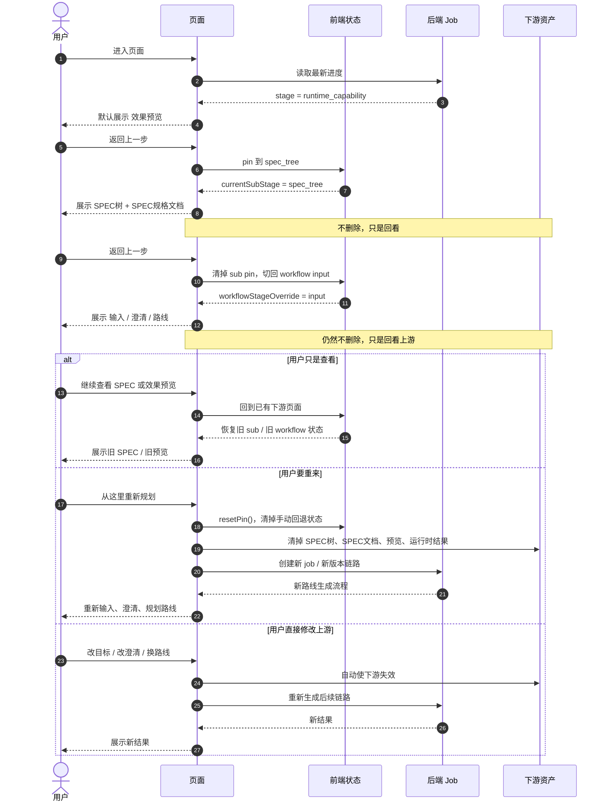
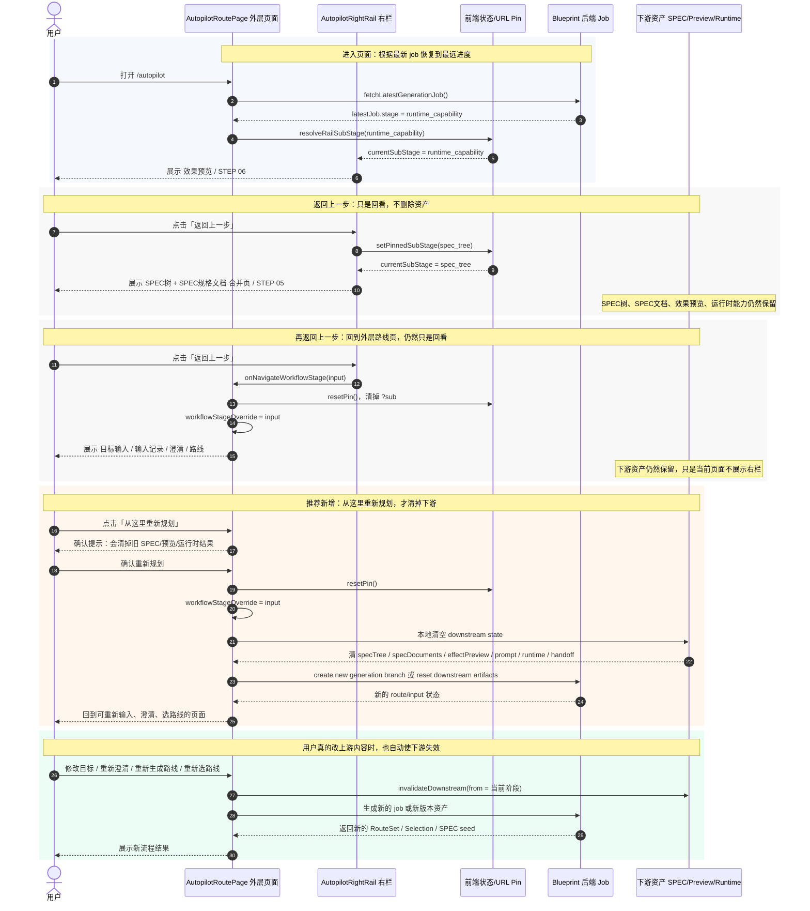

# Autopilot 返回逻辑时序图

生成时间：2026-05-23

对应 SVG：

- `docs/autopilot-return-navigation-page-level-2026-05-23.svg`
- `docs/autopilot-return-navigation-review-vs-replan-sequence-2026-05-23.svg`

这份 MD 不是只画“按钮点了之后去哪儿”，而是把完整语义拆清楚：

- `返回上一步`：回看上游页面，不删除旧 SPEC、旧预览、旧运行时结果。
- `从这里重新规划`：显式重来，清掉下游资产并创建新 job 或新版本链路。
- `用户直接修改上游`：例如改目标、重新澄清、换路线，也应自动使下游失效并重建。

页面层级应该按用户看到的页面来退，不应该按内部 STEP 数字来退：

```text
页面 3：效果预览 / 后续运行时结果
  -> 返回上一步
页面 2：SPEC 树 / SPEC 规格文档
  -> 返回上一步
页面 1：输入 / 澄清 / 路线
```

`STEP 04 SPEC TREE` 和 `STEP 05 SPEC DOCUMENTS` 在当前产品体验里是同一个 SPEC 合并页，所以不能把 `STEP 05 -> STEP 04` 当成一次有效页面回退。用户会感觉“点击了，但是还在同一页”。

## 时序图 1：产品语义完整分支

这张图只保留产品视角，重点回答：用户返回之后，到底是“回看”，还是“重来”。



## 时序图 2：当前实现参与方与推荐链路

这张图把真实参与方展开，方便对照代码查问题：`AutopilotRoutePage`、`AutopilotRightRail`、`URL Pin`、后端 job、下游资产。



## 页面级回退规则

| 当前用户看到的页面 | 点击返回上一步后 | 是否删除下游资产 | 原因 |
| --- | --- | --- | --- |
| 页面 3：效果预览 / 后续运行时结果 | 页面 2：SPEC 树 + SPEC 规格文档 | 否 | 用户只是回看规格产物 |
| 页面 2：SPEC 树 + SPEC 规格文档 | 页面 1：输入 / 澄清 / 路线 | 否 | 用户只是回看上游决策 |
| 页面 1：输入 / 澄清 / 路线 | 不再继续回退，或退出 Autopilot | 否 | 已经是 Autopilot 流程入口页 |
| 页面 1 点击「从这里重新规划」 | 留在页面 1 并开启新生成链路 | 是 | 这是显式重来动作 |
| 页面 1 直接修改目标 / 澄清 / 路线 | 留在页面 1 或进入新生成链路 | 是 | 上游发生变化，旧下游已经不可信 |

## 当前问题对应的修正点

旧逻辑容易出错的地方：

```text
STEP 06 effect_preview
  -> 返回
STEP 05 spec_documents
  -> 返回
STEP 04 spec_tree
```

这看起来像“按 STEP 回退”，但产品上 `STEP 04` 和 `STEP 05` 是同一个页面，所以第二次回退会显得没有动。

推荐修正为页面级回退：

```text
effect_preview / runtime_capability
  -> 返回
spec_documents + spec_tree 合并页
  -> 返回
input / clarification / route 页面
```

对应实现语义：

```text
effect_preview folded
  -> setPinnedSubStage(spec_tree)

spec_documents/spec_tree 合并页
  -> onNavigateWorkflowStage(input)
  -> resetPin()

input/clarification/route 页面
  -> 返回按钮禁用，或作为 Autopilot 流程入口
```

## 关键判断

`返回上一步` 不应该承担“重新生成”的职责。它只是导航回看。

如果用户想重新生成，应提供一个明确动作，例如：

```text
从这里重新规划
```

这个动作可以清理下游，并且最好有确认提示，因为它会丢弃旧的 SPEC、效果预览、运行时结果。
