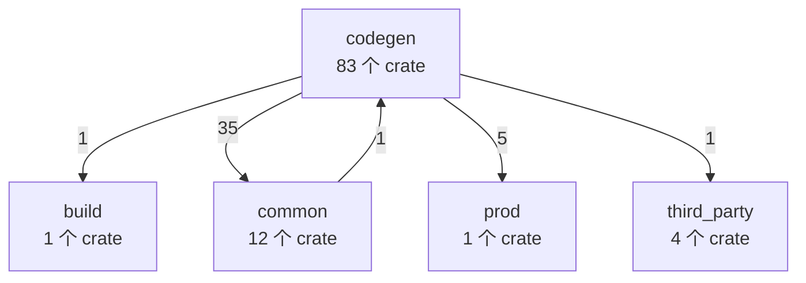
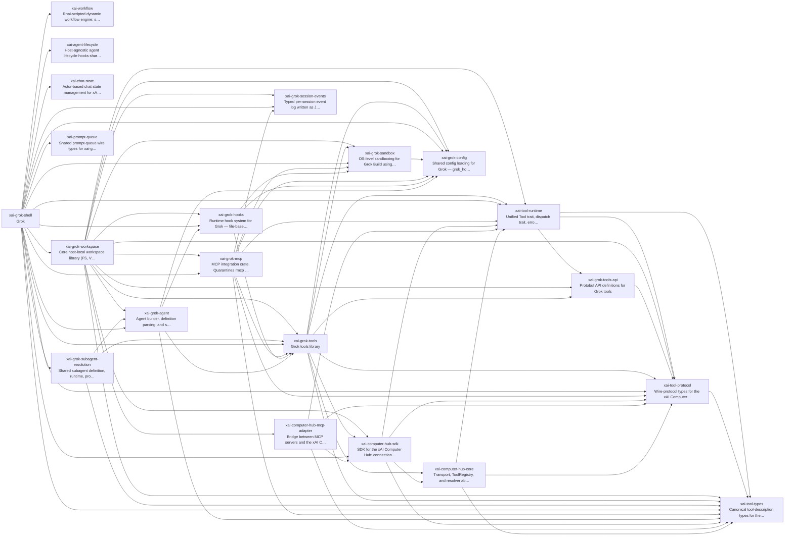
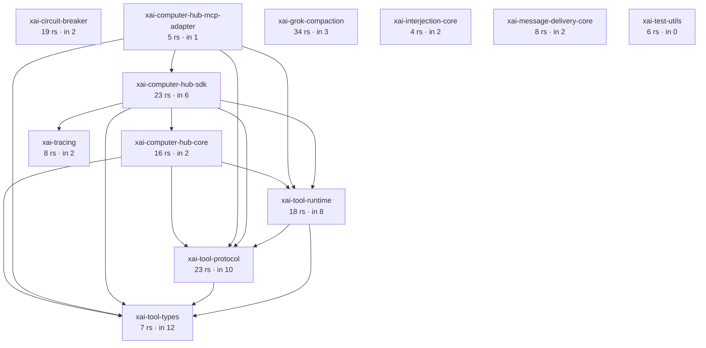
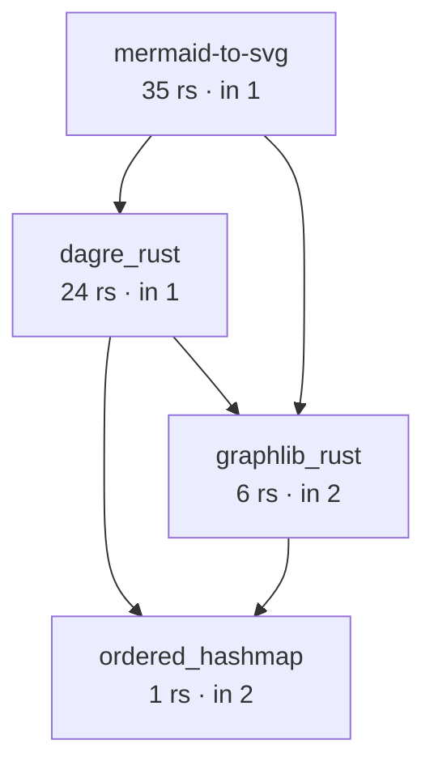

# grok-build 架构图（自动生成）

> ⚠ **这份文件是 `scripts/arch-graph-grok.py --emit` 生成的，别手改。**
> 边来自各 crate 的 `Cargo.toml`，本文件将声明画出，方便和 WhyBuddy 对照。
> grok-build 源码不进本仓。
> 模块用途、source LOC、叶子排行和 WhyBuddy 对照见 `docs/grok-build 模块总览（自动生成）.md`。

- 对照物路径：`C:\Users\wangchunji\Documents\grok-build`
- `SOURCE_REV`：`c4ea71cfdbcdb21e32e41bc25a0043d7d4836714`
- workspace members **101**，读到 crate **101**
- 内部运行时依赖边 **381**（含 build-dependencies，不含 dev-dependencies）
- crate 级循环依赖 **0** 个（Rust 编不过，应当是 0）

## 分层（目录就是层）

| 层 | crate 数 | .rs 文件 | 是什么 |
|---|---:|---:|---|
| `build` | 1 | 3 | 构建期：proto 代码生成 |
| `codegen` | 83 | 2867 | 产品：agent / tools / shell / pager / workspace |
| `common` | 12 | 171 | 跨产品叶子：tool-runtime / protocol / tracing / compaction |
| `prod` | 1 | 11 | 生产侧小包：cli-chat-proxy-types |
| `third_party` | 4 | 66 | vendor：mermaid 渲染、dagre、graphlib |

## 编排环（对照 WhyBuddy 时看这一张）

grok 的「魂」不在 pager 的 700 个 rs 文件里，在这一簇：
`AgentDefinition` → 闭集工具 → `xai-workflow` 脚本编排 → shell 会话。
`xai-workflow` 若画出零内部 crate 依赖，说明它是叶子引擎——脚本编排
不该反向依赖某个具体 Agent。

## 被依赖最多的 crate（叶子越往上越值钱）

| crate | 入度 | 出度 | .rs | 层 | 一句话 |
|---|---:|---:|---:|---|---|
| `xai-grok-config` | 21 | 5 | 30 | codegen | Shared config loading for Grok — grok_home, effective config (requirements > user > managed), TOML merge |
| `xai-tty-utils` | 19 | 0 | 12 | codegen | Lightweight process-spawning utilities for TTY safety — detach from controlling terminal, suppress interactive pagers, process-group lifecycle |
| `xai-grok-version` | 18 | 0 | 2 | codegen | Lockstepped grok CLI version. |
| `xai-dirs` | 17 | 0 | 1 | codegen | Home-directory resolution generally: USERPROFILE-first home_dir, plus grok-home ($GROK_HOME or <home>/.grok) |
| `xai-grok-extra-ca` | 14 | 0 | 9 | codegen | TLS policy for the grok CLI: rustls backend pin, process crypto provider, shared root store, and opt-in GROK_EXTRA_CA_BUNDLE roots |
| `xai-grok-tools` | 14 | 22 | 270 | codegen | Grok tools library |
| `xai-tool-types` | 12 | 0 | 7 | common | Canonical tool-description types for the xAI platform |
| `xai-grok-auth` | 10 | 0 | 5 | codegen | Auth dependency-inversion seam: HttpAuth + AuthCredentialProvider traits |
| `xai-grok-telemetry` | 10 | 14 | 59 | codegen | Telemetry engine: product events + Mixpanel emission + Sentry error reporting for Grok Build sessions |
| `xai-tool-protocol` | 10 | 1 | 23 | common | Wire-protocol types for the xAI Computer Hub |
| `xai-grok-env` | 8 | 0 | 2 | codegen | Backend environment for the Grok CLI crate family: endpoint URL presets, shared GROK_*/XAI_* readers, the credentials-path resolver, and the first-party credential list. |
| `xai-grok-sandbox` | 8 | 2 | 22 | codegen | OS-level sandboxing for Grok Build using kernel primitives (Landlock/Seatbelt) via nono |
| `xai-token-estimation` | 8 | 0 | 1 | codegen | Pure shared token-estimation primitives. |
| `xai-tool-runtime` | 8 | 3 | 18 | common | Unified Tool trait, dispatch trait, error taxonomy, notifications, and search index for the xAI Computer Hub |
| `xai-file-utils` | 7 | 7 | 11 | codegen | Local data collection: upload queueing and blob storage |

## 依赖别人最多的 crate（组合根 / 大块）

| crate | 出度 | 入度 | .rs | 层 |
|---|---:|---:|---:|---|
| `xai-grok-shell` | 58 | 4 | 633 | codegen |
| `xai-grok-pager` | 36 | 2 | 604 | codegen |
| `xai-grok-workspace` | 34 | 6 | 113 | codegen |
| `xai-grok-tools` | 22 | 14 | 270 | codegen |
| `xai-grok-pager-bin` | 15 | 0 | 2 | codegen |
| `xai-grok-telemetry` | 14 | 10 | 59 | codegen |
| `xai-grok-login` | 13 | 4 | 45 | codegen |
| `xai-grok-pager-render` | 12 | 1 | 79 | codegen |
| `xai-grok-mcp` | 11 | 3 | 18 | codegen |
| `xai-grok-agent` | 8 | 5 | 31 | codegen |
| `xai-file-utils` | 7 | 7 | 11 | codegen |
| `xai-grok-memory` | 7 | 2 | 25 | codegen |
| `xai-grok-shared` | 7 | 3 | 9 | codegen |
| `xai-grok-shell-base` | 7 | 2 | 13 | codegen |
| `xai-grok-shell-terminal` | 7 | 1 | 11 | codegen |

## 体积最大的 crate

形状不是均匀切小，是**两个巨石 + 一大批叶子**。巨石内部缠没关系，
叶子被 cargo 焊死不可能反过来依赖巨石。

| crate | .rs | 入度 | 出度 |
|---|---:|---:|---:|
| `xai-grok-shell` | 633 | 4 | 58 |
| `xai-grok-pager` | 604 | 2 | 36 |
| `xai-grok-pager-pty-harness` | 275 | 0 | 3 |
| `xai-grok-tools` | 270 | 14 | 22 |
| `xai-grok-workspace` | 113 | 6 | 34 |
| `xai-grok-pager-render` | 79 | 1 | 12 |
| `xai-fast-worktree` | 76 | 3 | 4 |
| `xai-grok-telemetry` | 59 | 10 | 14 |

## 叶子 crate（出度 0，谁都能安全依赖）

共 **42** 个：

`ordered_hashmap`, `prod-mc-cli-chat-proxy-types`, `ptyctl`, `xai-acp-lib`, `xai-agent-lifecycle`, `xai-circuit-breaker`, `xai-crash-handler`, `xai-dirs`, `xai-fsnotify`, `xai-fuzzy-file-search`, `xai-gix-status`, `xai-grok-auth`, `xai-grok-compaction`, `xai-grok-env`, `xai-grok-extra-ca`, `xai-grok-feedback`, `xai-grok-gboom`, `xai-grok-image`, `xai-grok-markdown-core`, `xai-grok-models`, `xai-grok-paths`, `xai-grok-secrets`, `xai-grok-session-events`, `xai-grok-status-line`, `xai-grok-version`, `xai-grok-workspace-types`, `xai-hooks-plugins-types`, `xai-interjection-core`, `xai-message-delivery-core`, `xai-prompt-queue`, `xai-proto-build`, `xai-ratatui-inline`, `xai-ratatui-textarea`, `xai-sqlite-journal`, `xai-system-power`, `xai-test-utils`, `xai-token-estimation`, `xai-tool-types`, `xai-tracing`, `xai-tracing-macros`, `xai-tty-utils`, `xai-workflow`

## 入度 0（没被其它 crate 依赖：组合根 / bin / 尚未挂上）

共 **4** 个：

`ptyctl-cli`, `xai-grok-pager-bin`, `xai-grok-pager-pty-harness`, `xai-test-utils`

## 循环依赖

（当前没有。这是 cargo 的底线，不是我们数出来的美德。）

## `common` 内部

## `third_party` 内部

## `codegen` 内部

codegen 成员太多，图上只保留入度最高的一批和体积 ≥200 rs 的巨石；完整名单见下表。

```mermaid
flowchart TB
  c_xai_acp_lib["xai-acp-lib<br/>8 rs · in 6"]
  c_xai_dirs["xai-dirs<br/>1 rs · in 17"]
  c_xai_fast_worktree["xai-fast-worktree<br/>76 rs · in 3"]
  c_xai_file_utils["xai-file-utils<br/>11 rs · in 7"]
  c_xai_grok_agent["xai-grok-agent<br/>31 rs · in 5"]
  c_xai_grok_announcements["xai-grok-announcements<br/>1 rs · in 3"]
  c_xai_grok_auth["xai-grok-auth<br/>5 rs · in 10"]
  c_xai_grok_config["xai-grok-config<br/>30 rs · in 21"]
  c_xai_grok_config_types["xai-grok-config-types<br/>8 rs · in 4"]
  c_xai_grok_env["xai-grok-env<br/>2 rs · in 8"]
  c_xai_grok_extra_ca["xai-grok-extra-ca<br/>9 rs · in 14"]
  c_xai_grok_feedback["xai-grok-feedback<br/>11 rs · in 3"]
  c_xai_grok_hooks["xai-grok-hooks<br/>15 rs · in 4"]
  c_xai_grok_http["xai-grok-http<br/>1 rs · in 4"]
  c_xai_grok_login["xai-grok-login<br/>45 rs · in 4"]
  c_xai_grok_mcp["xai-grok-mcp<br/>18 rs · in 3"]
  c_xai_grok_otel["xai-grok-otel<br/>8 rs · in 5"]
  c_xai_grok_pager["xai-grok-pager<br/>604 rs · in 2"]
  c_xai_grok_pager_pty_harness["xai-grok-pager-pty-harness<br/>275 rs · in 0"]
  c_xai_grok_paths["xai-grok-paths<br/>1 rs · in 5"]
  c_xai_grok_sampler["xai-grok-sampler<br/>40 rs · in 4"]
  c_xai_grok_sampling_types["xai-grok-sampling-types<br/>16 rs · in 6"]
  c_xai_grok_sandbox["xai-grok-sandbox<br/>22 rs · in 8"]
  c_xai_grok_secrets["xai-grok-secrets<br/>2 rs · in 3"]
  c_xai_grok_session_events["xai-grok-session-events<br/>4 rs · in 4"]
  c_xai_grok_shared["xai-grok-shared<br/>9 rs · in 3"]
  c_xai_grok_shell["xai-grok-shell<br/>633 rs · in 4"]
  c_xai_grok_status_line["xai-grok-status-line<br/>6 rs · in 3"]
  c_xai_grok_telemetry["xai-grok-telemetry<br/>59 rs · in 10"]
  c_xai_grok_tools["xai-grok-tools<br/>270 rs · in 14"]
  c_xai_grok_tools_api["xai-grok-tools-api<br/>5 rs · in 3"]
  c_xai_grok_version["xai-grok-version<br/>2 rs · in 18"]
  c_xai_grok_workspace["xai-grok-workspace<br/>113 rs · in 6"]
  c_xai_grok_workspace_types["xai-grok-workspace-types<br/>50 rs · in 4"]
  c_xai_hooks_plugins_types["xai-hooks-plugins-types<br/>1 rs · in 3"]
  c_xai_sqlite_journal["xai-sqlite-journal<br/>1 rs · in 5"]
  c_xai_token_estimation["xai-token-estimation<br/>1 rs · in 8"]
  c_xai_tty_utils["xai-tty-utils<br/>12 rs · in 19"]
  c_xai_fast_worktree --> c_xai_dirs
  c_xai_fast_worktree --> c_xai_sqlite_journal
  c_xai_fast_worktree --> c_xai_tty_utils
  c_xai_file_utils --> c_xai_dirs
  c_xai_file_utils --> c_xai_grok_auth
  c_xai_file_utils --> c_xai_grok_extra_ca
  c_xai_file_utils --> c_xai_grok_otel
  c_xai_file_utils --> c_xai_grok_version
  c_xai_grok_agent --> c_xai_dirs
  c_xai_grok_agent --> c_xai_grok_config
  c_xai_grok_agent --> c_xai_grok_hooks
  c_xai_grok_agent --> c_xai_grok_sampling_types
  c_xai_grok_agent --> c_xai_grok_tools
  c_xai_grok_agent --> c_xai_token_estimation
  c_xai_grok_agent --> c_xai_tty_utils
  c_xai_grok_announcements --> c_xai_grok_tools
  c_xai_grok_config --> c_xai_dirs
  c_xai_grok_config --> c_xai_grok_env
  c_xai_grok_config --> c_xai_grok_version
  c_xai_grok_config --> c_xai_tty_utils
  c_xai_grok_config_types --> c_xai_grok_announcements
  c_xai_grok_config_types --> c_xai_grok_config
  c_xai_grok_config_types --> c_xai_grok_mcp
  c_xai_grok_hooks --> c_xai_grok_config
  c_xai_grok_hooks --> c_xai_grok_extra_ca
  c_xai_grok_hooks --> c_xai_grok_sandbox
  c_xai_grok_hooks --> c_xai_grok_tools
  c_xai_grok_http --> c_xai_grok_auth
  c_xai_grok_http --> c_xai_grok_extra_ca
  c_xai_grok_http --> c_xai_grok_sampler
  c_xai_grok_http --> c_xai_grok_telemetry
  c_xai_grok_http --> c_xai_grok_version
  c_xai_grok_http --> c_xai_grok_workspace
  c_xai_grok_login --> c_xai_file_utils
  c_xai_grok_login --> c_xai_grok_auth
  c_xai_grok_login --> c_xai_grok_config
  c_xai_grok_login --> c_xai_grok_config_types
  c_xai_grok_login --> c_xai_grok_env
  c_xai_grok_login --> c_xai_grok_http
  c_xai_grok_login --> c_xai_grok_sampler
  c_xai_grok_login --> c_xai_grok_telemetry
  c_xai_grok_login --> c_xai_grok_tools
  c_xai_grok_login --> c_xai_grok_version
  c_xai_grok_mcp --> c_xai_grok_config
  c_xai_grok_mcp --> c_xai_grok_extra_ca
  c_xai_grok_mcp --> c_xai_grok_sandbox
  c_xai_grok_mcp --> c_xai_grok_session_events
  c_xai_grok_mcp --> c_xai_grok_telemetry
  c_xai_grok_mcp --> c_xai_grok_tools
  c_xai_grok_mcp --> c_xai_grok_version
  c_xai_grok_mcp --> c_xai_grok_workspace_types
  c_xai_grok_otel --> c_xai_grok_auth
  c_xai_grok_otel --> c_xai_grok_env
  c_xai_grok_otel --> c_xai_grok_extra_ca
  c_xai_grok_otel --> c_xai_grok_secrets
  c_xai_grok_pager --> c_xai_acp_lib
  c_xai_grok_pager --> c_xai_dirs
  c_xai_grok_pager --> c_xai_fast_worktree
  c_xai_grok_pager --> c_xai_file_utils
  c_xai_grok_pager --> c_xai_grok_agent
  c_xai_grok_pager --> c_xai_grok_announcements
  c_xai_grok_pager --> c_xai_grok_config
  c_xai_grok_pager --> c_xai_grok_feedback
  c_xai_grok_pager --> c_xai_grok_hooks
  c_xai_grok_pager --> c_xai_grok_login
  c_xai_grok_pager --> c_xai_grok_otel
  c_xai_grok_pager --> c_xai_grok_sandbox
  c_xai_grok_pager --> c_xai_grok_shell
  c_xai_grok_pager --> c_xai_grok_status_line
  c_xai_grok_pager --> c_xai_grok_telemetry
  c_xai_grok_pager --> c_xai_grok_tools
  c_xai_grok_pager --> c_xai_grok_version
  c_xai_grok_pager --> c_xai_grok_workspace
  c_xai_grok_pager --> c_xai_hooks_plugins_types
  c_xai_grok_pager --> c_xai_token_estimation
  c_xai_grok_pager --> c_xai_tty_utils
  c_xai_grok_pager_pty_harness --> c_xai_tty_utils
  c_xai_grok_sampler --> c_xai_grok_auth
  c_xai_grok_sampler --> c_xai_grok_extra_ca
  c_xai_grok_sampler --> c_xai_grok_sampling_types
  c_xai_grok_sampler --> c_xai_grok_version
  c_xai_grok_sandbox --> c_xai_dirs
  c_xai_grok_sandbox --> c_xai_grok_config
  c_xai_grok_shared --> c_xai_dirs
  c_xai_grok_shared --> c_xai_grok_config
  c_xai_grok_shared --> c_xai_grok_status_line
  c_xai_grok_shared --> c_xai_tty_utils
  c_xai_grok_shell --> c_xai_acp_lib
  c_xai_grok_shell --> c_xai_dirs
  c_xai_grok_shell --> c_xai_fast_worktree
  c_xai_grok_shell --> c_xai_file_utils
  c_xai_grok_shell --> c_xai_grok_agent
  c_xai_grok_shell --> c_xai_grok_announcements
  c_xai_grok_shell --> c_xai_grok_auth
  c_xai_grok_shell --> c_xai_grok_config
  c_xai_grok_shell --> c_xai_grok_config_types
  c_xai_grok_shell --> c_xai_grok_env
  c_xai_grok_shell --> c_xai_grok_extra_ca
  c_xai_grok_shell --> c_xai_grok_feedback
  c_xai_grok_shell --> c_xai_grok_hooks
  c_xai_grok_shell --> c_xai_grok_http
  c_xai_grok_shell --> c_xai_grok_login
  c_xai_grok_shell --> c_xai_grok_mcp
  c_xai_grok_shell --> c_xai_grok_otel
  c_xai_grok_shell --> c_xai_grok_paths
  c_xai_grok_shell --> c_xai_grok_sampler
  c_xai_grok_shell --> c_xai_grok_sampling_types
  c_xai_grok_shell --> c_xai_grok_sandbox
  c_xai_grok_shell --> c_xai_grok_session_events
  c_xai_grok_shell --> c_xai_grok_shared
  c_xai_grok_shell --> c_xai_grok_status_line
  c_xai_grok_shell --> c_xai_grok_telemetry
  c_xai_grok_shell --> c_xai_grok_tools
  c_xai_grok_shell --> c_xai_grok_version
  c_xai_grok_shell --> c_xai_grok_workspace
  c_xai_grok_shell --> c_xai_hooks_plugins_types
  c_xai_grok_shell --> c_xai_token_estimation
  c_xai_grok_shell --> c_xai_tty_utils
  c_xai_grok_telemetry --> c_xai_dirs
  c_xai_grok_telemetry --> c_xai_file_utils
  c_xai_grok_telemetry --> c_xai_grok_auth
  c_xai_grok_telemetry --> c_xai_grok_config
  c_xai_grok_telemetry --> c_xai_grok_env
  c_xai_grok_telemetry --> c_xai_grok_extra_ca
  c_xai_grok_telemetry --> c_xai_grok_otel
  c_xai_grok_telemetry --> c_xai_grok_sampler
  c_xai_grok_telemetry --> c_xai_grok_secrets
  c_xai_grok_telemetry --> c_xai_grok_session_events
  c_xai_grok_telemetry --> c_xai_grok_version
  c_xai_grok_telemetry --> c_xai_token_estimation
  c_xai_grok_telemetry --> c_xai_tty_utils
  c_xai_grok_tools --> c_xai_dirs
  c_xai_grok_tools --> c_xai_file_utils
  c_xai_grok_tools --> c_xai_grok_auth
  c_xai_grok_tools --> c_xai_grok_config
  c_xai_grok_tools --> c_xai_grok_env
  c_xai_grok_tools --> c_xai_grok_extra_ca
  c_xai_grok_tools --> c_xai_grok_feedback
  c_xai_grok_tools --> c_xai_grok_otel
  c_xai_grok_tools --> c_xai_grok_sandbox
  c_xai_grok_tools --> c_xai_grok_tools_api
  c_xai_grok_tools --> c_xai_grok_version
  c_xai_grok_tools --> c_xai_grok_workspace_types
  c_xai_grok_tools --> c_xai_token_estimation
  c_xai_grok_tools --> c_xai_tty_utils
  c_xai_grok_workspace --> c_xai_acp_lib
  c_xai_grok_workspace --> c_xai_dirs
  c_xai_grok_workspace --> c_xai_fast_worktree
  c_xai_grok_workspace --> c_xai_file_utils
  c_xai_grok_workspace --> c_xai_grok_agent
  c_xai_grok_workspace --> c_xai_grok_auth
  c_xai_grok_workspace --> c_xai_grok_config
  c_xai_grok_workspace --> c_xai_grok_config_types
  c_xai_grok_workspace --> c_xai_grok_env
  c_xai_grok_workspace --> c_xai_grok_extra_ca
  c_xai_grok_workspace --> c_xai_grok_hooks
  c_xai_grok_workspace --> c_xai_grok_mcp
  c_xai_grok_workspace --> c_xai_grok_paths
  c_xai_grok_workspace --> c_xai_grok_sandbox
  c_xai_grok_workspace --> c_xai_grok_session_events
  c_xai_grok_workspace --> c_xai_grok_telemetry
  c_xai_grok_workspace --> c_xai_grok_tools
  c_xai_grok_workspace --> c_xai_grok_tools_api
  c_xai_grok_workspace --> c_xai_grok_version
  c_xai_grok_workspace --> c_xai_grok_workspace_types
  c_xai_grok_workspace --> c_xai_tty_utils
```

## 全部 crate

| crate | 层 | .rs | 入度 | 出度 | 路径 | 一句话 |
|---|---|---:|---:|---:|---|---|
| `dagre_rust` | third_party | 24 | 1 | 2 | `third_party/dagre_rust` | Dagre layout in Rust (vendored, library-only) |
| `graphlib_rust` | third_party | 6 | 2 | 1 | `third_party/graphlib_rust` | Dagre's graphlib in Rust (vendored, library-only) |
| `mermaid-to-svg` | third_party | 35 | 1 | 2 | `third_party/mermaid-to-svg` | Convert Mermaid diagram source to SVG via a dagre layout port (vendored, library-only) |
| `ordered_hashmap` | third_party | 1 | 2 | 0 | `third_party/ordered_hashmap` | Ordered HashMap preserving insertion order (vendored, library-only) |
| `prod-mc-cli-chat-proxy-types` | prod | 11 | 5 | 0 | `prod/mc/cli-chat-proxy-types` | Lightweight request/response types for cli-chat-proxy API |
| `ptyctl` | codegen | 8 | 2 | 0 | `crates/codegen/ptyctl` | Headless PTY controller built on alacritty_terminal |
| `ptyctl-cli` | codegen | 6 | 0 | 1 | `crates/codegen/ptyctl-cli` | CLI for ptyctl headless PTY controller |
| `xai-acp-lib` | codegen | 8 | 6 | 0 | `crates/codegen/xai-acp-lib` | 根据 crate 名称和目录推断 |
| `xai-agent-lifecycle` | codegen | 15 | 1 | 0 | `crates/codegen/xai-agent-lifecycle` | Host-agnostic agent lifecycle hooks shared by multiple agent hosts (e.g. xai-grok-shell). |
| `xai-chat-state` | codegen | 18 | 1 | 4 | `crates/codegen/xai-chat-state` | Actor-based chat state management for xAI agents |
| `xai-circuit-breaker` | common | 19 | 2 | 0 | `crates/common/xai-circuit-breaker` | Shared circuit breaker. |
| `xai-codebase-graph` | codegen | 27 | 2 | 1 | `crates/codegen/xai-codebase-graph` | High-performance code graph generation using tree-sitter queries |
| `xai-compaction-transcript` | codegen | 1 | 2 | 1 | `crates/codegen/xai-compaction-transcript` | Markdown rendering of compacted conversation segments and the on-disk segment-store naming convention |
| `xai-computer-hub-core` | common | 16 | 2 | 3 | `crates/common/xai-computer-hub-core` | Transport, ToolRegistry, and resolver abstractions for the xAI Computer Hub |
| `xai-computer-hub-mcp-adapter` | common | 5 | 1 | 4 | `crates/common/xai-computer-hub-mcp-adapter` | Bridge between MCP servers and the xAI Computer Hub, registering MCP-discovered tools as native hub tools. |
| `xai-computer-hub-sdk` | common | 23 | 6 | 5 | `crates/common/xai-computer-hub-sdk` | SDK for the xAI Computer Hub: connection pool, transparent reconnect, tool harness, and tool-server runtime. |
| `xai-crash-handler` | codegen | 6 | 2 | 0 | `crates/codegen/xai-crash-handler` | Cross-platform crash handler (Unix signals + Windows SEH) with startup crash detection |
| `xai-dirs` | codegen | 1 | 17 | 0 | `crates/codegen/xai-dirs` | Home-directory resolution generally: USERPROFILE-first home_dir, plus grok-home ($GROK_HOME or <home>/.grok) |
| `xai-fast-worktree` | codegen | 76 | 3 | 4 | `crates/codegen/xai-fast-worktree` | High-performance git worktree creation using CoW cloning |
| `xai-file-utils` | codegen | 11 | 7 | 7 | `crates/codegen/xai-file-utils` | Local data collection: upload queueing and blob storage |
| `xai-fsnotify` | codegen | 19 | 2 | 0 | `crates/codegen/xai-fsnotify` | Local-filesystem event source: single causal stream of semantic FsEvents |
| `xai-fuzzy-file-search` | codegen | 1 | 1 | 0 | `crates/codegen/xai-fuzzy-file-search` | Fuzzy file search over a directory tree: an ignore-aware walker feeding a nucleo matcher, plus a background daemon |
| `xai-gix-status` | codegen | 1 | 2 | 0 | `crates/codegen/xai-gix-status` | Shared gix status helpers: thread budget under RLIMIT_NPROC so produce-worker spawn cannot abort under panic=abort |
| `xai-grok-active-sessions` | codegen | 2 | 2 | 1 | `crates/codegen/xai-grok-active-sessions` | Crash-recovery registry of open TUI sessions, stored as a lock-guarded JSON file under the grok home |
| `xai-grok-agent` | codegen | 31 | 5 | 8 | `crates/codegen/xai-grok-agent` | Agent builder, definition parsing, and system prompt assembly |
| `xai-grok-announcements` | codegen | 1 | 3 | 1 | `crates/codegen/xai-grok-announcements` | Shared announcement types, persistence, and formatting for Grok CLI apps |
| `xai-grok-auth` | codegen | 5 | 10 | 0 | `crates/codegen/xai-grok-auth` | Auth dependency-inversion seam: HttpAuth + AuthCredentialProvider traits |
| `xai-grok-bundle` | codegen | 1 | 1 | 2 | `crates/codegen/xai-grok-bundle` | Checksum-tracked on-disk cache for the published subagent bundle (personas, roles, agents, skills) |
| `xai-grok-compaction` | common | 34 | 3 | 0 | `crates/common/xai-grok-compaction` | Shared, transport-agnostic compaction engine for Grok chat and Grok Build. |
| `xai-grok-config` | codegen | 30 | 21 | 5 | `crates/codegen/xai-grok-config` | Shared config loading for Grok — grok_home, effective config (requirements > user > managed), TOML merge |
| `xai-grok-config-types` | codegen | 8 | 4 | 3 | `crates/codegen/xai-grok-config-types` | Leaf configuration value types for the grok CLI, extracted from xai-grok-shell for dependency inversion. |
| `xai-grok-dashboard-store` | codegen | 13 | 1 | 2 | `crates/codegen/xai-grok-dashboard-store` | SQLite-backed persistent dashboard workspace: membership, layout ranks, grouping |
| `xai-grok-diag-server` | codegen | 1 | 1 | 1 | `crates/codegen/xai-grok-diag-server` | In-guest diagnostics HTTP server (/ready, /statusz, /logs) for the standalone workspace-server |
| `xai-grok-env` | codegen | 2 | 8 | 0 | `crates/codegen/xai-grok-env` | Backend environment for the Grok CLI crate family: endpoint URL presets, shared GROK_*/XAI_* readers, the credentials-path resolver, and the first-party credential list. |
| `xai-grok-extra-ca` | codegen | 9 | 14 | 0 | `crates/codegen/xai-grok-extra-ca` | TLS policy for the grok CLI: rustls backend pin, process crypto provider, shared root store, and opt-in GROK_EXTRA_CA_BUNDLE roots |
| `xai-grok-feedback` | codegen | 11 | 3 | 0 | `crates/codegen/xai-grok-feedback` | Shared feedback taxonomy, durable local draft storage, and the session trace archive builder for Grok Build |
| `xai-grok-foreign-sessions` | codegen | 15 | 2 | 2 | `crates/codegen/xai-grok-foreign-sessions` | Bounded, metadata-only discovery of foreign coding-agent sessions |
| `xai-grok-gboom` | codegen | 4 | 2 | 0 | `crates/codegen/xai-grok-gboom` | The /gboom easter-egg raycaster game for the grok CLI pager |
| `xai-grok-hooks` | codegen | 15 | 4 | 4 | `crates/codegen/xai-grok-hooks` | Runtime hook system for Grok — file-based discovery, command execution, and policy enforcement |
| `xai-grok-http` | codegen | 1 | 4 | 6 | `crates/codegen/xai-grok-http` | Shared reqwest HTTP clients and User-Agent construction for the grok CLI. |
| `xai-grok-image` | codegen | 2 | 2 | 0 | `crates/codegen/xai-grok-image` | Image validation and transcoding shared by Grok tools and clients |
| `xai-grok-login` | codegen | 45 | 4 | 13 | `crates/codegen/xai-grok-login` | Authentication subsystem for the grok shell crate family: login flows, token refresh, credential providers, and auth storage. |
| `xai-grok-markdown` | codegen | 27 | 2 | 2 | `crates/codegen/xai-grok-markdown` | Streaming markdown renderer for terminal UIs |
| `xai-grok-markdown-core` | codegen | 1 | 1 | 0 | `crates/codegen/xai-grok-markdown-core` | Headless markdown analysis sharing Grok Build's exact pulldown-cmark config. |
| `xai-grok-mcp` | codegen | 18 | 3 | 11 | `crates/codegen/xai-grok-mcp` | MCP integration crate. Quarantines rmcp + reqwest 0.13 (rmcp 3.x requires reqwest >= 0.13.2 while the rest of the workspace uses reqwest 0.12) and owns the MCP credential store and OAuth flow orchestrator. |
| `xai-grok-memory` | codegen | 25 | 2 | 7 | `crates/codegen/xai-grok-memory` | Cross-session memory for Grok. |
| `xai-grok-mermaid` | codegen | 7 | 1 | 2 | `crates/codegen/xai-grok-mermaid` | Render Mermaid diagram source to a rasterized PNG behind a swappable engine trait |
| `xai-grok-models` | codegen | 1 | 2 | 0 | `crates/codegen/xai-grok-models` | Default model IDs for the grok CLI, loaded from the embedded default_models.json. |
| `xai-grok-otel` | codegen | 8 | 5 | 4 | `crates/codegen/xai-grok-otel` | OpenTelemetry foundation for Grok Build: W3C trace-context propagation, the OTLP HTTP client, and the tracing->OTLP span layer/provider |
| `xai-grok-pager` | codegen | 604 | 2 | 36 | `crates/codegen/xai-grok-pager` | xai-grok-pager |
| `xai-grok-pager-bin` | codegen | 2 | 0 | 15 | `crates/codegen/xai-grok-pager-bin` | 根据 crate 名称和目录推断 |
| `xai-grok-pager-diff` | codegen | 1 | 2 | 1 | `crates/codegen/xai-grok-pager-diff` | Diff hunk construction for the Grok Build TUI |
| `xai-grok-pager-minimal` | codegen | 12 | 1 | 6 | `crates/codegen/xai-grok-pager-minimal` | Minimal (scrollback-native) render mode: `grok --minimal`. |
| `xai-grok-pager-pty-harness` | codegen | 275 | 0 | 3 | `crates/codegen/xai-grok-pager-pty-harness` | Shared PTY harness + scenario library for xai-grok-pager e2e tests and benchmarks. |
| `xai-grok-pager-render` | codegen | 79 | 1 | 12 | `crates/codegen/xai-grok-pager-render` | 根据 crate 名称和目录推断 |
| `xai-grok-paths` | codegen | 1 | 5 | 0 | `crates/codegen/xai-grok-paths` | Type-safe path wrappers for absolute and relative UTF-8 paths |
| `xai-grok-plugin-marketplace` | codegen | 11 | 2 | 5 | `crates/codegen/xai-grok-plugin-marketplace` | Provides marketplace source configuration and plugin discovery, indexed with a filesystem fallback. |
| `xai-grok-sampler` | codegen | 40 | 4 | 4 | `crates/codegen/xai-grok-sampler` | Actor-based sampling/inference layer for xAI grok (HTTP streaming + retry, no shell coupling) |
| `xai-grok-sampling-types` | codegen | 16 | 6 | 3 | `crates/codegen/xai-grok-sampling-types` | Pure data types for the xAI sampling / chat-completion API layer |
| `xai-grok-sandbox` | codegen | 22 | 8 | 2 | `crates/codegen/xai-grok-sandbox` | OS-level sandboxing for Grok Build using kernel primitives (Landlock/Seatbelt) via nono |
| `xai-grok-secrets` | codegen | 2 | 3 | 0 | `crates/codegen/xai-grok-secrets` | Regex sanitizer for Grok Build outbound data (Sentry / Mixpanel / product-event scrubbing) |
| `xai-grok-session-events` | codegen | 4 | 4 | 0 | `crates/codegen/xai-grok-session-events` | Typed per-session event log written as JSON lines |
| `xai-grok-session-search` | codegen | 10 | 1 | 3 | `crates/codegen/xai-grok-session-search` | SQLite FTS5 index over local grok sessions: lease-guarded bootstrap, debounced incremental upserts, and BM25 ranked query |
| `xai-grok-shared` | codegen | 9 | 3 | 7 | `crates/codegen/xai-grok-shared` | Shared utilities used by both `xai-grok-shell` and its downstream clients (e.g. `xai-grok-pager-render`). |
| `xai-grok-shell` | codegen | 633 | 4 | 58 | `crates/codegen/xai-grok-shell` | Grok |
| `xai-grok-shell-base` | codegen | 13 | 2 | 7 | `crates/codegen/xai-grok-shell-base` | Foundation modules for the grok shell crate family: environment presets, CPU profiling, and process/filesystem utilities. |
| `xai-grok-shell-session-support` | codegen | 2 | 1 | 3 | `crates/codegen/xai-grok-shell-session-support` | Session-support modules for the grok shell crate family: managed MCP gateway catalog/call caching and file-access tracking. |
| `xai-grok-shell-terminal` | codegen | 11 | 1 | 7 | `crates/codegen/xai-grok-shell-terminal` | Local, ACP, and PTY terminal runners extracted from xai-grok-shell so they compile in parallel. |
| `xai-grok-status-line` | codegen | 6 | 3 | 0 | `crates/codegen/xai-grok-status-line` | The status-line contract: the `[ui.status_line]` config a user writes and the payload the agent sends clients. |
| `xai-grok-subagent-resolution` | codegen | 7 | 1 | 4 | `crates/codegen/xai-grok-subagent-resolution` | Shared subagent definition, runtime, prompt, and resume resolution |
| `xai-grok-telemetry` | codegen | 59 | 10 | 14 | `crates/codegen/xai-grok-telemetry` | Telemetry engine: product events + Mixpanel emission + Sentry error reporting for Grok Build sessions |
| `xai-grok-test-support` | codegen | 14 | 1 | 2 | `crates/codegen/xai-grok-test-support` | Shared test-support for grok-build crates: mock inference server, SSE generators, ACP stdio client, headless runner, env sandbox |
| `xai-grok-tools` | codegen | 270 | 14 | 22 | `crates/codegen/xai-grok-tools` | Grok tools library |
| `xai-grok-tools-api` | codegen | 5 | 3 | 2 | `crates/codegen/xai-grok-tools-api` | Protobuf API definitions for Grok tools |
| `xai-grok-update` | codegen | 16 | 2 | 7 | `crates/codegen/xai-grok-update` | 根据 crate 名称和目录推断 |
| `xai-grok-version` | codegen | 2 | 18 | 0 | `crates/codegen/xai-grok-version` | Lockstepped grok CLI version. |
| `xai-grok-voice` | codegen | 18 | 1 | 3 | `crates/codegen/xai-grok-voice` | Voice dictation (streaming STT) for Grok Build CLI |
| `xai-grok-workspace` | codegen | 113 | 6 | 34 | `crates/codegen/xai-grok-workspace` | Core host-local workspace library (FS, VCS, execution, discovery) for xai-grok-shell and remote sampler |
| `xai-grok-workspace-client` | codegen | 1 | 1 | 4 | `crates/codegen/xai-grok-workspace-client` | Lightweight typed client for hub-proxied workspace.* RPCs (shared by xai-grok-shell proxy mode and other consumers) |
| `xai-grok-workspace-daemon` | codegen | 3 | 1 | 2 | `crates/codegen/xai-grok-workspace-daemon` | Process lifecycle for the workspace-server daemon: self-daemonization, single-instance pidfile locking, and preview-proxy child supervision |
| `xai-grok-workspace-types` | codegen | 50 | 4 | 0 | `crates/codegen/xai-grok-workspace-types` | Wire types for the xAI workspace API (request/chunk/event enums shared by client and server) |
| `xai-hooks-plugins-types` | codegen | 1 | 3 | 0 | `crates/codegen/xai-hooks-plugins-types` | Shared DTO types for hooks/plugins ACP extensions (wire format only) |
| `xai-hunk-tracker` | codegen | 17 | 2 | 1 | `crates/codegen/xai-hunk-tracker` | Track file hunks (diffs) with agent/external attribution |
| `xai-interjection-core` | common | 4 | 2 | 0 | `crates/common/xai-interjection-core` | Shared mid-turn interjection buffer and formatting for the client and server agent loops |
| `xai-message-delivery-core` | common | 8 | 2 | 0 | `crates/common/xai-message-delivery-core` | Source-typed message delivery values and operation authorization. |
| `xai-mixpanel` | codegen | 1 | 1 | 1 | `crates/codegen/xai-mixpanel` | Lightweight Mixpanel HTTP tracking client (replaces mixpanel-rs to avoid pulling reqwest 0.11) |
| `xai-prompt-queue` | codegen | 3 | 2 | 0 | `crates/codegen/xai-prompt-queue` | Shared prompt-queue wire types for xai-grok-shell and xai-grok-pager |
| `xai-proto-build` | build | 3 | 1 | 0 | `crates/build/xai-proto-build` | Build protobuf |
| `xai-ratatui-inline` | codegen | 10 | 3 | 0 | `crates/codegen/xai-ratatui-inline` | ratatui-inline |
| `xai-ratatui-textarea` | codegen | 14 | 3 | 0 | `crates/codegen/xai-ratatui-textarea` | 根据 crate 名称和目录推断 |
| `xai-sqlite-journal` | codegen | 1 | 5 | 0 | `crates/codegen/xai-sqlite-journal` | Filesystem-aware SQLite journal-mode selection: WAL on local disks, rollback journal on network mounts where WAL's mmap'd -shm is unsafe |
| `xai-system-power` | codegen | 4 | 1 | 0 | `crates/codegen/xai-system-power` | Cross-platform system sleep/wake (suspend) notifications — used to defer work across a suspend boundary |
| `xai-test-utils` | common | 6 | 0 | 0 | `crates/common/xai-test-utils` | Shared test utilities: hermetic git, optional runfiles helpers |
| `xai-token-estimation` | codegen | 1 | 8 | 0 | `crates/codegen/xai-token-estimation` | Pure shared token-estimation primitives. |
| `xai-tool-protocol` | common | 23 | 10 | 1 | `crates/common/xai-tool-protocol` | Wire-protocol types for the xAI Computer Hub |
| `xai-tool-runtime` | common | 18 | 8 | 3 | `crates/common/xai-tool-runtime` | Unified Tool trait, dispatch trait, error taxonomy, notifications, and search index for the xAI Computer Hub |
| `xai-tool-types` | common | 7 | 12 | 0 | `crates/common/xai-tool-types` | Canonical tool-description types for the xAI platform |
| `xai-tracing` | common | 8 | 2 | 0 | `crates/common/xai-tracing` | 根据 crate 名称和目录推断 |
| `xai-tracing-macros` | codegen | 3 | 1 | 0 | `crates/codegen/xai-tracing-macros` | Tracing-based utility macros for timestamped logging and timing |
| `xai-tty-utils` | codegen | 12 | 19 | 0 | `crates/codegen/xai-tty-utils` | Lightweight process-spawning utilities for TTY safety — detach from controlling terminal, suppress interactive pagers, process-group lifecycle |
| `xai-workflow` | codegen | 8 | 1 | 0 | `crates/codegen/xai-workflow` | Rhai-scripted dynamic workflow engine: scripts orchestrate agents through a host channel |
