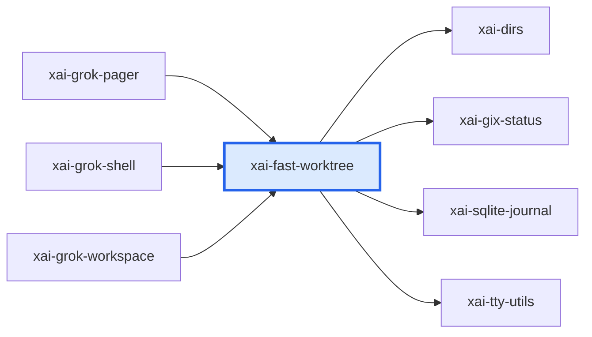

# xai-fast-worktree：模块详解

[返回十模块索引](README.md) · [返回全仓总览](../grok-build%20%E6%A8%A1%E5%9D%97%E6%80%BB%E8%A7%88%EF%BC%88%E8%87%AA%E5%8A%A8%E7%94%9F%E6%88%90%EF%BC%89.md)

> 自动统计 + 源码阅读说明。修改 scripts/grok-module-notes-*.json 中的解读，运行 `pnpm run arch:grok:details` 更新。

高性能 Git worktree 创建库。它结合 git worktree 元数据、并行 CoW 文件复制、BTRFS/overlay 快照、NFS、同步、自动 GC 和可选 SQLite 元数据，优化大仓库隔离副本的创建和复用。

## 源码版本与统计口径

- grok-build SOURCE_REV：`c4ea71cfdbcdb21e32e41bc25a0043d7d4836714`；解读审阅基于 `c4ea71cfdbcdb21e32e41bc25a0043d7d4836714`。
- Rust 源码及 Cargo.toml 指纹：`edaf75d2885088cc2bfbbaca8d11ba7b85241d709e8e508ed8abcea3d388edd0`。
- raw LOC 是物理行；source LOC 是去注释后的非空行，保留字符串内容。扫描全部 crate 下 .rs，排除 target/ 和 fuzz/，不展开 feature、宏或 include。
- 下表分类按路径互斥分桶；实现路径可能含 #[cfg(test)] 内嵌测试，不能把这一列当成纯生产代码。场景 YAML、提示词 Markdown、快照等非 Rust 资产另见下文。
- 依赖方向 A → B 表示 A 的 Cargo 清单依赖 B，含 build/target/optional 的静态并集，不含 dev-dependencies；不是运行时调用图。
- 调用链文字是源码阅读结果，引用检查只验证文件/符号存在。本次没有执行 grok 二进制、Rust 测试或浏览器业务验收。

| 类别 | .rs 文件 | source LOC | raw LOC |
|---|---|---|---|
| 实现路径（可含内嵌测试） | 62 | 26,223 | 31,552 |
| 独立测试路径 | 14 | 6,292 | 7,223 |
| 基准路径 | 0 | 0 | 0 |
| 示例路径 | 0 | 0 | 0 |
| 总计 | 76 | 32,515 | 38,775 |

## 职责边界

**本模块负责**

- 专注于文件副本和 worktree 池的底层效率；不管理 agent session、权限对话、浏览器或 TUI。xai-grok-workspace 在上层决定何时调用它。

## 入口与导出

| 类型 | 名称 | 真实入口 |
|---|---|---|
| library | `xai_fast_worktree` | [src/lib.rs](../../../grok-build/crates/codegen/xai-fast-worktree/src/lib.rs) |
| binary | `fast-worktree` | [src/bin/cli.rs](../../../grok-build/crates/codegen/xai-fast-worktree/src/bin/cli.rs) |
| binary / feature: bench | `pool-perf-bench` | [src/bin/pool_perf_bench.rs](../../../grok-build/crates/codegen/xai-fast-worktree/src/bin/pool_perf_bench.rs) |
| binary / feature: bench | `nfs-create-latency-bench` | [src/bin/nfs_create_latency_bench.rs](../../../grok-build/crates/codegen/xai-fast-worktree/src/bin/nfs_create_latency_bench.rs) |
| binary / feature: lifecycle-bench | `worktree-lifecycle-bench` | [src/bin/worktree_lifecycle_bench.rs](../../../grok-build/crates/codegen/xai-fast-worktree/src/bin/worktree_lifecycle_bench.rs) |

库入口的词法 `mod` 声明（可能受 cfg 控制）：`api`、`auto_gc`、`btrfs`、`copy`、`db`、`discovery`、`git`、`metrics`、`mount_info`、`nfs`、`nfs`、`overlay`、`sync`、`test_support`、`time`、`util`、`worktree`。

## 内部怎么拆：职责与源码

| 子系统 | 做什么 | 阅读入口 | 入口覆盖 .rs | source LOC | raw LOC |
|---|---|---|---|---|---|
| 公共 API | api.rs 暴露创建、清理和 GC 等主 API。 | [src/lib.rs](../../../grok-build/crates/codegen/xai-fast-worktree/src/lib.rs)；[src/api.rs](../../../grok-build/crates/codegen/xai-fast-worktree/src/api.rs)；[src/api/gc.rs](../../../grok-build/crates/codegen/xai-fast-worktree/src/api/gc.rs) | 1 | 106 | 117 |
| Worktree 执行 | worktree 模块及 execute.rs 组织 worktree 创建执行和结果。 | [src/worktree/mod.rs](../../../grok-build/crates/codegen/xai-fast-worktree/src/worktree/mod.rs)；[src/worktree/execute.rs](../../../grok-build/crates/codegen/xai-fast-worktree/src/worktree/execute.rs) | 1 | 1,381 | 1,858 |
| Git 元数据与 checkout | git 模块处理 git 命令、checkout 和 worktree 基础操作。 | [src/git/mod.rs](../../../grok-build/crates/codegen/xai-fast-worktree/src/git/mod.rs)；[src/git/checkout.rs](../../../grok-build/crates/codegen/xai-fast-worktree/src/git/checkout.rs) | 1 | 29 | 37 |
| 复制和 CoW | copy 模块提供文件复制策略，是并行 clone 的基础。 | [src/copy/mod.rs](../../../grok-build/crates/codegen/xai-fast-worktree/src/copy/mod.rs) | 1 | 13 | 16 |
| BTRFS 与 overlay 快照 | 针对 Linux CoW 文件系统提供快照能力与清理。 | [src/btrfs/mod.rs](../../../grok-build/crates/codegen/xai-fast-worktree/src/btrfs/mod.rs)；[src/overlay/mod.rs](../../../grok-build/crates/codegen/xai-fast-worktree/src/overlay/mod.rs) | 1 | 9 | 24 |
| NFS 客户端 | nfs 模块处理远程/网络文件系统上的创建和协调。 | [src/nfs/mod.rs](../../../grok-build/crates/codegen/xai-fast-worktree/src/nfs/mod.rs)；[src/nfs/client.rs](../../../grok-build/crates/codegen/xai-fast-worktree/src/nfs/client.rs) | 1 | 1,070 | 1,107 |
| 同步与 worktree 池 | sync 支持预创建 worktree 池的同步复用。 | [src/sync.rs](../../../grok-build/crates/codegen/xai-fast-worktree/src/sync.rs)；[src/discovery.rs](../../../grok-build/crates/codegen/xai-fast-worktree/src/discovery.rs) | 1 | 1,309 | 1,782 |
| 自动 GC 和数据库 | auto_gc 清理过期资源，db 保存可选元数据。 | [src/auto_gc.rs](../../../grok-build/crates/codegen/xai-fast-worktree/src/auto_gc.rs)；[src/db/mod.rs](../../../grok-build/crates/codegen/xai-fast-worktree/src/db/mod.rs) | 1 | 1,564 | 1,791 |
| 命令行和性能基准 | fast-worktree 和 lifecycle/perf benchmark 二进制用于运行及度量。 | [src/bin/cli.rs](../../../grok-build/crates/codegen/xai-fast-worktree/src/bin/cli.rs)；[src/bin/worktree_lifecycle_bench.rs](../../../grok-build/crates/codegen/xai-fast-worktree/src/bin/worktree_lifecycle_bench.rs)；[src/bin/pool_perf_bench.rs](../../../grok-build/crates/codegen/xai-fast-worktree/src/bin/pool_perf_bench.rs) | 1 | 156 | 214 |

上表行数仅覆盖该行首个阅读入口的文件/目录，入口可能重叠；下表按 src 一级目录及 tests/benches 等桶互斥统计，可以相加。

## 目录体积

| 目录桶 | .rs | source LOC | raw LOC | 其中独立测试 source LOC |
|---|---|---|---|---|
| src/（根文件） | 11 | 6,602 | 8,135 | 112 |
| src/git | 24 | 5,124 | 6,056 | 1,617 |
| src/bin | 6 | 4,901 | 5,476 | 1,101 |
| src/nfs | 7 | 4,376 | 4,607 | 0 |
| src/worktree | 3 | 3,064 | 3,981 | 0 |
| src/copy | 10 | 2,371 | 2,875 | 688 |
| src/api | 4 | 2,316 | 2,697 | 1,392 |
| src/db | 4 | 1,417 | 1,712 | 724 |
| src/btrfs | 3 | 1,078 | 1,462 | 0 |
| tests | 1 | 658 | 931 | 658 |
| src/overlay | 3 | 608 | 843 | 0 |

## 关键链路与源码阅读路径

### 阅读顺序：快速创建 worktree

1. 从 lib.rs 的 crate 注释和 api.rs 开始，确认 CoW clone 的公开承诺。
2. 读取 worktree/mod.rs 和 worktree/execute.rs，查看创建流程和执行边界。
3. 读取 git/checkout.rs 与 copy/mod.rs，确认元数据创建后如何完成文件内容。
4. 按部署文件系统条件阅读 btrfs/mod.rs、overlay/mod.rs 或 nfs/client.rs。

源码依据：[src/lib.rs](../../../grok-build/crates/codegen/xai-fast-worktree/src/lib.rs)；[src/api.rs](../../../grok-build/crates/codegen/xai-fast-worktree/src/api.rs)；[src/worktree/mod.rs](../../../grok-build/crates/codegen/xai-fast-worktree/src/worktree/mod.rs)；[src/worktree/execute.rs](../../../grok-build/crates/codegen/xai-fast-worktree/src/worktree/execute.rs)；[src/git/checkout.rs](../../../grok-build/crates/codegen/xai-fast-worktree/src/git/checkout.rs)；[src/copy/mod.rs](../../../grok-build/crates/codegen/xai-fast-worktree/src/copy/mod.rs)；[src/btrfs/mod.rs](../../../grok-build/crates/codegen/xai-fast-worktree/src/btrfs/mod.rs)；[src/overlay/mod.rs](../../../grok-build/crates/codegen/xai-fast-worktree/src/overlay/mod.rs)；[src/nfs/client.rs](../../../grok-build/crates/codegen/xai-fast-worktree/src/nfs/client.rs)。

### 阅读顺序：worktree 池和回收

1. 先读 sync.rs，了解预创建池如何同步复用。
2. 再读 auto_gc.rs，确认回收入口与候选判断。
3. 读取 db/mod.rs，了解可选元数据持久化。
4. 最后查看 lifecycle benchmark，理解作者用什么场景测量生命周期成本。

源码依据：[src/sync.rs](../../../grok-build/crates/codegen/xai-fast-worktree/src/sync.rs)；[src/auto_gc.rs](../../../grok-build/crates/codegen/xai-fast-worktree/src/auto_gc.rs)；[src/db/mod.rs](../../../grok-build/crates/codegen/xai-fast-worktree/src/db/mod.rs)；[src/bin/worktree_lifecycle_bench.rs](../../../grok-build/crates/codegen/xai-fast-worktree/src/bin/worktree_lifecycle_bench.rs)。

## 直接依赖与被依赖

图中的每条边都来自 Cargo 扫描；边界内的可选依赖可能仅在特定构建配置启用。

**本模块依赖（4）**

| crate | Cargo 用途/模块说明 |
|---|---|
| `xai-dirs` | Home-directory resolution generally: USERPROFILE-first home_dir, plus grok-home ($GROK_HOME or <home>/.grok) |
| `xai-gix-status` | Shared gix status helpers: thread budget under RLIMIT_NPROC so produce-worker spawn cannot abort under panic=abort |
| `xai-sqlite-journal` | Filesystem-aware SQLite journal-mode selection: WAL on local disks, rollback journal on network mounts where WAL's mmap'd -shm is unsafe |
| `xai-tty-utils` | Lightweight process-spawning utilities for TTY safety — detach from controlling terminal, suppress interactive pagers, process-group lifecycle |

**使用本模块（3）**

| crate | Cargo 用途/模块说明 |
|---|---|
| `xai-grok-pager` | xai-grok-pager |
| `xai-grok-shell` | Grok |
| `xai-grok-workspace` | Core host-local workspace library (FS, VCS, execution, discovery) for xai-grok-shell and remote sampler |

## 测试依据与非 Rust 资产

| 已有测试阅读入口 | 代码中覆盖的行为（本次未运行） |
|---|---|
| [src/api/gc/integration_tests.rs](../../../grok-build/crates/codegen/xai-fast-worktree/src/api/gc/integration_tests.rs) | 源内集成样例覆盖 GC API 相关行为。 |
| [src/bin/worktree_lifecycle_bench/tests.rs](../../../grok-build/crates/codegen/xai-fast-worktree/src/bin/worktree_lifecycle_bench/tests.rs) | 源内样例覆盖生命周期 benchmark 的场景设置。 |
| [src/worktree/execute.rs](../../../grok-build/crates/codegen/xai-fast-worktree/src/worktree/execute.rs) | 文件内测试/断言是理解执行边界的阅读入口。 |

| 独立测试文件 Top 8 | source LOC | raw LOC |
|---|---|---|
| [src/bin/worktree_lifecycle_bench/tests.rs](../../../grok-build/crates/codegen/xai-fast-worktree/src/bin/worktree_lifecycle_bench/tests.rs) | 1,101 | 1,155 |
| [src/api/gc/integration_tests.rs](../../../grok-build/crates/codegen/xai-fast-worktree/src/api/gc/integration_tests.rs) | 956 | 1,149 |
| [src/db/tests.rs](../../../grok-build/crates/codegen/xai-fast-worktree/src/db/tests.rs) | 724 | 863 |
| [src/copy/standalone_tests.rs](../../../grok-build/crates/codegen/xai-fast-worktree/src/copy/standalone_tests.rs) | 688 | 727 |
| [tests/overlay_integration.rs](../../../grok-build/crates/codegen/xai-fast-worktree/tests/overlay_integration.rs) | 658 | 931 |
| [src/api/gc/tests.rs](../../../grok-build/crates/codegen/xai-fast-worktree/src/api/gc/tests.rs) | 436 | 477 |
| [src/git/safety_tests/working_tree.rs](../../../grok-build/crates/codegen/xai-fast-worktree/src/git/safety_tests/working_tree.rs) | 424 | 458 |
| [src/git/safety_tests/conversions.rs](../../../grok-build/crates/codegen/xai-fast-worktree/src/git/safety_tests/conversions.rs) | 253 | 273 |

| 类型 | 文件数 | 示例（不计 Rust LOC） |
|---|---|---|
| .toml | 1 | [Cargo.toml](../../../grok-build/crates/codegen/xai-fast-worktree/Cargo.toml) |

## 对 WhyBuddy 可以怎么用

**快副本能力**：高频 agent 任务不必每次完整复制仓库。 WhyBuddy 只有在真实项目生成并发量上来后才需要接入；先复用 workspace 的正确隔离模型，再评估这个性能层。

依据：[src/lib.rs](../../../grok-build/crates/codegen/xai-fast-worktree/src/lib.rs)；[src/worktree/execute.rs](../../../grok-build/crates/codegen/xai-fast-worktree/src/worktree/execute.rs)。

**文件系统策略分层**：普通复制、BTRFS、overlay、NFS 分开实现。 WhyBuddy 的 sandbox 存储实现应按部署环境选择，不能把 Linux 快照假设写进通用业务链。

依据：[src/copy/mod.rs](../../../grok-build/crates/codegen/xai-fast-worktree/src/copy/mod.rs)；[src/btrfs/mod.rs](../../../grok-build/crates/codegen/xai-fast-worktree/src/btrfs/mod.rs)；[src/overlay/mod.rs](../../../grok-build/crates/codegen/xai-fast-worktree/src/overlay/mod.rs)；[src/nfs/client.rs](../../../grok-build/crates/codegen/xai-fast-worktree/src/nfs/client.rs)。

**工作池同步和 GC**：预热资源与回收策略在同一底层模块内闭环。 WhyBuddy 若维护 sandbox/worktree 池，需要独立的租约、回收和可观测性，不应交给前端页面。

依据：[src/sync.rs](../../../grok-build/crates/codegen/xai-fast-worktree/src/sync.rs)；[src/auto_gc.rs](../../../grok-build/crates/codegen/xai-fast-worktree/src/auto_gc.rs)；[src/db/mod.rs](../../../grok-build/crates/codegen/xai-fast-worktree/src/db/mod.rs)。

## 建议阅读顺序

1. [src/lib.rs](../../../grok-build/crates/codegen/xai-fast-worktree/src/lib.rs)：先读 crate 的 CoW clone 设计说明。
2. [src/api.rs](../../../grok-build/crates/codegen/xai-fast-worktree/src/api.rs)：确认对上层暴露的创建与清理 API。
3. [src/worktree/execute.rs](../../../grok-build/crates/codegen/xai-fast-worktree/src/worktree/execute.rs)：看实际 worktree 执行路径。
4. [src/git/checkout.rs](../../../grok-build/crates/codegen/xai-fast-worktree/src/git/checkout.rs)：看 git checkout 细节。
5. [src/sync.rs](../../../grok-build/crates/codegen/xai-fast-worktree/src/sync.rs)：看 worktree 池复用。
6. [src/auto_gc.rs](../../../grok-build/crates/codegen/xai-fast-worktree/src/auto_gc.rs)：看回收策略。

## 大文件与完整 Rust 清单

先看实现路径的 Top 15；它们仍可能带内嵌测试。下面的完整清单包含所有统计文件，方便继续拆到单个组件。

| 实现路径 Top 15 | source LOC | raw LOC |
|---|---|---|
| [src/api.rs](../../../grok-build/crates/codegen/xai-fast-worktree/src/api.rs) | 1,911 | 2,455 |
| [src/bin/worktree_lifecycle_bench.rs](../../../grok-build/crates/codegen/xai-fast-worktree/src/bin/worktree_lifecycle_bench.rs) | 1,721 | 1,854 |
| [src/auto_gc.rs](../../../grok-build/crates/codegen/xai-fast-worktree/src/auto_gc.rs) | 1,564 | 1,791 |
| [src/nfs/client.rs](../../../grok-build/crates/codegen/xai-fast-worktree/src/nfs/client.rs) | 1,545 | 1,684 |
| [src/worktree/execute.rs](../../../grok-build/crates/codegen/xai-fast-worktree/src/worktree/execute.rs) | 1,478 | 1,898 |
| [src/worktree/mod.rs](../../../grok-build/crates/codegen/xai-fast-worktree/src/worktree/mod.rs) | 1,381 | 1,858 |
| [src/sync.rs](../../../grok-build/crates/codegen/xai-fast-worktree/src/sync.rs) | 1,309 | 1,782 |
| [src/nfs/mod.rs](../../../grok-build/crates/codegen/xai-fast-worktree/src/nfs/mod.rs) | 1,070 | 1,107 |
| [src/git/checkout.rs](../../../grok-build/crates/codegen/xai-fast-worktree/src/git/checkout.rs) | 987 | 1,308 |
| [src/nfs/liveness.rs](../../../grok-build/crates/codegen/xai-fast-worktree/src/nfs/liveness.rs) | 927 | 947 |
| [src/discovery.rs](../../../grok-build/crates/codegen/xai-fast-worktree/src/discovery.rs) | 841 | 963 |
| [src/bin/worktree_lifecycle_bench/runtime.rs](../../../grok-build/crates/codegen/xai-fast-worktree/src/bin/worktree_lifecycle_bench/runtime.rs) | 834 | 911 |
| [src/btrfs/snapshot.rs](../../../grok-build/crates/codegen/xai-fast-worktree/src/btrfs/snapshot.rs) | 669 | 882 |
| [src/bin/pool_perf_bench.rs](../../../grok-build/crates/codegen/xai-fast-worktree/src/bin/pool_perf_bench.rs) | 639 | 808 |
| [src/api/gc.rs](../../../grok-build/crates/codegen/xai-fast-worktree/src/api/gc.rs) | 614 | 715 |

展开全部 76 个 Rust 文件

| 文件 | 类别 | source LOC | raw LOC |
|---|---|---|---|
| [src/api.rs](../../../grok-build/crates/codegen/xai-fast-worktree/src/api.rs) | 实现路径（可含内嵌测试） | 1,911 | 2,455 |
| [src/api/gc.rs](../../../grok-build/crates/codegen/xai-fast-worktree/src/api/gc.rs) | 实现路径（可含内嵌测试） | 614 | 715 |
| [src/api/gc/integration_tests.rs](../../../grok-build/crates/codegen/xai-fast-worktree/src/api/gc/integration_tests.rs) | 独立测试路径 | 956 | 1,149 |
| [src/api/gc/process_scan.rs](../../../grok-build/crates/codegen/xai-fast-worktree/src/api/gc/process_scan.rs) | 实现路径（可含内嵌测试） | 310 | 356 |
| [src/api/gc/tests.rs](../../../grok-build/crates/codegen/xai-fast-worktree/src/api/gc/tests.rs) | 独立测试路径 | 436 | 477 |
| [src/auto_gc.rs](../../../grok-build/crates/codegen/xai-fast-worktree/src/auto_gc.rs) | 实现路径（可含内嵌测试） | 1,564 | 1,791 |
| [src/bin/cli.rs](../../../grok-build/crates/codegen/xai-fast-worktree/src/bin/cli.rs) | 实现路径（可含内嵌测试） | 156 | 214 |
| [src/bin/nfs_create_latency_bench.rs](../../../grok-build/crates/codegen/xai-fast-worktree/src/bin/nfs_create_latency_bench.rs) | 实现路径（可含内嵌测试） | 450 | 534 |
| [src/bin/pool_perf_bench.rs](../../../grok-build/crates/codegen/xai-fast-worktree/src/bin/pool_perf_bench.rs) | 实现路径（可含内嵌测试） | 639 | 808 |
| [src/bin/worktree_lifecycle_bench.rs](../../../grok-build/crates/codegen/xai-fast-worktree/src/bin/worktree_lifecycle_bench.rs) | 实现路径（可含内嵌测试） | 1,721 | 1,854 |
| [src/bin/worktree_lifecycle_bench/runtime.rs](../../../grok-build/crates/codegen/xai-fast-worktree/src/bin/worktree_lifecycle_bench/runtime.rs) | 实现路径（可含内嵌测试） | 834 | 911 |
| [src/bin/worktree_lifecycle_bench/tests.rs](../../../grok-build/crates/codegen/xai-fast-worktree/src/bin/worktree_lifecycle_bench/tests.rs) | 独立测试路径 | 1,101 | 1,155 |
| [src/btrfs/detect.rs](../../../grok-build/crates/codegen/xai-fast-worktree/src/btrfs/detect.rs) | 实现路径（可含内嵌测试） | 400 | 556 |
| [src/btrfs/mod.rs](../../../grok-build/crates/codegen/xai-fast-worktree/src/btrfs/mod.rs) | 实现路径（可含内嵌测试） | 9 | 24 |
| [src/btrfs/snapshot.rs](../../../grok-build/crates/codegen/xai-fast-worktree/src/btrfs/snapshot.rs) | 实现路径（可含内嵌测试） | 669 | 882 |
| [src/copy/cow.rs](../../../grok-build/crates/codegen/xai-fast-worktree/src/copy/cow.rs) | 实现路径（可含内嵌测试） | 73 | 110 |
| [src/copy/engine.rs](../../../grok-build/crates/codegen/xai-fast-worktree/src/copy/engine.rs) | 实现路径（可含内嵌测试） | 317 | 433 |
| [src/copy/gitdir.rs](../../../grok-build/crates/codegen/xai-fast-worktree/src/copy/gitdir.rs) | 实现路径（可含内嵌测试） | 449 | 596 |
| [src/copy/mod.rs](../../../grok-build/crates/codegen/xai-fast-worktree/src/copy/mod.rs) | 实现路径（可含内嵌测试） | 13 | 16 |
| [src/copy/shard.rs](../../../grok-build/crates/codegen/xai-fast-worktree/src/copy/shard.rs) | 实现路径（可含内嵌测试） | 45 | 64 |
| [src/copy/skip.rs](../../../grok-build/crates/codegen/xai-fast-worktree/src/copy/skip.rs) | 实现路径（可含内嵌测试） | 81 | 110 |
| [src/copy/standalone.rs](../../../grok-build/crates/codegen/xai-fast-worktree/src/copy/standalone.rs) | 实现路径（可含内嵌测试） | 534 | 607 |
| [src/copy/standalone_tests.rs](../../../grok-build/crates/codegen/xai-fast-worktree/src/copy/standalone_tests.rs) | 独立测试路径 | 688 | 727 |
| [src/copy/types.rs](../../../grok-build/crates/codegen/xai-fast-worktree/src/copy/types.rs) | 实现路径（可含内嵌测试） | 52 | 77 |
| [src/copy/worker.rs](../../../grok-build/crates/codegen/xai-fast-worktree/src/copy/worker.rs) | 实现路径（可含内嵌测试） | 119 | 135 |
| [src/db/mod.rs](../../../grok-build/crates/codegen/xai-fast-worktree/src/db/mod.rs) | 实现路径（可含内嵌测试） | 433 | 554 |
| [src/db/queries.rs](../../../grok-build/crates/codegen/xai-fast-worktree/src/db/queries.rs) | 实现路径（可含内嵌测试） | 230 | 260 |
| [src/db/schema.rs](../../../grok-build/crates/codegen/xai-fast-worktree/src/db/schema.rs) | 实现路径（可含内嵌测试） | 30 | 35 |
| [src/db/tests.rs](../../../grok-build/crates/codegen/xai-fast-worktree/src/db/tests.rs) | 独立测试路径 | 724 | 863 |
| [src/discovery.rs](../../../grok-build/crates/codegen/xai-fast-worktree/src/discovery.rs) | 实现路径（可含内嵌测试） | 841 | 963 |
| [src/git/checkout.rs](../../../grok-build/crates/codegen/xai-fast-worktree/src/git/checkout.rs) | 实现路径（可含内嵌测试） | 987 | 1,308 |
| [src/git/dirs.rs](../../../grok-build/crates/codegen/xai-fast-worktree/src/git/dirs.rs) | 实现路径（可含内嵌测试） | 69 | 81 |
| [src/git/discovery.rs](../../../grok-build/crates/codegen/xai-fast-worktree/src/git/discovery.rs) | 实现路径（可含内嵌测试） | 81 | 117 |
| [src/git/index.rs](../../../grok-build/crates/codegen/xai-fast-worktree/src/git/index.rs) | 实现路径（可含内嵌测试） | 190 | 271 |
| [src/git/mod.rs](../../../grok-build/crates/codegen/xai-fast-worktree/src/git/mod.rs) | 实现路径（可含内嵌测试） | 29 | 37 |
| [src/git/probe.rs](../../../grok-build/crates/codegen/xai-fast-worktree/src/git/probe.rs) | 实现路径（可含内嵌测试） | 291 | 333 |
| [src/git/reason.rs](../../../grok-build/crates/codegen/xai-fast-worktree/src/git/reason.rs) | 实现路径（可含内嵌测试） | 61 | 65 |
| [src/git/reclaimed.rs](../../../grok-build/crates/codegen/xai-fast-worktree/src/git/reclaimed.rs) | 实现路径（可含内嵌测试） | 240 | 259 |
| [src/git/reclaimed_tests.rs](../../../grok-build/crates/codegen/xai-fast-worktree/src/git/reclaimed_tests.rs) | 独立测试路径 | 178 | 205 |
| [src/git/safety.rs](../../../grok-build/crates/codegen/xai-fast-worktree/src/git/safety.rs) | 实现路径（可含内嵌测试） | 283 | 328 |
| [src/git/safety/build_output.rs](../../../grok-build/crates/codegen/xai-fast-worktree/src/git/safety/build_output.rs) | 实现路径（可含内嵌测试） | 103 | 116 |
| [src/git/safety/conversions.rs](../../../grok-build/crates/codegen/xai-fast-worktree/src/git/safety/conversions.rs) | 实现路径（可含内嵌测试） | 109 | 124 |
| [src/git/safety/git_dir.rs](../../../grok-build/crates/codegen/xai-fast-worktree/src/git/safety/git_dir.rs) | 实现路径（可含内嵌测试） | 251 | 284 |
| [src/git/safety/reachability.rs](../../../grok-build/crates/codegen/xai-fast-worktree/src/git/safety/reachability.rs) | 实现路径（可含内嵌测试） | 241 | 255 |
| [src/git/safety/refs.rs](../../../grok-build/crates/codegen/xai-fast-worktree/src/git/safety/refs.rs) | 实现路径（可含内嵌测试） | 22 | 23 |
| [src/git/safety/working_tree.rs](../../../grok-build/crates/codegen/xai-fast-worktree/src/git/safety/working_tree.rs) | 实现路径（可含内嵌测试） | 150 | 158 |
| [src/git/safety_tests.rs](../../../grok-build/crates/codegen/xai-fast-worktree/src/git/safety_tests.rs) | 独立测试路径 | 123 | 137 |
| [src/git/safety_tests/conversions.rs](../../../grok-build/crates/codegen/xai-fast-worktree/src/git/safety_tests/conversions.rs) | 独立测试路径 | 253 | 273 |
| [src/git/safety_tests/gate.rs](../../../grok-build/crates/codegen/xai-fast-worktree/src/git/safety_tests/gate.rs) | 独立测试路径 | 222 | 246 |
| [src/git/safety_tests/git_dir.rs](../../../grok-build/crates/codegen/xai-fast-worktree/src/git/safety_tests/git_dir.rs) | 独立测试路径 | 213 | 242 |
| [src/git/safety_tests/reachability.rs](../../../grok-build/crates/codegen/xai-fast-worktree/src/git/safety_tests/reachability.rs) | 独立测试路径 | 204 | 230 |
| [src/git/safety_tests/working_tree.rs](../../../grok-build/crates/codegen/xai-fast-worktree/src/git/safety_tests/working_tree.rs) | 独立测试路径 | 424 | 458 |
| [src/git/status.rs](../../../grok-build/crates/codegen/xai-fast-worktree/src/git/status.rs) | 实现路径（可含内嵌测试） | 73 | 99 |
| [src/git/worktree.rs](../../../grok-build/crates/codegen/xai-fast-worktree/src/git/worktree.rs) | 实现路径（可含内嵌测试） | 327 | 407 |
| [src/lib.rs](../../../grok-build/crates/codegen/xai-fast-worktree/src/lib.rs) | 实现路径（可含内嵌测试） | 106 | 117 |
| [src/metrics.rs](../../../grok-build/crates/codegen/xai-fast-worktree/src/metrics.rs) | 实现路径（可含内嵌测试） | 141 | 160 |
| [src/mount_info.rs](../../../grok-build/crates/codegen/xai-fast-worktree/src/mount_info.rs) | 实现路径（可含内嵌测试） | 376 | 482 |
| [src/nfs/client.rs](../../../grok-build/crates/codegen/xai-fast-worktree/src/nfs/client.rs) | 实现路径（可含内嵌测试） | 1,545 | 1,684 |
| [src/nfs/confined.rs](../../../grok-build/crates/codegen/xai-fast-worktree/src/nfs/confined.rs) | 实现路径（可含内嵌测试） | 7 | 9 |
| [src/nfs/create_latency_stamp.rs](../../../grok-build/crates/codegen/xai-fast-worktree/src/nfs/create_latency_stamp.rs) | 实现路径（可含内嵌测试） | 76 | 90 |
| [src/nfs/liveness.rs](../../../grok-build/crates/codegen/xai-fast-worktree/src/nfs/liveness.rs) | 实现路径（可含内嵌测试） | 927 | 947 |
| [src/nfs/mod.rs](../../../grok-build/crates/codegen/xai-fast-worktree/src/nfs/mod.rs) | 实现路径（可含内嵌测试） | 1,070 | 1,107 |
| [src/nfs/mount_table.rs](../../../grok-build/crates/codegen/xai-fast-worktree/src/nfs/mount_table.rs) | 实现路径（可含内嵌测试） | 312 | 327 |
| [src/nfs/remove.rs](../../../grok-build/crates/codegen/xai-fast-worktree/src/nfs/remove.rs) | 实现路径（可含内嵌测试） | 439 | 443 |
| [src/nfs_stub.rs](../../../grok-build/crates/codegen/xai-fast-worktree/src/nfs_stub.rs) | 实现路径（可含内嵌测试） | 228 | 234 |
| [src/overlay/detect.rs](../../../grok-build/crates/codegen/xai-fast-worktree/src/overlay/detect.rs) | 实现路径（可含内嵌测试） | 112 | 154 |
| [src/overlay/mod.rs](../../../grok-build/crates/codegen/xai-fast-worktree/src/overlay/mod.rs) | 实现路径（可含内嵌测试） | 7 | 15 |
| [src/overlay/snapshot.rs](../../../grok-build/crates/codegen/xai-fast-worktree/src/overlay/snapshot.rs) | 实现路径（可含内嵌测试） | 489 | 674 |
| [src/sync.rs](../../../grok-build/crates/codegen/xai-fast-worktree/src/sync.rs) | 实现路径（可含内嵌测试） | 1,309 | 1,782 |
| [src/test_support.rs](../../../grok-build/crates/codegen/xai-fast-worktree/src/test_support.rs) | 独立测试路径 | 112 | 130 |
| [src/time.rs](../../../grok-build/crates/codegen/xai-fast-worktree/src/time.rs) | 实现路径（可含内嵌测试） | 8 | 14 |
| [src/util.rs](../../../grok-build/crates/codegen/xai-fast-worktree/src/util.rs) | 实现路径（可含内嵌测试） | 6 | 7 |
| [src/worktree/execute.rs](../../../grok-build/crates/codegen/xai-fast-worktree/src/worktree/execute.rs) | 实现路径（可含内嵌测试） | 1,478 | 1,898 |
| [src/worktree/mod.rs](../../../grok-build/crates/codegen/xai-fast-worktree/src/worktree/mod.rs) | 实现路径（可含内嵌测试） | 1,381 | 1,858 |
| [src/worktree/plan.rs](../../../grok-build/crates/codegen/xai-fast-worktree/src/worktree/plan.rs) | 实现路径（可含内嵌测试） | 205 | 225 |
| [tests/overlay_integration.rs](../../../grok-build/crates/codegen/xai-fast-worktree/tests/overlay_integration.rs) | 独立测试路径 | 658 | 931 |

解读维护源：[grok-module-notes-core.json](../../scripts/grok-module-notes-core.json)。
