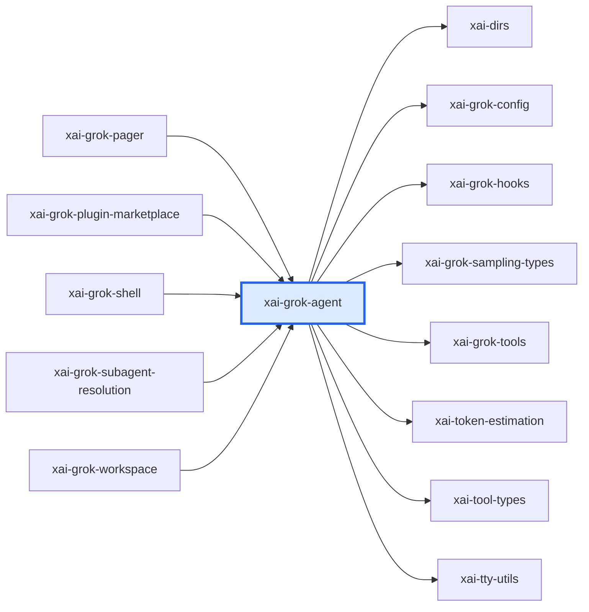

# xai-grok-agent：模块详解

[返回十模块索引](README.md) · [返回全仓总览](../grok-build%20%E6%A8%A1%E5%9D%97%E6%80%BB%E8%A7%88%EF%BC%88%E8%87%AA%E5%8A%A8%E7%94%9F%E6%88%90%EF%BC%89.md)

> 自动统计 + 源码阅读说明。修改 scripts/grok-module-notes-*.json 中的解读，运行 `pnpm run arch:grok:details` 更新。

可移植的 Agent 构建层。README 和 lib.rs 都明确：它把 tools、system prompt、system-reminder、compaction policy 与 model configuration 组装成任何 host 能消费的 Agent。

## 源码版本与统计口径

- grok-build SOURCE_REV：`c4ea71cfdbcdb21e32e41bc25a0043d7d4836714`；解读审阅基于 `c4ea71cfdbcdb21e32e41bc25a0043d7d4836714`。
- Rust 源码及 Cargo.toml 指纹：`609d99009fed2f3c38bb2492e3ff28dbf8414bb060fd2668bcf134b7ae4fc4c2`。
- raw LOC 是物理行；source LOC 是去注释后的非空行，保留字符串内容。扫描全部 crate 下 .rs，排除 target/ 和 fuzz/，不展开 feature、宏或 include。
- 下表分类按路径互斥分桶；实现路径可能含 #[cfg(test)] 内嵌测试，不能把这一列当成纯生产代码。场景 YAML、提示词 Markdown、快照等非 Rust 资产另见下文。
- 依赖方向 A → B 表示 A 的 Cargo 清单依赖 B，含 build/target/optional 的静态并集，不含 dev-dependencies；不是运行时调用图。
- 调用链文字是源码阅读结果，引用检查只验证文件/符号存在。本次没有执行 grok 二进制、Rust 测试或浏览器业务验收。

| 类别 | .rs 文件 | source LOC | raw LOC |
|---|---|---|---|
| 实现路径（可含内嵌测试） | 31 | 19,044 | 22,093 |
| 独立测试路径 | 0 | 0 | 0 |
| 基准路径 | 0 | 0 | 0 |
| 示例路径 | 0 | 0 | 0 |
| 总计 | 31 | 19,044 | 22,093 |

## 职责边界

**本模块负责**

- AgentDefinition 解析、发现和 builder
- system prompt/context、AGENTS.md、skills/persona 注入
- tool set、permission、memory、compaction、reminder 等构建策略

**协作边界**

- turn loop 与流式采样
- 工具执行
- TUI 或浏览器视图

## 入口与导出

| 类型 | 名称 | 真实入口 |
|---|---|---|
| library | `xai_grok_agent` | [src/lib.rs](../../../grok-build/crates/codegen/xai-grok-agent/src/lib.rs) |

库入口的词法 `mod` 声明（可能受 cfg 控制）：`agent`、`builder`、`compaction`、`config`、`discovery`、`error`、`plugins`、`prompt`、`repo`、`system_reminder`、`timing`。

## 内部怎么拆：职责与源码

| 子系统 | 做什么 | 阅读入口 | 入口覆盖 .rs | source LOC | raw LOC |
|---|---|---|---|---|---|
| src/config.rs | AgentDefinition、preset/toolset 和前置配置。 | [src/config.rs](../../../grok-build/crates/codegen/xai-grok-agent/src/config.rs) | 1 | 2,428 | 2,616 |
| src/discovery.rs | 发现 project/user agent definition。 | [src/discovery.rs](../../../grok-build/crates/codegen/xai-grok-agent/src/discovery.rs) | 1 | 1,291 | 1,533 |
| src/builder.rs | 按 definition 和 session backend 链式构建 Agent；plan mode 时确保 enter/exit/ask tools 进入工具集。 | [src/builder.rs](../../../grok-build/crates/codegen/xai-grok-agent/src/builder.rs) | 1 | 2,659 | 2,703 |
| src/agent.rs | 近乎不可变的已构建 Agent，暴露 prompt、ToolBridge、策略和 hosted tools。 | [src/agent.rs](../../../grok-build/crates/codegen/xai-grok-agent/src/agent.rs) | 1 | 132 | 213 |
| src/prompt/ | 模板、AGENTS.md、skills、browser verification、subagent/workspace user context。 | [src/prompt/](../../../grok-build/crates/codegen/xai-grok-agent/src/prompt) | 11 | 5,355 | 6,335 |
| src/plugins/ | plugin discovery、trust、marketplace、安装和 hooks adapter。 | [src/plugins/](../../../grok-build/crates/codegen/xai-grok-agent/src/plugins) | 10 | 6,841 | 8,225 |
| src/compaction.rs | Agent 所携带的压缩策略。 | [src/compaction.rs](../../../grok-build/crates/codegen/xai-grok-agent/src/compaction.rs) | 1 | 19 | 35 |
| src/system_reminder.rs | 会话系统提醒策略。 | [src/system_reminder.rs](../../../grok-build/crates/codegen/xai-grok-agent/src/system_reminder.rs) | 1 | 69 | 98 |

上表行数仅覆盖该行首个阅读入口的文件/目录，入口可能重叠；下表按 src 一级目录及 tests/benches 等桶互斥统计，可以相加。

## 目录体积

| 目录桶 | .rs | source LOC | raw LOC | 其中独立测试 source LOC |
|---|---|---|---|---|
| src/（根文件） | 10 | 6,848 | 7,533 | 0 |
| src/plugins | 10 | 6,841 | 8,225 | 0 |
| src/prompt | 11 | 5,355 | 6,335 | 0 |

## 关键链路与源码阅读路径

### 从定义文件到可运行 Agent

1. [AgentDefinition](../../../grok-build/crates/codegen/xai-grok-agent/src/config.rs#L685)：承载 frontmatter/预设/工具等定义值。
2. [AgentBuilder::from_definition](../../../grok-build/crates/codegen/xai-grok-agent/src/builder.rs#L241)：吸收定义并保留 host 注入的 terminal/fs/notification/session context。
3. [AgentBuilder::build](../../../grok-build/crates/codegen/xai-grok-agent/src/builder.rs#L553)：构造 ToolBridge、PromptContext、渲染 system prompt 和 session policies。
4. [Agent::tool_definitions](../../../grok-build/crates/codegen/xai-grok-agent/src/agent.rs#L140)：向采样 host 提供最终工具定义。

### 计划模式工具合同

1. [ensure_plan_mode_tools](../../../grok-build/crates/codegen/xai-grok-agent/src/builder.rs#L100)：检查工具集并补上 enter_plan_mode、exit_plan_mode、ask_user_question。
2. [Agent::tool_bridge](../../../grok-build/crates/codegen/xai-grok-agent/src/agent.rs#L100)：将最终 registry 暴露给会话运行时。

## 直接依赖与被依赖

图中的每条边都来自 Cargo 扫描；边界内的可选依赖可能仅在特定构建配置启用。

**本模块依赖（8）**

| crate | Cargo 用途/模块说明 |
|---|---|
| `xai-dirs` | Home-directory resolution generally: USERPROFILE-first home_dir, plus grok-home ($GROK_HOME or <home>/.grok) |
| `xai-grok-config` | Shared config loading for Grok — grok_home, effective config (requirements > user > managed), TOML merge |
| `xai-grok-hooks` | Runtime hook system for Grok — file-based discovery, command execution, and policy enforcement |
| `xai-grok-sampling-types` | Pure data types for the xAI sampling / chat-completion API layer |
| `xai-grok-tools` | Grok tools library |
| `xai-token-estimation` | Pure shared token-estimation primitives. |
| `xai-tool-types` | Canonical tool-description types for the xAI platform |
| `xai-tty-utils` | Lightweight process-spawning utilities for TTY safety — detach from controlling terminal, suppress interactive pagers, process-group lifecycle |

**使用本模块（5）**

| crate | Cargo 用途/模块说明 |
|---|---|
| `xai-grok-pager` | xai-grok-pager |
| `xai-grok-plugin-marketplace` | Provides marketplace source configuration and plugin discovery, indexed with a filesystem fallback. |
| `xai-grok-shell` | Grok |
| `xai-grok-subagent-resolution` | Shared subagent definition, runtime, prompt, and resume resolution |
| `xai-grok-workspace` | Core host-local workspace library (FS, VCS, execution, discovery) for xai-grok-shell and remote sampler |

## 测试依据与非 Rust 资产

| 独立测试文件 Top 8 | source LOC | raw LOC |
|---|---|---|

| 类型 | 文件数 | 示例（不计 Rust LOC） |
|---|---|---|
| .md | 4 | [README.md](../../../grok-build/crates/codegen/xai-grok-agent/README.md)；[templates/apply_patch_prompt.md](../../../grok-build/crates/codegen/xai-grok-agent/templates/apply_patch_prompt.md)；[templates/prompt.md](../../../grok-build/crates/codegen/xai-grok-agent/templates/prompt.md) |
| .toml | 1 | [Cargo.toml](../../../grok-build/crates/codegen/xai-grok-agent/Cargo.toml) |

## 对 WhyBuddy 可以怎么用

- 定义一个明确的 AgentBuildSpec/CapabilityPlan，集中 goal、可用工具、prompt、memory、permission、plan mode 和 browser verification 规则。
- 把 ask-user 和 exit-plan 作为控制面能力合同的一部分，后端注册、模型提示和 UI 消费共享同一个 schema。
- browser_verification 提示词应与真实 browser runtime/证据采集能力一起上线。

WhyBuddy 当前可对照的文件（路径存在不等于业务已经对齐）：

- [slide-rule-python/sliderule_llm/control_client.py](../../slide-rule-python/sliderule_llm/control_client.py)
- [slide-rule-python/services/rehearsal_control.py](../../slide-rule-python/services/rehearsal_control.py)
- [slide-rule-python/services/v5_session_driver.py](../../slide-rule-python/services/v5_session_driver.py)
- [client/src/pages/sliderule/QuestionnaireCard.tsx](../../client/src/pages/sliderule/QuestionnaireCard.tsx)
- [slide-rule-python/tests/test_control_ask_user_parks.py](../../slide-rule-python/tests/test_control_ask_user_parks.py)
- [slide-rule-python/tests/test_control_plan_approval.py](../../slide-rule-python/tests/test_control_plan_approval.py)

- WhyBuddy 当前 Python/TS 双端不能直接采用 Rust ToolBridge；可采用 JSON schema + Python capability registry + TS event types 的同一合同。
- 工具可用性必须由运行时能力决定，不能只在 prompt 里说有某工具。
- Agent 不是模型调用循环；把 session lifecycle 塞到这里会重复 shell 的职责。
- builder 的 with_* 参数很多，文档必须记录每项输入从哪里来、何时重建、谁可修改，否则恢复后会悄悄丢配置。
- prompt 中要求 browser verification 不能替代真实 sandbox、浏览器、console/network 证据。

## 建议阅读顺序

1. [src/config.rs](../../../grok-build/crates/codegen/xai-grok-agent/src/config.rs)：AgentDefinition、preset/toolset 和前置配置。
2. [src/discovery.rs](../../../grok-build/crates/codegen/xai-grok-agent/src/discovery.rs)：发现 project/user agent definition。
3. [src/builder.rs](../../../grok-build/crates/codegen/xai-grok-agent/src/builder.rs)：按 definition 和 session backend 链式构建 Agent；plan mode 时确保 enter/exit/ask tools 进入工具集。
4. [src/agent.rs](../../../grok-build/crates/codegen/xai-grok-agent/src/agent.rs)：近乎不可变的已构建 Agent，暴露 prompt、ToolBridge、策略和 hosted tools。
5. [src/prompt/](../../../grok-build/crates/codegen/xai-grok-agent/src/prompt)：模板、AGENTS.md、skills、browser verification、subagent/workspace user context。
6. [src/plugins/](../../../grok-build/crates/codegen/xai-grok-agent/src/plugins)：plugin discovery、trust、marketplace、安装和 hooks adapter。
7. [src/compaction.rs](../../../grok-build/crates/codegen/xai-grok-agent/src/compaction.rs)：Agent 所携带的压缩策略。

## 大文件与完整 Rust 清单

先看实现路径的 Top 15；它们仍可能带内嵌测试。下面的完整清单包含所有统计文件，方便继续拆到单个组件。

| 实现路径 Top 15 | source LOC | raw LOC |
|---|---|---|
| [src/builder.rs](../../../grok-build/crates/codegen/xai-grok-agent/src/builder.rs) | 2,659 | 2,703 |
| [src/config.rs](../../../grok-build/crates/codegen/xai-grok-agent/src/config.rs) | 2,428 | 2,616 |
| [src/prompt/skills.rs](../../../grok-build/crates/codegen/xai-grok-agent/src/prompt/skills.rs) | 2,208 | 2,681 |
| [src/plugins/discovery.rs](../../../grok-build/crates/codegen/xai-grok-agent/src/plugins/discovery.rs) | 1,518 | 1,815 |
| [src/plugins/git_install.rs](../../../grok-build/crates/codegen/xai-grok-agent/src/plugins/git_install.rs) | 1,340 | 1,544 |
| [src/discovery.rs](../../../grok-build/crates/codegen/xai-grok-agent/src/discovery.rs) | 1,291 | 1,533 |
| [src/prompt/agents_md.rs](../../../grok-build/crates/codegen/xai-grok-agent/src/prompt/agents_md.rs) | 972 | 1,121 |
| [src/prompt/context.rs](../../../grok-build/crates/codegen/xai-grok-agent/src/prompt/context.rs) | 945 | 1,015 |
| [src/plugins/registry.rs](../../../grok-build/crates/codegen/xai-grok-agent/src/plugins/registry.rs) | 922 | 1,176 |
| [src/plugins/manifest.rs](../../../grok-build/crates/codegen/xai-grok-agent/src/plugins/manifest.rs) | 708 | 822 |
| [src/plugins/local_refresh.rs](../../../grok-build/crates/codegen/xai-grok-agent/src/plugins/local_refresh.rs) | 656 | 791 |
| [src/prompt/template.rs](../../../grok-build/crates/codegen/xai-grok-agent/src/prompt/template.rs) | 621 | 746 |
| [src/plugins/install_registry.rs](../../../grok-build/crates/codegen/xai-grok-agent/src/plugins/install_registry.rs) | 563 | 686 |
| [src/plugins/hooks_adapter.rs](../../../grok-build/crates/codegen/xai-grok-agent/src/plugins/hooks_adapter.rs) | 462 | 549 |
| [src/prompt/user_message.rs](../../../grok-build/crates/codegen/xai-grok-agent/src/prompt/user_message.rs) | 433 | 515 |

展开全部 31 个 Rust 文件

| 文件 | 类别 | source LOC | raw LOC |
|---|---|---|---|
| [src/agent.rs](../../../grok-build/crates/codegen/xai-grok-agent/src/agent.rs) | 实现路径（可含内嵌测试） | 132 | 213 |
| [src/builder.rs](../../../grok-build/crates/codegen/xai-grok-agent/src/builder.rs) | 实现路径（可含内嵌测试） | 2,659 | 2,703 |
| [src/compaction.rs](../../../grok-build/crates/codegen/xai-grok-agent/src/compaction.rs) | 实现路径（可含内嵌测试） | 19 | 35 |
| [src/config.rs](../../../grok-build/crates/codegen/xai-grok-agent/src/config.rs) | 实现路径（可含内嵌测试） | 2,428 | 2,616 |
| [src/discovery.rs](../../../grok-build/crates/codegen/xai-grok-agent/src/discovery.rs) | 实现路径（可含内嵌测试） | 1,291 | 1,533 |
| [src/error.rs](../../../grok-build/crates/codegen/xai-grok-agent/src/error.rs) | 实现路径（可含内嵌测试） | 19 | 35 |
| [src/lib.rs](../../../grok-build/crates/codegen/xai-grok-agent/src/lib.rs) | 实现路径（可含内嵌测试） | 21 | 26 |
| [src/plugins/discovery.rs](../../../grok-build/crates/codegen/xai-grok-agent/src/plugins/discovery.rs) | 实现路径（可含内嵌测试） | 1,518 | 1,815 |
| [src/plugins/git_install.rs](../../../grok-build/crates/codegen/xai-grok-agent/src/plugins/git_install.rs) | 实现路径（可含内嵌测试） | 1,340 | 1,544 |
| [src/plugins/hooks_adapter.rs](../../../grok-build/crates/codegen/xai-grok-agent/src/plugins/hooks_adapter.rs) | 实现路径（可含内嵌测试） | 462 | 549 |
| [src/plugins/install_registry.rs](../../../grok-build/crates/codegen/xai-grok-agent/src/plugins/install_registry.rs) | 实现路径（可含内嵌测试） | 563 | 686 |
| [src/plugins/local_refresh.rs](../../../grok-build/crates/codegen/xai-grok-agent/src/plugins/local_refresh.rs) | 实现路径（可含内嵌测试） | 656 | 791 |
| [src/plugins/manifest.rs](../../../grok-build/crates/codegen/xai-grok-agent/src/plugins/manifest.rs) | 实现路径（可含内嵌测试） | 708 | 822 |
| [src/plugins/marketplace.rs](../../../grok-build/crates/codegen/xai-grok-agent/src/plugins/marketplace.rs) | 实现路径（可含内嵌测试） | 412 | 482 |
| [src/plugins/mod.rs](../../../grok-build/crates/codegen/xai-grok-agent/src/plugins/mod.rs) | 实现路径（可含内嵌测试） | 18 | 26 |
| [src/plugins/registry.rs](../../../grok-build/crates/codegen/xai-grok-agent/src/plugins/registry.rs) | 实现路径（可含内嵌测试） | 922 | 1,176 |
| [src/plugins/trust.rs](../../../grok-build/crates/codegen/xai-grok-agent/src/plugins/trust.rs) | 实现路径（可含内嵌测试） | 242 | 334 |
| [src/prompt/agents_md.rs](../../../grok-build/crates/codegen/xai-grok-agent/src/prompt/agents_md.rs) | 实现路径（可含内嵌测试） | 972 | 1,121 |
| [src/prompt/browser_verification.rs](../../../grok-build/crates/codegen/xai-grok-agent/src/prompt/browser_verification.rs) | 实现路径（可含内嵌测试） | 18 | 24 |
| [src/prompt/context.rs](../../../grok-build/crates/codegen/xai-grok-agent/src/prompt/context.rs) | 实现路径（可含内嵌测试） | 945 | 1,015 |
| [src/prompt/ignore.rs](../../../grok-build/crates/codegen/xai-grok-agent/src/prompt/ignore.rs) | 实现路径（可含内嵌测试） | 28 | 37 |
| [src/prompt/mod.rs](../../../grok-build/crates/codegen/xai-grok-agent/src/prompt/mod.rs) | 实现路径（可含内嵌测试） | 9 | 9 |
| [src/prompt/prompt_encrypted.rs](../../../grok-build/crates/codegen/xai-grok-agent/src/prompt/prompt_encrypted.rs) | 实现路径（可含内嵌测试） | 7 | 14 |
| [src/prompt/skills.rs](../../../grok-build/crates/codegen/xai-grok-agent/src/prompt/skills.rs) | 实现路径（可含内嵌测试） | 2,208 | 2,681 |
| [src/prompt/subagent_prompts.rs](../../../grok-build/crates/codegen/xai-grok-agent/src/prompt/subagent_prompts.rs) | 实现路径（可含内嵌测试） | 1 | 21 |
| [src/prompt/template.rs](../../../grok-build/crates/codegen/xai-grok-agent/src/prompt/template.rs) | 实现路径（可含内嵌测试） | 621 | 746 |
| [src/prompt/user_message.rs](../../../grok-build/crates/codegen/xai-grok-agent/src/prompt/user_message.rs) | 实现路径（可含内嵌测试） | 433 | 515 |
| [src/prompt/workspace_user.rs](../../../grok-build/crates/codegen/xai-grok-agent/src/prompt/workspace_user.rs) | 实现路径（可含内嵌测试） | 113 | 152 |
| [src/repo.rs](../../../grok-build/crates/codegen/xai-grok-agent/src/repo.rs) | 实现路径（可含内嵌测试） | 183 | 243 |
| [src/system_reminder.rs](../../../grok-build/crates/codegen/xai-grok-agent/src/system_reminder.rs) | 实现路径（可含内嵌测试） | 69 | 98 |
| [src/timing.rs](../../../grok-build/crates/codegen/xai-grok-agent/src/timing.rs) | 实现路径（可含内嵌测试） | 27 | 31 |

解读维护源：[grok-module-notes-ui.json](../../scripts/grok-module-notes-ui.json)。
