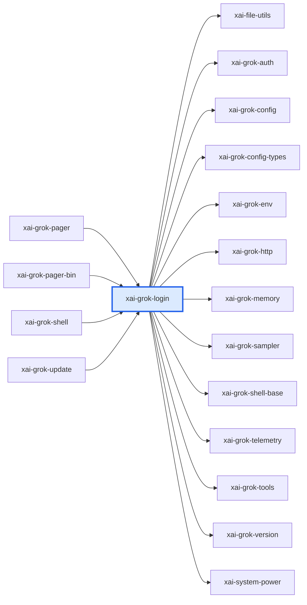

# xai-grok-login：模块详解

[返回十模块索引](README.md) · [返回全仓总览](../grok-build%20%E6%A8%A1%E5%9D%97%E6%80%BB%E8%A7%88%EF%BC%88%E8%87%AA%E5%8A%A8%E7%94%9F%E6%88%90%EF%BC%89.md)

> 自动统计 + 源码阅读说明。修改 scripts/grok-module-notes-*.json 中的解读，运行 `pnpm run arch:grok:details` 更新。

Grok shell 家族的认证子系统：管理登录流程、设备码/OIDC、token 刷新、凭证 provider、归因和认证存储。它从 shell 的旧 auth 模块拆出，并被 shell 重新导出以维持调用路径。

## 源码版本与统计口径

- grok-build SOURCE_REV：`c4ea71cfdbcdb21e32e41bc25a0043d7d4836714`；解读审阅基于 `c4ea71cfdbcdb21e32e41bc25a0043d7d4836714`。
- Rust 源码及 Cargo.toml 指纹：`fd7b13d8fd96915819c7f5a2e0a28fd9a4122590c29ec589676292b6012c82c3`。
- raw LOC 是物理行；source LOC 是去注释后的非空行，保留字符串内容。扫描全部 crate 下 .rs，排除 target/ 和 fuzz/，不展开 feature、宏或 include。
- 下表分类按路径互斥分桶；实现路径可能含 #[cfg(test)] 内嵌测试，不能把这一列当成纯生产代码。场景 YAML、提示词 Markdown、快照等非 Rust 资产另见下文。
- 依赖方向 A → B 表示 A 的 Cargo 清单依赖 B，含 build/target/optional 的静态并集，不含 dev-dependencies；不是运行时调用图。
- 调用链文字是源码阅读结果，引用检查只验证文件/符号存在。本次没有执行 grok 二进制、Rust 测试或浏览器业务验收。

| 类别 | .rs 文件 | source LOC | raw LOC |
|---|---|---|---|
| 实现路径（可含内嵌测试） | 37 | 15,433 | 18,129 |
| 独立测试路径 | 8 | 7,788 | 8,524 |
| 基准路径 | 0 | 0 | 0 |
| 示例路径 | 0 | 0 | 0 |
| 总计 | 45 | 23,221 | 26,653 |

## 职责边界

**本模块负责**

- 拥有认证状态、凭证与刷新流程；不拥有 TUI 登录页、agent 模型调用或 workspace 权限。Pager/shell 是它的调用者。

## 入口与导出

| 类型 | 名称 | 真实入口 |
|---|---|---|
| library | `xai_grok_login` | [src/lib.rs](../../../grok-build/crates/codegen/xai-grok-login/src/lib.rs) |

库入口的词法 `mod` 声明（可能受 cfg 控制）：`api_key_probe`、`attribution`、`auth_method`、`auth_provider`、`backend`、`config`、`credential_provider`、`device_code`、`error`、`external_auth`、`flow`、`grok_auth_credentials`、`jwt`、`manager`、`model`、`oidc`、`pre_tui`、`recovery`、`refresh`、`single_flight`、`storage`、`token_output`、`token_type`、`meta`。

## 内部怎么拆：职责与源码

| 子系统 | 做什么 | 阅读入口 | 入口覆盖 .rs | source LOC | raw LOC |
|---|---|---|---|---|---|
| 认证管理器 | manager 维护登录状态、账户/凭证选择与管理 API。 | [src/manager.rs](../../../grok-build/crates/codegen/xai-grok-login/src/manager.rs)；[src/manager_tests.rs](../../../grok-build/crates/codegen/xai-grok-login/src/manager_tests.rs)；[src/manager/refresh_chain.rs](../../../grok-build/crates/codegen/xai-grok-login/src/manager/refresh_chain.rs) | 1 | 1,657 | 1,948 |
| 登录流程 | flow 组织登录阶段，pre_tui 支持 TUI 前的认证，device_code 支持设备码。 | [src/flow.rs](../../../grok-build/crates/codegen/xai-grok-login/src/flow.rs)；[src/pre_tui.rs](../../../grok-build/crates/codegen/xai-grok-login/src/pre_tui.rs)；[src/device_code.rs](../../../grok-build/crates/codegen/xai-grok-login/src/device_code.rs) | 1 | 2,037 | 2,135 |
| OIDC 协议 | oidc/protocol 和 oidc/login 实现 OIDC 协议处理和登录步骤。 | [src/oidc/protocol.rs](../../../grok-build/crates/codegen/xai-grok-login/src/oidc/protocol.rs)；[src/oidc/login.rs](../../../grok-build/crates/codegen/xai-grok-login/src/oidc/login.rs)；[src/oidc/mod.rs](../../../grok-build/crates/codegen/xai-grok-login/src/oidc/mod.rs) | 1 | 1,224 | 1,273 |
| Token 刷新 | refresh 下分 OIDC 和外部刷新器，处理过期凭证续期。 | [src/refresh/mod.rs](../../../grok-build/crates/codegen/xai-grok-login/src/refresh/mod.rs)；[src/refresh/oidc_refresher.rs](../../../grok-build/crates/codegen/xai-grok-login/src/refresh/oidc_refresher.rs)；[src/refresh/external_refresher.rs](../../../grok-build/crates/codegen/xai-grok-login/src/refresh/external_refresher.rs) | 1 | 160 | 201 |
| 凭证 Provider | credential_provider 和 auth_provider 抽象凭证来源及认证提供方。 | [src/credential_provider.rs](../../../grok-build/crates/codegen/xai-grok-login/src/credential_provider.rs)；[src/auth_provider.rs](../../../grok-build/crates/codegen/xai-grok-login/src/auth_provider.rs)；[src/backend/mod.rs](../../../grok-build/crates/codegen/xai-grok-login/src/backend/mod.rs) | 1 | 1,015 | 1,257 |
| 配置与认证方式 | config、auth_method、model、grok_auth_credentials 表达认证配置和凭证模型。 | [src/config.rs](../../../grok-build/crates/codegen/xai-grok-login/src/config.rs)；[src/auth_method.rs](../../../grok-build/crates/codegen/xai-grok-login/src/auth_method.rs)；[src/model.rs](../../../grok-build/crates/codegen/xai-grok-login/src/model.rs)；[src/grok_auth_credentials.rs](../../../grok-build/crates/codegen/xai-grok-login/src/grok_auth_credentials.rs) | 1 | 460 | 527 |
| 恢复和归因 | recovery 处理认证恢复，attribution 管理归因信息，api_key_probe 探测 API key。 | [src/recovery.rs](../../../grok-build/crates/codegen/xai-grok-login/src/recovery.rs)；[src/attribution.rs](../../../grok-build/crates/codegen/xai-grok-login/src/attribution.rs)；[src/api_key_probe.rs](../../../grok-build/crates/codegen/xai-grok-login/src/api_key_probe.rs) | 1 | 895 | 973 |
| 并发保护与错误 | single_flight 避免同一认证刷新并发重复执行，error 统一失败类型。 | [src/single_flight.rs](../../../grok-build/crates/codegen/xai-grok-login/src/single_flight.rs)；[src/error.rs](../../../grok-build/crates/codegen/xai-grok-login/src/error.rs) | 1 | 277 | 345 |

上表行数仅覆盖该行首个阅读入口的文件/目录，入口可能重叠；下表按 src 一级目录及 tests/benches 等桶互斥统计，可以相加。

## 目录体积

| 目录桶 | .rs | source LOC | raw LOC | 其中独立测试 source LOC |
|---|---|---|---|---|
| src/（根文件） | 24 | 15,579 | 17,813 | 5,289 |
| src/manager | 9 | 2,790 | 3,257 | 902 |
| src/refresh | 5 | 2,551 | 3,042 | 1,477 |
| src/oidc | 5 | 2,183 | 2,389 | 120 |
| src/backend | 2 | 118 | 152 | 0 |

## 关键链路与源码阅读路径

### 阅读顺序：首次登录

1. 先读 flow.rs，获得登录阶段的总入口。
2. 按认证方式继续读 device_code.rs 或 oidc/login.rs。
3. 读 oidc/protocol.rs，确认协议层输入输出。
4. 再读 manager.rs，确认流程结果如何写入可用认证状态。

源码依据：[src/flow.rs](../../../grok-build/crates/codegen/xai-grok-login/src/flow.rs)；[src/device_code.rs](../../../grok-build/crates/codegen/xai-grok-login/src/device_code.rs)；[src/oidc/login.rs](../../../grok-build/crates/codegen/xai-grok-login/src/oidc/login.rs)；[src/oidc/protocol.rs](../../../grok-build/crates/codegen/xai-grok-login/src/oidc/protocol.rs)；[src/manager.rs](../../../grok-build/crates/codegen/xai-grok-login/src/manager.rs)。

### 阅读顺序：过期 token 刷新

1. 先读 manager.rs 了解刷新请求从管理层如何出现。
2. 读取 credential_provider.rs，确定凭证来源抽象。
3. 读取 refresh/mod.rs 以及 oidc_refresher.rs、external_refresher.rs。
4. 最后读 single_flight.rs，确认相同刷新不会被并发重复发起。

源码依据：[src/manager.rs](../../../grok-build/crates/codegen/xai-grok-login/src/manager.rs)；[src/credential_provider.rs](../../../grok-build/crates/codegen/xai-grok-login/src/credential_provider.rs)；[src/refresh/mod.rs](../../../grok-build/crates/codegen/xai-grok-login/src/refresh/mod.rs)；[src/refresh/oidc_refresher.rs](../../../grok-build/crates/codegen/xai-grok-login/src/refresh/oidc_refresher.rs)；[src/refresh/external_refresher.rs](../../../grok-build/crates/codegen/xai-grok-login/src/refresh/external_refresher.rs)；[src/single_flight.rs](../../../grok-build/crates/codegen/xai-grok-login/src/single_flight.rs)。

## 直接依赖与被依赖

图中的每条边都来自 Cargo 扫描；边界内的可选依赖可能仅在特定构建配置启用。

**本模块依赖（13）**

| crate | Cargo 用途/模块说明 |
|---|---|
| `xai-file-utils` | Local data collection: upload queueing and blob storage |
| `xai-grok-auth` | Auth dependency-inversion seam: HttpAuth + AuthCredentialProvider traits |
| `xai-grok-config` | Shared config loading for Grok — grok_home, effective config (requirements > user > managed), TOML merge |
| `xai-grok-config-types` | Leaf configuration value types for the grok CLI, extracted from xai-grok-shell for dependency inversion. |
| `xai-grok-env` | Backend environment for the Grok CLI crate family: endpoint URL presets, shared GROK_*/XAI_* readers, the credentials-path resolver, and the first-party credential list. |
| `xai-grok-http` | Shared reqwest HTTP clients and User-Agent construction for the grok CLI. |
| `xai-grok-memory` | Cross-session memory for Grok. |
| `xai-grok-sampler` | Actor-based sampling/inference layer for xAI grok (HTTP streaming + retry, no shell coupling) |
| `xai-grok-shell-base` | Foundation modules for the grok shell crate family: environment presets, CPU profiling, and process/filesystem utilities. |
| `xai-grok-telemetry` | Telemetry engine: product events + Mixpanel emission + Sentry error reporting for Grok Build sessions |
| `xai-grok-tools` | Grok tools library |
| `xai-grok-version` | Lockstepped grok CLI version. |
| `xai-system-power` | Cross-platform system sleep/wake (suspend) notifications — used to defer work across a suspend boundary |

**使用本模块（4）**

| crate | Cargo 用途/模块说明 |
|---|---|
| `xai-grok-pager` | xai-grok-pager |
| `xai-grok-pager-bin` | 根据 crate 名称和目录推断 |
| `xai-grok-shell` | Grok |
| `xai-grok-update` | 根据 crate 名称和目录推断 |

## 测试依据与非 Rust 资产

| 已有测试阅读入口 | 代码中覆盖的行为（本次未运行） |
|---|---|
| [src/manager_tests.rs](../../../grok-build/crates/codegen/xai-grok-login/src/manager_tests.rs) | 源内回归样例覆盖认证 manager 的状态和错误路径。 |
| [src/refresh/oidc_refresher_tests.rs](../../../grok-build/crates/codegen/xai-grok-login/src/refresh/oidc_refresher_tests.rs) | 源内回归样例覆盖 OIDC 刷新。 |
| [src/auth_provider_tests.rs](../../../grok-build/crates/codegen/xai-grok-login/src/auth_provider_tests.rs) | 源内回归样例覆盖认证 provider 行为。 |

| 独立测试文件 Top 8 | source LOC | raw LOC |
|---|---|---|
| [src/manager_tests.rs](../../../grok-build/crates/codegen/xai-grok-login/src/manager_tests.rs) | 4,521 | 4,743 |
| [src/refresh/oidc_refresher_tests.rs](../../../grok-build/crates/codegen/xai-grok-login/src/refresh/oidc_refresher_tests.rs) | 1,147 | 1,376 |
| [src/auth_provider_tests.rs](../../../grok-build/crates/codegen/xai-grok-login/src/auth_provider_tests.rs) | 768 | 857 |
| [src/manager/lock_tests.rs](../../../grok-build/crates/codegen/xai-grok-login/src/manager/lock_tests.rs) | 577 | 665 |
| [src/refresh/auth_backend_contract_tests.rs](../../../grok-build/crates/codegen/xai-grok-login/src/refresh/auth_backend_contract_tests.rs) | 330 | 387 |
| [src/manager/lock/flock_wait_tests.rs](../../../grok-build/crates/codegen/xai-grok-login/src/manager/lock/flock_wait_tests.rs) | 259 | 289 |
| [src/oidc/test_helpers.rs](../../../grok-build/crates/codegen/xai-grok-login/src/oidc/test_helpers.rs) | 120 | 128 |
| [src/manager/lock/flock_wait_loom_tests.rs](../../../grok-build/crates/codegen/xai-grok-login/src/manager/lock/flock_wait_loom_tests.rs) | 66 | 79 |

| 类型 | 文件数 | 示例（不计 Rust LOC） |
|---|---|---|
| .toml | 1 | [Cargo.toml](../../../grok-build/crates/codegen/xai-grok-login/Cargo.toml) |

## 对 WhyBuddy 可以怎么用

**认证流程和存储分离**：UI 登录动作与凭证存储/provider 可以独立替换。 WhyBuddy 当前账户体系可参考这一边界，但不需要复制 Grok 的 OIDC 实现。

依据：[src/flow.rs](../../../grok-build/crates/codegen/xai-grok-login/src/flow.rs)；[src/manager.rs](../../../grok-build/crates/codegen/xai-grok-login/src/manager.rs)；[src/credential_provider.rs](../../../grok-build/crates/codegen/xai-grok-login/src/credential_provider.rs)。

**single-flight 刷新**：同一过期凭证不会被并发请求触发多次刷新。 WhyBuddy 若接入外部 LLM、浏览器或发布 token，可用同一模式防止并发 refresh 风暴。

依据：[src/single_flight.rs](../../../grok-build/crates/codegen/xai-grok-login/src/single_flight.rs)；[src/refresh/mod.rs](../../../grok-build/crates/codegen/xai-grok-login/src/refresh/mod.rs)。

**认证方式显式建模**：API key、OIDC、外部 provider 由配置/模型区分。 WhyBuddy 可把本地/BYOK/服务端托管凭证建模为不同 provider，避免用前端条件分支混在一起。

依据：[src/auth_method.rs](../../../grok-build/crates/codegen/xai-grok-login/src/auth_method.rs)；[src/config.rs](../../../grok-build/crates/codegen/xai-grok-login/src/config.rs)；[src/model.rs](../../../grok-build/crates/codegen/xai-grok-login/src/model.rs)。

## 建议阅读顺序

1. [src/lib.rs](../../../grok-build/crates/codegen/xai-grok-login/src/lib.rs)：确认从 shell 拆出的认证边界。
2. [src/flow.rs](../../../grok-build/crates/codegen/xai-grok-login/src/flow.rs)：先读首次登录主流程。
3. [src/manager.rs](../../../grok-build/crates/codegen/xai-grok-login/src/manager.rs)：理解认证状态管理。
4. [src/credential_provider.rs](../../../grok-build/crates/codegen/xai-grok-login/src/credential_provider.rs)：理解凭证来源。
5. [src/refresh/mod.rs](../../../grok-build/crates/codegen/xai-grok-login/src/refresh/mod.rs)：理解刷新子系统。
6. [src/single_flight.rs](../../../grok-build/crates/codegen/xai-grok-login/src/single_flight.rs)：理解并发保护。

## 大文件与完整 Rust 清单

先看实现路径的 Top 15；它们仍可能带内嵌测试。下面的完整清单包含所有统计文件，方便继续拆到单个组件。

| 实现路径 Top 15 | source LOC | raw LOC |
|---|---|---|
| [src/flow.rs](../../../grok-build/crates/codegen/xai-grok-login/src/flow.rs) | 2,037 | 2,135 |
| [src/manager.rs](../../../grok-build/crates/codegen/xai-grok-login/src/manager.rs) | 1,657 | 1,948 |
| [src/oidc/protocol.rs](../../../grok-build/crates/codegen/xai-grok-login/src/oidc/protocol.rs) | 1,224 | 1,273 |
| [src/credential_provider.rs](../../../grok-build/crates/codegen/xai-grok-login/src/credential_provider.rs) | 1,015 | 1,257 |
| [src/recovery.rs](../../../grok-build/crates/codegen/xai-grok-login/src/recovery.rs) | 895 | 973 |
| [src/device_code.rs](../../../grok-build/crates/codegen/xai-grok-login/src/device_code.rs) | 692 | 838 |
| [src/refresh/external_refresher.rs](../../../grok-build/crates/codegen/xai-grok-login/src/refresh/external_refresher.rs) | 633 | 741 |
| [src/attribution.rs](../../../grok-build/crates/codegen/xai-grok-login/src/attribution.rs) | 621 | 875 |
| [src/oidc/login.rs](../../../grok-build/crates/codegen/xai-grok-login/src/oidc/login.rs) | 572 | 678 |
| [src/manager/lock.rs](../../../grok-build/crates/codegen/xai-grok-login/src/manager/lock.rs) | 510 | 593 |
| [src/storage.rs](../../../grok-build/crates/codegen/xai-grok-login/src/storage.rs) | 481 | 603 |
| [src/auth_provider.rs](../../../grok-build/crates/codegen/xai-grok-login/src/auth_provider.rs) | 473 | 592 |
| [src/config.rs](../../../grok-build/crates/codegen/xai-grok-login/src/config.rs) | 460 | 527 |
| [src/manager/remedy.rs](../../../grok-build/crates/codegen/xai-grok-login/src/manager/remedy.rs) | 444 | 490 |
| [src/model.rs](../../../grok-build/crates/codegen/xai-grok-login/src/model.rs) | 398 | 510 |

展开全部 45 个 Rust 文件

| 文件 | 类别 | source LOC | raw LOC |
|---|---|---|---|
| [src/api_key_probe.rs](../../../grok-build/crates/codegen/xai-grok-login/src/api_key_probe.rs) | 实现路径（可含内嵌测试） | 340 | 425 |
| [src/attribution.rs](../../../grok-build/crates/codegen/xai-grok-login/src/attribution.rs) | 实现路径（可含内嵌测试） | 621 | 875 |
| [src/auth_method.rs](../../../grok-build/crates/codegen/xai-grok-login/src/auth_method.rs) | 实现路径（可含内嵌测试） | 8 | 27 |
| [src/auth_provider.rs](../../../grok-build/crates/codegen/xai-grok-login/src/auth_provider.rs) | 实现路径（可含内嵌测试） | 473 | 592 |
| [src/auth_provider_tests.rs](../../../grok-build/crates/codegen/xai-grok-login/src/auth_provider_tests.rs) | 独立测试路径 | 768 | 857 |
| [src/backend/grok.rs](../../../grok-build/crates/codegen/xai-grok-login/src/backend/grok.rs) | 实现路径（可含内嵌测试） | 66 | 83 |
| [src/backend/mod.rs](../../../grok-build/crates/codegen/xai-grok-login/src/backend/mod.rs) | 实现路径（可含内嵌测试） | 52 | 69 |
| [src/config.rs](../../../grok-build/crates/codegen/xai-grok-login/src/config.rs) | 实现路径（可含内嵌测试） | 460 | 527 |
| [src/credential_provider.rs](../../../grok-build/crates/codegen/xai-grok-login/src/credential_provider.rs) | 实现路径（可含内嵌测试） | 1,015 | 1,257 |
| [src/device_code.rs](../../../grok-build/crates/codegen/xai-grok-login/src/device_code.rs) | 实现路径（可含内嵌测试） | 692 | 838 |
| [src/error.rs](../../../grok-build/crates/codegen/xai-grok-login/src/error.rs) | 实现路径（可含内嵌测试） | 106 | 164 |
| [src/external_auth.rs](../../../grok-build/crates/codegen/xai-grok-login/src/external_auth.rs) | 实现路径（可含内嵌测试） | 213 | 252 |
| [src/flow.rs](../../../grok-build/crates/codegen/xai-grok-login/src/flow.rs) | 实现路径（可含内嵌测试） | 2,037 | 2,135 |
| [src/grok_auth_credentials.rs](../../../grok-build/crates/codegen/xai-grok-login/src/grok_auth_credentials.rs) | 实现路径（可含内嵌测试） | 157 | 169 |
| [src/jwt.rs](../../../grok-build/crates/codegen/xai-grok-login/src/jwt.rs) | 实现路径（可含内嵌测试） | 34 | 44 |
| [src/lib.rs](../../../grok-build/crates/codegen/xai-grok-login/src/lib.rs) | 实现路径（可含内嵌测试） | 71 | 75 |
| [src/manager.rs](../../../grok-build/crates/codegen/xai-grok-login/src/manager.rs) | 实现路径（可含内嵌测试） | 1,657 | 1,948 |
| [src/manager/enrichment.rs](../../../grok-build/crates/codegen/xai-grok-login/src/manager/enrichment.rs) | 实现路径（可含内嵌测试） | 230 | 257 |
| [src/manager/lock.rs](../../../grok-build/crates/codegen/xai-grok-login/src/manager/lock.rs) | 实现路径（可含内嵌测试） | 510 | 593 |
| [src/manager/lock/flock_wait.rs](../../../grok-build/crates/codegen/xai-grok-login/src/manager/lock/flock_wait.rs) | 实现路径（可含内嵌测试） | 113 | 144 |
| [src/manager/lock/flock_wait_loom_tests.rs](../../../grok-build/crates/codegen/xai-grok-login/src/manager/lock/flock_wait_loom_tests.rs) | 独立测试路径 | 66 | 79 |
| [src/manager/lock/flock_wait_tests.rs](../../../grok-build/crates/codegen/xai-grok-login/src/manager/lock/flock_wait_tests.rs) | 独立测试路径 | 259 | 289 |
| [src/manager/lock_tests.rs](../../../grok-build/crates/codegen/xai-grok-login/src/manager/lock_tests.rs) | 独立测试路径 | 577 | 665 |
| [src/manager/refresh_chain.rs](../../../grok-build/crates/codegen/xai-grok-login/src/manager/refresh_chain.rs) | 实现路径（可含内嵌测试） | 355 | 401 |
| [src/manager/remedy.rs](../../../grok-build/crates/codegen/xai-grok-login/src/manager/remedy.rs) | 实现路径（可含内嵌测试） | 444 | 490 |
| [src/manager/sleep_gate.rs](../../../grok-build/crates/codegen/xai-grok-login/src/manager/sleep_gate.rs) | 实现路径（可含内嵌测试） | 236 | 339 |
| [src/manager_tests.rs](../../../grok-build/crates/codegen/xai-grok-login/src/manager_tests.rs) | 独立测试路径 | 4,521 | 4,743 |
| [src/meta.rs](../../../grok-build/crates/codegen/xai-grok-login/src/meta.rs) | 实现路径（可含内嵌测试） | 51 | 61 |
| [src/model.rs](../../../grok-build/crates/codegen/xai-grok-login/src/model.rs) | 实现路径（可含内嵌测试） | 398 | 510 |
| [src/oidc/login.rs](../../../grok-build/crates/codegen/xai-grok-login/src/oidc/login.rs) | 实现路径（可含内嵌测试） | 572 | 678 |
| [src/oidc/mod.rs](../../../grok-build/crates/codegen/xai-grok-login/src/oidc/mod.rs) | 实现路径（可含内嵌测试） | 11 | 11 |
| [src/oidc/protocol.rs](../../../grok-build/crates/codegen/xai-grok-login/src/oidc/protocol.rs) | 实现路径（可含内嵌测试） | 1,224 | 1,273 |
| [src/oidc/refresh.rs](../../../grok-build/crates/codegen/xai-grok-login/src/oidc/refresh.rs) | 实现路径（可含内嵌测试） | 256 | 299 |
| [src/oidc/test_helpers.rs](../../../grok-build/crates/codegen/xai-grok-login/src/oidc/test_helpers.rs) | 独立测试路径 | 120 | 128 |
| [src/pre_tui.rs](../../../grok-build/crates/codegen/xai-grok-login/src/pre_tui.rs) | 实现路径（可含内嵌测试） | 146 | 184 |
| [src/recovery.rs](../../../grok-build/crates/codegen/xai-grok-login/src/recovery.rs) | 实现路径（可含内嵌测试） | 895 | 973 |
| [src/refresh/auth_backend_contract_tests.rs](../../../grok-build/crates/codegen/xai-grok-login/src/refresh/auth_backend_contract_tests.rs) | 独立测试路径 | 330 | 387 |
| [src/refresh/external_refresher.rs](../../../grok-build/crates/codegen/xai-grok-login/src/refresh/external_refresher.rs) | 实现路径（可含内嵌测试） | 633 | 741 |
| [src/refresh/mod.rs](../../../grok-build/crates/codegen/xai-grok-login/src/refresh/mod.rs) | 实现路径（可含内嵌测试） | 160 | 201 |
| [src/refresh/oidc_refresher.rs](../../../grok-build/crates/codegen/xai-grok-login/src/refresh/oidc_refresher.rs) | 实现路径（可含内嵌测试） | 281 | 337 |
| [src/refresh/oidc_refresher_tests.rs](../../../grok-build/crates/codegen/xai-grok-login/src/refresh/oidc_refresher_tests.rs) | 独立测试路径 | 1,147 | 1,376 |
| [src/single_flight.rs](../../../grok-build/crates/codegen/xai-grok-login/src/single_flight.rs) | 实现路径（可含内嵌测试） | 277 | 345 |
| [src/storage.rs](../../../grok-build/crates/codegen/xai-grok-login/src/storage.rs) | 实现路径（可含内嵌测试） | 481 | 603 |
| [src/token_output.rs](../../../grok-build/crates/codegen/xai-grok-login/src/token_output.rs) | 实现路径（可含内嵌测试） | 111 | 145 |
| [src/token_type.rs](../../../grok-build/crates/codegen/xai-grok-login/src/token_type.rs) | 实现路径（可含内嵌测试） | 47 | 64 |

解读维护源：[grok-module-notes-core.json](../../scripts/grok-module-notes-core.json)。
