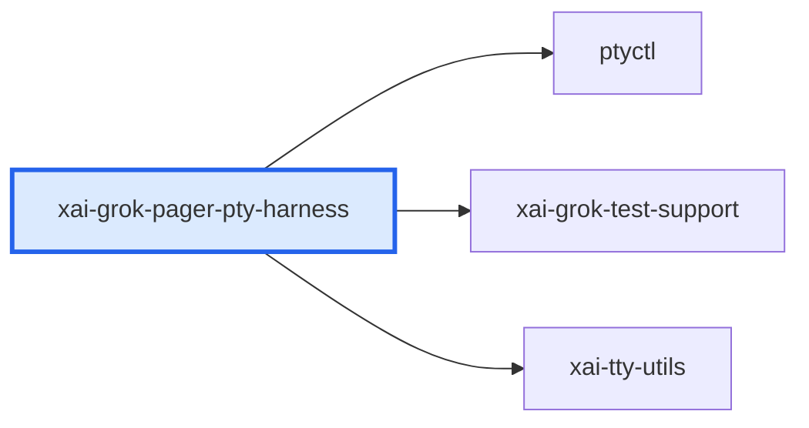

# xai-grok-pager-pty-harness：模块详解

[返回十模块索引](README.md) · [返回全仓总览](../grok-build%20%E6%A8%A1%E5%9D%97%E6%80%BB%E8%A7%88%EF%BC%88%E8%87%AA%E5%8A%A8%E7%94%9F%E6%88%90%EF%BC%89.md)

> 自动统计 + 源码阅读说明。修改 scripts/grok-module-notes-*.json 中的解读，运行 `pnpm run arch:grok:details` 更新。

pager 的真实 PTY E2E、性能和复现场景库。它启动真实 pager binary，在伪终端注入键鼠/调整尺寸，用终端模拟器读取用户实际看到的屏幕，并以 mock inference 驱动完整流。

## 源码版本与统计口径

- grok-build SOURCE_REV：`c4ea71cfdbcdb21e32e41bc25a0043d7d4836714`；解读审阅基于 `c4ea71cfdbcdb21e32e41bc25a0043d7d4836714`。
- Rust 源码及 Cargo.toml 指纹：`6e70310ddf5d381678702b2b95da5e27af98a56616f4a94e8e7b1031d7e56071`。
- raw LOC 是物理行；source LOC 是去注释后的非空行，保留字符串内容。扫描全部 crate 下 .rs，排除 target/ 和 fuzz/，不展开 feature、宏或 include。
- 下表分类按路径互斥分桶；实现路径可能含 #[cfg(test)] 内嵌测试，不能把这一列当成纯生产代码。场景 YAML、提示词 Markdown、快照等非 Rust 资产另见下文。
- 依赖方向 A → B 表示 A 的 Cargo 清单依赖 B，含 build/target/optional 的静态并集，不含 dev-dependencies；不是运行时调用图。
- 调用链文字是源码阅读结果，引用检查只验证文件/符号存在。本次没有执行 grok 二进制、Rust 测试或浏览器业务验收。

| 类别 | .rs 文件 | source LOC | raw LOC |
|---|---|---|---|
| 实现路径（可含内嵌测试） | 34 | 8,293 | 10,289 |
| 独立测试路径 | 239 | 23,693 | 29,512 |
| 基准路径 | 2 | 497 | 662 |
| 示例路径 | 0 | 0 | 0 |
| 总计 | 275 | 32,483 | 40,463 |

## 职责边界

**本模块负责**

- PTY spawn、键鼠注入、屏幕追踪、帧耗时
- mock inference、脚本场景、baseline 对比和视觉产物

**协作边界**

- 生产 pager 功能
- 浏览器应用的 sandbox/Playwright 运行时

## 入口与导出

| 类型 | 名称 | 真实入口 |
|---|---|---|
| library | `xai_grok_pager_pty_harness` | [src/lib.rs](../../../grok-build/crates/codegen/xai-grok-pager-pty-harness/src/lib.rs) |
| binary | `pty-scenario` | [src/bin/pty_scenario.rs](../../../grok-build/crates/codegen/xai-grok-pager-pty-harness/src/bin/pty_scenario.rs) |
| binary | `pty_orphan_holder` | [src/bin/pty_orphan_holder.rs](../../../grok-build/crates/codegen/xai-grok-pager-pty-harness/src/bin/pty_orphan_holder.rs) |
| binary | `scroll-matrix` | [src/bin/scroll_matrix.rs](../../../grok-build/crates/codegen/xai-grok-pager-pty-harness/src/bin/scroll_matrix.rs) |
| binary | `startup-tui-probe` | [src/bin/startup_tui_probe.rs](../../../grok-build/crates/codegen/xai-grok-pager-pty-harness/src/bin/startup_tui_probe.rs) |

库入口的词法 `mod` 声明（可能受 cfg 控制）：`content`、`env`、`flows`、`host_clipboard`、`leader`、`pty`、`pty_spawn`、`results`、`scenarios`、`screen`、`scripted`、`scroll_matrix`、`timing`。

## 内部怎么拆：职责与源码

| 子系统 | 做什么 | 阅读入口 | 入口覆盖 .rs | source LOC | raw LOC |
|---|---|---|---|---|---|
| src/lib.rs | 统一 facade；文档明确服务 regression scenario、benchmark 和本地问题复现三类消费者。 | [src/lib.rs](../../../grok-build/crates/codegen/xai-grok-pager-pty-harness/src/lib.rs) | 1 | 533 | 686 |
| src/pty.rs | 真实进程 PTY 控制、输入、resize 和退出等待。 | [src/pty.rs](../../../grok-build/crates/codegen/xai-grok-pager-pty-harness/src/pty.rs) | 1 | 786 | 915 |
| src/screen.rs | 通过 alacritty_terminal 维护用户可见的虚拟终端屏幕。 | [src/screen.rs](../../../grok-build/crates/codegen/xai-grok-pager-pty-harness/src/screen.rs) | 1 | 110 | 161 |
| src/content.rs | mock inference endpoint 与按请求匹配的 scripted SSE 响应。 | [src/content.rs](../../../grok-build/crates/codegen/xai-grok-pager-pty-harness/src/content.rs) | 1 | 393 | 504 |
| src/scripted.rs | YAML/结构化 scenario 的步骤、错误和视觉产物。 | [src/scripted.rs](../../../grok-build/crates/codegen/xai-grok-pager-pty-harness/src/scripted.rs) | 1 | 2,020 | 2,300 |
| src/scenarios/ | streaming render、mixed interaction、resize storm、scroll stress、plan approval resume 等命名 workload。 | [src/scenarios/](../../../grok-build/crates/codegen/xai-grok-pager-pty-harness/src/scenarios) | 10 | 581 | 792 |
| src/scroll_matrix/ | 接收 GROK_SCROLL_LOG JSONL，组合输入矩阵并生成滚动验证报告。 | [src/scroll_matrix/](../../../grok-build/crates/codegen/xai-grok-pager-pty-harness/src/scroll_matrix) | 8 | 2,253 | 2,899 |

上表行数仅覆盖该行首个阅读入口的文件/目录，入口可能重叠；下表按 src 一级目录及 tests/benches 等桶互斥统计，可以相加。

## 目录体积

| 目录桶 | .rs | source LOC | raw LOC | 其中独立测试 source LOC |
|---|---|---|---|---|
| tests | 239 | 23,693 | 29,512 | 23,693 |
| src/（根文件） | 12 | 5,023 | 6,062 | 0 |
| src/scroll_matrix | 8 | 2,253 | 2,899 | 0 |
| src/scenarios | 10 | 581 | 792 | 0 |
| benches | 2 | 497 | 662 | 0 |
| src/bin | 4 | 436 | 536 | 0 |

## 关键链路与源码阅读路径

### 真实 TUI 场景验证

1. [PtyHarness::spawn_with_content](../../../grok-build/crates/codegen/xai-grok-pager-pty-harness/src/lib.rs#L177)：从测试环境启动 pager 并挂接 mock inference。
2. [PtyController](../../../grok-build/crates/codegen/xai-grok-pager-pty-harness/src/pty.rs#L74)：向真实子进程写入键鼠和 resize。
3. [PtyHarness::update](../../../grok-build/crates/codegen/xai-grok-pager-pty-harness/src/lib.rs#L289)：持续消费 PTY 字节，更新屏幕和 frame timing。
4. [ScreenTracker](../../../grok-build/crates/codegen/xai-grok-pager-pty-harness/src/screen.rs#L9)：断言的是终端模拟后的真实可见屏幕，而不是内部字符串。
5. [ScriptedScenarioRunner::run](../../../grok-build/crates/codegen/xai-grok-pager-pty-harness/src/scripted.rs#L474)：把 scenario 汇总为可审阅 report/visual artifact。

## 直接依赖与被依赖

图中的每条边都来自 Cargo 扫描；边界内的可选依赖可能仅在特定构建配置启用。

**本模块依赖（3）**

| crate | Cargo 用途/模块说明 |
|---|---|
| `ptyctl` | Headless PTY controller built on alacritty_terminal |
| `xai-grok-test-support` | Shared test-support for grok-build crates: mock inference server, SSE generators, ACP stdio client, headless runner, env sandbox |
| `xai-tty-utils` | Lightweight process-spawning utilities for TTY safety — detach from controlling terminal, suppress interactive pagers, process-group lifecycle |

**使用本模块（0）**

| crate | Cargo 用途/模块说明 |
|---|---|

## 测试依据与非 Rust 资产

| 独立测试文件 Top 8 | source LOC | raw LOC |
|---|---|---|
| [tests/pty_e2e/common.rs](../../../grok-build/crates/codegen/xai-grok-pager-pty-harness/tests/pty_e2e/common.rs) | 1,027 | 1,345 |
| [tests/pty_e2e/critical_announcement_session_banner_pty.rs](../../../grok-build/crates/codegen/xai-grok-pager-pty-harness/tests/pty_e2e/critical_announcement_session_banner_pty.rs) | 802 | 978 |
| [tests/doctor_early_dispatch.rs](../../../grok-build/crates/codegen/xai-grok-pager-pty-harness/tests/doctor_early_dispatch.rs) | 617 | 657 |
| [tests/pty_e2e/feedback_modal_pty.rs](../../../grok-build/crates/codegen/xai-grok-pager-pty-harness/tests/pty_e2e/feedback_modal_pty.rs) | 540 | 625 |
| [tests/scripted_scenarios.rs](../../../grok-build/crates/codegen/xai-grok-pager-pty-harness/tests/scripted_scenarios.rs) | 423 | 541 |
| [tests/mcp_toggle_cli.rs](../../../grok-build/crates/codegen/xai-grok-pager-pty-harness/tests/mcp_toggle_cli.rs) | 417 | 486 |
| [tests/pty_e2e/auto_wake_cancel_preserves_queued_user_prompt.rs](../../../grok-build/crates/codegen/xai-grok-pager-pty-harness/tests/pty_e2e/auto_wake_cancel_preserves_queued_user_prompt.rs) | 409 | 494 |
| [tests/pty_e2e/show_thinking_blocks_toggle_hides_existing_pty.rs](../../../grok-build/crates/codegen/xai-grok-pager-pty-harness/tests/pty_e2e/show_thinking_blocks_toggle_hides_existing_pty.rs) | 325 | 358 |

| 类型 | 文件数 | 示例（不计 Rust LOC） |
|---|---|---|
| .md | 1 | [benches/pty_baselines/README.md](../../../grok-build/crates/codegen/xai-grok-pager-pty-harness/benches/pty_baselines/README.md) |
| .toml | 1 | [Cargo.toml](../../../grok-build/crates/codegen/xai-grok-pager-pty-harness/Cargo.toml) |
| .yaml | 46 | [tests/scenarios/ansi_execute_output.yaml](../../../grok-build/crates/codegen/xai-grok-pager-pty-harness/tests/scenarios/ansi_execute_output.yaml)；[tests/scenarios/auto_compact_resize.yaml](../../../grok-build/crates/codegen/xai-grok-pager-pty-harness/tests/scenarios/auto_compact_resize.yaml)；[tests/scenarios/bracket_prompt_input.yaml](../../../grok-build/crates/codegen/xai-grok-pager-pty-harness/tests/scenarios/bracket_prompt_input.yaml) |

## 对 WhyBuddy 可以怎么用

- 把端到端验证写成可复现的场景库，而不是单张截图 smoke。
- 每个场景要同时记录输入、等待条件、屏幕/DOM 证据、console/network 错误和性能数据。
- 计划批准、问卷、流式输出和中断恢复都应有真实运行时场景。

WhyBuddy 当前可对照的文件（路径存在不等于业务已经对齐）：

- [scripts/generated-app-browser-smoke.mjs](../../scripts/generated-app-browser-smoke.mjs)
- [scripts/agent-sandbox-executor-browser-smoke.mjs](../../scripts/agent-sandbox-executor-browser-smoke.mjs)
- [scripts/sliderule-browser-smoke.mjs](../../scripts/sliderule-browser-smoke.mjs)
- [slide-rule-python/services/app_screenshot.py](../../slide-rule-python/services/app_screenshot.py)
- [client/src/components/sandbox/ScreenshotPreview.tsx](../../client/src/components/sandbox/ScreenshotPreview.tsx)

- WhyBuddy 的被测物应是每会话 sandbox 中真实启动的浏览器应用，驱动器应为 Playwright/CDP；不能用 PTY harness 替代浏览器验证。
- 该 crate 的 LOC 很大主要来自 scenario、test 和 benchmark，不是可搬进产品的业务实现。
- 只测生成 HTML 字节或截图存在不等于验证点击、导航、网络和状态改变。

## 建议阅读顺序

1. [src/lib.rs](../../../grok-build/crates/codegen/xai-grok-pager-pty-harness/src/lib.rs)：统一 facade；文档明确服务 regression scenario、benchmark 和本地问题复现三类消费者。
2. [src/pty.rs](../../../grok-build/crates/codegen/xai-grok-pager-pty-harness/src/pty.rs)：真实进程 PTY 控制、输入、resize 和退出等待。
3. [src/screen.rs](../../../grok-build/crates/codegen/xai-grok-pager-pty-harness/src/screen.rs)：通过 alacritty_terminal 维护用户可见的虚拟终端屏幕。
4. [src/content.rs](../../../grok-build/crates/codegen/xai-grok-pager-pty-harness/src/content.rs)：mock inference endpoint 与按请求匹配的 scripted SSE 响应。
5. [src/scripted.rs](../../../grok-build/crates/codegen/xai-grok-pager-pty-harness/src/scripted.rs)：YAML/结构化 scenario 的步骤、错误和视觉产物。
6. [src/scenarios/](../../../grok-build/crates/codegen/xai-grok-pager-pty-harness/src/scenarios)：streaming render、mixed interaction、resize storm、scroll stress、plan approval resume 等命名 workload。
7. [src/scroll_matrix/](../../../grok-build/crates/codegen/xai-grok-pager-pty-harness/src/scroll_matrix)：接收 GROK_SCROLL_LOG JSONL，组合输入矩阵并生成滚动验证报告。

## 大文件与完整 Rust 清单

先看实现路径的 Top 15；它们仍可能带内嵌测试。下面的完整清单包含所有统计文件，方便继续拆到单个组件。

| 实现路径 Top 15 | source LOC | raw LOC |
|---|---|---|
| [src/scripted.rs](../../../grok-build/crates/codegen/xai-grok-pager-pty-harness/src/scripted.rs) | 2,020 | 2,300 |
| [src/pty.rs](../../../grok-build/crates/codegen/xai-grok-pager-pty-harness/src/pty.rs) | 786 | 915 |
| [src/scroll_matrix/invariants.rs](../../../grok-build/crates/codegen/xai-grok-pager-pty-harness/src/scroll_matrix/invariants.rs) | 620 | 742 |
| [src/lib.rs](../../../grok-build/crates/codegen/xai-grok-pager-pty-harness/src/lib.rs) | 533 | 686 |
| [src/content.rs](../../../grok-build/crates/codegen/xai-grok-pager-pty-harness/src/content.rs) | 393 | 504 |
| [src/pty_spawn.rs](../../../grok-build/crates/codegen/xai-grok-pager-pty-harness/src/pty_spawn.rs) | 389 | 491 |
| [src/scroll_matrix/log.rs](../../../grok-build/crates/codegen/xai-grok-pager-pty-harness/src/scroll_matrix/log.rs) | 322 | 439 |
| [src/scroll_matrix/runner.rs](../../../grok-build/crates/codegen/xai-grok-pager-pty-harness/src/scroll_matrix/runner.rs) | 318 | 428 |
| [src/scroll_matrix/cells.rs](../../../grok-build/crates/codegen/xai-grok-pager-pty-harness/src/scroll_matrix/cells.rs) | 301 | 368 |
| [src/bin/startup_tui_probe.rs](../../../grok-build/crates/codegen/xai-grok-pager-pty-harness/src/bin/startup_tui_probe.rs) | 248 | 286 |
| [src/scroll_matrix/gestures.rs](../../../grok-build/crates/codegen/xai-grok-pager-pty-harness/src/scroll_matrix/gestures.rs) | 247 | 330 |
| [src/scroll_matrix/report.rs](../../../grok-build/crates/codegen/xai-grok-pager-pty-harness/src/scroll_matrix/report.rs) | 215 | 265 |
| [src/results.rs](../../../grok-build/crates/codegen/xai-grok-pager-pty-harness/src/results.rs) | 213 | 254 |
| [src/scroll_matrix/session.rs](../../../grok-build/crates/codegen/xai-grok-pager-pty-harness/src/scroll_matrix/session.rs) | 207 | 286 |
| [src/leader.rs](../../../grok-build/crates/codegen/xai-grok-pager-pty-harness/src/leader.rs) | 156 | 206 |

展开全部 275 个 Rust 文件

| 文件 | 类别 | source LOC | raw LOC |
|---|---|---|---|
| [benches/paste_latency.rs](../../../grok-build/crates/codegen/xai-grok-pager-pty-harness/benches/paste_latency.rs) | 基准路径 | 363 | 466 |
| [benches/pty_bench.rs](../../../grok-build/crates/codegen/xai-grok-pager-pty-harness/benches/pty_bench.rs) | 基准路径 | 134 | 196 |
| [src/bin/pty_orphan_holder.rs](../../../grok-build/crates/codegen/xai-grok-pager-pty-harness/src/bin/pty_orphan_holder.rs) | 实现路径（可含内嵌测试） | 30 | 45 |
| [src/bin/pty_scenario.rs](../../../grok-build/crates/codegen/xai-grok-pager-pty-harness/src/bin/pty_scenario.rs) | 实现路径（可含内嵌测试） | 51 | 63 |
| [src/bin/scroll_matrix.rs](../../../grok-build/crates/codegen/xai-grok-pager-pty-harness/src/bin/scroll_matrix.rs) | 实现路径（可含内嵌测试） | 107 | 142 |
| [src/bin/startup_tui_probe.rs](../../../grok-build/crates/codegen/xai-grok-pager-pty-harness/src/bin/startup_tui_probe.rs) | 实现路径（可含内嵌测试） | 248 | 286 |
| [src/content.rs](../../../grok-build/crates/codegen/xai-grok-pager-pty-harness/src/content.rs) | 实现路径（可含内嵌测试） | 393 | 504 |
| [src/env.rs](../../../grok-build/crates/codegen/xai-grok-pager-pty-harness/src/env.rs) | 实现路径（可含内嵌测试） | 76 | 87 |
| [src/flows.rs](../../../grok-build/crates/codegen/xai-grok-pager-pty-harness/src/flows.rs) | 实现路径（可含内嵌测试） | 108 | 147 |
| [src/host_clipboard.rs](../../../grok-build/crates/codegen/xai-grok-pager-pty-harness/src/host_clipboard.rs) | 实现路径（可含内嵌测试） | 149 | 191 |
| [src/leader.rs](../../../grok-build/crates/codegen/xai-grok-pager-pty-harness/src/leader.rs) | 实现路径（可含内嵌测试） | 156 | 206 |
| [src/lib.rs](../../../grok-build/crates/codegen/xai-grok-pager-pty-harness/src/lib.rs) | 实现路径（可含内嵌测试） | 533 | 686 |
| [src/pty.rs](../../../grok-build/crates/codegen/xai-grok-pager-pty-harness/src/pty.rs) | 实现路径（可含内嵌测试） | 786 | 915 |
| [src/pty_spawn.rs](../../../grok-build/crates/codegen/xai-grok-pager-pty-harness/src/pty_spawn.rs) | 实现路径（可含内嵌测试） | 389 | 491 |
| [src/results.rs](../../../grok-build/crates/codegen/xai-grok-pager-pty-harness/src/results.rs) | 实现路径（可含内嵌测试） | 213 | 254 |
| [src/scenarios/empty_enter_send_now.rs](../../../grok-build/crates/codegen/xai-grok-pager-pty-harness/src/scenarios/empty_enter_send_now.rs) | 实现路径（可含内嵌测试） | 121 | 149 |
| [src/scenarios/idle_cost.rs](../../../grok-build/crates/codegen/xai-grok-pager-pty-harness/src/scenarios/idle_cost.rs) | 实现路径（可含内嵌测试） | 18 | 28 |
| [src/scenarios/large_codeblock.rs](../../../grok-build/crates/codegen/xai-grok-pager-pty-harness/src/scenarios/large_codeblock.rs) | 实现路径（可含内嵌测试） | 38 | 50 |
| [src/scenarios/mixed_interaction.rs](../../../grok-build/crates/codegen/xai-grok-pager-pty-harness/src/scenarios/mixed_interaction.rs) | 实现路径（可含内嵌测试） | 31 | 44 |
| [src/scenarios/mod.rs](../../../grok-build/crates/codegen/xai-grok-pager-pty-harness/src/scenarios/mod.rs) | 实现路径（可含内嵌测试） | 66 | 89 |
| [src/scenarios/plan_approval_resume.rs](../../../grok-build/crates/codegen/xai-grok-pager-pty-harness/src/scenarios/plan_approval_resume.rs) | 实现路径（可含内嵌测试） | 149 | 187 |
| [src/scenarios/resize_storm.rs](../../../grok-build/crates/codegen/xai-grok-pager-pty-harness/src/scenarios/resize_storm.rs) | 实现路径（可含内嵌测试） | 27 | 40 |
| [src/scenarios/scroll_stress.rs](../../../grok-build/crates/codegen/xai-grok-pager-pty-harness/src/scenarios/scroll_stress.rs) | 实现路径（可含内嵌测试） | 36 | 62 |
| [src/scenarios/streaming_render.rs](../../../grok-build/crates/codegen/xai-grok-pager-pty-harness/src/scenarios/streaming_render.rs) | 实现路径（可含内嵌测试） | 31 | 48 |
| [src/scenarios/x10_mouse_leak.rs](../../../grok-build/crates/codegen/xai-grok-pager-pty-harness/src/scenarios/x10_mouse_leak.rs) | 实现路径（可含内嵌测试） | 64 | 95 |
| [src/screen.rs](../../../grok-build/crates/codegen/xai-grok-pager-pty-harness/src/screen.rs) | 实现路径（可含内嵌测试） | 110 | 161 |
| [src/scripted.rs](../../../grok-build/crates/codegen/xai-grok-pager-pty-harness/src/scripted.rs) | 实现路径（可含内嵌测试） | 2,020 | 2,300 |
| [src/scroll_matrix/cells.rs](../../../grok-build/crates/codegen/xai-grok-pager-pty-harness/src/scroll_matrix/cells.rs) | 实现路径（可含内嵌测试） | 301 | 368 |
| [src/scroll_matrix/gestures.rs](../../../grok-build/crates/codegen/xai-grok-pager-pty-harness/src/scroll_matrix/gestures.rs) | 实现路径（可含内嵌测试） | 247 | 330 |
| [src/scroll_matrix/invariants.rs](../../../grok-build/crates/codegen/xai-grok-pager-pty-harness/src/scroll_matrix/invariants.rs) | 实现路径（可含内嵌测试） | 620 | 742 |
| [src/scroll_matrix/log.rs](../../../grok-build/crates/codegen/xai-grok-pager-pty-harness/src/scroll_matrix/log.rs) | 实现路径（可含内嵌测试） | 322 | 439 |
| [src/scroll_matrix/mod.rs](../../../grok-build/crates/codegen/xai-grok-pager-pty-harness/src/scroll_matrix/mod.rs) | 实现路径（可含内嵌测试） | 23 | 41 |
| [src/scroll_matrix/report.rs](../../../grok-build/crates/codegen/xai-grok-pager-pty-harness/src/scroll_matrix/report.rs) | 实现路径（可含内嵌测试） | 215 | 265 |
| [src/scroll_matrix/runner.rs](../../../grok-build/crates/codegen/xai-grok-pager-pty-harness/src/scroll_matrix/runner.rs) | 实现路径（可含内嵌测试） | 318 | 428 |
| [src/scroll_matrix/session.rs](../../../grok-build/crates/codegen/xai-grok-pager-pty-harness/src/scroll_matrix/session.rs) | 实现路径（可含内嵌测试） | 207 | 286 |
| [src/timing.rs](../../../grok-build/crates/codegen/xai-grok-pager-pty-harness/src/timing.rs) | 实现路径（可含内嵌测试） | 90 | 120 |
| [tests/doctor_early_dispatch.rs](../../../grok-build/crates/codegen/xai-grok-pager-pty-harness/tests/doctor_early_dispatch.rs) | 独立测试路径 | 617 | 657 |
| [tests/empty_enter_send_now.rs](../../../grok-build/crates/codegen/xai-grok-pager-pty-harness/tests/empty_enter_send_now.rs) | 独立测试路径 | 7 | 13 |
| [tests/env_op_compile.rs](../../../grok-build/crates/codegen/xai-grok-pager-pty-harness/tests/env_op_compile.rs) | 独立测试路径 | 21 | 25 |
| [tests/exit_error_dead_stderr.rs](../../../grok-build/crates/codegen/xai-grok-pager-pty-harness/tests/exit_error_dead_stderr.rs) | 独立测试路径 | 67 | 91 |
| [tests/exit_timeout.rs](../../../grok-build/crates/codegen/xai-grok-pager-pty-harness/tests/exit_timeout.rs) | 独立测试路径 | 59 | 83 |
| [tests/leader_pty_e2e/campaign_leader_mode_remote_dismiss_on_model_pick.rs](../../../grok-build/crates/codegen/xai-grok-pager-pty-harness/tests/leader_pty_e2e/campaign_leader_mode_remote_dismiss_on_model_pick.rs) | 独立测试路径 | 97 | 124 |
| [tests/leader_pty_e2e/common.rs](../../../grok-build/crates/codegen/xai-grok-pager-pty-harness/tests/leader_pty_e2e/common.rs) | 独立测试路径 | 17 | 38 |
| [tests/leader_pty_e2e/leader_n_clients_shared_session.rs](../../../grok-build/crates/codegen/xai-grok-pager-pty-harness/tests/leader_pty_e2e/leader_n_clients_shared_session.rs) | 独立测试路径 | 75 | 96 |
| [tests/leader_pty_e2e/leader_reattach_cancellation_roundtrips_durable_log.rs](../../../grok-build/crates/codegen/xai-grok-pager-pty-harness/tests/leader_pty_e2e/leader_reattach_cancellation_roundtrips_durable_log.rs) | 独立测试路径 | 78 | 107 |
| [tests/leader_pty_e2e/leader_reattach_completion_roundtrips_durable_log.rs](../../../grok-build/crates/codegen/xai-grok-pager-pty-harness/tests/leader_pty_e2e/leader_reattach_completion_roundtrips_durable_log.rs) | 独立测试路径 | 68 | 91 |
| [tests/leader_pty_e2e/leader_two_clients_shared_session.rs](../../../grok-build/crates/codegen/xai-grok-pager-pty-harness/tests/leader_pty_e2e/leader_two_clients_shared_session.rs) | 独立测试路径 | 100 | 128 |
| [tests/leader_pty_e2e/mod.rs](../../../grok-build/crates/codegen/xai-grok-pager-pty-harness/tests/leader_pty_e2e/mod.rs) | 独立测试路径 | 6 | 20 |
| [tests/mcp_toggle_cli.rs](../../../grok-build/crates/codegen/xai-grok-pager-pty-harness/tests/mcp_toggle_cli.rs) | 独立测试路径 | 417 | 486 |
| [tests/orphan_reap.rs](../../../grok-build/crates/codegen/xai-grok-pager-pty-harness/tests/orphan_reap.rs) | 独立测试路径 | 68 | 119 |
| [tests/plan_approval_resume.rs](../../../grok-build/crates/codegen/xai-grok-pager-pty-harness/tests/plan_approval_resume.rs) | 独立测试路径 | 6 | 16 |
| [tests/privacy_banner_e2e.rs](../../../grok-build/crates/codegen/xai-grok-pager-pty-harness/tests/privacy_banner_e2e.rs) | 独立测试路径 | 181 | 236 |
| [tests/prompt_history_browse_order.rs](../../../grok-build/crates/codegen/xai-grok-pager-pty-harness/tests/prompt_history_browse_order.rs) | 独立测试路径 | 184 | 236 |
| [tests/prompt_history_durable_quit.rs](../../../grok-build/crates/codegen/xai-grok-pager-pty-harness/tests/prompt_history_durable_quit.rs) | 独立测试路径 | 166 | 234 |
| [tests/prompt_stash.rs](../../../grok-build/crates/codegen/xai-grok-pager-pty-harness/tests/prompt_stash.rs) | 独立测试路径 | 94 | 127 |
| [tests/pty_auto_mode.rs](../../../grok-build/crates/codegen/xai-grok-pager-pty-harness/tests/pty_auto_mode.rs) | 独立测试路径 | 209 | 276 |
| [tests/pty_e2e/agent_execute_full_output_double_click_fold_pty.rs](../../../grok-build/crates/codegen/xai-grok-pager-pty-harness/tests/pty_e2e/agent_execute_full_output_double_click_fold_pty.rs) | 独立测试路径 | 87 | 95 |
| [tests/pty_e2e/agent_response.rs](../../../grok-build/crates/codegen/xai-grok-pager-pty-harness/tests/pty_e2e/agent_response.rs) | 独立测试路径 | 29 | 39 |
| [tests/pty_e2e/agent_type_mismatch_modal_on_model_switch.rs](../../../grok-build/crates/codegen/xai-grok-pager-pty-harness/tests/pty_e2e/agent_type_mismatch_modal_on_model_switch.rs) | 独立测试路径 | 35 | 47 |
| [tests/pty_e2e/agent_type_mismatch_no_keeps_current_session.rs](../../../grok-build/crates/codegen/xai-grok-pager-pty-harness/tests/pty_e2e/agent_type_mismatch_no_keeps_current_session.rs) | 独立测试路径 | 48 | 64 |
| [tests/pty_e2e/agent_type_mismatch_yes_starts_new_session.rs](../../../grok-build/crates/codegen/xai-grok-pager-pty-harness/tests/pty_e2e/agent_type_mismatch_yes_starts_new_session.rs) | 独立测试路径 | 44 | 59 |
| [tests/pty_e2e/ansi_scrollback_content_integrity.rs](../../../grok-build/crates/codegen/xai-grok-pager-pty-harness/tests/pty_e2e/ansi_scrollback_content_integrity.rs) | 独立测试路径 | 73 | 99 |
| [tests/pty_e2e/auto_compact_top_row.rs](../../../grok-build/crates/codegen/xai-grok-pager-pty-harness/tests/pty_e2e/auto_compact_top_row.rs) | 独立测试路径 | 105 | 139 |
| [tests/pty_e2e/auto_wake_cancel_preserves_queued_user_prompt.rs](../../../grok-build/crates/codegen/xai-grok-pager-pty-harness/tests/pty_e2e/auto_wake_cancel_preserves_queued_user_prompt.rs) | 独立测试路径 | 409 | 494 |
| [tests/pty_e2e/auto_wake_cancel_via_stop_click_preserves_queued_user_prompt.rs](../../../grok-build/crates/codegen/xai-grok-pager-pty-harness/tests/pty_e2e/auto_wake_cancel_via_stop_click_preserves_queued_user_prompt.rs) | 独立测试路径 | 11 | 14 |
| [tests/pty_e2e/background_task_reaped_on_quit.rs](../../../grok-build/crates/codegen/xai-grok-pager-pty-harness/tests/pty_e2e/background_task_reaped_on_quit.rs) | 独立测试路径 | 117 | 157 |
| [tests/pty_e2e/bash_full_output_double_click_fold_pty.rs](../../../grok-build/crates/codegen/xai-grok-pager-pty-harness/tests/pty_e2e/bash_full_output_double_click_fold_pty.rs) | 独立测试路径 | 129 | 156 |
| [tests/pty_e2e/bash_mode_file_completion_shell_like.rs](../../../grok-build/crates/codegen/xai-grok-pager-pty-harness/tests/pty_e2e/bash_mode_file_completion_shell_like.rs) | 独立测试路径 | 119 | 154 |
| [tests/pty_e2e/bash_mode_strips_redundant_session_cd_from_chrome.rs](../../../grok-build/crates/codegen/xai-grok-pager-pty-harness/tests/pty_e2e/bash_mode_strips_redundant_session_cd_from_chrome.rs) | 独立测试路径 | 73 | 90 |
| [tests/pty_e2e/bash_mode_tab_completion_dropdown.rs](../../../grok-build/crates/codegen/xai-grok-pager-pty-harness/tests/pty_e2e/bash_mode_tab_completion_dropdown.rs) | 独立测试路径 | 93 | 123 |
| [tests/pty_e2e/bash_queued_mid_turn_drains_as_bash.rs](../../../grok-build/crates/codegen/xai-grok-pager-pty-harness/tests/pty_e2e/bash_queued_mid_turn_drains_as_bash.rs) | 独立测试路径 | 73 | 91 |
| [tests/pty_e2e/bracketed_ime_paste_skips_clipboard_image_linux.rs](../../../grok-build/crates/codegen/xai-grok-pager-pty-harness/tests/pty_e2e/bracketed_ime_paste_skips_clipboard_image_linux.rs) | 独立测试路径 | 125 | 144 |
| [tests/pty_e2e/bracketed_ime_paste_skips_clipboard_image_macos.rs](../../../grok-build/crates/codegen/xai-grok-pager-pty-harness/tests/pty_e2e/bracketed_ime_paste_skips_clipboard_image_macos.rs) | 独立测试路径 | 55 | 73 |
| [tests/pty_e2e/campaign_nudges_default_until_dismissed_by_model_pick.rs](../../../grok-build/crates/codegen/xai-grok-pager-pty-harness/tests/pty_e2e/campaign_nudges_default_until_dismissed_by_model_pick.rs) | 独立测试路径 | 104 | 123 |
| [tests/pty_e2e/campaign_remote_settings_nudge_and_dismiss.rs](../../../grok-build/crates/codegen/xai-grok-pager-pty-harness/tests/pty_e2e/campaign_remote_settings_nudge_and_dismiss.rs) | 独立测试路径 | 97 | 120 |
| [tests/pty_e2e/cancel_discards_buffered_interjection.rs](../../../grok-build/crates/codegen/xai-grok-pager-pty-harness/tests/pty_e2e/cancel_discards_buffered_interjection.rs) | 独立测试路径 | 81 | 96 |
| [tests/pty_e2e/cancel_then_resend_prompt_appears_once.rs](../../../grok-build/crates/codegen/xai-grok-pager-pty-harness/tests/pty_e2e/cancel_then_resend_prompt_appears_once.rs) | 独立测试路径 | 119 | 141 |
| [tests/pty_e2e/common.rs](../../../grok-build/crates/codegen/xai-grok-pager-pty-harness/tests/pty_e2e/common.rs) | 独立测试路径 | 1,027 | 1,345 |
| [tests/pty_e2e/connect_ui_timeout_env_override.rs](../../../grok-build/crates/codegen/xai-grok-pager-pty-harness/tests/pty_e2e/connect_ui_timeout_env_override.rs) | 独立测试路径 | 76 | 101 |
| [tests/pty_e2e/consent_gate_blocks_session_pty.rs](../../../grok-build/crates/codegen/xai-grok-pager-pty-harness/tests/pty_e2e/consent_gate_blocks_session_pty.rs) | 独立测试路径 | 140 | 179 |
| [tests/pty_e2e/continue_resumes_session_with_history.rs](../../../grok-build/crates/codegen/xai-grok-pager-pty-harness/tests/pty_e2e/continue_resumes_session_with_history.rs) | 独立测试路径 | 65 | 79 |
| [tests/pty_e2e/critical_announcement_session_banner_pty.rs](../../../grok-build/crates/codegen/xai-grok-pager-pty-harness/tests/pty_e2e/critical_announcement_session_banner_pty.rs) | 独立测试路径 | 802 | 978 |
| [tests/pty_e2e/ctrl_c_cancel_during_stream_recovers_cleanly.rs](../../../grok-build/crates/codegen/xai-grok-pager-pty-harness/tests/pty_e2e/ctrl_c_cancel_during_stream_recovers_cleanly.rs) | 独立测试路径 | 68 | 91 |
| [tests/pty_e2e/ctrlc_after_activity_no_rewind_prompt_once.rs](../../../grok-build/crates/codegen/xai-grok-pager-pty-harness/tests/pty_e2e/ctrlc_after_activity_no_rewind_prompt_once.rs) | 独立测试路径 | 47 | 59 |
| [tests/pty_e2e/ctrlc_with_queued_prompt_no_dup.rs](../../../grok-build/crates/codegen/xai-grok-pager-pty-harness/tests/pty_e2e/ctrlc_with_queued_prompt_no_dup.rs) | 独立测试路径 | 75 | 94 |
| [tests/pty_e2e/dashboard_overlay_tab_esc_backout_and_ctrl_backslash.rs](../../../grok-build/crates/codegen/xai-grok-pager-pty-harness/tests/pty_e2e/dashboard_overlay_tab_esc_backout_and_ctrl_backslash.rs) | 独立测试路径 | 96 | 122 |
| [tests/pty_e2e/dock_crowded_sections.rs](../../../grok-build/crates/codegen/xai-grok-pager-pty-harness/tests/pty_e2e/dock_crowded_sections.rs) | 独立测试路径 | 127 | 142 |
| [tests/pty_e2e/dock_hover_stop_background_task.rs](../../../grok-build/crates/codegen/xai-grok-pager-pty-harness/tests/pty_e2e/dock_hover_stop_background_task.rs) | 独立测试路径 | 83 | 90 |
| [tests/pty_e2e/doubled_lines_out_of_band_repro.rs](../../../grok-build/crates/codegen/xai-grok-pager-pty-harness/tests/pty_e2e/doubled_lines_out_of_band_repro.rs) | 独立测试路径 | 52 | 85 |
| [tests/pty_e2e/drag_autoscroll_no_bounce_pty.rs](../../../grok-build/crates/codegen/xai-grok-pager-pty-harness/tests/pty_e2e/drag_autoscroll_no_bounce_pty.rs) | 独立测试路径 | 76 | 91 |
| [tests/pty_e2e/drag_enters_content_from_gap_pty.rs](../../../grok-build/crates/codegen/xai-grok-pager-pty-harness/tests/pty_e2e/drag_enters_content_from_gap_pty.rs) | 独立测试路径 | 141 | 160 |
| [tests/pty_e2e/drag_from_above_prompt_strip_pty.rs](../../../grok-build/crates/codegen/xai-grok-pager-pty-harness/tests/pty_e2e/drag_from_above_prompt_strip_pty.rs) | 独立测试路径 | 92 | 109 |
| [tests/pty_e2e/drag_from_chrome_stays_block_pty.rs](../../../grok-build/crates/codegen/xai-grok-pager-pty-harness/tests/pty_e2e/drag_from_chrome_stays_block_pty.rs) | 独立测试路径 | 93 | 110 |
| [tests/pty_e2e/drag_over_gap_rows_does_not_freeze_head_pty.rs](../../../grok-build/crates/codegen/xai-grok-pager-pty-harness/tests/pty_e2e/drag_over_gap_rows_does_not_freeze_head_pty.rs) | 独立测试路径 | 93 | 109 |
| [tests/pty_e2e/drag_select_autoscroll_full_scrollout_copy_pty.rs](../../../grok-build/crates/codegen/xai-grok-pager-pty-harness/tests/pty_e2e/drag_select_autoscroll_full_scrollout_copy_pty.rs) | 独立测试路径 | 145 | 173 |
| [tests/pty_e2e/drag_select_wheel_scroll_extends_pty.rs](../../../grok-build/crates/codegen/xai-grok-pager-pty-harness/tests/pty_e2e/drag_select_wheel_scroll_extends_pty.rs) | 独立测试路径 | 69 | 91 |
| [tests/pty_e2e/edit_collapsed_oneliner_pty.rs](../../../grok-build/crates/codegen/xai-grok-pager-pty-harness/tests/pty_e2e/edit_collapsed_oneliner_pty.rs) | 独立测试路径 | 96 | 119 |
| [tests/pty_e2e/edit_hl_inplace_refresh_pty.rs](../../../grok-build/crates/codegen/xai-grok-pager-pty-harness/tests/pty_e2e/edit_hl_inplace_refresh_pty.rs) | 独立测试路径 | 227 | 279 |
| [tests/pty_e2e/edit_interject_lone_queued_row_keeps_tui_alive.rs](../../../grok-build/crates/codegen/xai-grok-pager-pty-harness/tests/pty_e2e/edit_interject_lone_queued_row_keeps_tui_alive.rs) | 独立测试路径 | 158 | 197 |
| [tests/pty_e2e/edit_merge_parallel_pty.rs](../../../grok-build/crates/codegen/xai-grok-pager-pty-harness/tests/pty_e2e/edit_merge_parallel_pty.rs) | 独立测试路径 | 98 | 114 |
| [tests/pty_e2e/edit_merge_sequential_pty.rs](../../../grok-build/crates/codegen/xai-grok-pager-pty-harness/tests/pty_e2e/edit_merge_sequential_pty.rs) | 独立测试路径 | 223 | 258 |
| [tests/pty_e2e/embedded_mode_boots_without_hanging_on_blocked_backend.rs](../../../grok-build/crates/codegen/xai-grok-pager-pty-harness/tests/pty_e2e/embedded_mode_boots_without_hanging_on_blocked_backend.rs) | 独立测试路径 | 47 | 59 |
| [tests/pty_e2e/empty_enter_force_sends_top_queued.rs](../../../grok-build/crates/codegen/xai-grok-pager-pty-harness/tests/pty_e2e/empty_enter_force_sends_top_queued.rs) | 独立测试路径 | 97 | 115 |
| [tests/pty_e2e/empty_enter_sends_top_not_last_of_two.rs](../../../grok-build/crates/codegen/xai-grok-pager-pty-harness/tests/pty_e2e/empty_enter_sends_top_not_last_of_two.rs) | 独立测试路径 | 115 | 132 |
| [tests/pty_e2e/endline_park_is_markerless.rs](../../../grok-build/crates/codegen/xai-grok-pager-pty-harness/tests/pty_e2e/endline_park_is_markerless.rs) | 独立测试路径 | 130 | 163 |
| [tests/pty_e2e/endline_wakeups_close_with_markers.rs](../../../grok-build/crates/codegen/xai-grok-pager-pty-harness/tests/pty_e2e/endline_wakeups_close_with_markers.rs) | 独立测试路径 | 160 | 181 |
| [tests/pty_e2e/esc_esc_clears_idle_prompt_into_the_stash.rs](../../../grok-build/crates/codegen/xai-grok-pager-pty-harness/tests/pty_e2e/esc_esc_clears_idle_prompt_into_the_stash.rs) | 独立测试路径 | 59 | 80 |
| [tests/pty_e2e/esc_esc_opens_rewind_picker_silent_first_press.rs](../../../grok-build/crates/codegen/xai-grok-pager-pty-harness/tests/pty_e2e/esc_esc_opens_rewind_picker_silent_first_press.rs) | 独立测试路径 | 74 | 102 |
| [tests/pty_e2e/esc_idle_empty_no_messages_is_swallowed_noop.rs](../../../grok-build/crates/codegen/xai-grok-pager-pty-harness/tests/pty_e2e/esc_idle_empty_no_messages_is_swallowed_noop.rs) | 独立测试路径 | 54 | 74 |
| [tests/pty_e2e/esc_mid_turn_hints_ctrl_c_from_prompt_preserves_draft.rs](../../../grok-build/crates/codegen/xai-grok-pager-pty-harness/tests/pty_e2e/esc_mid_turn_hints_ctrl_c_from_prompt_preserves_draft.rs) | 独立测试路径 | 65 | 82 |
| [tests/pty_e2e/esc_mid_turn_hints_ctrl_c_from_scrollback.rs](../../../grok-build/crates/codegen/xai-grok-pager-pty-harness/tests/pty_e2e/esc_mid_turn_hints_ctrl_c_from_scrollback.rs) | 独立测试路径 | 57 | 72 |
| [tests/pty_e2e/extensions_modal_copy_hints_pty.rs](../../../grok-build/crates/codegen/xai-grok-pager-pty-harness/tests/pty_e2e/extensions_modal_copy_hints_pty.rs) | 独立测试路径 | 164 | 190 |
| [tests/pty_e2e/extensions_modal_workflows_tab_pty.rs](../../../grok-build/crates/codegen/xai-grok-pager-pty-harness/tests/pty_e2e/extensions_modal_workflows_tab_pty.rs) | 独立测试路径 | 75 | 92 |
| [tests/pty_e2e/feedback_modal_pty.rs](../../../grok-build/crates/codegen/xai-grok-pager-pty-harness/tests/pty_e2e/feedback_modal_pty.rs) | 独立测试路径 | 540 | 625 |
| [tests/pty_e2e/file_path_with_space_emits_full_osc8_hyperlink.rs](../../../grok-build/crates/codegen/xai-grok-pager-pty-harness/tests/pty_e2e/file_path_with_space_emits_full_osc8_hyperlink.rs) | 独立测试路径 | 64 | 89 |
| [tests/pty_e2e/folder_trust_cwd_is_home_git_repo_no_prompt.rs](../../../grok-build/crates/codegen/xai-grok-pager-pty-harness/tests/pty_e2e/folder_trust_cwd_is_home_git_repo_no_prompt.rs) | 独立测试路径 | 30 | 43 |
| [tests/pty_e2e/folder_trust_decline_quits_without_grant.rs](../../../grok-build/crates/codegen/xai-grok-pager-pty-harness/tests/pty_e2e/folder_trust_decline_quits_without_grant.rs) | 独立测试路径 | 41 | 50 |
| [tests/pty_e2e/folder_trust_feature_off_shows_no_question.rs](../../../grok-build/crates/codegen/xai-grok-pager-pty-harness/tests/pty_e2e/folder_trust_feature_off_shows_no_question.rs) | 独立测试路径 | 29 | 37 |
| [tests/pty_e2e/folder_trust_home_git_repo_subdir_keys_on_subdir.rs](../../../grok-build/crates/codegen/xai-grok-pager-pty-harness/tests/pty_e2e/folder_trust_home_git_repo_subdir_keys_on_subdir.rs) | 独立测试路径 | 51 | 70 |
| [tests/pty_e2e/folder_trust_question_renders_and_accept_persists_grant.rs](../../../grok-build/crates/codegen/xai-grok-pager-pty-harness/tests/pty_e2e/folder_trust_question_renders_and_accept_persists_grant.rs) | 独立测试路径 | 57 | 74 |
| [tests/pty_e2e/forced_wheel_mode_env_scrolls_exact_rows.rs](../../../grok-build/crates/codegen/xai-grok-pager-pty-harness/tests/pty_e2e/forced_wheel_mode_env_scrolls_exact_rows.rs) | 独立测试路径 | 59 | 78 |
| [tests/pty_e2e/fullscreen_external_editor_round_trip.rs](../../../grok-build/crates/codegen/xai-grok-pager-pty-harness/tests/pty_e2e/fullscreen_external_editor_round_trip.rs) | 独立测试路径 | 77 | 98 |
| [tests/pty_e2e/image_chip_preview_path_free_pty.rs](../../../grok-build/crates/codegen/xai-grok-pager-pty-harness/tests/pty_e2e/image_chip_preview_path_free_pty.rs) | 独立测试路径 | 82 | 99 |
| [tests/pty_e2e/initial_prompt_positional_auto_submits.rs](../../../grok-build/crates/codegen/xai-grok-pager-pty-harness/tests/pty_e2e/initial_prompt_positional_auto_submits.rs) | 独立测试路径 | 28 | 38 |
| [tests/pty_e2e/input_echoes_at_idle_prompt.rs](../../../grok-build/crates/codegen/xai-grok-pager-pty-harness/tests/pty_e2e/input_echoes_at_idle_prompt.rs) | 独立测试路径 | 35 | 50 |
| [tests/pty_e2e/interjection_reaches_model_ctrl_l_in_vscode_family.rs](../../../grok-build/crates/codegen/xai-grok-pager-pty-harness/tests/pty_e2e/interjection_reaches_model_ctrl_l_in_vscode_family.rs) | 独立测试路径 | 80 | 93 |
| [tests/pty_e2e/interjection_reaches_model_in_same_turn.rs](../../../grok-build/crates/codegen/xai-grok-pager-pty-harness/tests/pty_e2e/interjection_reaches_model_in_same_turn.rs) | 独立测试路径 | 83 | 97 |
| [tests/pty_e2e/iterm_readline_editing.rs](../../../grok-build/crates/codegen/xai-grok-pager-pty-harness/tests/pty_e2e/iterm_readline_editing.rs) | 独立测试路径 | 147 | 156 |
| [tests/pty_e2e/keep_text_selection_settings_visible_pty.rs](../../../grok-build/crates/codegen/xai-grok-pager-pty-harness/tests/pty_e2e/keep_text_selection_settings_visible_pty.rs) | 独立测试路径 | 59 | 70 |
| [tests/pty_e2e/managed_policy_gate_refusal_reaches_real_terminal.rs](../../../grok-build/crates/codegen/xai-grok-pager-pty-harness/tests/pty_e2e/managed_policy_gate_refusal_reaches_real_terminal.rs) | 独立测试路径 | 76 | 87 |
| [tests/pty_e2e/mcp_menu_loads_servers_in_non_project_dir.rs](../../../grok-build/crates/codegen/xai-grok-pager-pty-harness/tests/pty_e2e/mcp_menu_loads_servers_in_non_project_dir.rs) | 独立测试路径 | 9 | 15 |
| [tests/pty_e2e/mcp_menu_loads_servers_in_project_dir.rs](../../../grok-build/crates/codegen/xai-grok-pager-pty-harness/tests/pty_e2e/mcp_menu_loads_servers_in_project_dir.rs) | 独立测试路径 | 10 | 16 |
| [tests/pty_e2e/mid_text_skill_token_echo_styled_pty.rs](../../../grok-build/crates/codegen/xai-grok-pager-pty-harness/tests/pty_e2e/mid_text_skill_token_echo_styled_pty.rs) | 独立测试路径 | 112 | 144 |
| [tests/pty_e2e/mid_turn_slash_dropdown_esc_dismisses_not_cancel.rs](../../../grok-build/crates/codegen/xai-grok-pager-pty-harness/tests/pty_e2e/mid_turn_slash_dropdown_esc_dismisses_not_cancel.rs) | 独立测试路径 | 52 | 68 |
| [tests/pty_e2e/middle_click_pastes_primary_linux.rs](../../../grok-build/crates/codegen/xai-grok-pager-pty-harness/tests/pty_e2e/middle_click_pastes_primary_linux.rs) | 独立测试路径 | 119 | 132 |
| [tests/pty_e2e/minimal/minimal_cli_screen_mode_does_not_persist.rs](../../../grok-build/crates/codegen/xai-grok-pager-pty-harness/tests/pty_e2e/minimal/minimal_cli_screen_mode_does_not_persist.rs) | 独立测试路径 | 53 | 68 |
| [tests/pty_e2e/minimal/minimal_commits_response_to_scrollback.rs](../../../grok-build/crates/codegen/xai-grok-pager-pty-harness/tests/pty_e2e/minimal/minimal_commits_response_to_scrollback.rs) | 独立测试路径 | 34 | 47 |
| [tests/pty_e2e/minimal/minimal_commits_thinking_body_to_scrollback.rs](../../../grok-build/crates/codegen/xai-grok-pager-pty-harness/tests/pty_e2e/minimal/minimal_commits_thinking_body_to_scrollback.rs) | 独立测试路径 | 60 | 74 |
| [tests/pty_e2e/minimal/minimal_committed_content_survives_overlay_grow.rs](../../../grok-build/crates/codegen/xai-grok-pager-pty-harness/tests/pty_e2e/minimal/minimal_committed_content_survives_overlay_grow.rs) | 独立测试路径 | 53 | 70 |
| [tests/pty_e2e/minimal/minimal_continue_reprints_transcript.rs](../../../grok-build/crates/codegen/xai-grok-pager-pty-harness/tests/pty_e2e/minimal/minimal_continue_reprints_transcript.rs) | 独立测试路径 | 51 | 68 |
| [tests/pty_e2e/minimal/minimal_ctrl_c_arms_and_quits.rs](../../../grok-build/crates/codegen/xai-grok-pager-pty-harness/tests/pty_e2e/minimal/minimal_ctrl_c_arms_and_quits.rs) | 独立测试路径 | 27 | 35 |
| [tests/pty_e2e/minimal/minimal_ctrl_o_send_now_queued_apple_terminal.rs](../../../grok-build/crates/codegen/xai-grok-pager-pty-harness/tests/pty_e2e/minimal/minimal_ctrl_o_send_now_queued_apple_terminal.rs) | 独立测试路径 | 81 | 103 |
| [tests/pty_e2e/minimal/minimal_double_esc_committed_queued_prompt_single_render.rs](../../../grok-build/crates/codegen/xai-grok-pager-pty-harness/tests/pty_e2e/minimal/minimal_double_esc_committed_queued_prompt_single_render.rs) | 独立测试路径 | 66 | 85 |
| [tests/pty_e2e/minimal/minimal_esc_mid_turn_hints_ctrl_c.rs](../../../grok-build/crates/codegen/xai-grok-pager-pty-harness/tests/pty_e2e/minimal/minimal_esc_mid_turn_hints_ctrl_c.rs) | 独立测试路径 | 43 | 56 |
| [tests/pty_e2e/minimal/minimal_external_editor_round_trip.rs](../../../grok-build/crates/codegen/xai-grok-pager-pty-harness/tests/pty_e2e/minimal/minimal_external_editor_round_trip.rs) | 独立测试路径 | 61 | 71 |
| [tests/pty_e2e/minimal/minimal_feedback_session_gate_and_modal.rs](../../../grok-build/crates/codegen/xai-grok-pager-pty-harness/tests/pty_e2e/minimal/minimal_feedback_session_gate_and_modal.rs) | 独立测试路径 | 47 | 58 |
| [tests/pty_e2e/minimal/minimal_flush_left_no_hpad.rs](../../../grok-build/crates/codegen/xai-grok-pager-pty-harness/tests/pty_e2e/minimal/minimal_flush_left_no_hpad.rs) | 独立测试路径 | 101 | 127 |
| [tests/pty_e2e/minimal/minimal_help_opens_command_palette.rs](../../../grok-build/crates/codegen/xai-grok-pager-pty-harness/tests/pty_e2e/minimal/minimal_help_opens_command_palette.rs) | 独立测试路径 | 35 | 46 |
| [tests/pty_e2e/minimal/minimal_lookup_commits_one_line_summary.rs](../../../grok-build/crates/codegen/xai-grok-pager-pty-harness/tests/pty_e2e/minimal/minimal_lookup_commits_one_line_summary.rs) | 独立测试路径 | 59 | 73 |
| [tests/pty_e2e/minimal/minimal_new_session_keeps_history_and_resets.rs](../../../grok-build/crates/codegen/xai-grok-pager-pty-harness/tests/pty_e2e/minimal/minimal_new_session_keeps_history_and_resets.rs) | 独立测试路径 | 52 | 75 |
| [tests/pty_e2e/minimal/minimal_parked_plan_commits_to_scrollback.rs](../../../grok-build/crates/codegen/xai-grok-pager-pty-harness/tests/pty_e2e/minimal/minimal_parked_plan_commits_to_scrollback.rs) | 独立测试路径 | 106 | 127 |
| [tests/pty_e2e/minimal/minimal_parked_plan_survives_quit.rs](../../../grok-build/crates/codegen/xai-grok-pager-pty-harness/tests/pty_e2e/minimal/minimal_parked_plan_survives_quit.rs) | 独立测试路径 | 42 | 54 |
| [tests/pty_e2e/minimal/minimal_queue_indicator_shows_while_running.rs](../../../grok-build/crates/codegen/xai-grok-pager-pty-harness/tests/pty_e2e/minimal/minimal_queue_indicator_shows_while_running.rs) | 独立测试路径 | 47 | 62 |
| [tests/pty_e2e/minimal/minimal_quit_resets_bracketed_paste.rs](../../../grok-build/crates/codegen/xai-grok-pager-pty-harness/tests/pty_e2e/minimal/minimal_quit_resets_bracketed_paste.rs) | 独立测试路径 | 28 | 37 |
| [tests/pty_e2e/minimal/minimal_resize_preserves_committed_scrollback.rs](../../../grok-build/crates/codegen/xai-grok-pager-pty-harness/tests/pty_e2e/minimal/minimal_resize_preserves_committed_scrollback.rs) | 独立测试路径 | 47 | 63 |
| [tests/pty_e2e/minimal/minimal_settings_modal_opens_and_closes.rs](../../../grok-build/crates/codegen/xai-grok-pager-pty-harness/tests/pty_e2e/minimal/minimal_settings_modal_opens_and_closes.rs) | 独立测试路径 | 29 | 40 |
| [tests/pty_e2e/minimal/minimal_shift_tab_shows_mode_in_info_bar.rs](../../../grok-build/crates/codegen/xai-grok-pager-pty-harness/tests/pty_e2e/minimal/minimal_shift_tab_shows_mode_in_info_bar.rs) | 独立测试路径 | 24 | 36 |
| [tests/pty_e2e/minimal/minimal_short_response_stays_on_screen.rs](../../../grok-build/crates/codegen/xai-grok-pager-pty-harness/tests/pty_e2e/minimal/minimal_short_response_stays_on_screen.rs) | 独立测试路径 | 56 | 78 |
| [tests/pty_e2e/minimal/minimal_slash_dropdown_dismisses_with_esc.rs](../../../grok-build/crates/codegen/xai-grok-pager-pty-harness/tests/pty_e2e/minimal/minimal_slash_dropdown_dismisses_with_esc.rs) | 独立测试路径 | 29 | 40 |
| [tests/pty_e2e/minimal/minimal_slash_switches_from_fullscreen.rs](../../../grok-build/crates/codegen/xai-grok-pager-pty-harness/tests/pty_e2e/minimal/minimal_slash_switches_from_fullscreen.rs) | 独立测试路径 | 75 | 89 |
| [tests/pty_e2e/minimal/minimal_slash_switches_to_fullscreen.rs](../../../grok-build/crates/codegen/xai-grok-pager-pty-harness/tests/pty_e2e/minimal/minimal_slash_switches_to_fullscreen.rs) | 独立测试路径 | 77 | 93 |
| [tests/pty_e2e/minimal/minimal_switch_exec_escape_hatch.rs](../../../grok-build/crates/codegen/xai-grok-pager-pty-harness/tests/pty_e2e/minimal/minimal_switch_exec_escape_hatch.rs) | 独立测试路径 | 68 | 82 |
| [tests/pty_e2e/minimal/minimal_switch_mid_turn_keeps_streaming.rs](../../../grok-build/crates/codegen/xai-grok-pager-pty-harness/tests/pty_e2e/minimal/minimal_switch_mid_turn_keeps_streaming.rs) | 独立测试路径 | 85 | 103 |
| [tests/pty_e2e/minimal/minimal_switch_preserves_queued_prompt.rs](../../../grok-build/crates/codegen/xai-grok-pager-pty-harness/tests/pty_e2e/minimal/minimal_switch_preserves_queued_prompt.rs) | 独立测试路径 | 71 | 83 |
| [tests/pty_e2e/minimal/minimal_switch_probe_failure_rolls_back.rs](../../../grok-build/crates/codegen/xai-grok-pager-pty-harness/tests/pty_e2e/minimal/minimal_switch_probe_failure_rolls_back.rs) | 独立测试路径 | 72 | 84 |
| [tests/pty_e2e/minimal/minimal_switch_round_trip_no_reprint.rs](../../../grok-build/crates/codegen/xai-grok-pager-pty-harness/tests/pty_e2e/minimal/minimal_switch_round_trip_no_reprint.rs) | 独立测试路径 | 89 | 105 |
| [tests/pty_e2e/minimal/minimal_switch_round_trip_refolds_thinking.rs](../../../grok-build/crates/codegen/xai-grok-pager-pty-harness/tests/pty_e2e/minimal/minimal_switch_round_trip_refolds_thinking.rs) | 独立测试路径 | 149 | 180 |
| [tests/pty_e2e/minimal/minimal_thinking_is_visually_distinct_from_output.rs](../../../grok-build/crates/codegen/xai-grok-pager-pty-harness/tests/pty_e2e/minimal/minimal_thinking_is_visually_distinct_from_output.rs) | 独立测试路径 | 194 | 230 |
| [tests/pty_e2e/minimal/minimal_transcript_opens_in_pager.rs](../../../grok-build/crates/codegen/xai-grok-pager-pty-harness/tests/pty_e2e/minimal/minimal_transcript_opens_in_pager.rs) | 独立测试路径 | 54 | 73 |
| [tests/pty_e2e/minimal/minimal_transcript_pager_restore_no_artifacts.rs](../../../grok-build/crates/codegen/xai-grok-pager-pty-harness/tests/pty_e2e/minimal/minimal_transcript_pager_restore_no_artifacts.rs) | 独立测试路径 | 89 | 121 |
| [tests/pty_e2e/minimal/mod.rs](../../../grok-build/crates/codegen/xai-grok-pager-pty-harness/tests/pty_e2e/minimal/mod.rs) | 独立测试路径 | 34 | 42 |
| [tests/pty_e2e/misclassified_wheel_flood_does_not_teleport_viewport.rs](../../../grok-build/crates/codegen/xai-grok-pager-pty-harness/tests/pty_e2e/misclassified_wheel_flood_does_not_teleport_viewport.rs) | 独立测试路径 | 71 | 98 |
| [tests/pty_e2e/mouse_reporting_toggle_inactive_without_config_pty.rs](../../../grok-build/crates/codegen/xai-grok-pager-pty-harness/tests/pty_e2e/mouse_reporting_toggle_inactive_without_config_pty.rs) | 独立测试路径 | 33 | 41 |
| [tests/pty_e2e/mouse_reporting_toggle_sticky_persists_pty.rs](../../../grok-build/crates/codegen/xai-grok-pager-pty-harness/tests/pty_e2e/mouse_reporting_toggle_sticky_persists_pty.rs) | 独立测试路径 | 72 | 91 |
| [tests/pty_e2e/nested_quote_drag_copy_excludes_bars_pty.rs](../../../grok-build/crates/codegen/xai-grok-pager-pty-harness/tests/pty_e2e/nested_quote_drag_copy_excludes_bars_pty.rs) | 独立测试路径 | 95 | 111 |
| [tests/pty_e2e/page_flip_on_send_pty.rs](../../../grok-build/crates/codegen/xai-grok-pager-pty-harness/tests/pty_e2e/page_flip_on_send_pty.rs) | 独立测试路径 | 135 | 157 |
| [tests/pty_e2e/paste_bracketed_chip_text_sends_full_payload.rs](../../../grok-build/crates/codegen/xai-grok-pager-pty-harness/tests/pty_e2e/paste_bracketed_chip_text_sends_full_payload.rs) | 独立测试路径 | 44 | 62 |
| [tests/pty_e2e/paste_bracketed_inline_text_echoes_and_sends_intact.rs](../../../grok-build/crates/codegen/xai-grok-pager-pty-harness/tests/pty_e2e/paste_bracketed_inline_text_echoes_and_sends_intact.rs) | 独立测试路径 | 44 | 61 |
| [tests/pty_e2e/paste_bracketed_then_immediate_enter_sends_intact.rs](../../../grok-build/crates/codegen/xai-grok-pager-pty-harness/tests/pty_e2e/paste_bracketed_then_immediate_enter_sends_intact.rs) | 独立测试路径 | 59 | 78 |
| [tests/pty_e2e/paste_ctrl_v_image_keeps_ui_responsive_macos.rs](../../../grok-build/crates/codegen/xai-grok-pager-pty-harness/tests/pty_e2e/paste_ctrl_v_image_keeps_ui_responsive_macos.rs) | 独立测试路径 | 52 | 70 |
| [tests/pty_e2e/paste_ctrl_v_image_keeps_ui_responsive_windows.rs](../../../grok-build/crates/codegen/xai-grok-pager-pty-harness/tests/pty_e2e/paste_ctrl_v_image_keeps_ui_responsive_windows.rs) | 独立测试路径 | 59 | 80 |
| [tests/pty_e2e/paste_ctrl_v_text_echoes_fast_macos.rs](../../../grok-build/crates/codegen/xai-grok-pager-pty-harness/tests/pty_e2e/paste_ctrl_v_text_echoes_fast_macos.rs) | 独立测试路径 | 38 | 49 |
| [tests/pty_e2e/paste_ctrl_v_text_echoes_fast_windows.rs](../../../grok-build/crates/codegen/xai-grok-pager-pty-harness/tests/pty_e2e/paste_ctrl_v_text_echoes_fast_windows.rs) | 独立测试路径 | 42 | 55 |
| [tests/pty_e2e/permission_prompt_hook_chimes_only_on_real_wait.rs](../../../grok-build/crates/codegen/xai-grok-pager-pty-harness/tests/pty_e2e/permission_prompt_hook_chimes_only_on_real_wait.rs) | 独立测试路径 | 107 | 123 |
| [tests/pty_e2e/plan_revise_empty_enter_does_not_approve.rs](../../../grok-build/crates/codegen/xai-grok-pager-pty-harness/tests/pty_e2e/plan_revise_empty_enter_does_not_approve.rs) | 独立测试路径 | 66 | 75 |
| [tests/pty_e2e/plan_scrollbar_grab_zone_pty.rs](../../../grok-build/crates/codegen/xai-grok-pager-pty-harness/tests/pty_e2e/plan_scrollbar_grab_zone_pty.rs) | 独立测试路径 | 155 | 175 |
| [tests/pty_e2e/prompt_suggestion_ghost_tab_accepts.rs](../../../grok-build/crates/codegen/xai-grok-pager-pty-harness/tests/pty_e2e/prompt_suggestion_ghost_tab_accepts.rs) | 独立测试路径 | 78 | 107 |
| [tests/pty_e2e/question_tab_cycles_answers.rs](../../../grok-build/crates/codegen/xai-grok-pager-pty-harness/tests/pty_e2e/question_tab_cycles_answers.rs) | 独立测试路径 | 267 | 312 |
| [tests/pty_e2e/queue_and_interjection_lifecycle.rs](../../../grok-build/crates/codegen/xai-grok-pager-pty-harness/tests/pty_e2e/queue_and_interjection_lifecycle.rs) | 独立测试路径 | 108 | 127 |
| [tests/pty_e2e/queue_reorder_local_row_above_server_row.rs](../../../grok-build/crates/codegen/xai-grok-pager-pty-harness/tests/pty_e2e/queue_reorder_local_row_above_server_row.rs) | 独立测试路径 | 61 | 74 |
| [tests/pty_e2e/queue_reorder_moves_row_up.rs](../../../grok-build/crates/codegen/xai-grok-pager-pty-harness/tests/pty_e2e/queue_reorder_moves_row_up.rs) | 独立测试路径 | 71 | 83 |
| [tests/pty_e2e/queued_bash_promotion_renders_output_pty.rs](../../../grok-build/crates/codegen/xai-grok-pager-pty-harness/tests/pty_e2e/queued_bash_promotion_renders_output_pty.rs) | 独立测试路径 | 79 | 92 |
| [tests/pty_e2e/queued_message_renders_once_not_twice.rs](../../../grok-build/crates/codegen/xai-grok-pager-pty-harness/tests/pty_e2e/queued_message_renders_once_not_twice.rs) | 独立测试路径 | 140 | 168 |
| [tests/pty_e2e/quote_block_drag_copy_excludes_bars_pty.rs](../../../grok-build/crates/codegen/xai-grok-pager-pty-harness/tests/pty_e2e/quote_block_drag_copy_excludes_bars_pty.rs) | 独立测试路径 | 154 | 188 |
| [tests/pty_e2e/quote_block_raw_mode_copy_keeps_source_pty.rs](../../../grok-build/crates/codegen/xai-grok-pager-pty-harness/tests/pty_e2e/quote_block_raw_mode_copy_keeps_source_pty.rs) | 独立测试路径 | 109 | 129 |
| [tests/pty_e2e/read_tool_header_selection_copies_path_only_pty.rs](../../../grok-build/crates/codegen/xai-grok-pager-pty-harness/tests/pty_e2e/read_tool_header_selection_copies_path_only_pty.rs) | 独立测试路径 | 89 | 121 |
| [tests/pty_e2e/reasoning_efforts_fallback_menu_matches_builtin.rs](../../../grok-build/crates/codegen/xai-grok-pager-pty-harness/tests/pty_e2e/reasoning_efforts_fallback_menu_matches_builtin.rs) | 独立测试路径 | 42 | 52 |
| [tests/pty_e2e/reasoning_efforts_from_config_toml_menu.rs](../../../grok-build/crates/codegen/xai-grok-pager-pty-harness/tests/pty_e2e/reasoning_efforts_from_config_toml_menu.rs) | 独立测试路径 | 42 | 53 |
| [tests/pty_e2e/reasoning_efforts_menu_renders_and_remaps_on_wire.rs](../../../grok-build/crates/codegen/xai-grok-pager-pty-harness/tests/pty_e2e/reasoning_efforts_menu_renders_and_remaps_on_wire.rs) | 独立测试路径 | 66 | 82 |
| [tests/pty_e2e/recap_header_not_in_selection_pty.rs](../../../grok-build/crates/codegen/xai-grok-pager-pty-harness/tests/pty_e2e/recap_header_not_in_selection_pty.rs) | 独立测试路径 | 87 | 117 |
| [tests/pty_e2e/removed_queued_prompt_never_sent.rs](../../../grok-build/crates/codegen/xai-grok-pager-pty-harness/tests/pty_e2e/removed_queued_prompt_never_sent.rs) | 独立测试路径 | 81 | 103 |
| [tests/pty_e2e/rename_title_shows_in_prompt_border.rs](../../../grok-build/crates/codegen/xai-grok-pager-pty-harness/tests/pty_e2e/rename_title_shows_in_prompt_border.rs) | 独立测试路径 | 241 | 299 |
| [tests/pty_e2e/renders_on_action.rs](../../../grok-build/crates/codegen/xai-grok-pager-pty-harness/tests/pty_e2e/renders_on_action.rs) | 独立测试路径 | 23 | 32 |
| [tests/pty_e2e/reparked_wait_stays_markerless.rs](../../../grok-build/crates/codegen/xai-grok-pager-pty-harness/tests/pty_e2e/reparked_wait_stays_markerless.rs) | 独立测试路径 | 188 | 228 |
| [tests/pty_e2e/requirements_version_failure_exits_2_with_guidance.rs](../../../grok-build/crates/codegen/xai-grok-pager-pty-harness/tests/pty_e2e/requirements_version_failure_exits_2_with_guidance.rs) | 独立测试路径 | 71 | 84 |
| [tests/pty_e2e/resize_preserves_scroll_position.rs](../../../grok-build/crates/codegen/xai-grok-pager-pty-harness/tests/pty_e2e/resize_preserves_scroll_position.rs) | 独立测试路径 | 150 | 233 |
| [tests/pty_e2e/response_top_indicator_pty.rs](../../../grok-build/crates/codegen/xai-grok-pager-pty-harness/tests/pty_e2e/response_top_indicator_pty.rs) | 独立测试路径 | 94 | 125 |
| [tests/pty_e2e/reverse_agent_type_mismatch_cursor_to_default.rs](../../../grok-build/crates/codegen/xai-grok-pager-pty-harness/tests/pty_e2e/reverse_agent_type_mismatch_cursor_to_default.rs) | 独立测试路径 | 45 | 59 |
| [tests/pty_e2e/rtl_bidi_drag_copy_logical_pty.rs](../../../grok-build/crates/codegen/xai-grok-pager-pty-harness/tests/pty_e2e/rtl_bidi_drag_copy_logical_pty.rs) | 独立测试路径 | 105 | 130 |
| [tests/pty_e2e/same_agent_type_switch_no_modal.rs](../../../grok-build/crates/codegen/xai-grok-pager-pty-harness/tests/pty_e2e/same_agent_type_switch_no_modal.rs) | 独立测试路径 | 38 | 54 |
| [tests/pty_e2e/scroll.rs](../../../grok-build/crates/codegen/xai-grok-pager-pty-harness/tests/pty_e2e/scroll.rs) | 独立测试路径 | 171 | 240 |
| [tests/pty_e2e/scroll_anchor_holds_parked_marker_during_live_stream.rs](../../../grok-build/crates/codegen/xai-grok-pager-pty-harness/tests/pty_e2e/scroll_anchor_holds_parked_marker_during_live_stream.rs) | 独立测试路径 | 115 | 141 |
| [tests/pty_e2e/scroll_debug_hud_env_toggles_overlay.rs](../../../grok-build/crates/codegen/xai-grok-pager-pty-harness/tests/pty_e2e/scroll_debug_hud_env_toggles_overlay.rs) | 独立测试路径 | 114 | 151 |
| [tests/pty_e2e/scroll_does_not_crash.rs](../../../grok-build/crates/codegen/xai-grok-pager-pty-harness/tests/pty_e2e/scroll_does_not_crash.rs) | 独立测试路径 | 38 | 49 |
| [tests/pty_e2e/send_now_tip_after_mid_turn_queue.rs](../../../grok-build/crates/codegen/xai-grok-pager-pty-harness/tests/pty_e2e/send_now_tip_after_mid_turn_queue.rs) | 独立测试路径 | 49 | 55 |
| [tests/pty_e2e/send_then_ctrlc_rewinds_to_composer_no_history_dup.rs](../../../grok-build/crates/codegen/xai-grok-pager-pty-harness/tests/pty_e2e/send_then_ctrlc_rewinds_to_composer_no_history_dup.rs) | 独立测试路径 | 69 | 89 |
| [tests/pty_e2e/shift_selection_key_encodings.rs](../../../grok-build/crates/codegen/xai-grok-pager-pty-harness/tests/pty_e2e/shift_selection_key_encodings.rs) | 独立测试路径 | 204 | 250 |
| [tests/pty_e2e/shift_tab_in_session_cycles_mode.rs](../../../grok-build/crates/codegen/xai-grok-pager-pty-harness/tests/pty_e2e/shift_tab_in_session_cycles_mode.rs) | 独立测试路径 | 43 | 59 |
| [tests/pty_e2e/shift_tab_on_welcome_starts_session_in_plan_mode.rs](../../../grok-build/crates/codegen/xai-grok-pager-pty-harness/tests/pty_e2e/shift_tab_on_welcome_starts_session_in_plan_mode.rs) | 独立测试路径 | 23 | 36 |
| [tests/pty_e2e/shift_tab_plan_nudge_from_always_approve_enters_plan.rs](../../../grok-build/crates/codegen/xai-grok-pager-pty-harness/tests/pty_e2e/shift_tab_plan_nudge_from_always_approve_enters_plan.rs) | 独立测试路径 | 63 | 76 |
| [tests/pty_e2e/show_thinking_blocks_toggle_hides_existing_pty.rs](../../../grok-build/crates/codegen/xai-grok-pager-pty-harness/tests/pty_e2e/show_thinking_blocks_toggle_hides_existing_pty.rs) | 独立测试路径 | 325 | 358 |
| [tests/pty_e2e/small_screen_tip_survives_slow_turn.rs](../../../grok-build/crates/codegen/xai-grok-pager-pty-harness/tests/pty_e2e/small_screen_tip_survives_slow_turn.rs) | 独立测试路径 | 64 | 84 |
| [tests/pty_e2e/spinner_reappears_after_wait_resumes.rs](../../../grok-build/crates/codegen/xai-grok-pager-pty-harness/tests/pty_e2e/spinner_reappears_after_wait_resumes.rs) | 独立测试路径 | 138 | 172 |
| [tests/pty_e2e/sticky_header_drag_copy_pty.rs](../../../grok-build/crates/codegen/xai-grok-pager-pty-harness/tests/pty_e2e/sticky_header_drag_copy_pty.rs) | 独立测试路径 | 152 | 189 |
| [tests/pty_e2e/storage_upload_parks_on_401_and_drains_after_recovery.rs](../../../grok-build/crates/codegen/xai-grok-pager-pty-harness/tests/pty_e2e/storage_upload_parks_on_401_and_drains_after_recovery.rs) | 独立测试路径 | 81 | 102 |
| [tests/pty_e2e/stuck_drag_finishes_on_bare_motion_pty.rs](../../../grok-build/crates/codegen/xai-grok-pager-pty-harness/tests/pty_e2e/stuck_drag_finishes_on_bare_motion_pty.rs) | 独立测试路径 | 105 | 135 |
| [tests/pty_e2e/stuck_drag_recovers_on_esc_pty.rs](../../../grok-build/crates/codegen/xai-grok-pager-pty-harness/tests/pty_e2e/stuck_drag_recovers_on_esc_pty.rs) | 独立测试路径 | 90 | 120 |
| [tests/pty_e2e/subscription_watch_and_gate_verify_pty.rs](../../../grok-build/crates/codegen/xai-grok-pager-pty-harness/tests/pty_e2e/subscription_watch_and_gate_verify_pty.rs) | 独立测试路径 | 309 | 400 |
| [tests/pty_e2e/tab_focuses_scrollback_in_vim_and_default_modes.rs](../../../grok-build/crates/codegen/xai-grok-pager-pty-harness/tests/pty_e2e/tab_focuses_scrollback_in_vim_and_default_modes.rs) | 独立测试路径 | 92 | 119 |
| [tests/pty_e2e/trackpad_flood_does_not_under_travel.rs](../../../grok-build/crates/codegen/xai-grok-pager-pty-harness/tests/pty_e2e/trackpad_flood_does_not_under_travel.rs) | 独立测试路径 | 72 | 102 |
| [tests/pty_e2e/undo_tip_resets_each_new_session.rs](../../../grok-build/crates/codegen/xai-grok-pager-pty-harness/tests/pty_e2e/undo_tip_resets_each_new_session.rs) | 独立测试路径 | 62 | 77 |
| [tests/pty_e2e/undo_tip_seen_count_never_persisted.rs](../../../grok-build/crates/codegen/xai-grok-pager-pty-harness/tests/pty_e2e/undo_tip_seen_count_never_persisted.rs) | 独立测试路径 | 33 | 43 |
| [tests/pty_e2e/undo_tip_session_cap_blocks_fourth_show.rs](../../../grok-build/crates/codegen/xai-grok-pager-pty-harness/tests/pty_e2e/undo_tip_session_cap_blocks_fourth_show.rs) | 独立测试路径 | 42 | 54 |
| [tests/pty_e2e/up_focuses_queue_bottom_row.rs](../../../grok-build/crates/codegen/xai-grok-pager-pty-harness/tests/pty_e2e/up_focuses_queue_bottom_row.rs) | 独立测试路径 | 59 | 72 |
| [tests/pty_e2e/verb_group_fold_expand_collapse_pty.rs](../../../grok-build/crates/codegen/xai-grok-pager-pty-harness/tests/pty_e2e/verb_group_fold_expand_collapse_pty.rs) | 独立测试路径 | 225 | 261 |
| [tests/pty_e2e/verb_group_header_drag_copy_pty.rs](../../../grok-build/crates/codegen/xai-grok-pager-pty-harness/tests/pty_e2e/verb_group_header_drag_copy_pty.rs) | 独立测试路径 | 145 | 176 |
| [tests/pty_e2e/verb_group_settings_toggle_pty.rs](../../../grok-build/crates/codegen/xai-grok-pager-pty-harness/tests/pty_e2e/verb_group_settings_toggle_pty.rs) | 独立测试路径 | 152 | 176 |
| [tests/pty_e2e/verb_group_streaming_fold_pty.rs](../../../grok-build/crates/codegen/xai-grok-pager-pty-harness/tests/pty_e2e/verb_group_streaming_fold_pty.rs) | 独立测试路径 | 89 | 108 |
| [tests/pty_e2e/verb_group_thinking_fold_pty.rs](../../../grok-build/crates/codegen/xai-grok-pager-pty-harness/tests/pty_e2e/verb_group_thinking_fold_pty.rs) | 独立测试路径 | 140 | 172 |
| [tests/pty_e2e/verify_bashq_claim2_force_interject.rs](../../../grok-build/crates/codegen/xai-grok-pager-pty-harness/tests/pty_e2e/verify_bashq_claim2_force_interject.rs) | 独立测试路径 | 88 | 103 |
| [tests/pty_e2e/verify_bashq_claim3_edit_keeps_bash.rs](../../../grok-build/crates/codegen/xai-grok-pager-pty-harness/tests/pty_e2e/verify_bashq_claim3_edit_keeps_bash.rs) | 独立测试路径 | 128 | 143 |
| [tests/pty_e2e/waiting_for_model_label.rs](../../../grok-build/crates/codegen/xai-grok-pager-pty-harness/tests/pty_e2e/waiting_for_model_label.rs) | 独立测试路径 | 87 | 101 |
| [tests/pty_e2e/welcome_screen.rs](../../../grok-build/crates/codegen/xai-grok-pager-pty-harness/tests/pty_e2e/welcome_screen.rs) | 独立测试路径 | 15 | 22 |
| [tests/pty_e2e/welcome_screen_braille_logo_renders_correctly.rs](../../../grok-build/crates/codegen/xai-grok-pager-pty-harness/tests/pty_e2e/welcome_screen_braille_logo_renders_correctly.rs) | 独立测试路径 | 28 | 41 |
| [tests/pty_e2e/wheel_burst_scrolls_viewport_without_frame_amplification.rs](../../../grok-build/crates/codegen/xai-grok-pager-pty-harness/tests/pty_e2e/wheel_burst_scrolls_viewport_without_frame_amplification.rs) | 独立测试路径 | 79 | 104 |
| [tests/pty_e2e/wheel_flood_paints_no_ghost_frames.rs](../../../grok-build/crates/codegen/xai-grok-pager-pty-harness/tests/pty_e2e/wheel_flood_paints_no_ghost_frames.rs) | 独立测试路径 | 67 | 99 |
| [tests/pty_e2e/wheel_overscroll_at_bottom_reengages_follow_mid_stream.rs](../../../grok-build/crates/codegen/xai-grok-pager-pty-harness/tests/pty_e2e/wheel_overscroll_at_bottom_reengages_follow_mid_stream.rs) | 独立测试路径 | 97 | 132 |
| [tests/pty_e2e/wheel_scrolls_viewport_during_streaming_turn.rs](../../../grok-build/crates/codegen/xai-grok-pager-pty-harness/tests/pty_e2e/wheel_scrolls_viewport_during_streaming_turn.rs) | 独立测试路径 | 73 | 107 |
| [tests/pty_e2e/word_select_tip_on_double_click_pty.rs](../../../grok-build/crates/codegen/xai-grok-pager-pty-harness/tests/pty_e2e/word_select_tip_on_double_click_pty.rs) | 独立测试路径 | 222 | 269 |
| [tests/pty_e2e/wrap_appearance_env_advertised_through_shell.rs](../../../grok-build/crates/codegen/xai-grok-pager-pty-harness/tests/pty_e2e/wrap_appearance_env_advertised_through_shell.rs) | 独立测试路径 | 65 | 76 |
| [tests/pty_e2e/wrap_child_killed_with_latched_modes_restores_terminal.rs](../../../grok-build/crates/codegen/xai-grok-pager-pty-harness/tests/pty_e2e/wrap_child_killed_with_latched_modes_restores_terminal.rs) | 独立测试路径 | 42 | 50 |
| [tests/pty_e2e/wrap_clean_exit_stays_byte_transparent.rs](../../../grok-build/crates/codegen/xai-grok-pager-pty-harness/tests/pty_e2e/wrap_clean_exit_stays_byte_transparent.rs) | 独立测试路径 | 41 | 49 |
| [tests/pty_e2e/wrap_echo_passthrough_and_exit_code.rs](../../../grok-build/crates/codegen/xai-grok-pager-pty-harness/tests/pty_e2e/wrap_echo_passthrough_and_exit_code.rs) | 独立测试路径 | 23 | 28 |
| [tests/pty_e2e/wrap_explicit_path_not_found_fails_fast.rs](../../../grok-build/crates/codegen/xai-grok-pager-pty-harness/tests/pty_e2e/wrap_explicit_path_not_found_fails_fast.rs) | 独立测试路径 | 21 | 27 |
| [tests/pty_e2e/wrap_not_found_alias_routes_via_shell_contract.rs](../../../grok-build/crates/codegen/xai-grok-pager-pty-harness/tests/pty_e2e/wrap_not_found_alias_routes_via_shell_contract.rs) | 独立测试路径 | 26 | 31 |
| [tests/pty_e2e/wrap_osc52_sink_env_advertised_through_shell.rs](../../../grok-build/crates/codegen/xai-grok-pager-pty-harness/tests/pty_e2e/wrap_osc52_sink_env_advertised_through_shell.rs) | 独立测试路径 | 20 | 26 |
| [tests/pty_e2e/wrap_sigterm_restores_terminal_and_exit_code.rs](../../../grok-build/crates/codegen/xai-grok-pager-pty-harness/tests/pty_e2e/wrap_sigterm_restores_terminal_and_exit_code.rs) | 独立测试路径 | 36 | 42 |
| [tests/pty_e2e/wrap_single_string_routes_via_shell.rs](../../../grok-build/crates/codegen/xai-grok-pager-pty-harness/tests/pty_e2e/wrap_single_string_routes_via_shell.rs) | 独立测试路径 | 13 | 18 |
| [tests/pty_e2e/writer_blocked_tty_keeps_loop_alive.rs](../../../grok-build/crates/codegen/xai-grok-pager-pty-harness/tests/pty_e2e/writer_blocked_tty_keeps_loop_alive.rs) | 独立测试路径 | 171 | 217 |
| [tests/pty_e2e/zero_turn_model_switch_no_modal.rs](../../../grok-build/crates/codegen/xai-grok-pager-pty-harness/tests/pty_e2e/zero_turn_model_switch_no_modal.rs) | 独立测试路径 | 40 | 52 |
| [tests/pty_e2e_clipboard.rs](../../../grok-build/crates/codegen/xai-grok-pager-pty-harness/tests/pty_e2e_clipboard.rs) | 独立测试路径 | 96 | 110 |
| [tests/pty_e2e_config_ui.rs](../../../grok-build/crates/codegen/xai-grok-pager-pty-harness/tests/pty_e2e_config_ui.rs) | 独立测试路径 | 57 | 63 |
| [tests/pty_e2e_minimal.rs](../../../grok-build/crates/codegen/xai-grok-pager-pty-harness/tests/pty_e2e_minimal.rs) | 独立测试路径 | 7 | 13 |
| [tests/pty_e2e_persistence.rs](../../../grok-build/crates/codegen/xai-grok-pager-pty-harness/tests/pty_e2e_persistence.rs) | 独立测试路径 | 19 | 25 |
| [tests/pty_e2e_queue.rs](../../../grok-build/crates/codegen/xai-grok-pager-pty-harness/tests/pty_e2e_queue.rs) | 独立测试路径 | 67 | 74 |
| [tests/pty_e2e_scroll_selection.rs](../../../grok-build/crates/codegen/xai-grok-pager-pty-harness/tests/pty_e2e_scroll_selection.rs) | 独立测试路径 | 79 | 85 |
| [tests/pty_e2e_shell_tools.rs](../../../grok-build/crates/codegen/xai-grok-pager-pty-harness/tests/pty_e2e_shell_tools.rs) | 独立测试路径 | 44 | 50 |
| [tests/pty_e2e_smoke.rs](../../../grok-build/crates/codegen/xai-grok-pager-pty-harness/tests/pty_e2e_smoke.rs) | 独立测试路径 | 67 | 73 |
| [tests/pty_xtversion.rs](../../../grok-build/crates/codegen/xai-grok-pager-pty-harness/tests/pty_xtversion.rs) | 独立测试路径 | 270 | 351 |
| [tests/scripted_scenarios.rs](../../../grok-build/crates/codegen/xai-grok-pager-pty-harness/tests/scripted_scenarios.rs) | 独立测试路径 | 423 | 541 |
| [tests/scroll_correctness_ptyctl.rs](../../../grok-build/crates/codegen/xai-grok-pager-pty-harness/tests/scroll_correctness_ptyctl.rs) | 独立测试路径 | 124 | 155 |
| [tests/scroll_matrix_curated.rs](../../../grok-build/crates/codegen/xai-grok-pager-pty-harness/tests/scroll_matrix_curated.rs) | 独立测试路径 | 85 | 119 |
| [tests/settings_locked_row_e2e.rs](../../../grok-build/crates/codegen/xai-grok-pager-pty-harness/tests/settings_locked_row_e2e.rs) | 独立测试路径 | 177 | 230 |
| [tests/update_never_blocked_by_config.rs](../../../grok-build/crates/codegen/xai-grok-pager-pty-harness/tests/update_never_blocked_by_config.rs) | 独立测试路径 | 67 | 84 |
| [tests/x10_mouse_leak.rs](../../../grok-build/crates/codegen/xai-grok-pager-pty-harness/tests/x10_mouse_leak.rs) | 独立测试路径 | 7 | 13 |

解读维护源：[grok-module-notes-ui.json](../../scripts/grok-module-notes-ui.json)。
