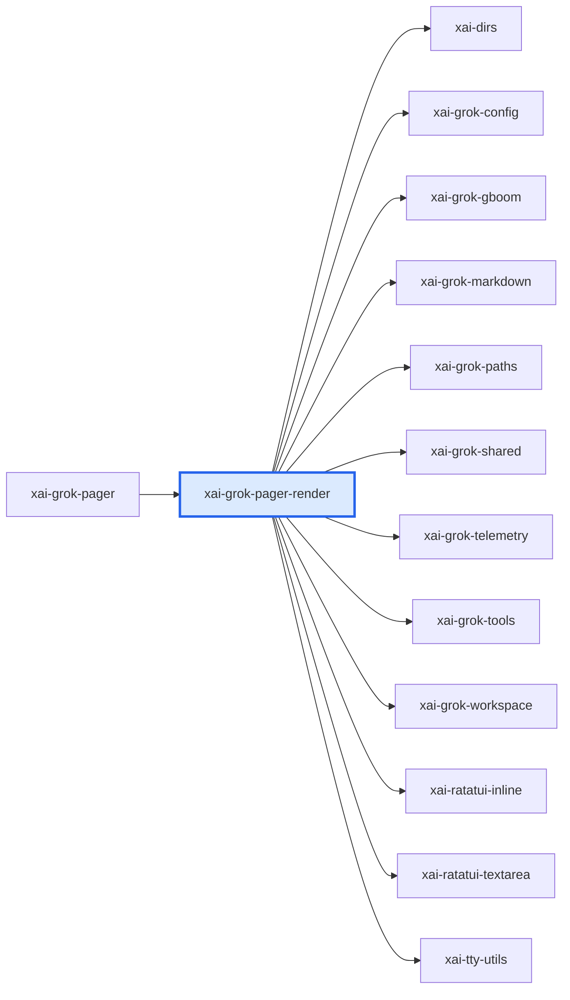

# xai-grok-pager-render：模块详解

[返回十模块索引](README.md) · [返回全仓总览](../grok-build%20%E6%A8%A1%E5%9D%97%E6%80%BB%E8%A7%88%EF%BC%88%E8%87%AA%E5%8A%A8%E7%94%9F%E6%88%90%EF%BC%89.md)

> 自动统计 + 源码阅读说明。修改 scripts/grok-module-notes-*.json 中的解读，运行 `pnpm run arch:grok:details` 更新。

从 pager 抽出的终端呈现原语层：theme/appearance、键鼠正规化、terminal capability、clipboard、图片/视频 overlay、滚动条、文本折行和 frame writer。它不是业务面板库。

## 源码版本与统计口径

- grok-build SOURCE_REV：`c4ea71cfdbcdb21e32e41bc25a0043d7d4836714`；解读审阅基于 `c4ea71cfdbcdb21e32e41bc25a0043d7d4836714`。
- Rust 源码及 Cargo.toml 指纹：`96080f3b2f79e0d47e2ea7899a0863d04152552d20758f3de31ccdf8f3b07fbe`。
- raw LOC 是物理行；source LOC 是去注释后的非空行，保留字符串内容。扫描全部 crate 下 .rs，排除 target/ 和 fuzz/，不展开 feature、宏或 include。
- 下表分类按路径互斥分桶；实现路径可能含 #[cfg(test)] 内嵌测试，不能把这一列当成纯生产代码。场景 YAML、提示词 Markdown、快照等非 Rust 资产另见下文。
- 依赖方向 A → B 表示 A 的 Cargo 清单依赖 B，含 build/target/optional 的静态并集，不含 dev-dependencies；不是运行时调用图。
- 调用链文字是源码阅读结果，引用检查只验证文件/符号存在。本次没有执行 grok 二进制、Rust 测试或浏览器业务验收。

| 类别 | .rs 文件 | source LOC | raw LOC |
|---|---|---|---|
| 实现路径（可含内嵌测试） | 75 | 29,075 | 36,415 |
| 独立测试路径 | 4 | 3,490 | 4,138 |
| 基准路径 | 0 | 0 | 0 |
| 示例路径 | 0 | 0 | 0 |
| 总计 | 79 | 32,565 | 40,553 |

## 职责边界

**本模块负责**

- 终端能力探测与输入正规化
- theme 与 appearance 配置
- 绘制原语、文本/媒体 overlay、clipboard 路由

**协作边界**

- 会话状态、Action/Effect、模型问答/权限决策
- 具体业务 modal 的生命周期

## 入口与导出

| 类型 | 名称 | 真实入口 |
|---|---|---|
| library | `xai_grok_pager_render` | [src/lib.rs](../../../grok-build/crates/codegen/xai-grok-pager-render/src/lib.rs) |

库入口的词法 `mod` 声明（可能受 cfg 控制）：`appearance`、`clipboard`、`glyphs`、`host`、`input`、`link_opener`、`modal_window_state`、`prompt_images`、`render`、`search`、`syntax`、`terminal`、`theme`、`util`。

## 内部怎么拆：职责与源码

| 子系统 | 做什么 | 阅读入口 | 入口覆盖 .rs | source LOC | raw LOC |
|---|---|---|---|---|---|
| src/appearance/ | AppearanceConfig、原始配置解析、缓存、watcher、滚动/选择/mermaid 开关。 | [src/appearance/](../../../grok-build/crates/codegen/xai-grok-pager-render/src/appearance) | 9 | 3,366 | 4,388 |
| src/input/ | 键盘 modifier 探测和归一化、行编辑、鼠标滚动。 | [src/input/](../../../grok-build/crates/codegen/xai-grok-pager-render/src/input) | 9 | 3,790 | 4,669 |
| src/terminal/ | terminal/multiplexer 识别、keyboard/image/hyperlink capability 与 overlay escape 序列。 | [src/terminal/](../../../grok-build/crates/codegen/xai-grok-pager-render/src/terminal) | 15 | 5,001 | 6,297 |
| src/render/ | draw frame、折行、ANSI 终端输出、图片/视频/preview overlay、scrollbar。 | [src/render/](../../../grok-build/crates/codegen/xai-grok-pager-render/src/render) | 20 | 8,098 | 9,713 |
| src/theme/ | 主题定义、系统明暗外观、颜色能力和缓存。 | [src/theme/](../../../grok-build/crates/codegen/xai-grok-pager-render/src/theme) | 13 | 4,105 | 5,267 |
| src/clipboard/ | 本地/OSC52 clipboard 探测、信任和复制路由。 | [src/clipboard/](../../../grok-build/crates/codegen/xai-grok-pager-render/src/clipboard) | 2 | 2,410 | 2,885 |

上表行数仅覆盖该行首个阅读入口的文件/目录，入口可能重叠；下表按 src 一级目录及 tests/benches 等桶互斥统计，可以相加。

## 目录体积

| 目录桶 | .rs | source LOC | raw LOC | 其中独立测试 source LOC |
|---|---|---|---|---|
| src/render | 20 | 8,098 | 9,713 | 231 |
| src/（根文件） | 7 | 5,073 | 6,476 | 0 |
| src/terminal | 15 | 5,001 | 6,297 | 1,838 |
| src/theme | 13 | 4,105 | 5,267 | 0 |
| src/input | 9 | 3,790 | 4,669 | 1,421 |
| src/appearance | 9 | 3,366 | 4,388 | 0 |
| src/clipboard | 2 | 2,410 | 2,885 | 0 |
| src/host | 2 | 587 | 686 | 0 |
| src/search | 2 | 135 | 172 | 0 |

## 关键链路与源码阅读路径

### 终端一帧呈现

1. [load](../../../grok-build/crates/codegen/xai-grok-pager-render/src/appearance/cache.rs#L60)：读取运行时 UI 配置缓存。
2. [Theme](../../../grok-build/crates/codegen/xai-grok-pager-render/src/theme/tokyonight.rs#L46)：把已解析外观提供给视图层。
3. [draw_frame](../../../grok-build/crates/codegen/xai-grok-pager-render/src/render/draw.rs#L499)：把 Ratatui buffer 写到终端。

### 终端输入到可用事件

1. [TerminalContext](../../../grok-build/crates/codegen/xai-grok-pager-render/src/terminal/mod.rs#L220)：描述终端及 multiplexer 环境。
2. [KeyboardNormalizer](../../../grok-build/crates/codegen/xai-grok-pager-render/src/input/keyboard_normalizer.rs#L42)：根据探测到的 modifier 行为标准化按键。
3. [MouseScrollState](../../../grok-build/crates/codegen/xai-grok-pager-render/src/input/mouse.rs#L531)：维护滚动事件的状态和调试摘要。

## 直接依赖与被依赖

图中的每条边都来自 Cargo 扫描；边界内的可选依赖可能仅在特定构建配置启用。

**本模块依赖（12）**

| crate | Cargo 用途/模块说明 |
|---|---|
| `xai-dirs` | Home-directory resolution generally: USERPROFILE-first home_dir, plus grok-home ($GROK_HOME or <home>/.grok) |
| `xai-grok-config` | Shared config loading for Grok — grok_home, effective config (requirements > user > managed), TOML merge |
| `xai-grok-gboom` | The /gboom easter-egg raycaster game for the grok CLI pager |
| `xai-grok-markdown` | Streaming markdown renderer for terminal UIs |
| `xai-grok-paths` | Type-safe path wrappers for absolute and relative UTF-8 paths |
| `xai-grok-shared` | Shared utilities used by both `xai-grok-shell` and its downstream clients (e.g. `xai-grok-pager-render`). |
| `xai-grok-telemetry` | Telemetry engine: product events + Mixpanel emission + Sentry error reporting for Grok Build sessions |
| `xai-grok-tools` | Grok tools library |
| `xai-grok-workspace` | Core host-local workspace library (FS, VCS, execution, discovery) for xai-grok-shell and remote sampler |
| `xai-ratatui-inline` | ratatui-inline |
| `xai-ratatui-textarea` | 根据 crate 名称和目录推断 |
| `xai-tty-utils` | Lightweight process-spawning utilities for TTY safety — detach from controlling terminal, suppress interactive pagers, process-group lifecycle |

**使用本模块（1）**

| crate | Cargo 用途/模块说明 |
|---|---|
| `xai-grok-pager` | xai-grok-pager |

## 测试依据与非 Rust 资产

| 独立测试文件 Top 8 | source LOC | raw LOC |
|---|---|---|
| [src/terminal/test.rs](../../../grok-build/crates/codegen/xai-grok-pager-render/src/terminal/test.rs) | 1,667 | 1,988 |
| [src/input/mouse/tests.rs](../../../grok-build/crates/codegen/xai-grok-pager-render/src/input/mouse/tests.rs) | 1,421 | 1,707 |
| [src/render/image_overlay/tests.rs](../../../grok-build/crates/codegen/xai-grok-pager-render/src/render/image_overlay/tests.rs) | 231 | 254 |
| [src/terminal/image/tests.rs](../../../grok-build/crates/codegen/xai-grok-pager-render/src/terminal/image/tests.rs) | 171 | 189 |

| 类型 | 文件数 | 示例（不计 Rust LOC） |
|---|---|---|
| .toml | 1 | [Cargo.toml](../../../grok-build/crates/codegen/xai-grok-pager-render/Cargo.toml) |

## 对 WhyBuddy 可以怎么用

- 把浏览器/终端能力探测、主题配置、输入正规化放到共享 runtime 层。
- 将媒体预览、滚动和可访问性原语与业务卡片解耦。

WhyBuddy 当前可对照的文件（路径存在不等于业务已经对齐）：

- [client/src/runtime/browser-runtime.ts](../../client/src/runtime/browser-runtime.ts)
- [client/src/components/sandbox/TerminalPreview.tsx](../../client/src/components/sandbox/TerminalPreview.tsx)
- [client/src/components/sandbox/ScreenshotPreview.tsx](../../client/src/components/sandbox/ScreenshotPreview.tsx)

- Ratatui Buffer/escape sequence 不可直接用于 Web；WhyBuddy 应把这层翻译成 browser capability、DOM/CSS 和 iframe 生命周期，而非移植 Rust renderer。
- pager-render 依赖 pager/workspace/tools 的类型，名字叫 render 但不是一个完全无依赖的 design system。
- 不要把它误当作浏览器 sandbox；它解决的是 TUI terminal 的兼容性。

## 建议阅读顺序

1. [src/appearance/](../../../grok-build/crates/codegen/xai-grok-pager-render/src/appearance)：AppearanceConfig、原始配置解析、缓存、watcher、滚动/选择/mermaid 开关。
2. [src/input/](../../../grok-build/crates/codegen/xai-grok-pager-render/src/input)：键盘 modifier 探测和归一化、行编辑、鼠标滚动。
3. [src/terminal/](../../../grok-build/crates/codegen/xai-grok-pager-render/src/terminal)：terminal/multiplexer 识别、keyboard/image/hyperlink capability 与 overlay escape 序列。
4. [src/render/](../../../grok-build/crates/codegen/xai-grok-pager-render/src/render)：draw frame、折行、ANSI 终端输出、图片/视频/preview overlay、scrollbar。
5. [src/theme/](../../../grok-build/crates/codegen/xai-grok-pager-render/src/theme)：主题定义、系统明暗外观、颜色能力和缓存。
6. [src/clipboard/](../../../grok-build/crates/codegen/xai-grok-pager-render/src/clipboard)：本地/OSC52 clipboard 探测、信任和复制路由。

## 大文件与完整 Rust 清单

先看实现路径的 Top 15；它们仍可能带内嵌测试。下面的完整清单包含所有统计文件，方便继续拆到单个组件。

| 实现路径 Top 15 | source LOC | raw LOC |
|---|---|---|
| [src/prompt_images.rs](../../../grok-build/crates/codegen/xai-grok-pager-render/src/prompt_images.rs) | 3,416 | 4,392 |
| [src/clipboard/mod.rs](../../../grok-build/crates/codegen/xai-grok-pager-render/src/clipboard/mod.rs) | 1,864 | 2,284 |
| [src/appearance/config.rs](../../../grok-build/crates/codegen/xai-grok-pager-render/src/appearance/config.rs) | 1,761 | 2,324 |
| [src/render/osc8.rs](../../../grok-build/crates/codegen/xai-grok-pager-render/src/render/osc8.rs) | 1,654 | 1,966 |
| [src/render/wrapping.rs](../../../grok-build/crates/codegen/xai-grok-pager-render/src/render/wrapping.rs) | 1,192 | 1,451 |
| [src/appearance/cache.rs](../../../grok-build/crates/codegen/xai-grok-pager-render/src/appearance/cache.rs) | 993 | 1,231 |
| [src/input/mouse.rs](../../../grok-build/crates/codegen/xai-grok-pager-render/src/input/mouse.rs) | 945 | 1,224 |
| [src/theme/mod.rs](../../../grok-build/crates/codegen/xai-grok-pager-render/src/theme/mod.rs) | 939 | 1,215 |
| [src/render/draw.rs](../../../grok-build/crates/codegen/xai-grok-pager-render/src/render/draw.rs) | 854 | 956 |
| [src/render/bidi.rs](../../../grok-build/crates/codegen/xai-grok-pager-render/src/render/bidi.rs) | 783 | 908 |
| [src/theme/cache.rs](../../../grok-build/crates/codegen/xai-grok-pager-render/src/theme/cache.rs) | 757 | 956 |
| [src/terminal/mod.rs](../../../grok-build/crates/codegen/xai-grok-pager-render/src/terminal/mod.rs) | 696 | 957 |
| [src/input/key.rs](../../../grok-build/crates/codegen/xai-grok-pager-render/src/input/key.rs) | 567 | 688 |
| [src/clipboard/trust.rs](../../../grok-build/crates/codegen/xai-grok-pager-render/src/clipboard/trust.rs) | 546 | 601 |
| [src/glyphs.rs](../../../grok-build/crates/codegen/xai-grok-pager-render/src/glyphs.rs) | 525 | 683 |

展开全部 79 个 Rust 文件

| 文件 | 类别 | source LOC | raw LOC |
|---|---|---|---|
| [src/appearance/cache.rs](../../../grok-build/crates/codegen/xai-grok-pager-render/src/appearance/cache.rs) | 实现路径（可含内嵌测试） | 993 | 1,231 |
| [src/appearance/config.rs](../../../grok-build/crates/codegen/xai-grok-pager-render/src/appearance/config.rs) | 实现路径（可含内嵌测试） | 1,761 | 2,324 |
| [src/appearance/follow_up_behavior.rs](../../../grok-build/crates/codegen/xai-grok-pager-render/src/appearance/follow_up_behavior.rs) | 实现路径（可含内嵌测试） | 49 | 68 |
| [src/appearance/mod.rs](../../../grok-build/crates/codegen/xai-grok-pager-render/src/appearance/mod.rs) | 实现路径（可含内嵌测试） | 34 | 59 |
| [src/appearance/permission_cursor.rs](../../../grok-build/crates/codegen/xai-grok-pager-render/src/appearance/permission_cursor.rs) | 实现路径（可含内嵌测试） | 325 | 419 |
| [src/appearance/render_mermaid.rs](../../../grok-build/crates/codegen/xai-grok-pager-render/src/appearance/render_mermaid.rs) | 实现路径（可含内嵌测试） | 48 | 69 |
| [src/appearance/scroll_mode.rs](../../../grok-build/crates/codegen/xai-grok-pager-render/src/appearance/scroll_mode.rs) | 实现路径（可含内嵌测试） | 45 | 65 |
| [src/appearance/text_selection.rs](../../../grok-build/crates/codegen/xai-grok-pager-render/src/appearance/text_selection.rs) | 实现路径（可含内嵌测试） | 68 | 99 |
| [src/appearance/watcher.rs](../../../grok-build/crates/codegen/xai-grok-pager-render/src/appearance/watcher.rs) | 实现路径（可含内嵌测试） | 43 | 54 |
| [src/clipboard/mod.rs](../../../grok-build/crates/codegen/xai-grok-pager-render/src/clipboard/mod.rs) | 实现路径（可含内嵌测试） | 1,864 | 2,284 |
| [src/clipboard/trust.rs](../../../grok-build/crates/codegen/xai-grok-pager-render/src/clipboard/trust.rs) | 实现路径（可含内嵌测试） | 546 | 601 |
| [src/glyphs.rs](../../../grok-build/crates/codegen/xai-grok-pager-render/src/glyphs.rs) | 实现路径（可含内嵌测试） | 525 | 683 |
| [src/host/display_refresh.rs](../../../grok-build/crates/codegen/xai-grok-pager-render/src/host/display_refresh.rs) | 实现路径（可含内嵌测试） | 434 | 503 |
| [src/host/mod.rs](../../../grok-build/crates/codegen/xai-grok-pager-render/src/host/mod.rs) | 实现路径（可含内嵌测试） | 153 | 183 |
| [src/input/key.rs](../../../grok-build/crates/codegen/xai-grok-pager-render/src/input/key.rs) | 实现路径（可含内嵌测试） | 567 | 688 |
| [src/input/keyboard_normalizer.rs](../../../grok-build/crates/codegen/xai-grok-pager-render/src/input/keyboard_normalizer.rs) | 实现路径（可含内嵌测试） | 253 | 296 |
| [src/input/line_editor.rs](../../../grok-build/crates/codegen/xai-grok-pager-render/src/input/line_editor.rs) | 实现路径（可含内嵌测试） | 274 | 304 |
| [src/input/macos_modifiers.rs](../../../grok-build/crates/codegen/xai-grok-pager-render/src/input/macos_modifiers.rs) | 实现路径（可含内嵌测试） | 33 | 49 |
| [src/input/mod.rs](../../../grok-build/crates/codegen/xai-grok-pager-render/src/input/mod.rs) | 实现路径（可含内嵌测试） | 13 | 14 |
| [src/input/mouse.rs](../../../grok-build/crates/codegen/xai-grok-pager-render/src/input/mouse.rs) | 实现路径（可含内嵌测试） | 945 | 1,224 |
| [src/input/mouse/tests.rs](../../../grok-build/crates/codegen/xai-grok-pager-render/src/input/mouse/tests.rs) | 独立测试路径 | 1,421 | 1,707 |
| [src/input/scroll_log.rs](../../../grok-build/crates/codegen/xai-grok-pager-render/src/input/scroll_log.rs) | 实现路径（可含内嵌测试） | 182 | 259 |
| [src/input/terminal_support.rs](../../../grok-build/crates/codegen/xai-grok-pager-render/src/input/terminal_support.rs) | 实现路径（可含内嵌测试） | 102 | 128 |
| [src/lib.rs](../../../grok-build/crates/codegen/xai-grok-pager-render/src/lib.rs) | 实现路径（可含内嵌测试） | 14 | 14 |
| [src/link_opener.rs](../../../grok-build/crates/codegen/xai-grok-pager-render/src/link_opener.rs) | 实现路径（可含内嵌测试） | 477 | 596 |
| [src/modal_window_state.rs](../../../grok-build/crates/codegen/xai-grok-pager-render/src/modal_window_state.rs) | 实现路径（可含内嵌测试） | 47 | 80 |
| [src/prompt_images.rs](../../../grok-build/crates/codegen/xai-grok-pager-render/src/prompt_images.rs) | 实现路径（可含内嵌测试） | 3,416 | 4,392 |
| [src/render/bidi.rs](../../../grok-build/crates/codegen/xai-grok-pager-render/src/render/bidi.rs) | 实现路径（可含内嵌测试） | 783 | 908 |
| [src/render/color.rs](../../../grok-build/crates/codegen/xai-grok-pager-render/src/render/color.rs) | 实现路径（可含内嵌测试） | 510 | 650 |
| [src/render/draw.rs](../../../grok-build/crates/codegen/xai-grok-pager-render/src/render/draw.rs) | 实现路径（可含内嵌测试） | 854 | 956 |
| [src/render/gboom_overlay.rs](../../../grok-build/crates/codegen/xai-grok-pager-render/src/render/gboom_overlay.rs) | 实现路径（可含内嵌测试） | 136 | 166 |
| [src/render/highlight.rs](../../../grok-build/crates/codegen/xai-grok-pager-render/src/render/highlight.rs) | 实现路径（可含内嵌测试） | 75 | 85 |
| [src/render/image_overlay.rs](../../../grok-build/crates/codegen/xai-grok-pager-render/src/render/image_overlay.rs) | 实现路径（可含内嵌测试） | 187 | 222 |
| [src/render/image_overlay/content.rs](../../../grok-build/crates/codegen/xai-grok-pager-render/src/render/image_overlay/content.rs) | 实现路径（可含内嵌测试） | 72 | 78 |
| [src/render/image_overlay/geometry.rs](../../../grok-build/crates/codegen/xai-grok-pager-render/src/render/image_overlay/geometry.rs) | 实现路径（可含内嵌测试） | 90 | 101 |
| [src/render/image_overlay/tests.rs](../../../grok-build/crates/codegen/xai-grok-pager-render/src/render/image_overlay/tests.rs) | 独立测试路径 | 231 | 254 |
| [src/render/line_utils.rs](../../../grok-build/crates/codegen/xai-grok-pager-render/src/render/line_utils.rs) | 实现路径（可含内嵌测试） | 413 | 495 |
| [src/render/mod.rs](../../../grok-build/crates/codegen/xai-grok-pager-render/src/render/mod.rs) | 实现路径（可含内嵌测试） | 20 | 21 |
| [src/render/osc8.rs](../../../grok-build/crates/codegen/xai-grok-pager-render/src/render/osc8.rs) | 实现路径（可含内嵌测试） | 1,654 | 1,966 |
| [src/render/preview_overlay.rs](../../../grok-build/crates/codegen/xai-grok-pager-render/src/render/preview_overlay.rs) | 实现路径（可含内嵌测试） | 449 | 568 |
| [src/render/renderable.rs](../../../grok-build/crates/codegen/xai-grok-pager-render/src/render/renderable.rs) | 实现路径（可含内嵌测试） | 113 | 146 |
| [src/render/safe_buf.rs](../../../grok-build/crates/codegen/xai-grok-pager-render/src/render/safe_buf.rs) | 实现路径（可含内嵌测试） | 42 | 64 |
| [src/render/scrollbar.rs](../../../grok-build/crates/codegen/xai-grok-pager-render/src/render/scrollbar.rs) | 实现路径（可含内嵌测试） | 328 | 467 |
| [src/render/terminal_output.rs](../../../grok-build/crates/codegen/xai-grok-pager-render/src/render/terminal_output.rs) | 实现路径（可含内嵌测试） | 437 | 521 |
| [src/render/tool_paths.rs](../../../grok-build/crates/codegen/xai-grok-pager-render/src/render/tool_paths.rs) | 实现路径（可含内嵌测试） | 394 | 447 |
| [src/render/video_overlay.rs](../../../grok-build/crates/codegen/xai-grok-pager-render/src/render/video_overlay.rs) | 实现路径（可含内嵌测试） | 118 | 147 |
| [src/render/wrapping.rs](../../../grok-build/crates/codegen/xai-grok-pager-render/src/render/wrapping.rs) | 实现路径（可含内嵌测试） | 1,192 | 1,451 |
| [src/search/matcher.rs](../../../grok-build/crates/codegen/xai-grok-pager-render/src/search/matcher.rs) | 实现路径（可含内嵌测试） | 93 | 117 |
| [src/search/mod.rs](../../../grok-build/crates/codegen/xai-grok-pager-render/src/search/mod.rs) | 实现路径（可含内嵌测试） | 42 | 55 |
| [src/syntax.rs](../../../grok-build/crates/codegen/xai-grok-pager-render/src/syntax.rs) | 实现路径（可含内嵌测试） | 197 | 245 |
| [src/terminal/da2.rs](../../../grok-build/crates/codegen/xai-grok-pager-render/src/terminal/da2.rs) | 实现路径（可含内嵌测试） | 163 | 226 |
| [src/terminal/embedded_editor.rs](../../../grok-build/crates/codegen/xai-grok-pager-render/src/terminal/embedded_editor.rs) | 实现路径（可含内嵌测试） | 67 | 92 |
| [src/terminal/hyperlinks.rs](../../../grok-build/crates/codegen/xai-grok-pager-render/src/terminal/hyperlinks.rs) | 实现路径（可含内嵌测试） | 236 | 285 |
| [src/terminal/image.rs](../../../grok-build/crates/codegen/xai-grok-pager-render/src/terminal/image.rs) | 实现路径（可含内嵌测试） | 458 | 628 |
| [src/terminal/image/tests.rs](../../../grok-build/crates/codegen/xai-grok-pager-render/src/terminal/image/tests.rs) | 独立测试路径 | 171 | 189 |
| [src/terminal/keyboard.rs](../../../grok-build/crates/codegen/xai-grok-pager-render/src/terminal/keyboard.rs) | 实现路径（可含内嵌测试） | 149 | 196 |
| [src/terminal/kitty_keyboard.rs](../../../grok-build/crates/codegen/xai-grok-pager-render/src/terminal/kitty_keyboard.rs) | 实现路径（可含内嵌测试） | 70 | 129 |
| [src/terminal/mod.rs](../../../grok-build/crates/codegen/xai-grok-pager-render/src/terminal/mod.rs) | 实现路径（可含内嵌测试） | 696 | 957 |
| [src/terminal/overlay.rs](../../../grok-build/crates/codegen/xai-grok-pager-render/src/terminal/overlay.rs) | 实现路径（可含内嵌测试） | 341 | 392 |
| [src/terminal/probe.rs](../../../grok-build/crates/codegen/xai-grok-pager-render/src/terminal/probe.rs) | 实现路径（可含内嵌测试） | 114 | 149 |
| [src/terminal/term_version.rs](../../../grok-build/crates/codegen/xai-grok-pager-render/src/terminal/term_version.rs) | 实现路径（可含内嵌测试） | 263 | 338 |
| [src/terminal/test.rs](../../../grok-build/crates/codegen/xai-grok-pager-render/src/terminal/test.rs) | 独立测试路径 | 1,667 | 1,988 |
| [src/terminal/tmux.rs](../../../grok-build/crates/codegen/xai-grok-pager-render/src/terminal/tmux.rs) | 实现路径（可含内嵌测试） | 102 | 125 |
| [src/terminal/tmux_probe.rs](../../../grok-build/crates/codegen/xai-grok-pager-render/src/terminal/tmux_probe.rs) | 实现路径（可含内嵌测试） | 358 | 405 |
| [src/terminal/xtversion.rs](../../../grok-build/crates/codegen/xai-grok-pager-render/src/terminal/xtversion.rs) | 实现路径（可含内嵌测试） | 146 | 198 |
| [src/theme/cache.rs](../../../grok-build/crates/codegen/xai-grok-pager-render/src/theme/cache.rs) | 实现路径（可含内嵌测试） | 757 | 956 |
| [src/theme/color_support.rs](../../../grok-build/crates/codegen/xai-grok-pager-render/src/theme/color_support.rs) | 实现路径（可含内嵌测试） | 403 | 497 |
| [src/theme/env_appearance.rs](../../../grok-build/crates/codegen/xai-grok-pager-render/src/theme/env_appearance.rs) | 实现路径（可含内嵌测试） | 190 | 229 |
| [src/theme/grokday.rs](../../../grok-build/crates/codegen/xai-grok-pager-render/src/theme/grokday.rs) | 实现路径（可含内嵌测试） | 106 | 136 |
| [src/theme/groknight.rs](../../../grok-build/crates/codegen/xai-grok-pager-render/src/theme/groknight.rs) | 实现路径（可含内嵌测试） | 106 | 138 |
| [src/theme/md_style.rs](../../../grok-build/crates/codegen/xai-grok-pager-render/src/theme/md_style.rs) | 实现路径（可含内嵌测试） | 152 | 182 |
| [src/theme/mod.rs](../../../grok-build/crates/codegen/xai-grok-pager-render/src/theme/mod.rs) | 实现路径（可含内嵌测试） | 939 | 1,215 |
| [src/theme/osc11.rs](../../../grok-build/crates/codegen/xai-grok-pager-render/src/theme/osc11.rs) | 实现路径（可含内嵌测试） | 319 | 450 |
| [src/theme/oscura.rs](../../../grok-build/crates/codegen/xai-grok-pager-render/src/theme/oscura.rs) | 实现路径（可含内嵌测试） | 99 | 135 |
| [src/theme/rosepine.rs](../../../grok-build/crates/codegen/xai-grok-pager-render/src/theme/rosepine.rs) | 实现路径（可含内嵌测试） | 95 | 115 |
| [src/theme/system_appearance.rs](../../../grok-build/crates/codegen/xai-grok-pager-render/src/theme/system_appearance.rs) | 实现路径（可含内嵌测试） | 352 | 446 |
| [src/theme/terminal_default.rs](../../../grok-build/crates/codegen/xai-grok-pager-render/src/theme/terminal_default.rs) | 实现路径（可含内嵌测试） | 337 | 414 |
| [src/theme/tokyonight.rs](../../../grok-build/crates/codegen/xai-grok-pager-render/src/theme/tokyonight.rs) | 实现路径（可含内嵌测试） | 250 | 354 |
| [src/util.rs](../../../grok-build/crates/codegen/xai-grok-pager-render/src/util.rs) | 实现路径（可含内嵌测试） | 397 | 466 |

解读维护源：[grok-module-notes-ui.json](../../scripts/grok-module-notes-ui.json)。
