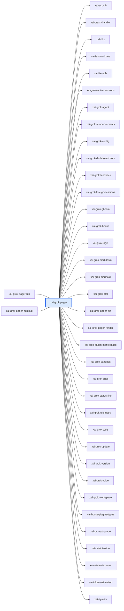

# xai-grok-pager：模块详解

[返回十模块索引](README.md) · [返回全仓总览](../grok-build%20%E6%A8%A1%E5%9D%97%E6%80%BB%E8%A7%88%EF%BC%88%E8%87%AA%E5%8A%A8%E7%94%9F%E6%88%90%EF%BC%89.md)

> 自动统计 + 源码阅读说明。修改 scripts/grok-module-notes-*.json 中的解读，运行 `pnpm run arch:grok:details` 更新。

Grok Build 的全屏终端 UI。它持有欢迎页、多个会话、每会话的滚动历史和交互卡片，并把终端输入和 ACP 通知变成同步状态更新与异步 Effect。README 明确描述为 scrollback、prompt、session management 和 modal dialogs 的交互界面。

## 源码版本与统计口径

- grok-build SOURCE_REV：`c4ea71cfdbcdb21e32e41bc25a0043d7d4836714`；解读审阅基于 `c4ea71cfdbcdb21e32e41bc25a0043d7d4836714`。
- Rust 源码及 Cargo.toml 指纹：`c23341e7ce80aad48078373bc74166c4d3d5f568e7e9baba6f3eb5faae89acac`。
- raw LOC 是物理行；source LOC 是去注释后的非空行，保留字符串内容。扫描全部 crate 下 .rs，排除 target/ 和 fuzz/，不展开 feature、宏或 include。
- 下表分类按路径互斥分桶；实现路径可能含 #[cfg(test)] 内嵌测试，不能把这一列当成纯生产代码。场景 YAML、提示词 Markdown、快照等非 Rust 资产另见下文。
- 依赖方向 A → B 表示 A 的 Cargo 清单依赖 B，含 build/target/optional 的静态并集，不含 dev-dependencies；不是运行时调用图。
- 调用链文字是源码阅读结果，引用检查只验证文件/符号存在。本次没有执行 grok 二进制、Rust 测试或浏览器业务验收。

| 类别 | .rs 文件 | source LOC | raw LOC |
|---|---|---|---|
| 实现路径（可含内嵌测试） | 457 | 299,175 | 352,618 |
| 独立测试路径 | 137 | 146,901 | 164,917 |
| 基准路径 | 4 | 849 | 1,043 |
| 示例路径 | 6 | 1,445 | 1,625 |
| 总计 | 604 | 448,370 | 520,203 |

## 职责边界

**本模块负责**

- TUI 状态和键鼠输入路由
- 视图状态、渲染组合、终端启动/退出
- Action 到 Effect 的纯同步分发
- ACP 客户端状态与通知显示

**协作边界**

- agent 运行、LLM 采样和会话持久化语义（xai-grok-shell）
- 工具定义和执行实现（xai-grok-tools）
- 共享绘制原语和终端能力探测（xai-grok-pager-render）

## 入口与导出

| 类型 | 名称 | 真实入口 |
|---|---|---|
| library | `xai_grok_pager` | [src/lib.rs](../../../grok-build/crates/codegen/xai-grok-pager/src/lib.rs) |

库入口的词法 `mod` 声明（可能受 cfg 控制）：`acp`、`actions`、`app`、`best_effort_stderr`、`client_identity`、`completions_cmd`、`config_toml_edit`、`diagnostics`、`disk_usage_cmd`、`docs`、`doctor_cmd`、`export_cmd`、`fs_size`、`git_info`、`headless`、`hyperlink_route`、`inline_media_ffmpeg`、`input_log`、`mcp_cmd`、`memory_cmd`、`memory_release`、`memory_trace`、`minimal_api`、`minimal_hook`、`models`、`notifications`、`obf`、`plugin_cmd`、`pty_wrap`、`recent_dirs`、`scrollback`、`sessions_cmd`、`settings`、`share_cmd`、`slash`、`startup`、`tips`、`tool_usage`、`tutorial_docs`、`usage_cmd`、`wrap_clipboard_image`、`wrap_cmd`、`wrap_filter`、`wrap_restore`、`test_util`、`trace_cmd`、`tracing`、`unified_log`、`views`、`voice`、`worktree_cmd`。

## 内部怎么拆：职责与源码

| 子系统 | 做什么 | 阅读入口 | 入口覆盖 .rs | source LOC | raw LOC |
|---|---|---|---|---|---|
| src/app/mod.rs | 应用入口和 terminal lifecycle；文件头给出 app、agent_view、app_view、dispatch、effects、acp_handler、event_loop 的责任边界。 | [src/app/mod.rs](../../../grok-build/crates/codegen/xai-grok-pager/src/app/mod.rs) | 1 | 2,440 | 2,644 |
| src/app/event_loop.rs | 薄 IO 循环；注释明确只处理 terminal event、ACP channel、task result、animation tick、热加载配置，把输入和状态交给 AppView。 | [src/app/event_loop.rs](../../../grok-build/crates/codegen/xai-grok-pager/src/app/event_loop.rs) | 1 | 5,721 | 6,943 |
| src/app/app_view.rs | 根视图模型，保有 active view、agent map、dashboard 和欢迎页状态；统一输入路由与最后绘制。 | [src/app/app_view.rs](../../../grok-build/crates/codegen/xai-grok-pager/src/app/app_view.rs) | 1 | 5,228 | 5,935 |
| src/app/agent_view/ | 每个 agent/session 的视图模型：prompt、scrollback、工具面板、交互卡、modal 和页面内输入。 | [src/app/agent_view/](../../../grok-build/crates/codegen/xai-grok-pager/src/app/agent_view) | 29 | 43,947 | 48,787 |
| src/app/dispatch/mod.rs | 纯同步 Action -> 状态变更 + Vec<Effect>；文件注释明示不能触碰 terminal、network 或 filesystem，因此可脱离 tokio/终端测试。 | [src/app/dispatch/mod.rs](../../../grok-build/crates/codegen/xai-grok-pager/src/app/dispatch/mod.rs) | 1 | 59 | 74 |
| src/app/actions.rs | 定义 Action、Effect 和 TaskResult；effects 子系统执行这些 Effect 并把完成结果送回 event loop。 | [src/app/actions.rs](../../../grok-build/crates/codegen/xai-grok-pager/src/app/actions.rs) | 1 | 2,158 | 3,178 |
| src/app/acp_handler/ | ACP notification 到本地 UI 状态的路由，包含 permissions、interactions、MCP、subagent lifecycle、settings 和 workflow ingest。 | [src/app/acp_handler/](../../../grok-build/crates/codegen/xai-grok-pager/src/app/acp_handler) | 38 | 23,439 | 26,667 |
| src/scrollback/ | 会话消息、工具输出和历史记录的渲染与缓存。 | [src/scrollback/](../../../grok-build/crates/codegen/xai-grok-pager/src/scrollback) | 56 | 42,673 | 53,249 |
| src/slash/registry.rs | slash command registry 与内置命令。 | [src/slash/registry.rs](../../../grok-build/crates/codegen/xai-grok-pager/src/slash/registry.rs) | 1 | 1,035 | 1,322 |

上表行数仅覆盖该行首个阅读入口的文件/目录，入口可能重叠；下表按 src 一级目录及 tests/benches 等桶互斥统计，可以相加。

## 目录体积

| 目录桶 | .rs | source LOC | raw LOC | 其中独立测试 source LOC |
|---|---|---|---|---|
| src/app | 205 | 210,030 | 235,658 | 88,285 |
| src/views | 124 | 122,499 | 146,410 | 29,401 |
| src/scrollback | 56 | 42,673 | 53,249 | 7,157 |
| src/slash | 78 | 12,857 | 15,439 | 966 |
| src/（根文件） | 41 | 12,629 | 15,057 | 1,299 |
| src/acp | 11 | 10,569 | 11,612 | 5,442 |
| src/diagnostics | 10 | 8,174 | 9,029 | 2,561 |
| tests | 8 | 6,706 | 8,016 | 6,706 |
| src/headless | 22 | 5,875 | 6,535 | 3,131 |
| src/notifications | 9 | 2,854 | 3,392 | 0 |
| src/settings | 3 | 2,798 | 3,295 | 0 |
| src/actions | 2 | 1,921 | 2,227 | 0 |
| src/doctor_cmd | 4 | 1,869 | 1,989 | 1,020 |
| src/disk_usage_cmd | 3 | 1,621 | 1,779 | 933 |
| src/tips | 11 | 1,473 | 1,930 | 0 |
| examples | 6 | 1,445 | 1,625 | 0 |
| benches | 4 | 849 | 1,043 | 0 |
| src/worktree_cmd | 2 | 767 | 784 | 0 |
| src/minimal | 2 | 583 | 865 | 0 |
| src/voice | 3 | 178 | 269 | 0 |

## 关键链路与源码阅读路径

### 全屏交互主链

1. [run](../../../grok-build/crates/codegen/xai-grok-pager/src/app/mod.rs#L660)：初始化终端、应用状态和 ACP/任务通道。
2. [run](../../../grok-build/crates/codegen/xai-grok-pager/src/app/event_loop.rs#L1144)：biased tokio select 接收终端、ACP、任务和 tick；本身只做 IO 编排。
3. [AppView::handle_input](../../../grok-build/crates/codegen/xai-grok-pager/src/app/app_view.rs#L2366)：按当前欢迎页、dashboard、agent 或 overlay 把键鼠事件交给拥有状态的视图。
4. [dispatch](../../../grok-build/crates/codegen/xai-grok-pager/src/app/dispatch/mod.rs#L59)：同步变更状态，返回 Effect；不直接执行外部副作用。
5. [AppView::draw](../../../grok-build/crates/codegen/xai-grok-pager/src/app/app_view.rs#L4386)：最终由根视图按 active view 组合 welcome、dashboard、agent 和 overlay。

### 模型发起的问答：请求、状态和回复

1. [handle_ask_user_question](../../../grok-build/crates/codegen/xai-grok-pager/src/app/acp_handler/interactions.rs#L91)：解析 AskUserQuestionExtRequest，找到对应 AgentView，替换旧问题时回复取消，并保存新的响应通道。Hook 阻塞提示走 turn_completion 的另一条本地卡路径。
2. [QuestionViewState::with_response_tx](../../../grok-build/crates/codegen/xai-grok-pager/src/views/question_view.rs#L213)：保存问题、选择和 oneshot 响应通道，让 UI 交互与待回复工具调用关联。
3. [QuestionViewState::build_accepted_response](../../../grok-build/crates/codegen/xai-grok-pager/src/views/question_view.rs#L799)：将选项、自由文本与用户补充组装成 Accepted 响应。
4. [QuestionViewState::send_ext_response](../../../grok-build/crates/codegen/xai-grok-pager/src/views/question_view.rs#L881)：通过保存的响应通道交回结构化答案；恢复工具调用由 ACP/shell 消费端完成。

### 计划批准：保持独立响应合同

1. [handle_exit_plan_mode](../../../grok-build/crates/codegen/xai-grok-pager/src/app/acp_handler/interactions.rs#L219)：接收计划审阅请求，处理遮挡与冲突，把计划卡安装到对应会话。
2. [PlanApprovalViewState::with_source](../../../grok-build/crates/codegen/xai-grok-pager/src/views/plan_approval_view.rs#L92)：保存计划来源、会话草稿和回复通道。
3. [PlanApprovalViewState::send_approved](../../../grok-build/crates/codegen/xai-grok-pager/src/views/plan_approval_view.rs#L181)：批准时生成 Approved；其他出口为 send_abandoned 和带反馈的 send_cancelled，不能都变成同一种错误。
4. [send_exit_plan_response](../../../grok-build/crates/codegen/xai-grok-pager/src/views/plan_approval_view.rs#L153)：序列化结构化回复交给 ACP；这条协议与问卷答案协议分别维护。

## 面板拆解索引：62 个 views 模块声明

这来自 views/mod.rs 实际声明，不是手填数量。包含主界面、交互卡、选择器和绘制辅助模块；一次声明不等于一个独立页面，也不等于已接到运行链路。

- src/app/app_view.rs: AppView 保存 welcome/dashboard/session picker 等根状态并在 draw 中选择视图
- src/app/agent_view/: AgentView 保存每 session 的 prompt、scrollback、question、plan approval、permission 等状态
- src/app/dispatch/: 将 Action 作用于上述状态；src/app/event_loop.rs 再调度 Effect

| 模块 | 做什么 | 拆分组 | 入口/声明 | .rs | source LOC | raw LOC |
|---|---|---|---|---|---|---|
| `agent` | 会话画面的区域布局、命中检测与叠层组合 | 会话主表面 | [src/views/agent.rs](../../../grok-build/crates/codegen/xai-grok-pager/src/views/agent.rs) / [声明](../../../grok-build/crates/codegen/xai-grok-pager/src/views/mod.rs#L1) | 1 | 2,041 | 2,130 |
| `agent_status` | 会话状态项的排版、右对齐与点击区域 | 其他视图/辅助 | [src/views/agent_status.rs](../../../grok-build/crates/codegen/xai-grok-pager/src/views/agent_status.rs) / [声明](../../../grok-build/crates/codegen/xai-grok-pager/src/views/mod.rs#L2) | 1 | 738 | 901 |
| `agents_modal` | 内置、用户、项目 Agent 定义的管理窗口 | 管理/设置类 modal | [src/views/agents_modal.rs](../../../grok-build/crates/codegen/xai-grok-pager/src/views/agents_modal.rs) / [声明](../../../grok-build/crates/codegen/xai-grok-pager/src/views/mod.rs#L3) | 1 | 3,327 | 3,438 |
| `announcements` | 单槽公告横幅，关键公告优先于推广信息 | 呈现 chrome | [src/views/announcements.rs](../../../grok-build/crates/codegen/xai-grok-pager/src/views/announcements.rs) / [声明](../../../grok-build/crates/codegen/xai-grok-pager/src/views/mod.rs#L4) | 1 | 1,225 | 1,525 |
| `block_viewer` | 消息块全屏阅读、搜索、选区和复制 | 其他视图/辅助 | [src/views/block_viewer/mod.rs](../../../grok-build/crates/codegen/xai-grok-pager/src/views/block_viewer/mod.rs) / [声明](../../../grok-build/crates/codegen/xai-grok-pager/src/views/mod.rs#L5) | 3 | 2,116 | 2,489 |
| `btw_overlay` | 对话旁支 /btw 问题及回答的小面板 | 其他视图/辅助 | [src/views/btw_overlay.rs](../../../grok-build/crates/codegen/xai-grok-pager/src/views/btw_overlay.rs) / [声明](../../../grok-build/crates/codegen/xai-grok-pager/src/views/mod.rs#L6) | 1 | 909 | 1,063 |
| `completion_dropdown` | Shell 命令补全候选列表 | 其他视图/辅助 | [src/views/completion_dropdown.rs](../../../grok-build/crates/codegen/xai-grok-pager/src/views/completion_dropdown.rs) / [声明](../../../grok-build/crates/codegen/xai-grok-pager/src/views/mod.rs#L7) | 1 | 377 | 444 |
| `context_bar` | 上下文 token 用量与百分比展示 | 呈现 chrome | [src/views/context_bar.rs](../../../grok-build/crates/codegen/xai-grok-pager/src/views/context_bar.rs) / [声明](../../../grok-build/crates/codegen/xai-grok-pager/src/views/mod.rs#L8) | 1 | 315 | 418 |
| `credit_bar` | 编码额度余额与消费状态 | 呈现 chrome | [src/views/credit_bar.rs](../../../grok-build/crates/codegen/xai-grok-pager/src/views/credit_bar.rs) / [声明](../../../grok-build/crates/codegen/xai-grok-pager/src/views/mod.rs#L9) | 1 | 623 | 782 |
| `dashboard` | 顶层 Agent 和子 Agent 的查看、附着及操作总览 | 会话主表面 | [src/views/dashboard/mod.rs](../../../grok-build/crates/codegen/xai-grok-pager/src/views/dashboard/mod.rs) / [声明](../../../grok-build/crates/codegen/xai-grok-pager/src/views/mod.rs#L10) | 17 | 22,480 | 26,751 |
| `debug_style` | 调试浮层使用的独立配色与外框 | 其他视图/辅助 | [src/views/debug_style.rs](../../../grok-build/crates/codegen/xai-grok-pager/src/views/debug_style.rs) / [声明](../../../grok-build/crates/codegen/xai-grok-pager/src/views/mod.rs#L11) | 1 | 60 | 86 |
| `dock` | 输入框上方合并停靠区；受 dock_enabled 开关控制 | 其他视图/辅助 | [src/views/dock/mod.rs](../../../grok-build/crates/codegen/xai-grok-pager/src/views/dock/mod.rs) / [声明](../../../grok-build/crates/codegen/xai-grok-pager/src/views/mod.rs#L12) | 2 | 2,153 | 2,479 |
| `elicitation_view` | MCP 表单或 URL 补充信息请求卡 | 模型交互卡 | [src/views/elicitation_view/mod.rs](../../../grok-build/crates/codegen/xai-grok-pager/src/views/elicitation_view/mod.rs) / [声明](../../../grok-build/crates/codegen/xai-grok-pager/src/views/mod.rs#L13) | 4 | 1,733 | 1,956 |
| `extensions_modal` | Hooks、插件、市场、Skills、Workflows 与 MCP 管理 | 管理/设置类 modal | [src/views/extensions_modal.rs](../../../grok-build/crates/codegen/xai-grok-pager/src/views/extensions_modal.rs) / [声明](../../../grok-build/crates/codegen/xai-grok-pager/src/views/mod.rs#L14) | 1 | 6,845 | 7,970 |
| `feedback_modal` | 反馈编辑器、草稿与分类选择 | 管理/设置类 modal | [src/views/feedback_modal/mod.rs](../../../grok-build/crates/codegen/xai-grok-pager/src/views/feedback_modal/mod.rs) / [声明](../../../grok-build/crates/codegen/xai-grok-pager/src/views/mod.rs#L15) | 5 | 3,534 | 4,051 |
| `file_search` | 输入框 @文件 的模糊搜索、候选与预览 | 导航和选择 | [src/views/file_search/mod.rs](../../../grok-build/crates/codegen/xai-grok-pager/src/views/file_search/mod.rs) / [声明](../../../grok-build/crates/codegen/xai-grok-pager/src/views/mod.rs#L16) | 5 | 2,495 | 3,263 |
| `fps_hud` | 帧率诊断浮层 | 呈现 chrome | [src/views/fps_hud.rs](../../../grok-build/crates/codegen/xai-grok-pager/src/views/fps_hud.rs) / [声明](../../../grok-build/crates/codegen/xai-grok-pager/src/views/mod.rs#L17) | 1 | 209 | 248 |
| `goal_detail` | 目标进度、token 预算、待办与历史详情 | 附属面板/状态 | [src/views/goal_detail.rs](../../../grok-build/crates/codegen/xai-grok-pager/src/views/goal_detail.rs) / [声明](../../../grok-build/crates/codegen/xai-grok-pager/src/views/mod.rs#L18) | 1 | 1,925 | 2,337 |
| `history_search` | 后台线程执行的输入历史模糊搜索 | 导航和选择 | [src/views/history_search.rs](../../../grok-build/crates/codegen/xai-grok-pager/src/views/history_search.rs) / [声明](../../../grok-build/crates/codegen/xai-grok-pager/src/views/mod.rs#L19) | 1 | 628 | 821 |
| `import_claude_modal` | 逐项审阅并选择要导入的 Claude 设置 | 管理/设置类 modal | [src/views/import_claude_modal.rs](../../../grok-build/crates/codegen/xai-grok-pager/src/views/import_claude_modal.rs) / [声明](../../../grok-build/crates/codegen/xai-grok-pager/src/views/mod.rs#L20) | 1 | 1,224 | 1,410 |
| `jump` | 按轮次定位历史消息的 /jump 选择器 | 导航和选择 | [src/views/jump.rs](../../../grok-build/crates/codegen/xai-grok-pager/src/views/jump.rs) / [声明](../../../grok-build/crates/codegen/xai-grok-pager/src/views/mod.rs#L21) | 1 | 205 | 250 |
| `list_pane` | 可滚动、可选择列表的通用状态与绘制原语 | 其他视图/辅助 | [src/views/list_pane/mod.rs](../../../grok-build/crates/codegen/xai-grok-pager/src/views/list_pane/mod.rs) / [声明](../../../grok-build/crates/codegen/xai-grok-pager/src/views/mod.rs#L22) | 6 | 5,040 | 7,130 |
| `location` | Git 分支、工作树标记和当前目录的共享位置行 | 其他视图/辅助 | [src/views/location.rs](../../../grok-build/crates/codegen/xai-grok-pager/src/views/location.rs) / [声明](../../../grok-build/crates/codegen/xai-grok-pager/src/views/mod.rs#L23) | 1 | 139 | 189 |
| `managed_connectors_wait` | 连接器授权页面打开后的等待、刷新与关闭界面 | 其他视图/辅助 | [src/views/managed_connectors_wait.rs](../../../grok-build/crates/codegen/xai-grok-pager/src/views/managed_connectors_wait.rs) / [声明](../../../grok-build/crates/codegen/xai-grok-pager/src/views/mod.rs#L24) | 1 | 155 | 195 |
| `mcps_modal` | MCP 服务器状态类型、响应转换和列表展示辅助 | 管理/设置类 modal | [src/views/mcps_modal.rs](../../../grok-build/crates/codegen/xai-grok-pager/src/views/mcps_modal.rs) / [声明](../../../grok-build/crates/codegen/xai-grok-pager/src/views/mod.rs#L25) | 1 | 702 | 801 |
| `memory_modal` | 记忆文件搜索列表与只读内容预览 | 管理/设置类 modal | [src/views/memory_modal.rs](../../../grok-build/crates/codegen/xai-grok-pager/src/views/memory_modal.rs) / [声明](../../../grok-build/crates/codegen/xai-grok-pager/src/views/mod.rs#L26) | 1 | 1,419 | 1,647 |
| `modal` | 保存到 AgentView 的模态窗口变体与统一路由 | 其他视图/辅助 | [src/views/modal.rs](../../../grok-build/crates/codegen/xai-grok-pager/src/views/modal.rs) / [声明](../../../grok-build/crates/codegen/xai-grok-pager/src/views/mod.rs#L27) | 1 | 1,453 | 1,596 |
| `modal_window` | 弹窗边框、标题、标签页、关闭及快捷键外壳 | 其他视图/辅助 | [src/views/modal_window.rs](../../../grok-build/crates/codegen/xai-grok-pager/src/views/modal_window.rs) / [声明](../../../grok-build/crates/codegen/xai-grok-pager/src/views/mod.rs#L28) | 1 | 1,568 | 1,946 |
| `new_worktree_dialog` | 创建工作树的交互对话框 | 其他视图/辅助 | [src/views/new_worktree_dialog.rs](../../../grok-build/crates/codegen/xai-grok-pager/src/views/new_worktree_dialog.rs) / [声明](../../../grok-build/crates/codegen/xai-grok-pager/src/views/mod.rs#L29) | 1 | 229 | 273 |
| `overlay` | 浮层可见、聚焦和全屏的共享状态机 | 其他视图/辅助 | [src/views/overlay.rs](../../../grok-build/crates/codegen/xai-grok-pager/src/views/overlay.rs) / [声明](../../../grok-build/crates/codegen/xai-grok-pager/src/views/mod.rs#L30) | 1 | 91 | 156 |
| `overlay_list` | 输入区列表叠层的统一行高、游标和命中区域 | 其他视图/辅助 | [src/views/overlay_list.rs](../../../grok-build/crates/codegen/xai-grok-pager/src/views/overlay_list.rs) / [声明](../../../grok-build/crates/codegen/xai-grok-pager/src/views/mod.rs#L31) | 1 | 201 | 256 |
| `permission_view` | 工具执行授权选项与用户决议卡 | 模型交互卡 | [src/views/permission_view.rs](../../../grok-build/crates/codegen/xai-grok-pager/src/views/permission_view.rs) / [声明](../../../grok-build/crates/codegen/xai-grok-pager/src/views/mod.rs#L32) | 1 | 2,674 | 2,917 |
| `persona_detail` | Persona 结构化详情与允许字段的就地编辑 | 其他视图/辅助 | [src/views/persona_detail.rs](../../../grok-build/crates/codegen/xai-grok-pager/src/views/persona_detail.rs) / [声明](../../../grok-build/crates/codegen/xai-grok-pager/src/views/mod.rs#L33) | 1 | 802 | 929 |
| `picker` | 全屏、弹窗等选择器的共享呈现辅助 | 导航和选择 | [src/views/picker.rs](../../../grok-build/crates/codegen/xai-grok-pager/src/views/picker.rs) / [声明](../../../grok-build/crates/codegen/xai-grok-pager/src/views/mod.rs#L34) | 1 | 3,305 | 3,993 |
| `plan_approval_view` | 计划预览、评论、批准、修改与退出的回复合同 | 模型交互卡 | [src/views/plan_approval_view.rs](../../../grok-build/crates/codegen/xai-grok-pager/src/views/plan_approval_view.rs) / [声明](../../../grok-build/crates/codegen/xai-grok-pager/src/views/mod.rs#L35) | 1 | 437 | 494 |
| `privacy_banner` | 代码数据共享提示横幅，受应用状态控制显示 | 呈现 chrome | [src/views/privacy_banner.rs](../../../grok-build/crates/codegen/xai-grok-pager/src/views/privacy_banner.rs) / [声明](../../../grok-build/crates/codegen/xai-grok-pager/src/views/mod.rs#L36) | 1 | 358 | 415 |
| `progress_bar` | 按终端能力绘制分数格进度条 | 呈现 chrome | [src/views/progress_bar.rs](../../../grok-build/crates/codegen/xai-grok-pager/src/views/progress_bar.rs) / [声明](../../../grok-build/crates/codegen/xai-grok-pager/src/views/mod.rs#L37) | 1 | 115 | 161 |
| `prompt_suggestion` | 轮次结束后预测下一条输入的灰色补全文本 | 其他视图/辅助 | [src/views/prompt_suggestion.rs](../../../grok-build/crates/codegen/xai-grok-pager/src/views/prompt_suggestion.rs) / [声明](../../../grok-build/crates/codegen/xai-grok-pager/src/views/mod.rs#L38) | 1 | 229 | 311 |
| `prompt_widget` | 多行编辑、输入与提交组件；焦点由外层管理 | 会话主表面 | [src/views/prompt_widget/mod.rs](../../../grok-build/crates/codegen/xai-grok-pager/src/views/prompt_widget/mod.rs) / [声明](../../../grok-build/crates/codegen/xai-grok-pager/src/views/mod.rs#L39) | 2 | 6,682 | 8,611 |
| `question_view` | 多题选项、Other 输入与结构化答案回复 | 模型交互卡 | [src/views/question_view.rs](../../../grok-build/crates/codegen/xai-grok-pager/src/views/question_view.rs) / [声明](../../../grok-build/crates/codegen/xai-grok-pager/src/views/mod.rs#L40) | 1 | 2,662 | 3,288 |
| `queue_pane` | 已排队用户输入的顺序与内容展示 | 附属面板/状态 | [src/views/queue_pane.rs](../../../grok-build/crates/codegen/xai-grok-pager/src/views/queue_pane.rs) / [声明](../../../grok-build/crates/codegen/xai-grok-pager/src/views/mod.rs#L41) | 1 | 1,567 | 2,040 |
| `rewind` | 会话回退选择与相关状态 | 导航和选择 | [src/views/rewind.rs](../../../grok-build/crates/codegen/xai-grok-pager/src/views/rewind.rs) / [声明](../../../grok-build/crates/codegen/xai-grok-pager/src/views/mod.rs#L42) | 1 | 801 | 873 |
| `scroll_debug_hud` | 滚动状态和视口诊断浮层 | 呈现 chrome | [src/views/scroll_debug_hud.rs](../../../grok-build/crates/codegen/xai-grok-pager/src/views/scroll_debug_hud.rs) / [声明](../../../grok-build/crates/codegen/xai-grok-pager/src/views/mod.rs#L43) | 1 | 180 | 231 |
| `session_picker` | 会话选择的数据类型、候选构建与索引映射 | 导航和选择 | [src/views/session_picker.rs](../../../grok-build/crates/codegen/xai-grok-pager/src/views/session_picker.rs) / [声明](../../../grok-build/crates/codegen/xai-grok-pager/src/views/mod.rs#L44) | 1 | 1,468 | 1,761 |
| `session_picker_surface` | 会话选择界面的表面布局与交互状态 | 导航和选择 | [src/views/session_picker_surface.rs](../../../grok-build/crates/codegen/xai-grok-pager/src/views/session_picker_surface.rs) / [声明](../../../grok-build/crates/codegen/xai-grok-pager/src/views/mod.rs#L45) | 1 | 232 | 256 |
| `session_title` | 用户重命名、自动标题等会话展示名的优先级 | 其他视图/辅助 | [src/views/session_title.rs](../../../grok-build/crates/codegen/xai-grok-pager/src/views/session_title.rs) / [声明](../../../grok-build/crates/codegen/xai-grok-pager/src/views/mod.rs#L46) | 1 | 319 | 390 |
| `settings_modal` | 设置浏览、开关、选择与编辑模式的状态机 | 管理/设置类 modal | [src/views/settings_modal/mod.rs](../../../grok-build/crates/codegen/xai-grok-pager/src/views/settings_modal/mod.rs) / [声明](../../../grok-build/crates/codegen/xai-grok-pager/src/views/mod.rs#L47) | 5 | 10,614 | 12,655 |
| `shortcuts_bar` | 当前界面的动态快捷键提示与二次确认提示 | 呈现 chrome | [src/views/shortcuts_bar.rs](../../../grok-build/crates/codegen/xai-grok-pager/src/views/shortcuts_bar.rs) / [声明](../../../grok-build/crates/codegen/xai-grok-pager/src/views/mod.rs#L48) | 1 | 594 | 739 |
| `shortcuts_help` | 从 ActionRegistry 汇总的快捷键帮助窗口 | 其他视图/辅助 | [src/views/shortcuts_help.rs](../../../grok-build/crates/codegen/xai-grok-pager/src/views/shortcuts_help.rs) / [声明](../../../grok-build/crates/codegen/xai-grok-pager/src/views/mod.rs#L49) | 1 | 1,212 | 1,464 |
| `slash_dropdown` | Slash 命令及其参数候选列表 | 导航和选择 | [src/views/slash_dropdown.rs](../../../grok-build/crates/codegen/xai-grok-pager/src/views/slash_dropdown.rs) / [声明](../../../grok-build/crates/codegen/xai-grok-pager/src/views/mod.rs#L50) | 1 | 771 | 943 |
| `status_bar` | 会话底部状态栏的组合呈现 | 呈现 chrome | [src/views/status_bar.rs](../../../grok-build/crates/codegen/xai-grok-pager/src/views/status_bar.rs) / [声明](../../../grok-build/crates/codegen/xai-grok-pager/src/views/mod.rs#L51) | 1 | 61 | 83 |
| `status_line` | 状态行脚本文本的清理、内置片段和链接区域 | 附属面板/状态 | [src/views/status_line/mod.rs](../../../grok-build/crates/codegen/xai-grok-pager/src/views/status_line/mod.rs) / [声明](../../../grok-build/crates/codegen/xai-grok-pager/src/views/mod.rs#L52) | 6 | 878 | 1,076 |
| `subagent_catalog_pane` | Personas、Roles、Agents 的只读分类目录 | 附属面板/状态 | [src/views/subagent_catalog_pane.rs](../../../grok-build/crates/codegen/xai-grok-pager/src/views/subagent_catalog_pane.rs) / [声明](../../../grok-build/crates/codegen/xai-grok-pager/src/views/mod.rs#L53) | 1 | 429 | 515 |
| `suggestion_controller` | Shell 命令建议的灰字、逐字匹配与 ACP 接入 | 其他视图/辅助 | [src/views/suggestion_controller/mod.rs](../../../grok-build/crates/codegen/xai-grok-pager/src/views/suggestion_controller/mod.rs) / [声明](../../../grok-build/crates/codegen/xai-grok-pager/src/views/mod.rs#L54) | 2 | 1,774 | 2,259 |
| `tasks_pane` | 后台任务与子 Agent 混合列表，运行中优先展示 | 附属面板/状态 | [src/views/tasks_pane.rs](../../../grok-build/crates/codegen/xai-grok-pager/src/views/tasks_pane.rs) / [声明](../../../grok-build/crates/codegen/xai-grok-pager/src/views/mod.rs#L55) | 1 | 2,743 | 3,230 |
| `timeline` | 按会话轮次定位的侧边时间刻度 | 附属面板/状态 | [src/views/timeline.rs](../../../grok-build/crates/codegen/xai-grok-pager/src/views/timeline.rs) / [声明](../../../grok-build/crates/codegen/xai-grok-pager/src/views/mod.rs#L56) | 1 | 410 | 517 |
| `todo_pane` | 工具协议 TodoItem 的列表呈现 | 附属面板/状态 | [src/views/todo_pane.rs](../../../grok-build/crates/codegen/xai-grok-pager/src/views/todo_pane.rs) / [声明](../../../grok-build/crates/codegen/xai-grok-pager/src/views/mod.rs#L57) | 1 | 344 | 472 |
| `turn_status` | 当前轮次活动、耗时、输出量与停止入口 | 呈现 chrome | [src/views/turn_status.rs](../../../grok-build/crates/codegen/xai-grok-pager/src/views/turn_status.rs) / [声明](../../../grok-build/crates/codegen/xai-grok-pager/src/views/mod.rs#L58) | 1 | 1,334 | 1,632 |
| `tutorial` | 教程主题列表与内容阅读的引导窗口 | 其他视图/辅助 | [src/views/tutorial.rs](../../../grok-build/crates/codegen/xai-grok-pager/src/views/tutorial.rs) / [声明](../../../grok-build/crates/codegen/xai-grok-pager/src/views/mod.rs#L59) | 1 | 580 | 679 |
| `usage_modal` | 用量、会话信息与上下文信息的标签页窗口 | 管理/设置类 modal | [src/views/usage_modal.rs](../../../grok-build/crates/codegen/xai-grok-pager/src/views/usage_modal.rs) / [声明](../../../grok-build/crates/codegen/xai-grok-pager/src/views/mod.rs#L60) | 1 | 1,417 | 1,593 |
| `welcome` | 欢迎页、工作目录、菜单、输入与提示布局 | 其他视图/辅助 | [src/views/welcome/mod.rs](../../../grok-build/crates/codegen/xai-grok-pager/src/views/welcome/mod.rs) / [声明](../../../grok-build/crates/codegen/xai-grok-pager/src/views/mod.rs#L61) | 10 | 6,769 | 7,930 |
| `workflows` | 工作流列表与执行状态的视图支持 | 附属面板/状态 | [src/views/workflows.rs](../../../grok-build/crates/codegen/xai-grok-pager/src/views/workflows.rs) / [声明](../../../grok-build/crates/codegen/xai-grok-pager/src/views/mod.rs#L62) | 1 | 1,725 | 1,834 |

| 建议一起拆的组 | 为什么要一起读 |
|---|---|
| 会话主表面 | AppView/AgentView 的长期状态拥有者；不应当被拆成只会画 UI 的无状态组件。 |
| 模型交互卡 | 都需要阻止或恢复 turn，必须带着 state、输入处理和结果协议一起拆；不能只搬 render 函数。 |
| 管理/设置类 modal | 适合按业务域拆；每个模块通常包含 State、render、键鼠 handler 与 dispatch Action。 |
| 导航和选择 | 共享筛选、焦点、按键语义，拆分时应保留选择器状态与命令来源。 |
| 附属面板/状态 | 由主会话状态投影；应以只读 selector + 呈现层接入，而不是各自改写会话状态。 |
| 呈现 chrome | 通常没有完整业务生命周期，可作为可复用显示组件，但仍要保留应用层输入/开关来源。 |

## 直接依赖与被依赖

图中的每条边都来自 Cargo 扫描；边界内的可选依赖可能仅在特定构建配置启用。

**本模块依赖（36）**

| crate | Cargo 用途/模块说明 |
|---|---|
| `xai-acp-lib` | 根据 crate 名称和目录推断 |
| `xai-crash-handler` | Cross-platform crash handler (Unix signals + Windows SEH) with startup crash detection |
| `xai-dirs` | Home-directory resolution generally: USERPROFILE-first home_dir, plus grok-home ($GROK_HOME or <home>/.grok) |
| `xai-fast-worktree` | High-performance git worktree creation using CoW cloning |
| `xai-file-utils` | Local data collection: upload queueing and blob storage |
| `xai-grok-active-sessions` | Crash-recovery registry of open TUI sessions, stored as a lock-guarded JSON file under the grok home |
| `xai-grok-agent` | Agent builder, definition parsing, and system prompt assembly |
| `xai-grok-announcements` | Shared announcement types, persistence, and formatting for Grok CLI apps |
| `xai-grok-config` | Shared config loading for Grok — grok_home, effective config (requirements > user > managed), TOML merge |
| `xai-grok-dashboard-store` | SQLite-backed persistent dashboard workspace: membership, layout ranks, grouping |
| `xai-grok-feedback` | Shared feedback taxonomy, durable local draft storage, and the session trace archive builder for Grok Build |
| `xai-grok-foreign-sessions` | Bounded, metadata-only discovery of foreign coding-agent sessions |
| `xai-grok-gboom` | The /gboom easter-egg raycaster game for the grok CLI pager |
| `xai-grok-hooks` | Runtime hook system for Grok — file-based discovery, command execution, and policy enforcement |
| `xai-grok-login` | Authentication subsystem for the grok shell crate family: login flows, token refresh, credential providers, and auth storage. |
| `xai-grok-markdown` | Streaming markdown renderer for terminal UIs |
| `xai-grok-mermaid` | Render Mermaid diagram source to a rasterized PNG behind a swappable engine trait |
| `xai-grok-otel` | OpenTelemetry foundation for Grok Build: W3C trace-context propagation, the OTLP HTTP client, and the tracing->OTLP span layer/provider |
| `xai-grok-pager-diff` | Diff hunk construction for the Grok Build TUI |
| `xai-grok-pager-render` | 根据 crate 名称和目录推断 |
| `xai-grok-plugin-marketplace` | Provides marketplace source configuration and plugin discovery, indexed with a filesystem fallback. |
| `xai-grok-sandbox` | OS-level sandboxing for Grok Build using kernel primitives (Landlock/Seatbelt) via nono |
| `xai-grok-shell` | Grok |
| `xai-grok-status-line` | The status-line contract: the `[ui.status_line]` config a user writes and the payload the agent sends clients. |
| `xai-grok-telemetry` | Telemetry engine: product events + Mixpanel emission + Sentry error reporting for Grok Build sessions |
| `xai-grok-tools` | Grok tools library |
| `xai-grok-update` | 根据 crate 名称和目录推断 |
| `xai-grok-version` | Lockstepped grok CLI version. |
| `xai-grok-voice` | Voice dictation (streaming STT) for Grok Build CLI |
| `xai-grok-workspace` | Core host-local workspace library (FS, VCS, execution, discovery) for xai-grok-shell and remote sampler |
| `xai-hooks-plugins-types` | Shared DTO types for hooks/plugins ACP extensions (wire format only) |
| `xai-prompt-queue` | Shared prompt-queue wire types for xai-grok-shell and xai-grok-pager |
| `xai-ratatui-inline` | ratatui-inline |
| `xai-ratatui-textarea` | 根据 crate 名称和目录推断 |
| `xai-token-estimation` | Pure shared token-estimation primitives. |
| `xai-tty-utils` | Lightweight process-spawning utilities for TTY safety — detach from controlling terminal, suppress interactive pagers, process-group lifecycle |

**使用本模块（2）**

| crate | Cargo 用途/模块说明 |
|---|---|
| `xai-grok-pager-bin` | 根据 crate 名称和目录推断 |
| `xai-grok-pager-minimal` | Minimal (scrollback-native) render mode: `grok --minimal`. |

## 测试依据与非 Rust 资产

| 独立测试文件 Top 8 | source LOC | raw LOC |
|---|---|---|
| [src/app/dispatch/tests/dashboard.rs](../../../grok-build/crates/codegen/xai-grok-pager/src/app/dispatch/tests/dashboard.rs) | 7,779 | 8,088 |
| [src/app/app_view_tests.rs](../../../grok-build/crates/codegen/xai-grok-pager/src/app/app_view_tests.rs) | 6,764 | 6,956 |
| [src/views/settings_modal/tests.rs](../../../grok-build/crates/codegen/xai-grok-pager/src/views/settings_modal/tests.rs) | 6,423 | 7,633 |
| [tests/settings_e2e.rs](../../../grok-build/crates/codegen/xai-grok-pager/tests/settings_e2e.rs) | 6,380 | 7,596 |
| [src/views/dashboard/state_tests.rs](../../../grok-build/crates/codegen/xai-grok-pager/src/views/dashboard/state_tests.rs) | 5,146 | 6,175 |
| [src/acp/tracker_tests.rs](../../../grok-build/crates/codegen/xai-grok-pager/src/acp/tracker_tests.rs) | 4,919 | 5,072 |
| [src/app/dispatch/tests/prompt.rs](../../../grok-build/crates/codegen/xai-grok-pager/src/app/dispatch/tests/prompt.rs) | 4,387 | 5,200 |
| [src/views/dashboard/render_tests.rs](../../../grok-build/crates/codegen/xai-grok-pager/src/views/dashboard/render_tests.rs) | 3,922 | 4,464 |

| 类型 | 文件数 | 示例（不计 Rust LOC） |
|---|---|---|
| .json | 7 | [npm/grok/package.json](../../../grok-build/crates/codegen/xai-grok-pager/npm/grok/package.json)；[npm/grok-darwin-arm64/package.json](../../../grok-build/crates/codegen/xai-grok-pager/npm/grok-darwin-arm64/package.json)；[npm/grok-darwin-x64/package.json](../../../grok-build/crates/codegen/xai-grok-pager/npm/grok-darwin-x64/package.json) |
| .md | 48 | [benches/bench.md](../../../grok-build/crates/codegen/xai-grok-pager/benches/bench.md)；[docs/custom-hooks.md](../../../grok-build/crates/codegen/xai-grok-pager/docs/custom-hooks.md)；[docs/hooks-and-plugins.md](../../../grok-build/crates/codegen/xai-grok-pager/docs/hooks-and-plugins.md) |
| .snap | 11 | [src/app/snapshots/xai_grok_pager__app__status_blocks__tests__session_usage_block_absent_cost.snap](../../../grok-build/crates/codegen/xai-grok-pager/src/app/snapshots/xai_grok_pager__app__status_blocks__tests__session_usage_block_absent_cost.snap)；[src/app/snapshots/xai_grok_pager__app__status_blocks__tests__session_usage_block_full.snap](../../../grok-build/crates/codegen/xai-grok-pager/src/app/snapshots/xai_grok_pager__app__status_blocks__tests__session_usage_block_full.snap)；[src/scrollback/blocks/tool/snapshots/xai_grok_pager__scrollback__blocks__tool__edit__tests__diff_basic.snap](../../../grok-build/crates/codegen/xai-grok-pager/src/scrollback/blocks/tool/snapshots/xai_grok_pager__scrollback__blocks__tool__edit__tests__diff_basic.snap) |
| .toml | 1 | [Cargo.toml](../../../grok-build/crates/codegen/xai-grok-pager/Cargo.toml) |
| .txt | 2 | [assets/logo/logo05.txt](../../../grok-build/crates/codegen/xai-grok-pager/assets/logo/logo05.txt)；[assets/logo/logo07.txt](../../../grok-build/crates/codegen/xai-grok-pager/assets/logo/logo07.txt) |

## 对 WhyBuddy 可以怎么用

- 用 Action/Effect 分界把 UI 状态变化和网络/SSE 副作用分开。
- 把问卷、计划批准、权限选择都当成会话暂停状态，而不是普通浮层。
- 建立面板注册表、状态拥有者和输入路由三张表；五十多个面板才能追踪到运行时入口。

WhyBuddy 当前可对照的文件（路径存在不等于业务已经对齐）：

- [client/src/pages/sliderule/QuestionnaireCard.tsx](../../client/src/pages/sliderule/QuestionnaireCard.tsx)
- [client/src/pages/sliderule/__tests__/questionnaire-session.test.tsx](../../client/src/pages/sliderule/__tests__/questionnaire-session.test.tsx)
- [slide-rule-python/services/rehearsal_control.py](../../slide-rule-python/services/rehearsal_control.py)
- [slide-rule-python/services/v5_session_driver.py](../../slide-rule-python/services/v5_session_driver.py)
- [slide-rule-python/tests/test_control_plan_approval.py](../../slide-rule-python/tests/test_control_plan_approval.py)
- [client/src/lib/__tests__/plan-approval-stream.test.ts](../../client/src/lib/__tests__/plan-approval-stream.test.ts)

- Grok pager 是 Ratatui TUI，WhyBuddy 是 React + SSE；可借状态机、协议和测试边界，不能复制终端渲染代码。
- 页面卡片必须接到 Python 控制面真实 park/resume 链路，而不能只加入前端组件。
- views/mod.rs 的导出不等于独立页面；一个视图还必须在 AppView 或 AgentView 中有状态、输入路由和 draw 调用。
- dispatch 的纯函数边界是 pager 可测的核心，直接把网络调用塞进卡片 handler 会破坏它。
- Question、plan approval、feedback modal 有抢占关系；只移植问卷 UI 会漏掉 turn 被阻塞和恢复的语义。

## 建议阅读顺序

1. [src/app/mod.rs](../../../grok-build/crates/codegen/xai-grok-pager/src/app/mod.rs)：应用入口和 terminal lifecycle；文件头给出 app、agent_view、app_view、dispatch、effects、acp_handler、event_loop 的责任边界。
2. [src/app/event_loop.rs](../../../grok-build/crates/codegen/xai-grok-pager/src/app/event_loop.rs)：薄 IO 循环；注释明确只处理 terminal event、ACP channel、task result、animation tick、热加载配置，把输入和状态交给 AppView。
3. [src/app/app_view.rs](../../../grok-build/crates/codegen/xai-grok-pager/src/app/app_view.rs)：根视图模型，保有 active view、agent map、dashboard 和欢迎页状态；统一输入路由与最后绘制。
4. [src/app/agent_view/](../../../grok-build/crates/codegen/xai-grok-pager/src/app/agent_view)：每个 agent/session 的视图模型：prompt、scrollback、工具面板、交互卡、modal 和页面内输入。
5. [src/app/dispatch/mod.rs](../../../grok-build/crates/codegen/xai-grok-pager/src/app/dispatch/mod.rs)：纯同步 Action -> 状态变更 + Vec<Effect>；文件注释明示不能触碰 terminal、network 或 filesystem，因此可脱离 tokio/终端测试。
6. [src/app/actions.rs](../../../grok-build/crates/codegen/xai-grok-pager/src/app/actions.rs)：定义 Action、Effect 和 TaskResult；effects 子系统执行这些 Effect 并把完成结果送回 event loop。
7. [src/app/acp_handler/](../../../grok-build/crates/codegen/xai-grok-pager/src/app/acp_handler)：ACP notification 到本地 UI 状态的路由，包含 permissions、interactions、MCP、subagent lifecycle、settings 和 workflow ingest。

## 大文件与完整 Rust 清单

先看实现路径的 Top 15；它们仍可能带内嵌测试。下面的完整清单包含所有统计文件，方便继续拆到单个组件。

| 实现路径 Top 15 | source LOC | raw LOC |
|---|---|---|
| [src/views/extensions_modal.rs](../../../grok-build/crates/codegen/xai-grok-pager/src/views/extensions_modal.rs) | 6,845 | 7,970 |
| [src/app/event_loop.rs](../../../grok-build/crates/codegen/xai-grok-pager/src/app/event_loop.rs) | 5,721 | 6,943 |
| [src/app/effects/mod.rs](../../../grok-build/crates/codegen/xai-grok-pager/src/app/effects/mod.rs) | 5,341 | 5,375 |
| [src/app/app_view.rs](../../../grok-build/crates/codegen/xai-grok-pager/src/app/app_view.rs) | 5,228 | 5,935 |
| [src/app/agent_view/render.rs](../../../grok-build/crates/codegen/xai-grok-pager/src/app/agent_view/render.rs) | 5,140 | 5,201 |
| [src/app/agent_view/modals.rs](../../../grok-build/crates/codegen/xai-grok-pager/src/app/agent_view/modals.rs) | 4,197 | 4,641 |
| [src/views/welcome/mod.rs](../../../grok-build/crates/codegen/xai-grok-pager/src/views/welcome/mod.rs) | 4,000 | 4,632 |
| [src/views/dashboard/state.rs](../../../grok-build/crates/codegen/xai-grok-pager/src/views/dashboard/state.rs) | 3,597 | 4,616 |
| [src/scrollback/text_selection.rs](../../../grok-build/crates/codegen/xai-grok-pager/src/scrollback/text_selection.rs) | 3,520 | 4,222 |
| [src/views/agents_modal.rs](../../../grok-build/crates/codegen/xai-grok-pager/src/views/agents_modal.rs) | 3,327 | 3,438 |
| [src/views/picker.rs](../../../grok-build/crates/codegen/xai-grok-pager/src/views/picker.rs) | 3,305 | 3,993 |
| [src/app/dispatch/queue.rs](../../../grok-build/crates/codegen/xai-grok-pager/src/app/dispatch/queue.rs) | 3,138 | 3,703 |
| [src/app/agent_view/selection.rs](../../../grok-build/crates/codegen/xai-grok-pager/src/app/agent_view/selection.rs) | 3,114 | 3,659 |
| [src/views/dashboard/render.rs](../../../grok-build/crates/codegen/xai-grok-pager/src/views/dashboard/render.rs) | 3,054 | 3,642 |
| [src/app/modals.rs](../../../grok-build/crates/codegen/xai-grok-pager/src/app/modals.rs) | 2,881 | 3,188 |

展开全部 604 个 Rust 文件

| 文件 | 类别 | source LOC | raw LOC |
|---|---|---|---|
| [benches/edit_highlight.rs](../../../grok-build/crates/codegen/xai-grok-pager/benches/edit_highlight.rs) | 基准路径 | 320 | 393 |
| [benches/render.rs](../../../grok-build/crates/codegen/xai-grok-pager/benches/render.rs) | 基准路径 | 281 | 347 |
| [benches/resize.rs](../../../grok-build/crates/codegen/xai-grok-pager/benches/resize.rs) | 基准路径 | 166 | 189 |
| [benches/search.rs](../../../grok-build/crates/codegen/xai-grok-pager/benches/search.rs) | 基准路径 | 82 | 114 |
| [examples/mermaid_playground.rs](../../../grok-build/crates/codegen/xai-grok-pager/examples/mermaid_playground.rs) | 示例路径 | 92 | 106 |
| [examples/mouse_events_playground.rs](../../../grok-build/crates/codegen/xai-grok-pager/examples/mouse_events_playground.rs) | 示例路径 | 159 | 173 |
| [examples/question_view_playground.rs](../../../grok-build/crates/codegen/xai-grok-pager/examples/question_view_playground.rs) | 示例路径 | 385 | 409 |
| [examples/scrollback_search_playground.rs](../../../grok-build/crates/codegen/xai-grok-pager/examples/scrollback_search_playground.rs) | 示例路径 | 219 | 264 |
| [examples/scrollback_selection_playground.rs](../../../grok-build/crates/codegen/xai-grok-pager/examples/scrollback_selection_playground.rs) | 示例路径 | 386 | 442 |
| [examples/todo_pane_playground.rs](../../../grok-build/crates/codegen/xai-grok-pager/examples/todo_pane_playground.rs) | 示例路径 | 204 | 231 |
| [src/acp/leader_bridge.rs](../../../grok-build/crates/codegen/xai-grok-pager/src/acp/leader_bridge.rs) | 实现路径（可含内嵌测试） | 372 | 451 |
| [src/acp/meta.rs](../../../grok-build/crates/codegen/xai-grok-pager/src/acp/meta.rs) | 实现路径（可含内嵌测试） | 150 | 219 |
| [src/acp/mod.rs](../../../grok-build/crates/codegen/xai-grok-pager/src/acp/mod.rs) | 实现路径（可含内嵌测试） | 913 | 1,025 |
| [src/acp/model_state.rs](../../../grok-build/crates/codegen/xai-grok-pager/src/acp/model_state.rs) | 实现路径（可含内嵌测试） | 447 | 538 |
| [src/acp/spawn.rs](../../../grok-build/crates/codegen/xai-grok-pager/src/acp/spawn.rs) | 实现路径（可含内嵌测试） | 553 | 714 |
| [src/acp/subagent_message.rs](../../../grok-build/crates/codegen/xai-grok-pager/src/acp/subagent_message.rs) | 实现路径（可含内嵌测试） | 103 | 116 |
| [src/acp/subagent_message_tests.rs](../../../grok-build/crates/codegen/xai-grok-pager/src/acp/subagent_message_tests.rs) | 独立测试路径 | 453 | 487 |
| [src/acp/tracker.rs](../../../grok-build/crates/codegen/xai-grok-pager/src/acp/tracker.rs) | 实现路径（可含内嵌测试） | 2,558 | 2,869 |
| [src/acp/tracker_tests.rs](../../../grok-build/crates/codegen/xai-grok-pager/src/acp/tracker_tests.rs) | 独立测试路径 | 4,919 | 5,072 |
| [src/acp/version_mismatch.rs](../../../grok-build/crates/codegen/xai-grok-pager/src/acp/version_mismatch.rs) | 实现路径（可含内嵌测试） | 31 | 45 |
| [src/acp/version_mismatch_tests.rs](../../../grok-build/crates/codegen/xai-grok-pager/src/acp/version_mismatch_tests.rs) | 独立测试路径 | 70 | 76 |
| [src/actions/defaults.rs](../../../grok-build/crates/codegen/xai-grok-pager/src/actions/defaults.rs) | 实现路径（可含内嵌测试） | 1,115 | 1,201 |
| [src/actions/mod.rs](../../../grok-build/crates/codegen/xai-grok-pager/src/actions/mod.rs) | 实现路径（可含内嵌测试） | 806 | 1,026 |
| [src/app/acp_handler/background.rs](../../../grok-build/crates/codegen/xai-grok-pager/src/app/acp_handler/background.rs) | 实现路径（可含内嵌测试） | 538 | 671 |
| [src/app/acp_handler/follow_ups.rs](../../../grok-build/crates/codegen/xai-grok-pager/src/app/acp_handler/follow_ups.rs) | 实现路径（可含内嵌测试） | 61 | 92 |
| [src/app/acp_handler/interactions.rs](../../../grok-build/crates/codegen/xai-grok-pager/src/app/acp_handler/interactions.rs) | 实现路径（可含内嵌测试） | 280 | 363 |
| [src/app/acp_handler/mcp.rs](../../../grok-build/crates/codegen/xai-grok-pager/src/app/acp_handler/mcp.rs) | 实现路径（可含内嵌测试） | 208 | 252 |
| [src/app/acp_handler/mod.rs](../../../grok-build/crates/codegen/xai-grok-pager/src/app/acp_handler/mod.rs) | 实现路径（可含内嵌测试） | 634 | 686 |
| [src/app/acp_handler/permissions.rs](../../../grok-build/crates/codegen/xai-grok-pager/src/app/acp_handler/permissions.rs) | 实现路径（可含内嵌测试） | 473 | 525 |
| [src/app/acp_handler/prompt_origin.rs](../../../grok-build/crates/codegen/xai-grok-pager/src/app/acp_handler/prompt_origin.rs) | 实现路径（可含内嵌测试） | 152 | 193 |
| [src/app/acp_handler/queue.rs](../../../grok-build/crates/codegen/xai-grok-pager/src/app/acp_handler/queue.rs) | 实现路径（可含内嵌测试） | 399 | 508 |
| [src/app/acp_handler/routing.rs](../../../grok-build/crates/codegen/xai-grok-pager/src/app/acp_handler/routing.rs) | 实现路径（可含内嵌测试） | 104 | 143 |
| [src/app/acp_handler/session_notification.rs](../../../grok-build/crates/codegen/xai-grok-pager/src/app/acp_handler/session_notification.rs) | 实现路径（可含内嵌测试） | 1,674 | 1,714 |
| [src/app/acp_handler/settings.rs](../../../grok-build/crates/codegen/xai-grok-pager/src/app/acp_handler/settings.rs) | 实现路径（可含内嵌测试） | 577 | 713 |
| [src/app/acp_handler/subagent_activity.rs](../../../grok-build/crates/codegen/xai-grok-pager/src/app/acp_handler/subagent_activity.rs) | 实现路径（可含内嵌测试） | 94 | 110 |
| [src/app/acp_handler/subagent_lifecycle.rs](../../../grok-build/crates/codegen/xai-grok-pager/src/app/acp_handler/subagent_lifecycle.rs) | 实现路径（可含内嵌测试） | 292 | 304 |
| [src/app/acp_handler/tests/announcements.rs](../../../grok-build/crates/codegen/xai-grok-pager/src/app/acp_handler/tests/announcements.rs) | 独立测试路径 | 195 | 230 |
| [src/app/acp_handler/tests/background_tasks.rs](../../../grok-build/crates/codegen/xai-grok-pager/src/app/acp_handler/tests/background_tasks.rs) | 独立测试路径 | 684 | 830 |
| [src/app/acp_handler/tests/follow_ups.rs](../../../grok-build/crates/codegen/xai-grok-pager/src/app/acp_handler/tests/follow_ups.rs) | 独立测试路径 | 270 | 304 |
| [src/app/acp_handler/tests/git_head.rs](../../../grok-build/crates/codegen/xai-grok-pager/src/app/acp_handler/tests/git_head.rs) | 独立测试路径 | 111 | 132 |
| [src/app/acp_handler/tests/goals.rs](../../../grok-build/crates/codegen/xai-grok-pager/src/app/acp_handler/tests/goals.rs) | 独立测试路径 | 588 | 668 |
| [src/app/acp_handler/tests/hooks.rs](../../../grok-build/crates/codegen/xai-grok-pager/src/app/acp_handler/tests/hooks.rs) | 独立测试路径 | 315 | 341 |
| [src/app/acp_handler/tests/interactions.rs](../../../grok-build/crates/codegen/xai-grok-pager/src/app/acp_handler/tests/interactions.rs) | 独立测试路径 | 928 | 1,062 |
| [src/app/acp_handler/tests/interjection.rs](../../../grok-build/crates/codegen/xai-grok-pager/src/app/acp_handler/tests/interjection.rs) | 独立测试路径 | 257 | 294 |
| [src/app/acp_handler/tests/mcp.rs](../../../grok-build/crates/codegen/xai-grok-pager/src/app/acp_handler/tests/mcp.rs) | 独立测试路径 | 583 | 707 |
| [src/app/acp_handler/tests/mod.rs](../../../grok-build/crates/codegen/xai-grok-pager/src/app/acp_handler/tests/mod.rs) | 独立测试路径 | 2,297 | 2,388 |
| [src/app/acp_handler/tests/models.rs](../../../grok-build/crates/codegen/xai-grok-pager/src/app/acp_handler/tests/models.rs) | 独立测试路径 | 308 | 366 |
| [src/app/acp_handler/tests/permissions.rs](../../../grok-build/crates/codegen/xai-grok-pager/src/app/acp_handler/tests/permissions.rs) | 独立测试路径 | 518 | 578 |
| [src/app/acp_handler/tests/plan_mode.rs](../../../grok-build/crates/codegen/xai-grok-pager/src/app/acp_handler/tests/plan_mode.rs) | 独立测试路径 | 389 | 449 |
| [src/app/acp_handler/tests/plugins.rs](../../../grok-build/crates/codegen/xai-grok-pager/src/app/acp_handler/tests/plugins.rs) | 独立测试路径 | 107 | 119 |
| [src/app/acp_handler/tests/queue_and_adoption.rs](../../../grok-build/crates/codegen/xai-grok-pager/src/app/acp_handler/tests/queue_and_adoption.rs) | 独立测试路径 | 2,228 | 2,660 |
| [src/app/acp_handler/tests/reconnect.rs](../../../grok-build/crates/codegen/xai-grok-pager/src/app/acp_handler/tests/reconnect.rs) | 独立测试路径 | 909 | 1,092 |
| [src/app/acp_handler/tests/scheduled_tasks.rs](../../../grok-build/crates/codegen/xai-grok-pager/src/app/acp_handler/tests/scheduled_tasks.rs) | 独立测试路径 | 489 | 563 |
| [src/app/acp_handler/tests/session_events.rs](../../../grok-build/crates/codegen/xai-grok-pager/src/app/acp_handler/tests/session_events.rs) | 独立测试路径 | 1,367 | 1,509 |
| [src/app/acp_handler/tests/session_routing.rs](../../../grok-build/crates/codegen/xai-grok-pager/src/app/acp_handler/tests/session_routing.rs) | 独立测试路径 | 241 | 292 |
| [src/app/acp_handler/tests/settings.rs](../../../grok-build/crates/codegen/xai-grok-pager/src/app/acp_handler/tests/settings.rs) | 独立测试路径 | 568 | 667 |
| [src/app/acp_handler/tests/subagent_attempt_lifecycle.rs](../../../grok-build/crates/codegen/xai-grok-pager/src/app/acp_handler/tests/subagent_attempt_lifecycle.rs) | 独立测试路径 | 484 | 540 |
| [src/app/acp_handler/tests/subagents.rs](../../../grok-build/crates/codegen/xai-grok-pager/src/app/acp_handler/tests/subagents.rs) | 独立测试路径 | 1,970 | 2,186 |
| [src/app/acp_handler/tests/turn_completion.rs](../../../grok-build/crates/codegen/xai-grok-pager/src/app/acp_handler/tests/turn_completion.rs) | 独立测试路径 | 1,790 | 2,040 |
| [src/app/acp_handler/tests/version_mismatch.rs](../../../grok-build/crates/codegen/xai-grok-pager/src/app/acp_handler/tests/version_mismatch.rs) | 独立测试路径 | 165 | 179 |
| [src/app/acp_handler/workflow_ingest.rs](../../../grok-build/crates/codegen/xai-grok-pager/src/app/acp_handler/workflow_ingest.rs) | 实现路径（可含内嵌测试） | 192 | 197 |
| [src/app/actions.rs](../../../grok-build/crates/codegen/xai-grok-pager/src/app/actions.rs) | 实现路径（可含内嵌测试） | 2,158 | 3,178 |
| [src/app/agent.rs](../../../grok-build/crates/codegen/xai-grok-pager/src/app/agent.rs) | 实现路径（可含内嵌测试） | 1,535 | 1,817 |
| [src/app/agent_view/cta.rs](../../../grok-build/crates/codegen/xai-grok-pager/src/app/agent_view/cta.rs) | 实现路径（可含内嵌测试） | 943 | 1,104 |
| [src/app/agent_view/dock_input_tests.rs](../../../grok-build/crates/codegen/xai-grok-pager/src/app/agent_view/dock_input_tests.rs) | 独立测试路径 | 1,684 | 1,858 |
| [src/app/agent_view/elicitation.rs](../../../grok-build/crates/codegen/xai-grok-pager/src/app/agent_view/elicitation.rs) | 实现路径（可含内嵌测试） | 396 | 444 |
| [src/app/agent_view/input.rs](../../../grok-build/crates/codegen/xai-grok-pager/src/app/agent_view/input.rs) | 实现路径（可含内嵌测试） | 2,599 | 2,675 |
| [src/app/agent_view/interactions.rs](../../../grok-build/crates/codegen/xai-grok-pager/src/app/agent_view/interactions.rs) | 实现路径（可含内嵌测试） | 2,406 | 2,499 |
| [src/app/agent_view/jump.rs](../../../grok-build/crates/codegen/xai-grok-pager/src/app/agent_view/jump.rs) | 实现路径（可含内嵌测试） | 138 | 168 |
| [src/app/agent_view/key_owner.rs](../../../grok-build/crates/codegen/xai-grok-pager/src/app/agent_view/key_owner.rs) | 实现路径（可含内嵌测试） | 206 | 268 |
| [src/app/agent_view/key_owner_tests.rs](../../../grok-build/crates/codegen/xai-grok-pager/src/app/agent_view/key_owner_tests.rs) | 独立测试路径 | 1,150 | 1,314 |
| [src/app/agent_view/links.rs](../../../grok-build/crates/codegen/xai-grok-pager/src/app/agent_view/links.rs) | 实现路径（可含内嵌测试） | 2,861 | 2,979 |
| [src/app/agent_view/media.rs](../../../grok-build/crates/codegen/xai-grok-pager/src/app/agent_view/media.rs) | 实现路径（可含内嵌测试） | 672 | 855 |
| [src/app/agent_view/mod.rs](../../../grok-build/crates/codegen/xai-grok-pager/src/app/agent_view/mod.rs) | 实现路径（可含内嵌测试） | 2,683 | 3,459 |
| [src/app/agent_view/modals.rs](../../../grok-build/crates/codegen/xai-grok-pager/src/app/agent_view/modals.rs) | 实现路径（可含内嵌测试） | 4,197 | 4,641 |
| [src/app/agent_view/notices.rs](../../../grok-build/crates/codegen/xai-grok-pager/src/app/agent_view/notices.rs) | 实现路径（可含内嵌测试） | 288 | 413 |
| [src/app/agent_view/panes.rs](../../../grok-build/crates/codegen/xai-grok-pager/src/app/agent_view/panes.rs) | 实现路径（可含内嵌测试） | 1,461 | 1,519 |
| [src/app/agent_view/paste.rs](../../../grok-build/crates/codegen/xai-grok-pager/src/app/agent_view/paste.rs) | 实现路径（可含内嵌测试） | 2,578 | 2,733 |
| [src/app/agent_view/plan.rs](../../../grok-build/crates/codegen/xai-grok-pager/src/app/agent_view/plan.rs) | 实现路径（可含内嵌测试） | 1,415 | 1,455 |
| [src/app/agent_view/prompt.rs](../../../grok-build/crates/codegen/xai-grok-pager/src/app/agent_view/prompt.rs) | 实现路径（可含内嵌测试） | 1,568 | 1,979 |
| [src/app/agent_view/prompt_stash.rs](../../../grok-build/crates/codegen/xai-grok-pager/src/app/agent_view/prompt_stash.rs) | 实现路径（可含内嵌测试） | 455 | 603 |
| [src/app/agent_view/queue.rs](../../../grok-build/crates/codegen/xai-grok-pager/src/app/agent_view/queue.rs) | 实现路径（可含内嵌测试） | 1,683 | 1,994 |
| [src/app/agent_view/render.rs](../../../grok-build/crates/codegen/xai-grok-pager/src/app/agent_view/render.rs) | 实现路径（可含内嵌测试） | 5,140 | 5,201 |
| [src/app/agent_view/rewind.rs](../../../grok-build/crates/codegen/xai-grok-pager/src/app/agent_view/rewind.rs) | 实现路径（可含内嵌测试） | 319 | 327 |
| [src/app/agent_view/selection.rs](../../../grok-build/crates/codegen/xai-grok-pager/src/app/agent_view/selection.rs) | 实现路径（可含内嵌测试） | 3,114 | 3,659 |
| [src/app/agent_view/session.rs](../../../grok-build/crates/codegen/xai-grok-pager/src/app/agent_view/session.rs) | 实现路径（可含内嵌测试） | 2,289 | 2,422 |
| [src/app/agent_view/shell_completion.rs](../../../grok-build/crates/codegen/xai-grok-pager/src/app/agent_view/shell_completion.rs) | 实现路径（可含内嵌测试） | 686 | 864 |
| [src/app/agent_view/task_icon_mouse_tests.rs](../../../grok-build/crates/codegen/xai-grok-pager/src/app/agent_view/task_icon_mouse_tests.rs) | 独立测试路径 | 302 | 319 |
| [src/app/agent_view/task_status_tests.rs](../../../grok-build/crates/codegen/xai-grok-pager/src/app/agent_view/task_status_tests.rs) | 独立测试路径 | 92 | 92 |
| [src/app/agent_view/viewer.rs](../../../grok-build/crates/codegen/xai-grok-pager/src/app/agent_view/viewer.rs) | 实现路径（可含内嵌测试） | 1,048 | 1,210 |
| [src/app/agent_view/viewer_tests.rs](../../../grok-build/crates/codegen/xai-grok-pager/src/app/agent_view/viewer_tests.rs) | 独立测试路径 | 887 | 988 |
| [src/app/agent_view/workflows_overlay.rs](../../../grok-build/crates/codegen/xai-grok-pager/src/app/agent_view/workflows_overlay.rs) | 实现路径（可含内嵌测试） | 687 | 745 |
| [src/app/app_view.rs](../../../grok-build/crates/codegen/xai-grok-pager/src/app/app_view.rs) | 实现路径（可含内嵌测试） | 5,228 | 5,935 |
| [src/app/app_view_tests.rs](../../../grok-build/crates/codegen/xai-grok-pager/src/app/app_view_tests.rs) | 独立测试路径 | 6,764 | 6,956 |
| [src/app/bundle.rs](../../../grok-build/crates/codegen/xai-grok-pager/src/app/bundle.rs) | 实现路径（可含内嵌测试） | 147 | 173 |
| [src/app/cancel_latency.rs](../../../grok-build/crates/codegen/xai-grok-pager/src/app/cancel_latency.rs) | 实现路径（可含内嵌测试） | 26 | 33 |
| [src/app/cli.rs](../../../grok-build/crates/codegen/xai-grok-pager/src/app/cli.rs) | 实现路径（可含内嵌测试） | 1,225 | 1,483 |
| [src/app/command_catalog.rs](../../../grok-build/crates/codegen/xai-grok-pager/src/app/command_catalog.rs) | 实现路径（可含内嵌测试） | 69 | 79 |
| [src/app/command_catalog_tests.rs](../../../grok-build/crates/codegen/xai-grok-pager/src/app/command_catalog_tests.rs) | 独立测试路径 | 19 | 21 |
| [src/app/connect_timeout.rs](../../../grok-build/crates/codegen/xai-grok-pager/src/app/connect_timeout.rs) | 实现路径（可含内嵌测试） | 72 | 87 |
| [src/app/consent.rs](../../../grok-build/crates/codegen/xai-grok-pager/src/app/consent.rs) | 实现路径（可含内嵌测试） | 435 | 581 |
| [src/app/consent_tests.rs](../../../grok-build/crates/codegen/xai-grok-pager/src/app/consent_tests.rs) | 独立测试路径 | 324 | 413 |
| [src/app/csi_filter.rs](../../../grok-build/crates/codegen/xai-grok-pager/src/app/csi_filter.rs) | 实现路径（可含内嵌测试） | 589 | 719 |
| [src/app/deferred_subagent_finishes.rs](../../../grok-build/crates/codegen/xai-grok-pager/src/app/deferred_subagent_finishes.rs) | 实现路径（可含内嵌测试） | 401 | 435 |
| [src/app/dispatch/auth.rs](../../../grok-build/crates/codegen/xai-grok-pager/src/app/dispatch/auth.rs) | 实现路径（可含内嵌测试） | 418 | 526 |
| [src/app/dispatch/billing.rs](../../../grok-build/crates/codegen/xai-grok-pager/src/app/dispatch/billing.rs) | 实现路径（可含内嵌测试） | 438 | 547 |
| [src/app/dispatch/cta.rs](../../../grok-build/crates/codegen/xai-grok-pager/src/app/dispatch/cta.rs) | 实现路径（可含内嵌测试） | 449 | 514 |
| [src/app/dispatch/ctx.rs](../../../grok-build/crates/codegen/xai-grok-pager/src/app/dispatch/ctx.rs) | 实现路径（可含内嵌测试） | 219 | 304 |
| [src/app/dispatch/dashboard.rs](../../../grok-build/crates/codegen/xai-grok-pager/src/app/dispatch/dashboard.rs) | 实现路径（可含内嵌测试） | 2,460 | 2,879 |
| [src/app/dispatch/dashboard_telemetry.rs](../../../grok-build/crates/codegen/xai-grok-pager/src/app/dispatch/dashboard_telemetry.rs) | 实现路径（可含内嵌测试） | 31 | 35 |
| [src/app/dispatch/external_editor.rs](../../../grok-build/crates/codegen/xai-grok-pager/src/app/dispatch/external_editor.rs) | 实现路径（可含内嵌测试） | 39 | 41 |
| [src/app/dispatch/import_claude.rs](../../../grok-build/crates/codegen/xai-grok-pager/src/app/dispatch/import_claude.rs) | 实现路径（可含内嵌测试） | 89 | 111 |
| [src/app/dispatch/inline_feedback.rs](../../../grok-build/crates/codegen/xai-grok-pager/src/app/dispatch/inline_feedback.rs) | 实现路径（可含内嵌测试） | 194 | 216 |
| [src/app/dispatch/interject.rs](../../../grok-build/crates/codegen/xai-grok-pager/src/app/dispatch/interject.rs) | 实现路径（可含内嵌测试） | 270 | 344 |
| [src/app/dispatch/jump.rs](../../../grok-build/crates/codegen/xai-grok-pager/src/app/dispatch/jump.rs) | 实现路径（可含内嵌测试） | 65 | 79 |
| [src/app/dispatch/mod.rs](../../../grok-build/crates/codegen/xai-grok-pager/src/app/dispatch/mod.rs) | 实现路径（可含内嵌测试） | 59 | 74 |
| [src/app/dispatch/modes.rs](../../../grok-build/crates/codegen/xai-grok-pager/src/app/dispatch/modes.rs) | 实现路径（可含内嵌测试） | 735 | 948 |
| [src/app/dispatch/notes.rs](../../../grok-build/crates/codegen/xai-grok-pager/src/app/dispatch/notes.rs) | 实现路径（可含内嵌测试） | 818 | 966 |
| [src/app/dispatch/permissions.rs](../../../grok-build/crates/codegen/xai-grok-pager/src/app/dispatch/permissions.rs) | 实现路径（可含内嵌测试） | 323 | 409 |
| [src/app/dispatch/prompt.rs](../../../grok-build/crates/codegen/xai-grok-pager/src/app/dispatch/prompt.rs) | 实现路径（可含内嵌测试） | 1,415 | 1,725 |
| [src/app/dispatch/prompt_ack.rs](../../../grok-build/crates/codegen/xai-grok-pager/src/app/dispatch/prompt_ack.rs) | 实现路径（可含内嵌测试） | 178 | 211 |
| [src/app/dispatch/queue.rs](../../../grok-build/crates/codegen/xai-grok-pager/src/app/dispatch/queue.rs) | 实现路径（可含内嵌测试） | 3,138 | 3,703 |
| [src/app/dispatch/rewind.rs](../../../grok-build/crates/codegen/xai-grok-pager/src/app/dispatch/rewind.rs) | 实现路径（可含内嵌测试） | 518 | 606 |
| [src/app/dispatch/router.rs](../../../grok-build/crates/codegen/xai-grok-pager/src/app/dispatch/router.rs) | 实现路径（可含内嵌测试） | 1,678 | 1,684 |
| [src/app/dispatch/session/foreign.rs](../../../grok-build/crates/codegen/xai-grok-pager/src/app/dispatch/session/foreign.rs) | 实现路径（可含内嵌测试） | 308 | 328 |
| [src/app/dispatch/session/fork.rs](../../../grok-build/crates/codegen/xai-grok-pager/src/app/dispatch/session/fork.rs) | 实现路径（可含内嵌测试） | 497 | 514 |
| [src/app/dispatch/session/lifecycle.rs](../../../grok-build/crates/codegen/xai-grok-pager/src/app/dispatch/session/lifecycle.rs) | 实现路径（可含内嵌测试） | 1,759 | 1,825 |
| [src/app/dispatch/session/load.rs](../../../grok-build/crates/codegen/xai-grok-pager/src/app/dispatch/session/load.rs) | 实现路径（可含内嵌测试） | 1,582 | 1,614 |
| [src/app/dispatch/session/mod.rs](../../../grok-build/crates/codegen/xai-grok-pager/src/app/dispatch/session/mod.rs) | 实现路径（可含内嵌测试） | 6 | 6 |
| [src/app/dispatch/session/modal.rs](../../../grok-build/crates/codegen/xai-grok-pager/src/app/dispatch/session/modal.rs) | 实现路径（可含内嵌测试） | 122 | 135 |
| [src/app/dispatch/session/picker_routing.rs](../../../grok-build/crates/codegen/xai-grok-pager/src/app/dispatch/session/picker_routing.rs) | 实现路径（可含内嵌测试） | 278 | 305 |
| [src/app/dispatch/settings/mod.rs](../../../grok-build/crates/codegen/xai-grok-pager/src/app/dispatch/settings/mod.rs) | 实现路径（可含内嵌测试） | 2 | 2 |
| [src/app/dispatch/settings/setters.rs](../../../grok-build/crates/codegen/xai-grok-pager/src/app/dispatch/settings/setters.rs) | 实现路径（可含内嵌测试） | 1,639 | 2,037 |
| [src/app/dispatch/settings/ui.rs](../../../grok-build/crates/codegen/xai-grok-pager/src/app/dispatch/settings/ui.rs) | 实现路径（可含内嵌测试） | 921 | 1,077 |
| [src/app/dispatch/status.rs](../../../grok-build/crates/codegen/xai-grok-pager/src/app/dispatch/status.rs) | 实现路径（可含内嵌测试） | 617 | 750 |
| [src/app/dispatch/task_result.rs](../../../grok-build/crates/codegen/xai-grok-pager/src/app/dispatch/task_result.rs) | 实现路径（可含内嵌测试） | 2,171 | 2,175 |
| [src/app/dispatch/tests/auth.rs](../../../grok-build/crates/codegen/xai-grok-pager/src/app/dispatch/tests/auth.rs) | 独立测试路径 | 698 | 794 |
| [src/app/dispatch/tests/billing.rs](../../../grok-build/crates/codegen/xai-grok-pager/src/app/dispatch/tests/billing.rs) | 独立测试路径 | 1,553 | 1,757 |
| [src/app/dispatch/tests/cta_e2e.rs](../../../grok-build/crates/codegen/xai-grok-pager/src/app/dispatch/tests/cta_e2e.rs) | 独立测试路径 | 1,975 | 2,128 |
| [src/app/dispatch/tests/dashboard.rs](../../../grok-build/crates/codegen/xai-grok-pager/src/app/dispatch/tests/dashboard.rs) | 独立测试路径 | 7,779 | 8,088 |
| [src/app/dispatch/tests/jump.rs](../../../grok-build/crates/codegen/xai-grok-pager/src/app/dispatch/tests/jump.rs) | 独立测试路径 | 388 | 474 |
| [src/app/dispatch/tests/mod.rs](../../../grok-build/crates/codegen/xai-grok-pager/src/app/dispatch/tests/mod.rs) | 独立测试路径 | 1,040 | 1,086 |
| [src/app/dispatch/tests/modes.rs](../../../grok-build/crates/codegen/xai-grok-pager/src/app/dispatch/tests/modes.rs) | 独立测试路径 | 1,853 | 2,277 |
| [src/app/dispatch/tests/notes.rs](../../../grok-build/crates/codegen/xai-grok-pager/src/app/dispatch/tests/notes.rs) | 独立测试路径 | 2,370 | 2,684 |
| [src/app/dispatch/tests/permissions.rs](../../../grok-build/crates/codegen/xai-grok-pager/src/app/dispatch/tests/permissions.rs) | 独立测试路径 | 582 | 722 |
| [src/app/dispatch/tests/prompt.rs](../../../grok-build/crates/codegen/xai-grok-pager/src/app/dispatch/tests/prompt.rs) | 独立测试路径 | 4,387 | 5,200 |
| [src/app/dispatch/tests/prompt_ack.rs](../../../grok-build/crates/codegen/xai-grok-pager/src/app/dispatch/tests/prompt_ack.rs) | 独立测试路径 | 248 | 265 |
| [src/app/dispatch/tests/queue_release.rs](../../../grok-build/crates/codegen/xai-grok-pager/src/app/dispatch/tests/queue_release.rs) | 独立测试路径 | 195 | 225 |
| [src/app/dispatch/tests/rewind.rs](../../../grok-build/crates/codegen/xai-grok-pager/src/app/dispatch/tests/rewind.rs) | 独立测试路径 | 1,271 | 1,459 |
| [src/app/dispatch/tests/router.rs](../../../grok-build/crates/codegen/xai-grok-pager/src/app/dispatch/tests/router.rs) | 独立测试路径 | 2,850 | 2,919 |
| [src/app/dispatch/tests/session/foreign.rs](../../../grok-build/crates/codegen/xai-grok-pager/src/app/dispatch/tests/session/foreign.rs) | 独立测试路径 | 1,230 | 1,321 |
| [src/app/dispatch/tests/session/fork.rs](../../../grok-build/crates/codegen/xai-grok-pager/src/app/dispatch/tests/session/fork.rs) | 独立测试路径 | 1,474 | 1,617 |
| [src/app/dispatch/tests/session/lifecycle.rs](../../../grok-build/crates/codegen/xai-grok-pager/src/app/dispatch/tests/session/lifecycle.rs) | 独立测试路径 | 3,874 | 3,946 |
| [src/app/dispatch/tests/session/load.rs](../../../grok-build/crates/codegen/xai-grok-pager/src/app/dispatch/tests/session/load.rs) | 独立测试路径 | 3,366 | 3,479 |
| [src/app/dispatch/tests/session/mod.rs](../../../grok-build/crates/codegen/xai-grok-pager/src/app/dispatch/tests/session/mod.rs) | 独立测试路径 | 46 | 57 |
| [src/app/dispatch/tests/session/modal.rs](../../../grok-build/crates/codegen/xai-grok-pager/src/app/dispatch/tests/session/modal.rs) | 独立测试路径 | 333 | 383 |
| [src/app/dispatch/tests/session/optimistic_home.rs](../../../grok-build/crates/codegen/xai-grok-pager/src/app/dispatch/tests/session/optimistic_home.rs) | 独立测试路径 | 1,356 | 1,508 |
| [src/app/dispatch/tests/session/take_deferred.rs](../../../grok-build/crates/codegen/xai-grok-pager/src/app/dispatch/tests/session/take_deferred.rs) | 独立测试路径 | 205 | 224 |
| [src/app/dispatch/tests/settings.rs](../../../grok-build/crates/codegen/xai-grok-pager/src/app/dispatch/tests/settings.rs) | 独立测试路径 | 3,409 | 3,593 |
| [src/app/dispatch/tests/status.rs](../../../grok-build/crates/codegen/xai-grok-pager/src/app/dispatch/tests/status.rs) | 独立测试路径 | 1,566 | 1,784 |
| [src/app/dispatch/tests/status_line.rs](../../../grok-build/crates/codegen/xai-grok-pager/src/app/dispatch/tests/status_line.rs) | 独立测试路径 | 450 | 521 |
| [src/app/dispatch/tests/task_result.rs](../../../grok-build/crates/codegen/xai-grok-pager/src/app/dispatch/tests/task_result.rs) | 独立测试路径 | 3,051 | 3,434 |
| [src/app/dispatch/tests/transcript.rs](../../../grok-build/crates/codegen/xai-grok-pager/src/app/dispatch/tests/transcript.rs) | 独立测试路径 | 502 | 572 |
| [src/app/dispatch/tests/turn.rs](../../../grok-build/crates/codegen/xai-grok-pager/src/app/dispatch/tests/turn.rs) | 独立测试路径 | 2,303 | 2,647 |
| [src/app/dispatch/tests/voice.rs](../../../grok-build/crates/codegen/xai-grok-pager/src/app/dispatch/tests/voice.rs) | 独立测试路径 | 1,016 | 1,199 |
| [src/app/dispatch/transcript.rs](../../../grok-build/crates/codegen/xai-grok-pager/src/app/dispatch/transcript.rs) | 实现路径（可含内嵌测试） | 714 | 825 |
| [src/app/dispatch/turn.rs](../../../grok-build/crates/codegen/xai-grok-pager/src/app/dispatch/turn.rs) | 实现路径（可含内嵌测试） | 707 | 836 |
| [src/app/dispatch/voice.rs](../../../grok-build/crates/codegen/xai-grok-pager/src/app/dispatch/voice.rs) | 实现路径（可含内嵌测试） | 95 | 142 |
| [src/app/display_refresh_startup.rs](../../../grok-build/crates/codegen/xai-grok-pager/src/app/display_refresh_startup.rs) | 实现路径（可含内嵌测试） | 180 | 209 |
| [src/app/edit_highlight_worker.rs](../../../grok-build/crates/codegen/xai-grok-pager/src/app/edit_highlight_worker.rs) | 实现路径（可含内嵌测试） | 546 | 651 |
| [src/app/effects/helpers.rs](../../../grok-build/crates/codegen/xai-grok-pager/src/app/effects/helpers.rs) | 实现路径（可含内嵌测试） | 1,354 | 1,478 |
| [src/app/effects/mod.rs](../../../grok-build/crates/codegen/xai-grok-pager/src/app/effects/mod.rs) | 实现路径（可含内嵌测试） | 5,341 | 5,375 |
| [src/app/effects/session_list.rs](../../../grok-build/crates/codegen/xai-grok-pager/src/app/effects/session_list.rs) | 实现路径（可含内嵌测试） | 311 | 356 |
| [src/app/effects/session_list_tests.rs](../../../grok-build/crates/codegen/xai-grok-pager/src/app/effects/session_list_tests.rs) | 独立测试路径 | 416 | 453 |
| [src/app/effects/tests.rs](../../../grok-build/crates/codegen/xai-grok-pager/src/app/effects/tests.rs) | 独立测试路径 | 2,626 | 2,711 |
| [src/app/error_display.rs](../../../grok-build/crates/codegen/xai-grok-pager/src/app/error_display.rs) | 实现路径（可含内嵌测试） | 902 | 1,027 |
| [src/app/event_loop.rs](../../../grok-build/crates/codegen/xai-grok-pager/src/app/event_loop.rs) | 实现路径（可含内嵌测试） | 5,721 | 6,943 |
| [src/app/event_loop_stall.rs](../../../grok-build/crates/codegen/xai-grok-pager/src/app/event_loop_stall.rs) | 实现路径（可含内嵌测试） | 113 | 133 |
| [src/app/event_loop_stall_tests.rs](../../../grok-build/crates/codegen/xai-grok-pager/src/app/event_loop_stall_tests.rs) | 独立测试路径 | 59 | 71 |
| [src/app/exit_timeout.rs](../../../grok-build/crates/codegen/xai-grok-pager/src/app/exit_timeout.rs) | 实现路径（可含内嵌测试） | 73 | 92 |
| [src/app/external_editor.rs](../../../grok-build/crates/codegen/xai-grok-pager/src/app/external_editor.rs) | 实现路径（可含内嵌测试） | 596 | 653 |
| [src/app/foreign_sessions.rs](../../../grok-build/crates/codegen/xai-grok-pager/src/app/foreign_sessions.rs) | 实现路径（可含内嵌测试） | 812 | 892 |
| [src/app/inline_edit.rs](../../../grok-build/crates/codegen/xai-grok-pager/src/app/inline_edit.rs) | 实现路径（可含内嵌测试） | 382 | 477 |
| [src/app/leader_cluster/mod.rs](../../../grok-build/crates/codegen/xai-grok-pager/src/app/leader_cluster/mod.rs) | 实现路径（可含内嵌测试） | 430 | 544 |
| [src/app/leader_cluster/scenarios.rs](../../../grok-build/crates/codegen/xai-grok-pager/src/app/leader_cluster/scenarios.rs) | 实现路径（可含内嵌测试） | 319 | 378 |
| [src/app/mermaid_worker.rs](../../../grok-build/crates/codegen/xai-grok-pager/src/app/mermaid_worker.rs) | 实现路径（可含内嵌测试） | 1,624 | 2,142 |
| [src/app/mod.rs](../../../grok-build/crates/codegen/xai-grok-pager/src/app/mod.rs) | 实现路径（可含内嵌测试） | 2,440 | 2,644 |
| [src/app/modals.rs](../../../grok-build/crates/codegen/xai-grok-pager/src/app/modals.rs) | 实现路径（可含内嵌测试） | 2,881 | 3,188 |
| [src/app/mode_switch.rs](../../../grok-build/crates/codegen/xai-grok-pager/src/app/mode_switch.rs) | 实现路径（可含内嵌测试） | 313 | 376 |
| [src/app/mouse.rs](../../../grok-build/crates/codegen/xai-grok-pager/src/app/mouse.rs) | 实现路径（可含内嵌测试） | 1,707 | 1,745 |
| [src/app/prompt_ack.rs](../../../grok-build/crates/codegen/xai-grok-pager/src/app/prompt_ack.rs) | 实现路径（可含内嵌测试） | 99 | 139 |
| [src/app/prompt_ack_tests.rs](../../../grok-build/crates/codegen/xai-grok-pager/src/app/prompt_ack_tests.rs) | 独立测试路径 | 69 | 72 |
| [src/app/queue_edit.rs](../../../grok-build/crates/codegen/xai-grok-pager/src/app/queue_edit.rs) | 实现路径（可含内嵌测试） | 1,888 | 2,247 |
| [src/app/roster.rs](../../../grok-build/crates/codegen/xai-grok-pager/src/app/roster.rs) | 实现路径（可含内嵌测试） | 144 | 191 |
| [src/app/screen_mode_relaunch.rs](../../../grok-build/crates/codegen/xai-grok-pager/src/app/screen_mode_relaunch.rs) | 实现路径（可含内嵌测试） | 671 | 822 |
| [src/app/session_load_barrier.rs](../../../grok-build/crates/codegen/xai-grok-pager/src/app/session_load_barrier.rs) | 实现路径（可含内嵌测试） | 828 | 904 |
| [src/app/session_startup.rs](../../../grok-build/crates/codegen/xai-grok-pager/src/app/session_startup.rs) | 实现路径（可含内嵌测试） | 2,519 | 2,664 |
| [src/app/session_title_resolve.rs](../../../grok-build/crates/codegen/xai-grok-pager/src/app/session_title_resolve.rs) | 实现路径（可含内嵌测试） | 116 | 154 |
| [src/app/session_title_resolve_tests.rs](../../../grok-build/crates/codegen/xai-grok-pager/src/app/session_title_resolve_tests.rs) | 独立测试路径 | 395 | 460 |
| [src/app/signal_handler.rs](../../../grok-build/crates/codegen/xai-grok-pager/src/app/signal_handler.rs) | 实现路径（可含内嵌测试） | 205 | 293 |
| [src/app/startup_failure.rs](../../../grok-build/crates/codegen/xai-grok-pager/src/app/startup_failure.rs) | 实现路径（可含内嵌测试） | 93 | 113 |
| [src/app/startup_failure/render.rs](../../../grok-build/crates/codegen/xai-grok-pager/src/app/startup_failure/render.rs) | 实现路径（可含内嵌测试） | 185 | 190 |
| [src/app/status_blocks.rs](../../../grok-build/crates/codegen/xai-grok-pager/src/app/status_blocks.rs) | 实现路径（可含内嵌测试） | 353 | 402 |
| [src/app/status_line.rs](../../../grok-build/crates/codegen/xai-grok-pager/src/app/status_line.rs) | 实现路径（可含内嵌测试） | 366 | 488 |
| [src/app/status_line/command.rs](../../../grok-build/crates/codegen/xai-grok-pager/src/app/status_line/command.rs) | 实现路径（可含内嵌测试） | 280 | 347 |
| [src/app/status_line/command_tests.rs](../../../grok-build/crates/codegen/xai-grok-pager/src/app/status_line/command_tests.rs) | 独立测试路径 | 133 | 174 |
| [src/app/status_line/metrics.rs](../../../grok-build/crates/codegen/xai-grok-pager/src/app/status_line/metrics.rs) | 实现路径（可含内嵌测试） | 106 | 135 |
| [src/app/status_line/metrics_tests.rs](../../../grok-build/crates/codegen/xai-grok-pager/src/app/status_line/metrics_tests.rs) | 独立测试路径 | 51 | 65 |
| [src/app/status_line_policy.rs](../../../grok-build/crates/codegen/xai-grok-pager/src/app/status_line_policy.rs) | 实现路径（可含内嵌测试） | 315 | 391 |
| [src/app/status_line_policy_tests.rs](../../../grok-build/crates/codegen/xai-grok-pager/src/app/status_line_policy_tests.rs) | 独立测试路径 | 114 | 129 |
| [src/app/status_line_tests.rs](../../../grok-build/crates/codegen/xai-grok-pager/src/app/status_line_tests.rs) | 独立测试路径 | 457 | 526 |
| [src/app/subagent.rs](../../../grok-build/crates/codegen/xai-grok-pager/src/app/subagent.rs) | 实现路径（可含内嵌测试） | 835 | 1,040 |
| [src/app/subagent/lifecycle.rs](../../../grok-build/crates/codegen/xai-grok-pager/src/app/subagent/lifecycle.rs) | 实现路径（可含内嵌测试） | 700 | 803 |
| [src/app/subagent_format_tests.rs](../../../grok-build/crates/codegen/xai-grok-pager/src/app/subagent_format_tests.rs) | 独立测试路径 | 363 | 376 |
| [src/app/subagent_tests.rs](../../../grok-build/crates/codegen/xai-grok-pager/src/app/subagent_tests.rs) | 独立测试路径 | 652 | 652 |
| [src/app/subscription.rs](../../../grok-build/crates/codegen/xai-grok-pager/src/app/subscription.rs) | 实现路径（可含内嵌测试） | 378 | 474 |
| [src/app/turn_completion.rs](../../../grok-build/crates/codegen/xai-grok-pager/src/app/turn_completion.rs) | 实现路径（可含内嵌测试） | 449 | 575 |
| [src/app/turn_completion/tests.rs](../../../grok-build/crates/codegen/xai-grok-pager/src/app/turn_completion/tests.rs) | 独立测试路径 | 1,282 | 1,426 |
| [src/app/workspace_layout.rs](../../../grok-build/crates/codegen/xai-grok-pager/src/app/workspace_layout.rs) | 实现路径（可含内嵌测试） | 398 | 444 |
| [src/app/workspace_layout_tests.rs](../../../grok-build/crates/codegen/xai-grok-pager/src/app/workspace_layout_tests.rs) | 独立测试路径 | 150 | 179 |
| [src/app/workspace_membership.rs](../../../grok-build/crates/codegen/xai-grok-pager/src/app/workspace_membership.rs) | 实现路径（可含内嵌测试） | 926 | 991 |
| [src/app/workspace_membership_layout_tests.rs](../../../grok-build/crates/codegen/xai-grok-pager/src/app/workspace_membership_layout_tests.rs) | 独立测试路径 | 289 | 322 |
| [src/app/workspace_membership_tests.rs](../../../grok-build/crates/codegen/xai-grok-pager/src/app/workspace_membership_tests.rs) | 独立测试路径 | 876 | 969 |
| [src/app/workspace_sync.rs](../../../grok-build/crates/codegen/xai-grok-pager/src/app/workspace_sync.rs) | 实现路径（可含内嵌测试） | 330 | 335 |
| [src/app/workspace_test_fixtures.rs](../../../grok-build/crates/codegen/xai-grok-pager/src/app/workspace_test_fixtures.rs) | 实现路径（可含内嵌测试） | 65 | 78 |
| [src/app/worktree_session.rs](../../../grok-build/crates/codegen/xai-grok-pager/src/app/worktree_session.rs) | 实现路径（可含内嵌测试） | 344 | 407 |
| [src/app/x10_filter.rs](../../../grok-build/crates/codegen/xai-grok-pager/src/app/x10_filter.rs) | 实现路径（可含内嵌测试） | 262 | 333 |
| [src/app/xt_filter.rs](../../../grok-build/crates/codegen/xai-grok-pager/src/app/xt_filter.rs) | 实现路径（可含内嵌测试） | 498 | 590 |
| [src/best_effort_stderr.rs](../../../grok-build/crates/codegen/xai-grok-pager/src/best_effort_stderr.rs) | 实现路径（可含内嵌测试） | 23 | 42 |
| [src/client_identity.rs](../../../grok-build/crates/codegen/xai-grok-pager/src/client_identity.rs) | 实现路径（可含内嵌测试） | 29 | 38 |
| [src/completions_cmd.rs](../../../grok-build/crates/codegen/xai-grok-pager/src/completions_cmd.rs) | 实现路径（可含内嵌测试） | 80 | 107 |
| [src/config_toml_edit.rs](../../../grok-build/crates/codegen/xai-grok-pager/src/config_toml_edit.rs) | 实现路径（可含内嵌测试） | 164 | 195 |
| [src/diagnostics/doctor_format.rs](../../../grok-build/crates/codegen/xai-grok-pager/src/diagnostics/doctor_format.rs) | 实现路径（可含内嵌测试） | 198 | 208 |
| [src/diagnostics/doctor_format_tests.rs](../../../grok-build/crates/codegen/xai-grok-pager/src/diagnostics/doctor_format_tests.rs) | 独立测试路径 | 649 | 683 |
| [src/diagnostics/fix.rs](../../../grok-build/crates/codegen/xai-grok-pager/src/diagnostics/fix.rs) | 实现路径（可含内嵌测试） | 1,463 | 1,601 |
| [src/diagnostics/fix_tests.rs](../../../grok-build/crates/codegen/xai-grok-pager/src/diagnostics/fix_tests.rs) | 独立测试路径 | 1,182 | 1,254 |
| [src/diagnostics/mod.rs](../../../grok-build/crates/codegen/xai-grok-pager/src/diagnostics/mod.rs) | 实现路径（可含内嵌测试） | 2,574 | 2,992 |
| [src/diagnostics/model.rs](../../../grok-build/crates/codegen/xai-grok-pager/src/diagnostics/model.rs) | 实现路径（可含内嵌测试） | 198 | 235 |
| [src/diagnostics/probes/mod.rs](../../../grok-build/crates/codegen/xai-grok-pager/src/diagnostics/probes/mod.rs) | 实现路径（可含内嵌测试） | 517 | 573 |
| [src/diagnostics/probes/tmux.rs](../../../grok-build/crates/codegen/xai-grok-pager/src/diagnostics/probes/tmux.rs) | 实现路径（可含内嵌测试） | 23 | 35 |
| [src/diagnostics/view.rs](../../../grok-build/crates/codegen/xai-grok-pager/src/diagnostics/view.rs) | 实现路径（可含内嵌测试） | 640 | 680 |
| [src/diagnostics/view_tests.rs](../../../grok-build/crates/codegen/xai-grok-pager/src/diagnostics/view_tests.rs) | 独立测试路径 | 730 | 768 |
| [src/disk_usage_cmd/display.rs](../../../grok-build/crates/codegen/xai-grok-pager/src/disk_usage_cmd/display.rs) | 实现路径（可含内嵌测试） | 232 | 251 |
| [src/disk_usage_cmd/mod.rs](../../../grok-build/crates/codegen/xai-grok-pager/src/disk_usage_cmd/mod.rs) | 实现路径（可含内嵌测试） | 456 | 521 |
| [src/disk_usage_cmd/tests.rs](../../../grok-build/crates/codegen/xai-grok-pager/src/disk_usage_cmd/tests.rs) | 独立测试路径 | 933 | 1,007 |
| [src/docs.rs](../../../grok-build/crates/codegen/xai-grok-pager/src/docs.rs) | 实现路径（可含内嵌测试） | 329 | 377 |
| [src/doctor_cmd/human.rs](../../../grok-build/crates/codegen/xai-grok-pager/src/doctor_cmd/human.rs) | 实现路径（可含内嵌测试） | 239 | 257 |
| [src/doctor_cmd/json.rs](../../../grok-build/crates/codegen/xai-grok-pager/src/doctor_cmd/json.rs) | 实现路径（可含内嵌测试） | 428 | 467 |
| [src/doctor_cmd/mod.rs](../../../grok-build/crates/codegen/xai-grok-pager/src/doctor_cmd/mod.rs) | 实现路径（可含内嵌测试） | 182 | 211 |
| [src/doctor_cmd/tests.rs](../../../grok-build/crates/codegen/xai-grok-pager/src/doctor_cmd/tests.rs) | 独立测试路径 | 1,020 | 1,054 |
| [src/export_cmd.rs](../../../grok-build/crates/codegen/xai-grok-pager/src/export_cmd.rs) | 实现路径（可含内嵌测试） | 72 | 86 |
| [src/fs_size.rs](../../../grok-build/crates/codegen/xai-grok-pager/src/fs_size.rs) | 实现路径（可含内嵌测试） | 246 | 285 |
| [src/fs_size_tests.rs](../../../grok-build/crates/codegen/xai-grok-pager/src/fs_size_tests.rs) | 独立测试路径 | 134 | 152 |
| [src/git_info.rs](../../../grok-build/crates/codegen/xai-grok-pager/src/git_info.rs) | 实现路径（可含内嵌测试） | 555 | 687 |
| [src/headless.rs](../../../grok-build/crates/codegen/xai-grok-pager/src/headless.rs) | 实现路径（可含内嵌测试） | 1,746 | 1,930 |
| [src/headless/background_lifecycle_tests.rs](../../../grok-build/crates/codegen/xai-grok-pager/src/headless/background_lifecycle_tests.rs) | 独立测试路径 | 303 | 335 |
| [src/headless/cli.rs](../../../grok-build/crates/codegen/xai-grok-pager/src/headless/cli.rs) | 实现路径（可含内嵌测试） | 215 | 249 |
| [src/headless/ext_protocol.rs](../../../grok-build/crates/codegen/xai-grok-pager/src/headless/ext_protocol.rs) | 实现路径（可含内嵌测试） | 388 | 418 |
| [src/headless/ext_protocol_tests.rs](../../../grok-build/crates/codegen/xai-grok-pager/src/headless/ext_protocol_tests.rs) | 独立测试路径 | 641 | 685 |
| [src/headless/prompt_ack.rs](../../../grok-build/crates/codegen/xai-grok-pager/src/headless/prompt_ack.rs) | 实现路径（可含内嵌测试） | 100 | 117 |
| [src/headless/prompt_ack_tests.rs](../../../grok-build/crates/codegen/xai-grok-pager/src/headless/prompt_ack_tests.rs) | 独立测试路径 | 44 | 45 |
| [src/headless/reducer/acp.rs](../../../grok-build/crates/codegen/xai-grok-pager/src/headless/reducer/acp.rs) | 实现路径（可含内嵌测试） | 192 | 211 |
| [src/headless/reducer/messages/mod.rs](../../../grok-build/crates/codegen/xai-grok-pager/src/headless/reducer/messages/mod.rs) | 实现路径（可含内嵌测试） | 707 | 814 |
| [src/headless/reducer/messages/partial.rs](../../../grok-build/crates/codegen/xai-grok-pager/src/headless/reducer/messages/partial.rs) | 实现路径（可含内嵌测试） | 211 | 240 |
| [src/headless/reducer/messages/state.rs](../../../grok-build/crates/codegen/xai-grok-pager/src/headless/reducer/messages/state.rs) | 实现路径（可含内嵌测试） | 130 | 181 |
| [src/headless/reducer/messages/tests/acp_reducer.rs](../../../grok-build/crates/codegen/xai-grok-pager/src/headless/reducer/messages/tests/acp_reducer.rs) | 独立测试路径 | 92 | 97 |
| [src/headless/reducer/messages/tests/content.rs](../../../grok-build/crates/codegen/xai-grok-pager/src/headless/reducer/messages/tests/content.rs) | 独立测试路径 | 368 | 387 |
| [src/headless/reducer/messages/tests/init.rs](../../../grok-build/crates/codegen/xai-grok-pager/src/headless/reducer/messages/tests/init.rs) | 独立测试路径 | 120 | 128 |
| [src/headless/reducer/messages/tests/mod.rs](../../../grok-build/crates/codegen/xai-grok-pager/src/headless/reducer/messages/tests/mod.rs) | 独立测试路径 | 171 | 202 |
| [src/headless/reducer/messages/tests/partial.rs](../../../grok-build/crates/codegen/xai-grok-pager/src/headless/reducer/messages/tests/partial.rs) | 独立测试路径 | 423 | 444 |
| [src/headless/reducer/messages/tests/result_usage.rs](../../../grok-build/crates/codegen/xai-grok-pager/src/headless/reducer/messages/tests/result_usage.rs) | 独立测试路径 | 504 | 529 |
| [src/headless/reducer/messages/tests/tool_calls.rs](../../../grok-build/crates/codegen/xai-grok-pager/src/headless/reducer/messages/tests/tool_calls.rs) | 独立测试路径 | 166 | 174 |
| [src/headless/reducer/messages/tests/web_search.rs](../../../grok-build/crates/codegen/xai-grok-pager/src/headless/reducer/messages/tests/web_search.rs) | 独立测试路径 | 299 | 319 |
| [src/headless/reducer/messages/usage.rs](../../../grok-build/crates/codegen/xai-grok-pager/src/headless/reducer/messages/usage.rs) | 实现路径（可含内嵌测试） | 104 | 119 |
| [src/headless/reducer/messages/web_search.rs](../../../grok-build/crates/codegen/xai-grok-pager/src/headless/reducer/messages/web_search.rs) | 实现路径（可含内嵌测试） | 92 | 109 |
| [src/headless/reducer/messages/wire.rs](../../../grok-build/crates/codegen/xai-grok-pager/src/headless/reducer/messages/wire.rs) | 实现路径（可含内嵌测试） | 280 | 338 |
| [src/headless/reducer/mod.rs](../../../grok-build/crates/codegen/xai-grok-pager/src/headless/reducer/mod.rs) | 实现路径（可含内嵌测试） | 325 | 394 |
| [src/headless_tests.rs](../../../grok-build/crates/codegen/xai-grok-pager/src/headless_tests.rs) | 独立测试路径 | 666 | 721 |
| [src/hyperlink_route.rs](../../../grok-build/crates/codegen/xai-grok-pager/src/hyperlink_route.rs) | 实现路径（可含内嵌测试） | 191 | 238 |
| [src/inline_media_ffmpeg.rs](../../../grok-build/crates/codegen/xai-grok-pager/src/inline_media_ffmpeg.rs) | 实现路径（可含内嵌测试） | 171 | 206 |
| [src/input_log.rs](../../../grok-build/crates/codegen/xai-grok-pager/src/input_log.rs) | 实现路径（可含内嵌测试） | 243 | 271 |
| [src/lib.rs](../../../grok-build/crates/codegen/xai-grok-pager/src/lib.rs) | 实现路径（可含内嵌测试） | 68 | 71 |
| [src/mcp_cmd.rs](../../../grok-build/crates/codegen/xai-grok-pager/src/mcp_cmd.rs) | 实现路径（可含内嵌测试） | 1,239 | 1,461 |
| [src/memory_cmd.rs](../../../grok-build/crates/codegen/xai-grok-pager/src/memory_cmd.rs) | 实现路径（可含内嵌测试） | 119 | 141 |
| [src/memory_release.rs](../../../grok-build/crates/codegen/xai-grok-pager/src/memory_release.rs) | 实现路径（可含内嵌测试） | 59 | 104 |
| [src/memory_release_tests.rs](../../../grok-build/crates/codegen/xai-grok-pager/src/memory_release_tests.rs) | 独立测试路径 | 41 | 45 |
| [src/memory_trace.rs](../../../grok-build/crates/codegen/xai-grok-pager/src/memory_trace.rs) | 实现路径（可含内嵌测试） | 672 | 848 |
| [src/memory_trace_wait.rs](../../../grok-build/crates/codegen/xai-grok-pager/src/memory_trace_wait.rs) | 实现路径（可含内嵌测试） | 11 | 21 |
| [src/minimal/api.rs](../../../grok-build/crates/codegen/xai-grok-pager/src/minimal/api.rs) | 实现路径（可含内嵌测试） | 568 | 829 |
| [src/minimal/hook.rs](../../../grok-build/crates/codegen/xai-grok-pager/src/minimal/hook.rs) | 实现路径（可含内嵌测试） | 15 | 36 |
| [src/models.rs](../../../grok-build/crates/codegen/xai-grok-pager/src/models.rs) | 实现路径（可含内嵌测试） | 34 | 43 |
| [src/notifications/config.rs](../../../grok-build/crates/codegen/xai-grok-pager/src/notifications/config.rs) | 实现路径（可含内嵌测试） | 348 | 393 |
| [src/notifications/focus.rs](../../../grok-build/crates/codegen/xai-grok-pager/src/notifications/focus.rs) | 实现路径（可含内嵌测试） | 219 | 277 |
| [src/notifications/hooks.rs](../../../grok-build/crates/codegen/xai-grok-pager/src/notifications/hooks.rs) | 实现路径（可含内嵌测试） | 283 | 315 |
| [src/notifications/mod.rs](../../../grok-build/crates/codegen/xai-grok-pager/src/notifications/mod.rs) | 实现路径（可含内嵌测试） | 611 | 739 |
| [src/notifications/progress.rs](../../../grok-build/crates/codegen/xai-grok-pager/src/notifications/progress.rs) | 实现路径（可含内嵌测试） | 111 | 127 |
| [src/notifications/protocol.rs](../../../grok-build/crates/codegen/xai-grok-pager/src/notifications/protocol.rs) | 实现路径（可含内嵌测试） | 254 | 306 |
| [src/notifications/sleep.rs](../../../grok-build/crates/codegen/xai-grok-pager/src/notifications/sleep.rs) | 实现路径（可含内嵌测试） | 217 | 272 |
| [src/notifications/title.rs](../../../grok-build/crates/codegen/xai-grok-pager/src/notifications/title.rs) | 实现路径（可含内嵌测试） | 735 | 876 |
| [src/notifications/tmux.rs](../../../grok-build/crates/codegen/xai-grok-pager/src/notifications/tmux.rs) | 实现路径（可含内嵌测试） | 76 | 87 |
| [src/obf.rs](../../../grok-build/crates/codegen/xai-grok-pager/src/obf.rs) | 实现路径（可含内嵌测试） | 8 | 17 |
| [src/plugin_cmd.rs](../../../grok-build/crates/codegen/xai-grok-pager/src/plugin_cmd.rs) | 实现路径（可含内嵌测试） | 1,152 | 1,327 |
| [src/pty_wrap.rs](../../../grok-build/crates/codegen/xai-grok-pager/src/pty_wrap.rs) | 实现路径（可含内嵌测试） | 288 | 391 |
| [src/recent_dirs.rs](../../../grok-build/crates/codegen/xai-grok-pager/src/recent_dirs.rs) | 实现路径（可含内嵌测试） | 45 | 50 |
| [src/scrollback/block.rs](../../../grok-build/crates/codegen/xai-grok-pager/src/scrollback/block.rs) | 实现路径（可含内嵌测试） | 1,198 | 1,536 |
| [src/scrollback/blocks/agent.rs](../../../grok-build/crates/codegen/xai-grok-pager/src/scrollback/blocks/agent.rs) | 实现路径（可含内嵌测试） | 347 | 457 |
| [src/scrollback/blocks/bg_task.rs](../../../grok-build/crates/codegen/xai-grok-pager/src/scrollback/blocks/bg_task.rs) | 实现路径（可含内嵌测试） | 465 | 555 |
| [src/scrollback/blocks/btw.rs](../../../grok-build/crates/codegen/xai-grok-pager/src/scrollback/blocks/btw.rs) | 实现路径（可含内嵌测试） | 73 | 98 |
| [src/scrollback/blocks/context_info.rs](../../../grok-build/crates/codegen/xai-grok-pager/src/scrollback/blocks/context_info.rs) | 实现路径（可含内嵌测试） | 1,053 | 1,269 |
| [src/scrollback/blocks/markdown_content.rs](../../../grok-build/crates/codegen/xai-grok-pager/src/scrollback/blocks/markdown_content.rs) | 实现路径（可含内嵌测试） | 485 | 664 |
| [src/scrollback/blocks/mermaid_content.rs](../../../grok-build/crates/codegen/xai-grok-pager/src/scrollback/blocks/mermaid_content.rs) | 实现路径（可含内嵌测试） | 625 | 843 |
| [src/scrollback/blocks/mod.rs](../../../grok-build/crates/codegen/xai-grok-pager/src/scrollback/blocks/mod.rs) | 实现路径（可含内嵌测试） | 31 | 32 |
| [src/scrollback/blocks/quote_bar.rs](../../../grok-build/crates/codegen/xai-grok-pager/src/scrollback/blocks/quote_bar.rs) | 实现路径（可含内嵌测试） | 354 | 434 |
| [src/scrollback/blocks/session_event.rs](../../../grok-build/crates/codegen/xai-grok-pager/src/scrollback/blocks/session_event.rs) | 实现路径（可含内嵌测试） | 941 | 1,136 |
| [src/scrollback/blocks/subagent.rs](../../../grok-build/crates/codegen/xai-grok-pager/src/scrollback/blocks/subagent.rs) | 实现路径（可含内嵌测试） | 247 | 313 |
| [src/scrollback/blocks/system.rs](../../../grok-build/crates/codegen/xai-grok-pager/src/scrollback/blocks/system.rs) | 实现路径（可含内嵌测试） | 76 | 90 |
| [src/scrollback/blocks/thinking.rs](../../../grok-build/crates/codegen/xai-grok-pager/src/scrollback/blocks/thinking.rs) | 实现路径（可含内嵌测试） | 666 | 857 |
| [src/scrollback/blocks/tool/edit.rs](../../../grok-build/crates/codegen/xai-grok-pager/src/scrollback/blocks/tool/edit.rs) | 实现路径（可含内嵌测试） | 2,642 | 3,100 |
| [src/scrollback/blocks/tool/execute.rs](../../../grok-build/crates/codegen/xai-grok-pager/src/scrollback/blocks/tool/execute.rs) | 实现路径（可含内嵌测试） | 883 | 1,050 |
| [src/scrollback/blocks/tool/list_dir.rs](../../../grok-build/crates/codegen/xai-grok-pager/src/scrollback/blocks/tool/list_dir.rs) | 实现路径（可含内嵌测试） | 231 | 280 |
| [src/scrollback/blocks/tool/memory_search.rs](../../../grok-build/crates/codegen/xai-grok-pager/src/scrollback/blocks/tool/memory_search.rs) | 实现路径（可含内嵌测试） | 398 | 459 |
| [src/scrollback/blocks/tool/mod.rs](../../../grok-build/crates/codegen/xai-grok-pager/src/scrollback/blocks/tool/mod.rs) | 实现路径（可含内嵌测试） | 647 | 746 |
| [src/scrollback/blocks/tool/other.rs](../../../grok-build/crates/codegen/xai-grok-pager/src/scrollback/blocks/tool/other.rs) | 实现路径（可含内嵌测试） | 406 | 511 |
| [src/scrollback/blocks/tool/read.rs](../../../grok-build/crates/codegen/xai-grok-pager/src/scrollback/blocks/tool/read.rs) | 实现路径（可含内嵌测试） | 645 | 757 |
| [src/scrollback/blocks/tool/search.rs](../../../grok-build/crates/codegen/xai-grok-pager/src/scrollback/blocks/tool/search.rs) | 实现路径（可含内嵌测试） | 419 | 526 |
| [src/scrollback/blocks/tool/search_tool.rs](../../../grok-build/crates/codegen/xai-grok-pager/src/scrollback/blocks/tool/search_tool.rs) | 实现路径（可含内嵌测试） | 300 | 352 |
| [src/scrollback/blocks/tool/sent_message.rs](../../../grok-build/crates/codegen/xai-grok-pager/src/scrollback/blocks/tool/sent_message.rs) | 实现路径（可含内嵌测试） | 321 | 360 |
| [src/scrollback/blocks/tool/sent_message_tests.rs](../../../grok-build/crates/codegen/xai-grok-pager/src/scrollback/blocks/tool/sent_message_tests.rs) | 独立测试路径 | 373 | 393 |
| [src/scrollback/blocks/tool/use_tool.rs](../../../grok-build/crates/codegen/xai-grok-pager/src/scrollback/blocks/tool/use_tool.rs) | 实现路径（可含内嵌测试） | 290 | 344 |
| [src/scrollback/blocks/tool/web_fetch.rs](../../../grok-build/crates/codegen/xai-grok-pager/src/scrollback/blocks/tool/web_fetch.rs) | 实现路径（可含内嵌测试） | 324 | 391 |
| [src/scrollback/blocks/tool/web_search.rs](../../../grok-build/crates/codegen/xai-grok-pager/src/scrollback/blocks/tool/web_search.rs) | 实现路径（可含内嵌测试） | 353 | 429 |
| [src/scrollback/blocks/user.rs](../../../grok-build/crates/codegen/xai-grok-pager/src/scrollback/blocks/user.rs) | 实现路径（可含内嵌测试） | 978 | 1,195 |
| [src/scrollback/blocks/workflow.rs](../../../grok-build/crates/codegen/xai-grok-pager/src/scrollback/blocks/workflow.rs) | 实现路径（可含内嵌测试） | 282 | 310 |
| [src/scrollback/entry.rs](../../../grok-build/crates/codegen/xai-grok-pager/src/scrollback/entry.rs) | 实现路径（可含内嵌测试） | 597 | 785 |
| [src/scrollback/export.rs](../../../grok-build/crates/codegen/xai-grok-pager/src/scrollback/export.rs) | 实现路径（可含内嵌测试） | 83 | 102 |
| [src/scrollback/layout.rs](../../../grok-build/crates/codegen/xai-grok-pager/src/scrollback/layout.rs) | 实现路径（可含内嵌测试） | 150 | 201 |
| [src/scrollback/link_map.rs](../../../grok-build/crates/codegen/xai-grok-pager/src/scrollback/link_map.rs) | 实现路径（可含内嵌测试） | 542 | 636 |
| [src/scrollback/mod.rs](../../../grok-build/crates/codegen/xai-grok-pager/src/scrollback/mod.rs) | 实现路径（可含内嵌测试） | 30 | 45 |
| [src/scrollback/render.rs](../../../grok-build/crates/codegen/xai-grok-pager/src/scrollback/render.rs) | 实现路径（可含内嵌测试） | 754 | 972 |
| [src/scrollback/render_tests.rs](../../../grok-build/crates/codegen/xai-grok-pager/src/scrollback/render_tests.rs) | 独立测试路径 | 3,213 | 3,688 |
| [src/scrollback/scrollback_pane.rs](../../../grok-build/crates/codegen/xai-grok-pager/src/scrollback/scrollback_pane.rs) | 实现路径（可含内嵌测试） | 996 | 1,315 |
| [src/scrollback/search.rs](../../../grok-build/crates/codegen/xai-grok-pager/src/scrollback/search.rs) | 实现路径（可含内嵌测试） | 833 | 1,106 |
| [src/scrollback/selection.rs](../../../grok-build/crates/codegen/xai-grok-pager/src/scrollback/selection.rs) | 实现路径（可含内嵌测试） | 268 | 412 |
| [src/scrollback/state/groups.rs](../../../grok-build/crates/codegen/xai-grok-pager/src/scrollback/state/groups.rs) | 实现路径（可含内嵌测试） | 478 | 580 |
| [src/scrollback/state/layout.rs](../../../grok-build/crates/codegen/xai-grok-pager/src/scrollback/state/layout.rs) | 实现路径（可含内嵌测试） | 1,132 | 1,575 |
| [src/scrollback/state/layout_tests.rs](../../../grok-build/crates/codegen/xai-grok-pager/src/scrollback/state/layout_tests.rs) | 独立测试路径 | 1,837 | 2,300 |
| [src/scrollback/state/mod.rs](../../../grok-build/crates/codegen/xai-grok-pager/src/scrollback/state/mod.rs) | 实现路径（可含内嵌测试） | 2,566 | 3,434 |
| [src/scrollback/state/nav.rs](../../../grok-build/crates/codegen/xai-grok-pager/src/scrollback/state/nav.rs) | 实现路径（可含内嵌测试） | 1,902 | 2,446 |
| [src/scrollback/state/pin_reserve.rs](../../../grok-build/crates/codegen/xai-grok-pager/src/scrollback/state/pin_reserve.rs) | 实现路径（可含内嵌测试） | 972 | 1,122 |
| [src/scrollback/state/selection.rs](../../../grok-build/crates/codegen/xai-grok-pager/src/scrollback/state/selection.rs) | 实现路径（可含内嵌测试） | 566 | 742 |
| [src/scrollback/state/selection_tests.rs](../../../grok-build/crates/codegen/xai-grok-pager/src/scrollback/state/selection_tests.rs) | 独立测试路径 | 1,734 | 2,203 |
| [src/scrollback/state/timeline.rs](../../../grok-build/crates/codegen/xai-grok-pager/src/scrollback/state/timeline.rs) | 实现路径（可含内嵌测试） | 327 | 405 |
| [src/scrollback/state/types.rs](../../../grok-build/crates/codegen/xai-grok-pager/src/scrollback/state/types.rs) | 实现路径（可含内嵌测试） | 75 | 127 |
| [src/scrollback/state/verb_group.rs](../../../grok-build/crates/codegen/xai-grok-pager/src/scrollback/state/verb_group.rs) | 实现路径（可含内嵌测试） | 554 | 690 |
| [src/scrollback/sticky.rs](../../../grok-build/crates/codegen/xai-grok-pager/src/scrollback/sticky.rs) | 实现路径（可含内嵌测试） | 879 | 1,269 |
| [src/scrollback/table_geometry.rs](../../../grok-build/crates/codegen/xai-grok-pager/src/scrollback/table_geometry.rs) | 实现路径（可含内嵌测试） | 728 | 858 |
| [src/scrollback/text_selection.rs](../../../grok-build/crates/codegen/xai-grok-pager/src/scrollback/text_selection.rs) | 实现路径（可含内嵌测试） | 3,520 | 4,222 |
| [src/scrollback/types.rs](../../../grok-build/crates/codegen/xai-grok-pager/src/scrollback/types.rs) | 实现路径（可含内嵌测试） | 653 | 850 |
| [src/scrollback/wrappers/entry_renderer.rs](../../../grok-build/crates/codegen/xai-grok-pager/src/scrollback/wrappers/entry_renderer.rs) | 实现路径（可含内嵌测试） | 1,228 | 1,673 |
| [src/scrollback/wrappers/mod.rs](../../../grok-build/crates/codegen/xai-grok-pager/src/scrollback/wrappers/mod.rs) | 实现路径（可含内嵌测试） | 3 | 4 |
| [src/sessions_cmd.rs](../../../grok-build/crates/codegen/xai-grok-pager/src/sessions_cmd.rs) | 实现路径（可含内嵌测试） | 227 | 269 |
| [src/settings/defs.rs](../../../grok-build/crates/codegen/xai-grok-pager/src/settings/defs.rs) | 实现路径（可含内嵌测试） | 1,422 | 1,572 |
| [src/settings/mod.rs](../../../grok-build/crates/codegen/xai-grok-pager/src/settings/mod.rs) | 实现路径（可含内嵌测试） | 9 | 28 |
| [src/settings/registry.rs](../../../grok-build/crates/codegen/xai-grok-pager/src/settings/registry.rs) | 实现路径（可含内嵌测试） | 1,367 | 1,695 |
| [src/share_cmd.rs](../../../grok-build/crates/codegen/xai-grok-pager/src/share_cmd.rs) | 实现路径（可含内嵌测试） | 10 | 13 |
| [src/slash/acp_command.rs](../../../grok-build/crates/codegen/xai-grok-pager/src/slash/acp_command.rs) | 实现路径（可含内嵌测试） | 349 | 406 |
| [src/slash/command.rs](../../../grok-build/crates/codegen/xai-grok-pager/src/slash/command.rs) | 实现路径（可含内嵌测试） | 247 | 417 |
| [src/slash/commands/always_approve.rs](../../../grok-build/crates/codegen/xai-grok-pager/src/slash/commands/always_approve.rs) | 实现路径（可含内嵌测试） | 70 | 86 |
| [src/slash/commands/announcements.rs](../../../grok-build/crates/codegen/xai-grok-pager/src/slash/commands/announcements.rs) | 实现路径（可含内嵌测试） | 149 | 163 |
| [src/slash/commands/auto.rs](../../../grok-build/crates/codegen/xai-grok-pager/src/slash/commands/auto.rs) | 实现路径（可含内嵌测试） | 87 | 108 |
| [src/slash/commands/btw.rs](../../../grok-build/crates/codegen/xai-grok-pager/src/slash/commands/btw.rs) | 实现路径（可含内嵌测试） | 17 | 24 |
| [src/slash/commands/cd.rs](../../../grok-build/crates/codegen/xai-grok-pager/src/slash/commands/cd.rs) | 实现路径（可含内嵌测试） | 83 | 103 |
| [src/slash/commands/compact.rs](../../../grok-build/crates/codegen/xai-grok-pager/src/slash/commands/compact.rs) | 实现路径（可含内嵌测试） | 21 | 29 |
| [src/slash/commands/compact_mode.rs](../../../grok-build/crates/codegen/xai-grok-pager/src/slash/commands/compact_mode.rs) | 实现路径（可含内嵌测试） | 13 | 24 |
| [src/slash/commands/config_agents.rs](../../../grok-build/crates/codegen/xai-grok-pager/src/slash/commands/config_agents.rs) | 实现路径（可含内嵌测试） | 14 | 20 |
| [src/slash/commands/context.rs](../../../grok-build/crates/codegen/xai-grok-pager/src/slash/commands/context.rs) | 实现路径（可含内嵌测试） | 17 | 24 |
| [src/slash/commands/copy.rs](../../../grok-build/crates/codegen/xai-grok-pager/src/slash/commands/copy.rs) | 实现路径（可含内嵌测试） | 145 | 174 |
| [src/slash/commands/dashboard.rs](../../../grok-build/crates/codegen/xai-grok-pager/src/slash/commands/dashboard.rs) | 实现路径（可含内嵌测试） | 63 | 85 |
| [src/slash/commands/debug.rs](../../../grok-build/crates/codegen/xai-grok-pager/src/slash/commands/debug.rs) | 实现路径（可含内嵌测试） | 140 | 179 |
| [src/slash/commands/delete.rs](../../../grok-build/crates/codegen/xai-grok-pager/src/slash/commands/delete.rs) | 实现路径（可含内嵌测试） | 17 | 22 |
| [src/slash/commands/docs.rs](../../../grok-build/crates/codegen/xai-grok-pager/src/slash/commands/docs.rs) | 实现路径（可含内嵌测试） | 188 | 212 |
| [src/slash/commands/doctor.rs](../../../grok-build/crates/codegen/xai-grok-pager/src/slash/commands/doctor.rs) | 实现路径（可含内嵌测试） | 194 | 209 |
| [src/slash/commands/edit_prompt.rs](../../../grok-build/crates/codegen/xai-grok-pager/src/slash/commands/edit_prompt.rs) | 实现路径（可含内嵌测试） | 73 | 86 |
| [src/slash/commands/effort.rs](../../../grok-build/crates/codegen/xai-grok-pager/src/slash/commands/effort.rs) | 实现路径（可含内嵌测试） | 332 | 366 |
| [src/slash/commands/effort_levels.rs](../../../grok-build/crates/codegen/xai-grok-pager/src/slash/commands/effort_levels.rs) | 实现路径（可含内嵌测试） | 54 | 70 |
| [src/slash/commands/exit.rs](../../../grok-build/crates/codegen/xai-grok-pager/src/slash/commands/exit.rs) | 实现路径（可含内嵌测试） | 35 | 43 |
| [src/slash/commands/expand.rs](../../../grok-build/crates/codegen/xai-grok-pager/src/slash/commands/expand.rs) | 实现路径（可含内嵌测试） | 72 | 88 |
| [src/slash/commands/export.rs](../../../grok-build/crates/codegen/xai-grok-pager/src/slash/commands/export.rs) | 实现路径（可含内嵌测试） | 174 | 220 |
| [src/slash/commands/feedback.rs](../../../grok-build/crates/codegen/xai-grok-pager/src/slash/commands/feedback.rs) | 实现路径（可含内嵌测试） | 143 | 166 |
| [src/slash/commands/find.rs](../../../grok-build/crates/codegen/xai-grok-pager/src/slash/commands/find.rs) | 实现路径（可含内嵌测试） | 89 | 108 |
| [src/slash/commands/fork.rs](../../../grok-build/crates/codegen/xai-grok-pager/src/slash/commands/fork.rs) | 实现路径（可含内嵌测试） | 245 | 291 |
| [src/slash/commands/gboom.rs](../../../grok-build/crates/codegen/xai-grok-pager/src/slash/commands/gboom.rs) | 实现路径（可含内嵌测试） | 20 | 37 |
| [src/slash/commands/help.rs](../../../grok-build/crates/codegen/xai-grok-pager/src/slash/commands/help.rs) | 实现路径（可含内嵌测试） | 47 | 59 |
| [src/slash/commands/history.rs](../../../grok-build/crates/codegen/xai-grok-pager/src/slash/commands/history.rs) | 实现路径（可含内嵌测试） | 54 | 69 |
| [src/slash/commands/home.rs](../../../grok-build/crates/codegen/xai-grok-pager/src/slash/commands/home.rs) | 实现路径（可含内嵌测试） | 14 | 19 |
| [src/slash/commands/imagine.rs](../../../grok-build/crates/codegen/xai-grok-pager/src/slash/commands/imagine.rs) | 实现路径（可含内嵌测试） | 79 | 90 |
| [src/slash/commands/imagine_video.rs](../../../grok-build/crates/codegen/xai-grok-pager/src/slash/commands/imagine_video.rs) | 实现路径（可含内嵌测试） | 87 | 98 |
| [src/slash/commands/import_claude.rs](../../../grok-build/crates/codegen/xai-grok-pager/src/slash/commands/import_claude.rs) | 实现路径（可含内嵌测试） | 17 | 27 |
| [src/slash/commands/jump.rs](../../../grok-build/crates/codegen/xai-grok-pager/src/slash/commands/jump.rs) | 实现路径（可含内嵌测试） | 53 | 59 |
| [src/slash/commands/login.rs](../../../grok-build/crates/codegen/xai-grok-pager/src/slash/commands/login.rs) | 实现路径（可含内嵌测试） | 13 | 16 |
| [src/slash/commands/logout.rs](../../../grok-build/crates/codegen/xai-grok-pager/src/slash/commands/logout.rs) | 实现路径（可含内嵌测试） | 13 | 18 |
| [src/slash/commands/loop_cmd.rs](../../../grok-build/crates/codegen/xai-grok-pager/src/slash/commands/loop_cmd.rs) | 实现路径（可含内嵌测试） | 297 | 347 |
| [src/slash/commands/mcps.rs](../../../grok-build/crates/codegen/xai-grok-pager/src/slash/commands/mcps.rs) | 实现路径（可含内嵌测试） | 16 | 19 |
| [src/slash/commands/mod.rs](../../../grok-build/crates/codegen/xai-grok-pager/src/slash/commands/mod.rs) | 实现路径（可含内嵌测试） | 785 | 806 |
| [src/slash/commands/model.rs](../../../grok-build/crates/codegen/xai-grok-pager/src/slash/commands/model.rs) | 实现路径（可含内嵌测试） | 389 | 471 |
| [src/slash/commands/multiline.rs](../../../grok-build/crates/codegen/xai-grok-pager/src/slash/commands/multiline.rs) | 实现路径（可含内嵌测试） | 94 | 118 |
| [src/slash/commands/new.rs](../../../grok-build/crates/codegen/xai-grok-pager/src/slash/commands/new.rs) | 实现路径（可含内嵌测试） | 14 | 20 |
| [src/slash/commands/personas.rs](../../../grok-build/crates/codegen/xai-grok-pager/src/slash/commands/personas.rs) | 实现路径（可含内嵌测试） | 14 | 20 |
| [src/slash/commands/plan.rs](../../../grok-build/crates/codegen/xai-grok-pager/src/slash/commands/plan.rs) | 实现路径（可含内嵌测试） | 150 | 174 |
| [src/slash/commands/plugin.rs](../../../grok-build/crates/codegen/xai-grok-pager/src/slash/commands/plugin.rs) | 实现路径（可含内嵌测试） | 61 | 82 |
| [src/slash/commands/privacy.rs](../../../grok-build/crates/codegen/xai-grok-pager/src/slash/commands/privacy.rs) | 实现路径（可含内嵌测试） | 77 | 95 |
| [src/slash/commands/queue.rs](../../../grok-build/crates/codegen/xai-grok-pager/src/slash/commands/queue.rs) | 实现路径（可含内嵌测试） | 61 | 76 |
| [src/slash/commands/recap.rs](../../../grok-build/crates/codegen/xai-grok-pager/src/slash/commands/recap.rs) | 实现路径（可含内嵌测试） | 15 | 24 |
| [src/slash/commands/release_notes.rs](../../../grok-build/crates/codegen/xai-grok-pager/src/slash/commands/release_notes.rs) | 实现路径（可含内嵌测试） | 42 | 48 |
| [src/slash/commands/remember.rs](../../../grok-build/crates/codegen/xai-grok-pager/src/slash/commands/remember.rs) | 实现路径（可含内嵌测试） | 20 | 24 |
| [src/slash/commands/rename.rs](../../../grok-build/crates/codegen/xai-grok-pager/src/slash/commands/rename.rs) | 实现路径（可含内嵌测试） | 320 | 366 |
| [src/slash/commands/resume.rs](../../../grok-build/crates/codegen/xai-grok-pager/src/slash/commands/resume.rs) | 实现路径（可含内嵌测试） | 13 | 18 |
| [src/slash/commands/rewind.rs](../../../grok-build/crates/codegen/xai-grok-pager/src/slash/commands/rewind.rs) | 实现路径（可含内嵌测试） | 15 | 18 |
| [src/slash/commands/screen_mode_switch.rs](../../../grok-build/crates/codegen/xai-grok-pager/src/slash/commands/screen_mode_switch.rs) | 实现路径（可含内嵌测试） | 120 | 145 |
| [src/slash/commands/scroll_debug.rs](../../../grok-build/crates/codegen/xai-grok-pager/src/slash/commands/scroll_debug.rs) | 实现路径（可含内嵌测试） | 19 | 32 |
| [src/slash/commands/session_info.rs](../../../grok-build/crates/codegen/xai-grok-pager/src/slash/commands/session_info.rs) | 实现路径（可含内嵌测试） | 17 | 24 |
| [src/slash/commands/settings_cmd.rs](../../../grok-build/crates/codegen/xai-grok-pager/src/slash/commands/settings_cmd.rs) | 实现路径（可含内嵌测试） | 75 | 89 |
| [src/slash/commands/share.rs](../../../grok-build/crates/codegen/xai-grok-pager/src/slash/commands/share.rs) | 实现路径（可含内嵌测试） | 14 | 18 |
| [src/slash/commands/tasks.rs](../../../grok-build/crates/codegen/xai-grok-pager/src/slash/commands/tasks.rs) | 实现路径（可含内嵌测试） | 62 | 76 |
| [src/slash/commands/theme.rs](../../../grok-build/crates/codegen/xai-grok-pager/src/slash/commands/theme.rs) | 实现路径（可含内嵌测试） | 575 | 657 |
| [src/slash/commands/timeline.rs](../../../grok-build/crates/codegen/xai-grok-pager/src/slash/commands/timeline.rs) | 实现路径（可含内嵌测试） | 18 | 25 |
| [src/slash/commands/timestamps.rs](../../../grok-build/crates/codegen/xai-grok-pager/src/slash/commands/timestamps.rs) | 实现路径（可含内嵌测试） | 15 | 22 |
| [src/slash/commands/toggle_mouse_reporting.rs](../../../grok-build/crates/codegen/xai-grok-pager/src/slash/commands/toggle_mouse_reporting.rs) | 实现路径（可含内嵌测试） | 91 | 113 |
| [src/slash/commands/transcript.rs](../../../grok-build/crates/codegen/xai-grok-pager/src/slash/commands/transcript.rs) | 实现路径（可含内嵌测试） | 74 | 90 |
| [src/slash/commands/tutorial.rs](../../../grok-build/crates/codegen/xai-grok-pager/src/slash/commands/tutorial.rs) | 实现路径（可含内嵌测试） | 52 | 65 |
| [src/slash/commands/usage.rs](../../../grok-build/crates/codegen/xai-grok-pager/src/slash/commands/usage.rs) | 实现路径（可含内嵌测试） | 89 | 106 |
| [src/slash/commands/view_plan.rs](../../../grok-build/crates/codegen/xai-grok-pager/src/slash/commands/view_plan.rs) | 实现路径（可含内嵌测试） | 15 | 21 |
| [src/slash/commands/vim_mode.rs](../../../grok-build/crates/codegen/xai-grok-pager/src/slash/commands/vim_mode.rs) | 实现路径（可含内嵌测试） | 13 | 22 |
| [src/slash/commands/voice.rs](../../../grok-build/crates/codegen/xai-grok-pager/src/slash/commands/voice.rs) | 实现路径（可含内嵌测试） | 21 | 43 |
| [src/slash/commands/workflow.rs](../../../grok-build/crates/codegen/xai-grok-pager/src/slash/commands/workflow.rs) | 实现路径（可含内嵌测试） | 385 | 435 |
| [src/slash/commands/workflow_tests.rs](../../../grok-build/crates/codegen/xai-grok-pager/src/slash/commands/workflow_tests.rs) | 独立测试路径 | 816 | 855 |
| [src/slash/commands/workflows.rs](../../../grok-build/crates/codegen/xai-grok-pager/src/slash/commands/workflows.rs) | 实现路径（可含内嵌测试） | 76 | 87 |
| [src/slash/matcher.rs](../../../grok-build/crates/codegen/xai-grok-pager/src/slash/matcher.rs) | 实现路径（可含内嵌测试） | 146 | 179 |
| [src/slash/mod.rs](../../../grok-build/crates/codegen/xai-grok-pager/src/slash/mod.rs) | 实现路径（可含内嵌测试） | 2,824 | 3,484 |
| [src/slash/mode_support.rs](../../../grok-build/crates/codegen/xai-grok-pager/src/slash/mode_support.rs) | 实现路径（可含内嵌测试） | 47 | 58 |
| [src/slash/mode_support_tests.rs](../../../grok-build/crates/codegen/xai-grok-pager/src/slash/mode_support_tests.rs) | 独立测试路径 | 150 | 161 |
| [src/slash/mru.rs](../../../grok-build/crates/codegen/xai-grok-pager/src/slash/mru.rs) | 实现路径（可含内嵌测试） | 297 | 369 |
| [src/slash/registry.rs](../../../grok-build/crates/codegen/xai-grok-pager/src/slash/registry.rs) | 实现路径（可含内嵌测试） | 1,035 | 1,322 |
| [src/startup.rs](../../../grok-build/crates/codegen/xai-grok-pager/src/startup.rs) | 实现路径（可含内嵌测试） | 96 | 128 |
| [src/test_util.rs](../../../grok-build/crates/codegen/xai-grok-pager/src/test_util.rs) | 独立测试路径 | 290 | 308 |
| [src/tips/clear_detector.rs](../../../grok-build/crates/codegen/xai-grok-pager/src/tips/clear_detector.rs) | 实现路径（可含内嵌测试） | 121 | 170 |
| [src/tips/clipboard_focus.rs](../../../grok-build/crates/codegen/xai-grok-pager/src/tips/clipboard_focus.rs) | 实现路径（可含内嵌测试） | 309 | 424 |
| [src/tips/ephemeral.rs](../../../grok-build/crates/codegen/xai-grok-pager/src/tips/ephemeral.rs) | 实现路径（可含内嵌测试） | 290 | 374 |
| [src/tips/export_copy.rs](../../../grok-build/crates/codegen/xai-grok-pager/src/tips/export_copy.rs) | 实现路径（可含内嵌测试） | 237 | 273 |
| [src/tips/mod.rs](../../../grok-build/crates/codegen/xai-grok-pager/src/tips/mod.rs) | 实现路径（可含内嵌测试） | 11 | 18 |
| [src/tips/plan_nudge.rs](../../../grok-build/crates/codegen/xai-grok-pager/src/tips/plan_nudge.rs) | 实现路径（可含内嵌测试） | 113 | 151 |
| [src/tips/render.rs](../../../grok-build/crates/codegen/xai-grok-pager/src/tips/render.rs) | 实现路径（可含内嵌测试） | 150 | 181 |
| [src/tips/send_now.rs](../../../grok-build/crates/codegen/xai-grok-pager/src/tips/send_now.rs) | 实现路径（可含内嵌测试） | 47 | 55 |
| [src/tips/small_screen.rs](../../../grok-build/crates/codegen/xai-grok-pager/src/tips/small_screen.rs) | 实现路径（可含内嵌测试） | 68 | 99 |
| [src/tips/ssh_wrap.rs](../../../grok-build/crates/codegen/xai-grok-pager/src/tips/ssh_wrap.rs) | 实现路径（可含内嵌测试） | 59 | 89 |
| [src/tips/word_select.rs](../../../grok-build/crates/codegen/xai-grok-pager/src/tips/word_select.rs) | 实现路径（可含内嵌测试） | 68 | 96 |
| [src/tool_usage.rs](../../../grok-build/crates/codegen/xai-grok-pager/src/tool_usage.rs) | 实现路径（可含内嵌测试） | 454 | 587 |
| [src/trace_cmd.rs](../../../grok-build/crates/codegen/xai-grok-pager/src/trace_cmd.rs) | 实现路径（可含内嵌测试） | 582 | 679 |
| [src/tracing.rs](../../../grok-build/crates/codegen/xai-grok-pager/src/tracing.rs) | 实现路径（可含内嵌测试） | 693 | 797 |
| [src/tutorial_docs.rs](../../../grok-build/crates/codegen/xai-grok-pager/src/tutorial_docs.rs) | 实现路径（可含内嵌测试） | 121 | 143 |
| [src/unified_log.rs](../../../grok-build/crates/codegen/xai-grok-pager/src/unified_log.rs) | 实现路径（可含内嵌测试） | 122 | 156 |
| [src/usage_cmd.rs](../../../grok-build/crates/codegen/xai-grok-pager/src/usage_cmd.rs) | 实现路径（可含内嵌测试） | 112 | 126 |
| [src/views/agent.rs](../../../grok-build/crates/codegen/xai-grok-pager/src/views/agent.rs) | 实现路径（可含内嵌测试） | 2,041 | 2,130 |
| [src/views/agent_status.rs](../../../grok-build/crates/codegen/xai-grok-pager/src/views/agent_status.rs) | 实现路径（可含内嵌测试） | 738 | 901 |
| [src/views/agent_status_task_tests.rs](../../../grok-build/crates/codegen/xai-grok-pager/src/views/agent_status_task_tests.rs) | 独立测试路径 | 64 | 72 |
| [src/views/agents_modal.rs](../../../grok-build/crates/codegen/xai-grok-pager/src/views/agents_modal.rs) | 实现路径（可含内嵌测试） | 3,327 | 3,438 |
| [src/views/announcements.rs](../../../grok-build/crates/codegen/xai-grok-pager/src/views/announcements.rs) | 实现路径（可含内嵌测试） | 1,225 | 1,525 |
| [src/views/block_viewer/block_viewer_tests.rs](../../../grok-build/crates/codegen/xai-grok-pager/src/views/block_viewer/block_viewer_tests.rs) | 独立测试路径 | 379 | 410 |
| [src/views/block_viewer/mod.rs](../../../grok-build/crates/codegen/xai-grok-pager/src/views/block_viewer/mod.rs) | 实现路径（可含内嵌测试） | 1,185 | 1,476 |
| [src/views/block_viewer/selection.rs](../../../grok-build/crates/codegen/xai-grok-pager/src/views/block_viewer/selection.rs) | 实现路径（可含内嵌测试） | 552 | 603 |
| [src/views/btw_overlay.rs](../../../grok-build/crates/codegen/xai-grok-pager/src/views/btw_overlay.rs) | 实现路径（可含内嵌测试） | 909 | 1,063 |
| [src/views/completion_dropdown.rs](../../../grok-build/crates/codegen/xai-grok-pager/src/views/completion_dropdown.rs) | 实现路径（可含内嵌测试） | 377 | 444 |
| [src/views/context_bar.rs](../../../grok-build/crates/codegen/xai-grok-pager/src/views/context_bar.rs) | 实现路径（可含内嵌测试） | 315 | 418 |
| [src/views/credit_bar.rs](../../../grok-build/crates/codegen/xai-grok-pager/src/views/credit_bar.rs) | 实现路径（可含内嵌测试） | 623 | 782 |
| [src/views/dashboard/actions_focus.rs](../../../grok-build/crates/codegen/xai-grok-pager/src/views/dashboard/actions_focus.rs) | 实现路径（可含内嵌测试） | 47 | 71 |
| [src/views/dashboard/actions_focus_tests.rs](../../../grok-build/crates/codegen/xai-grok-pager/src/views/dashboard/actions_focus_tests.rs) | 独立测试路径 | 236 | 276 |
| [src/views/dashboard/chrome.rs](../../../grok-build/crates/codegen/xai-grok-pager/src/views/dashboard/chrome.rs) | 实现路径（可含内嵌测试） | 322 | 402 |
| [src/views/dashboard/chrome_tests.rs](../../../grok-build/crates/codegen/xai-grok-pager/src/views/dashboard/chrome_tests.rs) | 独立测试路径 | 677 | 790 |
| [src/views/dashboard/layout.rs](../../../grok-build/crates/codegen/xai-grok-pager/src/views/dashboard/layout.rs) | 实现路径（可含内嵌测试） | 363 | 492 |
| [src/views/dashboard/layout_tests.rs](../../../grok-build/crates/codegen/xai-grok-pager/src/views/dashboard/layout_tests.rs) | 独立测试路径 | 511 | 611 |
| [src/views/dashboard/mod.rs](../../../grok-build/crates/codegen/xai-grok-pager/src/views/dashboard/mod.rs) | 实现路径（可含内嵌测试） | 89 | 134 |
| [src/views/dashboard/peek.rs](../../../grok-build/crates/codegen/xai-grok-pager/src/views/dashboard/peek.rs) | 实现路径（可含内嵌测试） | 1,719 | 2,043 |
| [src/views/dashboard/peek_tail.rs](../../../grok-build/crates/codegen/xai-grok-pager/src/views/dashboard/peek_tail.rs) | 实现路径（可含内嵌测试） | 391 | 456 |
| [src/views/dashboard/render.rs](../../../grok-build/crates/codegen/xai-grok-pager/src/views/dashboard/render.rs) | 实现路径（可含内嵌测试） | 3,054 | 3,642 |
| [src/views/dashboard/render_tests.rs](../../../grok-build/crates/codegen/xai-grok-pager/src/views/dashboard/render_tests.rs) | 独立测试路径 | 3,922 | 4,464 |
| [src/views/dashboard/row.rs](../../../grok-build/crates/codegen/xai-grok-pager/src/views/dashboard/row.rs) | 实现路径（可含内嵌测试） | 2,126 | 2,262 |
| [src/views/dashboard/state.rs](../../../grok-build/crates/codegen/xai-grok-pager/src/views/dashboard/state.rs) | 实现路径（可含内嵌测试） | 3,597 | 4,616 |
| [src/views/dashboard/state_tests.rs](../../../grok-build/crates/codegen/xai-grok-pager/src/views/dashboard/state_tests.rs) | 独立测试路径 | 5,146 | 6,175 |
| [src/views/dashboard/test_support.rs](../../../grok-build/crates/codegen/xai-grok-pager/src/views/dashboard/test_support.rs) | 独立测试路径 | 34 | 41 |
| [src/views/dashboard/usage_modal.rs](../../../grok-build/crates/codegen/xai-grok-pager/src/views/dashboard/usage_modal.rs) | 实现路径（可含内嵌测试） | 55 | 66 |
| [src/views/dashboard/usage_modal_tests.rs](../../../grok-build/crates/codegen/xai-grok-pager/src/views/dashboard/usage_modal_tests.rs) | 独立测试路径 | 191 | 210 |
| [src/views/debug_style.rs](../../../grok-build/crates/codegen/xai-grok-pager/src/views/debug_style.rs) | 实现路径（可含内嵌测试） | 60 | 86 |
| [src/views/dock/layout.rs](../../../grok-build/crates/codegen/xai-grok-pager/src/views/dock/layout.rs) | 实现路径（可含内嵌测试） | 453 | 587 |
| [src/views/dock/mod.rs](../../../grok-build/crates/codegen/xai-grok-pager/src/views/dock/mod.rs) | 实现路径（可含内嵌测试） | 1,700 | 1,892 |
| [src/views/elicitation_view/mod.rs](../../../grok-build/crates/codegen/xai-grok-pager/src/views/elicitation_view/mod.rs) | 实现路径（可含内嵌测试） | 10 | 15 |
| [src/views/elicitation_view/render.rs](../../../grok-build/crates/codegen/xai-grok-pager/src/views/elicitation_view/render.rs) | 实现路径（可含内嵌测试） | 614 | 673 |
| [src/views/elicitation_view/state.rs](../../../grok-build/crates/codegen/xai-grok-pager/src/views/elicitation_view/state.rs) | 实现路径（可含内嵌测试） | 621 | 724 |
| [src/views/elicitation_view/tests.rs](../../../grok-build/crates/codegen/xai-grok-pager/src/views/elicitation_view/tests.rs) | 独立测试路径 | 488 | 544 |
| [src/views/extensions_modal.rs](../../../grok-build/crates/codegen/xai-grok-pager/src/views/extensions_modal.rs) | 实现路径（可含内嵌测试） | 6,845 | 7,970 |
| [src/views/extensions_modal/workflows_picker_rows.rs](../../../grok-build/crates/codegen/xai-grok-pager/src/views/extensions_modal/workflows_picker_rows.rs) | 实现路径（可含内嵌测试） | 118 | 133 |
| [src/views/feedback_modal/drafts.rs](../../../grok-build/crates/codegen/xai-grok-pager/src/views/feedback_modal/drafts.rs) | 实现路径（可含内嵌测试） | 634 | 684 |
| [src/views/feedback_modal/enum_picker.rs](../../../grok-build/crates/codegen/xai-grok-pager/src/views/feedback_modal/enum_picker.rs) | 实现路径（可含内嵌测试） | 240 | 284 |
| [src/views/feedback_modal/mod.rs](../../../grok-build/crates/codegen/xai-grok-pager/src/views/feedback_modal/mod.rs) | 实现路径（可含内嵌测试） | 856 | 1,030 |
| [src/views/feedback_modal/render.rs](../../../grok-build/crates/codegen/xai-grok-pager/src/views/feedback_modal/render.rs) | 实现路径（可含内嵌测试） | 454 | 482 |
| [src/views/feedback_modal/tests.rs](../../../grok-build/crates/codegen/xai-grok-pager/src/views/feedback_modal/tests.rs) | 独立测试路径 | 1,350 | 1,571 |
| [src/views/file_search/context.rs](../../../grok-build/crates/codegen/xai-grok-pager/src/views/file_search/context.rs) | 实现路径（可含内嵌测试） | 257 | 359 |
| [src/views/file_search/dropdown.rs](../../../grok-build/crates/codegen/xai-grok-pager/src/views/file_search/dropdown.rs) | 实现路径（可含内嵌测试） | 193 | 245 |
| [src/views/file_search/line_viewer.rs](../../../grok-build/crates/codegen/xai-grok-pager/src/views/file_search/line_viewer.rs) | 实现路径（可含内嵌测试） | 1,673 | 2,094 |
| [src/views/file_search/mod.rs](../../../grok-build/crates/codegen/xai-grok-pager/src/views/file_search/mod.rs) | 实现路径（可含内嵌测试） | 29 | 47 |
| [src/views/file_search/state.rs](../../../grok-build/crates/codegen/xai-grok-pager/src/views/file_search/state.rs) | 实现路径（可含内嵌测试） | 343 | 518 |
| [src/views/fps_hud.rs](../../../grok-build/crates/codegen/xai-grok-pager/src/views/fps_hud.rs) | 实现路径（可含内嵌测试） | 209 | 248 |
| [src/views/goal_detail.rs](../../../grok-build/crates/codegen/xai-grok-pager/src/views/goal_detail.rs) | 实现路径（可含内嵌测试） | 1,925 | 2,337 |
| [src/views/history_search.rs](../../../grok-build/crates/codegen/xai-grok-pager/src/views/history_search.rs) | 实现路径（可含内嵌测试） | 628 | 821 |
| [src/views/import_claude_modal.rs](../../../grok-build/crates/codegen/xai-grok-pager/src/views/import_claude_modal.rs) | 实现路径（可含内嵌测试） | 1,224 | 1,410 |
| [src/views/jump.rs](../../../grok-build/crates/codegen/xai-grok-pager/src/views/jump.rs) | 实现路径（可含内嵌测试） | 205 | 250 |
| [src/views/list_pane/layout.rs](../../../grok-build/crates/codegen/xai-grok-pager/src/views/list_pane/layout.rs) | 实现路径（可含内嵌测试） | 201 | 288 |
| [src/views/list_pane/mod.rs](../../../grok-build/crates/codegen/xai-grok-pager/src/views/list_pane/mod.rs) | 实现路径（可含内嵌测试） | 121 | 239 |
| [src/views/list_pane/render.rs](../../../grok-build/crates/codegen/xai-grok-pager/src/views/list_pane/render.rs) | 实现路径（可含内嵌测试） | 1,272 | 1,686 |
| [src/views/list_pane/state/methods.rs](../../../grok-build/crates/codegen/xai-grok-pager/src/views/list_pane/state/methods.rs) | 实现路径（可含内嵌测试） | 1,563 | 2,159 |
| [src/views/list_pane/state/mod.rs](../../../grok-build/crates/codegen/xai-grok-pager/src/views/list_pane/state/mod.rs) | 实现路径（可含内嵌测试） | 245 | 510 |
| [src/views/list_pane/state/state_tests.rs](../../../grok-build/crates/codegen/xai-grok-pager/src/views/list_pane/state/state_tests.rs) | 独立测试路径 | 1,638 | 2,248 |
| [src/views/location.rs](../../../grok-build/crates/codegen/xai-grok-pager/src/views/location.rs) | 实现路径（可含内嵌测试） | 139 | 189 |
| [src/views/managed_connectors_wait.rs](../../../grok-build/crates/codegen/xai-grok-pager/src/views/managed_connectors_wait.rs) | 实现路径（可含内嵌测试） | 155 | 195 |
| [src/views/managed_connectors_wait_tests.rs](../../../grok-build/crates/codegen/xai-grok-pager/src/views/managed_connectors_wait_tests.rs) | 独立测试路径 | 197 | 216 |
| [src/views/mcps_modal.rs](../../../grok-build/crates/codegen/xai-grok-pager/src/views/mcps_modal.rs) | 实现路径（可含内嵌测试） | 702 | 801 |
| [src/views/memory_modal.rs](../../../grok-build/crates/codegen/xai-grok-pager/src/views/memory_modal.rs) | 实现路径（可含内嵌测试） | 1,419 | 1,647 |
| [src/views/mod.rs](../../../grok-build/crates/codegen/xai-grok-pager/src/views/mod.rs) | 实现路径（可含内嵌测试） | 62 | 62 |
| [src/views/modal.rs](../../../grok-build/crates/codegen/xai-grok-pager/src/views/modal.rs) | 实现路径（可含内嵌测试） | 1,453 | 1,596 |
| [src/views/modal_window.rs](../../../grok-build/crates/codegen/xai-grok-pager/src/views/modal_window.rs) | 实现路径（可含内嵌测试） | 1,568 | 1,946 |
| [src/views/new_worktree_dialog.rs](../../../grok-build/crates/codegen/xai-grok-pager/src/views/new_worktree_dialog.rs) | 实现路径（可含内嵌测试） | 229 | 273 |
| [src/views/overlay.rs](../../../grok-build/crates/codegen/xai-grok-pager/src/views/overlay.rs) | 实现路径（可含内嵌测试） | 91 | 156 |
| [src/views/overlay_list.rs](../../../grok-build/crates/codegen/xai-grok-pager/src/views/overlay_list.rs) | 实现路径（可含内嵌测试） | 201 | 256 |
| [src/views/permission_view.rs](../../../grok-build/crates/codegen/xai-grok-pager/src/views/permission_view.rs) | 实现路径（可含内嵌测试） | 2,674 | 2,917 |
| [src/views/persona_detail.rs](../../../grok-build/crates/codegen/xai-grok-pager/src/views/persona_detail.rs) | 实现路径（可含内嵌测试） | 802 | 929 |
| [src/views/persona_detail/tests.rs](../../../grok-build/crates/codegen/xai-grok-pager/src/views/persona_detail/tests.rs) | 独立测试路径 | 174 | 189 |
| [src/views/picker.rs](../../../grok-build/crates/codegen/xai-grok-pager/src/views/picker.rs) | 实现路径（可含内嵌测试） | 3,305 | 3,993 |
| [src/views/plan_approval_view.rs](../../../grok-build/crates/codegen/xai-grok-pager/src/views/plan_approval_view.rs) | 实现路径（可含内嵌测试） | 437 | 494 |
| [src/views/privacy_banner.rs](../../../grok-build/crates/codegen/xai-grok-pager/src/views/privacy_banner.rs) | 实现路径（可含内嵌测试） | 358 | 415 |
| [src/views/progress_bar.rs](../../../grok-build/crates/codegen/xai-grok-pager/src/views/progress_bar.rs) | 实现路径（可含内嵌测试） | 115 | 161 |
| [src/views/prompt_suggestion.rs](../../../grok-build/crates/codegen/xai-grok-pager/src/views/prompt_suggestion.rs) | 实现路径（可含内嵌测试） | 229 | 311 |
| [src/views/prompt_widget/mod.rs](../../../grok-build/crates/codegen/xai-grok-pager/src/views/prompt_widget/mod.rs) | 实现路径（可含内嵌测试） | 2,812 | 3,765 |
| [src/views/prompt_widget/tests.rs](../../../grok-build/crates/codegen/xai-grok-pager/src/views/prompt_widget/tests.rs) | 独立测试路径 | 3,870 | 4,846 |
| [src/views/question_view.rs](../../../grok-build/crates/codegen/xai-grok-pager/src/views/question_view.rs) | 实现路径（可含内嵌测试） | 2,662 | 3,288 |
| [src/views/queue_pane.rs](../../../grok-build/crates/codegen/xai-grok-pager/src/views/queue_pane.rs) | 实现路径（可含内嵌测试） | 1,567 | 2,040 |
| [src/views/rewind.rs](../../../grok-build/crates/codegen/xai-grok-pager/src/views/rewind.rs) | 实现路径（可含内嵌测试） | 801 | 873 |
| [src/views/scroll_debug_hud.rs](../../../grok-build/crates/codegen/xai-grok-pager/src/views/scroll_debug_hud.rs) | 实现路径（可含内嵌测试） | 180 | 231 |
| [src/views/session_picker.rs](../../../grok-build/crates/codegen/xai-grok-pager/src/views/session_picker.rs) | 实现路径（可含内嵌测试） | 1,468 | 1,761 |
| [src/views/session_picker_surface.rs](../../../grok-build/crates/codegen/xai-grok-pager/src/views/session_picker_surface.rs) | 实现路径（可含内嵌测试） | 232 | 256 |
| [src/views/session_title.rs](../../../grok-build/crates/codegen/xai-grok-pager/src/views/session_title.rs) | 实现路径（可含内嵌测试） | 319 | 390 |
| [src/views/settings_modal/input.rs](../../../grok-build/crates/codegen/xai-grok-pager/src/views/settings_modal/input.rs) | 实现路径（可含内嵌测试） | 931 | 1,099 |
| [src/views/settings_modal/mod.rs](../../../grok-build/crates/codegen/xai-grok-pager/src/views/settings_modal/mod.rs) | 实现路径（可含内嵌测试） | 10 | 33 |
| [src/views/settings_modal/render.rs](../../../grok-build/crates/codegen/xai-grok-pager/src/views/settings_modal/render.rs) | 实现路径（可含内嵌测试） | 2,336 | 2,773 |
| [src/views/settings_modal/state.rs](../../../grok-build/crates/codegen/xai-grok-pager/src/views/settings_modal/state.rs) | 实现路径（可含内嵌测试） | 914 | 1,117 |
| [src/views/settings_modal/tests.rs](../../../grok-build/crates/codegen/xai-grok-pager/src/views/settings_modal/tests.rs) | 独立测试路径 | 6,423 | 7,633 |
| [src/views/shortcuts_bar.rs](../../../grok-build/crates/codegen/xai-grok-pager/src/views/shortcuts_bar.rs) | 实现路径（可含内嵌测试） | 594 | 739 |
| [src/views/shortcuts_help.rs](../../../grok-build/crates/codegen/xai-grok-pager/src/views/shortcuts_help.rs) | 实现路径（可含内嵌测试） | 1,212 | 1,464 |
| [src/views/shortcuts_help_tests.rs](../../../grok-build/crates/codegen/xai-grok-pager/src/views/shortcuts_help_tests.rs) | 独立测试路径 | 2,116 | 2,313 |
| [src/views/slash_dropdown.rs](../../../grok-build/crates/codegen/xai-grok-pager/src/views/slash_dropdown.rs) | 实现路径（可含内嵌测试） | 771 | 943 |
| [src/views/status_bar.rs](../../../grok-build/crates/codegen/xai-grok-pager/src/views/status_bar.rs) | 实现路径（可含内嵌测试） | 61 | 83 |
| [src/views/status_line/mod.rs](../../../grok-build/crates/codegen/xai-grok-pager/src/views/status_line/mod.rs) | 实现路径（可含内嵌测试） | 247 | 308 |
| [src/views/status_line/sanitize.rs](../../../grok-build/crates/codegen/xai-grok-pager/src/views/status_line/sanitize.rs) | 实现路径（可含内嵌测试） | 192 | 240 |
| [src/views/status_line/sanitize_tests.rs](../../../grok-build/crates/codegen/xai-grok-pager/src/views/status_line/sanitize_tests.rs) | 独立测试路径 | 125 | 148 |
| [src/views/status_line/segments.rs](../../../grok-build/crates/codegen/xai-grok-pager/src/views/status_line/segments.rs) | 实现路径（可含内嵌测试） | 99 | 124 |
| [src/views/status_line/segments_tests.rs](../../../grok-build/crates/codegen/xai-grok-pager/src/views/status_line/segments_tests.rs) | 独立测试路径 | 76 | 90 |
| [src/views/status_line/tests.rs](../../../grok-build/crates/codegen/xai-grok-pager/src/views/status_line/tests.rs) | 独立测试路径 | 139 | 166 |
| [src/views/subagent_catalog_pane.rs](../../../grok-build/crates/codegen/xai-grok-pager/src/views/subagent_catalog_pane.rs) | 实现路径（可含内嵌测试） | 429 | 515 |
| [src/views/suggestion_controller/mod.rs](../../../grok-build/crates/codegen/xai-grok-pager/src/views/suggestion_controller/mod.rs) | 实现路径（可含内嵌测试） | 514 | 709 |
| [src/views/suggestion_controller/tests.rs](../../../grok-build/crates/codegen/xai-grok-pager/src/views/suggestion_controller/tests.rs) | 独立测试路径 | 1,260 | 1,550 |
| [src/views/tasks_pane.rs](../../../grok-build/crates/codegen/xai-grok-pager/src/views/tasks_pane.rs) | 实现路径（可含内嵌测试） | 2,743 | 3,230 |
| [src/views/tasks_pane_status_tests.rs](../../../grok-build/crates/codegen/xai-grok-pager/src/views/tasks_pane_status_tests.rs) | 独立测试路径 | 123 | 133 |
| [src/views/timeline.rs](../../../grok-build/crates/codegen/xai-grok-pager/src/views/timeline.rs) | 实现路径（可含内嵌测试） | 410 | 517 |
| [src/views/todo_pane.rs](../../../grok-build/crates/codegen/xai-grok-pager/src/views/todo_pane.rs) | 实现路径（可含内嵌测试） | 344 | 472 |
| [src/views/turn_status.rs](../../../grok-build/crates/codegen/xai-grok-pager/src/views/turn_status.rs) | 实现路径（可含内嵌测试） | 1,334 | 1,632 |
| [src/views/tutorial.rs](../../../grok-build/crates/codegen/xai-grok-pager/src/views/tutorial.rs) | 实现路径（可含内嵌测试） | 580 | 679 |
| [src/views/usage_modal.rs](../../../grok-build/crates/codegen/xai-grok-pager/src/views/usage_modal.rs) | 实现路径（可含内嵌测试） | 1,417 | 1,593 |
| [src/views/welcome/consent.rs](../../../grok-build/crates/codegen/xai-grok-pager/src/views/welcome/consent.rs) | 实现路径（可含内嵌测试） | 173 | 221 |
| [src/views/welcome/consent_tests.rs](../../../grok-build/crates/codegen/xai-grok-pager/src/views/welcome/consent_tests.rs) | 独立测试路径 | 262 | 316 |
| [src/views/welcome/hero_box.rs](../../../grok-build/crates/codegen/xai-grok-pager/src/views/welcome/hero_box.rs) | 实现路径（可含内嵌测试） | 821 | 993 |
| [src/views/welcome/logo.rs](../../../grok-build/crates/codegen/xai-grok-pager/src/views/welcome/logo.rs) | 实现路径（可含内嵌测试） | 270 | 347 |
| [src/views/welcome/menu.rs](../../../grok-build/crates/codegen/xai-grok-pager/src/views/welcome/menu.rs) | 实现路径（可含内嵌测试） | 131 | 159 |
| [src/views/welcome/mod.rs](../../../grok-build/crates/codegen/xai-grok-pager/src/views/welcome/mod.rs) | 实现路径（可含内嵌测试） | 4,000 | 4,632 |
| [src/views/welcome/prompt.rs](../../../grok-build/crates/codegen/xai-grok-pager/src/views/welcome/prompt.rs) | 实现路径（可含内嵌测试） | 173 | 198 |
| [src/views/welcome/toast.rs](../../../grok-build/crates/codegen/xai-grok-pager/src/views/welcome/toast.rs) | 实现路径（可含内嵌测试） | 144 | 160 |
| [src/views/welcome/top_bar.rs](../../../grok-build/crates/codegen/xai-grok-pager/src/views/welcome/top_bar.rs) | 实现路径（可含内嵌测试） | 57 | 68 |
| [src/views/welcome/workspace_mode.rs](../../../grok-build/crates/codegen/xai-grok-pager/src/views/welcome/workspace_mode.rs) | 实现路径（可含内嵌测试） | 738 | 836 |
| [src/views/workflows.rs](../../../grok-build/crates/codegen/xai-grok-pager/src/views/workflows.rs) | 实现路径（可含内嵌测试） | 1,725 | 1,834 |
| [src/voice/auth.rs](../../../grok-build/crates/codegen/xai-grok-pager/src/voice/auth.rs) | 实现路径（可含内嵌测试） | 22 | 41 |
| [src/voice/handle.rs](../../../grok-build/crates/codegen/xai-grok-pager/src/voice/handle.rs) | 实现路径（可含内嵌测试） | 147 | 199 |
| [src/voice/mod.rs](../../../grok-build/crates/codegen/xai-grok-pager/src/voice/mod.rs) | 实现路径（可含内嵌测试） | 9 | 29 |
| [src/worktree_cmd/display.rs](../../../grok-build/crates/codegen/xai-grok-pager/src/worktree_cmd/display.rs) | 实现路径（可含内嵌测试） | 247 | 248 |
| [src/worktree_cmd/mod.rs](../../../grok-build/crates/codegen/xai-grok-pager/src/worktree_cmd/mod.rs) | 实现路径（可含内嵌测试） | 520 | 536 |
| [src/wrap_clipboard_image.rs](../../../grok-build/crates/codegen/xai-grok-pager/src/wrap_clipboard_image.rs) | 实现路径（可含内嵌测试） | 264 | 326 |
| [src/wrap_cmd.rs](../../../grok-build/crates/codegen/xai-grok-pager/src/wrap_cmd.rs) | 实现路径（可含内嵌测试） | 129 | 202 |
| [src/wrap_cmd_tests.rs](../../../grok-build/crates/codegen/xai-grok-pager/src/wrap_cmd_tests.rs) | 独立测试路径 | 168 | 212 |
| [src/wrap_filter.rs](../../../grok-build/crates/codegen/xai-grok-pager/src/wrap_filter.rs) | 实现路径（可含内嵌测试） | 620 | 789 |
| [src/wrap_restore.rs](../../../grok-build/crates/codegen/xai-grok-pager/src/wrap_restore.rs) | 实现路径（可含内嵌测试） | 356 | 468 |
| [tests/grok_home_paths.rs](../../../grok-build/crates/codegen/xai-grok-pager/tests/grok_home_paths.rs) | 独立测试路径 | 52 | 63 |
| [tests/mermaid_render_subprocess.rs](../../../grok-build/crates/codegen/xai-grok-pager/tests/mermaid_render_subprocess.rs) | 独立测试路径 | 116 | 155 |
| [tests/plugin_marketplace_remove_locked.rs](../../../grok-build/crates/codegen/xai-grok-pager/tests/plugin_marketplace_remove_locked.rs) | 独立测试路径 | 38 | 47 |
| [tests/plugin_marketplace_remove_official.rs](../../../grok-build/crates/codegen/xai-grok-pager/tests/plugin_marketplace_remove_official.rs) | 独立测试路径 | 46 | 56 |
| [tests/registered_features_are_documented.rs](../../../grok-build/crates/codegen/xai-grok-pager/tests/registered_features_are_documented.rs) | 独立测试路径 | 18 | 23 |
| [tests/selection_model_public_api.rs](../../../grok-build/crates/codegen/xai-grok-pager/tests/selection_model_public_api.rs) | 独立测试路径 | 19 | 23 |
| [tests/settings_e2e.rs](../../../grok-build/crates/codegen/xai-grok-pager/tests/settings_e2e.rs) | 独立测试路径 | 6,380 | 7,596 |
| [tests/signal_errno_preservation.rs](../../../grok-build/crates/codegen/xai-grok-pager/tests/signal_errno_preservation.rs) | 独立测试路径 | 37 | 53 |

解读维护源：[grok-module-notes-ui.json](../../scripts/grok-module-notes-ui.json)。
