# xai-grok-shell：模块详解

[返回十模块索引](README.md) · [返回全仓总览](../grok-build%20%E6%A8%A1%E5%9D%97%E6%80%BB%E8%A7%88%EF%BC%88%E8%87%AA%E5%8A%A8%E7%94%9F%E6%88%90%EF%BC%89.md)

> 自动统计 + 源码阅读说明。修改 scripts/grok-module-notes-*.json 中的解读，运行 `pnpm run arch:grok:details` 更新。

Grok 的会话宿主和运行时编排层。README 定义其为 terminal AI coding assistant/agentic harness，并支持 TUI、headless 和 ACP；源代码承担会话 actor、采样、工具桥接、持久化、MCP、插件、配置、leader 和上传。

## 源码版本与统计口径

- grok-build SOURCE_REV：`c4ea71cfdbcdb21e32e41bc25a0043d7d4836714`；解读审阅基于 `c4ea71cfdbcdb21e32e41bc25a0043d7d4836714`。
- Rust 源码及 Cargo.toml 指纹：`6bcb2bbfc46d533617d9f8cd40cdb2e38c6290ba044a0d555e378e4e469a094d`。
- raw LOC 是物理行；source LOC 是去注释后的非空行，保留字符串内容。扫描全部 crate 下 .rs，排除 target/ 和 fuzz/，不展开 feature、宏或 include。
- 下表分类按路径互斥分桶；实现路径可能含 #[cfg(test)] 内嵌测试，不能把这一列当成纯生产代码。场景 YAML、提示词 Markdown、快照等非 Rust 资产另见下文。
- 依赖方向 A → B 表示 A 的 Cargo 清单依赖 B，含 build/target/optional 的静态并集，不含 dev-dependencies；不是运行时调用图。
- 调用链文字是源码阅读结果，引用检查只验证文件/符号存在。本次没有执行 grok 二进制、Rust 测试或浏览器业务验收。

| 类别 | .rs 文件 | source LOC | raw LOC |
|---|---|---|---|
| 实现路径（可含内嵌测试） | 420 | 229,148 | 262,550 |
| 独立测试路径 | 209 | 125,326 | 137,261 |
| 基准路径 | 4 | 1,018 | 1,164 |
| 示例路径 | 0 | 0 | 0 |
| 总计 | 633 | 355,492 | 400,975 |

## 职责边界

**本模块负责**

- 会话生命周期、turn、模型采样和工具调用编排
- TUI/headless/ACP host entry points
- 会话持久化、compaction、subagent、MCP/plugin/config integration

**协作边界**

- TUI 各面板绘制（xai-grok-pager）
- AgentDefinition 到 Agent 的通用构建实现（xai-grok-agent）
- 低级工具实现（xai-grok-tools）

## 入口与导出

| 类型 | 名称 | 真实入口 |
|---|---|---|
| library | `xai_grok_shell` | [src/lib.rs](../../../grok-build/crates/codegen/xai-grok-shell/src/lib.rs) |
| binary | `chat-history-downgrade` | [src/bin/chat-history-downgrade.rs](../../../grok-build/crates/codegen/xai-grok-shell/src/bin/chat-history-downgrade.rs) |

库入口的词法 `mod` 声明（可能受 cfg 控制）：`agent`、`builtin`、`claude_import`、`claude_import_state`、`cli_models`、`config`、`config_docs`、`credential_factory`、`extensions`、`heap_profile`、`inspect`、`instrumentation`、`leader`、`managed_config`、`mcp_doctor`、`plugin`、`relay`、`remote`、`sampling`、`session`、`test_support`、`tier`、`tools`、`upload`、`util`、`waterfall`。

## 内部怎么拆：职责与源码

| 子系统 | 做什么 | 阅读入口 | 入口覆盖 .rs | source LOC | raw LOC |
|---|---|---|---|---|---|
| src/agent/app.rs | 三类 host 入口：stdio ACP、headless、leader。 | [src/agent/app.rs](../../../grok-build/crates/codegen/xai-grok-shell/src/agent/app.rs) | 1 | 1,932 | 2,010 |
| src/session/acp_session.rs | SessionActor 的会话状态、prompt/context 持久化和流所有权。 | [src/session/acp_session.rs](../../../grok-build/crates/codegen/xai-grok-shell/src/session/acp_session.rs) | 1 | 1,809 | 2,200 |
| src/session/acp_session_impl/spawn.rs | 为 session actor 建运行时和线程，启动/重启会话。 | [src/session/acp_session_impl/spawn.rs](../../../grok-build/crates/codegen/xai-grok-shell/src/session/acp_session_impl/spawn.rs) | 1 | 2,939 | 2,956 |
| src/session/agent_rebuild.rs | 文件注释明确是 shell 内唯一调用 AgentBuilder::new 的位置，集中保存/重建每项 builder 输入。 | [src/session/agent_rebuild.rs](../../../grok-build/crates/codegen/xai-grok-shell/src/session/agent_rebuild.rs) | 1 | 578 | 627 |
| src/session/ | chat persistence、compaction、goal evaluator、tool bridge、signals、反馈、fork、session list/search。 | [src/session/](../../../grok-build/crates/codegen/xai-grok-shell/src/session) | 312 | 185,026 | 208,988 |
| src/util/config/ | 加载、watch 和持久化用户/托管配置。 | [src/util/config/](../../../grok-build/crates/codegen/xai-grok-shell/src/util/config) | 29 | 11,593 | 13,607 |
| src/extensions/ | MCP、hooks、plugins、worktree 等扩展装配。 | [src/extensions/](../../../grok-build/crates/codegen/xai-grok-shell/src/extensions) | 57 | 22,597 | 26,726 |
| src/leader/ | 多进程/多客户端 leader transport、server、client 和 lock。 | [src/leader/](../../../grok-build/crates/codegen/xai-grok-shell/src/leader) | 9 | 11,391 | 13,304 |

上表行数仅覆盖该行首个阅读入口的文件/目录，入口可能重叠；下表按 src 一级目录及 tests/benches 等桶互斥统计，可以相加。

## 目录体积

| 目录桶 | .rs | source LOC | raw LOC | 其中独立测试 source LOC |
|---|---|---|---|---|
| src/session | 312 | 185,026 | 208,988 | 72,370 |
| src/agent | 109 | 77,890 | 84,645 | 31,403 |
| src/extensions | 57 | 22,597 | 26,726 | 568 |
| src/util | 34 | 12,899 | 15,159 | 1,341 |
| src/leader | 9 | 11,391 | 13,304 | 4,179 |
| src/config | 4 | 8,092 | 8,741 | 4,184 |
| tests | 37 | 7,490 | 9,074 | 7,490 |
| src/remote | 13 | 4,869 | 5,328 | 1,088 |
| src/tools | 10 | 4,122 | 4,667 | 2,045 |
| src/upload | 8 | 4,103 | 4,373 | 25 |
| src/（根文件） | 10 | 3,643 | 4,339 | 0 |
| src/plugin | 3 | 3,225 | 3,726 | 0 |
| src/inspect | 2 | 2,850 | 3,262 | 0 |
| src/managed_config | 6 | 1,907 | 2,245 | 432 |
| src/sampling | 5 | 1,169 | 1,379 | 201 |
| src/heap_profile | 2 | 1,161 | 1,338 | 0 |
| benches | 4 | 1,018 | 1,164 | 0 |
| src/relay | 3 | 869 | 1,140 | 0 |
| src/config_docs | 1 | 489 | 535 | 0 |
| src/bin | 1 | 359 | 468 | 0 |
| src/test_support | 2 | 201 | 217 | 0 |
| build.rs | 1 | 122 | 157 | 0 |

## 关键链路与源码阅读路径

### 一个 host 启动并创建会话

1. [run_stdio_agent](../../../grok-build/crates/codegen/xai-grok-shell/src/agent/app.rs#L214)：ACP host 入口；headless/leader 分别由同文件另外两个入口承接。
2. [spawn_session_actor](../../../grok-build/crates/codegen/xai-grok-shell/src/session/acp_session_impl/spawn.rs#L180)：构造 session actor 并挂接通信与运行时。
3. [SessionActor](../../../grok-build/crates/codegen/xai-grok-shell/src/session/acp_session.rs#L703)：拥有当前会话的 turn、stream ownership、conversation 和工具交互状态。
4. [AgentRebuildSpec::build_agent](../../../grok-build/crates/codegen/xai-grok-shell/src/session/agent_rebuild.rs#L137)：集中创建或重建 Agent，保证初次创建和模式切换使用同一条 builder 链。

### 中断后保持运行时语义

1. [StreamOwnership](../../../grok-build/crates/codegen/xai-grok-shell/src/session/acp_session.rs#L677)：把流的生命周期归属表示为 session 状态，而不是交给 UI 自行猜测。
2. [SessionSignalsActor](../../../grok-build/crates/codegen/xai-grok-shell/src/session/signals.rs#L957)：消费和广播会话信号。
3. [SessionFileSet](../../../grok-build/crates/codegen/xai-grok-shell/src/session/storage/mod.rs#L1136)：管理会话落盘文件集合，支持恢复与检索。

## 直接依赖与被依赖

图中的每条边都来自 Cargo 扫描；边界内的可选依赖可能仅在特定构建配置启用。

```mermaid
flowchart LR
  n0["prod-mc-cli-chat-proxy-types"]
  n1["xai-acp-lib"]
  n2["xai-agent-lifecycle"]
  n3["xai-chat-state"]
  n4["xai-codebase-graph"]
  n5["xai-compaction-transcript"]
  n6["xai-computer-hub-sdk"]
  n7["xai-dirs"]
  n8["xai-fast-worktree"]
  n9["xai-file-utils"]
  n10["xai-fsnotify"]
  n11["xai-grok-agent"]
  n12["xai-grok-announcements"]
  n13["xai-grok-auth"]
  n14["xai-grok-bundle"]
  n15["xai-grok-compaction"]
  n16["xai-grok-config"]
  n17["xai-grok-config-types"]
  n18["xai-grok-env"]
  n19["xai-grok-extra-ca"]
  n20["xai-grok-feedback"]
  n21["xai-grok-foreign-sessions"]
  n22["xai-grok-hooks"]
  n23["xai-grok-http"]
  n24["xai-grok-login"]
  n25["xai-grok-mcp"]
  n26["xai-grok-memory"]
  n27["xai-grok-models"]
  n28["xai-grok-otel"]
  n29["xai-grok-pager"]
  n30["xai-grok-pager-bin"]
  n31["xai-grok-pager-minimal"]
  n32["xai-grok-paths"]
  n33["xai-grok-plugin-marketplace"]
  n34["xai-grok-sampler"]
  n35["xai-grok-sampling-types"]
  n36["xai-grok-sandbox"]
  n37["xai-grok-session-events"]
  n38["xai-grok-session-search"]
  n39["xai-grok-shared"]
  n40["xai-grok-shell"]
  n41["xai-grok-shell-base"]
  n42["xai-grok-shell-session-support"]
  n43["xai-grok-shell-terminal"]
  n44["xai-grok-status-line"]
  n45["xai-grok-subagent-resolution"]
  n46["xai-grok-telemetry"]
  n47["xai-grok-tools"]
  n48["xai-grok-update"]
  n49["xai-grok-version"]
  n50["xai-grok-workspace"]
  n51["xai-hooks-plugins-types"]
  n52["xai-hunk-tracker"]
  n53["xai-interjection-core"]
  n54["xai-message-delivery-core"]
  n55["xai-prompt-queue"]
  n56["xai-token-estimation"]
  n57["xai-tool-protocol"]
  n58["xai-tool-runtime"]
  n59["xai-tool-types"]
  n60["xai-tracing-macros"]
  n61["xai-tty-utils"]
  n62["xai-workflow"]
  n29 --> n40
  n30 --> n40
  n31 --> n40
  n40 --> n0
  n40 --> n1
  n40 --> n2
  n40 --> n3
  n40 --> n4
  n40 --> n5
  n40 --> n6
  n40 --> n7
  n40 --> n8
  n40 --> n9
  n40 --> n10
  n40 --> n11
  n40 --> n12
  n40 --> n13
  n40 --> n14
  n40 --> n15
  n40 --> n16
  n40 --> n17
  n40 --> n18
  n40 --> n19
  n40 --> n20
  n40 --> n21
  n40 --> n22
  n40 --> n23
  n40 --> n24
  n40 --> n25
  n40 --> n26
  n40 --> n27
  n40 --> n28
  n40 --> n32
  n40 --> n33
  n40 --> n34
  n40 --> n35
  n40 --> n36
  n40 --> n37
  n40 --> n38
  n40 --> n39
  n40 --> n41
  n40 --> n42
  n40 --> n43
  n40 --> n44
  n40 --> n45
  n40 --> n46
  n40 --> n47
  n40 --> n49
  n40 --> n50
  n40 --> n51
  n40 --> n52
  n40 --> n53
  n40 --> n54
  n40 --> n55
  n40 --> n56
  n40 --> n57
  n40 --> n58
  n40 --> n59
  n40 --> n60
  n40 --> n61
  n40 --> n62
  n48 --> n40
  style n40 fill:#dbeafe,stroke:#2563eb,stroke-width:3px
```

**本模块依赖（58）**

| crate | Cargo 用途/模块说明 |
|---|---|
| `prod-mc-cli-chat-proxy-types` | Lightweight request/response types for cli-chat-proxy API |
| `xai-acp-lib` | 根据 crate 名称和目录推断 |
| `xai-agent-lifecycle` | Host-agnostic agent lifecycle hooks shared by multiple agent hosts (e.g. xai-grok-shell). |
| `xai-chat-state` | Actor-based chat state management for xAI agents |
| `xai-codebase-graph` | High-performance code graph generation using tree-sitter queries |
| `xai-compaction-transcript` | Markdown rendering of compacted conversation segments and the on-disk segment-store naming convention |
| `xai-computer-hub-sdk` | SDK for the xAI Computer Hub: connection pool, transparent reconnect, tool harness, and tool-server runtime. |
| `xai-dirs` | Home-directory resolution generally: USERPROFILE-first home_dir, plus grok-home ($GROK_HOME or <home>/.grok) |
| `xai-fast-worktree` | High-performance git worktree creation using CoW cloning |
| `xai-file-utils` | Local data collection: upload queueing and blob storage |
| `xai-fsnotify` | Local-filesystem event source: single causal stream of semantic FsEvents |
| `xai-grok-agent` | Agent builder, definition parsing, and system prompt assembly |
| `xai-grok-announcements` | Shared announcement types, persistence, and formatting for Grok CLI apps |
| `xai-grok-auth` | Auth dependency-inversion seam: HttpAuth + AuthCredentialProvider traits |
| `xai-grok-bundle` | Checksum-tracked on-disk cache for the published subagent bundle (personas, roles, agents, skills) |
| `xai-grok-compaction` | Shared, transport-agnostic compaction engine for Grok chat and Grok Build. |
| `xai-grok-config` | Shared config loading for Grok — grok_home, effective config (requirements > user > managed), TOML merge |
| `xai-grok-config-types` | Leaf configuration value types for the grok CLI, extracted from xai-grok-shell for dependency inversion. |
| `xai-grok-env` | Backend environment for the Grok CLI crate family: endpoint URL presets, shared GROK_*/XAI_* readers, the credentials-path resolver, and the first-party credential list. |
| `xai-grok-extra-ca` | TLS policy for the grok CLI: rustls backend pin, process crypto provider, shared root store, and opt-in GROK_EXTRA_CA_BUNDLE roots |
| `xai-grok-feedback` | Shared feedback taxonomy, durable local draft storage, and the session trace archive builder for Grok Build |
| `xai-grok-foreign-sessions` | Bounded, metadata-only discovery of foreign coding-agent sessions |
| `xai-grok-hooks` | Runtime hook system for Grok — file-based discovery, command execution, and policy enforcement |
| `xai-grok-http` | Shared reqwest HTTP clients and User-Agent construction for the grok CLI. |
| `xai-grok-login` | Authentication subsystem for the grok shell crate family: login flows, token refresh, credential providers, and auth storage. |
| `xai-grok-mcp` | MCP integration crate. Quarantines rmcp + reqwest 0.13 (rmcp 3.x requires reqwest >= 0.13.2 while the rest of the workspace uses reqwest 0.12) and owns the MCP credential store and OAuth flow orchestrator. |
| `xai-grok-memory` | Cross-session memory for Grok. |
| `xai-grok-models` | Default model IDs for the grok CLI, loaded from the embedded default_models.json. |
| `xai-grok-otel` | OpenTelemetry foundation for Grok Build: W3C trace-context propagation, the OTLP HTTP client, and the tracing->OTLP span layer/provider |
| `xai-grok-paths` | Type-safe path wrappers for absolute and relative UTF-8 paths |
| `xai-grok-plugin-marketplace` | Provides marketplace source configuration and plugin discovery, indexed with a filesystem fallback. |
| `xai-grok-sampler` | Actor-based sampling/inference layer for xAI grok (HTTP streaming + retry, no shell coupling) |
| `xai-grok-sampling-types` | Pure data types for the xAI sampling / chat-completion API layer |
| `xai-grok-sandbox` | OS-level sandboxing for Grok Build using kernel primitives (Landlock/Seatbelt) via nono |
| `xai-grok-session-events` | Typed per-session event log written as JSON lines |
| `xai-grok-session-search` | SQLite FTS5 index over local grok sessions: lease-guarded bootstrap, debounced incremental upserts, and BM25 ranked query |
| `xai-grok-shared` | Shared utilities used by both `xai-grok-shell` and its downstream clients (e.g. `xai-grok-pager-render`). |
| `xai-grok-shell-base` | Foundation modules for the grok shell crate family: environment presets, CPU profiling, and process/filesystem utilities. |
| `xai-grok-shell-session-support` | Session-support modules for the grok shell crate family: managed MCP gateway catalog/call caching and file-access tracking. |
| `xai-grok-shell-terminal` | Local, ACP, and PTY terminal runners extracted from xai-grok-shell so they compile in parallel. |
| `xai-grok-status-line` | The status-line contract: the `[ui.status_line]` config a user writes and the payload the agent sends clients. |
| `xai-grok-subagent-resolution` | Shared subagent definition, runtime, prompt, and resume resolution |
| `xai-grok-telemetry` | Telemetry engine: product events + Mixpanel emission + Sentry error reporting for Grok Build sessions |
| `xai-grok-tools` | Grok tools library |
| `xai-grok-version` | Lockstepped grok CLI version. |
| `xai-grok-workspace` | Core host-local workspace library (FS, VCS, execution, discovery) for xai-grok-shell and remote sampler |
| `xai-hooks-plugins-types` | Shared DTO types for hooks/plugins ACP extensions (wire format only) |
| `xai-hunk-tracker` | Track file hunks (diffs) with agent/external attribution |
| `xai-interjection-core` | Shared mid-turn interjection buffer and formatting for the client and server agent loops |
| `xai-message-delivery-core` | Source-typed message delivery values and operation authorization. |
| `xai-prompt-queue` | Shared prompt-queue wire types for xai-grok-shell and xai-grok-pager |
| `xai-token-estimation` | Pure shared token-estimation primitives. |
| `xai-tool-protocol` | Wire-protocol types for the xAI Computer Hub |
| `xai-tool-runtime` | Unified Tool trait, dispatch trait, error taxonomy, notifications, and search index for the xAI Computer Hub |
| `xai-tool-types` | Canonical tool-description types for the xAI platform |
| `xai-tracing-macros` | Tracing-based utility macros for timestamped logging and timing |
| `xai-tty-utils` | Lightweight process-spawning utilities for TTY safety — detach from controlling terminal, suppress interactive pagers, process-group lifecycle |
| `xai-workflow` | Rhai-scripted dynamic workflow engine: scripts orchestrate agents through a host channel |

**使用本模块（4）**

| crate | Cargo 用途/模块说明 |
|---|---|
| `xai-grok-pager` | xai-grok-pager |
| `xai-grok-pager-bin` | 根据 crate 名称和目录推断 |
| `xai-grok-pager-minimal` | Minimal (scrollback-native) render mode: `grok --minimal`. |
| `xai-grok-update` | 根据 crate 名称和目录推断 |

## 测试依据与非 Rust 资产

| 独立测试文件 Top 8 | source LOC | raw LOC |
|---|---|---|
| [src/agent/config_tests.rs](../../../grok-build/crates/codegen/xai-grok-shell/src/agent/config_tests.rs) | 8,214 | 8,386 |
| [src/agent/mvp_agent/tests.rs](../../../grok-build/crates/codegen/xai-grok-shell/src/agent/mvp_agent/tests.rs) | 7,386 | 7,643 |
| [src/config/tests.rs](../../../grok-build/crates/codegen/xai-grok-shell/src/config/tests.rs) | 4,184 | 4,262 |
| [src/leader/server_tests.rs](../../../grok-build/crates/codegen/xai-grok-shell/src/leader/server_tests.rs) | 4,031 | 4,947 |
| [src/session/acp_session_tests/prompt_queue_actor_tests.rs](../../../grok-build/crates/codegen/xai-grok-shell/src/session/acp_session_tests/prompt_queue_actor_tests.rs) | 3,805 | 4,255 |
| [src/agent/subagent/tests/rest.rs](../../../grok-build/crates/codegen/xai-grok-shell/src/agent/subagent/tests/rest.rs) | 3,268 | 3,338 |
| [src/session/goal_classifier_tests.rs](../../../grok-build/crates/codegen/xai-grok-shell/src/session/goal_classifier_tests.rs) | 3,202 | 3,627 |
| [src/session/acp_session_tests/cancel_running_task_tests.rs](../../../grok-build/crates/codegen/xai-grok-shell/src/session/acp_session_tests/cancel_running_task_tests.rs) | 3,096 | 3,130 |

| 类型 | 文件数 | 示例（不计 Rust LOC） |
|---|---|---|
| .json | 148 | [changelogs/0.2.0.json](../../../grok-build/crates/codegen/xai-grok-shell/changelogs/0.2.0.json)；[changelogs/0.2.1.json](../../../grok-build/crates/codegen/xai-grok-shell/changelogs/0.2.1.json)；[changelogs/0.2.10.json](../../../grok-build/crates/codegen/xai-grok-shell/changelogs/0.2.10.json) |
| .md | 161 | [CHANGELOG.md](../../../grok-build/crates/codegen/xai-grok-shell/CHANGELOG.md)；[changelogs/0.2.0.md](../../../grok-build/crates/codegen/xai-grok-shell/changelogs/0.2.0.md)；[changelogs/0.2.1.md](../../../grok-build/crates/codegen/xai-grok-shell/changelogs/0.2.1.md) |
| .toml | 1 | [Cargo.toml](../../../grok-build/crates/codegen/xai-grok-shell/Cargo.toml) |

## 对 WhyBuddy 可以怎么用

- 把 session actor/driver 作为唯一 owner，UI 只消费事件与发送明确 command。
- 把初始化和重建 agent 的输入集中到一个 rebuild spec，防止首启和恢复两个实现逐步漂移。
- 保存 stream ownership、暂停原因、恢复 token 和 turn phase，给 SSE 断开/重连一条可判定的真实链路。

WhyBuddy 当前可对照的文件（路径存在不等于业务已经对齐）：

- [slide-rule-python/services/rehearsal_control.py](../../slide-rule-python/services/rehearsal_control.py)
- [slide-rule-python/services/v5_session_driver.py](../../slide-rule-python/services/v5_session_driver.py)
- [slide-rule-python/services/a2a_session_stream_runtime_slice.py](../../slide-rule-python/services/a2a_session_stream_runtime_slice.py)
- [slide-rule-python/services/slide_rule_session.py](../../slide-rule-python/services/slide_rule_session.py)
- [slide-rule-python/tests/test_control_stream_lifecycle.py](../../slide-rule-python/tests/test_control_stream_lifecycle.py)
- [slide-rule-python/tests/test_a2a_session_stream_runtime_slice_103.py](../../slide-rule-python/tests/test_a2a_session_stream_runtime_slice_103.py)

- Shell 的 crate 很大，WhyBuddy 不应搬 Rust host；应逐段对齐会话边界、持久化合同和控制事件协议。
- 必须先确认 Python 的 v5_session_driver 主链，而不是在历史/旁路 driver 上套 grok 的 actor 结构。
- shell 不是单一 CLI main；TUI、headless、ACP 和 leader 有不同入口。
- AgentBuilder 只在 agent_rebuild.rs 调用是刻意不变量；在任意 session handler 再造一个 builder 会导致 mode、skill、permission、memory 配置分叉。
- UI 的暂停状态必须被 shell/session 层承认，单靠前端 overlay 无法保证工具不会继续执行。

## 建议阅读顺序

1. [src/agent/app.rs](../../../grok-build/crates/codegen/xai-grok-shell/src/agent/app.rs)：三类 host 入口：stdio ACP、headless、leader。
2. [src/session/acp_session.rs](../../../grok-build/crates/codegen/xai-grok-shell/src/session/acp_session.rs)：SessionActor 的会话状态、prompt/context 持久化和流所有权。
3. [src/session/acp_session_impl/spawn.rs](../../../grok-build/crates/codegen/xai-grok-shell/src/session/acp_session_impl/spawn.rs)：为 session actor 建运行时和线程，启动/重启会话。
4. [src/session/agent_rebuild.rs](../../../grok-build/crates/codegen/xai-grok-shell/src/session/agent_rebuild.rs)：文件注释明确是 shell 内唯一调用 AgentBuilder::new 的位置，集中保存/重建每项 builder 输入。
5. [src/session/](../../../grok-build/crates/codegen/xai-grok-shell/src/session)：chat persistence、compaction、goal evaluator、tool bridge、signals、反馈、fork、session list/search。
6. [src/util/config/](../../../grok-build/crates/codegen/xai-grok-shell/src/util/config)：加载、watch 和持久化用户/托管配置。
7. [src/extensions/](../../../grok-build/crates/codegen/xai-grok-shell/src/extensions)：MCP、hooks、plugins、worktree 等扩展装配。

## 大文件与完整 Rust 清单

先看实现路径的 Top 15；它们仍可能带内嵌测试。下面的完整清单包含所有统计文件，方便继续拆到单个组件。

| 实现路径 Top 15 | source LOC | raw LOC |
|---|---|---|
| [src/agent/mvp_agent/agent_ops.rs](../../../grok-build/crates/codegen/xai-grok-shell/src/agent/mvp_agent/agent_ops.rs) | 4,738 | 4,980 |
| [src/agent/config.rs](../../../grok-build/crates/codegen/xai-grok-shell/src/agent/config.rs) | 4,505 | 5,212 |
| [src/session/acp_session_impl/turn.rs](../../../grok-build/crates/codegen/xai-grok-shell/src/session/acp_session_impl/turn.rs) | 4,172 | 4,299 |
| [src/session/acp_session_impl/tool_calls.rs](../../../grok-build/crates/codegen/xai-grok-shell/src/session/acp_session_impl/tool_calls.rs) | 3,529 | 3,626 |
| [src/extensions/mcp.rs](../../../grok-build/crates/codegen/xai-grok-shell/src/extensions/mcp.rs) | 3,000 | 3,482 |
| [src/session/acp_session_impl/spawn.rs](../../../grok-build/crates/codegen/xai-grok-shell/src/session/acp_session_impl/spawn.rs) | 2,939 | 2,956 |
| [src/session/storage/mod.rs](../../../grok-build/crates/codegen/xai-grok-shell/src/session/storage/mod.rs) | 2,932 | 3,607 |
| [src/session/persistence.rs](../../../grok-build/crates/codegen/xai-grok-shell/src/session/persistence.rs) | 2,816 | 3,424 |
| [src/agent/mvp_agent/acp_agent.rs](../../../grok-build/crates/codegen/xai-grok-shell/src/agent/mvp_agent/acp_agent.rs) | 2,674 | 2,691 |
| [src/upload/trace.rs](../../../grok-build/crates/codegen/xai-grok-shell/src/upload/trace.rs) | 2,658 | 2,783 |
| [src/inspect/mod.rs](../../../grok-build/crates/codegen/xai-grok-shell/src/inspect/mod.rs) | 2,580 | 2,958 |
| [src/agent/subagent/handle_request.rs](../../../grok-build/crates/codegen/xai-grok-shell/src/agent/subagent/handle_request.rs) | 2,474 | 2,491 |
| [src/agent/subagent/mod.rs](../../../grok-build/crates/codegen/xai-grok-shell/src/agent/subagent/mod.rs) | 2,406 | 2,677 |
| [src/leader/server.rs](../../../grok-build/crates/codegen/xai-grok-shell/src/leader/server.rs) | 2,404 | 2,542 |
| [src/leader/mod.rs](../../../grok-build/crates/codegen/xai-grok-shell/src/leader/mod.rs) | 2,379 | 2,596 |

展开全部 633 个 Rust 文件

| 文件 | 类别 | source LOC | raw LOC |
|---|---|---|---|
| [benches/child_replay_lookup.rs](../../../grok-build/crates/codegen/xai-grok-shell/benches/child_replay_lookup.rs) | 基准路径 | 208 | 240 |
| [benches/fork_copy.rs](../../../grok-build/crates/codegen/xai-grok-shell/benches/fork_copy.rs) | 基准路径 | 62 | 73 |
| [benches/session_list.rs](../../../grok-build/crates/codegen/xai-grok-shell/benches/session_list.rs) | 基准路径 | 644 | 705 |
| [benches/skills_watcher_startup.rs](../../../grok-build/crates/codegen/xai-grok-shell/benches/skills_watcher_startup.rs) | 基准路径 | 104 | 146 |
| [build.rs](../../../grok-build/crates/codegen/xai-grok-shell/build.rs) | 实现路径（可含内嵌测试） | 122 | 157 |
| [src/agent/activity.rs](../../../grok-build/crates/codegen/xai-grok-shell/src/agent/activity.rs) | 实现路径（可含内嵌测试） | 279 | 379 |
| [src/agent/app.rs](../../../grok-build/crates/codegen/xai-grok-shell/src/agent/app.rs) | 实现路径（可含内嵌测试） | 1,932 | 2,010 |
| [src/agent/auth_method.rs](../../../grok-build/crates/codegen/xai-grok-shell/src/agent/auth_method.rs) | 实现路径（可含内嵌测试） | 810 | 1,027 |
| [src/agent/chat_modes.rs](../../../grok-build/crates/codegen/xai-grok-shell/src/agent/chat_modes.rs) | 实现路径（可含内嵌测试） | 300 | 320 |
| [src/agent/config.rs](../../../grok-build/crates/codegen/xai-grok-shell/src/agent/config.rs) | 实现路径（可含内嵌测试） | 4,505 | 5,212 |
| [src/agent/config_model_override_parse.rs](../../../grok-build/crates/codegen/xai-grok-shell/src/agent/config_model_override_parse.rs) | 实现路径（可含内嵌测试） | 754 | 869 |
| [src/agent/config_tests.rs](../../../grok-build/crates/codegen/xai-grok-shell/src/agent/config_tests.rs) | 独立测试路径 | 8,214 | 8,386 |
| [src/agent/ext_parsers.rs](../../../grok-build/crates/codegen/xai-grok-shell/src/agent/ext_parsers.rs) | 实现路径（可含内嵌测试） | 246 | 299 |
| [src/agent/external_otel_pin.rs](../../../grok-build/crates/codegen/xai-grok-shell/src/agent/external_otel_pin.rs) | 实现路径（可含内嵌测试） | 555 | 642 |
| [src/agent/feedback_client.rs](../../../grok-build/crates/codegen/xai-grok-shell/src/agent/feedback_client.rs) | 实现路径（可含内嵌测试） | 884 | 1,054 |
| [src/agent/folder_trust.rs](../../../grok-build/crates/codegen/xai-grok-shell/src/agent/folder_trust.rs) | 实现路径（可含内嵌测试） | 1,222 | 1,580 |
| [src/agent/handlers/config_option.rs](../../../grok-build/crates/codegen/xai-grok-shell/src/agent/handlers/config_option.rs) | 实现路径（可含内嵌测试） | 46 | 52 |
| [src/agent/handlers/mod.rs](../../../grok-build/crates/codegen/xai-grok-shell/src/agent/handlers/mod.rs) | 实现路径（可含内嵌测试） | 5 | 5 |
| [src/agent/handlers/model_switch.rs](../../../grok-build/crates/codegen/xai-grok-shell/src/agent/handlers/model_switch.rs) | 实现路径（可含内嵌测试） | 350 | 359 |
| [src/agent/handlers/models.rs](../../../grok-build/crates/codegen/xai-grok-shell/src/agent/handlers/models.rs) | 实现路径（可含内嵌测试） | 17 | 23 |
| [src/agent/handlers/session.rs](../../../grok-build/crates/codegen/xai-grok-shell/src/agent/handlers/session.rs) | 实现路径（可含内嵌测试） | 269 | 332 |
| [src/agent/handlers/workspaces.rs](../../../grok-build/crates/codegen/xai-grok-shell/src/agent/handlers/workspaces.rs) | 实现路径（可含内嵌测试） | 151 | 171 |
| [src/agent/init.rs](../../../grok-build/crates/codegen/xai-grok-shell/src/agent/init.rs) | 实现路径（可含内嵌测试） | 539 | 585 |
| [src/agent/init_tests.rs](../../../grok-build/crates/codegen/xai-grok-shell/src/agent/init_tests.rs) | 独立测试路径 | 125 | 133 |
| [src/agent/mod.rs](../../../grok-build/crates/codegen/xai-grok-shell/src/agent/mod.rs) | 实现路径（可含内嵌测试） | 34 | 36 |
| [src/agent/model_providers.rs](../../../grok-build/crates/codegen/xai-grok-shell/src/agent/model_providers.rs) | 实现路径（可含内嵌测试） | 914 | 1,009 |
| [src/agent/mvp_agent/acp_agent.rs](../../../grok-build/crates/codegen/xai-grok-shell/src/agent/mvp_agent/acp_agent.rs) | 实现路径（可含内嵌测试） | 2,674 | 2,691 |
| [src/agent/mvp_agent/agent_ops.rs](../../../grok-build/crates/codegen/xai-grok-shell/src/agent/mvp_agent/agent_ops.rs) | 实现路径（可含内嵌测试） | 4,738 | 4,980 |
| [src/agent/mvp_agent/agent_runtime.rs](../../../grok-build/crates/codegen/xai-grok-shell/src/agent/mvp_agent/agent_runtime.rs) | 实现路径（可含内嵌测试） | 69 | 90 |
| [src/agent/mvp_agent/code_nav.rs](../../../grok-build/crates/codegen/xai-grok-shell/src/agent/mvp_agent/code_nav.rs) | 实现路径（可含内嵌测试） | 178 | 227 |
| [src/agent/mvp_agent/folder_trust_prompt.rs](../../../grok-build/crates/codegen/xai-grok-shell/src/agent/mvp_agent/folder_trust_prompt.rs) | 实现路径（可含内嵌测试） | 288 | 397 |
| [src/agent/mvp_agent/heap_profile.rs](../../../grok-build/crates/codegen/xai-grok-shell/src/agent/mvp_agent/heap_profile.rs) | 实现路径（可含内嵌测试） | 310 | 355 |
| [src/agent/mvp_agent/mod.rs](../../../grok-build/crates/codegen/xai-grok-shell/src/agent/mvp_agent/mod.rs) | 实现路径（可含内嵌测试） | 2,136 | 2,455 |
| [src/agent/mvp_agent/prompt_response_meta_tests.rs](../../../grok-build/crates/codegen/xai-grok-shell/src/agent/mvp_agent/prompt_response_meta_tests.rs) | 独立测试路径 | 163 | 188 |
| [src/agent/mvp_agent/reasoning_effort.rs](../../../grok-build/crates/codegen/xai-grok-shell/src/agent/mvp_agent/reasoning_effort.rs) | 实现路径（可含内嵌测试） | 73 | 90 |
| [src/agent/mvp_agent/replay.rs](../../../grok-build/crates/codegen/xai-grok-shell/src/agent/mvp_agent/replay.rs) | 实现路径（可含内嵌测试） | 437 | 506 |
| [src/agent/mvp_agent/replay_tests.rs](../../../grok-build/crates/codegen/xai-grok-shell/src/agent/mvp_agent/replay_tests.rs) | 独立测试路径 | 252 | 292 |
| [src/agent/mvp_agent/resource_telemetry.rs](../../../grok-build/crates/codegen/xai-grok-shell/src/agent/mvp_agent/resource_telemetry.rs) | 实现路径（可含内嵌测试） | 115 | 148 |
| [src/agent/mvp_agent/sampler_prewarm.rs](../../../grok-build/crates/codegen/xai-grok-shell/src/agent/mvp_agent/sampler_prewarm.rs) | 实现路径（可含内嵌测试） | 226 | 256 |
| [src/agent/mvp_agent/session_lifecycle.rs](../../../grok-build/crates/codegen/xai-grok-shell/src/agent/mvp_agent/session_lifecycle.rs) | 实现路径（可含内嵌测试） | 479 | 536 |
| [src/agent/mvp_agent/session_registry.rs](../../../grok-build/crates/codegen/xai-grok-shell/src/agent/mvp_agent/session_registry.rs) | 实现路径（可含内嵌测试） | 773 | 827 |
| [src/agent/mvp_agent/session_setup.rs](../../../grok-build/crates/codegen/xai-grok-shell/src/agent/mvp_agent/session_setup.rs) | 实现路径（可含内嵌测试） | 1,797 | 1,844 |
| [src/agent/mvp_agent/subagent_spawn.rs](../../../grok-build/crates/codegen/xai-grok-shell/src/agent/mvp_agent/subagent_spawn.rs) | 实现路径（可含内嵌测试） | 410 | 426 |
| [src/agent/mvp_agent/test_hooks.rs](../../../grok-build/crates/codegen/xai-grok-shell/src/agent/mvp_agent/test_hooks.rs) | 独立测试路径 | 14 | 23 |
| [src/agent/mvp_agent/tests.rs](../../../grok-build/crates/codegen/xai-grok-shell/src/agent/mvp_agent/tests.rs) | 独立测试路径 | 7,386 | 7,643 |
| [src/agent/mvp_agent/tests/dhat_soak.rs](../../../grok-build/crates/codegen/xai-grok-shell/src/agent/mvp_agent/tests/dhat_soak.rs) | 独立测试路径 | 89 | 116 |
| [src/agent/mvp_agent/tests/list_running_heal_tests.rs](../../../grok-build/crates/codegen/xai-grok-shell/src/agent/mvp_agent/tests/list_running_heal_tests.rs) | 独立测试路径 | 224 | 242 |
| [src/agent/mvp_agent/tests/process_scope_reclaim.rs](../../../grok-build/crates/codegen/xai-grok-shell/src/agent/mvp_agent/tests/process_scope_reclaim.rs) | 独立测试路径 | 66 | 83 |
| [src/agent/mvp_agent/tests/session_rename_tests.rs](../../../grok-build/crates/codegen/xai-grok-shell/src/agent/mvp_agent/tests/session_rename_tests.rs) | 独立测试路径 | 710 | 782 |
| [src/agent/mvp_agent/tests/session_resume_close_tests.rs](../../../grok-build/crates/codegen/xai-grok-shell/src/agent/mvp_agent/tests/session_resume_close_tests.rs) | 独立测试路径 | 649 | 708 |
| [src/agent/mvp_agent/tests/subagent_spawn_context_tests.rs](../../../grok-build/crates/codegen/xai-grok-shell/src/agent/mvp_agent/tests/subagent_spawn_context_tests.rs) | 独立测试路径 | 384 | 384 |
| [src/agent/mvp_agent/turn_end.rs](../../../grok-build/crates/codegen/xai-grok-shell/src/agent/mvp_agent/turn_end.rs) | 实现路径（可含内嵌测试） | 571 | 608 |
| [src/agent/otel_gate.rs](../../../grok-build/crates/codegen/xai-grok-shell/src/agent/otel_gate.rs) | 实现路径（可含内嵌测试） | 251 | 272 |
| [src/agent/proxy.rs](../../../grok-build/crates/codegen/xai-grok-shell/src/agent/proxy.rs) | 实现路径（可含内嵌测试） | 392 | 533 |
| [src/agent/relay.rs](../../../grok-build/crates/codegen/xai-grok-shell/src/agent/relay.rs) | 实现路径（可含内嵌测试） | 625 | 687 |
| [src/agent/relay_tests.rs](../../../grok-build/crates/codegen/xai-grok-shell/src/agent/relay_tests.rs) | 独立测试路径 | 666 | 681 |
| [src/agent/remote_config.rs](../../../grok-build/crates/codegen/xai-grok-shell/src/agent/remote_config.rs) | 实现路径（可含内嵌测试） | 47 | 52 |
| [src/agent/remote_config/cache.rs](../../../grok-build/crates/codegen/xai-grok-shell/src/agent/remote_config/cache.rs) | 实现路径（可含内嵌测试） | 157 | 196 |
| [src/agent/remote_config/cache_file.rs](../../../grok-build/crates/codegen/xai-grok-shell/src/agent/remote_config/cache_file.rs) | 实现路径（可含内嵌测试） | 127 | 142 |
| [src/agent/remote_config/endpoint.rs](../../../grok-build/crates/codegen/xai-grok-shell/src/agent/remote_config/endpoint.rs) | 实现路径（可含内嵌测试） | 38 | 50 |
| [src/agent/remote_config/fetch.rs](../../../grok-build/crates/codegen/xai-grok-shell/src/agent/remote_config/fetch.rs) | 实现路径（可含内嵌测试） | 123 | 143 |
| [src/agent/remote_config/manager/mod.rs](../../../grok-build/crates/codegen/xai-grok-shell/src/agent/remote_config/manager/mod.rs) | 实现路径（可含内嵌测试） | 1,115 | 1,283 |
| [src/agent/remote_config/manager/tests.rs](../../../grok-build/crates/codegen/xai-grok-shell/src/agent/remote_config/manager/tests.rs) | 独立测试路径 | 2,201 | 2,500 |
| [src/agent/remote_config/metrics.rs](../../../grok-build/crates/codegen/xai-grok-shell/src/agent/remote_config/metrics.rs) | 实现路径（可含内嵌测试） | 35 | 40 |
| [src/agent/remote_config/model_fetch_auth.rs](../../../grok-build/crates/codegen/xai-grok-shell/src/agent/remote_config/model_fetch_auth.rs) | 实现路径（可含内嵌测试） | 147 | 179 |
| [src/agent/remote_config/prefetch.rs](../../../grok-build/crates/codegen/xai-grok-shell/src/agent/remote_config/prefetch.rs) | 实现路径（可含内嵌测试） | 188 | 233 |
| [src/agent/remote_config/resolution.rs](../../../grok-build/crates/codegen/xai-grok-shell/src/agent/remote_config/resolution.rs) | 实现路径（可含内嵌测试） | 396 | 448 |
| [src/agent/remote_config/scope.rs](../../../grok-build/crates/codegen/xai-grok-shell/src/agent/remote_config/scope.rs) | 实现路径（可含内嵌测试） | 69 | 101 |
| [src/agent/remote_config/settings_cache.rs](../../../grok-build/crates/codegen/xai-grok-shell/src/agent/remote_config/settings_cache.rs) | 实现路径（可含内嵌测试） | 535 | 624 |
| [src/agent/remote_config/settings_get.rs](../../../grok-build/crates/codegen/xai-grok-shell/src/agent/remote_config/settings_get.rs) | 实现路径（可含内嵌测试） | 543 | 681 |
| [src/agent/remote_config/settings_refresh.rs](../../../grok-build/crates/codegen/xai-grok-shell/src/agent/remote_config/settings_refresh.rs) | 实现路径（可含内嵌测试） | 229 | 270 |
| [src/agent/restore_code.rs](../../../grok-build/crates/codegen/xai-grok-shell/src/agent/restore_code.rs) | 实现路径（可含内嵌测试） | 46 | 49 |
| [src/agent/roster.rs](../../../grok-build/crates/codegen/xai-grok-shell/src/agent/roster.rs) | 实现路径（可含内嵌测试） | 284 | 358 |
| [src/agent/server.rs](../../../grok-build/crates/codegen/xai-grok-shell/src/agent/server.rs) | 实现路径（可含内嵌测试） | 515 | 637 |
| [src/agent/server_tests.rs](../../../grok-build/crates/codegen/xai-grok-shell/src/agent/server_tests.rs) | 独立测试路径 | 123 | 142 |
| [src/agent/session_config.rs](../../../grok-build/crates/codegen/xai-grok-shell/src/agent/session_config.rs) | 实现路径（可含内嵌测试） | 346 | 383 |
| [src/agent/session_metrics.rs](../../../grok-build/crates/codegen/xai-grok-shell/src/agent/session_metrics.rs) | 实现路径（可含内嵌测试） | 5 | 10 |
| [src/agent/session_registry_client.rs](../../../grok-build/crates/codegen/xai-grok-shell/src/agent/session_registry_client.rs) | 实现路径（可含内嵌测试） | 551 | 645 |
| [src/agent/storage_client_tests.rs](../../../grok-build/crates/codegen/xai-grok-shell/src/agent/storage_client_tests.rs) | 独立测试路径 | 257 | 333 |
| [src/agent/subagent/attempt_runner.rs](../../../grok-build/crates/codegen/xai-grok-shell/src/agent/subagent/attempt_runner.rs) | 实现路径（可含内嵌测试） | 483 | 486 |
| [src/agent/subagent/attempt_store/accounting.rs](../../../grok-build/crates/codegen/xai-grok-shell/src/agent/subagent/attempt_store/accounting.rs) | 实现路径（可含内嵌测试） | 287 | 303 |
| [src/agent/subagent/attempt_store/accounting_tests.rs](../../../grok-build/crates/codegen/xai-grok-shell/src/agent/subagent/attempt_store/accounting_tests.rs) | 独立测试路径 | 154 | 167 |
| [src/agent/subagent/attempt_store/codec.rs](../../../grok-build/crates/codegen/xai-grok-shell/src/agent/subagent/attempt_store/codec.rs) | 实现路径（可含内嵌测试） | 504 | 533 |
| [src/agent/subagent/attempt_store/codec_tests.rs](../../../grok-build/crates/codegen/xai-grok-shell/src/agent/subagent/attempt_store/codec_tests.rs) | 独立测试路径 | 306 | 313 |
| [src/agent/subagent/attempt_store/completion.rs](../../../grok-build/crates/codegen/xai-grok-shell/src/agent/subagent/attempt_store/completion.rs) | 实现路径（可含内嵌测试） | 249 | 263 |
| [src/agent/subagent/attempt_store/completion_tests.rs](../../../grok-build/crates/codegen/xai-grok-shell/src/agent/subagent/attempt_store/completion_tests.rs) | 独立测试路径 | 175 | 182 |
| [src/agent/subagent/attempt_store/decoder.rs](../../../grok-build/crates/codegen/xai-grok-shell/src/agent/subagent/attempt_store/decoder.rs) | 实现路径（可含内嵌测试） | 565 | 596 |
| [src/agent/subagent/attempt_store/decoder_tests.rs](../../../grok-build/crates/codegen/xai-grok-shell/src/agent/subagent/attempt_store/decoder_tests.rs) | 独立测试路径 | 278 | 295 |
| [src/agent/subagent/attempt_store/intent.rs](../../../grok-build/crates/codegen/xai-grok-shell/src/agent/subagent/attempt_store/intent.rs) | 实现路径（可含内嵌测试） | 484 | 500 |
| [src/agent/subagent/attempt_store/intent_tests.rs](../../../grok-build/crates/codegen/xai-grok-shell/src/agent/subagent/attempt_store/intent_tests.rs) | 独立测试路径 | 228 | 232 |
| [src/agent/subagent/attempt_store/mod.rs](../../../grok-build/crates/codegen/xai-grok-shell/src/agent/subagent/attempt_store/mod.rs) | 实现路径（可含内嵌测试） | 41 | 44 |
| [src/agent/subagent/attempt_store/recovery.rs](../../../grok-build/crates/codegen/xai-grok-shell/src/agent/subagent/attempt_store/recovery.rs) | 实现路径（可含内嵌测试） | 288 | 307 |
| [src/agent/subagent/attempt_store/recovery_tests.rs](../../../grok-build/crates/codegen/xai-grok-shell/src/agent/subagent/attempt_store/recovery_tests.rs) | 独立测试路径 | 294 | 303 |
| [src/agent/subagent/attempt_store/rewind.rs](../../../grok-build/crates/codegen/xai-grok-shell/src/agent/subagent/attempt_store/rewind.rs) | 实现路径（可含内嵌测试） | 213 | 226 |
| [src/agent/subagent/attempt_store/rewind_tests.rs](../../../grok-build/crates/codegen/xai-grok-shell/src/agent/subagent/attempt_store/rewind_tests.rs) | 独立测试路径 | 247 | 255 |
| [src/agent/subagent/child_runtime.rs](../../../grok-build/crates/codegen/xai-grok-shell/src/agent/subagent/child_runtime.rs) | 实现路径（可含内嵌测试） | 127 | 147 |
| [src/agent/subagent/child_runtime_tests.rs](../../../grok-build/crates/codegen/xai-grok-shell/src/agent/subagent/child_runtime_tests.rs) | 独立测试路径 | 333 | 360 |
| [src/agent/subagent/handle_request.rs](../../../grok-build/crates/codegen/xai-grok-shell/src/agent/subagent/handle_request.rs) | 实现路径（可含内嵌测试） | 2,474 | 2,491 |
| [src/agent/subagent/mod.rs](../../../grok-build/crates/codegen/xai-grok-shell/src/agent/subagent/mod.rs) | 实现路径（可含内嵌测试） | 2,406 | 2,677 |
| [src/agent/subagent/prompt_turn_receipt.rs](../../../grok-build/crates/codegen/xai-grok-shell/src/agent/subagent/prompt_turn_receipt.rs) | 实现路径（可含内嵌测试） | 304 | 335 |
| [src/agent/subagent/prompt_turn_receipt_tests.rs](../../../grok-build/crates/codegen/xai-grok-shell/src/agent/subagent/prompt_turn_receipt_tests.rs) | 独立测试路径 | 450 | 492 |
| [src/agent/subagent/prompt_turn_result.rs](../../../grok-build/crates/codegen/xai-grok-shell/src/agent/subagent/prompt_turn_result.rs) | 实现路径（可含内嵌测试） | 212 | 227 |
| [src/agent/subagent/prompt_turn_result_tests.rs](../../../grok-build/crates/codegen/xai-grok-shell/src/agent/subagent/prompt_turn_result_tests.rs) | 独立测试路径 | 337 | 369 |
| [src/agent/subagent/resume_window.rs](../../../grok-build/crates/codegen/xai-grok-shell/src/agent/subagent/resume_window.rs) | 实现路径（可含内嵌测试） | 59 | 85 |
| [src/agent/subagent/resume_window_tests.rs](../../../grok-build/crates/codegen/xai-grok-shell/src/agent/subagent/resume_window_tests.rs) | 独立测试路径 | 68 | 78 |
| [src/agent/subagent/spawn.rs](../../../grok-build/crates/codegen/xai-grok-shell/src/agent/subagent/spawn.rs) | 实现路径（可含内嵌测试） | 621 | 649 |
| [src/agent/subagent/start_artifact_publication.rs](../../../grok-build/crates/codegen/xai-grok-shell/src/agent/subagent/start_artifact_publication.rs) | 实现路径（可含内嵌测试） | 158 | 172 |
| [src/agent/subagent/tests/mod.rs](../../../grok-build/crates/codegen/xai-grok-shell/src/agent/subagent/tests/mod.rs) | 独立测试路径 | 2,795 | 2,831 |
| [src/agent/subagent/tests/rest.rs](../../../grok-build/crates/codegen/xai-grok-shell/src/agent/subagent/tests/rest.rs) | 独立测试路径 | 3,268 | 3,338 |
| [src/agent/subagent/tests/wake.rs](../../../grok-build/crates/codegen/xai-grok-shell/src/agent/subagent/tests/wake.rs) | 独立测试路径 | 947 | 987 |
| [src/agent/subscription_check.rs](../../../grok-build/crates/codegen/xai-grok-shell/src/agent/subscription_check.rs) | 实现路径（可含内嵌测试） | 169 | 190 |
| [src/agent/testkit/e2e.rs](../../../grok-build/crates/codegen/xai-grok-shell/src/agent/testkit/e2e.rs) | 实现路径（可含内嵌测试） | 101 | 125 |
| [src/agent/testkit/mod.rs](../../../grok-build/crates/codegen/xai-grok-shell/src/agent/testkit/mod.rs) | 实现路径（可含内嵌测试） | 1 | 4 |
| [src/agent/update_chunk_merge.rs](../../../grok-build/crates/codegen/xai-grok-shell/src/agent/update_chunk_merge.rs) | 实现路径（可含内嵌测试） | 891 | 1,031 |
| [src/bin/chat-history-downgrade.rs](../../../grok-build/crates/codegen/xai-grok-shell/src/bin/chat-history-downgrade.rs) | 实现路径（可含内嵌测试） | 359 | 468 |
| [src/builtin.rs](../../../grok-build/crates/codegen/xai-grok-shell/src/builtin.rs) | 实现路径（可含内嵌测试） | 291 | 343 |
| [src/claude_import.rs](../../../grok-build/crates/codegen/xai-grok-shell/src/claude_import.rs) | 实现路径（可含内嵌测试） | 1,680 | 2,021 |
| [src/claude_import_state.rs](../../../grok-build/crates/codegen/xai-grok-shell/src/claude_import_state.rs) | 实现路径（可含内嵌测试） | 190 | 272 |
| [src/cli_models.rs](../../../grok-build/crates/codegen/xai-grok-shell/src/cli_models.rs) | 实现路径（可含内嵌测试） | 320 | 338 |
| [src/config/mod.rs](../../../grok-build/crates/codegen/xai-grok-shell/src/config/mod.rs) | 实现路径（可含内嵌测试） | 1,813 | 1,974 |
| [src/config/reloader.rs](../../../grok-build/crates/codegen/xai-grok-shell/src/config/reloader.rs) | 实现路径（可含内嵌测试） | 810 | 990 |
| [src/config/tests.rs](../../../grok-build/crates/codegen/xai-grok-shell/src/config/tests.rs) | 独立测试路径 | 4,184 | 4,262 |
| [src/config/watcher.rs](../../../grok-build/crates/codegen/xai-grok-shell/src/config/watcher.rs) | 实现路径（可含内嵌测试） | 1,285 | 1,515 |
| [src/config_docs/mod.rs](../../../grok-build/crates/codegen/xai-grok-shell/src/config_docs/mod.rs) | 实现路径（可含内嵌测试） | 489 | 535 |
| [src/credential_factory.rs](../../../grok-build/crates/codegen/xai-grok-shell/src/credential_factory.rs) | 实现路径（可含内嵌测试） | 62 | 78 |
| [src/extensions/agent_runtime.rs](../../../grok-build/crates/codegen/xai-grok-shell/src/extensions/agent_runtime.rs) | 实现路径（可含内嵌测试） | 38 | 60 |
| [src/extensions/auth.rs](../../../grok-build/crates/codegen/xai-grok-shell/src/extensions/auth.rs) | 实现路径（可含内嵌测试） | 199 | 247 |
| [src/extensions/auth_gate.rs](../../../grok-build/crates/codegen/xai-grok-shell/src/extensions/auth_gate.rs) | 实现路径（可含内嵌测试） | 15 | 18 |
| [src/extensions/background_task.rs](../../../grok-build/crates/codegen/xai-grok-shell/src/extensions/background_task.rs) | 实现路径（可含内嵌测试） | 238 | 284 |
| [src/extensions/background_task_tests.rs](../../../grok-build/crates/codegen/xai-grok-shell/src/extensions/background_task_tests.rs) | 独立测试路径 | 276 | 300 |
| [src/extensions/billing.rs](../../../grok-build/crates/codegen/xai-grok-shell/src/extensions/billing.rs) | 实现路径（可含内嵌测试） | 493 | 585 |
| [src/extensions/btw.rs](../../../grok-build/crates/codegen/xai-grok-shell/src/extensions/btw.rs) | 实现路径（可含内嵌测试） | 41 | 52 |
| [src/extensions/bundle.rs](../../../grok-build/crates/codegen/xai-grok-shell/src/extensions/bundle.rs) | 实现路径（可含内嵌测试） | 1,135 | 1,152 |
| [src/extensions/chat_conversation_history.rs](../../../grok-build/crates/codegen/xai-grok-shell/src/extensions/chat_conversation_history.rs) | 实现路径（可含内嵌测试） | 10 | 12 |
| [src/extensions/code_nav.rs](../../../grok-build/crates/codegen/xai-grok-shell/src/extensions/code_nav.rs) | 实现路径（可含内嵌测试） | 333 | 443 |
| [src/extensions/consent.rs](../../../grok-build/crates/codegen/xai-grok-shell/src/extensions/consent.rs) | 实现路径（可含内嵌测试） | 75 | 94 |
| [src/extensions/debug.rs](../../../grok-build/crates/codegen/xai-grok-shell/src/extensions/debug.rs) | 实现路径（可含内嵌测试） | 97 | 125 |
| [src/extensions/feedback.rs](../../../grok-build/crates/codegen/xai-grok-shell/src/extensions/feedback.rs) | 实现路径（可含内嵌测试） | 405 | 449 |
| [src/extensions/feedback_drafts.rs](../../../grok-build/crates/codegen/xai-grok-shell/src/extensions/feedback_drafts.rs) | 实现路径（可含内嵌测试） | 183 | 201 |
| [src/extensions/feedback_tests.rs](../../../grok-build/crates/codegen/xai-grok-shell/src/extensions/feedback_tests.rs) | 独立测试路径 | 151 | 169 |
| [src/extensions/feedback_trace.rs](../../../grok-build/crates/codegen/xai-grok-shell/src/extensions/feedback_trace.rs) | 实现路径（可含内嵌测试） | 102 | 106 |
| [src/extensions/fs.rs](../../../grok-build/crates/codegen/xai-grok-shell/src/extensions/fs.rs) | 实现路径（可含内嵌测试） | 230 | 243 |
| [src/extensions/git.rs](../../../grok-build/crates/codegen/xai-grok-shell/src/extensions/git.rs) | 实现路径（可含内嵌测试） | 593 | 602 |
| [src/extensions/hooks.rs](../../../grok-build/crates/codegen/xai-grok-shell/src/extensions/hooks.rs) | 实现路径（可含内嵌测试） | 545 | 603 |
| [src/extensions/hunk_tracker.rs](../../../grok-build/crates/codegen/xai-grok-shell/src/extensions/hunk_tracker.rs) | 实现路径（可含内嵌测试） | 811 | 1,016 |
| [src/extensions/interject.rs](../../../grok-build/crates/codegen/xai-grok-shell/src/extensions/interject.rs) | 实现路径（可含内嵌测试） | 88 | 113 |
| [src/extensions/jj.rs](../../../grok-build/crates/codegen/xai-grok-shell/src/extensions/jj.rs) | 实现路径（可含内嵌测试） | 47 | 63 |
| [src/extensions/marketplace.rs](../../../grok-build/crates/codegen/xai-grok-shell/src/extensions/marketplace.rs) | 实现路径（可含内嵌测试） | 1,587 | 1,827 |
| [src/extensions/mcp.rs](../../../grok-build/crates/codegen/xai-grok-shell/src/extensions/mcp.rs) | 实现路径（可含内嵌测试） | 3,000 | 3,482 |
| [src/extensions/memory.rs](../../../grok-build/crates/codegen/xai-grok-shell/src/extensions/memory.rs) | 实现路径（可含内嵌测试） | 81 | 94 |
| [src/extensions/mod.rs](../../../grok-build/crates/codegen/xai-grok-shell/src/extensions/mod.rs) | 实现路径（可含内嵌测试） | 91 | 95 |
| [src/extensions/notification.rs](../../../grok-build/crates/codegen/xai-grok-shell/src/extensions/notification.rs) | 实现路径（可含内嵌测试） | 2,020 | 2,585 |
| [src/extensions/plugins.rs](../../../grok-build/crates/codegen/xai-grok-shell/src/extensions/plugins.rs) | 实现路径（可含内嵌测试） | 273 | 300 |
| [src/extensions/pr.rs](../../../grok-build/crates/codegen/xai-grok-shell/src/extensions/pr.rs) | 实现路径（可含内嵌测试） | 219 | 250 |
| [src/extensions/privacy.rs](../../../grok-build/crates/codegen/xai-grok-shell/src/extensions/privacy.rs) | 实现路径（可含内嵌测试） | 70 | 90 |
| [src/extensions/prompt_history.rs](../../../grok-build/crates/codegen/xai-grok-shell/src/extensions/prompt_history.rs) | 实现路径（可含内嵌测试） | 102 | 152 |
| [src/extensions/prompt_meta.rs](../../../grok-build/crates/codegen/xai-grok-shell/src/extensions/prompt_meta.rs) | 实现路径（可含内嵌测试） | 53 | 68 |
| [src/extensions/recap.rs](../../../grok-build/crates/codegen/xai-grok-shell/src/extensions/recap.rs) | 实现路径（可含内嵌测试） | 30 | 52 |
| [src/extensions/repair.rs](../../../grok-build/crates/codegen/xai-grok-shell/src/extensions/repair.rs) | 实现路径（可含内嵌测试） | 229 | 287 |
| [src/extensions/review.rs](../../../grok-build/crates/codegen/xai-grok-shell/src/extensions/review.rs) | 实现路径（可含内嵌测试） | 131 | 149 |
| [src/extensions/rewind.rs](../../../grok-build/crates/codegen/xai-grok-shell/src/extensions/rewind.rs) | 实现路径（可含内嵌测试） | 96 | 104 |
| [src/extensions/rollout.rs](../../../grok-build/crates/codegen/xai-grok-shell/src/extensions/rollout.rs) | 实现路径（可含内嵌测试） | 34 | 44 |
| [src/extensions/routing.rs](../../../grok-build/crates/codegen/xai-grok-shell/src/extensions/routing.rs) | 实现路径（可含内嵌测试） | 120 | 142 |
| [src/extensions/search.rs](../../../grok-build/crates/codegen/xai-grok-shell/src/extensions/search.rs) | 实现路径（可含内嵌测试） | 296 | 351 |
| [src/extensions/session_admin.rs](../../../grok-build/crates/codegen/xai-grok-shell/src/extensions/session_admin.rs) | 实现路径（可含内嵌测试） | 801 | 1,059 |
| [src/extensions/session_search.rs](../../../grok-build/crates/codegen/xai-grok-shell/src/extensions/session_search.rs) | 实现路径（可含内嵌测试） | 218 | 264 |
| [src/extensions/session_search_tests.rs](../../../grok-build/crates/codegen/xai-grok-shell/src/extensions/session_search_tests.rs) | 独立测试路径 | 141 | 155 |
| [src/extensions/session_state.rs](../../../grok-build/crates/codegen/xai-grok-shell/src/extensions/session_state.rs) | 实现路径（可含内嵌测试） | 302 | 357 |
| [src/extensions/session_updates.rs](../../../grok-build/crates/codegen/xai-grok-shell/src/extensions/session_updates.rs) | 实现路径（可含内嵌测试） | 855 | 1,024 |
| [src/extensions/share.rs](../../../grok-build/crates/codegen/xai-grok-shell/src/extensions/share.rs) | 实现路径（可含内嵌测试） | 215 | 274 |
| [src/extensions/skills.rs](../../../grok-build/crates/codegen/xai-grok-shell/src/extensions/skills.rs) | 实现路径（可含内嵌测试） | 534 | 649 |
| [src/extensions/subagent_message.rs](../../../grok-build/crates/codegen/xai-grok-shell/src/extensions/subagent_message.rs) | 实现路径（可含内嵌测试） | 139 | 154 |
| [src/extensions/suggest/ai_provider.rs](../../../grok-build/crates/codegen/xai-grok-shell/src/extensions/suggest/ai_provider.rs) | 实现路径（可含内嵌测试） | 170 | 212 |
| [src/extensions/suggest/file_provider.rs](../../../grok-build/crates/codegen/xai-grok-shell/src/extensions/suggest/file_provider.rs) | 实现路径（可含内嵌测试） | 875 | 1,084 |
| [src/extensions/suggest/history_provider.rs](../../../grok-build/crates/codegen/xai-grok-shell/src/extensions/suggest/history_provider.rs) | 实现路径（可含内嵌测试） | 582 | 713 |
| [src/extensions/suggest/mod.rs](../../../grok-build/crates/codegen/xai-grok-shell/src/extensions/suggest/mod.rs) | 实现路径（可含内嵌测试） | 542 | 641 |
| [src/extensions/suggest/path_provider.rs](../../../grok-build/crates/codegen/xai-grok-shell/src/extensions/suggest/path_provider.rs) | 实现路径（可含内嵌测试） | 321 | 401 |
| [src/extensions/suggest/shell_token.rs](../../../grok-build/crates/codegen/xai-grok-shell/src/extensions/suggest/shell_token.rs) | 实现路径（可含内嵌测试） | 493 | 609 |
| [src/extensions/task.rs](../../../grok-build/crates/codegen/xai-grok-shell/src/extensions/task.rs) | 实现路径（可含内嵌测试） | 802 | 912 |
| [src/extensions/terminal.rs](../../../grok-build/crates/codegen/xai-grok-shell/src/extensions/terminal.rs) | 实现路径（可含内嵌测试） | 308 | 361 |
| [src/extensions/usage.rs](../../../grok-build/crates/codegen/xai-grok-shell/src/extensions/usage.rs) | 实现路径（可含内嵌测试） | 84 | 105 |
| [src/extensions/worktree.rs](../../../grok-build/crates/codegen/xai-grok-shell/src/extensions/worktree.rs) | 实现路径（可含内嵌测试） | 678 | 743 |
| [src/heap_profile/mod.rs](../../../grok-build/crates/codegen/xai-grok-shell/src/heap_profile/mod.rs) | 实现路径（可含内嵌测试） | 156 | 203 |
| [src/heap_profile/monitor.rs](../../../grok-build/crates/codegen/xai-grok-shell/src/heap_profile/monitor.rs) | 实现路径（可含内嵌测试） | 1,005 | 1,135 |
| [src/inspect/compat.rs](../../../grok-build/crates/codegen/xai-grok-shell/src/inspect/compat.rs) | 实现路径（可含内嵌测试） | 270 | 304 |
| [src/inspect/mod.rs](../../../grok-build/crates/codegen/xai-grok-shell/src/inspect/mod.rs) | 实现路径（可含内嵌测试） | 2,580 | 2,958 |
| [src/instrumentation.rs](../../../grok-build/crates/codegen/xai-grok-shell/src/instrumentation.rs) | 实现路径（可含内嵌测试） | 42 | 59 |
| [src/leader/client.rs](../../../grok-build/crates/codegen/xai-grok-shell/src/leader/client.rs) | 实现路径（可含内嵌测试） | 1,050 | 1,260 |
| [src/leader/in_process.rs](../../../grok-build/crates/codegen/xai-grok-shell/src/leader/in_process.rs) | 实现路径（可含内嵌测试） | 78 | 94 |
| [src/leader/lock.rs](../../../grok-build/crates/codegen/xai-grok-shell/src/leader/lock.rs) | 实现路径（可含内嵌测试） | 468 | 631 |
| [src/leader/mod.rs](../../../grok-build/crates/codegen/xai-grok-shell/src/leader/mod.rs) | 实现路径（可含内嵌测试） | 2,379 | 2,596 |
| [src/leader/protocol.rs](../../../grok-build/crates/codegen/xai-grok-shell/src/leader/protocol.rs) | 实现路径（可含内嵌测试） | 633 | 784 |
| [src/leader/server.rs](../../../grok-build/crates/codegen/xai-grok-shell/src/leader/server.rs) | 实现路径（可含内嵌测试） | 2,404 | 2,542 |
| [src/leader/server_tests.rs](../../../grok-build/crates/codegen/xai-grok-shell/src/leader/server_tests.rs) | 独立测试路径 | 4,031 | 4,947 |
| [src/leader/test_support.rs](../../../grok-build/crates/codegen/xai-grok-shell/src/leader/test_support.rs) | 独立测试路径 | 148 | 170 |
| [src/leader/transport.rs](../../../grok-build/crates/codegen/xai-grok-shell/src/leader/transport.rs) | 实现路径（可含内嵌测试） | 200 | 280 |
| [src/lib.rs](../../../grok-build/crates/codegen/xai-grok-shell/src/lib.rs) | 实现路径（可含内嵌测试） | 56 | 56 |
| [src/managed_config/mod.rs](../../../grok-build/crates/codegen/xai-grok-shell/src/managed_config/mod.rs) | 实现路径（可含内嵌测试） | 100 | 125 |
| [src/managed_config/policy.rs](../../../grok-build/crates/codegen/xai-grok-shell/src/managed_config/policy.rs) | 实现路径（可含内嵌测试） | 95 | 113 |
| [src/managed_config/response.rs](../../../grok-build/crates/codegen/xai-grok-shell/src/managed_config/response.rs) | 实现路径（可含内嵌测试） | 206 | 261 |
| [src/managed_config/store.rs](../../../grok-build/crates/codegen/xai-grok-shell/src/managed_config/store.rs) | 实现路径（可含内嵌测试） | 544 | 646 |
| [src/managed_config/supervisor.rs](../../../grok-build/crates/codegen/xai-grok-shell/src/managed_config/supervisor.rs) | 实现路径（可含内嵌测试） | 530 | 621 |
| [src/managed_config/tests.rs](../../../grok-build/crates/codegen/xai-grok-shell/src/managed_config/tests.rs) | 独立测试路径 | 432 | 479 |
| [src/mcp_doctor.rs](../../../grok-build/crates/codegen/xai-grok-shell/src/mcp_doctor.rs) | 实现路径（可含内嵌测试） | 903 | 1,045 |
| [src/plugin/acquire.rs](../../../grok-build/crates/codegen/xai-grok-shell/src/plugin/acquire.rs) | 实现路径（可含内嵌测试） | 721 | 887 |
| [src/plugin/mod.rs](../../../grok-build/crates/codegen/xai-grok-shell/src/plugin/mod.rs) | 实现路径（可含内嵌测试） | 2,128 | 2,408 |
| [src/plugin/sources.rs](../../../grok-build/crates/codegen/xai-grok-shell/src/plugin/sources.rs) | 实现路径（可含内嵌测试） | 376 | 431 |
| [src/relay/mod.rs](../../../grok-build/crates/codegen/xai-grok-shell/src/relay/mod.rs) | 实现路径（可含内嵌测试） | 4 | 14 |
| [src/relay/sync.rs](../../../grok-build/crates/codegen/xai-grok-shell/src/relay/sync.rs) | 实现路径（可含内嵌测试） | 825 | 1,075 |
| [src/relay/types.rs](../../../grok-build/crates/codegen/xai-grok-shell/src/relay/types.rs) | 实现路径（可含内嵌测试） | 40 | 51 |
| [src/remote/agent.rs](../../../grok-build/crates/codegen/xai-grok-shell/src/remote/agent.rs) | 实现路径（可含内嵌测试） | 169 | 209 |
| [src/remote/chat_models_client.rs](../../../grok-build/crates/codegen/xai-grok-shell/src/remote/chat_models_client.rs) | 实现路径（可含内嵌测试） | 180 | 205 |
| [src/remote/client.rs](../../../grok-build/crates/codegen/xai-grok-shell/src/remote/client.rs) | 实现路径（可含内嵌测试） | 869 | 893 |
| [src/remote/client_tests.rs](../../../grok-build/crates/codegen/xai-grok-shell/src/remote/client_tests.rs) | 独立测试路径 | 985 | 994 |
| [src/remote/conversations_client.rs](../../../grok-build/crates/codegen/xai-grok-shell/src/remote/conversations_client.rs) | 实现路径（可含内嵌测试） | 271 | 309 |
| [src/remote/mod.rs](../../../grok-build/crates/codegen/xai-grok-shell/src/remote/mod.rs) | 实现路径（可含内嵌测试） | 41 | 42 |
| [src/remote/model_source.rs](../../../grok-build/crates/codegen/xai-grok-shell/src/remote/model_source.rs) | 实现路径（可含内嵌测试） | 15 | 17 |
| [src/remote/model_source/oai.rs](../../../grok-build/crates/codegen/xai-grok-shell/src/remote/model_source/oai.rs) | 实现路径（可含内嵌测试） | 175 | 177 |
| [src/remote/pull.rs](../../../grok-build/crates/codegen/xai-grok-shell/src/remote/pull.rs) | 实现路径（可含内嵌测试） | 637 | 734 |
| [src/remote/pull_smoke_test.rs](../../../grok-build/crates/codegen/xai-grok-shell/src/remote/pull_smoke_test.rs) | 独立测试路径 | 103 | 129 |
| [src/remote/skills_client.rs](../../../grok-build/crates/codegen/xai-grok-shell/src/remote/skills_client.rs) | 实现路径（可含内嵌测试） | 1,072 | 1,200 |
| [src/remote/sync.rs](../../../grok-build/crates/codegen/xai-grok-shell/src/remote/sync.rs) | 实现路径（可含内嵌测试） | 192 | 239 |
| [src/remote/workspaces_client.rs](../../../grok-build/crates/codegen/xai-grok-shell/src/remote/workspaces_client.rs) | 实现路径（可含内嵌测试） | 160 | 180 |
| [src/sampling/conversation.rs](../../../grok-build/crates/codegen/xai-grok-shell/src/sampling/conversation.rs) | 实现路径（可含内嵌测试） | 60 | 74 |
| [src/sampling/conversation_tests.rs](../../../grok-build/crates/codegen/xai-grok-shell/src/sampling/conversation_tests.rs) | 独立测试路径 | 201 | 213 |
| [src/sampling/error.rs](../../../grok-build/crates/codegen/xai-grok-shell/src/sampling/error.rs) | 实现路径（可含内嵌测试） | 819 | 970 |
| [src/sampling/mod.rs](../../../grok-build/crates/codegen/xai-grok-shell/src/sampling/mod.rs) | 实现路径（可含内嵌测试） | 40 | 57 |
| [src/sampling/types.rs](../../../grok-build/crates/codegen/xai-grok-shell/src/sampling/types.rs) | 实现路径（可含内嵌测试） | 49 | 65 |
| [src/session/acp_conversion.rs](../../../grok-build/crates/codegen/xai-grok-shell/src/session/acp_conversion.rs) | 实现路径（可含内嵌测试） | 1,222 | 1,361 |
| [src/session/acp_mcp.rs](../../../grok-build/crates/codegen/xai-grok-shell/src/session/acp_mcp.rs) | 实现路径（可含内嵌测试） | 104 | 134 |
| [src/session/acp_session.rs](../../../grok-build/crates/codegen/xai-grok-shell/src/session/acp_session.rs) | 实现路径（可含内嵌测试） | 1,809 | 2,200 |
| [src/session/acp_session/hooks.rs](../../../grok-build/crates/codegen/xai-grok-shell/src/session/acp_session/hooks.rs) | 实现路径（可含内嵌测试） | 653 | 709 |
| [src/session/acp_session_impl/active_agent_message_presentation.rs](../../../grok-build/crates/codegen/xai-grok-shell/src/session/acp_session_impl/active_agent_message_presentation.rs) | 实现路径（可含内嵌测试） | 13 | 17 |
| [src/session/acp_session_impl/active_agent_message_presentation_tests.rs](../../../grok-build/crates/codegen/xai-grok-shell/src/session/acp_session_impl/active_agent_message_presentation_tests.rs) | 独立测试路径 | 14 | 17 |
| [src/session/acp_session_impl/auth_retry.rs](../../../grok-build/crates/codegen/xai-grok-shell/src/session/acp_session_impl/auth_retry.rs) | 实现路径（可含内嵌测试） | 177 | 248 |
| [src/session/acp_session_impl/auth_retry_tests.rs](../../../grok-build/crates/codegen/xai-grok-shell/src/session/acp_session_impl/auth_retry_tests.rs) | 独立测试路径 | 388 | 441 |
| [src/session/acp_session_impl/background_tasks.rs](../../../grok-build/crates/codegen/xai-grok-shell/src/session/acp_session_impl/background_tasks.rs) | 实现路径（可含内嵌测试） | 74 | 97 |
| [src/session/acp_session_impl/cancel.rs](../../../grok-build/crates/codegen/xai-grok-shell/src/session/acp_session_impl/cancel.rs) | 实现路径（可含内嵌测试） | 859 | 1,014 |
| [src/session/acp_session_impl/child_tool_projection.rs](../../../grok-build/crates/codegen/xai-grok-shell/src/session/acp_session_impl/child_tool_projection.rs) | 实现路径（可含内嵌测试） | 26 | 32 |
| [src/session/acp_session_impl/child_tool_projection_tests.rs](../../../grok-build/crates/codegen/xai-grok-shell/src/session/acp_session_impl/child_tool_projection_tests.rs) | 独立测试路径 | 145 | 161 |
| [src/session/acp_session_impl/context_snapshot.rs](../../../grok-build/crates/codegen/xai-grok-shell/src/session/acp_session_impl/context_snapshot.rs) | 实现路径（可含内嵌测试） | 425 | 462 |
| [src/session/acp_session_impl/extensions.rs](../../../grok-build/crates/codegen/xai-grok-shell/src/session/acp_session_impl/extensions.rs) | 实现路径（可含内嵌测试） | 42 | 57 |
| [src/session/acp_session_impl/extensions/idle_prompt.rs](../../../grok-build/crates/codegen/xai-grok-shell/src/session/acp_session_impl/extensions/idle_prompt.rs) | 实现路径（可含内嵌测试） | 178 | 217 |
| [src/session/acp_session_impl/goal.rs](../../../grok-build/crates/codegen/xai-grok-shell/src/session/acp_session_impl/goal.rs) | 实现路径（可含内嵌测试） | 2,204 | 2,344 |
| [src/session/acp_session_impl/goal_support.rs](../../../grok-build/crates/codegen/xai-grok-shell/src/session/acp_session_impl/goal_support.rs) | 实现路径（可含内嵌测试） | 1,480 | 1,785 |
| [src/session/acp_session_impl/hook_dispatch.rs](../../../grok-build/crates/codegen/xai-grok-shell/src/session/acp_session_impl/hook_dispatch.rs) | 实现路径（可含内嵌测试） | 540 | 613 |
| [src/session/acp_session_impl/hooks_plugins.rs](../../../grok-build/crates/codegen/xai-grok-shell/src/session/acp_session_impl/hooks_plugins.rs) | 实现路径（可含内嵌测试） | 954 | 1,067 |
| [src/session/acp_session_impl/image_strip.rs](../../../grok-build/crates/codegen/xai-grok-shell/src/session/acp_session_impl/image_strip.rs) | 实现路径（可含内嵌测试） | 227 | 264 |
| [src/session/acp_session_impl/interjection.rs](../../../grok-build/crates/codegen/xai-grok-shell/src/session/acp_session_impl/interjection.rs) | 实现路径（可含内嵌测试） | 320 | 413 |
| [src/session/acp_session_impl/laziness.rs](../../../grok-build/crates/codegen/xai-grok-shell/src/session/acp_session_impl/laziness.rs) | 实现路径（可含内嵌测试） | 573 | 711 |
| [src/session/acp_session_impl/laziness_classifier.rs](../../../grok-build/crates/codegen/xai-grok-shell/src/session/acp_session_impl/laziness_classifier.rs) | 实现路径（可含内嵌测试） | 571 | 697 |
| [src/session/acp_session_impl/length_salvage.rs](../../../grok-build/crates/codegen/xai-grok-shell/src/session/acp_session_impl/length_salvage.rs) | 实现路径（可含内嵌测试） | 261 | 329 |
| [src/session/acp_session_impl/mcp.rs](../../../grok-build/crates/codegen/xai-grok-shell/src/session/acp_session_impl/mcp.rs) | 实现路径（可含内嵌测试） | 1,447 | 1,526 |
| [src/session/acp_session_impl/mcp_failed_reminder.rs](../../../grok-build/crates/codegen/xai-grok-shell/src/session/acp_session_impl/mcp_failed_reminder.rs) | 实现路径（可含内嵌测试） | 84 | 105 |
| [src/session/acp_session_impl/mcp_init.rs](../../../grok-build/crates/codegen/xai-grok-shell/src/session/acp_session_impl/mcp_init.rs) | 实现路径（可含内嵌测试） | 670 | 737 |
| [src/session/acp_session_impl/mcp_snapshot.rs](../../../grok-build/crates/codegen/xai-grok-shell/src/session/acp_session_impl/mcp_snapshot.rs) | 实现路径（可含内嵌测试） | 572 | 644 |
| [src/session/acp_session_impl/memory_dream.rs](../../../grok-build/crates/codegen/xai-grok-shell/src/session/acp_session_impl/memory_dream.rs) | 实现路径（可含内嵌测试） | 773 | 882 |
| [src/session/acp_session_impl/model_switch.rs](../../../grok-build/crates/codegen/xai-grok-shell/src/session/acp_session_impl/model_switch.rs) | 实现路径（可含内嵌测试） | 389 | 399 |
| [src/session/acp_session_impl/named_workflow_args.rs](../../../grok-build/crates/codegen/xai-grok-shell/src/session/acp_session_impl/named_workflow_args.rs) | 实现路径（可含内嵌测试） | 445 | 482 |
| [src/session/acp_session_impl/notification_drain.rs](../../../grok-build/crates/codegen/xai-grok-shell/src/session/acp_session_impl/notification_drain.rs) | 实现路径（可含内嵌测试） | 1,011 | 1,143 |
| [src/session/acp_session_impl/parent_message.rs](../../../grok-build/crates/codegen/xai-grok-shell/src/session/acp_session_impl/parent_message.rs) | 实现路径（可含内嵌测试） | 461 | 493 |
| [src/session/acp_session_impl/parent_message_tests.rs](../../../grok-build/crates/codegen/xai-grok-shell/src/session/acp_session_impl/parent_message_tests.rs) | 独立测试路径 | 901 | 944 |
| [src/session/acp_session_impl/post_tool_use_delivery.rs](../../../grok-build/crates/codegen/xai-grok-shell/src/session/acp_session_impl/post_tool_use_delivery.rs) | 实现路径（可含内嵌测试） | 195 | 207 |
| [src/session/acp_session_impl/post_tool_use_delivery_tests.rs](../../../grok-build/crates/codegen/xai-grok-shell/src/session/acp_session_impl/post_tool_use_delivery_tests.rs) | 独立测试路径 | 267 | 291 |
| [src/session/acp_session_impl/prompt_build.rs](../../../grok-build/crates/codegen/xai-grok-shell/src/session/acp_session_impl/prompt_build.rs) | 实现路径（可含内嵌测试） | 960 | 1,015 |
| [src/session/acp_session_impl/prompt_queue.rs](../../../grok-build/crates/codegen/xai-grok-shell/src/session/acp_session_impl/prompt_queue.rs) | 实现路径（可含内嵌测试） | 1,088 | 1,263 |
| [src/session/acp_session_impl/queue_mutation.rs](../../../grok-build/crates/codegen/xai-grok-shell/src/session/acp_session_impl/queue_mutation.rs) | 实现路径（可含内嵌测试） | 86 | 112 |
| [src/session/acp_session_impl/rate_limit_waits.rs](../../../grok-build/crates/codegen/xai-grok-shell/src/session/acp_session_impl/rate_limit_waits.rs) | 实现路径（可含内嵌测试） | 195 | 235 |
| [src/session/acp_session_impl/rate_limit_waits_tests.rs](../../../grok-build/crates/codegen/xai-grok-shell/src/session/acp_session_impl/rate_limit_waits_tests.rs) | 独立测试路径 | 187 | 215 |
| [src/session/acp_session_impl/recap.rs](../../../grok-build/crates/codegen/xai-grok-shell/src/session/acp_session_impl/recap.rs) | 实现路径（可含内嵌测试） | 694 | 827 |
| [src/session/acp_session_impl/reminders.rs](../../../grok-build/crates/codegen/xai-grok-shell/src/session/acp_session_impl/reminders.rs) | 实现路径（可含内嵌测试） | 1,066 | 1,109 |
| [src/session/acp_session_impl/rewind.rs](../../../grok-build/crates/codegen/xai-grok-shell/src/session/acp_session_impl/rewind.rs) | 实现路径（可含内嵌测试） | 419 | 547 |
| [src/session/acp_session_impl/run_loop.rs](../../../grok-build/crates/codegen/xai-grok-shell/src/session/acp_session_impl/run_loop.rs) | 实现路径（可含内嵌测试） | 2,197 | 2,403 |
| [src/session/acp_session_impl/sampler_turn.rs](../../../grok-build/crates/codegen/xai-grok-shell/src/session/acp_session_impl/sampler_turn.rs) | 实现路径（可含内嵌测试） | 1,901 | 2,294 |
| [src/session/acp_session_impl/sampler_turn_tests.rs](../../../grok-build/crates/codegen/xai-grok-shell/src/session/acp_session_impl/sampler_turn_tests.rs) | 独立测试路径 | 263 | 288 |
| [src/session/acp_session_impl/sampling_events.rs](../../../grok-build/crates/codegen/xai-grok-shell/src/session/acp_session_impl/sampling_events.rs) | 实现路径（可含内嵌测试） | 496 | 574 |
| [src/session/acp_session_impl/sampling_events_tests.rs](../../../grok-build/crates/codegen/xai-grok-shell/src/session/acp_session_impl/sampling_events_tests.rs) | 独立测试路径 | 1,258 | 1,406 |
| [src/session/acp_session_impl/session_mode.rs](../../../grok-build/crates/codegen/xai-grok-shell/src/session/acp_session_impl/session_mode.rs) | 实现路径（可含内嵌测试） | 339 | 367 |
| [src/session/acp_session_impl/session_setup.rs](../../../grok-build/crates/codegen/xai-grok-shell/src/session/acp_session_impl/session_setup.rs) | 实现路径（可含内嵌测试） | 660 | 698 |
| [src/session/acp_session_impl/side_call.rs](../../../grok-build/crates/codegen/xai-grok-shell/src/session/acp_session_impl/side_call.rs) | 实现路径（可含内嵌测试） | 192 | 241 |
| [src/session/acp_session_impl/slash_exec.rs](../../../grok-build/crates/codegen/xai-grok-shell/src/session/acp_session_impl/slash_exec.rs) | 实现路径（可含内嵌测试） | 1,067 | 1,096 |
| [src/session/acp_session_impl/spawn.rs](../../../grok-build/crates/codegen/xai-grok-shell/src/session/acp_session_impl/spawn.rs) | 实现路径（可含内嵌测试） | 2,939 | 2,956 |
| [src/session/acp_session_impl/spawn_runtime_containment_tests.rs](../../../grok-build/crates/codegen/xai-grok-shell/src/session/acp_session_impl/spawn_runtime_containment_tests.rs) | 独立测试路径 | 134 | 166 |
| [src/session/acp_session_impl/status_line.rs](../../../grok-build/crates/codegen/xai-grok-shell/src/session/acp_session_impl/status_line.rs) | 实现路径（可含内嵌测试） | 279 | 334 |
| [src/session/acp_session_impl/status_line_tests.rs](../../../grok-build/crates/codegen/xai-grok-shell/src/session/acp_session_impl/status_line_tests.rs) | 独立测试路径 | 224 | 258 |
| [src/session/acp_session_impl/stop_gate.rs](../../../grok-build/crates/codegen/xai-grok-shell/src/session/acp_session_impl/stop_gate.rs) | 实现路径（可含内嵌测试） | 458 | 521 |
| [src/session/acp_session_impl/title_refresh.rs](../../../grok-build/crates/codegen/xai-grok-shell/src/session/acp_session_impl/title_refresh.rs) | 实现路径（可含内嵌测试） | 135 | 176 |
| [src/session/acp_session_impl/tool_calls.rs](../../../grok-build/crates/codegen/xai-grok-shell/src/session/acp_session_impl/tool_calls.rs) | 实现路径（可含内嵌测试） | 3,529 | 3,626 |
| [src/session/acp_session_impl/tool_dispatch.rs](../../../grok-build/crates/codegen/xai-grok-shell/src/session/acp_session_impl/tool_dispatch.rs) | 实现路径（可含内嵌测试） | 342 | 448 |
| [src/session/acp_session_impl/tool_layer_images.rs](../../../grok-build/crates/codegen/xai-grok-shell/src/session/acp_session_impl/tool_layer_images.rs) | 实现路径（可含内嵌测试） | 255 | 292 |
| [src/session/acp_session_impl/turn.rs](../../../grok-build/crates/codegen/xai-grok-shell/src/session/acp_session_impl/turn.rs) | 实现路径（可含内嵌测试） | 4,172 | 4,299 |
| [src/session/acp_session_impl/turn_end.rs](../../../grok-build/crates/codegen/xai-grok-shell/src/session/acp_session_impl/turn_end.rs) | 实现路径（可含内嵌测试） | 555 | 654 |
| [src/session/acp_session_impl/turn_end_hooks.rs](../../../grok-build/crates/codegen/xai-grok-shell/src/session/acp_session_impl/turn_end_hooks.rs) | 实现路径（可含内嵌测试） | 290 | 346 |
| [src/session/acp_session_impl/turn_end_hooks_tests.rs](../../../grok-build/crates/codegen/xai-grok-shell/src/session/acp_session_impl/turn_end_hooks_tests.rs) | 独立测试路径 | 112 | 119 |
| [src/session/acp_session_impl/turn_report_slot.rs](../../../grok-build/crates/codegen/xai-grok-shell/src/session/acp_session_impl/turn_report_slot.rs) | 实现路径（可含内嵌测试） | 135 | 168 |
| [src/session/acp_session_impl/turn_report_slot_tests.rs](../../../grok-build/crates/codegen/xai-grok-shell/src/session/acp_session_impl/turn_report_slot_tests.rs) | 独立测试路径 | 43 | 55 |
| [src/session/acp_session_impl/turn_summary.rs](../../../grok-build/crates/codegen/xai-grok-shell/src/session/acp_session_impl/turn_summary.rs) | 实现路径（可含内嵌测试） | 99 | 128 |
| [src/session/acp_session_impl/turn_task.rs](../../../grok-build/crates/codegen/xai-grok-shell/src/session/acp_session_impl/turn_task.rs) | 实现路径（可含内嵌测试） | 587 | 679 |
| [src/session/acp_session_impl/types.rs](../../../grok-build/crates/codegen/xai-grok-shell/src/session/acp_session_impl/types.rs) | 实现路径（可含内嵌测试） | 156 | 275 |
| [src/session/acp_session_impl/updates.rs](../../../grok-build/crates/codegen/xai-grok-shell/src/session/acp_session_impl/updates.rs) | 实现路径（可含内嵌测试） | 1,401 | 1,471 |
| [src/session/acp_session_impl/updates_tests.rs](../../../grok-build/crates/codegen/xai-grok-shell/src/session/acp_session_impl/updates_tests.rs) | 独立测试路径 | 564 | 607 |
| [src/session/acp_session_impl/wait_interrupt.rs](../../../grok-build/crates/codegen/xai-grok-shell/src/session/acp_session_impl/wait_interrupt.rs) | 实现路径（可含内嵌测试） | 153 | 183 |
| [src/session/acp_session_impl/wait_interrupt_tests.rs](../../../grok-build/crates/codegen/xai-grok-shell/src/session/acp_session_impl/wait_interrupt_tests.rs) | 独立测试路径 | 377 | 397 |
| [src/session/acp_session_impl/workflow.rs](../../../grok-build/crates/codegen/xai-grok-shell/src/session/acp_session_impl/workflow.rs) | 实现路径（可含内嵌测试） | 671 | 723 |
| [src/session/acp_session_impl/workflow_write_smoke_check.rs](../../../grok-build/crates/codegen/xai-grok-shell/src/session/acp_session_impl/workflow_write_smoke_check.rs) | 实现路径（可含内嵌测试） | 189 | 216 |
| [src/session/acp_session_impl/workflow_write_smoke_check_tests.rs](../../../grok-build/crates/codegen/xai-grok-shell/src/session/acp_session_impl/workflow_write_smoke_check_tests.rs) | 独立测试路径 | 243 | 268 |
| [src/session/acp_session_tests/auth_error_no_retry_tests.rs](../../../grok-build/crates/codegen/xai-grok-shell/src/session/acp_session_tests/auth_error_no_retry_tests.rs) | 独立测试路径 | 1,760 | 1,978 |
| [src/session/acp_session_tests/auto_wake_suppression_tests.rs](../../../grok-build/crates/codegen/xai-grok-shell/src/session/acp_session_tests/auto_wake_suppression_tests.rs) | 独立测试路径 | 2,174 | 2,208 |
| [src/session/acp_session_tests/between_turn_completion_tests.rs](../../../grok-build/crates/codegen/xai-grok-shell/src/session/acp_session_tests/between_turn_completion_tests.rs) | 独立测试路径 | 163 | 174 |
| [src/session/acp_session_tests/build_tool_parse_error_message_tests.rs](../../../grok-build/crates/codegen/xai-grok-shell/src/session/acp_session_tests/build_tool_parse_error_message_tests.rs) | 独立测试路径 | 96 | 135 |
| [src/session/acp_session_tests/cancel_running_task_tests.rs](../../../grok-build/crates/codegen/xai-grok-shell/src/session/acp_session_tests/cancel_running_task_tests.rs) | 独立测试路径 | 3,096 | 3,130 |
| [src/session/acp_session_tests/client_hooks_tests.rs](../../../grok-build/crates/codegen/xai-grok-shell/src/session/acp_session_tests/client_hooks_tests.rs) | 独立测试路径 | 1,394 | 1,521 |
| [src/session/acp_session_tests/feedback_turn_lookup_tests.rs](../../../grok-build/crates/codegen/xai-grok-shell/src/session/acp_session_tests/feedback_turn_lookup_tests.rs) | 独立测试路径 | 72 | 83 |
| [src/session/acp_session_tests/fs_injection_regression_tests.rs](../../../grok-build/crates/codegen/xai-grok-shell/src/session/acp_session_tests/fs_injection_regression_tests.rs) | 独立测试路径 | 90 | 98 |
| [src/session/acp_session_tests/goal/goal_planner_e2e_tests.rs](../../../grok-build/crates/codegen/xai-grok-shell/src/session/acp_session_tests/goal/goal_planner_e2e_tests.rs) | 独立测试路径 | 1,277 | 1,458 |
| [src/session/acp_session_tests/idle_resume_tests.rs](../../../grok-build/crates/codegen/xai-grok-shell/src/session/acp_session_tests/idle_resume_tests.rs) | 独立测试路径 | 413 | 420 |
| [src/session/acp_session_tests/image_strip_tests.rs](../../../grok-build/crates/codegen/xai-grok-shell/src/session/acp_session_tests/image_strip_tests.rs) | 独立测试路径 | 825 | 915 |
| [src/session/acp_session_tests/inline_auto_compact_flow_tests.rs](../../../grok-build/crates/codegen/xai-grok-shell/src/session/acp_session_tests/inline_auto_compact_flow_tests.rs) | 独立测试路径 | 1,128 | 1,148 |
| [src/session/acp_session_tests/interjection_actor_tests.rs](../../../grok-build/crates/codegen/xai-grok-shell/src/session/acp_session_tests/interjection_actor_tests.rs) | 独立测试路径 | 477 | 537 |
| [src/session/acp_session_tests/interjection_tests.rs](../../../grok-build/crates/codegen/xai-grok-shell/src/session/acp_session_tests/interjection_tests.rs) | 独立测试路径 | 307 | 351 |
| [src/session/acp_session_tests/laziness/laziness_debug_tests.rs](../../../grok-build/crates/codegen/xai-grok-shell/src/session/acp_session_tests/laziness/laziness_debug_tests.rs) | 独立测试路径 | 609 | 719 |
| [src/session/acp_session_tests/laziness/laziness_detector_tests.rs](../../../grok-build/crates/codegen/xai-grok-shell/src/session/acp_session_tests/laziness/laziness_detector_tests.rs) | 独立测试路径 | 353 | 429 |
| [src/session/acp_session_tests/laziness/laziness_integration_tests.rs](../../../grok-build/crates/codegen/xai-grok-shell/src/session/acp_session_tests/laziness/laziness_integration_tests.rs) | 独立测试路径 | 526 | 614 |
| [src/session/acp_session_tests/load_user_prompts_tests.rs](../../../grok-build/crates/codegen/xai-grok-shell/src/session/acp_session_tests/load_user_prompts_tests.rs) | 独立测试路径 | 117 | 128 |
| [src/session/acp_session_tests/managed_hooks_tests.rs](../../../grok-build/crates/codegen/xai-grok-shell/src/session/acp_session_tests/managed_hooks_tests.rs) | 独立测试路径 | 148 | 173 |
| [src/session/acp_session_tests/mcp_connecting_reminder_tests.rs](../../../grok-build/crates/codegen/xai-grok-shell/src/session/acp_session_tests/mcp_connecting_reminder_tests.rs) | 独立测试路径 | 79 | 111 |
| [src/session/acp_session_tests/mcp_failed_reminder_tests.rs](../../../grok-build/crates/codegen/xai-grok-shell/src/session/acp_session_tests/mcp_failed_reminder_tests.rs) | 独立测试路径 | 733 | 747 |
| [src/session/acp_session_tests/media_gen_auth_retry_tests.rs](../../../grok-build/crates/codegen/xai-grok-shell/src/session/acp_session_tests/media_gen_auth_retry_tests.rs) | 独立测试路径 | 240 | 294 |
| [src/session/acp_session_tests/media_gen_batch_limit_tests.rs](../../../grok-build/crates/codegen/xai-grok-shell/src/session/acp_session_tests/media_gen_batch_limit_tests.rs) | 独立测试路径 | 193 | 215 |
| [src/session/acp_session_tests/memory_config_tests.rs](../../../grok-build/crates/codegen/xai-grok-shell/src/session/acp_session_tests/memory_config_tests.rs) | 独立测试路径 | 1,052 | 1,061 |
| [src/session/acp_session_tests/observability_bridge_mapping_tests.rs](../../../grok-build/crates/codegen/xai-grok-shell/src/session/acp_session_tests/observability_bridge_mapping_tests.rs) | 独立测试路径 | 104 | 104 |
| [src/session/acp_session_tests/parallel_dispatch_tests.rs](../../../grok-build/crates/codegen/xai-grok-shell/src/session/acp_session_tests/parallel_dispatch_tests.rs) | 独立测试路径 | 527 | 626 |
| [src/session/acp_session_tests/permission_auto_mode_tests.rs](../../../grok-build/crates/codegen/xai-grok-shell/src/session/acp_session_tests/permission_auto_mode_tests.rs) | 独立测试路径 | 497 | 545 |
| [src/session/acp_session_tests/permission_prompt_notification_tests.rs](../../../grok-build/crates/codegen/xai-grok-shell/src/session/acp_session_tests/permission_prompt_notification_tests.rs) | 独立测试路径 | 171 | 182 |
| [src/session/acp_session_tests/plan_approval_resume_tests.rs](../../../grok-build/crates/codegen/xai-grok-shell/src/session/acp_session_tests/plan_approval_resume_tests.rs) | 独立测试路径 | 344 | 409 |
| [src/session/acp_session_tests/plan_exit_batch_barrier_tests.rs](../../../grok-build/crates/codegen/xai-grok-shell/src/session/acp_session_tests/plan_exit_batch_barrier_tests.rs) | 独立测试路径 | 281 | 311 |
| [src/session/acp_session_tests/plan_mode_edit_gate_tests.rs](../../../grok-build/crates/codegen/xai-grok-shell/src/session/acp_session_tests/plan_mode_edit_gate_tests.rs) | 独立测试路径 | 130 | 130 |
| [src/session/acp_session_tests/plan_mode_midturn_tests.rs](../../../grok-build/crates/codegen/xai-grok-shell/src/session/acp_session_tests/plan_mode_midturn_tests.rs) | 独立测试路径 | 147 | 188 |
| [src/session/acp_session_tests/pre_tool_use_decision_tests.rs](../../../grok-build/crates/codegen/xai-grok-shell/src/session/acp_session_tests/pre_tool_use_decision_tests.rs) | 独立测试路径 | 644 | 695 |
| [src/session/acp_session_tests/project_instructions_idempotence_tests.rs](../../../grok-build/crates/codegen/xai-grok-shell/src/session/acp_session_tests/project_instructions_idempotence_tests.rs) | 独立测试路径 | 273 | 331 |
| [src/session/acp_session_tests/prompt_context_persistence_tests.rs](../../../grok-build/crates/codegen/xai-grok-shell/src/session/acp_session_tests/prompt_context_persistence_tests.rs) | 独立测试路径 | 567 | 695 |
| [src/session/acp_session_tests/prompt_gate_tests.rs](../../../grok-build/crates/codegen/xai-grok-shell/src/session/acp_session_tests/prompt_gate_tests.rs) | 独立测试路径 | 978 | 1,098 |
| [src/session/acp_session_tests/prompt_mode_transition_tests.rs](../../../grok-build/crates/codegen/xai-grok-shell/src/session/acp_session_tests/prompt_mode_transition_tests.rs) | 独立测试路径 | 225 | 240 |
| [src/session/acp_session_tests/prompt_queue_actor_tests.rs](../../../grok-build/crates/codegen/xai-grok-shell/src/session/acp_session_tests/prompt_queue_actor_tests.rs) | 独立测试路径 | 3,805 | 4,255 |
| [src/session/acp_session_tests/recap_display_only_tests.rs](../../../grok-build/crates/codegen/xai-grok-shell/src/session/acp_session_tests/recap_display_only_tests.rs) | 独立测试路径 | 1,518 | 1,763 |
| [src/session/acp_session_tests/record_response_token_usage_tests.rs](../../../grok-build/crates/codegen/xai-grok-shell/src/session/acp_session_tests/record_response_token_usage_tests.rs) | 独立测试路径 | 338 | 395 |
| [src/session/acp_session_tests/reminder_policy_tests.rs](../../../grok-build/crates/codegen/xai-grok-shell/src/session/acp_session_tests/reminder_policy_tests.rs) | 独立测试路径 | 396 | 399 |
| [src/session/acp_session_tests/replace_system_prompt_tests.rs](../../../grok-build/crates/codegen/xai-grok-shell/src/session/acp_session_tests/replace_system_prompt_tests.rs) | 独立测试路径 | 62 | 76 |
| [src/session/acp_session_tests/replay_buffer_send_update_tests.rs](../../../grok-build/crates/codegen/xai-grok-shell/src/session/acp_session_tests/replay_buffer_send_update_tests.rs) | 独立测试路径 | 504 | 509 |
| [src/session/acp_session_tests/reverse_request_session_id_tests.rs](../../../grok-build/crates/codegen/xai-grok-shell/src/session/acp_session_tests/reverse_request_session_id_tests.rs) | 独立测试路径 | 29 | 35 |
| [src/session/acp_session_tests/rewind_cross_compaction_tests.rs](../../../grok-build/crates/codegen/xai-grok-shell/src/session/acp_session_tests/rewind_cross_compaction_tests.rs) | 独立测试路径 | 382 | 454 |
| [src/session/acp_session_tests/rewind_synthetic_turn_tests.rs](../../../grok-build/crates/codegen/xai-grok-shell/src/session/acp_session_tests/rewind_synthetic_turn_tests.rs) | 独立测试路径 | 396 | 452 |
| [src/session/acp_session_tests/session_thread_tests.rs](../../../grok-build/crates/codegen/xai-grok-shell/src/session/acp_session_tests/session_thread_tests.rs) | 独立测试路径 | 79 | 97 |
| [src/session/acp_session_tests/slash_authority_turn_tests.rs](../../../grok-build/crates/codegen/xai-grok-shell/src/session/acp_session_tests/slash_authority_turn_tests.rs) | 独立测试路径 | 834 | 866 |
| [src/session/acp_session_tests/status_line_payload_tests.rs](../../../grok-build/crates/codegen/xai-grok-shell/src/session/acp_session_tests/status_line_payload_tests.rs) | 独立测试路径 | 37 | 44 |
| [src/session/acp_session_tests/subagent_usage_fold_tests.rs](../../../grok-build/crates/codegen/xai-grok-shell/src/session/acp_session_tests/subagent_usage_fold_tests.rs) | 独立测试路径 | 798 | 856 |
| [src/session/acp_session_tests/support.rs](../../../grok-build/crates/codegen/xai-grok-shell/src/session/acp_session_tests/support.rs) | 独立测试路径 | 1,230 | 1,241 |
| [src/session/acp_session_tests/tool_layer_images_bridge_tests.rs](../../../grok-build/crates/codegen/xai-grok-shell/src/session/acp_session_tests/tool_layer_images_bridge_tests.rs) | 独立测试路径 | 376 | 379 |
| [src/session/acp_session_tests/transient_retry_tests.rs](../../../grok-build/crates/codegen/xai-grok-shell/src/session/acp_session_tests/transient_retry_tests.rs) | 独立测试路径 | 329 | 366 |
| [src/session/acp_session_tests/turn/auth_retry_budget_tests.rs](../../../grok-build/crates/codegen/xai-grok-shell/src/session/acp_session_tests/turn/auth_retry_budget_tests.rs) | 独立测试路径 | 1,016 | 1,196 |
| [src/session/acp_session_tests/turn/chat_history_integrity_tests.rs](../../../grok-build/crates/codegen/xai-grok-shell/src/session/acp_session_tests/turn/chat_history_integrity_tests.rs) | 独立测试路径 | 190 | 238 |
| [src/session/acp_session_tests/turn/disk_full_tests.rs](../../../grok-build/crates/codegen/xai-grok-shell/src/session/acp_session_tests/turn/disk_full_tests.rs) | 独立测试路径 | 233 | 259 |
| [src/session/acp_session_tests/turn/length_salvage_tests.rs](../../../grok-build/crates/codegen/xai-grok-shell/src/session/acp_session_tests/turn/length_salvage_tests.rs) | 独立测试路径 | 426 | 457 |
| [src/session/acp_session_tests/turn/rate_limit_backoff_tests.rs](../../../grok-build/crates/codegen/xai-grok-shell/src/session/acp_session_tests/turn/rate_limit_backoff_tests.rs) | 独立测试路径 | 483 | 531 |
| [src/session/acp_session_tests/turn/transient_retry_loop_tests.rs](../../../grok-build/crates/codegen/xai-grok-shell/src/session/acp_session_tests/turn/transient_retry_loop_tests.rs) | 独立测试路径 | 267 | 310 |
| [src/session/acp_session_tests/turn/turn_end_guard_tests.rs](../../../grok-build/crates/codegen/xai-grok-shell/src/session/acp_session_tests/turn/turn_end_guard_tests.rs) | 独立测试路径 | 194 | 241 |
| [src/session/acp_session_tests/turn_completion_emit_tests.rs](../../../grok-build/crates/codegen/xai-grok-shell/src/session/acp_session_tests/turn_completion_emit_tests.rs) | 独立测试路径 | 1,354 | 1,537 |
| [src/session/acp_session_tests/turn_end_reporting_tests.rs](../../../grok-build/crates/codegen/xai-grok-shell/src/session/acp_session_tests/turn_end_reporting_tests.rs) | 独立测试路径 | 1,031 | 1,138 |
| [src/session/acp_session_tests/usage_categories_tests.rs](../../../grok-build/crates/codegen/xai-grok-shell/src/session/acp_session_tests/usage_categories_tests.rs) | 独立测试路径 | 279 | 284 |
| [src/session/acp_session_tests/wait_for_mcp_prefix_tests.rs](../../../grok-build/crates/codegen/xai-grok-shell/src/session/acp_session_tests/wait_for_mcp_prefix_tests.rs) | 独立测试路径 | 770 | 836 |
| [src/session/acp_session_tests/web_search_e2e_tests.rs](../../../grok-build/crates/codegen/xai-grok-shell/src/session/acp_session_tests/web_search_e2e_tests.rs) | 独立测试路径 | 197 | 207 |
| [src/session/acp_types.rs](../../../grok-build/crates/codegen/xai-grok-shell/src/session/acp_types.rs) | 实现路径（可含内嵌测试） | 727 | 965 |
| [src/session/agent_rebuild.rs](../../../grok-build/crates/codegen/xai-grok-shell/src/session/agent_rebuild.rs) | 实现路径（可含内嵌测试） | 578 | 627 |
| [src/session/announcement_state.rs](../../../grok-build/crates/codegen/xai-grok-shell/src/session/announcement_state.rs) | 实现路径（可含内嵌测试） | 324 | 408 |
| [src/session/auto_mode.rs](../../../grok-build/crates/codegen/xai-grok-shell/src/session/auto_mode.rs) | 实现路径（可含内嵌测试） | 10 | 11 |
| [src/session/chat_persistence.rs](../../../grok-build/crates/codegen/xai-grok-shell/src/session/chat_persistence.rs) | 实现路径（可含内嵌测试） | 146 | 163 |
| [src/session/commands.rs](../../../grok-build/crates/codegen/xai-grok-shell/src/session/commands.rs) | 实现路径（可含内嵌测试） | 697 | 961 |
| [src/session/compaction.rs](../../../grok-build/crates/codegen/xai-grok-shell/src/session/compaction.rs) | 实现路径（可含内嵌测试） | 2,232 | 2,319 |
| [src/session/compaction_config.rs](../../../grok-build/crates/codegen/xai-grok-shell/src/session/compaction_config.rs) | 实现路径（可含内嵌测试） | 213 | 304 |
| [src/session/compaction_inline_auto_compact_flow_tests.rs](../../../grok-build/crates/codegen/xai-grok-shell/src/session/compaction_inline_auto_compact_flow_tests.rs) | 独立测试路径 | 1,837 | 1,886 |
| [src/session/compaction_segments.rs](../../../grok-build/crates/codegen/xai-grok-shell/src/session/compaction_segments.rs) | 实现路径（可含内嵌测试） | 43 | 53 |
| [src/session/compaction_two_pass_prefire_helper_tests.rs](../../../grok-build/crates/codegen/xai-grok-shell/src/session/compaction_two_pass_prefire_helper_tests.rs) | 独立测试路径 | 41 | 46 |
| [src/session/doom_loop_telemetry.rs](../../../grok-build/crates/codegen/xai-grok-shell/src/session/doom_loop_telemetry.rs) | 实现路径（可含内嵌测试） | 188 | 216 |
| [src/session/doom_loop_telemetry_tests.rs](../../../grok-build/crates/codegen/xai-grok-shell/src/session/doom_loop_telemetry_tests.rs) | 独立测试路径 | 92 | 103 |
| [src/session/events.rs](../../../grok-build/crates/codegen/xai-grok-shell/src/session/events.rs) | 实现路径（可含内嵌测试） | 647 | 854 |
| [src/session/export.rs](../../../grok-build/crates/codegen/xai-grok-shell/src/session/export.rs) | 实现路径（可含内嵌测试） | 298 | 340 |
| [src/session/feedback.rs](../../../grok-build/crates/codegen/xai-grok-shell/src/session/feedback.rs) | 实现路径（可含内嵌测试） | 781 | 960 |
| [src/session/feedback_manager.rs](../../../grok-build/crates/codegen/xai-grok-shell/src/session/feedback_manager.rs) | 实现路径（可含内嵌测试） | 1,854 | 2,264 |
| [src/session/file_system.rs](../../../grok-build/crates/codegen/xai-grok-shell/src/session/file_system.rs) | 实现路径（可含内嵌测试） | 310 | 355 |
| [src/session/fork.rs](../../../grok-build/crates/codegen/xai-grok-shell/src/session/fork.rs) | 实现路径（可含内嵌测试） | 320 | 377 |
| [src/session/fork_status.rs](../../../grok-build/crates/codegen/xai-grok-shell/src/session/fork_status.rs) | 实现路径（可含内嵌测试） | 236 | 264 |
| [src/session/fs_watch.rs](../../../grok-build/crates/codegen/xai-grok-shell/src/session/fs_watch.rs) | 实现路径（可含内嵌测试） | 1,361 | 1,629 |
| [src/session/goal_classifier.rs](../../../grok-build/crates/codegen/xai-grok-shell/src/session/goal_classifier.rs) | 实现路径（可含内嵌测试） | 1,574 | 2,006 |
| [src/session/goal_classifier/evidence.rs](../../../grok-build/crates/codegen/xai-grok-shell/src/session/goal_classifier/evidence.rs) | 实现路径（可含内嵌测试） | 1,640 | 1,969 |
| [src/session/goal_classifier_tests.rs](../../../grok-build/crates/codegen/xai-grok-shell/src/session/goal_classifier_tests.rs) | 独立测试路径 | 3,202 | 3,627 |
| [src/session/goal_evaluator.rs](../../../grok-build/crates/codegen/xai-grok-shell/src/session/goal_evaluator.rs) | 实现路径（可含内嵌测试） | 250 | 271 |
| [src/session/goal_next_step.rs](../../../grok-build/crates/codegen/xai-grok-shell/src/session/goal_next_step.rs) | 实现路径（可含内嵌测试） | 252 | 311 |
| [src/session/goal_orchestrator.rs](../../../grok-build/crates/codegen/xai-grok-shell/src/session/goal_orchestrator.rs) | 实现路径（可含内嵌测试） | 402 | 456 |
| [src/session/goal_planner.rs](../../../grok-build/crates/codegen/xai-grok-shell/src/session/goal_planner.rs) | 实现路径（可含内嵌测试） | 1,251 | 1,426 |
| [src/session/goal_role_tools.rs](../../../grok-build/crates/codegen/xai-grok-shell/src/session/goal_role_tools.rs) | 实现路径（可含内嵌测试） | 455 | 566 |
| [src/session/goal_stop_detector.rs](../../../grok-build/crates/codegen/xai-grok-shell/src/session/goal_stop_detector.rs) | 实现路径（可含内嵌测试） | 464 | 565 |
| [src/session/goal_strategist.rs](../../../grok-build/crates/codegen/xai-grok-shell/src/session/goal_strategist.rs) | 实现路径（可含内嵌测试） | 983 | 1,200 |
| [src/session/goal_summarizer.rs](../../../grok-build/crates/codegen/xai-grok-shell/src/session/goal_summarizer.rs) | 实现路径（可含内嵌测试） | 544 | 650 |
| [src/session/goal_tracker.rs](../../../grok-build/crates/codegen/xai-grok-shell/src/session/goal_tracker.rs) | 实现路径（可含内嵌测试） | 912 | 1,236 |
| [src/session/goal_tracker_tests.rs](../../../grok-build/crates/codegen/xai-grok-shell/src/session/goal_tracker_tests.rs) | 独立测试路径 | 1,934 | 2,235 |
| [src/session/handle.rs](../../../grok-build/crates/codegen/xai-grok-shell/src/session/handle.rs) | 实现路径（可含内嵌测试） | 614 | 711 |
| [src/session/helpers/chat.rs](../../../grok-build/crates/codegen/xai-grok-shell/src/session/helpers/chat.rs) | 实现路径（可含内嵌测试） | 14 | 18 |
| [src/session/helpers/compaction_context.rs](../../../grok-build/crates/codegen/xai-grok-shell/src/session/helpers/compaction_context.rs) | 实现路径（可含内嵌测试） | 519 | 587 |
| [src/session/helpers/full_replace_compaction.rs](../../../grok-build/crates/codegen/xai-grok-shell/src/session/helpers/full_replace_compaction.rs) | 实现路径（可含内嵌测试） | 345 | 404 |
| [src/session/helpers/full_replace_compaction_tests.rs](../../../grok-build/crates/codegen/xai-grok-shell/src/session/helpers/full_replace_compaction_tests.rs) | 独立测试路径 | 51 | 60 |
| [src/session/helpers/memory_context.rs](../../../grok-build/crates/codegen/xai-grok-shell/src/session/helpers/memory_context.rs) | 实现路径（可含内嵌测试） | 353 | 416 |
| [src/session/helpers/memory_flush_window.rs](../../../grok-build/crates/codegen/xai-grok-shell/src/session/helpers/memory_flush_window.rs) | 实现路径（可含内嵌测试） | 71 | 88 |
| [src/session/helpers/mod.rs](../../../grok-build/crates/codegen/xai-grok-shell/src/session/helpers/mod.rs) | 实现路径（可含内嵌测试） | 14 | 15 |
| [src/session/helpers/prepared_compaction_history.rs](../../../grok-build/crates/codegen/xai-grok-shell/src/session/helpers/prepared_compaction_history.rs) | 实现路径（可含内嵌测试） | 68 | 88 |
| [src/session/helpers/prepared_compaction_history_tests.rs](../../../grok-build/crates/codegen/xai-grok-shell/src/session/helpers/prepared_compaction_history_tests.rs) | 独立测试路径 | 86 | 97 |
| [src/session/helpers/prompt_suggest.rs](../../../grok-build/crates/codegen/xai-grok-shell/src/session/helpers/prompt_suggest.rs) | 实现路径（可含内嵌测试） | 407 | 472 |
| [src/session/helpers/replay.rs](../../../grok-build/crates/codegen/xai-grok-shell/src/session/helpers/replay.rs) | 实现路径（可含内嵌测试） | 1,080 | 1,293 |
| [src/session/helpers/session_compact.rs](../../../grok-build/crates/codegen/xai-grok-shell/src/session/helpers/session_compact.rs) | 实现路径（可含内嵌测试） | 680 | 816 |
| [src/session/helpers/session_compact_classify_tests.rs](../../../grok-build/crates/codegen/xai-grok-shell/src/session/helpers/session_compact_classify_tests.rs) | 独立测试路径 | 287 | 334 |
| [src/session/helpers/session_compact_compact_cancel_await_tests.rs](../../../grok-build/crates/codegen/xai-grok-shell/src/session/helpers/session_compact_compact_cancel_await_tests.rs) | 独立测试路径 | 36 | 38 |
| [src/session/helpers/session_compact_compacted_history_shape_tests.rs](../../../grok-build/crates/codegen/xai-grok-shell/src/session/helpers/session_compact_compacted_history_shape_tests.rs) | 独立测试路径 | 550 | 570 |
| [src/session/helpers/session_compact_large_body_tests.rs](../../../grok-build/crates/codegen/xai-grok-shell/src/session/helpers/session_compact_large_body_tests.rs) | 独立测试路径 | 230 | 244 |
| [src/session/helpers/session_compact_reasoning_compaction_regression_tests.rs](../../../grok-build/crates/codegen/xai-grok-shell/src/session/helpers/session_compact_reasoning_compaction_regression_tests.rs) | 独立测试路径 | 794 | 861 |
| [src/session/helpers/session_recap.rs](../../../grok-build/crates/codegen/xai-grok-shell/src/session/helpers/session_recap.rs) | 实现路径（可含内嵌测试） | 699 | 851 |
| [src/session/helpers/session_summary.rs](../../../grok-build/crates/codegen/xai-grok-shell/src/session/helpers/session_summary.rs) | 实现路径（可含内嵌测试） | 319 | 400 |
| [src/session/helpers/tool_input_parsing.rs](../../../grok-build/crates/codegen/xai-grok-shell/src/session/helpers/tool_input_parsing.rs) | 实现路径（可含内嵌测试） | 138 | 168 |
| [src/session/helpers/turn_summary.rs](../../../grok-build/crates/codegen/xai-grok-shell/src/session/helpers/turn_summary.rs) | 实现路径（可含内嵌测试） | 124 | 154 |
| [src/session/image_describe.rs](../../../grok-build/crates/codegen/xai-grok-shell/src/session/image_describe.rs) | 实现路径（可含内嵌测试） | 647 | 721 |
| [src/session/image_normalize.rs](../../../grok-build/crates/codegen/xai-grok-shell/src/session/image_normalize.rs) | 实现路径（可含内嵌测试） | 439 | 484 |
| [src/session/image_normalize_tests.rs](../../../grok-build/crates/codegen/xai-grok-shell/src/session/image_normalize_tests.rs) | 独立测试路径 | 1,035 | 1,069 |
| [src/session/inference_metrics.rs](../../../grok-build/crates/codegen/xai-grok-shell/src/session/inference_metrics.rs) | 实现路径（可含内嵌测试） | 1 | 3 |
| [src/session/managed_mcp.rs](../../../grok-build/crates/codegen/xai-grok-shell/src/session/managed_mcp.rs) | 实现路径（可含内嵌测试） | 2,198 | 2,529 |
| [src/session/mcp_descriptors.rs](../../../grok-build/crates/codegen/xai-grok-shell/src/session/mcp_descriptors.rs) | 实现路径（可含内嵌测试） | 367 | 407 |
| [src/session/mcp_dispatcher.rs](../../../grok-build/crates/codegen/xai-grok-shell/src/session/mcp_dispatcher.rs) | 实现路径（可含内嵌测试） | 1,200 | 1,485 |
| [src/session/mcp_dispatcher_e2e_tests.rs](../../../grok-build/crates/codegen/xai-grok-shell/src/session/mcp_dispatcher_e2e_tests.rs) | 独立测试路径 | 894 | 1,092 |
| [src/session/mcp_elicitation.rs](../../../grok-build/crates/codegen/xai-grok-shell/src/session/mcp_elicitation.rs) | 实现路径（可含内嵌测试） | 188 | 211 |
| [src/session/mcp_restart.rs](../../../grok-build/crates/codegen/xai-grok-shell/src/session/mcp_restart.rs) | 实现路径（可含内嵌测试） | 1,009 | 1,360 |
| [src/session/mcp_servers.rs](../../../grok-build/crates/codegen/xai-grok-shell/src/session/mcp_servers.rs) | 实现路径（可含内嵌测试） | 117 | 134 |
| [src/session/memory/hooks.rs](../../../grok-build/crates/codegen/xai-grok-shell/src/session/memory/hooks.rs) | 实现路径（可含内嵌测试） | 481 | 639 |
| [src/session/memory/mod.rs](../../../grok-build/crates/codegen/xai-grok-shell/src/session/memory/mod.rs) | 实现路径（可含内嵌测试） | 8 | 16 |
| [src/session/memory_observation.rs](../../../grok-build/crates/codegen/xai-grok-shell/src/session/memory_observation.rs) | 实现路径（可含内嵌测试） | 84 | 89 |
| [src/session/memory_state.rs](../../../grok-build/crates/codegen/xai-grok-shell/src/session/memory_state.rs) | 实现路径（可含内嵌测试） | 250 | 315 |
| [src/session/merge.rs](../../../grok-build/crates/codegen/xai-grok-shell/src/session/merge.rs) | 实现路径（可含内嵌测试） | 1,323 | 1,492 |
| [src/session/message_delivery.rs](../../../grok-build/crates/codegen/xai-grok-shell/src/session/message_delivery.rs) | 实现路径（可含内嵌测试） | 181 | 202 |
| [src/session/message_delivery_tests.rs](../../../grok-build/crates/codegen/xai-grok-shell/src/session/message_delivery_tests.rs) | 独立测试路径 | 34 | 35 |
| [src/session/mod.rs](../../../grok-build/crates/codegen/xai-grok-shell/src/session/mod.rs) | 实现路径（可含内嵌测试） | 559 | 586 |
| [src/session/normalize_cache.rs](../../../grok-build/crates/codegen/xai-grok-shell/src/session/normalize_cache.rs) | 实现路径（可含内嵌测试） | 454 | 528 |
| [src/session/notifications.rs](../../../grok-build/crates/codegen/xai-grok-shell/src/session/notifications.rs) | 实现路径（可含内嵌测试） | 52 | 65 |
| [src/session/pending_interaction.rs](../../../grok-build/crates/codegen/xai-grok-shell/src/session/pending_interaction.rs) | 实现路径（可含内嵌测试） | 155 | 196 |
| [src/session/persistence.rs](../../../grok-build/crates/codegen/xai-grok-shell/src/session/persistence.rs) | 实现路径（可含内嵌测试） | 2,816 | 3,424 |
| [src/session/persistence_actor_lifetime_tests.rs](../../../grok-build/crates/codegen/xai-grok-shell/src/session/persistence_actor_lifetime_tests.rs) | 独立测试路径 | 14 | 17 |
| [src/session/persistence_agent_name_persistence_tests.rs](../../../grok-build/crates/codegen/xai-grok-shell/src/session/persistence_agent_name_persistence_tests.rs) | 独立测试路径 | 110 | 120 |
| [src/session/persistence_collect_session_files_tests.rs](../../../grok-build/crates/codegen/xai-grok-shell/src/session/persistence_collect_session_files_tests.rs) | 独立测试路径 | 129 | 156 |
| [src/session/persistence_delete_session_history_tests.rs](../../../grok-build/crates/codegen/xai-grok-shell/src/session/persistence_delete_session_history_tests.rs) | 独立测试路径 | 53 | 58 |
| [src/session/persistence_feedback_tests.rs](../../../grok-build/crates/codegen/xai-grok-shell/src/session/persistence_feedback_tests.rs) | 独立测试路径 | 76 | 81 |
| [src/session/persistence_find_local_child_tests.rs](../../../grok-build/crates/codegen/xai-grok-shell/src/session/persistence_find_local_child_tests.rs) | 独立测试路径 | 102 | 127 |
| [src/session/persistence_find_summary_by_session_id_tests.rs](../../../grok-build/crates/codegen/xai-grok-shell/src/session/persistence_find_summary_by_session_id_tests.rs) | 独立测试路径 | 95 | 106 |
| [src/session/persistence_generated_title_tests.rs](../../../grok-build/crates/codegen/xai-grok-shell/src/session/persistence_generated_title_tests.rs) | 独立测试路径 | 207 | 234 |
| [src/session/persistence_head_fields_tests.rs](../../../grok-build/crates/codegen/xai-grok-shell/src/session/persistence_head_fields_tests.rs) | 独立测试路径 | 141 | 157 |
| [src/session/persistence_io_error_to_acp_tests.rs](../../../grok-build/crates/codegen/xai-grok-shell/src/session/persistence_io_error_to_acp_tests.rs) | 独立测试路径 | 10 | 11 |
| [src/session/persistence_is_hidden_tests.rs](../../../grok-build/crates/codegen/xai-grok-shell/src/session/persistence_is_hidden_tests.rs) | 独立测试路径 | 91 | 105 |
| [src/session/persistence_repo_wide_resolution_tests.rs](../../../grok-build/crates/codegen/xai-grok-shell/src/session/persistence_repo_wide_resolution_tests.rs) | 独立测试路径 | 174 | 207 |
| [src/session/persistence_resolve_local_session_tests.rs](../../../grok-build/crates/codegen/xai-grok-shell/src/session/persistence_resolve_local_session_tests.rs) | 独立测试路径 | 69 | 86 |
| [src/session/persistence_resumed_sandbox_profile_tests.rs](../../../grok-build/crates/codegen/xai-grok-shell/src/session/persistence_resumed_sandbox_profile_tests.rs) | 独立测试路径 | 378 | 408 |
| [src/session/persistence_session_exists_for_cwd_tests.rs](../../../grok-build/crates/codegen/xai-grok-shell/src/session/persistence_session_exists_for_cwd_tests.rs) | 独立测试路径 | 138 | 168 |
| [src/session/persistence_session_exists_tests.rs](../../../grok-build/crates/codegen/xai-grok-shell/src/session/persistence_session_exists_tests.rs) | 独立测试路径 | 57 | 70 |
| [src/session/persistence_tests.rs](../../../grok-build/crates/codegen/xai-grok-shell/src/session/persistence_tests.rs) | 独立测试路径 | 2,285 | 2,482 |
| [src/session/persistence_worktree_stamp_tests.rs](../../../grok-build/crates/codegen/xai-grok-shell/src/session/persistence_worktree_stamp_tests.rs) | 独立测试路径 | 120 | 133 |
| [src/session/plan_mode.rs](../../../grok-build/crates/codegen/xai-grok-shell/src/session/plan_mode.rs) | 实现路径（可含内嵌测试） | 987 | 1,097 |
| [src/session/prompt_history.rs](../../../grok-build/crates/codegen/xai-grok-shell/src/session/prompt_history.rs) | 实现路径（可含内嵌测试） | 296 | 386 |
| [src/session/prompt_parser.rs](../../../grok-build/crates/codegen/xai-grok-shell/src/session/prompt_parser.rs) | 实现路径（可含内嵌测试） | 610 | 637 |
| [src/session/prompt_queue.rs](../../../grok-build/crates/codegen/xai-grok-shell/src/session/prompt_queue.rs) | 实现路径（可含内嵌测试） | 69 | 82 |
| [src/session/prompt_timing.rs](../../../grok-build/crates/codegen/xai-grok-shell/src/session/prompt_timing.rs) | 实现路径（可含内嵌测试） | 1 | 6 |
| [src/session/replay_events.rs](../../../grok-build/crates/codegen/xai-grok-shell/src/session/replay_events.rs) | 实现路径（可含内嵌测试） | 134 | 162 |
| [src/session/repo_changes/mod.rs](../../../grok-build/crates/codegen/xai-grok-shell/src/session/repo_changes/mod.rs) | 实现路径（可含内嵌测试） | 6 | 9 |
| [src/session/repo_status_prefix.rs](../../../grok-build/crates/codegen/xai-grok-shell/src/session/repo_status_prefix.rs) | 实现路径（可含内嵌测试） | 358 | 419 |
| [src/session/restore_stub.rs](../../../grok-build/crates/codegen/xai-grok-shell/src/session/restore_stub.rs) | 实现路径（可含内嵌测试） | 198 | 228 |
| [src/session/result.rs](../../../grok-build/crates/codegen/xai-grok-shell/src/session/result.rs) | 实现路径（可含内嵌测试） | 133 | 155 |
| [src/session/resume_status.rs](../../../grok-build/crates/codegen/xai-grok-shell/src/session/resume_status.rs) | 实现路径（可含内嵌测试） | 547 | 582 |
| [src/session/session_create_prefetch.rs](../../../grok-build/crates/codegen/xai-grok-shell/src/session/session_create_prefetch.rs) | 实现路径（可含内嵌测试） | 243 | 272 |
| [src/session/session_create_prefetch_tests.rs](../../../grok-build/crates/codegen/xai-grok-shell/src/session/session_create_prefetch_tests.rs) | 独立测试路径 | 87 | 98 |
| [src/session/signals.rs](../../../grok-build/crates/codegen/xai-grok-shell/src/session/signals.rs) | 实现路径（可含内嵌测试） | 1,189 | 1,741 |
| [src/session/signals_tests.rs](../../../grok-build/crates/codegen/xai-grok-shell/src/session/signals_tests.rs) | 独立测试路径 | 996 | 1,337 |
| [src/session/slash_authority.rs](../../../grok-build/crates/codegen/xai-grok-shell/src/session/slash_authority.rs) | 实现路径（可含内嵌测试） | 87 | 107 |
| [src/session/slash_authority_tests.rs](../../../grok-build/crates/codegen/xai-grok-shell/src/session/slash_authority_tests.rs) | 独立测试路径 | 28 | 32 |
| [src/session/slash_commands.rs](../../../grok-build/crates/codegen/xai-grok-shell/src/session/slash_commands.rs) | 实现路径（可含内嵌测试） | 1,534 | 1,632 |
| [src/session/slash_commands_tests.rs](../../../grok-build/crates/codegen/xai-grok-shell/src/session/slash_commands_tests.rs) | 独立测试路径 | 2,010 | 2,228 |
| [src/session/storage/jsonl/copy.rs](../../../grok-build/crates/codegen/xai-grok-shell/src/session/storage/jsonl/copy.rs) | 实现路径（可含内嵌测试） | 720 | 828 |
| [src/session/storage/jsonl/copy_tests.rs](../../../grok-build/crates/codegen/xai-grok-shell/src/session/storage/jsonl/copy_tests.rs) | 独立测试路径 | 1,616 | 1,806 |
| [src/session/storage/jsonl/durable_tests.rs](../../../grok-build/crates/codegen/xai-grok-shell/src/session/storage/jsonl/durable_tests.rs) | 独立测试路径 | 435 | 466 |
| [src/session/storage/jsonl/mod.rs](../../../grok-build/crates/codegen/xai-grok-shell/src/session/storage/jsonl/mod.rs) | 实现路径（可含内嵌测试） | 1,957 | 2,010 |
| [src/session/storage/jsonl/tests.rs](../../../grok-build/crates/codegen/xai-grok-shell/src/session/storage/jsonl/tests.rs) | 独立测试路径 | 2,555 | 2,618 |
| [src/session/storage/jsonl/worktree_heal_tests.rs](../../../grok-build/crates/codegen/xai-grok-shell/src/session/storage/jsonl/worktree_heal_tests.rs) | 独立测试路径 | 397 | 442 |
| [src/session/storage/mod.rs](../../../grok-build/crates/codegen/xai-grok-shell/src/session/storage/mod.rs) | 实现路径（可含内嵌测试） | 2,932 | 3,607 |
| [src/session/storage/relocation/mod.rs](../../../grok-build/crates/codegen/xai-grok-shell/src/session/storage/relocation/mod.rs) | 实现路径（可含内嵌测试） | 188 | 216 |
| [src/session/storage/replay.rs](../../../grok-build/crates/codegen/xai-grok-shell/src/session/storage/replay.rs) | 实现路径（可含内嵌测试） | 444 | 558 |
| [src/session/storage/replay_tests.rs](../../../grok-build/crates/codegen/xai-grok-shell/src/session/storage/replay_tests.rs) | 独立测试路径 | 1,146 | 1,321 |
| [src/session/storage/search.rs](../../../grok-build/crates/codegen/xai-grok-shell/src/session/storage/search.rs) | 实现路径（可含内嵌测试） | 186 | 238 |
| [src/session/storage/search_content.rs](../../../grok-build/crates/codegen/xai-grok-shell/src/session/storage/search_content.rs) | 实现路径（可含内嵌测试） | 319 | 366 |
| [src/session/storage/search_content_tests.rs](../../../grok-build/crates/codegen/xai-grok-shell/src/session/storage/search_content_tests.rs) | 独立测试路径 | 276 | 299 |
| [src/session/storage/summary_write.rs](../../../grok-build/crates/codegen/xai-grok-shell/src/session/storage/summary_write.rs) | 实现路径（可含内嵌测试） | 1,050 | 1,265 |
| [src/session/streaming_capture.rs](../../../grok-build/crates/codegen/xai-grok-shell/src/session/streaming_capture.rs) | 实现路径（可含内嵌测试） | 553 | 725 |
| [src/session/summary.rs](../../../grok-build/crates/codegen/xai-grok-shell/src/session/summary.rs) | 实现路径（可含内嵌测试） | 183 | 232 |
| [src/session/telemetry/active_agent_message.rs](../../../grok-build/crates/codegen/xai-grok-shell/src/session/telemetry/active_agent_message.rs) | 实现路径（可含内嵌测试） | 294 | 325 |
| [src/session/telemetry/active_agent_message_tests.rs](../../../grok-build/crates/codegen/xai-grok-shell/src/session/telemetry/active_agent_message_tests.rs) | 独立测试路径 | 325 | 341 |
| [src/session/telemetry/mod.rs](../../../grok-build/crates/codegen/xai-grok-shell/src/session/telemetry/mod.rs) | 实现路径（可含内嵌测试） | 222 | 256 |
| [src/session/telemetry/permission.rs](../../../grok-build/crates/codegen/xai-grok-shell/src/session/telemetry/permission.rs) | 实现路径（可含内嵌测试） | 662 | 756 |
| [src/session/testkit/mod.rs](../../../grok-build/crates/codegen/xai-grok-shell/src/session/testkit/mod.rs) | 实现路径（可含内嵌测试） | 1 | 6 |
| [src/session/testkit/synth/bench.rs](../../../grok-build/crates/codegen/xai-grok-shell/src/session/testkit/synth/bench.rs) | 实现路径（可含内嵌测试） | 59 | 77 |
| [src/session/testkit/synth/mod.rs](../../../grok-build/crates/codegen/xai-grok-shell/src/session/testkit/synth/mod.rs) | 实现路径（可含内嵌测试） | 7 | 12 |
| [src/session/testkit/synth/replay.rs](../../../grok-build/crates/codegen/xai-grok-shell/src/session/testkit/synth/replay.rs) | 实现路径（可含内嵌测试） | 233 | 267 |
| [src/session/tool_index.rs](../../../grok-build/crates/codegen/xai-grok-shell/src/session/tool_index.rs) | 实现路径（可含内嵌测试） | 198 | 254 |
| [src/session/tool_index_tests.rs](../../../grok-build/crates/codegen/xai-grok-shell/src/session/tool_index_tests.rs) | 独立测试路径 | 1,911 | 2,158 |
| [src/session/turn_completion.rs](../../../grok-build/crates/codegen/xai-grok-shell/src/session/turn_completion.rs) | 实现路径（可含内嵌测试） | 189 | 217 |
| [src/session/two_pass.rs](../../../grok-build/crates/codegen/xai-grok-shell/src/session/two_pass.rs) | 实现路径（可含内嵌测试） | 336 | 382 |
| [src/session/unified_list/cursor.rs](../../../grok-build/crates/codegen/xai-grok-shell/src/session/unified_list/cursor.rs) | 实现路径（可含内嵌测试） | 521 | 573 |
| [src/session/unified_list/envelope.rs](../../../grok-build/crates/codegen/xai-grok-shell/src/session/unified_list/envelope.rs) | 实现路径（可含内嵌测试） | 47 | 53 |
| [src/session/unified_list/facets.rs](../../../grok-build/crates/codegen/xai-grok-shell/src/session/unified_list/facets.rs) | 实现路径（可含内嵌测试） | 668 | 728 |
| [src/session/unified_list/mod.rs](../../../grok-build/crates/codegen/xai-grok-shell/src/session/unified_list/mod.rs) | 实现路径（可含内嵌测试） | 1,222 | 1,266 |
| [src/session/unified_list/row.rs](../../../grok-build/crates/codegen/xai-grok-shell/src/session/unified_list/row.rs) | 实现路径（可含内嵌测试） | 232 | 258 |
| [src/session/usage_file.rs](../../../grok-build/crates/codegen/xai-grok-shell/src/session/usage_file.rs) | 实现路径（可含内嵌测试） | 335 | 372 |
| [src/session/usage_file_tests.rs](../../../grok-build/crates/codegen/xai-grok-shell/src/session/usage_file_tests.rs) | 独立测试路径 | 212 | 237 |
| [src/session/user_echo.rs](../../../grok-build/crates/codegen/xai-grok-shell/src/session/user_echo.rs) | 实现路径（可含内嵌测试） | 2 | 15 |
| [src/session/user_message.rs](../../../grok-build/crates/codegen/xai-grok-shell/src/session/user_message.rs) | 实现路径（可含内嵌测试） | 73 | 97 |
| [src/session/visibility.rs](../../../grok-build/crates/codegen/xai-grok-shell/src/session/visibility.rs) | 实现路径（可含内嵌测试） | 110 | 131 |
| [src/session/wire_tags.rs](../../../grok-build/crates/codegen/xai-grok-shell/src/session/wire_tags.rs) | 实现路径（可含内嵌测试） | 102 | 126 |
| [src/session/workflow/host_service.rs](../../../grok-build/crates/codegen/xai-grok-shell/src/session/workflow/host_service.rs) | 实现路径（可含内嵌测试） | 1,152 | 1,239 |
| [src/session/workflow/listing.rs](../../../grok-build/crates/codegen/xai-grok-shell/src/session/workflow/listing.rs) | 实现路径（可含内嵌测试） | 158 | 176 |
| [src/session/workflow/manager.rs](../../../grok-build/crates/codegen/xai-grok-shell/src/session/workflow/manager.rs) | 实现路径（可含内嵌测试） | 2,071 | 2,214 |
| [src/session/workflow/mod.rs](../../../grok-build/crates/codegen/xai-grok-shell/src/session/workflow/mod.rs) | 实现路径（可含内嵌测试） | 57 | 59 |
| [src/session/workflow/notify.rs](../../../grok-build/crates/codegen/xai-grok-shell/src/session/workflow/notify.rs) | 实现路径（可含内嵌测试） | 256 | 272 |
| [src/session/workflow/registry.rs](../../../grok-build/crates/codegen/xai-grok-shell/src/session/workflow/registry.rs) | 实现路径（可含内嵌测试） | 910 | 1,001 |
| [src/session/workflow/request_service.rs](../../../grok-build/crates/codegen/xai-grok-shell/src/session/workflow/request_service.rs) | 实现路径（可含内嵌测试） | 220 | 233 |
| [src/session/workflow/request_service_tests.rs](../../../grok-build/crates/codegen/xai-grok-shell/src/session/workflow/request_service_tests.rs) | 独立测试路径 | 141 | 149 |
| [src/session/workflow/schema_contract.rs](../../../grok-build/crates/codegen/xai-grok-shell/src/session/workflow/schema_contract.rs) | 实现路径（可含内嵌测试） | 159 | 177 |
| [src/session/workflow/store.rs](../../../grok-build/crates/codegen/xai-grok-shell/src/session/workflow/store.rs) | 实现路径（可含内嵌测试） | 499 | 538 |
| [src/session/workflow/tracker.rs](../../../grok-build/crates/codegen/xai-grok-shell/src/session/workflow/tracker.rs) | 实现路径（可含内嵌测试） | 1,211 | 1,313 |
| [src/session/worktree.rs](../../../grok-build/crates/codegen/xai-grok-shell/src/session/worktree.rs) | 实现路径（可含内嵌测试） | 1,190 | 1,206 |
| [src/session/worktree_cleanup.rs](../../../grok-build/crates/codegen/xai-grok-shell/src/session/worktree_cleanup.rs) | 实现路径（可含内嵌测试） | 57 | 67 |
| [src/session/worktree_pool.rs](../../../grok-build/crates/codegen/xai-grok-shell/src/session/worktree_pool.rs) | 实现路径（可含内嵌测试） | 149 | 194 |
| [src/test_support/lsp_runtime.rs](../../../grok-build/crates/codegen/xai-grok-shell/src/test_support/lsp_runtime.rs) | 实现路径（可含内嵌测试） | 161 | 162 |
| [src/test_support/mod.rs](../../../grok-build/crates/codegen/xai-grok-shell/src/test_support/mod.rs) | 实现路径（可含内嵌测试） | 40 | 55 |
| [src/tier.rs](../../../grok-build/crates/codegen/xai-grok-shell/src/tier.rs) | 实现路径（可含内嵌测试） | 29 | 49 |
| [src/tools/bridge.rs](../../../grok-build/crates/codegen/xai-grok-shell/src/tools/bridge.rs) | 实现路径（可含内嵌测试） | 1 | 3 |
| [src/tools/config.rs](../../../grok-build/crates/codegen/xai-grok-shell/src/tools/config.rs) | 实现路径（可含内嵌测试） | 584 | 699 |
| [src/tools/mod.rs](../../../grok-build/crates/codegen/xai-grok-shell/src/tools/mod.rs) | 实现路径（可含内嵌测试） | 15 | 21 |
| [src/tools/notification_bridge.rs](../../../grok-build/crates/codegen/xai-grok-shell/src/tools/notification_bridge.rs) | 实现路径（可含内嵌测试） | 780 | 823 |
| [src/tools/notification_bridge_tests.rs](../../../grok-build/crates/codegen/xai-grok-shell/src/tools/notification_bridge_tests.rs) | 独立测试路径 | 1,866 | 2,080 |
| [src/tools/retry.rs](../../../grok-build/crates/codegen/xai-grok-shell/src/tools/retry.rs) | 实现路径（可含内嵌测试） | 17 | 23 |
| [src/tools/task_completed_frame.rs](../../../grok-build/crates/codegen/xai-grok-shell/src/tools/task_completed_frame.rs) | 实现路径（可含内嵌测试） | 201 | 268 |
| [src/tools/task_completed_frame_tests.rs](../../../grok-build/crates/codegen/xai-grok-shell/src/tools/task_completed_frame_tests.rs) | 独立测试路径 | 179 | 222 |
| [src/tools/todo.rs](../../../grok-build/crates/codegen/xai-grok-shell/src/tools/todo.rs) | 实现路径（可含内嵌测试） | 63 | 73 |
| [src/tools/tool_context.rs](../../../grok-build/crates/codegen/xai-grok-shell/src/tools/tool_context.rs) | 实现路径（可含内嵌测试） | 416 | 455 |
| [src/upload/drain.rs](../../../grok-build/crates/codegen/xai-grok-shell/src/upload/drain.rs) | 实现路径（可含内嵌测试） | 98 | 117 |
| [src/upload/gcs.rs](../../../grok-build/crates/codegen/xai-grok-shell/src/upload/gcs.rs) | 实现路径（可含内嵌测试） | 110 | 134 |
| [src/upload/manifest.rs](../../../grok-build/crates/codegen/xai-grok-shell/src/upload/manifest.rs) | 实现路径（可含内嵌测试） | 419 | 427 |
| [src/upload/memory.rs](../../../grok-build/crates/codegen/xai-grok-shell/src/upload/memory.rs) | 实现路径（可含内嵌测试） | 176 | 224 |
| [src/upload/memory_tests.rs](../../../grok-build/crates/codegen/xai-grok-shell/src/upload/memory_tests.rs) | 独立测试路径 | 25 | 28 |
| [src/upload/mod.rs](../../../grok-build/crates/codegen/xai-grok-shell/src/upload/mod.rs) | 实现路径（可含内嵌测试） | 7 | 7 |
| [src/upload/trace.rs](../../../grok-build/crates/codegen/xai-grok-shell/src/upload/trace.rs) | 实现路径（可含内嵌测试） | 2,658 | 2,783 |
| [src/upload/turn.rs](../../../grok-build/crates/codegen/xai-grok-shell/src/upload/turn.rs) | 实现路径（可含内嵌测试） | 610 | 653 |
| [src/util/config/announcements.rs](../../../grok-build/crates/codegen/xai-grok-shell/src/util/config/announcements.rs) | 实现路径（可含内嵌测试） | 49 | 68 |
| [src/util/config/campaigns.rs](../../../grok-build/crates/codegen/xai-grok-shell/src/util/config/campaigns.rs) | 实现路径（可含内嵌测试） | 619 | 781 |
| [src/util/config/consent.rs](../../../grok-build/crates/codegen/xai-grok-shell/src/util/config/consent.rs) | 实现路径（可含内嵌测试） | 42 | 64 |
| [src/util/config/consent_tests.rs](../../../grok-build/crates/codegen/xai-grok-shell/src/util/config/consent_tests.rs) | 独立测试路径 | 92 | 108 |
| [src/util/config/hints.rs](../../../grok-build/crates/codegen/xai-grok-shell/src/util/config/hints.rs) | 实现路径（可含内嵌测试） | 313 | 354 |
| [src/util/config/load.rs](../../../grok-build/crates/codegen/xai-grok-shell/src/util/config/load.rs) | 实现路径（可含内嵌测试） | 214 | 216 |
| [src/util/config/mcp.rs](../../../grok-build/crates/codegen/xai-grok-shell/src/util/config/mcp.rs) | 实现路径（可含内嵌测试） | 2,342 | 2,802 |
| [src/util/config/mcp_reenable.rs](../../../grok-build/crates/codegen/xai-grok-shell/src/util/config/mcp_reenable.rs) | 实现路径（可含内嵌测试） | 319 | 367 |
| [src/util/config/mod.rs](../../../grok-build/crates/codegen/xai-grok-shell/src/util/config/mod.rs) | 实现路径（可含内嵌测试） | 35 | 39 |
| [src/util/config/permissions.rs](../../../grok-build/crates/codegen/xai-grok-shell/src/util/config/permissions.rs) | 实现路径（可含内嵌测试） | 701 | 831 |
| [src/util/config/persist.rs](../../../grok-build/crates/codegen/xai-grok-shell/src/util/config/persist.rs) | 实现路径（可含内嵌测试） | 239 | 261 |
| [src/util/config/persist_tests.rs](../../../grok-build/crates/codegen/xai-grok-shell/src/util/config/persist_tests.rs) | 独立测试路径 | 1,249 | 1,283 |
| [src/util/config/resolve/auto_mode.rs](../../../grok-build/crates/codegen/xai-grok-shell/src/util/config/resolve/auto_mode.rs) | 实现路径（可含内嵌测试） | 510 | 597 |
| [src/util/config/resolve/compaction.rs](../../../grok-build/crates/codegen/xai-grok-shell/src/util/config/resolve/compaction.rs) | 实现路径（可含内嵌测试） | 146 | 176 |
| [src/util/config/resolve/crash_handler.rs](../../../grok-build/crates/codegen/xai-grok-shell/src/util/config/resolve/crash_handler.rs) | 实现路径（可含内嵌测试） | 188 | 223 |
| [src/util/config/resolve/display_refresh.rs](../../../grok-build/crates/codegen/xai-grok-shell/src/util/config/resolve/display_refresh.rs) | 实现路径（可含内嵌测试） | 567 | 652 |
| [src/util/config/resolve/features.rs](../../../grok-build/crates/codegen/xai-grok-shell/src/util/config/resolve/features.rs) | 实现路径（可含内嵌测试） | 335 | 401 |
| [src/util/config/resolve/flags.rs](../../../grok-build/crates/codegen/xai-grok-shell/src/util/config/resolve/flags.rs) | 实现路径（可含内嵌测试） | 38 | 47 |
| [src/util/config/resolve/mcp.rs](../../../grok-build/crates/codegen/xai-grok-shell/src/util/config/resolve/mcp.rs) | 实现路径（可含内嵌测试） | 272 | 350 |
| [src/util/config/resolve/mod.rs](../../../grok-build/crates/codegen/xai-grok-shell/src/util/config/resolve/mod.rs) | 实现路径（可含内嵌测试） | 28 | 33 |
| [src/util/config/resolve/prompt_suggest.rs](../../../grok-build/crates/codegen/xai-grok-shell/src/util/config/resolve/prompt_suggest.rs) | 实现路径（可含内嵌测试） | 331 | 378 |
| [src/util/config/resolve/system_prompt.rs](../../../grok-build/crates/codegen/xai-grok-shell/src/util/config/resolve/system_prompt.rs) | 实现路径（可含内嵌测试） | 141 | 161 |
| [src/util/config/resolve/tool_approvals.rs](../../../grok-build/crates/codegen/xai-grok-shell/src/util/config/resolve/tool_approvals.rs) | 实现路径（可含内嵌测试） | 189 | 230 |
| [src/util/config/resolve/toolset.rs](../../../grok-build/crates/codegen/xai-grok-shell/src/util/config/resolve/toolset.rs) | 实现路径（可含内嵌测试） | 726 | 854 |
| [src/util/config/resolve/ui.rs](../../../grok-build/crates/codegen/xai-grok-shell/src/util/config/resolve/ui.rs) | 实现路径（可含内嵌测试） | 364 | 416 |
| [src/util/config/resolve/version.rs](../../../grok-build/crates/codegen/xai-grok-shell/src/util/config/resolve/version.rs) | 实现路径（可含内嵌测试） | 433 | 508 |
| [src/util/config/settings_writes.rs](../../../grok-build/crates/codegen/xai-grok-shell/src/util/config/settings_writes.rs) | 实现路径（可含内嵌测试） | 248 | 392 |
| [src/util/config/tips.rs](../../../grok-build/crates/codegen/xai-grok-shell/src/util/config/tips.rs) | 实现路径（可含内嵌测试） | 286 | 356 |
| [src/util/config/worktree.rs](../../../grok-build/crates/codegen/xai-grok-shell/src/util/config/worktree.rs) | 实现路径（可含内嵌测试） | 577 | 659 |
| [src/util/hooks.rs](../../../grok-build/crates/codegen/xai-grok-shell/src/util/hooks.rs) | 实现路径（可含内嵌测试） | 312 | 367 |
| [src/util/limits.rs](../../../grok-build/crates/codegen/xai-grok-shell/src/util/limits.rs) | 实现路径（可含内嵌测试） | 108 | 128 |
| [src/util/mod.rs](../../../grok-build/crates/codegen/xai-grok-shell/src/util/mod.rs) | 实现路径（可含内嵌测试） | 82 | 98 |
| [src/util/text_sanitize.rs](../../../grok-build/crates/codegen/xai-grok-shell/src/util/text_sanitize.rs) | 实现路径（可含内嵌测试） | 65 | 81 |
| [src/util/user_identity.rs](../../../grok-build/crates/codegen/xai-grok-shell/src/util/user_identity.rs) | 实现路径（可含内嵌测试） | 739 | 878 |
| [src/waterfall.rs](../../../grok-build/crates/codegen/xai-grok-shell/src/waterfall.rs) | 实现路径（可含内嵌测试） | 70 | 78 |
| [tests/acp_harness/mod.rs](../../../grok-build/crates/codegen/xai-grok-shell/tests/acp_harness/mod.rs) | 独立测试路径 | 356 | 419 |
| [tests/common/mod.rs](../../../grok-build/crates/codegen/xai-grok-shell/tests/common/mod.rs) | 独立测试路径 | 367 | 417 |
| [tests/config_write_flock.rs](../../../grok-build/crates/codegen/xai-grok-shell/tests/config_write_flock.rs) | 独立测试路径 | 55 | 73 |
| [tests/e2e_grove_worktree.rs](../../../grok-build/crates/codegen/xai-grok-shell/tests/e2e_grove_worktree.rs) | 独立测试路径 | 343 | 380 |
| [tests/external_auth_conforming_provider.rs](../../../grok-build/crates/codegen/xai-grok-shell/tests/external_auth_conforming_provider.rs) | 独立测试路径 | 129 | 159 |
| [tests/external_auth_expired_credential.rs](../../../grok-build/crates/codegen/xai-grok-shell/tests/external_auth_expired_credential.rs) | 独立测试路径 | 366 | 435 |
| [tests/external_otel_pin_strip.rs](../../../grok-build/crates/codegen/xai-grok-shell/tests/external_otel_pin_strip.rs) | 独立测试路径 | 49 | 58 |
| [tests/external_otel_prompt_text.rs](../../../grok-build/crates/codegen/xai-grok-shell/tests/external_otel_prompt_text.rs) | 独立测试路径 | 34 | 39 |
| [tests/mcp_toggle_gateway_persist.rs](../../../grok-build/crates/codegen/xai-grok-shell/tests/mcp_toggle_gateway_persist.rs) | 独立测试路径 | 36 | 47 |
| [tests/perf_harness/mod.rs](../../../grok-build/crates/codegen/xai-grok-shell/tests/perf_harness/mod.rs) | 独立测试路径 | 235 | 268 |
| [tests/plugin_install_lock_order.rs](../../../grok-build/crates/codegen/xai-grok-shell/tests/plugin_install_lock_order.rs) | 独立测试路径 | 60 | 78 |
| [tests/plugins_action_policy_gate.rs](../../../grok-build/crates/codegen/xai-grok-shell/tests/plugins_action_policy_gate.rs) | 独立测试路径 | 155 | 182 |
| [tests/plugins_action_uninstall_data.rs](../../../grok-build/crates/codegen/xai-grok-shell/tests/plugins_action_uninstall_data.rs) | 独立测试路径 | 76 | 90 |
| [tests/session_create_hook_deferral.rs](../../../grok-build/crates/codegen/xai-grok-shell/tests/session_create_hook_deferral.rs) | 独立测试路径 | 47 | 54 |
| [tests/session_create_subphase_timers.rs](../../../grok-build/crates/codegen/xai-grok-shell/tests/session_create_subphase_timers.rs) | 独立测试路径 | 48 | 55 |
| [tests/session_delete_evicts_index.rs](../../../grok-build/crates/codegen/xai-grok-shell/tests/session_delete_evicts_index.rs) | 独立测试路径 | 148 | 176 |
| [tests/session_search_off_builds_no_index.rs](../../../grok-build/crates/codegen/xai-grok-shell/tests/session_search_off_builds_no_index.rs) | 独立测试路径 | 63 | 72 |
| [tests/sessions_active_gauge.rs](../../../grok-build/crates/codegen/xai-grok-shell/tests/sessions_active_gauge.rs) | 独立测试路径 | 37 | 45 |
| [tests/subagent_bootstrap_regression.rs](../../../grok-build/crates/codegen/xai-grok-shell/tests/subagent_bootstrap_regression.rs) | 独立测试路径 | 85 | 96 |
| [tests/subagent_sweep_support/mod.rs](../../../grok-build/crates/codegen/xai-grok-shell/tests/subagent_sweep_support/mod.rs) | 独立测试路径 | 514 | 576 |
| [tests/test_auth_provider_command_e2e.rs](../../../grok-build/crates/codegen/xai-grok-shell/tests/test_auth_provider_command_e2e.rs) | 独立测试路径 | 64 | 92 |
| [tests/test_bootstrap_subphase_timings.rs](../../../grok-build/crates/codegen/xai-grok-shell/tests/test_bootstrap_subphase_timings.rs) | 独立测试路径 | 45 | 50 |
| [tests/test_config_update_isolation.rs](../../../grok-build/crates/codegen/xai-grok-shell/tests/test_config_update_isolation.rs) | 独立测试路径 | 117 | 163 |
| [tests/test_image_strip_recovery.rs](../../../grok-build/crates/codegen/xai-grok-shell/tests/test_image_strip_recovery.rs) | 独立测试路径 | 162 | 188 |
| [tests/test_leader_sandbox_confinement.rs](../../../grok-build/crates/codegen/xai-grok-shell/tests/test_leader_sandbox_confinement.rs) | 独立测试路径 | 28 | 37 |
| [tests/test_leader_stdio_integration.rs](../../../grok-build/crates/codegen/xai-grok-shell/tests/test_leader_stdio_integration.rs) | 独立测试路径 | 2,572 | 3,296 |
| [tests/test_mcp_doctor_isolation.rs](../../../grok-build/crates/codegen/xai-grok-shell/tests/test_mcp_doctor_isolation.rs) | 独立测试路径 | 33 | 41 |
| [tests/test_mcp_permission_persistence.rs](../../../grok-build/crates/codegen/xai-grok-shell/tests/test_mcp_permission_persistence.rs) | 独立测试路径 | 700 | 788 |
| [tests/test_startup_boot_current_thread.rs](../../../grok-build/crates/codegen/xai-grok-shell/tests/test_startup_boot_current_thread.rs) | 独立测试路径 | 52 | 67 |
| [tests/test_startup_prefetch_fallback.rs](../../../grok-build/crates/codegen/xai-grok-shell/tests/test_startup_prefetch_fallback.rs) | 独立测试路径 | 32 | 38 |
| [tests/test_startup_prefetch_overlap.rs](../../../grok-build/crates/codegen/xai-grok-shell/tests/test_startup_prefetch_overlap.rs) | 独立测试路径 | 21 | 27 |
| [tests/test_startup_prefetch_policy.rs](../../../grok-build/crates/codegen/xai-grok-shell/tests/test_startup_prefetch_policy.rs) | 独立测试路径 | 25 | 29 |
| [tests/test_startup_prefetch_repair_overlap.rs](../../../grok-build/crates/codegen/xai-grok-shell/tests/test_startup_prefetch_repair_overlap.rs) | 独立测试路径 | 57 | 71 |
| [tests/test_startup_prefetch_repair_skip.rs](../../../grok-build/crates/codegen/xai-grok-shell/tests/test_startup_prefetch_repair_skip.rs) | 独立测试路径 | 34 | 41 |
| [tests/test_startup_prefetch_shared.rs](../../../grok-build/crates/codegen/xai-grok-shell/tests/test_startup_prefetch_shared.rs) | 独立测试路径 | 41 | 48 |
| [tests/test_startup_settings_unpersisted_session.rs](../../../grok-build/crates/codegen/xai-grok-shell/tests/test_startup_settings_unpersisted_session.rs) | 独立测试路径 | 34 | 46 |
| [tests/test_trusted_local_plugin_refresh_e2e.rs](../../../grok-build/crates/codegen/xai-grok-shell/tests/test_trusted_local_plugin_refresh_e2e.rs) | 独立测试路径 | 270 | 333 |

解读维护源：[grok-module-notes-ui.json](../../scripts/grok-module-notes-ui.json)。
